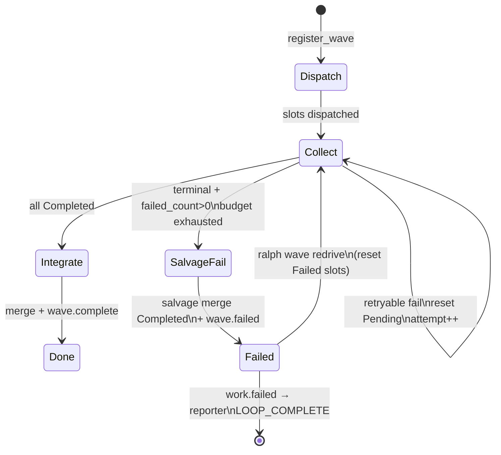
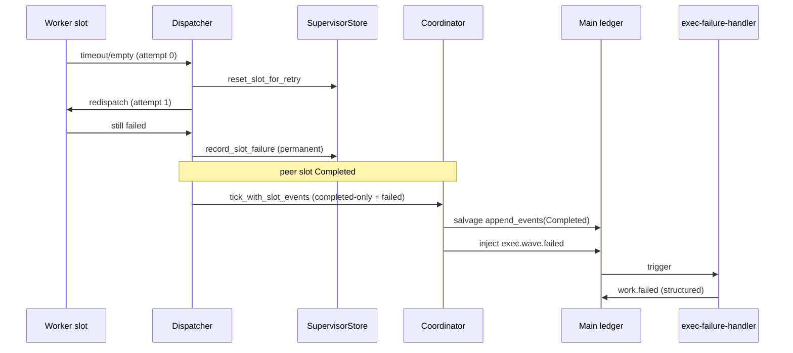

# fix: supervisor slot activity 重试、salvage merge 与 operator redrive

## Goal Capsule

把 supervisor wave slot 做成 Temporal-style activity：任一槽 `ready→running→done/failed` 在主账本可对账；可重试失败在波内自动重派（预算 1–2）；预算耗尽后 **salvage merge** 已 Completed 槽业务事件再注入 `*.wave.failed`；失败类结构化交给 `work.failed`/`plan.blocked`→reporter；operator 用 `ralph wave redrive` 重开失败槽，禁止靠手工补 `exec.unit.done` 绕过 FlowStepScope。

**权威**：本文件 Product Contract + KTDs。003/004 必须先落地（用户确认 1.A）。  
**停止条件**：Verification Contract 全绿；Definition of Done 勾选；未宣称「能判断 LLM 是否还在思考」。  
**Product Contract preservation**：ce-plan-bootstrap；用户已确认 1.A / 2.A / 3.A。

---

## Product Contract

### Summary

在 003（emit 通道对账）与 004（timeout/never_started 诊断）之上，补齐工业 durable activity 缺口：波内自动 slot retry、失败波次 salvage merge、结构化失败终态、以及 FlowStepScope 合规的 operator redrive。不重做 003/004 已覆盖的 allowlist / public wave_id / timeout 真值表。

### Requirements

- R1. 可重试 slot 失败在记入永久 `Failed` 前，于**同一 public wave_id** 内自动 redispatch，预算默认 1（初始执行 + 1 次重试），配置上限 2。
- R2. 仅 `retryable` reason 触发自动重试；永久失败 reason 立即终态（见 KTD）。
- R3. 自动重试耗尽且 `evaluate_phase` 判定 Failed 时：先 **salvage merge** 所有 `Completed` 槽业务事件进主 ledger，再注入 `*.wave.failed`（仍 fail-closed，不是 silent partial complete）。
- R4. `*.wave.failed` payload 必须携带：`wave_id`、`reason`、`blocking_slots`（仅 Failed/Cancelled）、`salvaged_slots`、`redrive_slots`、`slot_failures`（每槽 `{slot_index, reason}`）。
- R5. `Completed` 永不进入 `blocking_slots`（回归钉死 003/004/F-003）。
- R6. `exec-failure-handler` 将结构化失败映射为 **恰好一条** `work.failed`（必填字段保留）并附带 `failure_class` / `redrive_slots` / `salvaged_slots`；reporter 必消费并 `LOOP_COMPLETE`。不在同一 activation 再发 `plan.blocked`（isolated 单事件预算；reporter 已订 `work.failed`，语义等同失败终态）。
- R7. 失败类枚举（机器字段 `failure_class`）至少覆盖：`timeout`、`orphan_or_empty_result`、`identity_mismatch`、`required_slot_failure`、`cancelled`；映射到 `work.failed.reason` 白名单项（见 KTD）。用户口语中的「结构化 plan.blocked」在本 preset 落点为结构化 `work.failed` + 既有 reporter 路径。
- R8. 新增 `ralph wave redrive`：只重跑指定 Failed 槽（默认全部 `redrive_slots`），不重开整个 plan，不要求 agent 手工 `emit exec.unit.done`。
- R9. FlowStepScope 对 hand-patched `exec.unit.done` **继续 fail-closed**；redrive 走 supervisor store + system fan-in 路径。
- R10. 不削弱 003/004 契约；本计划测试矩阵显式回归它们的关键断言。

### Actors

- A1. Wave dispatcher / classifier（机制）
- A2. Supervisor store / coordinator（机制）
- A3. `exec-failure-handler` / `reporter`（preset hats）
- A4. Operator（CLI redrive / diagnose）

### Key Flows

- F1. Slot 首次 `worker_timeout`/`empty_worker_result` → attempt < budget → reset Pending → redispatch → 成功 → Completed → 可 Integrate。
- F2. Slot 重试耗尽 → 永久 Failed → 他槽 Completed → salvage merge Completed 事件 → `exec.wave.failed`（`blocking_slots` 仅失败槽）。
- F3. `exec.wave.failed` → `exec-failure-handler` → 结构化 `work.failed` → `reporter` → `LOOP_COMPLETE`。
- F4. Operator：`ralph wave inspect` 见 Failed + redrive_slots → `ralph wave redrive` → Collect 重开失败槽 → fan-in complete 或再次 failed。
- F5. Operator 手工 `ralph emit exec.unit.done` 仍被 FlowStepScope/`flow_unknown_emit` 拒收。

### Acceptance Examples

- AE1. 两槽 wave：slot0 首次 empty、第 2 次 done → `exec.wave.complete`；store attempt 有记录。
- AE2. slot0 两次均 timeout → 永久 Failed；slot1 Completed → main ledger 有 slot1 的 `exec.unit.done`；`blocking_slots==[0]`；`salvaged_slots==[1]`。
- AE3. `slot_failures` 含 per-slot frozen reason（`worker_timeout` 等），与 004 词汇一致。
- AE4. `work.failed.reason` 为白名单值；reporter 激活并 `LOOP_COMPLETE`。
- AE5. `ralph wave redrive --wave-id <public>` 仅重置 Failed 槽；Completed 槽不动；成功后可 `exec.wave.complete`。
- AE6. hand-patch `exec.unit.done` 仍拒收（表征）。
- AE7. 回归：003 happy emit→Completed；004 Timeout+terminal→Completed；Completed∉blocking_slots。

### Scope Boundaries

**在范围内**

- Store `attempt_count` + retry/reset API
- Dispatcher 自动 redispatch
- Coordinator salvage-then-fail
- `*.wave.failed` / `work.failed` schema 与 preset 同步
- `ralph wave redrive` CLI
- BDD/集成/表征测试 + skill 文档（wave redrive 边界）

**非目标**

- 重做 003 emit allowlist / 004 timeout 真值表实现
- 调 `aggregate_timeout_secs` / `max_concurrent_workers` 默认值
- progress 心跳续租 /「读心」
- exec 与 review 阶段重叠流水线
- 通用 agent-to-agent 聊天总线
- 放宽 FlowStepScope 接受 hand-patched unit.done
- 跨 loop 的自动续跑产品（redrive 以当前 loop + supervisor.db 为界）

### Deferred to Follow-Up Work

- `operator_redrive_grace_secs`（延迟注入 `wave.failed` 给人工窗口）
- Saga 级 git 补偿（CompensationKind::OnPartial 真实现）
- Fix/Review wave 的同等 retry/salvage（本计划以 Exec 为纵向切片；Fix 同构接口预留但不强制全绿）
- DAG UI / 成本预算面板

---

## Planning Contract

### 严格串行

```text
Unit 1 → Unit 2 → … → Unit 14
```

前一 Unit 的实现、测试、重构与回归全部完成后再开下一 Unit。禁止交替开发。

### Key Technical Decisions

- KTD1. **depends_on 003+004**（session-settled: user-directed — chosen over 自包含重写：避免双轨冲突）。
- KTD2. **失败波次 salvage merge**（session-settled: user-directed — chosen over 失败不 merge：主账本可见已成功槽，支撑无人值守与 redrive）。仍注入 `*.wave.failed`；不是 silent partial complete（KTD-8 保留）。
- KTD3. **波内自动 retry 预算默认 1、上限 2**（session-settled: user-directed — chosen over 仅 operator / 混合：对齐 dimension-retry 先例 `MAX_DIMENSION_RETRIES_PER_SLOT=1`）。
- KTD4. **Retryable reasons（自动）**：`worker_timeout`、`empty_worker_result`、`missing_worker_terminal`、`slot_never_started`（仅当随后被调度到）。**Non-retryable**：`conflicting_worker_terminal`、`invalid_control_plane_path`、`worker_cancelled`、以及 cancel/aggregate 波级失败。
- KTD5. **重试落点**：在 dispatcher 将可重试 outcome 记为永久 `record_slot_failure` **之前**，调用 `reset_slot_for_retry`（Failed/动态失败 → `Pending`，`attempt_count++`），再 `try_dispatch_next`；**同一 public wave_id**，不新开 wave（避免拆 `wave_total`）。
- KTD6. **Salvage 动作**：新 `CoordinatorAction::SalvagedAndFailed`（或等价）：对 completed-only `slot_events` 调 `merge_sink.append_events`，再 `set_wave_phase(Failed)` + 返回 InjectedFailed 载荷扩展字段；`merged_to_events` 语义：salvage 成功后标记「已 salvage」，recovery 不得 double-merge（可用既有 `merged_to_events` **或** 新增 `salvage_merged` 列——实现时选**最小**改动；若复用 `merged_to_events`，必须更新 recovery 注释：Failed+merged 表示 salvage，不是 complete）。
- KTD7. **failure_class 映射**（payload 字段，非替换 `reason`）：
  - 波级 `timeout` → `failure_class=timeout`，`work.failed.reason=aggregate_timeout`（或既有白名单等价）
  - 槽 `empty_worker_result` / orphan 家族 → `orphan_or_empty_result` → `upstream_dependency_failed`
  - public/store identity 拒收 → `identity_mismatch` → `upstream_dependency_failed`
  - `required_slot_failure` → `required_slot_failure` → `upstream_dependency_failed`
  - `cancelled` → `cancel`
  - reporter 已把 `work.failed` 当失败终态；**不强制**再发第二条 `plan.blocked`（单事件预算）。结构化字段挂在 `work.failed` + `exec.wave.failed`；若 preset 坚持 `plan.blocked` 文案，由 failure-handler **二选一**：优先 `work.failed`（现拓扑），字段对齐 R6。
- KTD8. **Operator redrive**：`ralph wave redrive` 挂在既有 `WaveCommands`；读 store；仅 Failed 槽 → Pending（operator 路径重置 attempt 或使用独立 `operator_redrive_count`）；`set_wave_phase(Collect)`；进程内触发 dispatch/fan-in 或写控制信号让运行中 loop 下一 tick 拾取。若 `work.failed`/`LOOP_COMPLETE` 已写入主账本，CLI **拒绝**并提示「salvage 已在 ledger；请新开 focused run」——诚实边界，不假装能时光倒流。
- KTD9. **FlowStepScope 保持 fail-closed**（与 003 非目标一致）。
- KTD10. **Fix wave 同构**：store/coordinator API 对 `WaveKind::Fix` 可用；本计划验收以 Exec 为主；Fix 至少有 1 条单元/契约测证明 API 不 Exec-only hardcode。
- KTD11. **配置**：`SupervisorConfig.slot_retry_budget: u32` 默认 1，clamp 0..=2；`0` 表示关闭自动重试（仅测/逃生）。

### Assumptions

- 003/004 在实现本计划前已合并或本分支可依赖其行为（emit channel 通、timeout 分类正确）。
- Salvage 后 integrator **不会**被 `exec.wave.failed` 唤醒（仍只订 `exec.wave.complete`）；已 merge 的 unit 事件供诊断/后续 focused run，不假装 exec 阶段成功。
- Operator redrive 与自动 retry 共享 store 状态机，但不共享「延长 wave.failed 注入」的 grace（grace 属 Deferred）。

### High-Level Technical Design





### Patterns to Follow

- Phase 纯函数 + coordinator 写 phase：`crates/ralph-core/src/supervisor/phase.rs`、`coordinator.rs`
- Frozen reason：`worker_outcome.rs` `REASON_*`
- Fan-in 单点注入：`run_supervisor_fan_in` / `build_wave_failed_payload`
- 预算计数先例：`wave_tracker.rs` dimension retry（**不要**复用其 JSONL resume 到 agent emit）
- Bridge 契约：`plan_b_contract.rs`、`wave_supervisor.rs`
- CLI 扩展：`crates/ralph-cli/src/wave.rs` `WaveCommands::{Emit,Verify,Inspect}`

### Alternative Approaches Considered

| 方案 | 结论 |
|---|---|
| 失败不 merge，仅靠 redrive 新波次 | 拒：半成功工作对 operator/诊断仍不可见（用户选 2.A） |
| 仅 operator 重试、无自动 | 拒：无人值守主路径仍常挂（用户选 3.A） |
| 放宽 FlowStepScope 接受补发 unit.done | 拒：正确 fail-closed；用 redrive/system 路径替代 |
| 新开 wave_id 做自动 retry | 拒：破坏 fan-in `wave_total` 身份（solutions: batch-in-single-emit） |

---

## 1. 功能目标

### 业务目标

- Supervisor 并发 exec 波次在部分槽失败时仍可无人值守收敛或给出可行动终态。
- 已成功槽的业务结果不因 sibling 失败而从主账本消失。
- Operator 有合规逃生舱，不必手工补事件。

### 本次范围

见 Product Contract Requirements R1–R10。

### 非目标

见 Scope Boundaries。

### 已知约束和假设

- HARD RULE：`cargo nextest`；hat env scrub；preset/schema 下游同步清单；skill 去计划化。
- 机构教训：先 003 通道再 salvage；`blocking_slots` 禁全量；禁止 emission-store 语义放宽换绿。

---

## 2. BDD 行为规格

```gherkin
Feature: Supervisor slot activity retry, salvage, and redrive
  Supervisor exec waves treat each slot as a durable activity with
  bounded automatic retry, salvage merge on wave failure, and an
  operator redrive path that does not bypass FlowStepScope via
  hand-patched unit.done events.

  Background:
    Given plans 003 and 004 behaviors are available
    And supervisor.enabled is true
    And slot_retry_budget is 1

  Scenario: S1 Happy — retryable failure then success closes wave
    Given an exec wave with 1 slot
    And the first worker attempt ends with empty_worker_result
    When the dispatcher applies automatic retry
    And the second attempt emits exec.unit.done on the worker channel
    Then the store slot is Completed
    And fan-in injects exec.wave.complete

  Scenario: S2 Illegal — non-retryable failure is permanent immediately
    Given a slot fails with conflicting_worker_terminal
    When classify/record runs
    Then the slot is Failed with no automatic redispatch
    And attempt_count is not used to hide the failure

  Scenario: S3 Boundary — budget exhausted stops retry
    Given slot_retry_budget is 1
    And two consecutive worker_timeout outcomes on the same slot
    When the second failure is recorded
    Then the slot is permanently Failed
    And no third automatic dispatch occurs

  Scenario: S4 State — Completed never appears in blocking_slots
    Given slot 0 Completed and slot 1 permanently Failed
    When fan-in evaluates the wave
    Then blocking_slots equals [1]
    And salvaged_slots equals [0]

  Scenario: S5 Salvage — Completed business events reach main ledger on wave.failed
    Given S4 preconditions
    When coordinator takes the salvage-and-fail path
    Then main ledger contains slot 0 exec.unit.done
    And exec.wave.failed is injected once
    And exec.wave.complete is not injected

  Scenario: S6 Failure class — structured work.failed reaches reporter
    Given exec.wave.failed with reason required_slot_failure and slot_failures
    When exec-failure-handler runs
    Then it emits exactly one work.failed with failure_class and redrive_slots
    And reporter consumes work.failed and emits LOOP_COMPLETE

  Scenario: S7 Operator redrive — failed slots only
    Given a Failed wave with salvaged_slots=[0] and redrive_slots=[1]
    When the operator runs ralph wave redrive for that public wave_id
    Then only slot 1 returns to Pending/Collect
    And slot 0 remains Completed
    And a subsequent successful worker on slot 1 can yield exec.wave.complete

  Scenario: S8 Recovery — hand-patched exec.unit.done still rejected
    Given the loop is on exec_wave after wave.failed
    When an operator emits exec.unit.done outside the worker channel/system path
    Then FlowStepScope or policy rejects it with flow_unknown_emit or equivalent
    And the documented escape hatch is ralph wave redrive

  Scenario: S9 Config — budget 0 disables automatic retry
    Given slot_retry_budget is 0
    And a retryable empty_worker_result occurs
    When record runs
    Then the slot is permanently Failed without redispatch
```

---

## 3. 验收与测试策略

| Scenario | 验收条件 | 推荐测试层级 | 是否需要 E2E |
|---|---|---|---|
| S1 Happy retry→complete | 第 2 次 attempt Completed + wave.complete | 集成 `wave_supervisor` | 否 |
| S2 Non-retryable | 无 redispatch | 单元 classify/retry policy | 否 |
| S3 Budget exhaust | 恰 1 次 retry | 单元 + 集成 | 否 |
| S4 blocking_slots | `==` Failed 集 | 单元 phase + fan-in | 否 |
| S5 Salvage merge | main 有 Completed 事件 + failed coord | 集成 fan-in + merge sink | 否 |
| S6 work.failed→reporter | 结构化字段 + LOOP_COMPLETE | BDD scenario supervisor | 可选 1 条 mock |
| S7 redrive CLI | 仅 Failed 重置 | 集成 CLI `wave` + store | 否 |
| S8 hand-patch 拒收 | 表征仍红/绿按契约 | 单元/集成 FlowStepScope | 否 |
| S9 budget 0 | 无自动 retry | 单元 | 否 |

---

## 4. 需求—测试追踪矩阵

| 需求 | Scenario | 验收测试 | 单元测试 | 集成/契约测试 | E2E |
|---|---|---|---|---|---|
| R1 auto retry | S1,S3 | ATDD wave_supervisor | attempt_count / reset API | fan-in after retry | 否 |
| R2 retryable set | S2,S9 | ATDD policy table | `is_retryable_slot_reason` | — | 否 |
| R3 salvage | S5 | ATDD ledger 含 unit.done | coordinator SalvagedAndFailed | run_supervisor_fan_in | 否 |
| R4 payload | S4,S5 | ATDD JSON 字段 | build_wave_failed_payload | plan_b_contract | 否 |
| R5 blocking | S4 | 表征 | phase blocking_slot_indices | — | 否 |
| R6 handler/reporter | S6 | BDD expected.events | — | scenarios/supervisor | 可选 |
| R7 failure_class | S6 | schema + mapping 测 | map_failure_class | preset_lint | 否 |
| R8 redrive CLI | S7 | CLI 集成 | store reopen | wave.rs | 否 |
| R9 FlowStepScope | S8 | 表征 | flow_step_scope | — | 否 |
| R10 003/004 回归 | AE7 | 既有测名全绿 | — | wave_supervisor 子集 | 否 |

---

## Implementation Units

### U1. Characterization：钉死今日 fail_wave 不 merge Completed 事件

- **Unit 目标**：用失败测试证明 partial failure 路径主 ledger **没有** Completed 槽的 `exec.unit.done`（salvage 缺口闸门）。
- **对应 Scenario**：S5 的 Red 前置。
- **外部可观察结果**：新测试在修复前失败（断言「应有 salvage」）或写成 characterization「今日无 salvage」再在 U6 翻转——**推荐**：先写目标行为 ATDD（期望有 merge），U1 只提交测试，保持 Red。
- **输入与输出**：两槽 fixture；slot0 Completed events；slot1 Failed；fan-in → ledger。
- **可依赖**：003/004、既有 `test_production_fan_in_partial_failure_injects_failed`。
- **禁止依赖**：retry API、redrive CLI。
- **Files**：`crates/ralph-cli/src/loop_runner/tests/wave_supervisor.rs`（只加测）。
- **验收测试**：`wave_supervisor.rs` 新用例名含 `salvage`。
- **需要拆分的单元测试**：无（本 Unit 纯 ATDD Red）。
- **Red 预期失败原因**：`fail_wave` 跳过 merge。
- **最小实现范围**：只加测试。
- **集成验证**：`cargo nextest run -p ralph-cli -- salvage`（或全名）。
- **回归范围**：既有 partial_failure 断言「无 complete」必须仍成立。
- **完成标准**：Red 稳定可复现。
- **风险**：不要改坏「无 wave.complete」断言。

### U2. Store：`attempt_count` + `reset_slot_for_retry`

- **Unit 目标**：SupervisorStore 能记录 attempt，并在预算内把槽从失败路径重置为 `Pending`。
- **对应 Scenario**：S1,S3。
- **外部可观察结果**：`attempt_count` 可读；reset 后 `try_dispatch_next` 可选中该槽。
- **输入与输出**：wave_id, slot_index, budget。
- **可依赖**：U1（可并行思想但串行执行上 U1 已完成）。
- **禁止依赖**：dispatcher 自动接线、salvage。
- **Files**：`crates/ralph-core/src/supervisor/{mod,memory,rusqlite,migrations,bridge}.rs`；`crates/ralph-cli/src/loop_runner/wave/supervisor_bridge.rs`（透传）。
- **验收测试**：`memory.rs` / `rusqlite` store 单测。
- **需要拆分的单元测试**：reset 拒绝 Completed；reset 在 attempt≥budget 时 Err；idempotent。
- **Red 预期**：无 API / 无列。
- **最小实现范围**：trait + memory + rusqlite migration；bridge 透传。
- **集成验证**：`cargo nextest run -p ralph-core -- supervisor`；`integration_supervisor_runtime_p0` 相关。
- **回归范围**：`record_slot_failure` first-terminal-wins。
- **完成标准**：API 单测绿；migration 可逆/向前。
- **风险**：SQLITE_BUSY——沿用 busy_timeout，不放宽状态机。

### U3. 纯函数：`is_retryable_slot_reason` + budget 决策

- **Unit 目标**：冻结可重试 reason 表与「是否还可 retry」纯函数。
- **对应 Scenario**：S2,S3,S9。
- **外部可观察结果**：表驱动测试锁定 KTD4/KTD11。
- **输入与输出**：`(reason, attempt_count, budget) -> Retry|Permanent`。
- **可依赖**：U2 的 attempt 语义（数字）。
- **禁止依赖**：I/O、dispatcher。
- **验收测试**：新模块或 `worker_outcome.rs` 旁单测。
- **需要拆分的单元测试**：每个 frozen reason 一行。
- **Red 预期**：函数不存在。
- **最小实现范围**：纯函数 + 单测；不接线。
- **集成验证**：单元即可。
- **回归范围**：既有 REASON_* 字符串不变。
- **完成标准**：表全绿。
- **风险**：勿把 `conflicting_worker_terminal` 标成可重试。

### U4. Config：`SupervisorConfig.slot_retry_budget`

- **Unit 目标**：YAML 可配，默认 1，clamp 0..=2（先于 dispatcher 接线，避免 U5 读不到字段）。
- **对应 Scenario**：S9。
- **外部可观察结果**：parse 测；preset 可选显式写出。
- **输入与输出**：YAML → config。
- **可依赖**：U2/U3（无硬依赖；可只依赖 KTD11）。
- **禁止依赖**：dispatcher 行为、preset 大改。
- **Files**：`crates/ralph-core/src/config/loop_config.rs`（及既有 config 单测模块）。
- **验收测试**：`loop_config.rs` 单测。
- **需要拆分的单元测试**：默认、越界 clamp（**钉死：parse 时 clamp 到 0..=2**）。
- **Red 预期**：字段不存在。
- **最小实现范围**：`SupervisorConfig` + serde + 测试。
- **集成验证**：config 测。
- **回归范围**：既有 supervisor YAML parse。
- **完成标准**：默认 1；3→clamp 2。
- **风险**：deny_unknown_fields 下旧配置仍可加载。

### U5. Dispatcher：可重试失败自动 redispatch

- **Unit 目标**：worker 结束后，retryable 且 attempt < budget 时 reset+再派，不写永久 Failed。
- **对应 Scenario**：S1,S3,S9。
- **外部可观察结果**：日志/测可见第二次 spawn；预算耗尽走 `record_slot_failure`。
- **输入与输出**：`WaveWorkerOutcome` / classify 结果。
- **可依赖**：U2,U3,U4；003 通道。
- **禁止依赖**：salvage、redrive CLI。
- **Files**：`crates/ralph-cli/src/loop_runner/wave/dispatcher.rs`；`crates/ralph-cli/src/loop_runner/tests/wave_supervisor.rs`。
- **验收测试**：`wave_supervisor` 或 dispatcher 测：empty→retry→done。
- **需要拆分的单元测试**：budget 0 分支。
- **Red 预期**：今日一次终态。
- **最小实现范围**：`dispatcher.rs` 完成路径；读 `SupervisorConfig.slot_retry_budget`。
- **集成验证**：`cargo nextest run -p ralph-cli -- wave_supervisor`。
- **回归范围**：non-retryable、cancel、dimension-retry 路径。
- **完成标准**：S1/S3/S9 对应测绿。
- **风险**：重试必须复用同一 public wave_id 与 per-slot channel 规则（003）。

### U6. Coordinator：SalvagedAndFailed（merge Completed 再 Failed）

- **Unit 目标**：实现 KTD6；翻转 U1 测试为绿。
- **对应 Scenario**：S4,S5。
- **外部可观察结果**：merge sink 含 completed-only；action 为失败 topic；phase Failed。
- **输入与输出**：snapshot + slot_events。
- **可依赖**：U1 Red。
- **禁止依赖**：CLI redrive。
- **Files**：`crates/ralph-core/src/supervisor/coordinator.rs`；必要时 `merge_sink.rs`。
- **验收测试**：coordinator 单测 + U1 ATDD 转绿。
- **需要拆分的单元测试**：无 Completed 时 salvage 为空仍 InjectedFailed；merge Err → 不标 merged（对齐 KTD-7 merge retry）。
- **Red 预期**：U1。
- **最小实现范围**：`coordinator.rs` + `CoordinatorAction` 变体；`run_supervisor_fan_in` 接线可放 U7。
- **集成验证**：core supervisor 测。
- **回归范围**：纯 `InjectedFailed` 无 completed events 路径。
- **完成标准**：U1 绿；无 wave.complete。
- **风险**：`merged_to_events` 与 recovery 语义——测 recovery skip 不 double-merge。

### U7. Fan-in 接线：`build_wave_failed_payload` 扩展字段

- **Unit 目标**：生产 `run_supervisor_fan_in` 走 salvage；payload 含 `salvaged_slots`/`redrive_slots`/`slot_failures`。
- **对应 Scenario**：S4,S5,S6。
- **外部可观察结果**：系统注入 JSON 含新字段。
- **输入与输出**：CompletedWave + store snapshot。
- **可依赖**：U6。
- **禁止依赖**：preset hat 文案大改（U9）。
- **Files**：`crates/ralph-cli/src/loop_runner/wave/dispatcher.rs`；`crates/ralph-core/src/supervisor/plan_b_contract.rs`。
- **验收测试**：`wave_supervisor` partial failure 扩展断言；`plan_b_contract` 更新。
- **需要拆分的单元测试**：`build_wave_failed_payload` 表驱动。
- **Red 预期**：payload 缺字段。
- **最小实现范围**：`dispatcher.rs` payload builder + fan-in 分支。
- **集成验证**：fan-in 测。
- **回归范围**：review wave failed 仍用 `missing_dimensions`（勿破坏）。
- **完成标准**：Exec/Fix failed payload 含扩展字段；Review 不变或显式不影响。
- **风险**：schema required_fields 同步见 U8——本 Unit 可先 optional 字段，U8 再升 required。

### U8. Schema + preset_lint：`exec.wave.failed` / `work.failed` 字段

- **Unit 目标**：SSOT schema 增加字段；strict lint 绿；downstream checklist。
- **对应 Scenario**：S6。
- **外部可观察结果**：`ralph preset check -H builtin:ce-executor-supervisor --strict` 绿。
- **输入与输出**：`presets/schemas/ce-executor-supervisor.yml` + en yml schemas 块。
- **可依赖**：U7 字段名稳定。
- **禁止依赖**：redrive CLI。
- **验收测试**：`preset_lint` + `presets` parity nextest。
- **需要拆分的单元测试**：schema parse required_fields。
- **Red 预期**：缺字段 lint/契约失败。
- **最小实现范围**：schema；`work.failed` 增加 optional→required 策略：**新字段先 optional 以免打破旧 injector**，但 ATDD 断言生产路径始终写出；若选 required，必须同步所有测试 fixture。
- **集成验证**：preset_lint 全量相关。
- **回归范围**：其它 builtin preset 不误伤。
- **完成标准**：strict lint 绿；HARD RULE 下游清单已勾。
- **风险**：系统注入不受 agent emit schema 限，但 CLI inspect/诊断可能读 schema——保持一致。

### U9. Preset：`exec-failure-handler` + `reporter` 消费结构化失败

- **Unit 目标**：handler instructions 要求读取 `failure_class`/`redrive_slots`/`slot_failures`，映射 `work.failed.reason`；reporter 确认消费 `work.failed` 终态。
- **对应 Scenario**：S6。
- **外部可观察结果**：BDD `expected.events` 含 `work.failed` + `LOOP_COMPLETE`。
- **输入与输出**：preset YAML instructions（hat 视角，引用 skill，不复述实现名）。
- **可依赖**：U8。
- **禁止依赖**：发明 hat 可读 supervisor.db。
- **验收测试**：`crates/ralph-core/tests/scenarios/supervisor/*.yml` 新或扩场景；`run_workflow_guard_scenario`。
- **需要拆分的单元测试**：无（避免文案锁测）。
- **Red 预期**：场景缺事件。
- **最小实现范围**：preset instructions + 必要时 schema 示例字段；**禁止**把 plan id 写入 `ralph-tools*.md`。
- **集成验证**：scenarios nextest。
- **回归范围**：成功路径 `exec.wave.complete` 场景。
- **完成标准**：S6 BDD 绿。
- **风险**：单事件预算——handler 只发 `work.failed`，不兼发 `plan.blocked`。

### U10. `failure_class` 映射纯函数 + shipper_reason 对齐

- **Unit 目标**：集中映射波级/槽级 reason → `failure_class` + `work.failed.reason` 白名单值。
- **对应 Scenario**：S6。
- **外部可观察结果**：单测锁定映射表。
- **输入与输出**：`(FailedReason, &[slot_reason]) -> FailureClass`。
- **可依赖**：U7/U9。
- **禁止依赖**：CLI。
- **验收测试**：core 单测；若触及 `shipper_reason`，补白名单测。
- **需要拆分的单元测试**：每种 failure_class。
- **Red 预期**：无映射。
- **最小实现范围**：小模块 + dispatcher/handler 文档化字段填充（机制侧填 payload；hat 只抄字段）。
- **集成验证**：payload 测。
- **回归范围**：既有 plan.blocked reason 白名单。
- **完成标准**：映射表与 KTD7 一致。
- **风险**：不要把自由文本 reason 当可恢复。

### U11. CLI：`ralph wave redrive`

- **Unit 目标**：实现 R8/S7；OPAC：先 inspect 再 redrive。
- **对应 Scenario**：S7。
- **外部可观察结果**：`ralph wave redrive --help`；成功 JSON/text；拒绝条件明确。
- **输入与输出**：`--wave-id`、可选 `--slots`、`--config`。
- **可依赖**：U2 reset、U6/U7 Failed 波次状态。
- **禁止依赖**：放宽 FlowStepScope。
- **Files**：`crates/ralph-cli/src/wave.rs`；相关 CLI 集成测（`tests/` 下 wave 或新建 focused 测，沿用 `common::ralph_bin` scrub）。
- **验收测试**：`crates/ralph-cli` wave 集成测（临时 store fixture）。
- **需要拆分的单元测试**：参数校验（空 id、slot 非 Failed）。
- **Red 预期**：子命令不存在。
- **最小实现范围**：`wave.rs` 新子命令；复用 store/bridge；**不**调用 agent emit unit.done。
- **集成验证**：nextest `-p ralph-cli -- wave`。
- **回归范围**：inspect/emit/verify。
- **完成标准**：S7 绿；已 LOOP_COMPLETE 时拒绝文案稳定。
- **风险**：与运行中 loop 并发写 store——文档要求停 loop 或单写者；测用单进程。

### U12. 表征：hand-patched `exec.unit.done` 仍拒收

- **Unit 目标**：钉死 S8；文档/CLI 错误提示指向 `ralph wave redrive`。
- **对应 Scenario**：S8。
- **外部可观察结果**：拒收码不变；用户可见提示可更新。
- **输入与输出**：FlowStepScope fixture。
- **可依赖**：U11 存在（提示字符串可引用）。
- **禁止依赖**：改变 scope 放行。
- **验收测试**：既有 flow_unknown_emit 测 + 可选提示断言。
- **需要拆分的单元测试**：无强制。
- **Red 预期**：若有人「顺手放宽」会红。
- **最小实现范围**：测试 + 必要时 help 文案。
- **集成验证**：相关 core/cli 测。
- **回归范围**：024-005 FlowStepScope 挂载。
- **完成标准**：S8 绿。
- **风险**：提示文案勿写入注入 skill 的计划号。

### U13. BDD Outside-In：失败 salvage → work.failed → LOOP_COMPLETE

- **Unit 目标**：真 EventLoop 场景锁定 F3。
- **对应 Scenario**：S6。
- **外部可观察结果**：`expected.events` 序列。
- **输入与输出**：`tests/scenarios/supervisor/*.yml`。
- **可依赖**：U6–U10。
- **禁止依赖**：live API。
- **验收测试**：`run_workflow_guard_scenario`（禁止 stub `run_scenario`）。
- **需要拆分的单元测试**：无。
- **Red 预期**：缺 salvage 或缺 reporter。
- **最小实现范围**：scenario + mock_responses。
- **集成验证**：`cargo nextest run -p ralph-core --test scenarios -- supervisor`。
- **回归范围**：既有 supervisor 场景。
- **完成标准**：场景绿。
- **风险**：mock 必须走真实 fan-in/coordinator，避免假绿。

### U14. Skill / 补全 / 回归门禁

- **Unit 目标**：`ralph-tools-wave.md`（及必要时 emit）描述 redrive/salvage **可执行**边界；zsh 补全 `wave redrive`；全量回归。
- **对应 Scenario**：横切。
- **外部可观察结果**：`scripts/check-cli-doc-drift.sh` 绿；`ralph wave redrive --help` 与文档一致。
- **输入与输出**：skill md、`scripts/ralph-zsh-plugin.zsh`。
- **可依赖**：U11。
- **禁止依赖**：写入具体 plan id / 事故路径。
- **验收测试**：drift 脚本；help 冒烟。
- **需要拆分的单元测试**：无。
- **Red 预期**：drift 失败。
- **最小实现范围**：文档 + 补全；`cp` 用户插件非必须（计划注明 operator 可选）。
- **集成验证**：`./scripts/run-tests.sh`（最终门禁）。
- **回归范围**：003/004 关键测名、preset_lint、partial_timeout phase2。
- **完成标准**：门禁全绿；剩余风险写入报告。
- **风险**：skill 可读性 HARD RULE。

---

## Verification Contract

- 子集（开发中）：`cargo nextest run -p ralph-core -- supervisor`；`cargo nextest run -p ralph-cli -- wave_supervisor`；`cargo nextest run -p ralph-cli -- wave`；`cargo nextest run -p ralph-core --test scenarios -- supervisor`；`cargo nextest run -p ralph-cli --bin ralph -- preset_lint`。
- 污染复跑（改 CLI spawn 测后）：`RALPH_CURRENT_HAT=executor RALPH_EVENTS_FILE=/tmp/x.jsonl cargo nextest run -p ralph-cli --test <related>`。
- 最终：`./scripts/run-tests.sh`（禁止裸 `cargo nextest run --workspace` 替代）。
- Lint/format：`cargo fmt`；`cargo clippy`（工作区惯例）。
- 文档：`scripts/check-cli-doc-drift.sh`。

---

## Definition of Done

### 全局

- [ ] 所有 Scenario S1–S9 有对应用例且绿
- [ ] 003/004 关键回归断言仍绿
- [ ] preset strict lint 绿
- [ ] `./scripts/run-tests.sh` 绿
- [ ] 无新增 ignore/skip；无削弱断言换绿
- [ ] skill/补全与 `--help` 一致
- [ ] 未验证项与剩余风险已记录（grace 窗口、Fix 全矩阵、跨 loop 续跑）

### 每 Unit

- [ ] ATDD/单元 Red→Green→Refactor 完成
- [ ] 集成与回归范围已跑
- [ ] 完成标准勾选后才进入下一 Unit

---

## 6. 最终质量门禁

- 所有计划内 Scenario 通过
- 所有新增/修改单元测试通过
- 必要集成、契约、BDD 通过
- 无强制新 E2E；若加 mock supervisor smoke，必须绿
- Lint / clippy / fmt / build 通过
- 无新增失败或跳过测试
- **未验证**：`operator_redrive_grace_secs`；Fix/Review 全波次与 Exec 完全对等的产品化；LOOP_COMPLETE 之后的自动续跑
- **剩余风险**：salvage 后 integrator 不运行属刻意；operator 与运行中 loop 并发写 store 需操作纪律；identity_mismatch 类依赖 003 通道修复后才有真实信号

---

## System-Wide Impact

- **Runtime**：supervisor store schema、coordinator 语义、fan-in payload——影响所有 `supervisor.enabled` 波次。
- **Preset**：仅 `ce-executor-supervisor` instructions/schema 必改；其它 preset 不启用则无感。
- **CLI**：`ralph wave` 子命令扩展；补全脚本。
- **Agent skill**：wave 指南增加 redrive；禁止手补 unit.done。

## Risk Analysis & Mitigation

| 风险 | 缓解 |
|---|---|
| salvage 被误认为 wave 成功 | 仍注入 failed；integrator 不订 failed；BDD 断言无 complete |
| 自动 retry 放大 API 费用 | budget clamp ≤2；可配 0 |
| migration 破坏旧 db | 向前兼容加列默认 0；测 memory+sqlite |
| 与 003/004 冲突 | depends_on；回归矩阵 AE7 |
| redrive 与 failure-handler 竞态 | 文档拒绝已终态；测单进程；Deferred grace |

## Sources & Research

- 仓内：`coordinator::fail_wave`、`run_supervisor_fan_in`、`evaluate_phase`、`wave.rs` Inspect/Emit、`worker_outcome` REASON_*、`ce-executor-supervisor` handler/reporter
- 计划：003 emit channel；004 timeout diagnostics
- Solutions：orphan emit、wave batch identity、blocking_slots closure、emission-store busy、isolated pending drain
- 诊断：`docs/report/2026-07-25-ce-executor-supervisor-primary-20260725-130345-diagnosis.md`
- 外部：2026 工业界 Temporal activity 语义作类比；**不**引入 Temporal 依赖（local patterns 足够）

## Execution Direction

各 feature-bearing Unit 默认 **test-first / characterization-first**（U1 先 Red）。涉及 legacy fan-in 时先表征再改行为。
