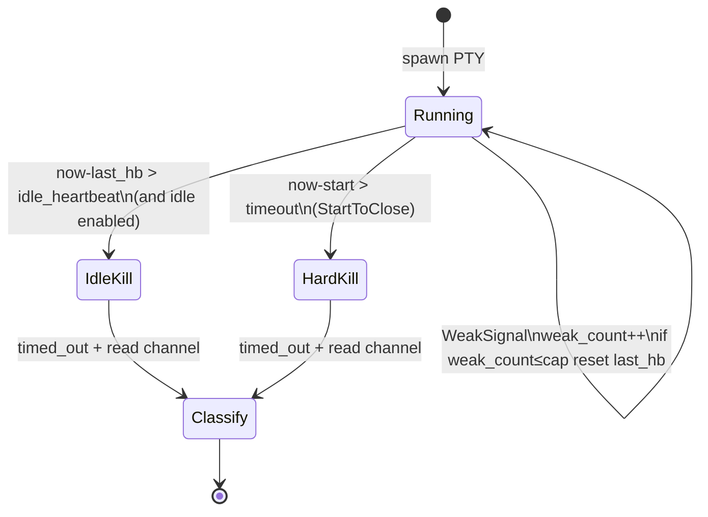
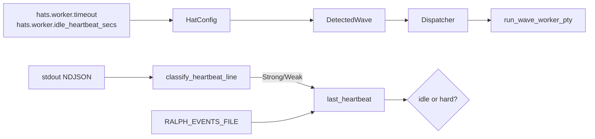

# feat: wave worker idle 心跳续租（双时钟）

## Goal Capsule

把 wave worker（Claude Code / Pi headless PTY 路径）从「spawn 起墙钟到期就杀」改为工业双时钟：**`hat.timeout` = StartToClose 硬顶**；**`hat.idle_heartbeat_secs` = HeartbeatTimeout（静默窗口，preset 可配）**。合格进度信号刷新租约；静默超窗才 kill。不要求模型主动调 heartbeat API。

**权威**：本文件 Product Contract + KTDs。  
**停止条件**：Verification Contract 全绿；Definition of Done 勾选。  
**Product Contract preservation**：ce-plan-bootstrap；用户确认 1B/2A/3A/4A + preset 可配。

---

## Product Contract

### Summary

Wave 并发槽上的长任务合法跑很久时，只要工作环仍有可观测进度（优先 tool stream），就不应被 300s 墙钟误杀；进程假活但无进度时，仍应在短静默窗内失败。字段在 **hat 级 preset YAML** 配置，与 `timeout` 并列。

### Requirements

- R1. `hats.<id>.timeout` 语义固定为 **StartToClose**：自 worker spawn 起的硬顶；到期必须 kill（不论是否有心跳）。
- R2. 新增 `hats.<id>.idle_heartbeat_secs: u32`（preset 可配）：**HeartbeatTimeout**；自上次合格心跳起静默超过该值则 kill。`0` 或省略 → **关闭 idle 模式**，行为与今日一致（仅 StartToClose 墙钟）。
- R3. 新增可选 `hats.<id>.idle_weak_signal_cap: u32`（默认建议 8）：连续仅靠弱信号续租的次数上限；超过后若仍无强信号，视同静默耗尽。
- R4. **强信号**（刷新心跳且重置弱信号计数）：Claude `ToolUse` / `ToolResult`；Pi `ToolExecutionStart` / `ToolExecutionEnd`；Cursor agent 等价 tool 事件；`RALPH_EVENTS_FILE` 行数或 mtime 增长。
- R5. **弱信号**（可刷新心跳但计入弱连续计数）：assistant `Text` / `Thinking` / Pi `TextDelta`。
- R6. 双时钟同时武装时：先触达者生效；kill 后仍走既有 `timed_out` → `read_worker_events` → 004 分类（`worker_timeout` / Completed-if-terminal）。
- R7. 范围仅 **wave worker PTY 路径**（`run_wave_worker_pty`）；不改造主 loop `PtyExecutor` 产品语义（可复用其 last_activity 模式作镜像）。
- R8. `DetectedWave` / dispatcher 把 idle 配置传到 worker；`ce-executor-supervisor` 的 `worker` / `fix-worker` / `review-batch-worker` **显式写出**推荐值（见 KTD）。
- R9. 不要求 agent prompt 调用 heartbeat；skill 文档可说明「orchestrator 观察 stream」，禁止要求模型刷 progress 续命。
- R10. 与 003/004/005 正交：不改 emit 通道、timeout 归因表、slot retry（可并行开发）。

### Actors

- A1. Wave worker runtime（机制）
- A2. Preset 作者 / operator（配置 `idle_heartbeat_secs`）
- A3. Claude / Pi / agent stream（信号源，无协议变更）

### Key Flows

- F1. 配置 `timeout: 1800` + `idle_heartbeat_secs: 120` → 工具持续调用 → 运行可超过 300s 且 &lt; 1800s → 正常 Completed。
- F2. spawn 后 120s 无任何合格信号 → idle kill → `timed_out` + 既有分类。
- F3. 仅弱 text 连续续租超过 `idle_weak_signal_cap` 且无强信号 → idle kill。
- F4. 运行中途触达 `timeout` 硬顶 → StartToClose kill（即使刚有心跳）。
- F5. `idle_heartbeat_secs: 0` 或省略 → 与今日墙钟行为一致（回归）。

### Acceptance Examples

- AE1. idle=120、timeout=600；每 30s 注入 tool 事件 → 存活 &gt; 200s 且最终成功。
- AE2. idle=2、无信号 → ≤3s 内 kill；`timed_out=true`。
- AE3. 仅 text delta，cap=2 → 第三次仅 text 后 idle kill。
- AE4. idle=120 但 timeout=5；持续 tool → 仍在 ~5s StartToClose kill。
- AE5. 省略 idle 字段 + timeout=1 + fixture sleep → 与既有 partial_timeout 测试同族行为。
- AE6. preset YAML `idle_heartbeat_secs: 90` 解析进 `HatConfig` 并到达 worker。

### Scope Boundaries

**在范围内**

- `HatConfig` 新字段 + `DetectedWave` 解析
- `run_wave_worker_pty` 双时钟 loop
- 强/弱信号分类（复用 `extract_readable_delta` / stream parsers）
- 可选 events 文件增长作强信号
- `ce-executor-supervisor` 三 worker hat 显式配置
- 测试 + CONCEPTS + 必要时 skill/preset-author 一句配置说明

**非目标**

- 主 loop `PtyExecutor` 全面换双时钟产品语义
- Tool 内「start 后无 end」专项子超时（Deferred）
- 调默认 `aggregate_timeout_secs` / supervisor collect 时钟
- 模型显式 `ralph heartbeat` 命令作唯一活信号
- worktree git watcher（可选增强 Deferred；本计划 events 文件即可）
- 005 slot retry / 003 emit / 004 归因重写

### Deferred to Follow-Up Work

- Tool-level silence（tool_start 后无 tool_end）
- worktree fs/git 变更作强信号
- 主 loop 与 wave idle 语义完全统一
- 按 unit 复杂度分档默认 idle/timeout

---

## Planning Contract

### 严格串行

```text
Unit 1 → Unit 2 → … → Unit 12
```

### Key Technical Decisions

- KTD1. **`timeout` = StartToClose；`idle_heartbeat_secs` = HeartbeatTimeout**（session-settled: user-directed — chosen over 把 timeout 改义为 idle：保留现有 preset 心智）。
- KTD2. **`idle_heartbeat_secs: 0` 或 `None` = 关闭 idle，仅墙钟**（session-settled 推论 — 回归安全；preset 显式开启）。
- KTD3. **弱信号可续租 + `idle_weak_signal_cap`**（session-settled: user-directed 2A）。
- KTD4. **仅 wave worker 路径**（session-settled: user-directed 3A）。
- KTD5. **Tool 内专项静默 Deferred**（session-settled: user-directed 4A）。
- KTD6. **配置挂 hat 级** `hats.<id>.idle_heartbeat_secs` / `idle_weak_signal_cap`，**不**进 `SupervisorConfig`（避免 deny_unknown_fields；与 `timeout` 并列、per-hat 可覆写）。**命名刻意避开**已有 `cli.idle_timeout_secs` / `autonomous_idle_timeout_secs`（主 loop `PtyExecutor` 滑动空闲窗）——二者语义相近但作用域不同；本字段只服务 wave worker 双时钟。
- KTD7. **ce-executor-supervisor 推荐默认**（写入 preset，可改）：
  - `worker` / `fix-worker`：`timeout: 1800`，`idle_heartbeat_secs: 120`，`idle_weak_signal_cap: 8`
  - `review-batch-worker`：`timeout: 900`，`idle_heartbeat_secs: 90`，`idle_weak_signal_cap: 8`（只读评审通常较短）
- KTD8. **实现模式**：镜像 `PtyExecutor` 的 `last_activity` + 剩余 idle 计算；外层保留 `start.elapsed() >= StartToClose` 检查；**不要**只用单层 `tokio::time::timeout(wave_timeout, whole_stream)`。
- KTD9. **心跳分类纯函数**可单测：输入一行 stdout / 或 events mtime 变化 → `HeartbeatKind::{Strong|Weak|None}`。
- KTD10. **超时后错误文案**：区分 `idle heartbeat exceeded` vs `start-to-close exceeded`（便于 004 诊断；reason 仍可映射 `worker_timeout`，细节进 diagnostics/日志）。

### Assumptions

- Claude `--output-format stream-json` 与 Pi `--mode json` 在 tool 调用时持续有 NDJSON 行；若某后端长时间无行，idle 会杀——属诚实边界。
- 003 通道修复后 events 文件增长可作为强信号；003 未合入时仍可靠 stream tool 事件。
- `HatConfig` 无 `deny_unknown_fields`，新字段可解析。

### High-Level Technical Design





### Patterns to Follow

- Idle 滑动窗：`crates/ralph-adapters/src/pty_executor.rs`（`last_activity`）
- 超时配置解析：`DetectedWave::per_worker_timeout_secs`（`wave_detection.rs`）
- Stream 分类：`extract_readable_delta` / `ClaudeStreamEvent` / `PiStreamEvent`（`wave/io.rs`）
- 现有墙钟测：`loop_runner/tests/wave.rs` partial_timeout 族（回归 AE5）

### Alternative Approaches Considered

| 方案 | 结论 |
|---|---|
| 把 `timeout` 改成 idle | 拒：破坏现有 preset「最长跑多久」语义 |
| 配置放 `event_loop.supervisor` | 拒：deny_unknown_fields + 非 per-hat |
| 只调大 timeout | 拒：真死也等很久 |
| 模型显式 heartbeat 命令 | 拒：不可靠；仅可作未来补充 |

---

## 1. 功能目标

### 业务目标

- 合法长跑的 Claude/Pi wave worker 不被固定墙钟误杀。
- 无进度静默仍快速失败。
- Operator/preset 作者可在 YAML 配置 idle 窗口。

### 本次范围

见 Requirements R1–R10。

### 非目标

见 Scope Boundaries。

### 已知约束和假设

- HARD RULE：nextest；preset 改后 schema/lint/下游清单；skill 去计划化。
- 不引入 Temporal 依赖；语义对齐即可。

---

## 2. BDD 行为规格

```gherkin
Feature: Wave worker idle heartbeat lease
  Wave workers use a dual clock: StartToClose hard cap and an
  optional idle heartbeat window refreshed by work-loop signals
  from Claude/Pi stream-json (and optional events-file growth).

  Background:
    Given a wave worker hat with timeout 600 and idle_heartbeat_secs 120
    And idle_weak_signal_cap is 8

  Scenario: S1 Happy — strong tool signals keep the lease alive past old wall clock
    Given the worker would previously die at 300s wall clock
    And the PTY emits ToolUse or ToolExecutionStart at least every 60s
    When the worker runs for 400s and then completes with unit.done
    Then the process is not killed for idle
    And the slot can complete successfully before StartToClose

  Scenario: S2 Illegal — idle_heartbeat_secs zero disables idle mode
    Given idle_heartbeat_secs is 0 or omitted
    And timeout is 1
    When the worker sleeps past 1s without exiting
    Then StartToClose kills the worker as today
    And behavior matches legacy wall-clock tests

  Scenario: S3 Boundary — silence exceeds idle window
    Given idle_heartbeat_secs is 2
    And no stdout signals after spawn
    When 2s elapse
    Then the worker is killed for idle heartbeat exceeded
    And timed_out is true for downstream classification

  Scenario: S4 Boundary — weak-only signals hit cap
    Given idle_weak_signal_cap is 2
    And only Text/Thinking deltas arrive (no tool, no events growth)
    When the third consecutive weak-only renewal would be needed
    Then the worker is killed for idle (weak cap exhausted)

  Scenario: S5 State — StartToClose wins over healthy heartbeat
    Given timeout is 5 and idle_heartbeat_secs is 120
    And strong signals arrive every second
    When 5s elapse since spawn
    Then the worker is killed for start-to-close exceeded

  Scenario: S6 Config — preset field reaches runtime
    Given hats.worker.idle_heartbeat_secs is 90 in YAML
    When RalphConfig parses and DetectedWave is built
    Then idle_heartbeat_secs effective value is 90
    And run_wave_worker_pty receives that duration

  Scenario: S7 Recovery — timeout with terminal still classifies per 004
    Given idle kill after the channel already has exec.unit.done
    When classify_slot_result runs
    Then the slot is Completed when terminal present
    And empty idle kill remains worker_timeout family
```

---

## 3. 验收与测试策略

| Scenario | 验收条件 | 推荐测试层级 | 是否需要 E2E |
|---|---|---|---|
| S1 强信号续租 | &gt; 旧墙钟仍存活至完成 | 集成 wave fixture（短秒级数） | 否 |
| S2 idle 关闭 | 与 legacy 1s timeout 同族 | 回归既有 partial_timeout / 新表征 | 否 |
| S3 静默 idle kill | ≤ idle+ε kill | 单元/集成 fake stream | 否 |
| S4 弱信号封顶 | cap 后 kill | 单元 classify + 集成 | 否 |
| S5 硬顶优先 | timeout 到必杀 | 集成 | 否 |
| S6 preset 解析 | YAML→HatConfig→DetectedWave | 单元 config + wave_detection | 否 |
| S7 与 004 分类 | terminal/empty 路径 | 单元 classify（依赖 004） | 否 |

---

## 4. 需求—测试追踪矩阵

| 需求 | Scenario | 验收测试 | 单元测试 | 集成/契约 | E2E |
|---|---|---|---|---|---|
| R1 StartToClose | S5 | ATDD hard kill | deadline 计算 | wave worker fixture | 否 |
| R2 idle 字段 | S2,S3,S6 | ATDD parse + kill | HatConfig / DetectedWave | preset parse | 否 |
| R3 weak cap | S4 | ATDD | classify + counter | wave fixture | 否 |
| R4 强信号 | S1 | ATDD | HeartbeatKind::Strong | stream 行注入 | 否 |
| R5 弱信号 | S4 | ATDD | HeartbeatKind::Weak | — | 否 |
| R6 双时钟 | S3,S5 | ATDD | select 决策纯函数 | worker loop | 否 |
| R7 仅 wave | — | 代码审查/无 PtyExecutor 产品改语义 | — | — | 否 |
| R8 supervisor preset | S6 | preset 含字段 + lint | — | preset_lint | 否 |
| R9 无模型心跳义务 | — | skill 无「必须 emit progress 续命」 | — | drift | 否 |
| R10 正交 | S7 | 004 分类测仍绿 | — | worker_outcome | 否 |

---

## Implementation Units

### U1. Characterization：钉死今日 wall-clock `tokio::time::timeout(whole_stream)`

- **Unit 目标**：用测试证明当前 `run_wave_worker_pty` 在无 idle 字段时整段 stream 套单层墙钟。
- **对应 Scenario**：S2 基线。
- **外部可观察结果**：既有 `timeout: 1` + sleep fixture 仍超时；新表征注释标明「整段墙钟」。
- **输入与输出**：`make_test_wave_with_timeout(1)`。
- **可依赖**：既有 `loop_runner/tests/wave.rs` partial_timeout。
- **禁止依赖**：idle 实现。
- **Files**：`crates/ralph-cli/src/loop_runner/tests/wave.rs`（只加注释/表征别名测，可选）。
- **验收测试**：确认至少一条 legacy timeout 测仍存在且绿。
- **需要拆分的单元测试**：无。
- **Red 预期**：本 Unit 不强制 Red（characterization 保绿）。
- **最小实现范围**：文档化基线；零或极少代码。
- **集成验证**：`cargo nextest run -p ralph-cli -- partial_timeout_events_visible`（注意 phase2 串行入口若全量）。
- **回归范围**：三件套 timeout 可见性测。
- **完成标准**：基线测名列入计划回归表。
- **风险**：勿在本 Unit 改生产超时逻辑。

### U2. Config：`HatConfig.idle_heartbeat_secs` + `idle_weak_signal_cap`

- **Unit 目标**：YAML 可解析两字段；默认 `None` / cap 默认常量。
- **对应 Scenario**：S6。
- **外部可观察结果**：parse 测读出数值；未知旧 preset 无字段仍可加载。
- **输入与输出**：YAML 片段 → `HatConfig`。
- **可依赖**：U1。
- **禁止依赖**：worker loop。
- **Files**：`crates/ralph-core/src/config/hat.rs`；`ralph_config` 相关测。
- **验收测试**：`timeout` + `idle_heartbeat_secs` 同 hat 解析；`idle_heartbeat_secs: 0` 保留。
- **需要拆分的单元测试**：缺省为 None；cap 缺省用 `default_idle_weak_signal_cap()`（建议 8）。
- **Red 预期**：字段不存在。
- **最小实现范围**：struct 字段 + serde + 文档注释（标明 HeartbeatTimeout / StartToClose）。
- **同步**：更新 `HatConfig::timeout` 注释为 StartToClose（wave 语境）。
- **集成验证**：`cargo nextest run -p ralph-core -- hat` / config parse。
- **回归范围**：既有 hat YAML fixtures。
- **完成标准**：S6 解析部分绿。
- **风险**：勿加到 `SupervisorConfig`。

### U3. `DetectedWave`：effective idle accessors

- **Unit 目标**：`idle_heartbeat_secs()` / `idle_weak_signal_cap()` / `idle_enabled()`。
- **对应 Scenario**：S2,S6。
- **外部可观察结果**：None/0 → disabled；&gt;0 → enabled。
- **输入与输出**：`DetectedWave` + `HatConfig`。
- **可依赖**：U2。
- **禁止依赖**：PTY。
- **Files**：`crates/ralph-core/src/wave_detection.rs` + 单测。
- **验收测试**：表驱动。
- **需要拆分的单元测试**：默认 300 timeout 不变；idle 独立。
- **Red 预期**：方法不存在。
- **最小实现范围**：accessor only。
- **集成验证**：core 单测。
- **回归范围**：`per_worker_timeout_secs` / aggregate 优先级。
- **完成标准**：accessors 绿。
- **风险**：勿把 idle 误接到 aggregate_timeout。

### U4. 纯函数：`classify_heartbeat_line` / `HeartbeatKind`

- **Unit 目标**：一行 stdout → Strong | Weak | None；与 backend format 相关。
- **对应 Scenario**：S1,S4。
- **外部可观察结果**：表驱动钉死 Claude/Pi/Agent/Text。
- **输入与输出**：`(BackendOutputFormat, &str) -> HeartbeatKind`。
- **可依赖**：既有 parsers（可调用或复用 extract 逻辑）。
- **禁止依赖**：kill 逻辑。
- **Files**：建议 `crates/ralph-cli/src/loop_runner/wave/heartbeat.rs`（新）或 `io.rs` 旁；单测同文件。
- **验收测试**：ToolUse→Strong；Text→Weak；无关 JSON→None。
- **需要拆分的单元测试**：每种 backend 至少 2 例。
- **Red 预期**：模块不存在。
- **最小实现范围**：纯函数 + 测；可内部调用现有 parse。
- **集成验证**：单元即可。
- **回归范围**：`extract_readable_delta` 行为不改（可共用 parse，勿破坏 TUI 预览）。
- **完成标准**：S1/S4 信号分类绿。
- **风险**：Thinking 标 Weak 非 Strong。

### U5. 纯函数：lease 决策（idle vs hard vs continue）

- **Unit 目标**：给定 `start`、`last_hb`、`now`、`weak_count`、配置 → `Continue | IdleKill | HardKill`。
- **对应 Scenario**：S3,S4,S5。
- **外部可观察结果**：表驱动状态机测。
- **输入与输出**：结构体 `LeaseSnapshot` → enum。
- **可依赖**：U3 语义数字。
- **禁止依赖**：tokio/PTY。
- **Files**：同 `heartbeat.rs`。
- **验收测试**：S3/S4/S5 数值缩到毫秒级。
- **需要拆分的单元测试**：idle disabled 时永不 IdleKill。
- **Red 预期**：函数不存在。
- **最小实现范围**：纯函数。
- **集成验证**：单元。
- **回归范围**：无。
- **完成标准**：状态机绿。
- **风险**：HardKill 优先于 IdleKill 当两者同时到期（钉死顺序）。

### U6. Outside-In：`run_wave_worker_pty` 接入双时钟（idle disabled 路径保绿）

- **Unit 目标**：重构 loop：去掉「整段 `timeout(wave_timeout, stream)`」；改为 select/轮询；**idle 关闭时行为 = U1 基线**。
- **对应 Scenario**：S2。
- **外部可观察结果**：legacy 1s timeout 测仍绿。
- **输入与输出**：`wave_timeout` + `idle_heartbeat` Duration + cap。
- **可依赖**：U3,U5；U4 可先接 None 信号。
- **禁止依赖**：preset 大改。
- **Files**：`crates/ralph-cli/src/loop_runner/wave/worker.rs`；dispatcher 传参。
- **验收测试**：S2 / partial_timeout 回归。
- **需要拆分的单元测试**：无强制（集成为主）。
- **Red 预期**：若误改语义，legacy 红。
- **最小实现范围**：worker + `WorkerRequest` / `run_wave_worker` 签名扩展。
- **Execution note**：先保 idle=0 路径与旧行为差分最小；再开 U7。
- **集成验证**：`cargo nextest run -p ralph-cli -- wave`。
- **回归范围**：spawn failure、partial timeout 三件套。
- **完成标准**：idle disabled 全绿。
- **风险**：aggregate/global deadline 与 per-worker 交互勿破坏。

### U7. 接线：stdout 行 → 心跳刷新

- **Unit 目标**：每行 `classify_heartbeat_line`；Strong/Weak 更新 `last_hb` / `weak_count`；触发 IdleKill。
- **对应 Scenario**：S1,S3,S4。
- **外部可观察结果**：短秒 fixture：注入 NDJSON tool 行可续租；静默则 idle kill。
- **输入与输出**：假后端脚本打印 JSON 行。
- **可依赖**：U4,U5,U6。
- **禁止依赖**：events 文件（U8）。
- **Files**：`worker.rs`；`tests/wave.rs` 新用例。
- **验收测试**：S3 静默；S4 弱封顶；S1 缩时版（idle=1、每 0.3s tool 行、跑 3s 不杀）。
- **需要拆分的单元测试**：已在 U4/U5。
- **Red 预期**：无刷新则 S1 缩时版失败。
- **最小实现范围**：loop 内刷新；kill 原因字符串含 `idle heartbeat`。
- **集成验证**：wave 测。
- **回归范围**：U6。
- **完成标准**：S1/S3/S4 绿。
- **风险**：测试勿依赖真 claude/pi；用 printf JSON fixture。

### U8. 强信号：`RALPH_EVENTS_FILE` 增长

- **Unit 目标**：周期性或每行后检查 events 文件 len/mtime；增长 → Strong（重置 weak_count）。
- **对应 Scenario**：S1 增强；与 003 通道正交受益。
- **外部可观察结果**：无 stdout 但文件增长仍续租。
- **输入与输出**：worker_events_path。
- **可依赖**：U7。
- **禁止依赖**：git watcher。
- **Files**：`worker.rs`。
- **验收测试**：fixture：后台写 channel 行、stdout 静默 → 不 idle kill（在 idle 窗内）。
- **需要拆分的单元测试**：`events_file_progress(prev, next) -> bool`。
- **Red 预期**：未接线则静默 kill。
- **最小实现范围**：轻量 stat；避免热循环昂贵 IO（可每 N 次 loop 或与 stdout 同节拍）。
- **集成验证**：wave 测。
- **回归范围**：结束时 `read_worker_events` 仍正确。
- **完成标准**：events 增长续租测绿。
- **风险**：文件不存在视为无进度，非错误。

### U9. StartToClose 硬顶显式测 + 日志/错误区分

- **Unit 目标**：S5；错误/日志区分 idle vs hard。
- **对应 Scenario**：S5,S7。
- **外部可观察结果**：Err/日志含 `start-to-close` 或 `idle heartbeat`；下游仍 `timed_out`。
- **输入与输出**：kill reason enum 或字符串。
- **可依赖**：U7。
- **禁止依赖**：改 004 reason 常量（除非加可选 detail）。
- **Files**：`worker.rs`；可选 diagnostics。
- **验收测试**：S5；S7 若 004 已合入则联跑 classify。
- **需要拆分的单元测试**：reason 字符串稳定。
- **Red 预期**：无区分文案。
- **最小实现范围**：文案 + 测。
- **集成验证**：wave + worker_outcome（若可用）。
- **回归范围**：004 `worker_timeout` 映射。
- **完成标准**：S5 绿；文案可 grep。
- **风险**：勿引入新 store failure_reason 除非必要；优先日志/Err 详情。

### U10. Preset：`ce-executor-supervisor` 三 worker hat 显式配置

- **Unit 目标**：按 KTD7 写入 `timeout` / `idle_heartbeat_secs` / `idle_weak_signal_cap`。
- **对应 Scenario**：S6。
- **外部可观察结果**：YAML 可读；`RalphConfig::parse` + lint 绿。
- **输入与输出**：`presets/en/ce-executor-supervisor.yml`（及 embedded 同步若需）。
- **可依赖**：U2。
- **禁止依赖**：改 triggers/publishes 拓扑。
- **Files**：`presets/en/ce-executor-supervisor.yml`；若 build embed：`presets/manifest` 流程自动；`crates/ralph-cli` presets 测。
- **验收测试**：`preset_lint` + `presets` parity；结构化断言三 hat 字段存在（**允许**：稳定配置契约，非文案锁测）。
- **需要拆分的单元测试**：解析三值。
- **Red 预期**：字段缺失断言红。
- **最小实现范围**：仅 timeout 相关键；注释用 hat 视角说明「静默多久无工具/事件进度会被中止；总时长上限为 timeout」。
- **集成验证**：`cargo nextest run -p ralph-cli --bin ralph -- preset_lint`；`presets`。
- **回归范围**：strict lint 全 embedded。
- **完成标准**：KTD7 数值落盘；HARD RULE 下游清单勾选（schema 若无关 event schema 可不动；config 字段非 event schema）。
- **风险**：instructions 勿复述实现细节；可引用「总时长 / 静默窗口由 runtime 配置」。

### U11. CONCEPTS + skill/preset-author 配置说明（去计划化）

- **Unit 目标**：词汇表增加 idle heartbeat；preset-author commands/checklist 提及 hat 字段；`ralph-tools-wave` 若需一句「runtime 观察 stream 续租，agent 不必刷 progress 续命」。
- **对应 Scenario**：横切 R9。
- **外部可观察结果**：CONCEPTS 有词条；drift 脚本绿。
- **输入与输出**：`CONCEPTS.md`；`skills/ralph-preset-common/references/` 必要时；`crates/ralph-core/data/ralph-tools-wave.md`。
- **可依赖**：U10。
- **禁止依赖**：写入 plan id / 事故路径。
- **Files**：如上。
- **验收测试**：`scripts/check-cli-doc-drift.sh`（若涉及 CLI help——本计划无新子命令则可 skip）；人工词条存在。
- **需要拆分的单元测试**：无。
- **Red 预期**：无。
- **最小实现范围**：短词条 + 配置表一行。
- **集成验证**：文档检查。
- **回归范围**：无行为。
- **完成标准**：R9 满足。
- **风险**：skill 可读性 HARD RULE。

### U12. 回归门禁与差分说明

- **Unit 目标**：全量相关测 + 记录与 003/004/005 边界。
- **对应 Scenario**：全部。
- **外部可观察结果**：`./scripts/run-tests.sh` 或至少 cli wave + core config + preset_lint 绿。
- **输入与输出**：无生产功能。
- **可依赖**：U1–U11。
- **禁止依赖**：新功能。
- **Files**：无或仅测注释。
- **验收测试**：见 Verification Contract。
- **需要拆分的单元测试**：无。
- **Red 预期**：无新增 skip。
- **最小实现范围**：跑通门禁。
- **集成验证**：nextest 子集 + 最终 run-tests。
- **回归范围**：partial_timeout phase2；wave_supervisor；preset_lint。
- **完成标准**：Definition of Done 勾选。
- **风险**：超时类测 flake → 用短秒 + 事件驱动，忌 sleep 过长。

---

## Verification Contract

- `cargo nextest run -p ralph-core -- wave_detection`（或 hat/config 相关）
- `cargo nextest run -p ralph-cli -- wave`（含新 idle 测与 partial_timeout）
- `cargo nextest run -p ralph-cli --bin ralph -- preset_lint`
- `cargo nextest run -p ralph-cli --bin ralph -- presets`
- 污染复跑（若改 spawn 测）：`RALPH_CURRENT_HAT=worker ... cargo nextest run -p ralph-cli -- wave`
- 最终：`./scripts/run-tests.sh`
- `cargo fmt` / `cargo clippy`

## Definition of Done

### 全局

- [ ] S1–S7 有对应用例且绿
- [ ] idle 关闭时 legacy 墙钟行为保持
- [ ] supervisor 三 worker hat 显式可配字段
- [ ] CONCEPTS / 必要 skill 已更新
- [ ] 无新增 skip；无削弱断言
- [ ] 未验证：tool 内静默、主 loop 统一、git watcher

### 每 Unit

- [ ] TDD 闭环完成后再进入下一 Unit

---

## 6. 最终质量门禁

- 所有计划内 Scenario 通过
- 单元 + 必要集成通过
- 无强制真 E2E（假后端 JSON fixture 足够）
- Lint/clippy/fmt/build 通过
- 无新增失败/跳过
- **剩余风险**：后端长时间无 NDJSON（纯阻塞 syscall）仍可能被 idle 杀——需 tool 级 follow-up；弱信号 cap 数值可能需生产调参

---

## System-Wide Impact

- **配置**：所有 hat 可设 idle；仅 wave 路径消费。
- **Preset**：supervisor 并发 worker 行为变「可长跑」；需监控成本。
- **诊断**：超时日志更可分 idle vs hard。

## Risk Analysis & Mitigation

| 风险 | 缓解 |
|---|---|
| 刷 text 续命 | weak cap（KTD3） |
| 破坏 1s partial_timeout 测 | U6 先保 idle=0 |
| 真 claude 测不稳定 | fixture NDJSON |
| 与 005 并行冲突 | 触碰文件几乎不重叠（worker.rs 超时段 vs dispatcher retry）；合并注意 |

## Sources & Research

- Temporal 双时钟（StartToClose + Heartbeat）
- `pty_executor.rs` last_activity
- `wave/worker.rs` 现墙钟
- `HatConfig::timeout` / `wave_detection.rs`
- 会话结论：Claude/Pi stream tool 事件作工作环心跳

## Execution Direction

各行为 Unit **test-first**；U1 characterization；U6 先保回归再开 idle。
