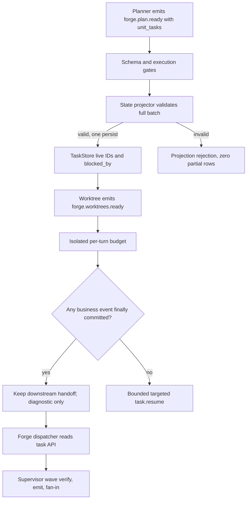
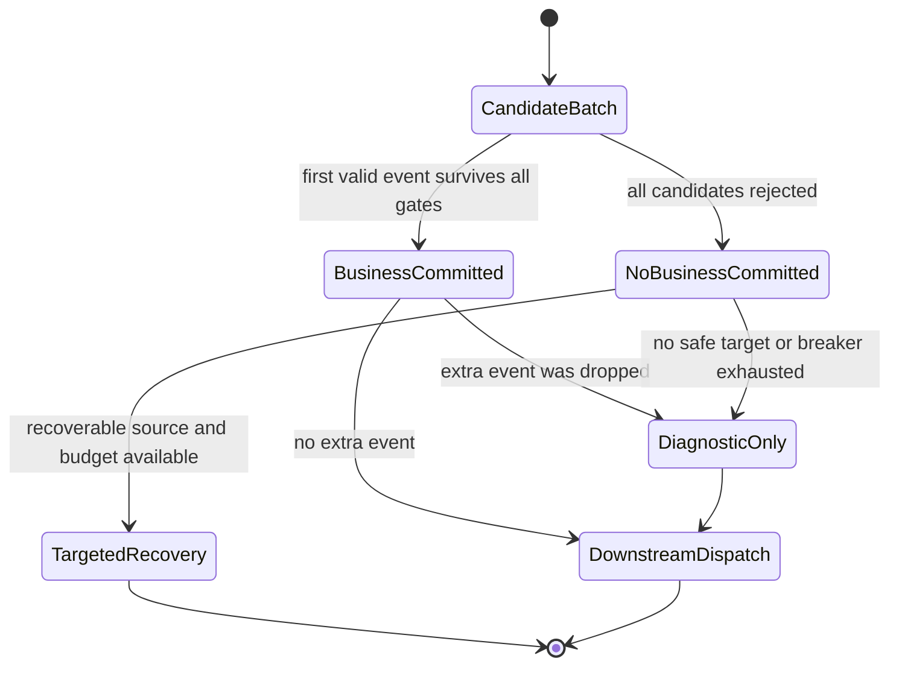
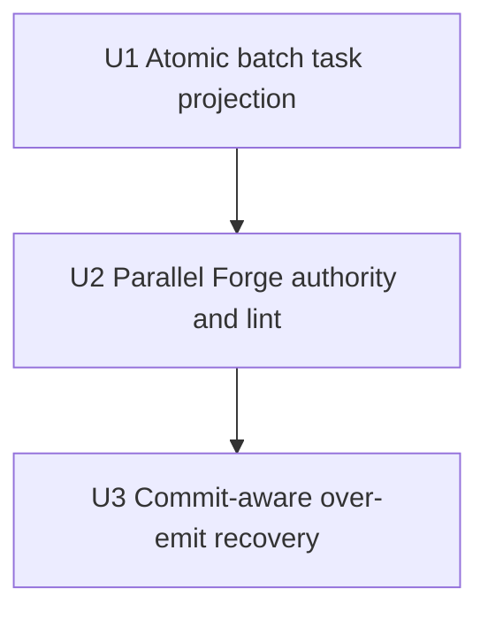

# Parallel Forge Dispatch Contract Root Fix - Plan

## Goal Capsule

- **目标：** 从机制层消除 `parallel-forge` 在 planner task 注册与 isolated over-emit 恢复上的协议冲突，保证合法 `forge.worktrees.ready` 已提交后 `forge-dispatcher` 必须获得下一次有效调度并能基于完整 task DAG 发出 supervisor wave。
- **权威顺序：** 本计划的 Product Contract → KTD → 串行 U-ID → 仓库 `AGENTS.md` / `CLAUDE.md` 硬规则 → 当前源码与测试。
- **执行方式：** 严格按 U1 → U2 → U3；每个 Unit 独立完成 Acceptance Red、Unit Red、Green、Refactor、集成、回归和提交边界后才能进入下一个 Unit。
- **停止条件：** 真实调用链与 Evidence 冲突、预期 Red 未触达目标逻辑、需要新增未计划的公开接口或依赖、任一关键决策置信度降到 0.85 以下。
- **完成归属：** U2 在 task authority 切片内完成 task-to-wave 验收，U3 在 recovery 切片内完成重复 handoff 的最终组合验收、文档同步和全量门禁；不设置“以后补测试”的独立 Unit。

---

## Product Contract

### 0. 计划状态

**READY。** 所有实施关键决策置信度均不低于 0.85，没有 launch-blocking 未决项。

- **代码基线：** `adb518043f5cf8061ae3e90f0a18af2feb525213`。
- **工作区基线：** 计划前仅有未跟踪诊断报告 `docs/report/2026-07-28-parallel-forge-primary-20260728-003922-diagnosis.md`；不得覆盖或夹带其他用户改动。
- **调查范围：** `parallel-forge` preset/schema、task CLI ACL、state projector、isolated per-turn budget、EventBus 调度、supervisor fan-in、preset lint、BDD/E2E、agent skill guide、operator preset skills、相关 git 历史与 `docs/solutions/`。
- **已执行验证：** 源码、配置、测试和 git 历史调查；计划中 3 个 Mermaid block 全部通过 `mermaid-validate`；`./scripts/run-tests.sh` 的 Phase 2（23/23）与 doctest（19 passed、4 ignored）通过，Phase 1 在与本计划无关的既有 `implementation_review_dispatcher_contract_has_no_resume_redrive` 断言处确定性失败；单独 nextest 复跑得到相同失败（E17）。
- **尚未执行验证：** 本计划功能的 Acceptance Red/Green、mock E2E、lint、build、clippy 和 doc drift 由 U1-U3 执行；最终全量必须在 E17 所述基线漂移由其所有者修复后全绿。
- **阻塞项：** 无。

### 1. 功能目标

#### 业务目标

让 preset 作者和 loop operator 可以依赖一个确定契约：一个规划事件原子建立全部 Unit tasks；一个已提交的 handoff 不会被同 activation 的多余事件恢复抢占；配置在启动前即可拒绝 agent 指令与 task authority 不一致。

#### 用户或调用方

- `parallel-forge` operator：期望 planner → tasks → worktrees → dispatcher → supervisor wave 自动推进。
- preset 作者和 reviewer：期望 `ralph preset check --strict` 在运行前发现不可执行的 task mutation 指令。
- EventLoop 调用方：期望 over-emit backpressure 不破坏已经提交的业务事件和下游 pending。
- executor hats：通过公开 task API 读取 projector 创建的 live `task_id`、`task_key` 和依赖状态。

#### 当前行为

1. `parallel-forge` planner instructions 要求直接执行 `ralph tools task add`，但 planner 不在 `tasks.coordinator_hats`，命令会被 `HatCommandPolicy` 拒绝。
2. `parallel-forge` 没有 `event_loop.state_projection` 的 task action；顶部 `state_projection` 仅是状态字段映射，不能创建 `.ralph/agent/tasks.jsonl`。
3. isolated per-turn budget 在保留第一条业务事件、丢弃第二条时立即向原 hat 注入 targeted `task.resume`。
4. `next_hat` 明确让 targeted event 抢占合法 handoff priority，因此 worktree recovery 可压过已排队的 `forge-dispatcher`。
5. 现有 BDD 用 dummy hats 直接构造事件，未覆盖 task ACL、projector task materialization 与 over-emit/dispatch 组合。

#### 目标行为与行为差异

- `forge.plan.ready` 携带完整、结构化 Unit task specs；preset 声明的 state projection 在一次持久化中创建或复用全部 tasks，并解析 task-key 依赖为 live task IDs。
- 批量 payload 缺字段、计数不一致、重复 key、未知依赖或持久化失败时，整批拒绝且 task ledger 不出现部分写入。
- planner 不再调用 task mutation CLI；dispatcher 只读 task API 并使用 projector 生成的 live IDs。
- over-emit feedback 在最终 commit 结果可知后决定：至少一条业务事件已提交时只记录诊断，不注入 publisher-targeted recovery；零业务事件提交时保留有界 targeted recovery。
- strict preset lint 拒绝“instructions 要求 agent task add/ensure，但 hat authority 或 projector ownership 不允许”的配置。
- 真实 EventLoop 验收证明重复 `forge.worktrees.ready` 不会阻止 dispatcher，且 task DAG 能进入 supervisor wave。

#### 输入、输出与状态变化

- **输入：** `forge.plan.ready` JSON payload，包含 `unit_count` 与非空 `unit_tasks[]`；isolated activation 的候选事件批；preset YAML。
- **输出：** 原子更新的 `.ralph/agent/tasks.jsonl`；结构化 `event.isolation.boundary_violation` 诊断；必要时才产生的 targeted `task.resume`；合法 dispatcher/wave events。
- **状态变化：** task rows 从不存在变为 `open`，依赖转成 `blocked_by` live IDs；业务 handoff pending 保持可调度；rejection breaker 只对真正需要恢复的 turn 计数。
- **错误语义：** batch projection 任一 item 无效则 `event.state_projection.rejected` 并零部分写；lint 发现不可执行指令则 `Error`；over-emit 始终丢弃多余业务事件但不撤销首个已提交事件。

#### 兼容、性能、安全与约束

- **兼容：** 不维护错误 preset 行为的向后兼容；现有单 task `ensure_task`、fix-unit 特例、human CLI 和 projector-disabled preset 行为必须保持。
- **性能：** N 个 Unit 只加载和持久化 task ledger 一次；不得退化为 N 次 CLI 进程或 N 次全文件写。
- **边界：** `unit_count` 必须等于 `unit_tasks` 长度且至少为 1；不引入仓库中没有依据的任意最大 Unit 数，有限 JSON payload 继续受现有事件读取边界约束。
- **权限：** 不把 planner 加入 coordinator allowlist，不放宽 agent task ACL；projector 继续是声明启用后的唯一 task writer。
- **持久化：** 不新增数据库或 ledger 路径；使用现有 `TaskStore` 和 `.ralph/agent/tasks.jsonl`。
- **依赖：** 不新增 crate。
- **测试入口：** 严禁裸跑 `cargo test -p ralph-cli`；按 `AGENTS.md` 使用 nextest 和两阶段全量脚本。

#### 本次范围

- 通用批量 task state-projection action 与 action-key 驱动的 topic 选择。
- commit-aware isolated over-emit recovery。
- 通用 preset lint 预防 task mutation authority 漂移。
- `parallel-forge` preset/schema/BDD/mock E2E 与相关 agent/operator 文档同步。

#### 非目标

- 不重构 `SupervisorStore`、worker PTY、wave identity 或 worktree 生命周期。
- 不改变所有 targeted recovery 的全局最高优先级；只修复不应创建 targeted recovery 的 over-emit 分支。
- 不把 execution-plan artifact 内容读取逻辑硬编码进 EventLoop。
- 不依赖 prompt 文案“exactly once”作为正确性机制。
- 不添加外部依赖、数据库迁移、CLI 子命令或 feature flag。

#### 已确认事实、假设与未确认假设

- **已确认事实：** Evidence Ledger E1-E17。
- **已确认假设：** `unit_tasks[]` 可以作为 `forge.plan.ready` 的事件事实输入；其 task identity 和依赖足以投影 runtime tasks，execution-plan artifact 继续拥有代码范围与集成顺序等静态规划信息。
- **待验证假设：** 无 launch-blocking 假设。运行时性能和 fixture 细节属于各 Unit 的 Red/Green 验证，不改变架构决策。

### Requirements

- R1. 一个启用 state projection 的事件必须能通过声明式 batch action 原子创建或幂等复用 N 个 task，并解析 batch 内依赖。
- R2. batch 任一 item 不合法时不得写入任何新 task row，并必须产生可观察的 projection rejection。
- R3. projector 实际处理的 topics 由启用配置中的 `actions` / `actions_chain` keys 决定，不再要求为每个新 topic修改 Rust 常量白名单。
- R4. `parallel-forge` planner 不得直接 mutation task ledger；`forge.plan.ready` 是 Unit task materialization 的唯一业务事实。
- R5. dispatcher 必须从公开 task API 取得 live IDs 和状态，并在 task 集合为空或与 `unit_count` 不一致时 fail closed，不得误报 development done。
- R6. 一个 isolated activation 至少有一条业务事件最终提交时，多余事件只产生诊断，不得生成抢占合法下游 handoff 的 targeted recovery。
- R7. 一个 isolated activation 的所有业务候选都未提交时，runtime 必须保留有界、定向、可操作的 recovery，且该 turn 不被误判为空进展。
- R8. strict preset lint 必须拒绝 agent instructions 中不可执行的 `task add` / plain `task ensure`，同时允许 human-only 文档、只读 task 命令和合法 fix-unit mint。
- R9. 真实组合验收必须证明 planner payload 建立 tasks、重复 worktree handoff 只提交一次、dispatcher 在 recovery 之前激活并进入 supervisor fan-out。
- R10. 所有受影响的 preset schema、injected agent skill guides、preset operator skills 和 CLI drift 文档必须与新契约一致。
- R11. 取消 `PROJECTED_TOPICS` 硬编码门禁前，必须枚举仓库内全部 builtin、fixture 与示例配置的 `actions` / `actions_chain` topic，形成旧门禁与新 action-key 权威的迁移审计；任何旧实现中 inert、变更后会激活的 topic 都必须逐项确认并有回归测试。
- R12. commit-aware over-emit 语义必须通过一个不依赖 `parallel-forge` topic、task projector 或 supervisor 的通用 isolated preset fixture 验证，证明该机制对其他 isolated preset 的 committed-first、zero-commit、terminal/default-publish 与 handoff 路径不造成回归。

### BDD 行为规格

```gherkin
Feature: Parallel Forge task materialization and dispatch

  Background:
    Given an isolated loop with tasks enabled and state projection configured
    And the planner is not a task coordinator

  Scenario S1: Planning handoff atomically creates a task DAG
    Given forge.plan.ready declares two unit task specs where U2 depends on U1
    When the event is accepted
    Then exactly two open task rows exist
    And U2 blocked_by contains U1's live task id
    And no agent task mutation command is required

  Scenario S2: Invalid batch leaves no partial task state
    Given forge.plan.ready contains one valid unit and one unit with an unknown dependency
    When state projection applies the batch
    Then the event is rejected with event.state_projection.rejected
    And neither unit is persisted

  Scenario S3: Replaying the same planning handoff is idempotent
    Given a valid forge.plan.ready batch was already projected
    When the identical event is replayed
    Then no duplicate task row or task id is created
    And the dependency graph is unchanged

  Scenario S4: A committed handoff survives an extra emit
    Given worktree emits forge.worktrees.ready twice in one activation
    When the first event commits and the second exceeds the single-event budget
    Then one forge.worktrees.ready reaches forge-dispatcher
    And no task.resume targets worktree
    And forge-dispatcher is the next eligible business consumer

  Scenario S5: A turn with no committed business event receives recovery
    Given every business event in an isolated activation is rejected before commit
    When post-commit feedback is resolved
    Then exactly one bounded task.resume targets the source hat
    And the turn is not counted as silent no-progress

  Scenario S6: Strict lint rejects impossible task mutation instructions
    Given a non-coordinator hat instruction tells the agent to run task add
    When the preset is checked strictly
    Then an Error finding identifies the task authority contradiction

  Scenario S7: Projector ownership rejects coordinator mutation instructions
    Given state projection owns task creation
    And a coordinator hat instruction tells the agent to run plain task ensure
    When the preset is checked strictly
    Then an Error finding identifies the projector single-writer contradiction

  Scenario S8: Parallel Forge reaches supervisor fan-out
    Given planner projected a two-unit DAG and worktrees are ready
    When dispatcher observes the task list
    Then it emits ready payloads with live task ids for the dependency-ready units
    And supervisor records the expected slots
    And completion of the first wave makes the dependent unit ready

  Scenario S9: Configured projection topics migrate without accidental activation
    Given every repository builtin, fixture and example state-projection config is inventoried
    When action keys replace the hard-coded projected-topic gate
    Then every newly activated topic is explicitly approved and covered
    And a topic with no configured action remains inert

  Scenario S10: Generic isolated presets preserve recovery semantics
    Given an isolated fixture with generic producer and consumer hats
    When the producer commits one handoff and over-emits another business event
    Then the consumer receives the committed handoff before any recovery
    And when all business candidates fail before commit the producer receives one bounded recovery
    And terminal and default-publish behavior remains unchanged
```

---

## Planning Contract

### 2. 代码库现状与证据

#### 2.1 当前实现入口

- **外部入口：** `ralph run -H builtin:parallel-forge --plan <path>` 加载 embedded preset；agent 使用 `ralph emit`、`ralph wave emit` 和 `ralph tools task list`。
- **task mutation 调用链：** `crates/ralph-cli/src/task_cli.rs` → `HatCommandPolicy::check_task_with_config` → coordinator ACL → projector single-writer gate → `TaskStore`。
- **projection 调用链：** EventLoop 接受候选事件 → execution contract commit → `StateProjector::apply` → `StateProjectionAction` dispatch → `state_projector/task.rs` → `TaskStore` 持久化。
- **over-emit 调用链：** `EventLoop::process_events_from_jsonl` → isolated per-turn budget → 当前立即 publish targeted `task.resume` → `EventLoop::next_hat` targeted fast path → 合法 handoff priority。
- **wave 调用链：** `forge-dispatcher` → `ralph wave verify/emit` → loop runner supervisor bridge → slot worker → `SupervisorCoordinator` fan-in。
- **数据边界：** main events ledger、`.ralph/agent/tasks.jsonl`、execution-plan artifact、`.ralph/supervisor.db`；本计划只修改 task ledger 写入协议和事件调度反馈，不直接读写 supervisor DB。
- **现有测试：** state projector unit tests、hat command policy tests、next-hat preemption tests、isolated complex regression、preset lint、`run_workflow_guard_scenario` BDD、loop runner supervisor tests、`ralph-e2e --mock`。
- **构建验证：** `cargo fmt --check`、`cargo clippy --workspace --all-targets`、`cargo build --workspace`、targeted nextest、`./scripts/run-tests.sh`。

#### 2.2 Evidence Ledger

| Evidence ID | 来源 | 观察结果 | 对计划的影响 | 可靠性 |
|---|---|---|---|---|
| E1 | `presets/en/parallel-forge.yml` planner instructions | planner 被要求逐 Unit 执行 `ralph tools task add` | 必须删除 agent 直接写 task 的协议 | 高 |
| E2 | `presets/en/parallel-forge.yml` `tasks.coordinator_hats` | allowlist 只有 `forge-dispatcher` | planner 的 `task add` 必然被 ACL 拒绝 | 高 |
| E3 | `crates/ralph-cli/src/hat_command_policy.rs::check_task` | `Add` / `Ensure` 是 coordinator-only | 不得把失败归因成 agent 偶然漏做 | 高 |
| E4 | `crates/ralph-cli/src/hat_command_policy.rs::check_projector_task_create` | projection enabled 时 agent `task add` / plain `ensure` 即使是 coordinator 也被拒绝 | 选择 projector 单写者，不能靠扩大 coordinator_hats 修复 | 高 |
| E5 | `crates/ralph-core/src/config/state_projection.rs` | action enum 只有单 task ensure/close 等动作 | 需要新增通用 batch action | 高 |
| E6 | `crates/ralph-core/src/state_projector/mod.rs::PROJECTED_TOPICS` | 硬编码 topic whitelist，配置 action key 仍可能被静默跳过 | 用 action keys 作为显式 opt-in 权威，避免未来 topic 特判 | 高 |
| E7 | `crates/ralph-core/src/state_projector/task.rs::project_ensure_task` | projector 已使用 `TaskStore`、loop ID、owner、R4 与幂等 key | batch action 应复用这些不变量并单次持久化 | 高 |
| E8 | `crates/ralph-core/src/task.rs` | task 依赖以 live task ID 存在 `blocked_by` | batch 必须先解析 stable keys 到 live IDs 再持久化 | 高 |
| E9 | `crates/ralph-core/src/event_loop/mod.rs` isolated budget | 首事件保留、额外事件被丢弃后立即注入 targeted resume | feedback 决策发生得过早 | 高 |
| E10 | `crates/ralph-core/src/event_loop/mod.rs::next_hat` 与 `next_hat_topic_preemption.rs` | targeted pending 明确强于 handoff priority | 不修改通用 target 优先级；应避免在 committed-first 场景制造错误 target | 高 |
| E11 | `isolated_complex_regression.rs::isolated_extra_business_event_drop_injects_targeted_recovery_resume` | 旧测试把“首事件已提交仍必须 resume”锁成契约 | U3 必须先建立 characterization，再按 commit-aware 语义替换断言 | 高 |
| E12 | `docs/solutions/logic-errors/isolated-ralph-must-not-drain-multi-consumer-pending.md` | 已有先例要求 recovery 在合法 peer pending 时让路 | 支持 committed handoff 优先于恢复 | 中高 |
| E13 | `presets/schemas/parallel-forge.yml` | `forge.plan.ready` 只有路径、count、plan_key，没有 task specs | schema/preset 必须同时新增结构化 task specs | 高 |
| E14 | `parallel_forge_declared_flow_runtime.yml` | dummy hats 直接构造 unit events，不走 task ACL 或 task materialization | 必须新增真实组合 fixture，不能只延长现有拓扑测试 | 高 |
| E15 | git commits `535eebf4`、`42833354`、`99ef6a71`、`0a80e5ce` | preset 和拓扑测试近期连续修订但 task authority 冲突自初版保留 | 需要通用 lint 和组合验收防止再次漂移 | 高 |
| E16 | 诊断报告 `docs/report/2026-07-28-parallel-forge-primary-20260728-003922-diagnosis.md` | tasks 缺失、worktree 双 emit、dispatcher 未启动在同一 run 同时出现 | 计划必须同时修 task ownership 和 recovery starvation | 中高 |
| E17 | `./scripts/run-tests.sh`；`cargo nextest run -p ralph-core --test scenarios -- implementation_review_dispatcher_contract_has_no_resume_redrive` | unrelated baseline test expects one publish，但当前 `implementation-review` dispatcher 声明 `review.unit.ready` 与 `dispatch.blocked` 两个；全量与 targeted 均同样失败 | 不得在本计划顺手修改 implementation-review；U1 前记录基线，最终门禁仍要求其所有者恢复全绿 | 高 |

#### 2.3 受影响范围

- **生产模块：** `crates/ralph-core/src/config/state_projection.rs`、`crates/ralph-core/src/state_projector/mod.rs`、`crates/ralph-core/src/state_projector/task.rs`、`crates/ralph-core/src/event_loop/mod.rs`、`crates/ralph-core/src/preset_lint/`。
- **preset/config：** `presets/en/parallel-forge.yml`、`presets/schemas/parallel-forge.yml`。
- **测试：** state projector tests、event-loop isolated/preemption tests、preset lint tests、`crates/ralph-core/tests/scenarios/`、`crates/ralph-cli/src/presets.rs`、loop runner supervisor tests、`crates/ralph-e2e` mock scenarios。
- **agent 文档：** `crates/ralph-core/data/ralph-tools-tasks.md`、`crates/ralph-core/data/ralph-tools-emit.md`，必要时 `ralph-tools.md` / `ralph-tools-cmdref.md`。
- **operator skills：** `skills/ralph-preset-common/references/finding-rubric.md`、`author-checklist.md`、`patterns.md`；若 workflow 文义变化再同步 `skills/ralph-preset-author/SKILL.md` 与 `skills/ralph-preset-review/SKILL.md`。
- **不受影响：** UI、网络服务、公开 RPC、数据库 schema、外部服务。
- **已知外部基线：** E17 不属于本计划影响范围；Executor 不得为获得 Green 扩大本计划修改它。若开始执行时仍失败，记录为 baseline blocker，并要求该测试/对应 preset 的所有者先恢复一致。

### 3. 决策记录与置信度

| Decision ID | 决策问题 | 候选方案 | 最终选择 | 支持证据 | 排除其他方案的原因 | 置信度 |
|---|---|---|---|---|---|---|
| KTD1 | 谁创建 Unit tasks | planner CLI；dispatcher CLI；projector batch | `forge.plan.ready` 驱动 projector batch | E1-E8 | planner/dispatcher CLI 会与 ACL 或单写者冲突并形成双写 | 0.96 |
| KTD2 | batch 数据来自哪里 | runtime 读取 artifact；payload `unit_tasks[]`；硬编码 forge parser | payload `unit_tasks[]` | E5-E8、E13 | EventLoop 读取 artifact 会把 preset 文件格式耦合进基座；payload 是已验证事件事实 | 0.90 |
| KTD3 | batch 持久化语义 | 每 item 写一次；best effort；全批原子 | 预验证、解析依赖、单次 persist；任一失败零新增 | E7-E8 | 部分 task ledger 会让 dispatcher 得到虚假 ready set | 0.94 |
| KTD4 | projector topic 权威 | 扩大 Rust whitelist；通配所有事件；配置 action keys | enabled action keys 即显式 allowlist | E5-E6 | topic 特判会重复本次漂移；无 action 的事件仍保持 inert | 0.91 |
| KTD5 | over-emit 何时恢复 | 始终立即 resume；修改 next_hat 优先级；commit 后条件恢复 | 最终 commit 后：有业务 commit 则 diagnostic-only，零 commit 才 targeted resume | E9-E12 | 降低所有 targeted event 优先级会破坏真实 rejection recovery | 0.95 |
| KTD6 | 如何防止 preset 再次写出不可执行指令 | 只修本 preset；prompt 精确文案测试；通用 lint | typed config + raw instructions 的 strict lint | E1-E4、现有 `instructions_opac` 模式 | 单 preset 修复不能阻止复发；精确 prompt 测试违反 preset 测试规则 | 0.90 |
| KTD7 | 最高层验收 | 只做 unit；只做 BDD；BDD + loop runner + mock E2E | 分层验收，关键组合至少一个真实 EventLoop 与一个 mock E2E | E14-E16 | 单层测试无法同时证明配置、调度和 supervisor 集成 | 0.89 |

KTD1、KTD5、KTD7 均为 `(session-settled: user-directed — chosen over 局部 prompt/去重补丁和组件级测试：用户要求根因修复并全面防复发)`。

### High-Level Technical Design





### Outside-In 调用链

operator 可观察 loop 推进 → embedded preset/schema → EventLoop admission/commit → state projector batch → TaskStore → dispatcher public task query → supervisor bridge/store。U1 从 task materialization 行为切入；U2 把 preset、lint 与无重复 handoff 的真实 task-to-wave 主路径接到该能力；U3 修复 admission/commit 后的 recovery，并在同一切片用 duplicate handoff 组合路径封口。

### 风险与系统影响

| 风险 | 触发条件 | 检测 | 缓解 | 剩余风险 |
|---|---|---|---|---|
| batch 生成 task ID 冲突 | 同一微秒批量 mint | unit/property-style 多 item 测试 | 对 store + batch 已分配 IDs 做有界重试；保持现有格式 | 极低 |
| dependency key 无法解析 | payload 缺少被依赖 Unit | projection rejection + 零写断言 | 全批预验证，错误携带 item/key | 低 |
| recovery 被过度抑制 | 首候选早期通过 budget、后续 gate 拒绝 | post-commit zero-business scenario | 决策必须依据最终 published/accepted business set，不依据早期 `accepted` | 中低 |
| lint 误报文档示例 | instructions 只描述禁止命令或 human CLI | positive/negative lint matrix | 识别 executable imperative 与否定上下文；finding 只对 agent hat instructions | 中 |
| action-key 切换意外激活旧配置 | builtin、fixture、示例或外部 preset 已声明非 whitelist topic | 仓库配置迁移审计 + newly-activated topic matrix | 逐项确认旧 inert topic；无 action topic 保持 inert；变更说明披露外部 preset 行为变化 | 中 |
| recovery 修复只对 forge 成立 | 测试依赖 forge topic、task projector 或 supervisor 才通过 | generic isolated fixture 的 commit-first/zero-commit 双向回归 | 用最小 producer/consumer preset 覆盖通用 EventLoop，不复用 forge 特例 | 中低 |
| preset/schema 漂移 | 只改一侧 | schema parity + embedded preset tests | 同 Unit 修改并跑三组 preset 校验 | 低 |
| 测试再次只验证 dummy events | fixture 不触达 task ledger | 明确 tasks file、next hat、wave slot 断言 | U2/U3 禁止 mock 掉 projector、EventBus、SupervisorCoordinator | 低 |

---

## Verification Contract

### 5. 验收与测试策略

| Scenario | 验收条件 | 测试入口 | 层级 | 风险补充 | E2E |
|---|---|---|---|---|---|
| S1 | 两 task、live IDs、blocked_by 正确、一次写入 | `state_projector` tests | unit + integration | idempotency | 否 |
| S2 | rejection 且 task ledger 零部分新增 | `state_projector` tests | unit | fault/atomicity | 否 |
| S3 | replay 后行数、IDs、依赖不变 | `state_projector` tests | unit | idempotency | 否 |
| S4 | dispatcher pending 保留、无 worktree-target resume | event-loop regression | state-machine integration | concurrency/priority | 否 |
| S5 | 零 commit 时恰一条 bounded resume | event-loop regression | state-machine integration | fault injection | 否 |
| S6 | strict lint Error，稳定 finding_id | preset lint | unit + CLI integration | mutation-style negative matrix | 否 |
| S7 | projection ownership 下 plain ensure 被 lint 拒绝 | preset lint | unit | authorization | 否 |
| S8 | tasks → ready set → supervisor slots → dependent next wave | workflow scenario + loop runner | BDD/integration | replay + fan-in | 是，mock |
| S9 | action-key 迁移清单完整、无意外 topic 激活、无 action 仍 inert | projector migration audit tests | unit + config integration | compatibility | 否 |
| S10 | generic committed-first 让路、zero-commit 恢复、terminal/default-publish 不变 | event-loop generic isolated regression | state-machine integration | cross-preset compatibility | 否 |

每项断言同时检查副作用：没有重复 task、没有错误 targeted recovery、没有伪造 development done、没有 partial ledger、没有额外 wave slot。

### 6. 需求—测试追踪矩阵

| Requirement | Scenario | 验收测试 | 单元测试 | 集成/契约 | E2E | Evidence | Unit |
|---|---|---|---|---|---|---|---|
| R1 | S1 | batch creates DAG | batch validate/mint/resolve | projector apply | — | E5-E8 | U1 |
| R2 | S2 | invalid batch atomic reject | validation matrix | projection rejection | — | E7-E8 | U1 |
| R3 | S1 | configured nonlegacy topic projects | action-key selection | config parse/apply | — | E6 | U1 |
| R4 | S1/S8 | planner event materializes tasks | payload/schema parse | embedded preset | mock | E1-E4/E13 | U2 |
| R5 | S8 | dispatcher uses live IDs/fails empty | ready-set cases | supervisor bridge | mock | E13-E14 | U2 |
| R6 | S4 | committed handoff no resume | commit-aware helper | EventLoop/next_hat | mock | E9-E12 | U3 |
| R7 | S5 | zero commit bounded resume | breaker/recovery cases | EventLoop | — | E9-E11 | U3 |
| R8 | S6/S7 | impossible preset fails strict lint | lint matrix | preset check | — | E1-E4/E15 | U2 |
| R9 | S8 | full composition reaches wave | — | BDD + loop runner | mock | E14-E16 | U2（无重复 handoff）/U3（含重复 handoff） |
| R10 | S6/S8 | docs/schema/operator rules aligned | drift assertions | preset parity | — | E13/E15 | U2/U3 |
| R11 | S9 | repository action-key migration audit | topic inventory + inert matrix | projector config/apply | — | E6 | U1 |
| R12 | S10 | generic isolated recovery compatibility | commit decision table | EventLoop generic fixture | — | E9-E12 | U3 |

---

## Implementation Units

### 7. 严格串行开发单元

### U1. 原子批量 task projection

1. **Unit 目标：** 一个声明式事件把 `unit_tasks[]` 原子投影为带 live ID 和依赖的 task DAG。
2. **对应：** R1-R3、R11；S1-S3、S9；KTD1-KTD4；E5-E8。
3. **外部可观察结果：** 接受事件后 task API 返回完整 DAG；非法 batch 后 task ledger 无新增。
4. **当前行为基线：** projector 只支持单 task action，并用 `PROJECTED_TOPICS` 跳过非白名单 topic。
5. **输入输出：** 输入非空 JSON array、key/title/dependency/count pointers；输出 N 个 task rows或一个 projection rejection；空数组、计数不一致、重复 key、未知依赖均拒绝；单次 persist；replay 幂等。
6. **修改位置：**
   - `crates/ralph-core/src/config/state_projection.rs`：新增 batch action 配置；不改变其他 action wire format。
   - `crates/ralph-core/src/state_projector/mod.rs`：按配置 action keys 选择 topic并 dispatch batch；不修改 event policy。
   - `crates/ralph-core/src/state_projector/task.rs`：全批预验证、ID/key 解析、依赖绑定、单次 persist；不读取 execution-plan 文件。
   - 现有同模块 tests：新增 batch、atomicity、idempotency、configured-topic 覆盖。
7. **可依赖能力：** `TaskStore::load/ensure`、`Task::generate_id`、loop ID/owner 规则、projection rejection。
8. **禁止依赖未来能力：** 不依赖 `parallel-forge` preset 修改、commit-aware recovery 或新 lint。
9. **验收测试：**
   - valid two-item DAG → 两行、唯一 IDs、U2 blocked_by=U1 live ID。
   - empty batch、duplicate key、missing key/title、unknown dependency、count mismatch → rejection 且原文件 byte/content 不变。
   - 64-item finite batch → 单次 persist 且依赖解析正确；不人为发明最大 Unit 数。
   - identical replay → 行数和 IDs 不变。
   - configured custom topic with batch action → 被处理；无 action topic → inert。
   - 枚举 `presets/`、`crates/ralph-core/tests/`、`crates/ralph-cli/` 中全部 `actions` / `actions_chain` topic，对比旧 `PROJECTED_TOPICS`；测试固定“新增激活集合”必须为空或等于逐项批准的显式集合，禁止未审计扩面。
   - 对每个逐项批准的新激活 topic 建立行为回归；仓库外自定义 preset 的兼容性变化写入用户可见变更说明。
   - 命令：`cargo nextest run -p ralph-core -- state_projector`。
10. **Acceptance Red：** 先增加 custom-topic batch integration；预期 config enum无法解析或 projector 不生成 tasks。编译环境、fixture path 或命令错误不是有效 Red。
11. **单元测试拆分：** payload array解析；batch key uniqueness；dependency resolution；existing-key reuse；generated-ID uniqueness；transactional persist failure。
12. **TDD 顺序：** config parse Red → enum Green → batch validation Red → validation Green → dependency/ID Red → DAG Green → atomic persistence Red → single-persist Green → replay Red/Green → Refactor。
13. **最小实现：** 只新增通用 batch action、action-key topic opt-in 和原子 task helper；错误必须指出 batch item/key；不新增文件格式或依赖。
14. **集成验证：** 使用真实 `StateProjector`、临时 task file和 `TaskStore` reload；不得 mock `TaskStore` 持久化。
15. **风险驱动测试：** idempotency、fault injection、state-machine atomicity、旧 whitelist → action-key topic 激活差异；依据 E6-E8。
16. **回归：** 单 task ensure/close、fix-unit ID、projector disabled、empty action、progress projection、全部仓库内 projection 配置的 topic 迁移审计。
17. **预期文件变更：**

| 位置 | 类型 | 原因 | Evidence |
|---|---|---|---|
| `crates/ralph-core/src/config/state_projection.rs` | 修改生产 | batch action schema | E5 |
| `crates/ralph-core/src/state_projector/mod.rs` | 修改生产/测试 | action-key topic authority与dispatch | E6 |
| `crates/ralph-core/src/state_projector/task.rs` | 修改生产/测试 | 原子 DAG materialization | E7-E8 |

18. **完成标准：** S1-S3、S9 全绿；仓库内 action-key 迁移清单已审计且没有未批准的新激活 topic；targeted nextest、fmt、clippy相关 target通过；无 partial writes；可独立提交。
19. **停止条件：** `TaskStore` 无法在单锁/单 persist 下保持现有幂等语义，或 task dependency不是 live ID；记录证据并重做 KTD3。
20. **风险：** batch ID collision和旧 task复用；通过唯一性与 replay测试检测。

### U2. Parallel Forge task authority 与静态防漂移

1. **Unit 目标：** strict-valid `parallel-forge` 通过 `forge.plan.ready` 唯一创建 tasks，任何不可执行 agent task mutation 指令在 preset check 阶段失败。
2. **对应：** R4-R5、R8-R10；S6-S8（无重复 handoff 基线）；KTD1、KTD2、KTD6-KTD7；E1-E4、E13-E16。
3. **外部结果：** planner emit 后 tasks存在；planner instructions 无 task mutation；strict lint 对同类错误给稳定 finding；无重复 handoff 的两 Unit DAG 按依赖进入两轮 supervisor wave。
4. **基线：** 当前 planner task add 与 coordinator/projector authority矛盾，lint 未发现。
5. **输入输出：** `forge.plan.ready.unit_tasks[]`；projection action；lint Error finding；dispatcher fail-closed empty/count mismatch。
6. **修改位置：**
   - `presets/en/parallel-forge.yml` 与 `presets/schemas/parallel-forge.yml`：payload、projection、planner/dispatcher instructions和 required fields。
   - `crates/ralph-core/src/preset_lint/instructions_opac.rs`、`finding_id.rs`、`mod.rs`：通用 feasibility lint及 wiring。
   - `crates/ralph-cli/src/presets.rs`：只增加结构化 semantic assertions，不锁 prompt全文。
   - `crates/ralph-core/tests/scenarios/parallel_forge_task_dispatch_runtime.yml`（计划新增）与 `crates/ralph-core/tests/scenarios.rs`：通过 `run_workflow_guard_scenario` 走真实 EventLoop/projector，断言 task DAG 和两轮 dispatch。
   - `crates/ralph-cli/src/loop_runner/tests/wave_supervisor.rs`：用真实 supervisor bridge/store 断言 live task IDs、slot 和 fan-in。
   - `skills/ralph-preset-common/references/{finding-rubric,author-checklist,patterns}.md`。
   - `crates/ralph-core/data/ralph-tools-tasks.md`：解释 projection-owned task creation被拒时停止，不建议重试/双写。
7. **可依赖：** U1 batch action、现有 raw instructions OPAC lint、schema merge/parity。
8. **禁止未来依赖：** 不依赖 U3 recovery变化；本 Unit 的主路径 fixture 只发一次 `forge.worktrees.ready`，不得提前实现或断言 duplicate recovery。
9. **验收：** noncoordinator add、projection-owned coordinator plain ensure均 Error；只读 list/show、否定说明、fix-unit合法模板不报；embedded preset strict lint通过；plan.ready projection产生 unit_count一致 tasks；无重复 handoff 的 ready wave 先 U1 后 U2，最终 development done 恰一次。
10. **Acceptance Red：** 对当前 preset运行新增 lint fixture应发现矛盾；修复前 strict preset测试失败。误报只读/否定样例不是有效 Red。
11. **单测：** authority matrix；projection enabled/disabled；extra_instructions；finding ID severity；batch schema required fields。
12. **TDD：** lint Red →最小 lint Green → false-positive Red/Green → preset semantic Red → schema/preset Green → task-to-wave BDD Red → dispatcher/supervisor最小修改 Green → docs drift Green → Refactor。
13. **最小实现：** 不扩大 coordinator_hats；新增 `unit_tasks` required field与 batch action；dispatcher空/不一致走 `forge.plan.blocked`/既有失败所有者，不得 development done。
14. **集成：** `cargo run -p ralph-cli --bin ralph -- preset check -H builtin:parallel-forge --strict`、三组 preset nextest、`cargo nextest run -p ralph-core --test scenarios -- parallel_forge_task_dispatch_runtime`、`cargo nextest run -p ralph-cli --bin ralph -- supervisor`、`scripts/check-cli-doc-drift.sh`。
15. **风险测试：** contract matrix与 mutation-style negative cases；防止 lint仅匹配当前 hat名。
16. **回归：** 所有 builtin strict lint、fix-unit mint lint、schema parity、prompt visibility。
17. **文件变更：**

| 位置 | 类型 | 原因 | Evidence |
|---|---|---|---|
| `presets/en/parallel-forge.yml` | 修改配置 | 唯一 task handoff 协议 | E1-E2 |
| `presets/schemas/parallel-forge.yml` | 修改 schema | payload/projection SSOT | E13 |
| `crates/ralph-core/src/preset_lint/{instructions_opac,finding_id,mod}.rs` | 修改生产/测试 | 启动前阻断不可执行指令 | E15 |
| `crates/ralph-cli/src/presets.rs` | 修改测试 | embedded semantic parity | E14 |
| `crates/ralph-core/tests/scenarios/parallel_forge_task_dispatch_runtime.yml` | 新增 fixture | 真实 task-to-wave 主路径 | E14-E16 |
| `crates/ralph-core/tests/scenarios.rs` | 修改测试注册 | `run_workflow_guard_scenario` 入口 | E14 |
| `crates/ralph-cli/src/loop_runner/tests/wave_supervisor.rs` | 修改测试 | supervisor bridge/fan-in 组合断言 | E14-E16 |
| `crates/ralph-core/data/ralph-tools-tasks.md` | 修改 agent guide | agent可执行规则同步 | E3-E4 |
| `skills/ralph-preset-common/references/{finding-rubric,author-checklist,patterns}.md` | 修改 operator guide | lint映射与评审同步 | E15 |

18. **完成：** S6-S8 的无重复 handoff 主路径、preset lint/parity/doc drift全绿；无精确 prompt文本测试；没有把 recovery 测试留到以后；独立提交。
19. **停止：** schema merge后 `event_loop.state_projection` 未生效或 lint无法区分 agent command与说明文字；补 Characterization 后重决策。
20. **风险：** raw-text lint误报；用命令上下文矩阵和 structured config交叉约束。

### U3. Commit-aware isolated over-emit recovery

1. **Unit 目标：** over-emit recovery只在零业务 commit时定向重试；已提交 handoff永不被本分支抢占。
2. **对应：** R6-R7、R9-R10、R12；S4-S5、S8（重复 handoff 终态）、S10；KTD5、KTD7；E9-E16。
3. **外部结果：** duplicate ready产生一条业务事件、一条诊断、零 publisher resume；dispatcher 继续两轮 wave；全拒绝 turn仍有一条 resume。
4. **基线：** 现有测试明确锁定“首事件已接受仍 targeted resume”，并由 next_hat保证它抢占 handoff。
5. **输入输出：** early over-emit candidate + final committed business set；输出 diagnostic-only或 bounded resume。
6. **修改位置：**
   - `crates/ralph-core/src/event_loop/mod.rs`：把 over-emit recovery intent延迟到最终 validation/publish结果后结算；保留早期 drop和诊断。
   - `crates/ralph-core/src/event_loop/tests/isolated_complex_regression.rs`：替换旧契约并增加零 commit回归。
   - `crates/ralph-core/src/event_loop/tests/next_hat_topic_preemption.rs`：保留通用 targeted优先级，新增 committed handoff不制造target的组合测试。
   - `crates/ralph-core/src/event_loop/tests/` 下新增或扩展 generic isolated fixture：只使用 producer/consumer、普通 handoff topic 和最小 schema，不依赖 `parallel-forge`、task projector、wave 或 supervisor；覆盖 committed-first、zero-commit、terminal/default-publish 与 handoff priority。
   - `crates/ralph-core/tests/scenarios/parallel_forge_duplicate_handoff_runtime.yml`（计划新增）与 `crates/ralph-core/tests/scenarios.rs`：在 U2 主路径上加入 duplicate handoff，真实断言 dispatcher、task 与 wave 状态。
   - `crates/ralph-e2e/src/scenarios/parallel_forge.rs`（计划新增）、`crates/ralph-e2e/src/scenarios/mod.rs`、`crates/ralph-e2e/src/lib.rs`、`crates/ralph-e2e/src/main.rs`：注册 CI-safe mock scenario；不得 mock projector、EventBus 或 `SupervisorCoordinator`。
   - `crates/ralph-core/data/ralph-tools-emit.md`：更新“何时会收到 resume”，说明已成功事件后停止重发。
7. **可依赖：** accepted/pending publish集合、rejection breaker、targeted event与handoff priority。
8. **禁止未来依赖：** 不修改 `next_hat` 全局优先级；不得设置独立的“后续补组合测试” Unit。
9. **验收：** first commit+extra drop；first候选后续schema/contract reject导致零 commit；breaker exhaustion；no safe target；diagnostic payload；generic isolated fixture 证明 committed-first/zero-commit 双向语义且 terminal/default-publish 不变；两 Unit duplicate-handoff mock 主路径产生一条 accepted ready、零 worktree-target resume、两轮 wave 和一条 development done。
10. **Acceptance Red：** duplicate worktrees-ready测试当前看到 worktree-target resume并选择worktree；这是正确 Red。若只失败于测试hat未注册则无效。
11. **单测：** post-commit decision table；business/control分类；breaker仅在恢复分支计数；had_events/no-progress。
12. **TDD：** characterization Green →新 committed-first断言 Red → deferred feedback Green → zero-commit Red/Green → breaker Red/Green → duplicate-handoff BDD Red →真实组合 Green → mock E2E Red/Green → Refactor。
13. **最小实现：** 保存结构化 feedback intent，最终基于真实 committed business events结算；不撤销首事件、不改变所有 targeted事件语义。
14. **集成：** 真实 EventLoop/EventBus、`run_workflow_guard_scenario`、真实 `SupervisorCoordinator` 与 mock backend；不得 mock next_hat、bus pending、projector 或 supervisor store。
15. **风险测试：** state-machine、fault injection、priority interaction；依据 E9-E12。
16. **回归：** generic non-forge isolated committed-first/zero-commit、origin/contract rejection recovery、terminal priority、default publishes、stall detector、handoff priority、U2 无重复主路径、supervisor minimal/full-chain、mock E2E、所有 crates 与 doctest。
17. **文件变更：**

| 位置 | 类型 | 原因 | Evidence |
|---|---|---|---|
| `crates/ralph-core/src/event_loop/mod.rs` | 修改生产 | post-commit feedback | E9-E10 |
| `crates/ralph-core/src/event_loop/tests/isolated_complex_regression.rs` | 修改/新增测试 | 新旧恢复边界 | E11 |
| `crates/ralph-core/src/event_loop/tests/next_hat_topic_preemption.rs` | 新增组合测试 | 合法handoff不可饥饿 | E10 |
| `crates/ralph-core/src/event_loop/tests/` generic isolated fixture | 新增/修改测试 | 跨 preset 的 commit-first/zero-commit 兼容门禁 | E9-E12 |
| `crates/ralph-core/tests/scenarios/parallel_forge_duplicate_handoff_runtime.yml` | 新增 fixture | duplicate handoff 真实组合验收 | E14-E16 |
| `crates/ralph-core/tests/scenarios.rs` | 修改测试注册 | real EventLoop 入口 | E14 |
| `crates/ralph-e2e/src/scenarios/parallel_forge.rs` | 新增测试 scenario | CI-safe mock E2E | E16 |
| `crates/ralph-e2e/src/scenarios/mod.rs`、`crates/ralph-e2e/src/lib.rs`、`crates/ralph-e2e/src/main.rs` | 修改测试注册 | 暴露并注册现有 `TestScenario` harness | E16 |
| `crates/ralph-core/data/ralph-tools-emit.md` | 修改 agent guide | 恢复语义同步 | E9 |

18. **完成：** S4-S5、S10及含 duplicate 的 S8 全绿，generic fixture 不依赖 forge/projector/supervisor，既有真正 rejection recovery 不回归，mock E2E、doc drift、build/clippy/fmt、`./scripts/run-tests.sh` 全绿；无 skip/only/弱化断言；可独立提交。
19. **停止：** 最终 committed集合在当前函数边界不可可靠获得；不得用 early accepted近似，需重画调用链。
20. **风险：** had_events与stall detector顺序，以及 fixture 误走 dummy 路径；通过 zero-commit/commit-first 双向测试并断言 task file 与 supervisor 真实状态检测。

---

## Definition of Done

### 8. Unit 串行依赖图



- U2 使用 U1 的 batch action；没有 U1，preset无法从事件创建 tasks。
- U3 使用 U2 已通过无重复主路径验证的 task-to-wave 能力，再把 duplicate handoff 加入同一真实组合；交换顺序会让 Red 同时混入 task 缺失与 recovery starvation。
- U2/U3 各自在所属行为切片内完成最高层验收，禁止把必要测试推迟到串行链末尾。

### 9. 执行命令清单

| 时机 | 命令 | 目的 | 通过要求 |
|---|---|---|---|
| U1 Red/Green | `cargo nextest run -p ralph-core -- state_projector` | batch projection | 必须通过才能进U2 |
| U2 lint | `cargo nextest run -p ralph-core -- preset_lint` | lint rules | 必须通过 |
| U2 preset | `cargo nextest run -p ralph-cli --bin ralph -- preset_lint` | CLI embedded lint | 必须通过 |
| U2 preset parity | `cargo nextest run -p ralph-cli --bin ralph -- presets` | manifest/schema/embedded | 必须通过 |
| U2 smoke | `cargo run -p ralph-cli --bin ralph -- preset check -H builtin:parallel-forge --strict` | operator入口 | 退出0 |
| U2 BDD | `cargo nextest run -p ralph-core --test scenarios -- parallel_forge_task_dispatch_runtime` | task-to-wave real EventLoop | 必须通过 |
| U2 supervisor | `cargo nextest run -p ralph-cli --bin ralph -- supervisor` | bridge/fan-in | 必须通过 |
| U2/U3 docs | `scripts/check-cli-doc-drift.sh` | agent CLI guide drift | 必须通过 |
| U3 recovery | `cargo nextest run -p ralph-core -- isolated_extra_business_event` | recovery边界 | 必须通过 |
| U3 routing | `cargo nextest run -p ralph-core -- next_hat` | priority回归 | 必须通过 |
| U3 generic compatibility | `cargo nextest run -p ralph-core -- generic_isolated` | 非 forge 的 commit-first/zero-commit 与 terminal/default-publish 回归 | 必须通过 |
| U3 BDD | `cargo nextest run -p ralph-core --test scenarios -- parallel_forge_duplicate_handoff_runtime` | duplicate handoff real EventLoop | 必须通过 |
| U3 mock E2E | `cargo run -p ralph-e2e -- --mock --filter parallel-forge` | CI-safe主路径 | 必须通过 |
| 每Unit格式 | `cargo fmt --all -- --check` | 格式 | 必须通过 |
| 最终构建 | `cargo build --workspace` | build/typecheck | 必须通过 |
| 最终lint | `cargo clippy --workspace --all-targets` | lint | 必须通过 |
| 最终全量 | `./scripts/run-tests.sh` | nextest两阶段+doctest | 必须通过 |
| flake兜底 | `RALPH_BASELINE_SERIAL=1 ./scripts/run-tests.sh` | 仅竞态flake恢复 | serial仍失败则真失败 |

测试若带外层 hat env，涉及 spawn `ralph` 的 fixture 必须用 `common::ralph_bin()` 或 `scrub_agent_runtime_env`；新增测试还要用污染环境复跑相关 integration target。

### 10. 最终质量门禁

- S1-S10 全部通过且每个 R1-R12 可追踪到可执行测试。
- batch atomicity、idempotency、dependency resolution和持久化失败覆盖。
- 仓库内全部 projection action keys 已完成旧 whitelist → 新 action-key 权威迁移审计；没有未批准的新激活 topic；外部 preset 兼容性变化已披露。
- commit-first与zero-commit recovery双向覆盖，targeted priority原有契约不回归。
- 非 `parallel-forge` 的 generic isolated fixture 已证明其他 preset 的 terminal/default-publish/handoff 主路径不回归。
- strict lint positive/negative matrix通过，finding rubric同步。
- parallel-forge preset/schema/embedded parity通过。
- 真实 EventLoop、supervisor integration和mock E2E通过。
- `cargo fmt --check`、build、clippy、targeted nextest、`./scripts/run-tests.sh` 全绿。
- 未新增 skipped/ignored/`.only`；未削弱断言；无无解释 snapshot/golden变化。
- `scripts/check-cli-doc-drift.sh` 通过；命令行为变化已跑对应 `--help` 或 smoke。
- `crates/ralph-core/data/*.md` 与 preset operator skills反向审计完成。
- 实际变更未触及 supervisor DB/worker模型等非目标。
- 每个 Unit 独立提交边界，没有“最后统一补测试”的 Unit。
- 所有关键 Decision 置信度仍≥0.85；无 BLOCKED。
- 删除实验性和失败方案代码；不提交 `.ralph/review/<plan-id>/scratch/` 等过程产物。

### 11. 最终计划自检

| 检查项 | 结果 | 证据或说明 |
|---|---|---|
| 这是实施计划而不是 Roadmap 吗 | 是 | U1-U3均绑定行为、代码入口、Red/Green和完成门 |
| Executor 是否仍需做关键设计决策 | 否 | KTD1-KTD7已选择 task owner、数据源、原子性、恢复时机和测试层 |
| 所有文件和接口是否有代码库证据 | 是 | E1-E17；新增 fixture/scenario 均明确标记，注册点已确认在 `scenarios/mod.rs`、`lib.rs`、`main.rs` |
| 所有关键决策置信度是否 ≥0.85 | 是 | 最低KTD7=0.89 |
| 是否存在未处理的低置信度假设 | 否 | 无 launch blocker |
| 每个 Unit 是否只有一个可观察行为 | 是 | batch projection、task authority 主路径、commit-aware recovery各一项；组合测试归属对应切片 |
| 每个 Unit 是否可以独立验证 | 是 | 各自有targeted nextest和完成门 |
| 每个 Unit 是否有真实 Red | 是 | 各Unit列明当前失败机制和无效Red |
| 每个 Unit 是否包含回归范围 | 是 | 各Unit第16项 |
| 是否存在未来 Unit 依赖 | 否 | 仅依赖已完成前置Unit |
| 是否存在泛化任务描述 | 否 | 所有动作绑定符号、文件、断言和命令 |
| 所有 Scenario 是否可追踪到测试和 Unit | 是 | 追踪矩阵 |
| 所有关键决策是否有 Evidence | 是 | KTD表 |
| 计划是否可以严格串行执行 | 是 | U1→U2→U3 |
