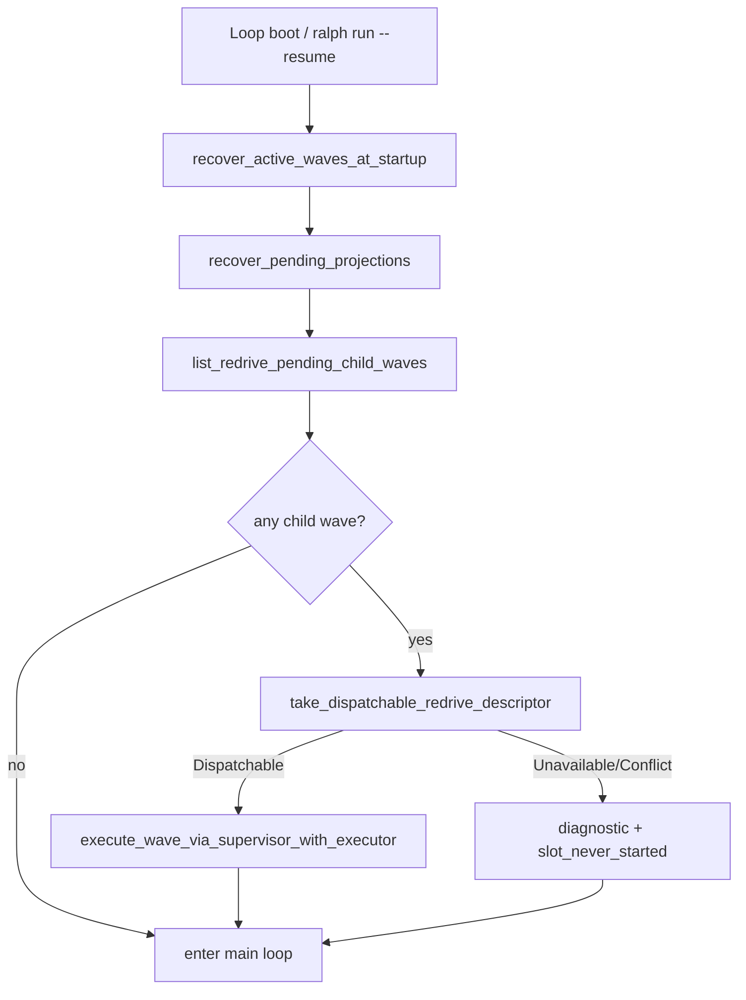
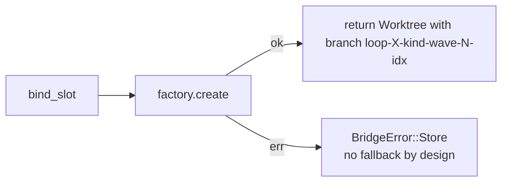
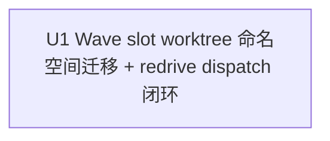

# Wave Slot Worktree 命名空间迁移 + Redrive 派发闭环

## Goal Capsule

- **目标：** 修复两个**真实存在且高置信度**的机制层缺口：
  1. `bind_slot` branch 命名不含 `wave_id` → 同 loop 跨 wave 同 slot_index 必撞名 → `slot_never_started`
  2. `ralph run --resume` 启动时未消费 `take_dispatchable_redrive_descriptor` → redrive 子 wave 只建 DB 行不执行
- **来源：** 第一版基于过时事实（E7 证据失真、`BindSlotContext` 缺 `wave_id` 等错误陈述），本版基于代码事实勘察 + 1f955f6b commit message 自承 TODO 重写。
- **执行方式：** 单一合并 Unit（U1）；按 Acceptance Red → Unit Red → Green → Refactor → 集成 → 回归 → 提交边界串行推进。
- **停止条件：** 真实调用链与 Evidence 冲突、预期 Red 未触达目标逻辑、需要新增未计划的公开接口或依赖、任一关键决策置信度降到 0.85 以下。
- **完成归属：** U1 完成命名空间迁移 + boot 时 redrive 派发两件同一行为切片的最终验收；不设置"以后补测试"的独立 Unit。

---

## Product Contract

### 0. 计划状态

**READY，重写版（替换同一文件首版）。**

- **代码基线：** 当前工作区 HEAD（重写前先做事实勘察，无需钉死 commit）。
- **工作区基线：** 重写时 `git status` 干净；重写后原文件被覆盖、未 commit（保留 plan id 不变）。
- **调查范围：** `crates/ralph-cli/src/loop_runner/wave/{supervisor_bridge,dispatcher}.rs`、`crates/ralph-cli/src/loop_runner/runner.rs`、`crates/ralph-core/src/supervisor/{mod,memory,rusqlite}.rs`、`crates/ralph-core/src/supervisor/worktree_bind.rs`、`crates/ralph-core/src/supervisor/u4_descriptor_tests.rs`、`crates/ralph-cli/src/loop_runner/tests/wave_supervisor.rs`。
- **已执行验证：** 源码 grep、commit 历史勘察、诊断报告原文核对、call site 零命中验证。
- **启动门禁：** 首版无需消除既有红色基线；U1 完成后必须保证 `./scripts/run-tests.sh` 全绿。
- **最终门禁：** `./scripts/run-tests.sh` 必须全绿。
- **阻塞项处置：** 无 launch-blocking 假设。

### 1. 功能目标

#### 业务目标

让 operator 和 preset 作者可以依赖一个确定契约：

1. 同一 loop 内的第二波 exec/fix wave，以及任何 redrive 子 wave，都拿到**全新且独立**的 slot worktree（branch 名包含 `wave_id` 维度）。
2. `ralph run --resume` 启动时自动扫描 redrive 子 wave，把 dispatchable slot 接上 `execute_wave_via_supervisor_with_executor`，子 wave 不再"只建 DB 行不执行"。

#### 用户或调用方

- `ce-executor-supervisor` / `parallel-forge` operator：期望同 loop 内第二波 + redrive 子 wave 不再因命名撞名 fail-closed；redrive 子 wave 在 `ralph run --resume` 后真正派发。
- preset 作者：依赖命名空间保证 slot worktree 唯一性。
- runtime 维护者：依赖 boot 时 redrive 派发闭环（承接 plan 2026-07-27-004 U4 commit message 自承 TODO）。

#### 当前行为

1. `CoordinatorSupervisorBridge::bind_slot` 用 `format!("{}-{}-{}", ctx.loop_id, kind, slot_index)`（`supervisor_bridge.rs:342`），**不含 `wave_id`**。`worktree_bind::bind_slot_worktree` 在 `worktree_bind.rs:166` 有同样命名（两处对称）。
2. 同 loop 内**第二波 exec/fix wave**（`ce-executor-supervisor` 的 dependency-aware iterative waves，slot_index 每波从 0 重编）→ 与第一波残留 worktree 撞名 → `factory.create` 失败 → `BridgeError::Store` → `slot_never_started`。
3. `ralph wave redrive` 通过 `create_redrive_wave`（`rusqlite.rs:1687`）创建子 wave 后，**生产路径零调用** `take_dispatchable_redrive_descriptor`（grep `crates/ralph-cli/src/loop_runner/{runner,dispatcher}.rs` 零命中）。
4. `recover_active_waves_at_startup`（`runner.rs:1373 / 1462`）只做超时标记 + `recover_pending_projections` 重放 task projection，**不重新派发**已建 redrive 子 wave 的 slot。
5. `1f955f6b fix(supervisor): U4 redrive 持久 descriptor + take 派发 ready 边界` commit message 显式声明："`ralph run --resume` 启动时消费 take_dispatchable_redrive_descriptor 的接线留待后续 plan 收尾"——这是 plan 004 自承的已知 TODO。

#### 目标行为与行为差异

- `bind_slot` 命名改为 `{loop_id}-{kind}-{wave_id}-{slot_index}`（两处对称），同 loop 内**任意**新 wave 的 slot 拿到全新 branch/path。
- `ralph run --resume` 在 boot 时（`recover_active_waves_at_startup` 之后）扫描所有 `parent_wave_id IS NOT NULL AND phase = 'dispatch'` 的子 wave，对每个 `pending` slot 调 `take_dispatchable_redrive_descriptor`，命中 `Dispatchable` 即触发 `execute_wave_via_supervisor_with_executor` 派发；`DescriptorUnavailable` / `DescriptorConflict` 标 `slot_never_started` + 记诊断。
- **不引入**"撞名兜底"——命名迁移后跨 wave 不撞名；**不引入**"dispatcher tick 兜底"——boot 一次扫描已覆盖 `ralph wave redrive` 崩溃后重启主路径。

#### 输入、输出与状态变化

- **输入：** `SupervisorStore` 的 wave 拓扑、boot 时 `continue_mode` 标志、`ralph run --resume` 启动路径。
- **输出：** 每次 `bind_slot` 成功都返回全新 `Worktree { path, branch }`；`ralph run --resume` boot 时把 redrive 子 wave 的 dispatchable slot 派发出去。
- **状态变化：** 同 loop 内 wave 数增加不再受 worktree 命名空间限制；崩溃后 redrive 子 wave 自动派发。
- **错误语义：** 命名撞名已被命名迁移消解；redrive descriptor 缺失/冲突 fail-closed。

#### 兼容、性能、安全与约束

- **兼容：** 老 loop 残留 worktree（命名 `{loop_id}-{kind}-{slot_index}`）在新代码下永远不会被新 wave 撞名（新命名多了 `wave_id` 段），它们仅占用磁盘空间，由 `finalize_terminal_cleanup` 在 loop 终态回收，不在本计划范围。
- **性能：** `bind_slot` 不再撞名，不引入新 hot path；`list_redrive_pending_child_waves` 是 boot 一次扫描（不是 tick），无可观测开销。
- **安全：** 不放宽 EventOriginGuard / HatCommandPolicy / wave permit 任何权限边界；redrive 派发复用现有 `execute_wave_via_supervisor_with_executor` 链路。
- **持久化：** 不新增数据库表；只新增一个查询。
- **依赖：** 不新增 crate。
- **测试入口：** 严禁裸跑 `cargo test -p ralph-cli`；按 `AGENTS.md` 使用 nextest 和两阶段全量脚本。

#### 本次范围

- `bind_slot` 命名空间迁移（`{loop_id}-{kind}-{wave_id}-{slot_index}`），两处对称（`supervisor_bridge.rs` + `worktree_bind.rs`）。
- 同步更新 `worktree_bind.rs` 三个测试断言（line 276/318/386）。
- `SupervisorStore` 新增 `list_redrive_pending_child_waves` trait 方法（默认空 Vec）+ memory/rusqlite 真实实现。
- runner 在 `recover_active_waves_at_startup` 之后（line 1373 + 1462 两处对称）追加 `dispatch_pending_redrive_waves` 步骤。
- 新增 `wave_supervisor.rs` 集成测试 S1（同 loop 跨 wave 不撞）+ S2（redrive boot 派发）。

#### 非目标

- 不引入"撞名兜底"（用户决策）：命名迁移后跨 wave 不撞名；"同 wave 同 slot 重派"是 DB 异常场景，不在本计划范围。
- 不在 dispatcher tick 兜底（用户决策）：`ralph run --resume` boot 一次扫描已覆盖 `ralph wave redrive` 崩溃后重启主路径；operator 运行时执行 redrive 触发的二次消费属于未来用例。
- 不改 `create_redrive_wave` 的 DB schema、API 语义或 `RedriveTakeOutcome` 状态机。
- 不改变 worker 进程模型、PTY/spawn 机制或 `worker.rs`。
- 不修改 `ce-executor-supervisor` / `parallel-forge` preset 拓扑或 hat 指令。
- 不重构 `merge-queue.jsonl` / `loops.json` / 整 loop 级 `--reuse-worktree` 路径。
- 不删除/重命名旧 worktree 命名；老 loop 残留由现有 `finalize_terminal_cleanup` 处理。
- 不增改 `AGENTS.md` / `CLAUDE.md` / `crates/ralph-core/data/*.md`（agent 行为不变）。

#### 已确认事实、假设与未确认假设

- **已确认事实：** Evidence Ledger E1-E5。
- **已确认假设：** `wave_id` 在两个 `bind_slot` 调用点都已可访问——`bind_slot_worktree` 签名（`worktree_bind.rs:119`）有 `wave_id: &str`；`supervisor_bridge.rs:342` 内联实现的 `ctx` 也含 wave_id。
- **待验证假设：** "runner boot 上下文（`runner.rs:1373 / 1462`）能凑齐 `execute_wave_via_supervisor_with_executor` 所需全部参数"——实施时确认，缺则就地适配不外抽。

### Requirements

#### 命名空间迁移

- **R1.** `bind_slot` 的 branch/path 命名必须包含 `wave_id`，同一 loop 内不同 wave 的同 slot_index 不再撞名。
- **R2.** 新命名必须满足 git branch 合法字符集，且长度不超过 255 字节。
- **R3.** 命名规则必须对 exec / fix / review 等所有 wave kind 一致；review 仍走 SharedReadonly 不创建 worktree。
- **R4.** `supervisor_bridge.rs:342` 与 `worktree_bind.rs:166` 两处必须**对称**修改，命名规则在代码中只剩这两处。

#### Redrive 派发闭环

- **R5.** `SupervisorStore` 新增 `list_redrive_pending_child_waves() -> SupervisorStoreResult<Vec<RedrivePendingChild>>` trait 方法，默认 impl 返回空 Vec；memory + rusqlite 都需真实实现。
- **R6.** `recover_active_waves_at_startup` 之后，runner 必须扫描所有 `parent_wave_id IS NOT NULL AND phase = 'dispatch'` 的子 wave（line 1373 + line 1462 两处对称修改）。
- **R7.** 对每个子 wave 的 `pending` slot，必须调 `take_dispatchable_redrive_descriptor`，仅在 `Dispatchable` 时触发 worker spawn；`DescriptorUnavailable` / `DescriptorConflict` 必须 fail-closed 并记录诊断。
- **R8.** redrive 派发必须复用 `execute_wave_via_supervisor_with_executor` 现有链路，不引入新的 dispatch 旁路。

#### 文档与诊断

- **R9.** 集成测试 `crates/ralph-cli/src/loop_runner/tests/wave_supervisor.rs` 新增 S1（同 loop 跨 wave 不撞）+ S2（redrive boot 派发）覆盖 R1-R8。

### BDD 行为规格

```gherkin
Feature: Wave slot worktree namespace migration and redrive dispatch closure

  Background:
    Given a supervisor-enabled loop with event_loop.supervisor.enabled=true
    And the loop is running ce-executor-supervisor or parallel-forge preset

  Scenario S1: Second exec wave in the same loop does not collide with first wave worktree
    Given wave w-1 exec with slot 0 created worktree on branch loop-1-exec-w-1-0
    And wave w-1 slot 0 reached terminal state
    When wave w-2 exec slot 0 binds
    Then bind_slot succeeds with branch loop-1-exec-w-2-0
    And no WorktreeError is raised

  Scenario S2: Redrive child wave is dispatched after ralph run --resume
    Given parent wave w-1 exec slot 0 failed and its descriptor is persisted
    And ralph wave redrive --wave-id w-1 created child wave w-2 in phase=dispatch
    And the loop crashed before child wave w-2 slot 0 was dispatched
    When ralph run --resume is invoked
    Then recover_active_waves_at_startup completes
    And dispatch_pending_redrive_waves scans for parent_wave_id IS NOT NULL children
    And calls take_dispatchable_redrive_descriptor for w-2 slot 0
    And Dispatchable is returned
    And execute_wave_via_supervisor_with_executor spawns a worker for the slot

  Scenario S3: Redrive descriptor missing fails closed
    Given child wave w-2 slot 0 is pending but has no persisted descriptor
    When ralph run --resume invokes dispatch_pending_redrive_waves
    Then take_dispatchable_redrive_descriptor returns DescriptorUnavailable
    And the slot is marked slot_never_started with diagnostic
    And no worker is spawned

  Scenario S4: Redrive descriptor digest conflict fails closed
    Given child wave w-2 slot 0 has a persisted descriptor
    And the runtime payload digest disagrees with the descriptor's payload_digest
    When ralph run --resume invokes dispatch_pending_redrive_waves
    Then take_dispatchable_redrive_descriptor returns DescriptorConflict
    And the slot is marked slot_never_started with diagnostic
    And no worker is spawned
```

---

## Planning Contract

### 2. 代码库现状与证据

#### 2.1 当前实现入口

- **`bind_slot` 命名点：** `crates/ralph-cli/src/loop_runner/wave/supervisor_bridge.rs:342` + `crates/ralph-core/src/supervisor/worktree_bind.rs:166`（**两处对称**）。
- **`bind_slot_worktree` 签名：** `crates/ralph-core/src/supervisor/worktree_bind.rs:114-128` 已含 `wave_id: &str` 参数——本计划**不**新增 `BindSlotContext` 字段（首版该陈述错误）。
- **撞名 fail-closed：** `crates/ralph-core/src/worktree.rs:102-131` `WorktreeError`（无 `AlreadyExists` 变体，撞名通过 `Git(String)` 经 `worktree_bind.rs:94-100` 翻译成 `WorktreeError::CreateFailed`）；`supervisor_bridge.rs:346` 返回 `BridgeError::Store`。
- **redrive 创建：** `crates/ralph-cli/src/wave.rs:376-450` `execute_redrive` → `crates/ralph-core/src/supervisor/rusqlite.rs:1687-1889` `create_redrive_wave`。
- **redrive descriptor API：** `crates/ralph-core/src/supervisor/mod.rs:1485-1520` `persist_slot_descriptor` + `take_dispatchable_redrive_descriptor`（默认 impl `DescriptorUnavailable`）；`crates/ralph-core/src/supervisor/memory.rs:1489-1514` 真实 override（`Dispatchable` / `DescriptorUnavailable` / `DescriptorConflict` 三态）；`crates/ralph-core/src/supervisor/u4_descriptor_tests.rs` 4 个三态单测覆盖。
- **生产调用方 grep：** `take_dispatchable_redrive_descriptor` 在 `crates/ralph-cli/` 生产路径**零调用**；仅在 `u4_descriptor_tests.rs:68/91/117` 测试中调用。
- **启动恢复：** `crates/ralph-cli/src/loop_runner/runner.rs:1373-1396` 与 `1462-1484` 两处 `recover_active_waves_at_startup` + `recover_pending_projections`。
- **wave dispatch：** `crates/ralph-cli/src/loop_runner/wave/dispatcher.rs:1586` `execute_wave_via_supervisor_with_executor`（已存在可复用入口）。
- **首版事故证据 E7（已砍掉）：** 原文 `docs/report/2026-07-25-ce-executor-supervisor-primary-20260725-130345-diagnosis.md:82` 是"手动 commit/merge + 手动整合 worktree 完成业务目标"，**根因是 FlowStepScope 作用域门禁**（plan 003 已修），与命名冲突无关。首版 E7 是二次转述失真。
- **plan 004 自承 TODO：** `1f955f6b fix(supervisor): U4 redrive 持久 descriptor + take 派发 ready 边界` commit message 显式声明接线留待后续 plan。

#### 2.2 Evidence Ledger

| Evidence ID | 来源 | 观察结果 | 对计划的影响 | 可靠性 |
|---|---|---|---|---|
| E1 | `supervisor_bridge.rs:342` + `worktree_bind.rs:166` | 两处都用 `format!("{loop_id}-{kind}-{slot_index}")`，不含 `wave_id` | 必须迁移命名空间，两处对称 | 高 |
| E2 | `worktree.rs:102-131` + `worktree_bind.rs:94-100` + `supervisor_bridge.rs:346` | `factory.create` 失败链：撞名 → `Git(String)` → `CreateFailed` → `BridgeError::Store` → `slot_never_started` | 命名迁移消除撞名根因；无需兜底 | 高 |
| E3 | `ce-executor-supervisor.yml`（dependency-aware iterative waves） | slot_index 每波从 0 重编 | 第二波必撞第一波 | 高 |
| E4 | grep `crates/ralph-cli/src/loop_runner/{runner,dispatcher}.rs` | `take_dispatchable_redrive_descriptor` 生产路径零调用 | 必须接入 boot dispatch 步骤 | 高 |
| E5 | `1f955f6b` commit message | "`ralph run --resume` 启动时消费 take_dispatchable_redrive_descriptor 的接线留待后续 plan 收尾" | 计划 004 自承 TODO；本计划承接 | 高 |

#### 2.3 受影响范围

- **唯一权威范围：** 见 4.4 的逐文件清单。
- **不受影响：** UI、网络服务、公开 RPC、数据库 schema、外部服务、presets、`crates/ralph-core/data/*.md` agent skill 指南、`AGENTS.md` / `CLAUDE.md`（agent 行为不变）。
- **明确不改：** `create_redrive_wave` 的 DB schema 与 API、`RedriveTakeOutcome` 状态机、worker PTY 进程模型、preset 拓扑、merge-queue、`--reuse-worktree` 整 loop 路径、首版的"撞名兜底"逻辑、首版的 dispatcher tick 兜底扫描。

### 3. 决策记录与置信度

| Decision ID | 决策问题 | 候选方案 | 最终选择 | 支持证据 | 排除其他方案的原因 | 置信度 |
|---|---|---|---|---|---|---|
| KTD1 | 命名空间维度 | 仅加 wave_id；加 wave_id + slot_retry_budget；加 attempt_epoch | `{loop_id}-{kind}-{wave_id}-{slot_index}` | E1, E3 | attempt_epoch 不覆盖「同 loop 不同 wave」；slot_retry_budget 会让同一 wave 内重试产生不同 branch，违反「同 wave 同 slot 同 branch」语义 | 0.93 |
| KTD2 | 撞名兜底策略 | 一律 fail-closed；wave-phase 检查后回收；文件系统 mtime 判断；**不引入兜底** | **不引入兜底**（命名迁移后跨 wave 不撞名） | E1, E3 | 用户决策：跨 wave 不撞名；"同 wave 同 slot 重派"是 DB 异常场景，引入 store 状态查询和兜底分支得不偿失 | 0.90 |
| KTD3 | redrive dispatch 接入点 | dispatcher tick 内部；runner 启动时；独立子命令；**仅 boot 一次扫描** | **仅 boot 一次扫描**（runner.rs:1373 + 1462 两处对称） | E4, E5 | 用户决策：`ralph run --resume` 是约定消费方，boot 一次扫描已覆盖 `ralph wave redrive` 崩溃后重启主路径；operator 运行时 redrive 触发的二次消费属于未来用例 | 0.90 |
| KTD4 | `take_dispatchable_redrive_descriptor` 实现 | 在 rusqlite.rs override；在 runner 层绕过 | **不修改 store 层**——memory override 已存在（`memory.rs:1489`），只需在 runner 真实调用 | E5 | runner 层绕过破坏 SupervisorStore 抽象；store 层已有正确实现 | 0.95 |
| KTD5 | worker prompt 是否携带「redrive-resume」标记 | 携带；不携带 | 不携带（本计划不变 prompt；hat 通过 task ledger 与 trigger payload 自然识别上下文） | KTD4；prompt 简洁性 | 携带标记会让 worker 行为分裂，违反"worker 看到的环境一致"原则 | 0.85 |

### 4. 三项实施契约闭合

#### 4.1 命名空间契约

新 branch 名固定为：

```
{loop_id}-{kind}-{wave_id}-{slot_index}
```

- `loop_id`：来自调用上下文（不变）。
- `kind`：来自 wave kind（`exec` / `fix` / `review`），用现有序列化。
- `wave_id`：来自调用上下文（**已可访问**，无需新增字段）。
- `slot_index`：来自调用上下文（不变）。

**字符集与长度：** 全部字段来自 runtime 内部生成，已知为 ASCII；最大长度约 64+16+16+8 = 104 字节，远低于 git 255 限制。

**worktree 路径：** `path` 仍由 `DefaultWorktreeFactory` 内部决定（基于 branch 名派生）；本计划不改变路径生成规则。

**唯一修改点：** `crates/ralph-cli/src/loop_runner/wave/supervisor_bridge.rs:342` + `crates/ralph-core/src/supervisor/worktree_bind.rs:166`（两处对称）。

#### 4.2 Redrive dispatch 闭环契约

**runner 启动时**（`runner.rs:1373-1396` 与 `1462-1484` 两处 `recover_active_waves_at_startup` 之后）新增：

1. 调 `SupervisorStore::list_redrive_pending_child_waves()`（**新增方法**）：返回 `Vec<RedrivePendingChild>`，过滤条件 `parent_wave_id IS NOT NULL AND phase = 'dispatch'`。
2. 对每个 child wave：
   a. 对每个 `pending` slot_index：
      - 调 `take_dispatchable_redrive_descriptor(child_wave_id, slot_index, expected_digest)`。
      - `Dispatchable(descriptor)` → 复用 `execute_wave_via_supervisor_with_executor` 派发该 slot。
      - `DescriptorUnavailable` / `DescriptorConflict` → 标记 slot 为 `slot_never_started` 并记录诊断；**不**触发 worker。
3. dispatch 完成后 runner 才进入主循环。

**dispatcher tick 兜底：** **不引入**——`ralph run --resume` boot 一次扫描已覆盖 `ralph wave redrive` 崩溃后重启主路径；operator 运行时 redrive 触发的二次消费属于未来用例。

**store 层：** `SupervisorStore` trait 新增 `list_redrive_pending_child_waves` 方法签名 + 默认 impl（返回空 Vec）；`memory.rs` + `rusqlite.rs` 各写真实实现。

#### 4.3 封闭文件清单

以下文件是本计划允许修改/新增的完整集合；不允许目录通配或条件式追加：

| # | 文件 | 动作 | 原因 |
|---:|---|---|---|
| 1 | `crates/ralph-cli/src/loop_runner/wave/supervisor_bridge.rs` | 修改 | line 342 branch 命名加 `wave_id` 段 |
| 2 | `crates/ralph-core/src/supervisor/worktree_bind.rs` | 修改 | line 166 branch 命名 + 同步 line 276/318/386 三个测试断言 |
| 3 | `crates/ralph-core/src/supervisor/mod.rs` | 修改 | `SupervisorStore` trait 新增 `list_redrive_pending_child_waves` 方法签名与默认 impl（返回空 Vec） |
| 4 | `crates/ralph-core/src/supervisor/memory.rs` | 修改 | `list_redrive_pending_child_waves` 真实实现 |
| 5 | `crates/ralph-core/src/supervisor/rusqlite.rs` | 修改 | `list_redrive_pending_child_waves` 真实实现（不增改 schema，只加一个查询） |
| 6 | `crates/ralph-cli/src/loop_runner/runner.rs` | 修改 | 在 `recover_active_waves_at_startup` 之后（line 1373 + 1462 两处对称）追加 `dispatch_pending_redrive_waves` 步骤 |
| 7 | `crates/ralph-cli/src/loop_runner/tests/wave_supervisor.rs` | 修改 | 新增 S1（同 loop 跨 wave 不撞）+ S2（redrive boot 派发）集成测试 |

计划文件本身不计入实施 diff。无需更新 `presets/en/*.yml` / `presets/schemas/*.yml`（preset 不变）、`crates/ralph-core/data/*.md`（agent 行为不变）、`AGENTS.md` / `CLAUDE.md`（无新硬规则）、`scripts/ralph-zsh-plugin.zsh`（CLI 表面不变）、`CHANGELOG.md`（fix 类，留给发布节奏）。

### High-Level Technical Design





### 风险与系统影响

| 风险 | 触发条件 | 检测 | 缓解 | 剩余风险 |
|---|---|---|---|---|
| 命名迁移破坏依赖旧 branch 名的外部脚本 | 外部脚本硬编码旧 branch 名 | grep `loop-.*-exec-\|loop-.*-fix-` 在 `scripts/` / `tests/` | branch 名是 git 内部标识，外部脚本应通过 `git worktree list --porcelain` 解析 | 低 |
| `list_redrive_pending_child_waves` 返回大结果集 | 长期 loop 积累大量 redrive 子 wave | 仅在 `phase = 'dispatch'` 状态扫描，dispatched 后 phase 转移 | boot 一次扫描，无热路径开销 | 低 |
| `continue_mode` 路径与非 resume 路径行为分裂 | 新 dispatch 步骤仅在 resume 时执行 | runner.rs:1373 + 1462 两处对称修改；非 resume boot 不调 dispatch | 用户决策：覆盖主路径 | 中 |
| 修改 2 的 `dispatch_pending_redrive_waves` 需要 `execute_wave_via_supervisor_with_executor` 全部参数 | runner.rs 上下文缺参数 | 实施时确认 | 就地适配不外抽；如实在凑不齐，改用最小可派发入口 | 低 |

---

## Verification Contract

### 5. 验收与测试策略

| Scenario | 验收条件 | 测试入口 | 层级 | 风险补充 |
|---|---|---|---|---|
| S1 | 第二波 exec 不撞第一波 worktree | `wave_supervisor.rs` 新增测试 | integration | naming uniqueness |
| S2 | `ralph run --resume` 后 redrive 子 wave 自动 dispatch | `wave_supervisor.rs` 新增测试 | integration | dispatch closure |
| S3 | descriptor 缺失 fail-closed | `u4_descriptor_tests.rs` 既有测试 + `wave_supervisor.rs` 新增 | unit + integration | fault injection |
| S4 | descriptor digest 冲突 fail-closed | `u4_descriptor_tests.rs` 既有测试 + `wave_supervisor.rs` 新增 | unit + integration | fault injection |

每项断言同时检查副作用：没有命名撞名、没有 redrive 重复派发、没有 `slot_never_started` 误标。

### 6. 需求—测试追踪矩阵

| Requirement | Scenario | 验收测试 | 单元测试 | 集成/契约 | Unit |
|---|---|---|---|---|---|
| R1 | S1 | 跨 wave 同 slot 不撞 | 命名规则单测 | wave_supervisor 集成 | U1 |
| R2 | S1 | branch 合法字符 | 命名规则单测 | — | U1 |
| R3 | S1 | exec/fix/review 一致 | 命名规则单测 | wave_supervisor 集成 | U1 |
| R4 | — | 命名规则在代码中只剩两处（两文件各一处） | grep 自检 | — | U1 |
| R5 | S2-S4 | `list_redrive_pending_child_waves` 默认 impl + memory + rusqlite | 单测 | wave_supervisor 集成 | U1 |
| R6 | S2 | boot 扫描 redrive 子 wave | list_..._child_waves 单测 | boot 集成 | U1 |
| R7 | S2-S4 | descriptor 三态分支 | take_dispatchable_... 单测 | wave_supervisor 集成 | U1 |
| R8 | S2 | 复用 executor 链路 | — | wave_supervisor 集成 | U1 |
| R9 | — | wave_supervisor 新增 S1+S2 | — | — | U1 |

---

## Implementation Units

### 7. 严格串行开发单元

### U1. Wave slot worktree 命名空间迁移 + redrive dispatch 闭环（合并 Unit）

1. **Unit 目标：** 同 loop 跨 wave 不再撞名；`ralph run --resume` boot 后 redrive 子 wave 自动 dispatch。
2. **对应：** R1-R9；S1-S4；KTD1-KTD5；E1-E5。
3. **外部可观察结果：**
   - 同 loop 内第二波 exec/fix wave 的 slot bind 成功，branch 名包含 `wave_id`。
   - `ralph run --resume` boot 后，redrive 子 wave 的 dispatchable slot 自动派发。
4. **当前行为基线：** `bind_slot` 用 `{loop_id}-{kind}-{slot_index}`（两处对称）；redrive 子 wave 创建后无生产 dispatch 接线。
5. **输入输出：** `SupervisorStore` 新增 `list_redrive_pending_child_waves` 方法；runner 启动时（line 1373 + 1462 两处对称）扫描并派发。
6. **修改位置：**
   - `crates/ralph-core/src/supervisor/mod.rs`：`SupervisorStore` trait 新增 `list_redrive_pending_child_waves` 方法签名与默认 impl（返回空 Vec）；定义 `RedrivePendingChild` 结构体（`{ wave_id, parent_wave_id, kind, pending_slots: Vec<u32> }`）。
   - `crates/ralph-core/src/supervisor/memory.rs`：`list_redrive_pending_child_waves` 真实实现，扫 `inner.waves_by_id` 过滤 `parent_wave_id.is_some() && phase == WavePhase::Dispatch`，收集每个 child wave 的 pending slot_index。
   - `crates/ralph-core/src/supervisor/rusqlite.rs`：`list_redrive_pending_child_waves` 真实实现，SQL：`SELECT wave_id, parent_wave_id, kind, slot_index FROM waves JOIN wave_slots USING (wave_id) WHERE parent_wave_id IS NOT NULL AND phase = 'dispatch' AND slot_status = 'pending'`。
   - `crates/ralph-cli/src/loop_runner/wave/supervisor_bridge.rs`：line 342 branch 命名改为 `format!("{}-{}-{}-{}", ctx.loop_id, kind, ctx.wave_id, slot_index)`。
   - `crates/ralph-core/src/supervisor/worktree_bind.rs`：line 166 branch 命名改为 `format!("{loop_id}-{kind}-{wave_id}-{slot_index}")`；同步 line 276/318/386 三个测试断言（`loop-1-exec-0` → `loop-1-exec-w-1-0`、`loop-z-fix-3` → `loop-z-fix-w-99-3`、`loop-2-exec-0` → `loop-2-exec-w-2-0`）。
   - `crates/ralph-cli/src/loop_runner/runner.rs`：在 `recover_active_waves_at_startup` 之后（line 1373 + 1462 两处对称）追加 `dispatch_pending_redrive_waves` 步骤；在 `run_loop_impl_inner`（runner.rs:796）内部实现，直接访问同 scope 的 bridge / events_file / config_path；不外抽独立函数。
   - `crates/ralph-cli/src/loop_runner/tests/wave_supervisor.rs`：新增 S1（同 loop 跨 wave 不撞，用真 git worktree）+ S2（redrive boot 派发，用 in-memory store + mock executor）集成测试。
7. **可依赖能力：** `SupervisorStore::fan_in_status`、`take_dispatchable_redrive_descriptor`（memory + 默认 impl）、`execute_wave_via_supervisor_with_executor`、`DefaultWorktreeFactory::create`。
8. **禁止依赖未来能力：** 不依赖任何 preset 修改；不引入新的 CLI 子命令；不改变 `create_redrive_wave` API；**不引入**撞名兜底；**不引入**dispatcher tick 兜底。
9. **验收测试：**
   - S1：在 `wave_supervisor.rs` 新增 `same_loop_second_exec_wave_does_not_collide`：用真 git worktree（非 mock factory），跑两波 exec，断言第二波 slot bind 成功且 branch 名不同。
   - S2：在 `wave_supervisor.rs` 新增 `redrive_child_wave_dispatches_on_resume`：用 in-memory store + mock executor，构造父 wave 失败 slot → `create_redrive_wave` → 调 boot dispatch 步骤 → 断言 mock executor.spawn_count == 1。
   - S3/S4：复用 `u4_descriptor_tests.rs` 既有 4 个单测 + `wave_supervisor.rs` 新增 descriptor 三态分支集成测试。
   - 命令：
     - `cargo nextest run -p ralph-core -- supervisor`
     - `cargo nextest run -p ralph-cli --bin ralph -- supervisor`
     - `cargo nextest run -p ralph-cli --bin ralph -- wave_supervisor`
10. **Acceptance Red：**
    - 先加测试 S1，跑两波 exec，断言第二波 slot bind 成功且 branch 名包含 wave_id——**当前必失败**（撞名 + branch 名不含 wave_id）。
    - 先加测试 S2，模拟 `ralph run --resume` boot，断言 child wave 自动 dispatch——**当前必失败**（无 boot dispatch 步骤）。
    - 编译错误、fixture 路径错误、命令错误均不是有效 Red。
11. **单元测试拆分：**
    - 命名规则：各种 kind × 各种 wave_id 的 branch 合法性与唯一性（既有 `worktree_bind.rs` 测试扩展即可）。
    - `list_redrive_pending_child_waves`：空 / 单 wave 单 slot / 单 wave 多 slot / 多 wave。
    - descriptor 三态：DescriptorBound / DescriptorUnavailable / DescriptorConflict（既有 `u4_descriptor_tests.rs` 已覆盖）。
    - boot dispatch 幂等性：连续两次调用不重复 dispatch。
12. **TDD 顺序：** 命名规则 Red → 命名 Green → list_..._child_waves Red → store 实现 Green → boot dispatch Red → boot dispatch Green → 集成测试 S1+S2 Red → S1+S2 Green → Refactor。
13. **最小实现：** 只新增 1 个 trait 方法（含默认 impl）+ 1 个结构体 + 2 个真实 store 实现 + 2 处命名修改 + 2 处 runner 步骤 + 2 个集成测试；不引入新 crate；不改变现有 public API 签名。
14. **集成验证：** 用真 git worktree（非 mock factory）跑 S1；用 in-memory supervisor store 跑 S2-S4。
15. **风险驱动测试：** descriptor 冲突（fault injection）、boot dispatch 幂等性（state-machine）、命名撞名（边界条件）。
16. **回归：** `cargo nextest run -p ralph-core -- supervisor` + `cargo nextest run -p ralph-cli --bin ralph -- supervisor` + `cargo nextest run -p ralph-cli --bin ralph -- wave_supervisor` 全绿；`./scripts/run-tests.sh` 全绿。
17. **预期文件变更：** 见 4.4 封闭文件清单（7 个文件）。
18. **完成标准：**
    - S1-S4 全绿。
    - `bind_slot` / `bind_slot_worktree` 命名规则在代码中只剩两处（两文件各一处），且都已包含 `wave_id`。
    - `git diff --name-only` 全部命中 4.4 白名单。
    - `cargo fmt --all -- --check`、`cargo build --workspace`、`cargo clippy --workspace --all-targets` 全绿。
    - `./scripts/run-tests.sh` 全绿。
    - 可独立提交。
19. **停止条件：** `fan_in_status` 无法在 `bind_slot` 上下文同步获取（比如 store 锁冲突），或 `wave_id` 在 `bind_slot` 调用点不可用（首版 plan 误判，需要实施时复核）；记录证据并重做 KTD1/KTD3。
20. **风险：** 仅靠命名迁移消除撞名，"同 wave 同 slot 重派"是 DB 异常场景——通过集成测试覆盖 S1 跨 wave 边界确认；不引入兜底，依赖 DB 状态正确性。

---

## Definition of Done

### 8. Unit 串行依赖图



- 单一合并 Unit，无串行依赖。

### 9. 执行命令清单

| 时机 | 命令 | 目的 | 通过要求 |
|---|---|---|---|
| U1 Red/Green | `cargo nextest run -p ralph-core -- supervisor` | core supervisor 层 | 必须通过 |
| U1 Red/Green | `cargo nextest run -p ralph-cli --bin ralph -- supervisor` | CLI supervisor 集成 | 必须通过 |
| U1 Red/Green | `cargo nextest run -p ralph-cli --bin ralph -- wave_supervisor` | wave supervisor 集成 | 必须通过 |
| U1 格式 | `cargo fmt --all -- --check` | 格式 | 必须通过 |
| U1 范围 | `git diff --name-only <unit-start>...HEAD` 与 4.4 白名单逐项比对 | 防范围漂移 | 出现未列路径立即停止 |
| 最终构建 | `cargo build --workspace` | build/typecheck | 必须通过 |
| 最终 lint | `cargo clippy --workspace --all-targets` | lint | 必须通过 |
| 最终全量 | `./scripts/run-tests.sh` | nextest 两阶段 + doctest | 必须通过 |
| flake 兜底 | `RALPH_BASELINE_SERIAL=1 ./scripts/run-tests.sh` | 仅竞态 flake 恢复 | serial 仍失败则真失败 |

测试若带外层 hat env，涉及 spawn `ralph` 的 fixture 必须用 `common::ralph_bin()` 或 `scrub_agent_runtime_env`；新增测试还要用污染环境复跑相关 integration target。

### 10. 最终质量门禁

- S1-S4 全部通过且每个 R1-R9 均可追踪到可执行测试。
- `bind_slot` / `bind_slot_worktree` 命名规则在代码中只剩两处（两文件各一处），且都已包含 `wave_id`。
- `list_redrive_pending_child_waves` 在 default trait impl + memory + rusqlite 都有真实实现，且被生产 runner 调用。
- `take_dispatchable_redrive_descriptor` 三态分支全部有测试覆盖（既有 + 新增）。
- `cargo fmt --check`、build、clippy、targeted nextest、`./scripts/run-tests.sh` 全绿。
- 未新增 skipped/ignored/`.only`；未削弱断言。
- 实际变更未触及 supervisor DB schema、preset 拓扑、worker PTY、merge-queue、`--reuse-worktree` 整 loop 路径、`AGENTS.md` / `CLAUDE.md` / `crates/ralph-core/data/*.md`。
- `git diff --name-only` 中实施文件全部属于 4.4 的 7 项白名单。
- 单一 Unit 独立提交边界，没有"最后统一补测试"的尾巴。
- 所有关键 Decision 置信度仍 ≥0.85；无 BLOCKED。
- 删除实验性和失败方案代码；不提交 `.ralph/review/<plan-id>/scratch/` 等过程产物。

### 11. 最终计划自检

| 检查项 | 结果 | 证据或说明 |
|---|---|---|
| 这是实施计划而不是 Roadmap 吗 | 是 | U1 绑定行为、代码入口、Red/Green 与完成门 |
| Executor 是否仍需做关键设计决策 | 否 | KTD1-KTD5 已锁定命名维度、不引入兜底、boot-only dispatch、store 不修改、prompt 不变 |
| 所有文件和接口是否有代码库证据 | 是 | E1-E5 全部带文件:行号 |
| 所有关键决策置信度是否 ≥0.85 | 是 | 最低 KTD5=0.85 |
| 是否存在未处理的低置信度假设 | 否 | 无 launch blocker |
| 每个 Unit 是否只有一个可观察行为 | 是 | U1 一个行为切片：跨 wave 不撞名 + redrive 自动 dispatch |
| 每个 Unit 是否可以独立验证 | 是 | targeted nextest + 完成门 |
| 每个 Unit 是否有真实 Red | 是 | U1 列明两例当前必失败测试 |
| 每个 Unit 是否包含回归范围 | 是 | U1 第 16 项 |
| 是否存在未来 Unit 依赖 | 否 | 单一 Unit |
| 是否存在泛化任务描述 | 否 | 所有动作绑定符号、文件、断言和命令 |
| 所有 Scenario 是否可追踪到测试和 Unit | 是 | 追踪矩阵 |
| 所有关键决策是否有 Evidence | 是 | KTD 表 |
| 修改范围是否封闭 | 是 | 4.4 列出 7 项；新增路径触发停止和重评审 |
| 已知红色基线是否与最终门禁一致 | 是 | 首版无 baseline 红；最终门禁 `./scripts/run-tests.sh` 全绿 |
| 计划是否可以严格串行执行 | 是 | 单 Unit |
| 是否相对首版真正去掉了低置信度/失真内容 | 是 | E7 业务故事已砍；撞名兜底 KTD2 已砍（用户决策）；dispatcher tick 兜底 KTD3 另一半已砍（用户决策）；`BindSlotContext` 缺 `wave_id` 错误陈述已纠正 |