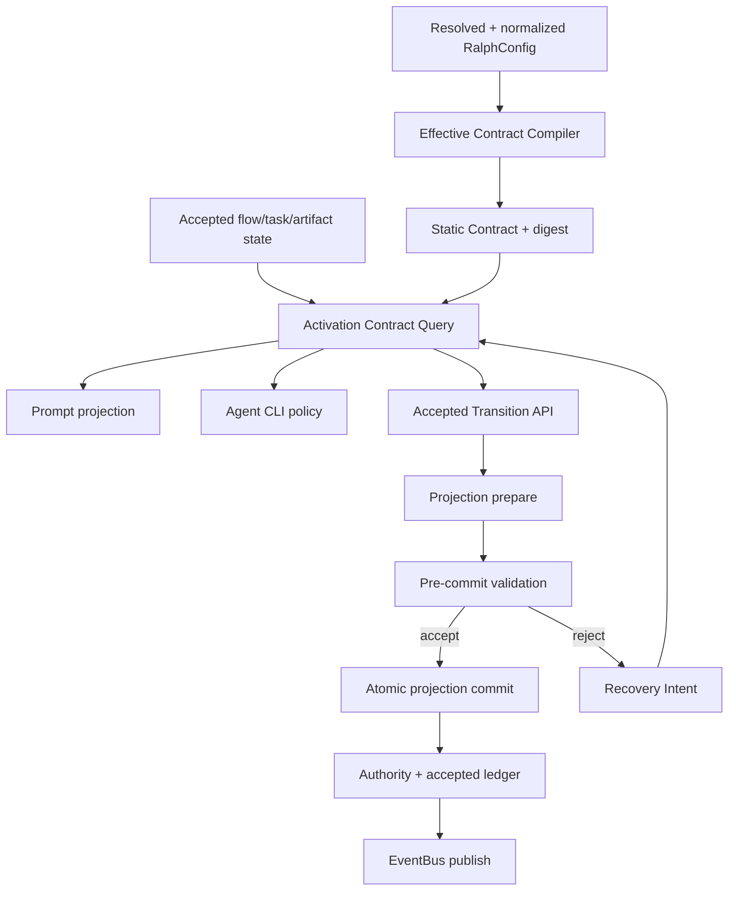
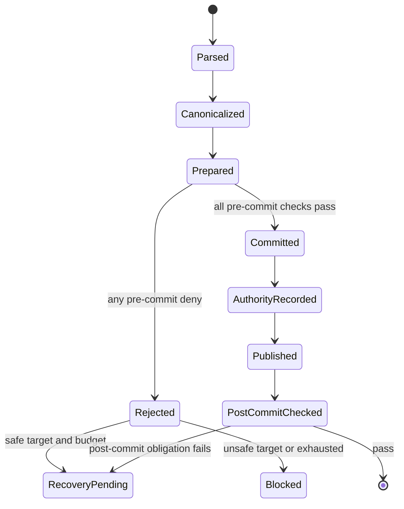
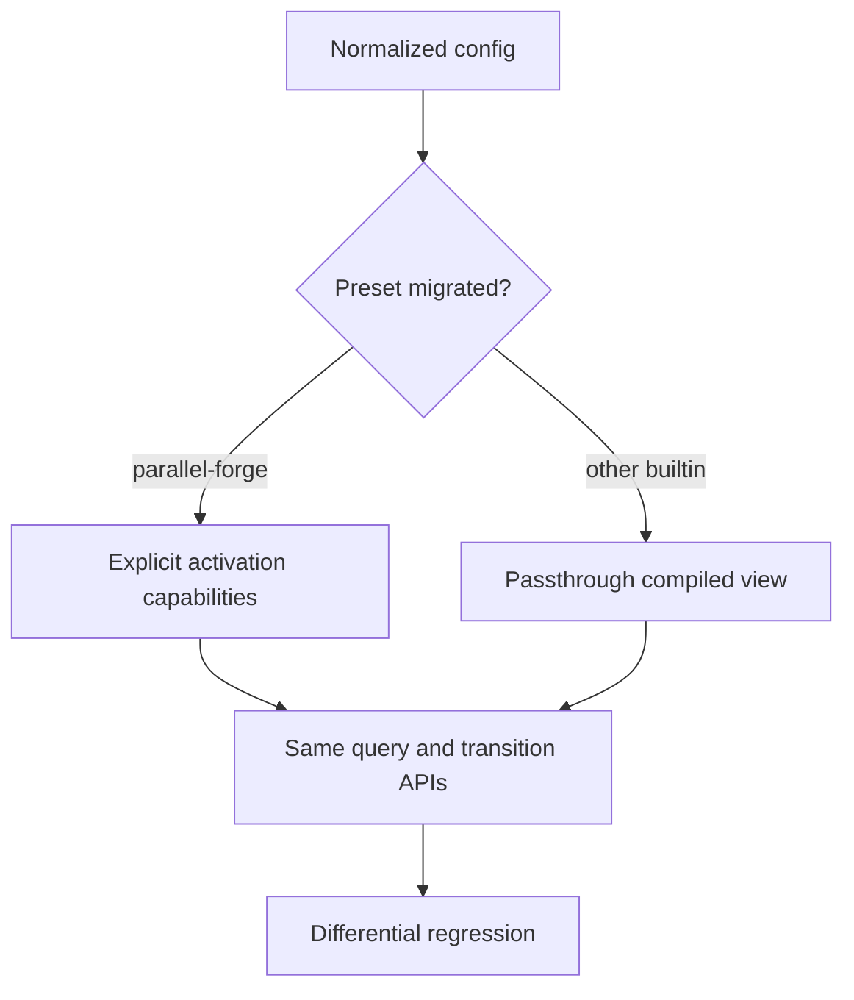
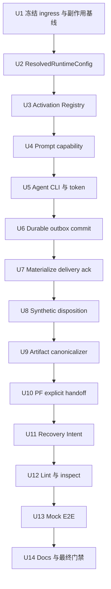

# refactor: 建立统一执行契约层并完成 Parallel Forge 纵向迁移

## 0. 计划状态

**READY**

- **代码基线：** `pittcat-dev@52394257`。
- **前置依赖：** `docs/plans/2026-07-30-003-fix-coordinator-hat-task-actionability-plan.md` 必须先实施并通过其 Definition of Done。003 只修 coordinator task prompt actionability；本计划不重复实现，也不改变 lifecycle ACL。
- **调查范围：** resolved config/overlay/normalize、hat/flow/schema/execution-contract 声明、prompt task/action 注入、agent CLI command policy、统一 validation pipeline、state projector、flow authority、phase authority、precheck/retry/correction、mechanism synthetic events、Parallel Forge artifact/task/wave 拓扑、真实 EventLoop BDD、相关 Git 历史与 `docs/solutions/`。
- **已执行验证：** 源码调用链、测试入口、preset/schema、StateLedger/outbox可复用边界、知识库与 2026-07-28 至 2026-07-30 Git 历史只读核对；完成 coherence/feasibility/scope/adversarial 文本审查并修正P0/P1问题；规划阶段未修改生产代码。
- **尚未执行验证：** 按 `ce-plan` 的规划/实施分离约束，本计划未运行测试、构建、lint 或 runtime 实验。各 Unit 明确规定 Acceptance Red、targeted nextest 与最终全量门禁。
- **阻塞项：** 无。所有进入实施路径的关键技术决策置信度均 ≥ 0.85。
- **调查保留项：** `EventBus::publish`源码清单仅作为U1 characterization evidence；永久完整性由U6-U8的受限raw API与typed disposition保证，不依赖字符串扫描。

---

## Goal Capsule

- **目标：** 将配置、Prompt、CLI、事件验收、状态投影、authority、恢复与终态对“当前 activation 可以做什么”的判断收敛为同一份 Effective Activation Contract，并用唯一 Accepted Transition API 原子执行业务状态变化。
- **首条完整迁移：** `builtin:parallel-forge` 从 planner artifact handoff 到 task DAG 投影、wave 派发、拒收恢复、fail-close 和 reporter 终态全部使用统一层。
- **权威顺序：** operator 显式配置 → builtin preset → `RalphConfig` merge/normalize/desugar 后的 resolved config → Effective Contract 静态视图 → accepted flow/task/artifact 动态状态 → activation contract。
- **执行纪律：** 严格串行 U1 → U14；每个 Unit 完成 Acceptance Red、最小实现、Refactor、集成、回归和独立提交后才进入下一个 Unit。
- **停止条件：** 任一关键接口、调用链或 Red 失败原因与本计划 Evidence 冲突，或任何 Decision 置信度下降到 0.85 以下时，停止当前 Unit，更新 Evidence/Decision/后续 Unit 后再继续。
- **尾部所有权：** U13只替换真实mock E2E占位链路，U14只同步文档并执行全量门禁；每个行为的Acceptance Red与生产Green归其owning Unit，不把测试债务推迟到尾部。

---

## Product Contract

### 1. 功能目标

#### 1.1 业务目标

Ralph 必须对同一次 hat activation 给出唯一、可查询、可执行且可审计的契约，使 agent 看到的动作、CLI 实际允许的动作、事件可接受范围、投影副作用、恢复责任和终态推进保持一致。

本计划不是新增另一套 preset DSL，而是把现有 resolved config、declared flow、hat、schema、task、projection、precheck 和 authority 声明编译成只读有效视图。

#### 1.2 用户或调用方

- **Hat agent：** 读取当前可执行 primitive、可见资源、允许 topic、完成义务与 correction。
- **Operator：** 通过 inspect/diagnostics 查询有效契约、contract identity、拒收和恢复状态。
- **CLI：** `ralph emit`、task lifecycle、wave dispatch 与 agent-context command policy。
- **EventLoop：** agent JSONL、CLI apply、system synthetic ingress 的统一验收与提交。
- **StateProjector：** 仅提交已经完成所有 pre-commit 检查的 projection plan。
- **Preset 作者与 reviewer：** 通过 lint/startup gate 证明声明被 resolved config 保留并且有 runtime consumer。

#### 1.3 当前行为

1. `default_core_value` 与 `merge_hats_overlay` 通过多份手工 key 集合处理 preset opt-in；遗漏会静默吞掉 runtime 能力。
2. `ValidationPipeline` 已被 loop 与 CLI 共用，但 `StateProjector::apply` 可能早于 pre-commit validation 产生副作用。
3. JSONL accepted path、`publish_event`、precheck exhausted、correction escalation、stall/fail-close 和其他 mechanism path 仍存在不同 publish/authority/recovery 顺序。
4. task lifecycle administration、work execution ownership 与当前 actionability 没有统一的结构化能力模型。
5. `forge.plan.ready` 同时维护 `execution-plan.yml` 与 agent 手写 `unit_tasks`/wave/order/digest；CLI disk consistency 是 topic-specific 补丁，runtime projector 仍消费第二份 payload。
6. rejection/correction、precheck retry、repair state machine、stall detector 分别持有 recovery 与 budget 语义。

#### 1.4 目标行为与行为差异

| 关注点 | 当前行为 | 目标行为 |
|---|---|---|
| 配置 | 多处 key 白名单决定能力是否存活 | resolved + normalized config 编译一次，consumer completeness 可审计 |
| Activation | Prompt/CLI/runtime 分别推断 | 同一 `contract_digest` 的 Effective Activation Contract |
| Task | lifecycle ACL 近似 actionability | administration、execution ownership、actionable-now 三语义 |
| Event | 多 ingress、多副作用顺序 | 单一 Accepted Transition API |
| Projection | 可早于后续 validation 写状态 | prepare → validate → atomic commit |
| Synthetic event | 可直接 publish 并手补 authority | 显式 system provenance，仍走统一 transition |
| Artifact handoff | agent 双写 artifact 与 payload | runtime 从 digest-bound artifact 派生 canonical payload |
| Recovery | 多种 envelope/budget/target 规则 | 单一 Recovery Intent、单一计数与 exhaustion transition |
| Observability | 需要拼 Prompt、ledger、日志 | inspect 返回同一 contract identity 与机器可读能力 |

#### 1.5 输入

- resolved、normalized、desugared `RalphConfig`；
- 当前 loop/hat/flow step/trigger；
- accepted flow-authority 与 state ledger；
- task owner/status/loop identity；
- hat publishes/terminal events/obligations；
- event schemas、execution contracts、state projection actions；
- precheck 合成结果；
- artifact reference、path boundary、digest 与文件内容；
- recovery retry key 与持久化计数。

#### 1.6 输出

- Effective Contract 静态视图与 activation 动态视图；
- 稳定 `contract_digest`；
- `observe`、`act`、`emit`、`complete`、`recover` 五类 primitive capability；
- Accepted/Rejected Transition Result；
- canonical event payload；
- atomic projection commit；
- authority/ledger/bus 一致的 accepted transition；
- Recovery Intent 或单一 exhausted blocked transition；
- inspect/prompt/diagnostics 中可对账的 contract identity。

#### 1.7 状态变化

业务 transition 只能按下列顺序改变状态：

1. 解析 ingress 和 provenance；
2. 解析 activation contract；
3. canonicalize artifact-backed input；
4. prepare projection，不落盘；
5. 执行 origin/publisher/schema/policy/flow/task/precheck/projection precondition；
6. 原子提交 projector/task/progress 状态；
7. 推进 flow/phase authority 并追加 accepted ledger；
8. publish accepted event；
9. 运行 post-commit completion/workflow guards；
10. post-commit 失败进入结构化 recovery，不回滚已经声明为 post-commit 的事实。

任何 pre-commit Reject 在第 6 步前结束，task store、progress、flow authority、accepted ledger 与 main bus 均不得出现部分副作用。

#### 1.8 错误语义

- **Contract compile failure：** 启动失败，返回稳定 finding/reason；不得进入 loop。
- **Unknown hat/step/contract digest mismatch：** fail-closed，记录结构化 diagnosis，不提供扩大权限的 fallback。
- **Artifact parse/path/digest/TOCTOU failure：** pre-commit Reject；不创建 task、不推进 authority、不 publish。
- **Capability denial：** agent CLI 非零退出并返回 primitive、constraint、contract digest；human CLI 仅保留项目现有显式 operator authority，不继承 agent bypass。
- **Recoverable rejection：** 写入 Recovery Intent，定向激活具备修复 primitive 的责任 hat。
- **Unsafe target 或预算耗尽：** 不再 retry；统一生成 preset-declared blocked transition，恰好一次。
- **Persistence failure：** Accepted Transition 不得只完成部分 ledger/task commit；无法保证原子性时 fail-closed 并停止 loop。

#### 1.9 兼容性要求

- 项目规则明确 backwards compatibility 不重要；不保留错误的 agent/preset 行为。
- 本计划只完整迁移 `parallel-forge`。
- 其他 builtin preset 通过 passthrough compiled view 继续消费原有声明和行为；不得要求其新增 YAML 字段。
- human CLI 的现有 operator 管理能力不因 agent capability 收紧而消失。
- 现有 public event topics 除 `forge.plan.ready` payload 收缩外保持；该 payload 变更同步 preset/schema/BDD/skill docs，不保留双写兼容字段。
- `task.resume` 不重新引入；deterministic `CorrectionContext` 保持主恢复通道。

#### 1.10 性能要求

- 静态 contract 仅在 resolved config/normalize 后编译一次。
- activation 动态视图以 accepted authority/task/artifact version 为缓存边界；跨 step 或 digest 不复用。
- inspect/prompt/CLI 查询不得重复扫描 plan narrative。
- artifact canonicalization 每次 transition 最多读取一次目标 artifact，并在同一事务内用内容 digest 绑定。
- 不以扩大 timeout 或跳过校验换取性能。

#### 1.11 安全与权限要求

- 能力合并采用 deny-wins 交集语义；Prompt 不得扩大 runtime 权限。
- agent 不得伪造 system provenance、任意 artifact path、跨 loop task mutation 或 policy bypass。
- artifact path 必须位于 contract 声明的 workspace/forge artifact root。
- 不可信 rejection message 不进入指令逻辑；Recovery Intent 使用稳定 reason code、gate、referenced fields 和 allowed primitives。
- destructive cleanup、loop stop 与 operator override 保持 human-only。

#### 1.12 Requirements

**统一契约与身份**

- R1. config 完成 merge、normalize/precheck desugar、schema resolution、profile、CLI override 与全部 preset/operator mutation 后，必须在任何生产 `EventLoop` 构造前编译并冻结唯一 Effective Execution Contract；不得新增平行 YAML DSL。
- R2. 每次 activation 必须派生带稳定 `contract_digest` 的 Effective Activation Contract，并包含 `observe/act/emit/complete/recover` 能力。
- R3. Prompt、agent CLI、emit policy、projection 与 recovery 必须报告并消费同一个 contract identity。
- R4. 能力判定采用 deny-wins；未知 hat、未知 step、缺失 consumer 或 digest 不一致均 fail-closed。

**Task 与 primitive action**

- R5. task 能力必须分别表达 lifecycle administration、execution ownership 与 actionable-now。
- R6. coordinator 可管理非 owner task 时，不因此获得执行或认领该 work 的能力。
- R7. agent-context task/wave/emit CLI 必须使用 activation contract；human operator authority 与 agent authority 分离。

**统一 transition 与原子性**

- R8. agent JSONL、CLI apply、system synthetic ingress 的业务事件必须进入同一 Accepted Transition API。
- R9. pre-commit pipeline 必须在 projector commit 前完成；Reject 不得留下 task/progress/authority/bus 部分副作用。
- R10. Accepted transition 必须以固定顺序提交 projection、authority、ledger 与 bus；system provenance 不能成为绕过权。
- R11. 诊断/telemetry notification 与业务 transition 必须显式分类，诊断事件不得意外触发业务 consumer 或 flow advance。

**Artifact-first handoff**

- R12. `forge.plan.ready` 仅接受 artifact reference、identity 与 digest，schedule/task canonical data 由 runtime 从 `execution-plan.yml` 派生。
- R13. artifact parse、path、digest、schema、DAG 和 TOCTOU 检查必须在同一 pre-commit 事务内完成。
- R14. 同一 artifact identity+digest 重复提交幂等；同一 identity 使用不同 digest 必须 Reject。
- R15. canonical task batch 投影失败必须原子回滚，不得产生部分 task。

**Recovery**

- R16. 所有可恢复 Reject 必须生成统一 Recovery Intent，包含 activation/contract identity、reason、责任 hat、allowed fix primitives、retry key、remaining budget。
- R17. recovery target 必须是实际具备修复能力的 hat，不得无条件机械返回 source hat。
- R18. retry 计数必须持久化并按 retry key 原子递增；restart 后不得重置已消耗预算。
- R19. unsafe target 或预算耗尽必须恰好一次进入 preset-declared blocked transition，并走 Accepted Transition API。

**完整性与可观测性**

- R20. strict lint/startup 必须证明 contract 声明能解析、resolved 后仍存在、且有 production consumer。
- R21. inspect 必须输出机器可读 activation contract、digest、能力来源与 deny 原因，且与 resident loop 恢复出的 current step 一致。
- R22. `parallel-forge` 成功、拒收修正、fail-close、重启、重复提交与 artifact 竞态必须由真实 EventLoop BDD/ATDD 覆盖。
- R23. 其他 builtin preset 必须通过 passthrough compiled view 的 differential regression，行为不因本计划意外改变。
- R24. agent 注入 skill 与 loop 外 preset author/review skill 必须同步新能力、命令、finding 与 artifact-first 行为。
- R25. Effective Contract 必须在 preset overlay、schema resolution、profile 与 CLI override 全部完成后、`EventLoop` 构造前编译；compile 后本次 loop 的 resolved config 不得再变异。
- R26. activation contract 必须持久化并版本化；身份至少包含 `loop_id`、`activation_id`、`hat_id`、`trigger_event_id`、`step_id`、`contract_revision` 与 config fingerprint。独立 CLI 进程必须读取 resident loop 的同一实例，stale/mismatch 一律 fail-closed。
- R27. Accepted Transition 必须用 StateLedger durable outbox receipt 形成 crash-safe 边界；delivery 采用 at-least-once，所有业务 consumer 以 `transition_id` 持久化去重。进程在 commit、materialize、publish 或 ack 任一窗口崩溃时，restart 必须重放 pending outbox，且外部业务状态 exactly-once。
- R28. artifact canonicalizer 必须拒绝 root 外路径、`..`、symlink escape、超限文件、超限 Unit/依赖边与非 regular file；digest 绑定单次读取的 raw bytes，不能由 artifact 内自报字段充当证明。
- R29. `--policy-check` 的成功只能凭同一 activation/revision 的 evaluation token 进入 apply；apply 必须重新验证 token、contract revision 与 artifact identity，不能把早先 precheck 当授权缓存。
- R30. 除 core EventLoop BDD 外，必须用 `ralph-e2e` mock cassette 驱动一次真实 Parallel Forge CLI 主路径，证明跨进程 contract、artifact、task dispatch 与终态接线。
- R31. Parallel Forge 必须生成结构化 migration matrix，覆盖每个 hat × trigger/step × `observe/act/emit/complete/recover` 能力及 consumer；验收必须证明所有实际 activation 均为 explicit contract，未使用 passthrough adapter、`DEFENSIVE_BYPASS` 或旧 authority 决策。
- R32. U1 必须盘点所有 authority reader/writer；U4完成后业务 writer 只能是 StateLedger outbox commit，TaskStore/progress/flow/phase/event ledger 必须逐项标为 materialized read model、transport log 或删除，禁止出现未分类的第二权威。

#### 1.13 Scope Boundaries

##### 本次范围

- orchestrator-wide Effective Contract compiler/query；
- `parallel-forge` 完整纵向接线；
- task/prompt/CLI capability parity；
- Accepted Transition API 与 projector 原子边界；
- synthetic/precheck/correction/fail-close 业务事件迁移；
- `forge.plan.ready` artifact-first canonicalization；
- durable Recovery Intent 与 budget；
- strict completeness lint/startup；
- inspect、diagnostics、skill docs、真实 BDD。

##### Deferred to Follow-Up Work

- 其他 builtin preset 逐个迁移到显式 capability/contract metadata；
- 清理 passthrough compiled view；
- 在所有 preset 上移除历史 `FlowStepScopeStage::DEFENSIVE_BYPASS`；
- 更广泛的 artifact-backed event payload 收缩；
- web dashboard 的 contract 可视化。

##### 非目标

- 不实现新的 workflow scripting platform；
- 不让 runtime 接管 agent 的领域判断或 artifact 正文生成；
- 不重写 supervisor/wave store；
- 不修改 003 的 lifecycle ACL 决策；
- 不为旧错误 payload 保留兼容层；
- 不把 diagnostic notifications 强制改成业务 transition；
- 不迁移所有 builtin preset。

#### 1.14 已知约束

- 所有测试入口必须使用 nextest；最终必须运行 `./scripts/run-tests.sh`。
- BDD 必须使用真实 EventLoop runner，禁止 `run_scenario` stub。
- preset/schema 拓扑变更必须同步 runtime、lint、BDD、config、manifest/index、文档与 operator skills。
- agent skill guide 必须以可执行动作描述，不泄漏内部实现名或计划编号。
- 003 当前在基线仅有计划提交；实施本计划前必须先验证 003 已落地。

#### 1.15 已确认假设

- A1. 现有 flow/hat/schema/execution-contract/projection 声明足以作为 compiler 输入，不需要新 DSL。由 E3/E4/E10 支持。
- A2. `parallel-forge` 可作为首条完整迁移而不要求其他 preset 同期修改。由现有 builtin 独立 preset/schema/BDD 与 passthrough overlay 支持。
- A3. existing `Rejection`、`CorrectionContext`、PromptContext 和 recovery ledger 可演进为统一 Recovery Intent，不需要第二套恢复通道。由 E12/E17 支持。

#### 1.16 待验证假设

无会阻塞实施的待验证假设。

U1 仍需执行调用点分类 Characterization；这是已决迁移清单的证据固化，不是把架构选择交给 Executor。如果分类发现未识别的业务 ingress，触发 Unit 停止条件并修订迁移清单。

#### 1.17 Acceptance Examples

- AE1. dispatcher activation 对 executor-owned task 显示 lifecycle admin 可用、execute/actionable 不可用；Prompt 与 agent CLI 一致拒绝认领，但允许 wave dispatch。
- AE2. planner 只提交 artifact reference；runtime 从文件派生 task DAG，accepted event/task store/digest 一致。
- AE3. artifact digest 不匹配或读取期间变化时，event、task、authority 和 bus 均无副作用。
- AE4. 相同 artifact 重放不重复建 task；identity 相同但 digest 不同被拒。
- AE5. 同一 candidate event 经 JSONL、CLI 与 synthetic ingress 得到相同 gate 结论。
- AE6. precheck exhausted 与 stall fail-close 均先 accepted blocked transition、推进 authority，再唤醒 reporter；终态恰好一次。
- AE7. recoverable schema/flow/artifact Reject 回到有修复 primitive 的 hat，restart 后预算连续。
- AE8. 非 Parallel Forge builtin preset 在 passthrough view 下的现有 structured tests 无差异。

---

## 2. 代码库现状与证据

### 2.1 当前实现入口

#### 外部入口

- `crates/ralph-cli/src/commands/run.rs`：运行入口与最终 resolved config。
- `crates/ralph-cli/src/commands/emit.rs`：`ralph emit`、`--policy-check` 与 Parallel Forge disk/payload 特例。
- `crates/ralph-cli/src/task_cli.rs`：task lifecycle CLI 与 owner/coordinator ACL。
- `crates/ralph-cli/src/wave.rs`：wave operator/agent CLI。
- `crates/ralph-cli/src/commands/inspect.rs`：Prompt 与 runtime context 的只读检查入口。

#### 配置与编译链

`RalphConfig::default`
→ `default_core_value`
→ operator YAML merge
→ builtin hats/preset overlay
→ `merge_hats_overlay`
→ deserialize `RalphConfig`
→ `RalphConfig::normalize`
→ `apply_precheck_desugar`
→ EventLoop/CLI consumers。

#### 事件与状态调用链

Agent JSONL
→ `EventLoop::process_parse_result`
→ origin/policy/projector/emit-gate 等现有分段逻辑
→ `EventBus`
→ hats。

CLI candidate
→ `run_policy_check_unified_with_config`
→ `ValidationPipeline`
→ flow-step supplement
→ write/apply path。

Mechanism synthetic events 当前分散在 EventLoop/correction/precheck/stall 路径，部分直接 publish。

#### 数据边界

- resolved config：内存 `RalphConfig`；
- flow authority：`.ralph/flow-authority.jsonl`；
- event ledger：active main JSONL；
- task state：task store；
- recovery：`.ralph/recovery.jsonl` 与 prompt context；
- Parallel Forge business artifact：`.ralph/forge/<plan-key>/execution-plan.yml`；
- supervisor/wave：`SupervisorStore`，本计划只消费不重写。

#### 外部依赖

无新增 crate 或外部服务。

#### 现有测试与构建

- core unit：`crates/ralph-core/src/event_loop/tests/`、`crates/ralph-core/src/state_projector/tests.rs`、`crates/ralph-core/src/validation/tests.rs`；
- CLI：`crates/ralph-cli/src/policy_check.rs`、`task_cli.rs`、`hat_command_policy.rs` 内测试；
- CLI integration：`crates/ralph-cli/tests/integration_emit_policy.rs`、`integration_tasks.rs`、wave integration tests；
- runtime BDD：`crates/ralph-core/tests/scenarios.rs` + `crates/ralph-core/tests/scenarios/parallel_forge_*.yml`；
- 全量：`./scripts/run-tests.sh`。

### 2.2 Evidence Ledger

| Evidence ID | 来源 | 观察结果 | 对计划的影响 | 可靠性 |
|---|---|---|---|---|
| E1 | `crates/ralph-cli/src/config_resolution.rs::default_core_value` | `PRESET_OPT_IN_KEYS` 手工移除默认 placeholder；遗漏会让 overlay 静默吞 preset 值 | compiler 必须位于 resolved+normalized config 后；完整性不能依赖新增白名单 | 高 |
| E2 | `crates/ralph-cli/src/preflight.rs::merge_hats_overlay` | event_loop opt-in、tasks、mechanism 有不同 merge 分支 | 必须测试真实 production resolution，不以 serde unit 代替 | 高 |
| E3 | `crates/ralph-core/src/config/ralph_config.rs::normalize/apply_precheck_desugar`、`config/hat.rs::rewrite_emit_topics` | 已存在“声明 → resolved runtime shape”的编译式先例 | Effective Contract 复用 normalize 后声明，不新增 DSL | 高 |
| E4 | `config/loop_config.rs`、`event_loop/flow_declaration.rs`、`config/hat.rs`、`config/execution_contracts.rs` | flow、hat、schema、obligation 已有结构化声明但彼此分散 | compiler 输入与 passthrough view 可由现有类型组成 | 高 |
| E5 | `event_loop/policy.rs::build_unified_validation_pipeline`、`validation/pipeline.rs::ValidationPipeline::from_registry` | loop 与 CLI 已共用 Origin→Publisher→RequiredFields→EventPolicy→StepHandoff 和 post-commit rules | 统一 transition 扩展既有 pipeline，不重写验证器 | 高 |
| E6 | `crates/ralph-core/src/event_loop/mod.rs::process_parse_result` | `StateProjector::apply` 发生在 unified pre-commit validation 之前 | 必须引入 prepare/commit 边界；仅包 facade 不足 | 高 |
| E7 | `event_loop/emit_gate.rs`、`stage_pipeline.rs` | 已有 AcceptMainBus/AcceptRepairStream/Reject facade | Accepted Transition 可复用 outcome 与 stage ordering | 高 |
| E8 | `event_loop/mod.rs::dispatch_precheck_rejection` | Resume/Exhausted 直接 publish，blocked 还直接 record state | precheck 必须迁移统一 transition/recovery | 高 |
| E9 | `event_loop/mod.rs::run_stall_detector_with_authority_advance`、提交 `ba6753fa` | stall fail-close 用局部 wrapper 手工派生 topic、推进 authority、追加 snapshot | 证明旁路补丁重复；统一 API 后删除局部 escape 补丁 | 高 |
| E10 | `rg "bus.publish"` 于 `event_loop/`、`correction/` | 存在大量业务、control、diagnostic、fixture publish 调用 | U1 必须分类，业务/synthetic 必须迁移，diagnostic 显式保留 | 高 |
| E11 | `task.rs::can_hat_mutate_task_lifecycle`、`event_loop/mod.rs::prepend_ready_tasks`、`task_cli.rs::authorize_lifecycle` | 当前同一 ACL 同时影响 administration 与 prompt actionability | 003 止血；004 建立三语义 capability | 高 |
| E12 | `policy_check.rs::check_forge_plan_ready_disk_consistency`、`commands/emit.rs` | disk/payload 对账是 CLI topic-specific 检查，可被非 CLI ingress 绕过 | artifact canonicalizer 必须进入 core Accepted Transition | 高 |
| E13 | `state_projector/task.rs::validate_wave_schedule` | projector 仍从 payload 读取 `unit_tasks`、wave/order/digest | runtime 必须从 artifact 生成 canonical projection input | 高 |
| E14 | `presets/en/parallel-forge.yml`、`presets/schemas/parallel-forge.yml` | instructions/schema 要求 agent 从 disk 逐字段复制 | 首条迁移必须收缩 event payload 并同步 schema/preset | 高 |
| E15 | `correction/mod.rs` | deterministic correction 已 always-on；PromptContext 是统一 prompt 恢复入口 | Recovery Intent 应演进现有类型，不恢复 `task.resume` | 高 |
| E16 | `event_loop/rejection.rs`、`loop_runner/hard_gate.rs` | 已有 typed Rejection、retry key、bounded handling，但 source target 与 budget 分散 | 统一 responsibility/remaining budget/persistence | 高 |
| E17 | `event_loop/precheck_gate_runner.rs::PrecheckRetryRegistry` | retry registry 是 HashMap，restart 重置 | R18 需要持久化单一 budget ledger | 高 |
| E18 | `FlowStepScopeStage::DEFENSIVE_BYPASS` | 临时 bypass 仍包含 hat/topic 特例 | passthrough view 可兼容；Parallel Forge 不得依赖 bypass | 高 |
| E19 | `parallel_forge_fail_close_runtime.yml` | fixture 注释确认 blocked 直接 bus publish，不进入 seen JSONL | U5 改造后测试必须反转为 accepted ledger 可见 | 高 |
| E20 | `parallel_forge_declared_flow_runtime.yml`、`scenarios.rs::run_workflow_guard_scenario` | 已有真实 EventLoop 14-step 成功路径 | U8 扩展，不另造 stub harness | 高 |
| E21 | `docs/solutions/workflow-orchestration/parallel-forge-preset-integration-gap.md` | schema pointer 未接曾让 runtime 校验静默跳过，全量仍绿 | completeness 必须证明真实 consumer 接线 | 高 |
| E22 | `docs/solutions/architecture-patterns/orchestrator-expected-event-ledger-ssot.md` | ledger-derived expected action 比 prompt/plan 重读可靠 | activation contract 由 orchestrator 计算 | 高 |
| E23 | `docs/solutions/integration-issues/mechanism-foundation-validation-2026-06-27.md` | JSONL ingest 绕过 gate 的历史修复曾破坏大量 scenario，弱化断言掩盖接线 | U1 differential + 每入口迁移 + wire-level assertions | 高 |
| E24 | Git `c88df70e`、`55fd2ebb`、`6412e4bc`、`ba6753fa` | 两天内分别修 config、artifact、ACL、mechanism authority | 证明问题是跨层契约漂移而非单点缺陷 | 高 |
| E25 | `CONCEPTS.md` | 已定义 artifact-first、authoritative terminal evidence、projection observation、OPAC、payload consistency | 使用既有术语和边界 | 高 |
| E26 | `crates/ralph-cli/src/preflight.rs`、`config_resolution.rs`、`commands/run.rs` | resolved config 在 overlay、preset opt-in、profile/CLI override 链路中经历多次最终化；只挂在 `normalize` 后不足以证明是最终配置 | compile point 固定为所有 mutation 完成后、EventLoop 构造前，并冻结 fingerprint | 高 |
| E27 | `crates/ralph-core/src/state/{mod.rs,ledger.rs,commit.rs,snapshot.rs,tests.rs}` | `StateLedger` 已是 always-on append-only state SSOT，commit 使用同文件系统 temp+rename，支持 cold-start replay 与原子写故障测试 | transition receipt、activation revision、retry budget 复用 StateLedger；不引入第二数据库/日志 | 高 |
| E28 | `crates/ralph-e2e/src/scenarios/parallel_forge.rs` | 当前 Parallel Forge E2E 是占位场景，没有证明真实 CLI 跨进程链路 | U8 必须替换为 mock cassette 真主路径，不能只靠 core BDD | 高 |
| E29 | `crates/ralph-core/tests/scenarios/parallel_forge_task_dispatch_runtime.yml` | fixture 去掉 `state_projection` 且断言 `ready_task_keys: []`，没有证明 plan artifact 生成可调度 task | U6 必须反转为非空 canonical task/wave 断言 | 高 |
| E30 | `crates/ralph-cli/src/policy_check.rs` | policy-check 对缺失/非 JSON event 存在不执行目标 gate 仍返回成功的分支，且 precheck 与 apply 分时运行 | 不能把 policy-check 成功视作永久授权；必须绑定 activation/revision/token 并在 apply 复核 | 高 |
| E31 | `crates/ralph-core/src/state/idempotent_log/`、`state/ledger.rs` | 已有磁盘 replay idempotency index 与 commit rollback/replay 模式 | transition_id 去重和 crash recovery 可沿用现有持久化模式 | 高 |
| E32 | `rg` 检查 `parallel-forge` preset/schema/fixtures 与 core 限制常量；`event_logger.rs::MAX_PAYLOAD_LEN=50000` | 仓库没有 execution-plan 文件/Unit/edge 上限；现有 fixtures 远低于512 Units/4096 edges，event payload 已有50KB有界先例 | 明确新增1 MiB raw artifact、512 Units、4096 edges 硬上限，避免把数值选择留给 Executor | 中 |

### 2.3 受影响范围

#### 生产模块

- `crates/ralph-core/src/config/`：contract compiler 输入与 normalize 后接线；
- `crates/ralph-core/src/event_loop/`：activation contract、Accepted Transition、recovery、flow authority；
- `crates/ralph-core/src/validation/`：contract-aware validation context；
- `crates/ralph-core/src/state_projector/`：prepare/commit 与 artifact-derived input；
- `crates/ralph-core/src/correction/`：Recovery Intent；
- `crates/ralph-cli/src/config_resolution.rs`、`preflight.rs`：resolved contract compile/startup；
- `crates/ralph-cli/src/commands/emit.rs`、`policy_check.rs`：统一 precheck/apply；
- `crates/ralph-cli/src/task_cli.rs`、`hat_command_policy.rs`、`wave.rs`：agent primitive capability；
- `crates/ralph-cli/src/commands/inspect.rs`：contract introspection；
- `presets/en/parallel-forge.yml`、`presets/schemas/parallel-forge.yml`：artifact-reference handoff 与完整迁移。

#### 测试模块

- `crates/ralph-core/src/event_loop/tests/`；
- `crates/ralph-core/src/state_projector/tests.rs`；
- `crates/ralph-core/src/validation/tests.rs`；
- `crates/ralph-cli/src/policy_check.rs`、`task_cli.rs`、`hat_command_policy.rs` 内测试；
- `crates/ralph-cli/tests/integration_emit_policy.rs`、`integration_tasks.rs`；
- `crates/ralph-core/tests/scenarios.rs` 与 `parallel_forge_*.yml`。

#### 配置、数据与接口

- 不新增用户必须配置的字段；
- 新增 runtime-derived contract identity、capability view、Recovery Intent 持久化；
- 修改 `forge.plan.ready` payload contract；
- 不修改 web UI 或外部服务；
- 不引入数据库 migration；supervisor store 不变。

---

## Planning Contract

### 3. 决策记录与置信度

| Decision ID | 决策问题 | 候选方案 | 最终选择 | 支持证据 | 排除其他方案 | 置信度 |
|---|---|---|---|---|---|---:|
| D1 | 统一层是否新增 DSL、何时编译 | 新 YAML；normalize 后编译；最终 resolved config 编译 | 复用现有声明，在所有 profile/CLI/preset mutation 完成后、EventLoop 构造前编译并冻结 | E1-E5、E21、E26 | 新 DSL 产生第 N+1 份真相；过早编译会读取旧配置；facade 不解决 consumer drift | 0.98 |
| D2 | 能力合并语义 | allow union；priority override；deny-wins intersection | deny-wins intersection | E11、E18、AE1 | union 会让 Prompt/CLI 任一层扩大权限；priority 重现多 authority | 0.95 |
| D3 | 统一层落点 | PhaseAuthority；WorkflowPhaseAuthority；上层 compiler/query | 新增 `ralph-core` execution contract 编译/查询模块，现有 authority 作为输入 | E3-E5、E18 | 直接提升任一 authority 会保留双状态机 | 0.91 |
| D4 | transition 原子与 crash 协议 | projector 先写；补偿；新数据库；StateLedger durable outbox | prepare/validate 后原子提交含 canonical delta 的 outbox receipt；materializer 与 subscriber 均按 transition_id 持久化去重；pending outbox 可重复 delivery，全部 consumer ack 后闭合 | E6、E7、E23、E27、E31 | 内存 bus 无法提供 exactly-once；at-least-once+durable dedup 可覆盖 publish/ack 崩溃窗；新数据库重复 StateLedger | 0.96 |
| D5 | synthetic event 权限 | 直接 publish；单独 escape API；统一 transition+system provenance | 统一 API，provenance 不绕过 gate | E8-E10、E19 | direct/escape 会继续形成旁路 | 0.98 |
| D6 | event disposition | 全部走业务 transition；全部绕过；typed disposition | 定义 business、recovery、diagnostic-observation、loop-control 四类；前两类走 Accepted Transition，后两类只走各自显式通道且不得推进业务 flow | E8-E10、E19 | 二分法无法区分 operator control 与可恢复业务拒收；无类型分类会继续依赖 topic 特例 | 0.95 |
| D7 | task capability | 单 ACL；新增 config switch；三语义 derived capability | administration/execution/actionable-now 三语义 | E11、003、AE1 | 单 ACL 已造成事故；config switch 为不存在用例增加复杂度 | 0.96 |
| D8 | artifact handoff | 保留双写+加强对账；runtime 读 artifact；agent 只发完整 payload | artifact reference ingress，runtime canonicalize | E12-E14、E25 | 对账仍有多 ingress 绕过；完整 payload 维持双写 | 0.98 |
| D9 | artifact 事务与信任边界 | precheck/apply 两次读取；一次 raw-byte snapshot；文件锁 | apply 在 root realpath containment/regular-file、1 MiB raw bytes、最多512 Units/4096依赖边通过后只读一次 bytes，外部声明 digest 对该 snapshot 验证；parser、validator、projector共享同一 canonical snapshot | E6、E12-E15、E28-E30、E32 | 两次读取有 TOCTOU；artifact 自报 digest 可伪造；长期文件锁跨平台且无现有模式；上限覆盖现有样本并阻断无界内存与图遍历 | 0.88 |
| D10 | recovery 模型与 key | 新 envelope；保留各预算；演进现有类型并统一 ledger | Recovery Intent 演进现有类型；retry key 固定包含 activation lineage、contract revision、rule/artifact/event identity，预算在 StateLedger 原子递增 | E15-E17、E25、E27 | 新 envelope 再复制；省略 revision 会让配置变化复用旧预算；多 budget 继续漂移 | 0.96 |
| D11 | recovery target | 总回 source；总回 coordinator；按 allowed fix primitive 选择责任 hat | contract capability 决定 target；无安全 target fail-close | E16、E22 | source 未必能修；coordinator 会越权 | 0.93 |
| D12 | 其他 preset 兼容 | 同期迁移；strict重解释；行为镜像 passthrough adapter | 未迁移 builtin 的 adapter 只把现有 runtime decision 包成 contract result，不新增完整性约束或启动失败；strict completeness 仅对声明 explicit-migration 的 Parallel Forge 生效 | 用户范围、E3-E5、E18、E21 | 同期迁移超范围；strict重解释会改变旧 preset；完全跳过会保留 consumer 旁路 | 0.94 |
| D13 | introspection 与跨进程身份 | 仅 Prompt；进程内 query；持久化 activation snapshot + inspect | StateLedger 持久化版本化 activation contract；CLI/Prompt/inspect读取同一 `activation_id/revision/digest`，stale fail-closed | E20、E22、E26-E27、E30 | 进程内对象无法约束独立 CLI；Prompt/日志不可做 parity 自动测试 | 0.97 |
| D14 | 实施顺序 | 8个技术大包；按模块并行；14个原子纵切 | 采用§7.2的U1→U14：基线→typed config→activation→Prompt→CLI→outbox→delivery→synthetic→artifact→PF→recovery→lint→E2E→docs | E6-E31、文本审查 | 大包违反Unit原子性；并行会让后序依赖未验证 | 0.98 |
| D15 | policy-check 与 apply 的关系 | precheck 成功永久授权；apply无条件全重算；revision token + apply复核 | policy-check 返回短生命周期 evaluation token；apply 校验 activation/revision/contract/artifact identity 并重跑会受外部状态影响的 gate | E5、E12、E26、E30 | 永久授权会 stale；完全忽略 precheck 无法证明同源且诊断漂移 | 0.94 |
| D16 | accepted event 对外形态 | 原 candidate；artifact全量展开；runtime receipt summary | accepted `forge.plan.ready` 是 runtime-owned normalized summary，包含 artifact identity/digest、plan/wave/task counts 与 transition_id；完整 DAG 保存在 authoritative state，不复制回 agent payload | E12-E14、E27、E29 | 原 candidate 不可信；全量展开继续双写且膨胀 event | 0.95 |
| D17 | E2E 边界 | 只做 core BDD；live API；mock cassette CLI E2E | 保留真实 EventLoop BDD，并补 `ralph-e2e --mock` 的跨进程主路径；不调用 live backend | E20、E28、项目 replay-first 规则 | core BDD无法发现 CLI持久化身份漂移；live API不稳定且不适合CI | 0.97 |
| D18 | 生产构造边界 | 仅CLI run编译；EventLoop内部猜最终化；typed resolved boundary | 新增 planned `ResolvedRuntimeConfig`，只由完成全部 mutation 的 resolution 层创建；所有生产 EventLoop 构造器接收该类型并返回 `Result`，raw config 构造仅 `cfg(test)` | E1-E5、E26 | run.rs不是唯一调用方；EventLoop内部无法知道override是否结束；typed boundary在编译期封闭绕过 | 0.94 |
| D19 | 并发 activation registry | 单current值；取最新；版本化集合+lease | StateLedger按 `(loop_id, activation_id)` 保存 active/completed/superseded 记录，绑定hat/slot/trigger/step/revision/fingerprint；spawn env携带精确opaque locator，CLI全字段匹配 | E27、Parallel Forge wave模型、R26 | 单值无法表达并发slot；latest推断可串用权限；精确locator可审计且可replay | 0.93 |
| D20 | activation/contract ledger损坏 | generic cold-start fallback；best-effort；硬失败 | 存在loop状态时，activation/contract/transition ledger缺失、损坏或replay失败均硬失败；只有确认无既有run的全新workspace允许cold start | E27、StateLedger现有fallback测试、R26-R27 | 空snapshot fallback会把损坏伪装成新run并扩大权限 | 0.96 |

所有决策均有直接代码/测试/历史证据，无低于 0.85 的实施关键决策。

### 3.1 High-Level Technical Design

#### 统一组件关系



#### Transition 生命周期



#### Artifact-first 数据流

```mermaid
sequenceDiagram
  participant P as Planner
  participant A as Accepted Transition
  participant F as execution-plan.yml
  participant V as Validators
  participant S as Task Store
  P->>A: artifact reference + declared digest
  A->>F: read bounded bytes once
  A->>A: compute digest and canonical task batch
  A->>V: contract/schema/DAG/idempotency checks
  alt accepted
    V-->>A: projection plan accepted
    A->>S: atomic EnsureTaskBatch commit
    A-->>P: accepted canonical forge.plan.ready
  else rejected
    V-->>A: structured reason
    A-->>P: Recovery Intent; no task/event/authority side effect
  end
```

#### 兼容模式



### 3.2 Alternative Approaches Considered

- **继续局部 gate 修补：** 已由 E24 证明两天内跨四层重复；拒绝。
- **新建完整 execution-contract YAML：** 会要求 preset 作者同步 flow/hat/schema/task/projection 的重复事实；拒绝。
- **把 WorkflowPhaseAuthority 提升为总权威：** Parallel Forge 主要使用 declared flow，会保留双状态机；拒绝。
- **只迁移 Parallel Forge 特例，不设计 orchestrator-wide API：** 无法阻止下一 preset 重复漂移；拒绝。
- **所有 builtin 一次迁移：** 超出已确认范围并扩大回归面；采用 passthrough view。

### 3.3 系统级不变量

1. 同一 activation 的所有 consumer 使用同一 `contract_digest`。
2. Prompt 只能缩小或解释 runtime 权限，不能扩大。
3. 任何 pre-commit Reject 均无业务副作用。
4. system provenance 不跳过 schema、flow、projection 或 authority。
5. artifact 内容只有一个可写权威，event canonical fields 由 runtime 派生。
6. retry budget 只有一个持久化计数源。
7. blocked/report/LOOP_COMPLETE 终态链恰好一次。
8. diagnostic notification 不改变业务 flow。

---

## 4. BDD 行为规格

### Feature F1: Activation contract parity

```gherkin
Feature: 当前 activation 的可执行能力在 Prompt、CLI 与 runtime 保持一致

  Background:
    Given Ralph 已从 resolved normalized config 编译有效契约
    And 当前 loop、hat、flow step 和 accepted authority 已知

  Scenario S1: owner hat 执行自己当前可操作的 task
    Given task owner 是当前 executor 且 blockers 已关闭
    When executor 查询 contract 并执行 task start
    Then Prompt 显示 task actionable
    And agent CLI 允许动作
    And contract digest 与 inspect 输出相同

  Scenario S2: coordinator 只管理但不执行别人的 task
    Given dispatcher 有 lifecycle administration 权限
    And task owner 是 executor
    When dispatcher 查看 Prompt 并尝试 task start
    Then Prompt 将 task 标记为不可执行
    And agent CLI 以 capability denial 拒绝
    And wave dispatch primitive 仍被允许

  Scenario S3: 未声明 hat 或未知 flow step
    Given activation identity 不在有效契约或 current step 未声明
    When Prompt、inspect 或 agent CLI 查询能力
    Then 查询 fail-closed
    And 不返回任何 state-changing allow capability
```

### Feature F2: Atomic accepted transition

```gherkin
Feature: 所有业务 ingress 经过同一原子 transition

  Scenario S4: 三种 ingress 对同一合法事件给出相同结论
    Given JSONL、CLI 和 system ingress 使用相同 contract 与 candidate event
    When 分别执行 precheck
    Then 三者均 accepted
    And canonical payload 与 projection plan 相同
    And provenance 仅影响审计字段

  Scenario S5: pre-commit validation 拒绝时没有部分状态
    Given candidate event 会生成 task projection plan
    And后续 schema 或 flow 检查拒绝该事件
    When Accepted Transition API 执行
    Then task store、progress、authority、accepted ledger 与 bus 均不改变
    And Recovery Intent 记录稳定 reason code

  Scenario S6: projection commit 持久化失败
    Given所有 pre-commit 检查通过
    And task store persistence 被 fault injection 拒绝
    When transition 尝试 commit
    Then event 不 publish
    And authority不推进
    And loop 以结构化 persistence failure fail-closed
```

### Feature F3: Artifact-first Parallel Forge planning handoff

```gherkin
Feature: runtime 从 execution plan artifact 派生 canonical task schedule

  Scenario S7: 合法 artifact 创建唯一 task DAG
    Given planner 写入合法 execution-plan.yml
    When planner 提交 path、plan identity 与 digest
    Then runtime 读取 artifact 并派生 unit count、task key、dependency、wave 与 integration order
    And canonical forge.plan.ready 与 task store 一致

  Scenario S8: artifact digest 不匹配
    Given声明 digest 与文件 bytes digest 不同
    When planner 提交 handoff
    Then transition 以 artifact digest reason 拒绝
    And 不创建 task、不推进 flow、不 publish

  Scenario S9: artifact 在验收期间变化
    Given artifact 已被读取并 canonicalize
    And commit 前 path 指向的内容发生变化
    When transition 校验 identity
    Then transition 整体拒绝
    And 不产生部分 task 或 accepted event

  Scenario S10: 同一 artifact 重复提交
    Given identity 与 digest 已成功提交
    When 相同 handoff 再次到达
    Then 返回幂等 accepted result
    And task 与 transition 不重复

  Scenario S11: 相同 identity 使用不同 digest
    Given identity 已绑定 accepted digest
    When 新 handoff 复用 identity 但携带不同 digest
    Then transition 拒绝 identity conflict
```

### Feature F4: Deterministic recovery and terminal escape

```gherkin
Feature: 拒收、重试与耗尽形成可执行且有界的恢复闭环

  Scenario S12: 可恢复 Reject 路由到具备修复能力的 hat
    Given candidate 因 schema、flow 或 artifact 规则被拒绝
    And contract 中存在允许修复该 primitive 的责任 hat
    When Recovery Intent 被创建
    Then下一 activation 收到 reason、allowed fix、remaining budget 与原 contract identity

  Scenario S13: restart 后 retry budget 连续
    Given同一 retry key 已消耗两次
    When loop restart 并再次产生相同 Reject
    Then remaining budget 从持久化计数继续
    And不会重置为初始预算

  Scenario S14: budget exhausted 恰好一次 blocked
    Given同一 retry key 已到上限
    When再次发生相同 Reject
    Then不再激活修复 hat
    And preset-declared blocked transition accepted 恰好一次
    And reporter 能完成 terminal pair

  Scenario S15: stall fail-close 使用统一 transition
    Given development loop 连续无进展达到门槛
    When stall detector请求 fail-close
    Then forge.plan.blocked 进入 accepted ledger
    And authority 推进到 report
    And reporter 终态通过且不重复 fail-close
```

### Feature F5: Contract completeness and passthrough compatibility

```gherkin
Feature: contract 声明必须有 production consumer 且旧 preset 不被意外改变

  Scenario S16: 声明在 overlay 后丢失
    Given preset 声明一个 contract capability
    And resolved config 未保留该声明
    When strict lint 或 startup compile 运行
    Then启动失败并指出 declaration/resolution/consumer 缺口

  Scenario S17: 声明存在但没有 consumer
    Given normalized config 保留 capability
    And没有注册任何 production consumer
    When strict lint 运行
    Then以稳定 finding 拒绝

  Scenario S18: 非迁移 preset 使用 passthrough compiled view
    Given builtin preset 未提供显式迁移 metadata
    When其现有 structured runtime scenarios 运行
    Then accepted/rejected topics、task behavior 与 terminal behavior 保持不变
```

### Feature F6: Versioned activation and crash recovery

```gherkin
Feature: 独立进程与重启都使用同一份版本化 activation contract

  Scenario S19: stale activation 被拒绝
    Given resident loop 已推进到新的 activation_id 或 contract_revision
    When 旧 activation 的 agent CLI 提交 task、wave 或 emit 动作
    Then apply 以稳定 stale_contract reason 拒绝
    And task、authority、accepted ledger 与 bus 均不变化

  Scenario S20: config fingerprint 漂移阻止无条件 resume
    Given 磁盘 activation contract 的 config fingerprint 与当前最终 resolved config 不同
    When loop 尝试 cold-start replay
    Then startup fail-closed 并报告 expected/actual revision
    And 不复用旧 activation capability 或 retry budget

  Scenario S21: durable commit 后崩溃可补齐
    Given Accepted Transition receipt 已持久化但 materialize 或 publish 尚未完成
    When 进程崩溃并从 StateLedger replay
    Then pending outbox 重放同一 transition_id，canonical delta 与 consumer state 被幂等补齐
    And delivery 允许重复但 authority、task 与下游 activation 各只推进一次

  Scenario S22: 并发重复 transition 只提交一次
    Given 两个 ingress 并发提交相同 activation、event identity 与 artifact digest
    When 两者竞争 commit
    Then 一个结果为 Accepted，另一个返回同一 receipt 的幂等结果
    And task batch、预算与 flow step 均只变化一次
```

### Feature F7: Bounded artifact trust and real CLI path

```gherkin
Feature: Parallel Forge artifact 在有界信任域内进入真实 CLI 主路径

  Scenario S23: artifact path 或资源边界非法
    Given path 使用 ..、symlink 跳出 root、非 regular file、文件过大或 DAG 超过 Unit/edge 上限
    When planner 提交 forge.plan.ready
    Then transition 在读入或解析边界拒绝并返回稳定 reason
    And 不创建任何 task 或 accepted plan receipt

  Scenario S24: policy-check token 已失效
    Given policy-check 后 activation revision 或 artifact identity 已改变
    When agent 使用旧 evaluation token apply
    Then apply 拒绝 stale token 并要求重新 precheck
    And 旧 precheck 不扩大当前契约权限

  Scenario S25: mock E2E 完成 Parallel Forge 主路径
    Given ralph-e2e 使用确定性 mock cassette 启动真实 CLI 与 builtin parallel-forge
    When planner 写 artifact 并提交 reference，dispatcher 消费 canonical task store
    Then 至少一个非空 ready wave 被调度并完成到 reporter terminal
    And inspect、CLI apply 与 resident loop 观察同一 activation revision/digest
```

---

## 5. 验收与测试策略

| Scenario | 验收条件 | 测试入口 | 层级 | 风险补充 | E2E |
|---|---|---|---|---|---|
| S1-S3 | inspect/Prompt/CLI allow-deny 与 digest 一致 | core contract tests、`build_prompt.rs`、CLI integration tasks/inspect | unit + integration | capability differential | 否 |
| S4 | 三 ingress decision/canonical plan 等价 | event loop/validation differential tests | integration | differential | 否 |
| S5 | Reject 后五类状态零副作用 | EventLoop + temp task/authority ledgers | integration | state-machine | 是，BDD |
| S6 | persistence fault 不 publish/advance | projector fake persistence boundary | integration | fault injection | 否 |
| S7 | artifact 派生 task DAG 与 accepted event 一致 | state projector + Parallel Forge BDD | integration | contract | 是 |
| S8-S9 | digest/TOCTOU Reject 且原子 | artifact canonicalizer + temp files | integration | fault/TOCTOU | 否 |
| S10-S11 | replay 幂等、identity conflict | projector/task store | integration | idempotency | 是 |
| S12-S14 | target、budget、restart、single blocked | recovery ledger + EventLoop BDD | integration | state-machine/concurrency | 是 |
| S15 | fail-close visible in accepted ledger/authority | `parallel_forge_fail_close_runtime.yml` | BDD | regression | 是 |
| S16-S17 | strict lint/startup fail-closed | preset lint/config resolution tests | integration | mutation of consumer registry | 否 |
| S18 | passthrough behavior differential | existing builtin structured tests | differential regression | broad preset regression | 否 |
| S19-S20 | stale/revision/fingerprint fail-closed | StateLedger replay + CLI integration | integration | characterization + restart | 否 |
| S21-S22 | commit→materialize/publish crash 与并发去重 | StateLedger/Accepted Transition fault harness | integration | fault injection + concurrency | 是，BDD |
| S23-S24 | path/resource/token 边界拒收且零副作用 | artifact canonicalizer + emit CLI | integration | traversal/symlink/bounds/TOCTOU | 否 |
| S25 | mock backend 下真实 CLI 主路径终态 | `ralph-e2e` Parallel Forge scenario | E2E | replay cassette | 是 |

测试选择遵循最低成本原则：pure compiler/query 用 unit；projection/ledger/CLI 协作用 integration；只有完整 business path 使用真实 EventLoop BDD；不新增 live API E2E。

每个测试必须同时断言正结果、副作用与不变量。禁止只断言 completion/iterations，禁止锁 instructions 精确文本。

---

## 6. 需求—测试追踪矩阵

| Requirement | Scenario | 验收测试 | 单元测试 | 集成/契约测试 | E2E | Evidence | Unit |
|---|---|---|---|---|---|---|---|
| R1-R4 | S1-S4,S16-S17 | contract compile/parity | compiler/query | config resolution + inspect | 否 | E1-E5,E21 | U1,U2 |
| R5-R7 | S1-S3 | task capability parity | capability matrix | integration_tasks/inspect | 否 | E11,003 | U3 |
| R8-R11 | S4-S6,S15 | unified ingress/atomicity | transition outcome | EventLoop/projector | S5,S15 | E5-E10,E19,E23 | U4,U5 |
| R12-R15 | S7-S11 | artifact canonicalization | parser/DAG/digest | task store + emit | S7,S10 | E12-E14,E21,E25 | U6 |
| R16-R19 | S12-S15 | Recovery Intent/budget | target/budget | restart + EventLoop | S14,S15 | E15-E17,E22 | U7 |
| R20-R21 | S3,S16-S17 | lint/startup/inspect | registry completeness | CLI preset check | 否 | E1-E5,E21 | U2,U7 |
| R22 | S1-S15,S19-S25 | Parallel Forge suite | 各 owning Unit | scenarios + restart/outbox/artifact | 是 | E19-E20,E23,E28-E29 | U8-U13 |
| R23 | S18 | passthrough differential | passthrough view | builtin preset suites | 否 | E3-E5,E18 | U2,U8 |
| R24 | S1,S7,S12,S16 | docs/command drift | 文档静态检查 | preset operator review fixture | 否 | 项目硬规则 | U8 |
| R25-R26 | S1-S3,S19-S20,S24-S25 | final compile + persisted activation parity | compiler identity/revision | config resolution + CLI restart | S25 | E26-E27,E30 | U2,U3,U8 |
| R27 | S5-S6,S21-S22 | durable transition receipt | receipt state machine | StateLedger fault/replay | S21 | E6-E7,E27,E31 | U4 |
| R28-R29 | S8-S9,S23-S24 | bounded raw-byte snapshot + evaluation token | path/bounds/token | canonicalizer + emit apply | 否 | E12-E14,E29-E30 | U3,U6 |
| R30 | S25 | real CLI mock cassette | 无 | CLI/preset/StateLedger contract | 是 | E20,E28-E29 | U8 |
| R31 | S1-S3,S7,S25 | PF migration matrix | compiler capability matrix | PF structured parity | S25 | E14,E20,E29 | U10,U12-U13 |
| R32 | S4-S6,S21-S22 | authority single-writer | outbox/consumer dedup | restart conflict differential | S21 | E6,E27,E31 | U1,U6-U7 |

不存在无测试 Requirement、无 Requirement Scenario 或无 Unit Scenario。

---

## Implementation Units

### 7. 严格串行开发单元

### WP1. 冻结 ingress、authority 与副作用基线

#### 1. Unit 目标

建立可执行 Characterization，分类所有 production `EventBus::publish` 调用，并证明当前 JSONL/CLI/synthetic ingress 的 decision、projection、authority 与 recovery 差异。

#### 2. 对应需求与 Scenario

- Requirements：R8-R11、R23
- Scenarios：S4-S6、S15、S18
- Decisions：D4-D6、D14
- Evidence：E5-E10、E19、E23

#### 3. 外部可观察结果

测试报告能明确指出每个 ingress 属于 business transition、control transition、diagnostic notification 或 test seed；同一 candidate 的当前差异被固定，后续 Unit 不得靠改 fixture 隐藏。

#### 4. 当前行为基线

E6 证明 projector 可能早于 validation；E8-E10 证明存在直接 publish；E19 证明 fail-close blocked 不进入 accepted JSONL。

#### 5. 输入与输出

- 输入：当前 publish 调用点、三种 ingress、合法/非法 candidate。
- 输出：新增测试 fixture 与分类表常量/测试数据。
- 错误：发现无法分类的 production publish 时测试 fail。
- 状态：不改变生产行为。
- 不变量：所有现有 accepted/rejected 结果保持；不修改 preset。

#### 6. 修改位置

- 修改 `crates/ralph-core/src/event_loop/tests/u2_publish_emit_gate.rs`：补 publish path characterization。
- 修改 `crates/ralph-core/src/event_loop/tests/u3_jsonl_emit_gate.rs`：锁 JSONL side effects。
- 修改 `crates/ralph-core/src/event_loop/tests/fail_close_flow_authority.rs`：锁 synthetic 差异。
- 修改 `crates/ralph-core/src/state_projector/tests.rs`：锁 projector-before-validation 基线。
- 新增 `crates/ralph-core/src/event_loop/tests/transition_ingress_inventory.rs`：production ingress 分类测试。
- 在同一 characterization fixture 中盘点 StateLedger、TaskStore、progress、flow-authority、phase authority、accepted JSONL 与 recovery ledger 的全部 production reader/writer、restart优先级与冲突处理。
- 修改 `crates/ralph-core/src/event_loop/tests/mod.rs`：注册测试模块。

不修改 EventLoop 生产逻辑。

#### 7. 可依赖能力

现有 EventLoop fixture、temp workspace、emit gate outcome、flow-authority reader、task store。

#### 8. 禁止依赖的未来能力

不得新增 contract compiler、Accepted Transition API、artifact canonicalizer 或 Recovery Intent。

#### 9. 验收测试

- `transition_ingress_inventory_classifies_every_production_publish`：扫描/枚举 production call sites；每项恰属一类。
- `same_candidate_has_characterized_ingress_outcomes`：记录 JSONL/CLI/system 当前结果与副作用。
- `projection_side_effect_precedes_late_rejection_characterization`：证明现有错误顺序，作为 U4 Red 基线。
- 运行：`cargo nextest run -p ralph-core --lib -- transition_ingress_inventory` 与相关 substring。

#### 10. Acceptance Red

新增 inventory 测试最初因没有完整分类表或出现未分类调用点失败。有效 Red 必须列出真实 production symbol；编译错误、路径扫描错误或测试没执行到调用点不算 Red。

#### 11. 单元测试拆分

1. 分类 enum 覆盖 business/control/diagnostic/test-seed。
2. 每个 production symbol 只能匹配一类。
3. Characterization snapshot 使用结构化字段，不锁日志文案。
4. 真实 EventLoop fixture 不允许 Mock 掉 projector/authority。

#### 12. Red → Green → Refactor 顺序

Inventory coverage Red → 补测试侧分类 → Green → 三 ingress characterization Red → 补 fixture/断言 → Green → 抽共享测试 helper → targeted regression。

#### 13. 最小实现范围

只新增测试与测试 helper；禁止改生产行为、削弱已有断言或把未分类项标成 generic escape。

#### 14. 集成验证

联合真实 EventLoop、StateProjector、EventBus 和 temp ledgers；CLI 差异只通过已有 policy check fixture观察。运行 core targeted nextest。

#### 15. 风险驱动测试

- Characterization：高风险旧调用链未统一。
- Differential：三 ingress 当前差异。
- State-machine：fail-close authority。

#### 16. 回归范围

`event_loop`、`state_projector`、`validation` targeted tests；原因是新增 fixture 读取现有 side effects。

#### 17. 预期文件变更

| 位置 | 类型 | 原因 | Evidence |
|---|---|---|---|
| `crates/ralph-core/src/event_loop/tests/transition_ingress_inventory.rs` | 新增测试 | 冻结 ingress 清单 | E10 |
| `crates/ralph-core/src/event_loop/tests/*.rs`（上述明确文件） | 修改测试 | Characterization | E6-E9 |
| `crates/ralph-core/src/state_projector/tests.rs` | 修改测试 | 固定旧副作用顺序 | E6 |

#### 18. 完成标准

所有 inventory/characterization、相关 core 回归通过；源码调用点清单只作为基线，不宣称是永久完整性门禁；authority reader/writer 无遗漏；无生产改动、skip、弱化断言；Evidence 清单与真实 symbol 一致；Unit 可独立提交。

#### 19. 停止条件

发现新的未识别 production ingress、无法用现有 fixture观察副作用、或 characterization 与 E6/E8/E19 冲突时停止并修订 D4-D6 与后续 Unit。

#### 20. 风险与注意事项

| 风险 | 触发 | 检测 | 缓解 | 剩余风险 |
|---|---|---|---|---|
| 把 diagnostic 当 business | topic 有 subscriber | inventory+consumer 检查 | 分类要求 provenance/consumer/authority 三证据 | 后续新增调用需 completeness |
| 测试扫描脆弱 | 行号变化 | symbol-based fixture | 不锁行号 | 宏生成调用需单独列 |

### WP2. 编译并查询 Effective Activation Contract

#### 1. Unit 目标

从所有 preset/profile/CLI mutation 完成后的最终 resolved config 编译并冻结静态契约，结合 current step/hat/accepted state 派生、持久化带 revision/digest 的 activation contract；Parallel Forge使用explicit view，其他builtin使用不新增约束的行为镜像legacy view。

#### 2. 对应需求与 Scenario

- Requirements：R1-R4、R20-R21、R23
- Scenarios：S1-S4、S16-S18
- Decisions：D1-D3、D12-D14
- Evidence：E1-E5、E18、E21-E22

#### 3. 外部可观察结果

给定相同 resolved config 和 dynamic state，Prompt/CLI/runtime 可查询同一个 deterministic contract digest、capabilities 与 deny reasons；其他 preset 无需新 YAML。

#### 4. 当前行为基线

声明分散且 overlay 有手工 opt-in key；没有 activation-level query（E1-E5）。

#### 5. 输入与输出

- 输入：最终 resolved `RalphConfig`、HatRegistry、flow declaration、hat/step/trigger、task/authority snapshot。
- 输出：planned-new `EffectiveExecutionContract`、持久化 `EffectiveActivationContract`、config fingerprint、revision、digest、capability provenance。
- 错误：compile finding、unknown hat/step、consumer missing、legacy mapping ambiguity、replay fingerprint mismatch。
- 状态：compiler/query 为纯函数；activation 创建时通过 StateLedger 写入版本化 snapshot。
- 不变量：operator explicit override 优先；legacy preset 行为不变。

#### 6. 修改位置

- 新增 `crates/ralph-core/src/execution_contract/mod.rs`：公开 compiler/query 类型边界。
- 新增 `crates/ralph-core/src/execution_contract/compiler.rs`：normalized declarations 编译。
- 新增 `crates/ralph-core/src/execution_contract/capability.rs`：五类 primitive 与 deny-wins。
- 新增 `crates/ralph-core/src/execution_contract/legacy.rs`：未迁移 preset 的 compiled view。
- 新增 `crates/ralph-core/src/execution_contract/tests.rs`。
- 修改 `crates/ralph-core/src/lib.rs`：导出模块。
- 修改 `crates/ralph-core/src/config/ralph_config.rs`：normalize 完成后提供 compile 调用点，不新增用户字段。
- 修改 `crates/ralph-cli/src/preflight.rs` 与 `crates/ralph-cli/src/commands/run.rs`：确认所有 override 已结束后 startup compile，并把 config 冻结后交给 EventLoop。
- 修改 `crates/ralph-core/src/state/commit.rs`、`snapshot.rs`、`ledger.rs`：持久化 activation identity/revision/fingerprint。
- 修改 `crates/ralph-cli/src/commands/inspect.rs` 与 `crates/ralph-cli/tests/inspect_prompt.rs`：机器可读 inspect。

不修改 EventLoop publish/projector 行为。

#### 7. 可依赖能力

U1 inventory；FlowDeclaration、HatConfig、ExecutionContractsConfig、EventPolicy schema、HatRegistry、flow-authority loader。

#### 8. 禁止依赖的未来能力

不得接管 task CLI、Accepted Transition、artifact 或 recovery。

#### 9. 验收测试

- resolved config omission/operator override 产生预期 contract；
- unknown hat/step fail-closed；
- 相同输入 digest stable，动态 step/task version 改变 activation digest；
- Parallel Forge 使用 explicit view；其他 builtin 使用 legacy view；
- inspect JSON 与 query 完全相等。
- 命令：`cargo nextest run -p ralph-core --lib -- execution_contract`；`cargo nextest run -p ralph-cli --bin ralph -- inspect`。

#### 10. Acceptance Red

inspect contract 测试先因 command/view 不存在失败；compiler tests 先因模块不存在失败。有效 Red 是缺少能力或当前各声明无法产生统一 view；fixture/JSON 语法错误不算。

#### 11. 单元测试拆分

1. compiler 合并 hat/step/schema/task/projection。
2. deny-wins。
3. digest deterministic/field sensitivity。
4. legacy view differential。
5. compile finding 对 declaration/resolution/consumer 分类。
6. 不 Mock config merge；CLI integration 走真实 resolved config。

#### 12. Red → Green → Refactor 顺序

Compiler shape Red → 最小 types/compiler → Green → deny/digest tests Red/Green → legacy differential Red/Green → inspect Red/Green → 抽 provenance/serialization。

#### 13. 最小实现范围

只实现 compile/query/introspection；不执行动作。必须处理 compile error、unknown identity、digest、legacy adapter。

#### 14. 集成验证

真实 builtin preset parse/normalize/compile；inspect 使用同一 compiler。执行 core+CLI targeted，preset structured tests。

#### 15. 风险驱动测试

- Differential：legacy preset。
- Property-based 风格 deterministic permutations：mapping 顺序不改变 digest。
- Mutation：删除 consumer registration 时 completeness test 必须 fail。

#### 16. 回归范围

config resolution、preflight、preset parse/lint、inspect；因为 compiler 接在 normalize/startup。

#### 17. 预期文件变更

| 位置 | 类型 | 原因 | Evidence |
|---|---|---|---|
| `crates/ralph-core/src/execution_contract/` | 新增生产模块+测试 | 统一编译视图 | E3-E5 |
| `crates/ralph-core/src/config/ralph_config.rs` | 修改生产 | normalize 后接线 | E3 |
| `crates/ralph-cli/src/preflight.rs` | 修改生产/测试 | startup compile | E1-E2 |
| `crates/ralph-cli/src/commands/inspect.rs` | 修改 CLI/测试 | introspection | E22 |

#### 18. 完成标准

compiler/query/inspect/legacy differential 全绿；所有 compile failures 稳定；无新 YAML；contract digest 可对账；Unit 独立提交。

#### 19. 停止条件

现有声明不足以决定某关键 capability、legacy view 改变 structured behavior、或 digest 需要新依赖时停止，新增证据并重新决策。

#### 20. 风险与注意事项

| 风险 | 触发 | 检测 | 缓解 | 剩余风险 |
|---|---|---|---|---|
| 编译视图复制事实 | 新字段需双写 | compiler input trace | 只引用 resolved types | future config 需 registry |
| digest 不稳定 | map 顺序变化 | permutation test | canonical serialization | 动态 snapshot version 必须准确 |

### WP3. 统一 Prompt 与 agent primitive capability

#### 1. Unit 目标

让 Prompt、task CLI、wave CLI 与 emit precheck 使用同一 activation capability，并完成 task 三语义 parity。

#### 2. 对应需求与 Scenario

- Requirements：R2-R7、R21
- Scenarios：S1-S3
- Decisions：D2、D7、D13
- Evidence：E11、003、E22

#### 3. 外部可观察结果

dispatcher 对 executor task 可管理但不可执行；Prompt 与 CLI 同步拒绝 task start，同时允许合法 wave dispatch。

#### 4. 当前行为基线

003 前置修正 Prompt owner 判定；实际 CLI lifecycle ACL 与 command policy 仍未消费 activation contract。

#### 5. 输入与输出

- 输入：activation contract、command primitive、task/wave identity。
- 输出：allow 或结构化 denial。
- 错误：unknown primitive/identity 在 agent context deny。
- 状态：允许动作沿用现有 CLI；拒绝无副作用。
- 不变量：human operator 权限不被 agent policy替代。

#### 6. 修改位置

- 修改 `crates/ralph-core/src/event_loop/mod.rs::prepend_ready_tasks/build_prompt`：从 contract view 渲染。
- 修改 `crates/ralph-core/src/event_loop/tests/build_prompt.rs`。
- 修改 `crates/ralph-cli/src/hat_command_policy.rs`：primitive query。
- 修改 `crates/ralph-cli/src/task_cli.rs`：agent-context execution/actionability gate，保留 lifecycle admin。
- 修改 `crates/ralph-cli/src/wave.rs`：agent wave primitive gate。
- 修改 `crates/ralph-cli/src/commands/emit.rs`：emit capability identity/precheck。
- 修改 `crates/ralph-cli/tests/integration_tasks.rs`、`integration_emit_policy.rs`。

#### 7. 可依赖能力

U2 compiler/query；003 已落地 owner-only Prompt semantics；现有 task/wave/emit CLI。

#### 8. 禁止依赖的未来能力

不得实现 transition、artifact 或 recovery。

#### 9. 验收测试

S1-S3 action parity matrix；agent env scrub 后显式模拟 hat；human CLI 不受 actionability denial；inspect/prompt/CLI digest 相同。

#### 10. Acceptance Red

dispatcher CLI test 在当前代码会错误允许 task start，或输出缺 contract denial；Prompt/CLI parity 断言失败。003 未落地导致 Prompt 仍错时必须停止，不能在本 Unit 偷做 003。

#### 11. 单元测试拆分

1. lifecycle admin true/execution false/actionable false。
2. owner ready task all true。
3. blocked task execution owner true/actionable false。
4. unknown agent verb deny。
5. human CLI bypass only on existing human path。
6. 不 Mock task store owner/status。

#### 12. Red → Green → Refactor 顺序

Parity acceptance Red → task capability query Green → Prompt parity Green → CLI task Red/Green → wave/emit Red/Green → Refactor shared denial output。

#### 13. 最小实现范围

接线既有 CLI，不改变 task store、wave semantics 或 emit validation；错误输出包含 primitive、constraint、digest。

#### 14. 集成验证

真实 CLI integration with scrubbed env；inspect prompt；task store；wave dry/precheck。targeted nextest。

#### 15. 风险驱动测试

- 权限 differential：Prompt allow iff agent CLI allow。
- env pollution：HARD RULE 5。
- negative capability：coordinator admin ≠ execute。

#### 16. 回归范围

build_prompt、task_cli、hat_command_policy、wave、emit integration、human CLI tests。

#### 17. 预期文件变更

| 位置 | 类型 | 原因 | Evidence |
|---|---|---|---|
| `event_loop/mod.rs`、`build_prompt.rs` | 修改生产/测试 | Prompt 消费 contract | E11 |
| `hat_command_policy.rs`、`task_cli.rs` | 修改生产/测试 | agent primitive enforcement | E11 |
| `wave.rs`、`commands/emit.rs` | 修改生产/测试 | action parity | E22 |
| CLI integration tests | 修改测试 | 外部行为 | 项目测试模式 |

#### 18. 完成标准

S1-S3 全绿；human/agent boundary 明确；003 不被重复实现；相关 regression/build/clippy 通过；独立提交。

#### 19. 停止条件

003 未落地、CLI 无法区分 human/agent context、或合法 existing operator flow 被 deny 时停止并修订。

#### 20. 风险与注意事项

| 风险 | 触发 | 检测 | 缓解 | 剩余风险 |
|---|---|---|---|---|
| 收紧 human CLI | 无 agent env 仍 deny | human regression | policy 仅 agent context | 显式 agent simulation 必须 scrub |
| Prompt/CLI cache stale | step 变化 | digest parity | dynamic view keyed by authority version | ledger corruption fail-close |

### WP4. 建立原子 Accepted Transition API 并迁移普通 ingress

#### 1. Unit 目标

用唯一 API 执行普通 hat JSONL、CLI apply 和 existing publish_event，并把 StateProjector 拆成无副作用 prepare 与原子 commit。

#### 2. 对应需求与 Scenario

- Requirements：R8-R11、R27
- Scenarios：S4-S6、S21-S22
- Decisions：D4-D6
- Evidence：E5-E7、E23、E27、E31

#### 3. 外部可观察结果

三种普通 ingress 对同一 candidate 产生相同 decision/canonical projection；任何 precommit Reject 无部分状态。

#### 4. 当前行为基线

E6 证明 projector 顺序错误；E5/E7 提供可复用 pipeline/outcome。

#### 5. 输入与输出

- 输入：candidate event、provenance、activation contract、snapshots。
- 输出：Accepted、RepairStream、Rejected、CommitFailure。
- 错误：稳定 stage/reason/missing fields。
- 状态：StateLedger receipt 是唯一 durable commit point；projector/task/progress/authority 从 receipt 幂等 materialize，bus 最后发布。
- 不变量：post-commit guards 明确在 publish 后；diagnostic 不进业务 projection。

#### 6. 修改位置

- 新增 `crates/ralph-core/src/event_loop/accepted_transition.rs` 与 tests。
- 修改 `crates/ralph-core/src/event_loop/mod.rs::process_parse_result/publish_event`。
- 修改 `crates/ralph-core/src/event_loop/emit_gate.rs`、`stage_pipeline.rs`：作为 API 内部 validator/routing。
- 修改 `crates/ralph-core/src/state_projector/mod.rs`：`prepare`/`commit` 边界。
- 修改 `crates/ralph-core/src/state/{commit,ledger,snapshot}.rs`：transition receipt、materialization status、replay去重。
- 修改 task/progress projector 以在 snapshot 上构造 plan 后一次 commit。
- 修改 `crates/ralph-core/src/validation/` context 传 contract digest。
- 修改 CLI emit/policy check apply 接线。
- 新增/修改相应 core/CLI integration tests。

#### 7. 可依赖能力

U1 inventory/characterization；U2 contract；U3 primitive gate；existing ValidationPipeline、emit gate、atomic CloseTaskBatch pattern。

#### 8. 禁止依赖的未来能力

不得迁移 synthetic paths、artifact canonicalization 或 recovery budgets。

#### 9. 验收测试

S4 differential；S5 no-side-effect；S6 fault injection；S21 commit后崩溃恢复；S22 并发幂等。commit前失败为 Reject且零副作用；durable receipt 后失败为 pending Accepted，restart 补齐，不改写为 Reject。

#### 10. Acceptance Red

将 U1 projector-order characterization 反转为目标断言，当前代码因 task/progress 已改变而失败。有效 Red 必须命中 late rejection；人为 persistence fixture 错误不算。

#### 11. 单元测试拆分

1. prepare 无 I/O。
2. validator reject 不 commit。
3. commit failure 不 publish/advance。
4. accept ordering。
5. repair stream ordering。
6. diagnostic classification。
7. 不 Mock ValidationPipeline/StateProjector 核心行为。

#### 12. Red → Green → Refactor顺序

Atomicity acceptance Red → projector prepare/commit最小拆分 → Green → JSONL migration Red/Green → publish_event Red/Green → CLI apply differential Red/Green → 收口 facade。

#### 13. 最小实现范围

只迁移普通 ingress；保留 U1 已分类 synthetic 供 U5。必须删除普通 ingress 对业务 event 的 direct publish。

#### 14. 集成验证

真实 EventLoop/TaskStore/authority temp files；CLI policy/apply；运行 core event_loop/state_projector/validation 与 CLI emit integration。

#### 15. 风险驱动测试

- Fault injection：persistence。
- Differential：三 ingress。
- State-machine：ordering。
- Atomicity：task batch partial failure。

#### 16. 回归范围

event_loop、state_projector、validation、emit policy、workflow guard BDD；高风险调用链。

#### 17. 预期文件变更

| 位置 | 类型 | 原因 | Evidence |
|---|---|---|---|
| `event_loop/accepted_transition.rs` | 新增生产/测试 | 唯一 API | E5-E7 |
| `event_loop/mod.rs` | 修改生产 | 普通 ingress 接线 | E6 |
| `state_projector/` | 修改生产/测试 | prepare/commit | E6,E21 |
| `validation/` | 修改生产/测试 | contract context | E5 |
| CLI emit/policy tests | 修改生产/测试 | apply parity | E12 |

#### 18. 完成标准

S4-S6、相关 regressions/build/clippy 全绿；U1 目标断言替换旧 characterization；普通业务 ingress 无 direct publish；独立提交。

#### 19. 停止条件

projector 无法在不改 public semantics 下 prepare、commit 跨多个 store 无法 fail-closed、或 post-commit/ precommit 分类与 E5 冲突时停止重决策。

#### 20. 风险与注意事项

| 风险 | 触发 | 检测 | 缓解 | 剩余风险 |
|---|---|---|---|---|
| 大量旧测试依赖顺序 | fixture 观察中间态 | targeted regression | 逐 ingress 迁移 | U5 synthetic 尚未统一 |
| commit 原子性跨文件 | 第二文件失败 | fault injection | snapshot+replace/persist 模式 | OS crash 需 ledger recovery |

### WP5. 迁移 synthetic、precheck 与 fail-close transition

#### 1. Unit 目标

将 U1 分类的所有业务/control synthetic publish 迁入 Accepted Transition，保留 diagnostic notification 独立通道，删除手工 authority 补丁。

#### 2. 对应需求与 Scenario

- Requirements：R8-R11、R19
- Scenarios：S4、S14-S15
- Decisions：D5-D6
- Evidence：E8-E10、E19

#### 3. 外部可观察结果

precheck exhausted、correction escalation、stall fail-close 等事件进入 accepted ledger、推进同一 authority、再触发 reporter；不重复终态。

#### 4. 当前行为基线

E8 direct publish；E9 stall 特例；E19 BDD 明确 blocked 不在 JSONL。

#### 5. 输入与输出

- 输入：system transition request、typed provenance、目标 blocked topic。
- 输出：Accepted/Rejected transition。
- 错误：system candidate 仍受 schema/flow；无法构造完整 blocked payload 时 fail-closed diagnosis。
- 状态：与 U4 相同。
- 不变量：diagnostic notification 不改变 flow。

#### 6. 修改位置

- 修改 `crates/ralph-core/src/event_loop/mod.rs` 中 U1 清单对应 production paths。
- 修改 `crates/ralph-core/src/correction/mod.rs::escalate_to_plan_blocked`。
- 修改 `crates/ralph-core/src/event_loop/precheck_gate_runner.rs` 与 dispatch glue。
- 删除/收缩 `run_stall_detector_with_authority_advance` 局部 authority 逻辑，改发 transition request。
- 修改 fail-close/precheck/correction tests 与 BDD。

#### 7. 可依赖能力

U4 Accepted Transition；U1 complete inventory；existing blocked topic derivation/escape resolution 作为 contract input。

#### 8. 禁止依赖的未来能力

不得实现 artifact canonicalization 或 durable unified recovery budget。

#### 9. 验收测试

S15 fail-close 反转 fixture：`forge.plan.blocked` 必须出现在 accepted events/authority；precheck/correction exhausted 同样；diagnostic events 不触发 hats/flow。

#### 10. Acceptance Red

更新 `parallel_forge_fail_close_runtime.yml` 预期 blocked accepted event，当前 direct bus path 会缺失而 Red。正确失败是 missing accepted topic/authority；fixture iteration 错误不算。

#### 11. 单元测试拆分

1. system provenance仍跑 schema/flow。
2. blocked topic derivation。
3. authority advance single。
4. diagnostic no business side effect。
5. duplicate exhaustion idempotency placeholder。

#### 12. Red → Green → Refactor 顺序

Fail-close BDD Red → stall migration Green → precheck exhausted Red/Green → correction escalation Red/Green → inventory assertion删除所有 business direct publish → Refactor diagnostic API。

#### 13. 最小实现范围

迁移 U1 所有业务/control synthetic；不改 diagnostic payload；不再手工 append flow authority。

#### 14. 集成验证

真实 EventLoop BDD、flow-authority、accepted ledger、reporter terminal；precheck scenarios。

#### 15. 风险驱动测试

- State-machine：escape/report。
- Idempotency：重复 exhaustion。
- Differential：diagnostic vs business。

#### 16. 回归范围

fail_close、fallback recovery、precheck gate、correction、terminal gates、Parallel Forge failed path。

#### 17. 预期文件变更

| 位置 | 类型 | 原因 | Evidence |
|---|---|---|---|
| `event_loop/mod.rs` | 修改生产 | synthetic ingress | E8-E10 |
| `correction/mod.rs` | 修改生产/测试 | escalation 统一 | E10,E15 |
| `precheck_gate_runner.rs` | 修改生产/测试 | exhausted 统一 | E8,E17 |
| fail-close/precheck BDD | 修改测试 | accepted ledger 目标 | E19 |

#### 18. 完成标准

U1 inventory 中 business/control direct publish 为零；diagnostic 均分类；S14-S15/回归绿；独立提交。

#### 19. 停止条件

某 synthetic topic 缺 preset schema/consumer、迁移导致 recursive transition、或 reporter 依赖 direct target semantics无法由 contract表达时停止并更新 scope/Decision。

#### 20. 风险与注意事项

| 风险 | 触发 | 检测 | 缓解 | 剩余风险 |
|---|---|---|---|---|
| transition递归 | reject 又发业务 reject | recursion test | recovery 记录与业务 blocked分层 | postcommit escalation |
| targeted bus 路由变化 | reporter 未激活 | BDD | contract target metadata | legacy preset differential |

### WP6. 将 forge.plan.ready 改为 artifact-first canonical transition

#### 1. Unit 目标

让 planner 只提交 `execution-plan.yml` reference/identity/digest，runtime 在 U4 事务中派生 canonical task DAG 并原子投影。

#### 2. 对应需求与 Scenario

- Requirements：R12-R15
- Scenarios：S7-S11
- Decisions：D8-D9
- Evidence：E12-E14、E21、E25

#### 3. 外部可观察结果

planner 不再手抄 `unit_tasks`；accepted canonical event、task store 与 artifact bytes 一致；重复/冲突/TOCTOU 有确定结果。

#### 4. 当前行为基线

CLI special check 对账 disk/payload；projector仍消费 agent payload（E12-E14）。

#### 5. 输入与输出

- 输入：plan key、artifact path、declared digest、idempotency identity。
- 输出：runtime canonical `forge.plan.ready` 与 EnsureTaskBatch projection。
- 错误：path/digest/parse/schema/DAG/identity conflict。
- 状态：atomic task batch + accepted transition。
- 不变量：artifact root boundary、single read bytes、no partial task。

#### 6. 修改位置

- 新增 `crates/ralph-core/src/artifact_contract/parallel_forge_plan.rs` 与 tests。
- 修改 `crates/ralph-core/src/lib.rs` 导出。
- 修改 `crates/ralph-core/src/state_projector/task.rs`：消费 canonical internal batch，不读 agent duplicated fields。
- 修改 `crates/ralph-cli/src/policy_check.rs`：删除 `check_forge_plan_ready_disk_consistency` special path，改共享 canonicalizer。
- 修改 `crates/ralph-cli/src/commands/emit.rs`。
- 修改 `presets/en/parallel-forge.yml`、`presets/schemas/parallel-forge.yml`。
- 修改 `crates/ralph-cli/src/presets.rs` structured tests。
- 修改 Parallel Forge BDD fixtures。

#### 7. 可依赖能力

U4 transaction；U5 synthetic统一；现有 execution-plan template、digest、EnsureTaskBatch atomic pattern。

#### 8. 禁止依赖的未来能力

不得实现 durable recovery budget/completeness lint。

#### 9. 验收测试

S7-S11；path traversal；empty/missing file；invalid YAML/DAG；commit fault；same bytes/different YAML key order canonical digest policy按 raw content digest固定。

#### 10. Acceptance Red

先修改 BDD/policy contract 只发 reference，当前 schema/projector因缺 `unit_tasks` 失败。有效 Red 是 required field/projector input missing；fixture 没创建 artifact 不算。

#### 11. 单元测试拆分

1. bounded path。
2. bytes digest。
3. YAML parse/normalize。
4. DAG/wave/order validation。
5. canonical payload。
6. idempotency identity。
7. TOCTOU identity check。
8. 不 Mock真实 file read、TaskStore commit。

#### 12. Red → Green → Refactor顺序

Reference contract Red → parser/digest Green → canonical DAG tests Red/Green → task projection Red/Green → idempotency/TOCTOU Red/Green → 删除 CLI special check → preset/schema/BDD Green。

#### 13. 最小实现范围

仅 `forge.plan.ready` artifact-first；不泛化其他 topics。禁止保留 `unit_tasks` agent override 或 fallback。

#### 14. 集成验证

CLI policy/apply同源；real EventLoop BDD创建真实 artifact；TaskStore/accepted ledger/flow authority一致。

#### 15. 风险驱动测试

- Contract test：artifact/event。
- Idempotency。
- TOCTOU/fault injection。
- Fuzz/property：非法 YAML、DAG cycle/unknown deps。

#### 16. 回归范围

state projector EnsureTaskBatch、policy_check、emit、preset lint、Parallel Forge task dispatch/two-wave/correction/declared flow。

#### 17. 预期文件变更

| 位置 | 类型 | 原因 | Evidence |
|---|---|---|---|
| `artifact_contract/parallel_forge_plan.rs` | 新增 Adapter/测试 | canonicalization | E12-E14 |
| `state_projector/task.rs` | 修改生产/测试 | canonical batch | E13,E21 |
| CLI emit/policy | 修改生产/测试 | 移除特例双写 | E12 |
| Parallel Forge preset/schema/BDD | 修改配置/fixture | 新 payload | E14 |

#### 18. 完成标准

S7-S11 全绿；无 `unit_tasks` agent输入；special checker删除；preset/schema parity、BDD、targeted regressions绿；独立提交。

#### 19. 停止条件

execution-plan template 与 parser事实冲突、TaskStore无法表达 identity/digest 幂等、或 TOCTOU 需要新平台依赖时停止重决策。

#### 20. 风险与注意事项

| 风险 | 触发 | 检测 | 缓解 | 剩余风险 |
|---|---|---|---|---|
| 大 artifact | read latency | bounded-size test | size limit沿现有 artifact contract | 极端计划拒绝 |
| raw digest语义 | formatting change | replay test | digest绑定bytes | formatter会产生新identity conflict，符合约定 |

### WP7. 统一持久化 Recovery Intent、预算与完整性审计

#### 1. Unit 目标

把 Rejection/CorrectionContext/precheck/repair retry 收敛为持久化 Recovery Intent，并增加 declaration→resolution→consumer completeness gate。

#### 2. 对应需求与 Scenario

- Requirements：R16-R21
- Scenarios：S12-S17
- Decisions：D10-D13
- Evidence：E1-E5、E15-E17、E21-E22

#### 3. 外部可观察结果

Reject 返回具备修复能力的责任 hat；restart 后预算连续；耗尽恰好一个 blocked；无 consumer 配置启动失败；inspect 可查询 recovery。

#### 4. 当前行为基线

Correction always-on，但 precheck registry restart reset，recovery target/budget分散（E15-E17）。

#### 5. 输入与输出

- 输入：typed rejection、activation contract、retry key、accepted ledger。
- 输出：Recovery Intent、remaining budget、target或exhausted transition。
- 错误：no safe target、persistence failure、consumer missing。
- 状态：单一持久化 retry ledger。
- 不变量：相同 key 原子计数；不同 task/activation隔离。

#### 6. 修改位置

- 修改 `crates/ralph-core/src/correction/mod.rs`：Recovery Intent shape/render。
- 修改 `crates/ralph-core/src/event_loop/rejection.rs`、`loop_state.rs`：统一 key/count source。
- 新增 `crates/ralph-core/src/event_loop/recovery_ledger.rs` 与 tests。
- 修改 `precheck_gate_runner.rs`：移除内存独立 registry或改为统一 ledger adapter。
- 修改 `loop_runner/hard_gate.rs`、diagnosis responder/reporter。
- 新增/修改 `preset_lint` completeness 模块、finding registry与 tests。
- 修改 inspect 输出与 CLI tests。

#### 7. 可依赖能力

U2 capability/consumer registry；U4/U5 transition；U6 artifact rejection。

#### 8. 禁止依赖的未来能力

不得把 U8 全量 BDD 当作当前 Unit 的测试替代；不得迁移其他 preset。

#### 9. 验收测试

S12-S17；并发同 key计数；不同 key隔离；ledger corrupt fail-close；restart恢复；safe target按 primitive；consumer mutation lint。

#### 10. Acceptance Red

restart test 当前因 PrecheckRetryRegistry 重置而 remaining budget错误；正确 Red 是计数回到初始值。fixture没恢复 workspace不算。

#### 11. 单元测试拆分

1. Recovery Intent construction。
2. target capability selection。
3. atomic counter。
4. restart replay。
5. exhaustion idempotency。
6. corrupt ledger。
7. completeness三段证明。
8. 不 Mock真实 ledger I/O与contract query。

#### 12. Red → Green → Refactor顺序

Restart Red → recovery ledger Green → target selection Red/Green → exhaustion Red/Green → precheck/repair adapters Red/Green → completeness lint Red/Green → inspect/diagnosis Green。

#### 13. 最小实现范围

单一 durable recovery source、existing types演进、strict completeness；不引入新用户 config或第二事件通道。

#### 14. 集成验证

EventLoop restart temp workspace、precheck scenarios、artifact rejection、CLI inspect、preset strict lint。

#### 15. 风险驱动测试

- Concurrency/idempotency：counter。
- Fault injection：ledger write/corrupt。
- State-machine：retry→exhaust。
- Mutation：移除 consumer。

#### 16. 回归范围

correction、rejection、hard gate、diagnosis、precheck、repair state、preset lint、inspect。

#### 17. 预期文件变更

| 位置 | 类型 | 原因 | Evidence |
|---|---|---|---|
| `correction/mod.rs`、`rejection.rs` | 修改生产/测试 | Recovery Intent | E15-E16 |
| `event_loop/recovery_ledger.rs` | 新增生产/测试 | durable budget | E17 |
| `precheck_gate_runner.rs` | 修改生产/测试 | 单一预算 | E17 |
| `preset_lint/` | 新增/修改生产测试 | completeness | E21 |
| diagnosis/inspect | 修改生产测试 | operator parity | E22 |

#### 18. 完成标准

S12-S17、并发/restart/fault tests、lint/inspect回归绿；无独立 budget source；finding注册完整；独立提交。

#### 19. 停止条件

现有 recovery ledger格式无法原子计数、safe target需要未声明 role metadata、或 completeness 对 legacy preset产生无法适配的 false positive时停止重决策。

#### 20. 风险与注意事项

| 风险 | 触发 | 检测 | 缓解 | 剩余风险 |
|---|---|---|---|---|
| 双计数迁移 | old/new都增 | exact count test | 删除旧 mutation owner | 旧 ledger无需兼容 |
| lint误报 | legacy view | builtin strict suite | legacy consumer registry | 后续迁移逐步删除 |

### WP8. 完成 Parallel Forge 真实纵向验收、文档同步与全量门禁

#### 1. Unit 目标

用真实 EventLoop 与 `ralph-e2e --mock` cassette 对统一层和 Parallel Forge 全链进行最终验收，并同步所有 agent/operator contract 文档。

#### 2. 对应需求与 Scenario

- Requirements：R1-R32
- Scenarios：S1-S25
- Decisions：D1-D20
- Evidence：E1-E32

#### 3. 外部可观察结果

Parallel Forge 成功、拒收修复、重启、重复、竞态、耗尽、fail-close 均正常闭环；其他 presets 无意外回归；agent可执行指南准确。

#### 4. 当前行为基线

E20 有14-step成功 BDD，E19 fail-close仍记录旧 direct-bus语义，近两日报告证明多类漂移。

#### 5. 输入与输出

- 输入：全套 preset/schema/artifact fixtures。
- 输出：accepted events、task DAG、authority、recovery、report terminal pair。
- 错误：任何 contract drift fail test/startup。
- 状态：覆盖真实 temp workspace。
- 不变量：所有 Unit已完成；本 Unit不补生产功能。

#### 6. 修改位置

- 修改/新增 `crates/ralph-core/tests/scenarios/parallel_forge_*.yml` 对应 S1-S24 的必要场景。
- 修改 `crates/ralph-core/tests/scenarios.rs` 注册并断言 ledgers/artifacts。
- 修改 `crates/ralph-e2e/src/scenarios/parallel_forge.rs` 并新增/更新确定性 mock cassette，覆盖 S25。
- 修改 `crates/ralph-cli/src/presets.rs` structured parity tests。
- 修改 `crates/ralph-core/data/ralph-tools.md`、`ralph-tools-tasks.md`、`ralph-tools-emit.md`、`ralph-tools-wave.md`、`ralph-tools-cmdref.md` 与 recovery guide（仅相关文件）。
- 修改 `skills/ralph-preset-common/references/agent-native-model.md`、`author-checklist.md`、`commands.md`、`finding-rubric.md`、`patterns.md` 及 author/review workflow（仅受影响内容）。
- 复核已在规划期加入 `CONCEPTS.md` 的 `Effective Activation Contract`、`Accepted Transition`、`Recovery Intent` 是否仍与最终实现一致。

不修改生产 Rust；若测试发现缺失能力，回到 owning Unit 修复并重新执行其完整闭环。

#### 7. 可依赖能力

U1-U7 全部已提交并通过各自 targeted 门禁。

#### 8. 禁止依赖的未来能力

不得依赖其他 preset迁移、web dashboard、live API或后续 cleanup。

#### 9. 验收测试

逐一覆盖 S1-S25；特别断言 accepted/rejected event counts、task store、flow-authority、recovery ledger、contract revision/digest、非空 ready wave 与 terminal pair，不只 iterations/completion。

#### 10. Acceptance Red

新增完整纵向 scenario 应在遗漏的接线处失败；若 U1-U7 完整，新增场景可直接 Green。任何 Red 必须回到 owning Unit，禁止在 U8 写生产代码或改弱断言。

#### 11. 单元测试拆分

本 Unit无新增纯业务单元；使用 U1-U7 单元作为前置。只新增场景注册、fixture/schema/doc drift assertions。

#### 12. Red → Green → Refactor顺序

逐场景添加/运行 → 若 Red 回 owning Unit完整闭环 → 场景 Green → structured parity → docs drift → preset三门禁 → full test → clippy/build。

#### 13. 最小实现范围

测试、fixture、文档、glossary；不写生产能力、不迁移其他 preset。

#### 14. 集成验证

真实 `run_workflow_guard_scenario`/`run_scenario_with_snapshots`；`cargo run -p ralph-e2e -- --mock`；CLI integration；preset strict；全 workspace。

#### 15. 风险驱动测试

- State-machine：全 flow/recovery。
- Idempotency/concurrency：artifact/retry。
- Fault injection：artifact/persistence。
- Differential：legacy presets。
- Contract：skill docs/CLI help/schema。

#### 16. 回归范围

全部7个包、doctest、preset lint、scenarios、CLI docs drift、clippy、build；原因是统一层跨 core/CLI/preset。

#### 17. 预期文件变更

| 位置 | 类型 | 原因 | Evidence |
|---|---|---|---|
| Parallel Forge scenarios + `scenarios.rs` | 新增/修改测试 | 全链验收 | E19-E20 |
| `crates/ralph-cli/src/presets.rs` | 修改测试 | structured parity | E14,E21 |
| `crates/ralph-core/data/ralph-tools*.md` | 修改文档 | agent actionability | 项目硬规则 |
| preset operator skills | 修改文档/fixture | finding/contract审计 | 项目硬规则 |
| `CONCEPTS.md` | 修改 glossary | 新正式术语 | E25 |

#### 18. 完成标准

S1-S25、trace matrix、mock E2E、preset三门禁、docs drift、全量、clippy、build全部通过；无skip/only/弱化；所有 Decision仍≥0.85；Unit独立提交。

#### 19. 停止条件

任何场景需要新生产能力、legacy regression揭示实质行为改变、docs与CLI不一致、full serial fallback仍失败，停止并返回 owning Unit或修订计划。

#### 20. 风险与注意事项

| 风险 | 触发 | 检测 | 缓解 | 剩余风险 |
|---|---|---|---|---|
| U8变成补丁桶 | 需要Rust修改 | diff check | 返回owning Unit | 延长验证周期 |
| 全量flake |并发时序 | two-phase runner | 仅按规则serial fallback | 真失败必须修 |

---

### 7.1 Work Package 参考与强制架构绑定

WP1-WP8 是按技术主题整理的证据与修改细目，不是执行单元。下表把新增约束绑定到对应 Work Package；真正可执行、原子的线性 Unit 以 §7.2 为准：

| Work Package | 新增绑定的 Requirement / Scenario / Decision / Evidence | 必须被§7.2 owning Unit纳入的 Red 与 Green | 明确修改边界 |
|---|---|---|---|
| WP2 | R25-R26；S19-S20；D1、D12-D13、D18-D20；E26-E27 | 使用 profile/CLI override 后的最终 config 编译；cold replay 恢复相同 revision；fingerprint drift/corruption fail-closed；legacy adapter保持现有decision | 除 `execution_contract/` 外，新增typed `ResolvedRuntimeConfig`并迁移所有production EventLoop constructors/callers，修改 `state/{commit,snapshot,ledger}.rs` 的activation registry；不得仅把对象留在EventLoop内存 |
| WP3 | R26、R29；S19、S24；D7、D13、D15；E27、E30 | 旧 activation CLI、错 hat/step、旧 evaluation token 必须真实命中目标逻辑并保持零副作用；human CLI 仍走 operator authority | agent env 只携带受控 activation locator/revision；task/wave/emit/Prompt 读取持久化 contract；policy-check 返回 token，apply 复核 revision/identity 与动态 gate |
| WP4 | R27；S21-S22；D4；E27、E31 | 注入commit、materialize、publish、ack四类崩溃窗；restart以at-least-once delivery与consumer dedup幂等补齐 | StateLedger durable outbox是权威；TaskStore/progress/authority/activation是materialized consumers，禁止新增第二数据库 |
| WP5 | R10-R11；S15、S21；D5-D6；E8-E10、E19 | 每个 direct publish 调用归入四种 disposition；business/recovery direct publish归零；diagnostic/loop-control不触发flow | blocked recovery走outbox；非业务API显式typed，不能用topic猜分类 |
| WP6 | R12-R15、R28-R29；S7-S11、S23-S24；D8-D9、D15-D16；E12-E14、E29-E30 | task fixture反转为非空；path/symlink/bounds/raw digest/token stale Red | 单次snapshot；accepted event仅runtime-owned summary |
| WP7 | R16-R21、R26；S12-S14、S20；D10-D13；E15-E17、E27 | revision-sensitive retry key、并发原子计数、single blocked | Recovery Intent/budget写StateLedger；inspect输出revision/provenance |
| WP8 | R22-R24、R30-R32；S1-S25；D17-D20；E20、E28-E31 | mock CLI E2E、PF migration matrix、docs/full gates | 测试与文档不得偷偷补生产行为 |

U4 的 crash-safe 提交协议固定为 durable outbox：

1. 在内存中完成 contract/schema/flow/artifact 校验并构造 canonical transition delta。
2. 用稳定 `transition_id = hash(loop_id, activation_id, contract_revision, event_identity, canonical_digest)` 查询 StateLedger；已 committed 时返回同一 receipt，不重复写。
3. StateLedger 原子 commit `AcceptedTransitionOutboxPending`，保存 canonical event、projection/authority delta、目标 consumers 与逐 consumer ack 状态；这是唯一业务 commit point。
4. TaskStore、progress、flow authority 以及下游 activation 都是 receipt consumer，必须先在各自 durable state 中以 `transition_id` check-and-apply，再写 ack；重复 delivery 返回既有结果。
5. dispatcher 对任一未 ack consumer 执行 at-least-once delivery。进程可在 commit→materialize、materialize→publish、publish→consumer ack、ack→outbox close 任一窗口崩溃；restart 总是扫描 pending outbox并重发，consumer dedup 保证业务 exactly-once。
6. 所有 durable consumers ack 后，StateLedger 追加 `AcceptedTransitionOutboxClosed`；closed receipt 不再重发。in-memory bus notification 只是 delivery transport，不是完成权威。
7. commit 前 Reject 保证五类业务状态零副作用；commit 后故障属于 pending Accepted，不得降格为 Reject、重复消耗 agent event budget或创建第二个 transition_id。

U2/U3 的 activation registry 固定为：

1. `ResolvedRuntimeConfig` 是 planned-new core类型，封装 final config、config fingerprint、compiled contract 与revision；所有生产 `EventLoop::new/with_context` 等构造入口改为只接收该类型并返回 `Result`。
2. U1 必须先列出 core、CLI run/inspect、wave dispatcher、API/runner 的所有生产构造调用方；U2逐一迁移。仅测试可使用显式 `cfg(test)` raw-config helper。
3. StateLedger snapshot 按 `(loop_id, activation_id)` 存记录集合；状态为 `active|completed|superseded`，并绑定 principal hat、wave slot（若有）、trigger event、step、contract revision/digest、config fingerprint、created/closed transition。
4. resident loop 在 spawn agent 前持久化 active record，再通过现有 agent-context env 传递 opaque locator + revision；独立 CLI 禁止按“最新activation”推断。
5. CLI 同时匹配 loop、activation、hat、slot、revision 与 active 状态；completed/superseded/missing/mismatch 均稳定拒绝。
6. 已存在run state时，activation/contract/transition ledger corruption、缺失或replay失败硬失败，不沿用 generic StateLedger 的空snapshot fallback。

### 7.2 权威的严格串行原子 Unit

以下 Unit 才是 Executor 的提交与 TDD 边界。每个 Unit 均适用同一停止条件：Evidence与源码冲突、Red未命中目标、出现新公开调用方/依赖/兼容变化、范围不再原子或相关Decision低于0.85时，立即停止，更新Evidence/Decision/本Unit及后续Unit后再继续。每个 Unit 的完成标准均包含：Acceptance Red记录、最小Unit Red/Green、保护下Refactor、指定集成与回归绿、`cargo build`与`cargo clippy`绿、无skip/only/弱化断言、Evidence更新、可独立提交。

#### Unit 1：冻结 ingress 与 authority 真实基线

1. **目标：** 只增加可执行 characterization，外部行为不变。  
2. **追踪：** R8、R11、R32；S4-S6；D4-D6；E5-E10。  
3. **可观察结果：** 测试报告每个 ingress disposition 与每个 authority reader/writer。  
4. **基线：** `process_parse_result`、`publish_event`、direct `bus.publish` 与多 ledger 分裂。  
5. **I/O：** 输入production symbols/fixtures；输出分类与副作用快照；不修改状态。  
6. **位置：** WP1列出的 event_loop tests、scenario snapshots；不改生产代码。  
7. **可依赖：** 现有 EventLoop/StateProjector/ledger fixtures。  
8. **禁止未来依赖：** contract/outbox/artifact。  
9. **验收：** 同一 candidate 经三 ingress 的 decision/副作用快照；authority reader/writer inventory。  
10. **Acceptance Red：** 未分类真实 symbol、三 ingress差异、late Reject部分副作用均为有效Red。  
11. **Unit tests：** disposition、publish wrapper、authority conflict；不mock真实pipeline。  
12. **顺序：** inventory Red→固定现状Green→differential Red→characterization Green→Refactor fixture。  
13. **最小实现：** 仅测试/fixture。  
14. **集成：** `cargo nextest run -p ralph-core --lib -- transition_ingress_inventory`。  
15. **风险测试：** Characterization、Differential、State-machine。  
16. **回归：** event_loop、state_projector、validation。  
17. **文件：** WP1测试文件；Evidence E10/E32。  
18. **完成：** inventory无遗漏且不声称源码扫描是永久门禁。  
19. **停止：** wrapper/trait隐藏调用无法枚举时先补运行时trace证据。  
20. **风险：** 静态清单脆弱；以U6 typed API门禁最终消除。

#### Unit 2：建立 fallible ResolvedRuntimeConfig 编译边界

1. **目标：** 所有生产 EventLoop 只能从最终配置成功构造。  
2. **追踪：** R1、R4、R20、R25；S1、S16-S17；D1-D3、D18；E1-E5、E21、E26。  
3. **结果：** 任一 production入口配置缺口均在loop初始化前非零失败。  
4. **基线：** CLI/core多构造入口可直接接收RalphConfig。  
5. **I/O：** final config→`Result<ResolvedRuntimeConfig, ContractFindings>`；无runtime副作用。  
6. **位置：** planned `execution_contract/`、EventLoop constructors、U1确认的run/inspect/wave/API callers。  
7. **依赖：** Unit1调用方清单、normalize/desugar。  
8. **禁止：** activation persistence、Prompt/CLI action。  
9. **验收：** profile/CLI/schema/desugar全部进入fingerprint；raw production构造编译失败。  
10. **Red：** 现生产constructor仍接收raw config或返回Self。  
11. **Unit：** deterministic compile、deny-wins、consumer finding、fingerprint sensitivity。  
12. **顺序：** type Red→compiler Green→constructor Red/Green→callers逐一Green→Refactor provenance。  
13. **最小：** static contract与typed boundary；不执行动作。  
14. **集成：** core execution_contract + CLI run/inspect startup tests。  
15. **风险：** Contract/differential。  
16. **回归：** config resolution、preflight、EventLoop构造调用方。  
17. **文件：** WP2 compiler、`commands/run.rs`、所有U1确认caller。  
18. **完成：** production raw constructor不可达，test helper仅`cfg(test)`。  
19. **停止：** 新生产caller出现即更新清单。  
20. **风险：** 公共API改动面大；用编译错误驱动逐调用方迁移。

#### Unit 3：持久化并发 Activation Registry

1. **目标：** resident loop与独立CLI对同一精确activation达成身份一致。  
2. **追踪：** R2-R4、R26；S19-S20；D13、D19-D20；E27、E31。  
3. **结果：** 并发slot互不串权，completed/superseded/corrupt均fail-closed。  
4. **基线：** 无版本化activation registry，StateLedger replay错误可cold-start fallback。  
5. **I/O：** spawn record→opaque locator；CLI lookup→active contract或stable deny。  
6. **位置：** execution_contract activation类型、`state/{commit,snapshot,ledger}.rs`、spawn env glue。  
7. **依赖：** Unit2 compiled contract。  
8. **禁止：** Prompt/action enforcement。  
9. **验收：** 两并发slot、completed replay、revision drift、corrupt ledger。  
10. **Red：** locator不存在/按latest推断/损坏回空snapshot。  
11. **Unit：** lifecycle transitions、composite key、locator matching、new-workspace exception。  
12. **顺序：** registry model Red/Green→replay Red/Green→concurrency Red/Green→Refactor。  
13. **最小：** registry与查询；不授权命令。  
14. **集成：** StateLedger replay + agent-env CLI fixture。  
15. **风险：** Concurrency、State-machine、Fault injection。  
16. **回归：** state ledger cold-start、wave worker env scrub。  
17. **文件：** WP2 state files与spawn路径。  
18. **完成：** locator不可歧义，existing-run corruption硬失败。  
19. **停止：** wave slot身份字段不足时先更新Decision。  
20. **风险：** generic fallback误吞错误；限定到全新workspace。

#### Unit 4：让 Prompt 只投影 contract actionability

1. **目标：** Prompt准确区分task可见、可管理、可执行、当前可行动。  
2. **追踪：** R5-R6；S1-S2；D2、D7；E11与003。  
3. **结果：** coordinator只读/调度executor task，不被提示实现。  
4. **基线：** prompt仍可能复用lifecycle ACL。  
5. **I/O：** active contract+task snapshot→action cards；无写副作用。  
6. **位置：** `event_loop/mod.rs::prepend_ready_tasks`、build_prompt tests。  
7. **依赖：** 003已合入、Unit3 query。  
8. **禁止：** CLI gate、transition。  
9. **验收：** dispatcher/executor/coordinator capability matrix。  
10. **Red：** coordinator仍看到executor implementation actionable。  
11. **Unit：** 三语义组合与deny reason；不mock真实TaskStore。  
12. **顺序：** prompt matrix Red→最小query接线Green→Refactor渲染。  
13. **最小：** 只改Prompt consumer。  
14. **集成：** core build_prompt targeted。  
15. **风险：** Differential。  
16. **回归：** ready tasks、task owner、003 tests。  
17. **文件：** WP3 core prompt文件。  
18. **完成：** Prompt不自行重推权限。  
19. **停止：** 003行为未合入。  
20. **风险：** 可见性与actionability混淆；用矩阵分离。

#### Unit 5：统一 agent CLI capability 与 evaluation token

1. **目标：** task/wave/emit precheck/apply与Prompt使用同一active contract。  
2. **追踪：** R7、R26、R29；S3、S19、S24；D7、D13、D15；E30。  
3. **结果：** 当前token合法成功；stale/hat/slot/revision不匹配零副作用拒绝；human不受影响。  
4. **基线：** command policy/task ACL/policy-check分裂。  
5. **I/O：** opaque locator+primitive→token/decision；apply复核动态gate。  
6. **位置：** task_cli、hat_command_policy、wave、emit、policy_check与integration tests。  
7. **依赖：** Unit3 registry、Unit4语义。  
8. **禁止：** event durable commit。  
9. **验收：** current/stale/human/污染env矩阵。  
10. **Red：** stale token仍apply或policy-check静默Ok。  
11. **Unit：** opaque token lookup、revision binding、single-use不要求但identity必须匹配。  
12. **顺序：** task Red/Green→wave Red/Green→emit token Red/Green→Refactor evaluator。  
13. **最小：** capability enforcement；不改变event pipeline。  
14. **集成：** integration_tasks、integration_emit_policy。  
15. **风险：** TOCTOU、Context parity。  
16. **回归：** human CLI、hat env scrub。  
17. **文件：** WP3 CLI files。  
18. **完成：** 所有agent primitive只有一个evaluator。  
19. **停止：** 新verb未枚举。  
20. **风险：** token伪造；token只是ledger opaque locator，不承载可编辑权限。

#### Unit 6：提交 durable transition outbox

1. **目标：** valid candidate只产生一个durable pending receipt，Reject零副作用。  
2. **追踪：** R8-R10、R27、R32；S4-S6、S22；D4；E6-E7、E27、E31。  
3. **结果：** 三 ingress prepare相同，StateLedger commit是唯一业务writer。  
4. **基线：** projector先写、authority/ledger/bus分写。  
5. **I/O：** candidate+contract→Rejected或PendingReceipt。  
6. **位置：** planned accepted_transition、state commit/ledger/snapshot、validation prepare。  
7. **依赖：** Unit5 current principal。  
8. **禁止：** materialize/publish、synthetic、artifact。  
9. **验收：** late Reject零副作用、commit fault零副作用、并发同id一receipt。  
10. **Red：** projector发生在late gate前或双commit。  
11. **Unit：** transition_id、canonical delta、pending outbox schema。  
12. **顺序：** prepare Red/Green→commit Red/Green→concurrency Red/Green→Refactor。  
13. **最小：** 只生成pending receipt。  
14. **集成：** accepted_transition+StateLedger真实文件。  
15. **风险：** Fault、Concurrency、Idempotency。  
16. **回归：** validation、state ledger、projector characterization。  
17. **文件：** WP4 core files。  
18. **完成：** raw business writer在类型层不可用。  
19. **停止：** 任一旧writer无法分类。  
20. **风险：** outbox膨胀；close/compaction不在本Unit。

#### Unit 7：幂等 materialize、delivery 与 ack

1. **目标：** pending receipt经at-least-once delivery产生exactly-once业务状态。  
2. **追踪：** R9-R10、R27、R32；S21-S22；D4；E27、E31。  
3. **结果：** 四崩溃窗口restart后task/authority/activation各推进一次。  
4. **基线：** 无durable consumer ack/dedup。  
5. **I/O：** pending receipt→consumer apply/ack→closed outbox。  
6. **位置：** state projector、TaskStore/progress/authority adapters、EventBus delivery glue。  
7. **依赖：** Unit6 receipt。  
8. **禁止：** synthetic/artifact。  
9. **验收：** commit→materialize、materialize→publish、publish→ack、ack→close crash。  
10. **Red：** 丢delivery或重复推进。  
11. **Unit：** per-consumer ack、transition_id dedup、pending scan。  
12. **顺序：** materializer Red/Green→delivery Red/Green→crash replay Red/Green→Refactor。  
13. **最小：** ordinary business consumers。  
14. **集成：** real temp ledgers/EventLoop restart。  
15. **风险：** Fault、State-machine、Concurrency。  
16. **回归：** TaskStore、progress、flow/phase、accepted JSONL。  
17. **文件：** WP4 projector/state/event_loop files。  
18. **完成：** authority inventory每项有单writer/明确read-model。  
19. **停止：** consumer无法持久化dedup。  
20. **风险：** bus重复delivery；由durable dedup吸收。

#### Unit 8：迁移 synthetic 与 typed disposition

1. **目标：** business/recovery synthetic只走outbox，diagnostic/control不推进flow。  
2. **追踪：** R10-R11、R19；S14-S15；D5-D6；E8-E10、E19。  
3. **结果：** fail-close/precheck/correction accepted可见且恰好一次。  
4. **基线：** direct bus与stall局部authority wrapper。  
5. **I/O：** system proposal+typed disposition→receipt或observation/control。  
6. **位置：** WP5 paths；raw publish visibility收紧。  
7. **依赖：** Unit7 outbox delivery。  
8. **禁止：** artifact/recovery budget统一。  
9. **验收：** blocked accepted；diagnostic no advance；control只改loop lifecycle。  
10. **Red：** fail-close缺accepted ledger或diagnostic触发hat。  
11. **Unit：** 四disposition与system provenance。  
12. **顺序：** fail-close Red/Green→precheck Red/Green→correction Red/Green→API门禁。  
13. **最小：** 迁移U1清单中所有production调用。  
14. **集成：** fail_close/precheck/correction BDD。  
15. **风险：** State-machine、Differential。  
16. **回归：** terminal/reporter/loop control。  
17. **文件：** WP5 production/tests。  
18. **完成：** business/recovery direct publish为零。  
19. **停止：** recursive rejection出现。  
20. **风险：** target/source混淆；contract分离authorization与routing。

#### Unit 9：建立 bounded artifact canonicalizer

1. **目标：** 单次raw-byte snapshot产出可信canonical plan或零副作用Reject。  
2. **追踪：** R12-R15、R28-R29；S8-S9、S23-S24；D8-D9、D15；E12-E14、E29-E30、E32。  
3. **结果：** traversal/symlink/nonregular/超限/digest/YAML/DAG均稳定拒绝。  
4. **基线：** CLI special check可静默旁路，projector读payload副本。  
5. **I/O：** root-relative path+external digest+token→canonical snapshot。  
6. **位置：** planned artifact_contract module与CLI shared evaluator。  
7. **依赖：** Unit6 prepare、Unit5 token。  
8. **禁止：** 改preset payload/TaskStore。  
9. **验收：** 1MiB、512 Units、4096 edges边界及+1；single read。  
10. **Red：** 非法输入仍Ok或二次读盘。  
11. **Unit：** containment、raw digest、parse、DAG、bounds。  
12. **顺序：** path Red/Green→digest Red/Green→parse/DAG Red/Green→token Red/Green。  
13. **最小：** canonical snapshot，不投影task。  
14. **集成：** real temp files + emit policy/apply。  
15. **风险：** Fuzz、Property、TOCTOU。  
16. **回归：** policy_check、emit、artifact docs。  
17. **文件：** WP6 canonicalizer/CLI tests。  
18. **完成：** parser/validator/projector可共享同一snapshot类型。  
19. **停止：** 合法现有样本越界。  
20. **风险：** 限值经验性；E32与停止条件约束。

#### Unit 10：完成 Parallel Forge explicit contract 与 plan handoff

1. **目标：** `forge.plan.ready` reference→canonical tasks/non-empty ready wave，无legacy/bypass。  
2. **追踪：** R12-R15、R22、R31；S7、S10-S11；D8-D9、D16；E13-E14、E20、E29。  
3. **结果：** runtime-owned summary、TaskStore与artifact一致；14-step每activation显式contract。  
4. **基线：** agent双写unit_tasks，task dispatch fixture为空。  
5. **I/O：** canonical snapshot→outbox delta/TaskStore/summary。  
6. **位置：** projector task、parallel-forge preset/schema/scenarios、planned test migration matrix。  
7. **依赖：** Unit7 materializer、Unit9 snapshot。  
8. **禁止：** 其他preset explicit migration。  
9. **验收：** non-empty ready_task_keys、identity idempotent/conflict、hat×step×5 capability matrix。  
10. **Red：** reference-only事件缺unit_tasks失败、matrix出现legacy/bypass。  
11. **Unit：** canonical batch、summary、explicit consumer source。  
12. **顺序：** payload Red→projection Green→matrix Red/Green→two-wave BDD Green。  
13. **最小：** 仅Parallel Forge。  
14. **集成：** task_dispatch/two-wave/declared-flow real EventLoop。  
15. **风险：** Contract、Idempotency、State-machine。  
16. **回归：** preset/schema parity、projector tasks。  
17. **文件：** WP6 + planned test-only migration matrix fixture。  
18. **完成：** agent不能写derived tasks；PF无legacy/DEFENSIVE_BYPASS。  
19. **停止：** 任一hat capability来源不明确。  
20. **风险：** manifest变成新DSL；它仅是test expected output，不进入runtime配置。

#### Unit 11：统一 Recovery Intent 与持久化预算

1. **目标：** 每个可恢复Reject确定责任、允许动作、预算与唯一耗尽终态。  
2. **追踪：** R16-R19；S12-S14；D10-D11；E15-E17、E27。  
3. **结果：** restart/并发预算连续，unsafe/exhausted恰好一个blocked。  
4. **基线：** Correction/precheck/repair各自target与计数。  
5. **I/O：** rejection+contract→intent或blocked receipt。  
6. **位置：** correction/rejection/precheck/hard_gate、StateLedger delta。  
7. **依赖：** Unit8 recovery transition、Unit3 registry。  
8. **禁止：** completeness lint。  
9. **验收：** 五类reject owner、revision-sensitive key、restart/concurrency/exhaustion。  
10. **Red：** restart reset、source机械target、双blocked。  
11. **Unit：** taxonomy、target query、atomic budget、recursion stop。  
12. **顺序：** intent Red/Green→target Red/Green→budget Red/Green→exhaust Red/Green。  
13. **最小：** 统一现有recovery，不恢复task.resume。  
14. **集成：** recovery/precheck/Parallel Forge correction BDD。  
15. **风险：** Concurrency、State-machine。  
16. **回归：** hard gates、missing event、terminal。  
17. **文件：** WP7 recovery files。  
18. **完成：** 旧budget writer删除。  
19. **停止：** 无安全target。  
20. **风险：** blocked自身失败递归；专用terminal no-recovery规则。

#### Unit 12：完整性 lint 与机器可读 inspect

1. **目标：** explicit migration声明无consumer启动失败，inspect精确呈现active contract/recovery。  
2. **追踪：** R20-R21、R23、R31；S3、S16-S18、S20；D12-D13、D20；E18、E21-E22。  
3. **结果：** PF strict；legacy builtin行为镜像且不新增失败。  
4. **基线：** 装饰性配置曾静默通过；inspect无统一view。  
5. **I/O：** compiled/runtime registry→findings/JSON。  
6. **位置：** preset_lint、runtime_contract findings、inspect、legacy adapter。  
7. **依赖：** Unit10 PF matrix、Unit11 recovery view。  
8. **禁止：** 改其他preset行为/YAML。  
9. **验收：** explicit consumer缺失fail；legacy differential；inspect与CLI/resident相等。  
10. **Red：** dead declaration仍pass或legacy新增startup failure。  
11. **Unit：** completeness registry、legacy mirror、JSON provenance。  
12. **顺序：** lint Red/Green→inspect Red/Green→legacy differential Red/Green。  
13. **最小：** 只审计/查询。  
14. **集成：** preset_lint、presets、inspect tests。  
15. **风险：** Differential、Mutation of consumer registry。  
16. **回归：** 全builtin structured tests。  
17. **文件：** WP2/WP7 lint/inspect files。  
18. **完成：** strict只作用explicit PF，legacy无行为漂移。  
19. **停止：** legacy adapter改变既有decision。  
20. **风险：** false positive；scope marker隔离。

#### Unit 13：替换 Parallel Forge mock E2E 占位链路

1. **目标：** 真实CLI mock cassette完成artifact→wave→terminal。  
2. **追踪：** R22、R30-R31；S25；D17；E20、E28-E29。  
3. **结果：** 非空ready wave、task close、reporter terminal、revision parity。  
4. **基线：** `parallel_forge.rs` placeholder。  
5. **I/O：** deterministic cassette/workspace→CLI exit与durable state。  
6. **位置：** ralph-e2e scenario/cassette；不新增生产行为。  
7. **依赖：** Unit2-12全部能力。  
8. **禁止：** live API、尾部生产补丁。  
9. **验收：** S25全部断言。  
10. **Red：** placeholder无真实dispatch或ready wave为空。  
11. **Unit：** cassette steps、state assertions；不mock TaskStore/outbox。  
12. **顺序：** cassette Red→fixture/harness Green→replay稳定→Refactor。  
13. **最小：** E2E harness/fixture。  
14. **集成：** `cargo run -p ralph-e2e -- --mock`。  
15. **风险：** Replay/E2E。  
16. **回归：** core PF scenarios与CLI integration。  
17. **文件：** E28路径与cassette assets。  
18. **完成：** placeholder删除且重复运行确定。  
19. **停止：** 暴露生产缺口则Unit不完成，修订其owning前置Unit与依赖后重走。  
20. **风险：** fixture模拟过度；必须spawn真实CLI。

#### Unit 14：同步技能文档并执行最终门禁

1. **目标：** agent/operator文档与已验证行为一致，全部回归闭合。  
2. **追踪：** R24；S1-S25；全部Decision/Evidence。  
3. **结果：** CLI指南可执行，preset reviewer能发现新违规，全量绿。  
4. **基线：** 旧指南不知道contract/outbox/artifact reference。  
5. **I/O：** final CLI/schema/behavior→通用中文指南；无生产状态。  
6. **位置：** WP8列出的`ralph-tools*.md`、preset skills、CONCEPTS、plan。  
7. **依赖：** Unit13 E2E已绿。  
8. **禁止：** 新生产行为、其他preset迁移。  
9. **验收：** docs drift、operator negative fixture、全量命令。  
10. **Red：** docs drift/fixture因旧命令或finding映射失败。  
11. **Unit：** 命令/触发/字段/停止条件文档测试。  
12. **顺序：** docs Red→同步Green→preset三门禁→全量→clippy/build。  
13. **最小：** 文档/fixture/验证。  
14. **集成：** §9全部最终命令。  
15. **风险：** Contract/differential。  
16. **回归：** 全7包、doctest、E2E、preset、docs。  
17. **文件：** WP8文档与fixtures。  
18. **完成：** DoD全勾选、无BLOCKED。  
19. **停止：** 任一验证揭示生产缺口即修订计划与owning Unit，不能在本Unit偷修。  
20. **风险：** 全量flake；仅按仓库规则使用serial fallback判真伪。

U6 的资源上限固定为 raw artifact 1 MiB、512 Units、4096 dependency edges；边界值与边界值+1都必须测试。该选择覆盖当前 builtin/fixtures，同时给现有50KB event记录上限留出 artifact 正文不进入 event 的数量级余量。若实施时发现仓库内已有合法样本超过任一值，必须按停止条件记录 Evidence、修订 D9，不能静默放宽。

---

## 8. Unit 串行依赖图



- U2使用U1 caller/authority清单；U3使用U2 typed contract；U4/U5分别接Prompt与CLI，避免同时改两个consumer。
- U6只负责durable commit，U7才负责materialize/delivery/ack；二者不能交换，否则没有可重放权威。
- U8使用U7唯一transition路径；U9只生成snapshot；U10再迁移PF handoff，避免artifact parser与业务投影同Unit铺开。
- U11使用U8 recovery transition与U3 activation lineage；U12在PF explicit contract落地后才可能证明completeness。
- U13首次闭合跨进程主路径；U14仅同步已验证文档并跑最终门禁。

所有14个 Unit 严格串行，不并行、不提前实现后续行为。

---

## Verification Contract

### 9. 执行命令清单

| 时机 | 命令 | 验证目的 | 预期 | 失败后 |
|---|---|---|---|---|
| U1 | `cargo nextest run -p ralph-core --lib -- transition_ingress_inventory` | ingress清单 | 全绿 | 禁止进U2 |
| U2 | `cargo nextest run -p ralph-core --lib -- execution_contract` | compiler/query | 全绿 | 禁止进U3 |
| U3/U12 | `cargo nextest run -p ralph-cli --bin ralph -- inspect` | activation/inspect parity | 全绿 | 禁止继续 |
| U4/U5 | `cargo nextest run -p ralph-cli --test integration_tasks` | Prompt/agent task capability | 全绿 | 禁止进U6 |
| U5/U9 | `cargo nextest run -p ralph-cli --test integration_emit_policy` | token/emit parity | 全绿 | 禁止继续 |
| U6/U7 | `cargo nextest run -p ralph-core --lib -- accepted_transition` | outbox commit/delivery/ack | 全绿 | 禁止进U8 |
| U7/U10 | `cargo nextest run -p ralph-core -- state_projector` | 幂等materialize/canonical task batch | 全绿 | 禁止继续 |
| U8 | `cargo nextest run -p ralph-core -- fail_close` | synthetic authority | 全绿 | 禁止进U9 |
| U8/U11 | `cargo nextest run -p ralph-core -- precheck` | precheck/recovery | 全绿 | 禁止继续 |
| U9/U10 | `cargo nextest run -p ralph-core -- parallel_forge_task_dispatch_runtime` | artifact task DAG | 全绿 | 禁止进U11 |
| U9/U10 | `cargo nextest run -p ralph-cli --bin ralph -- forge_plan_ready` | CLI共享 canonicalizer | 全绿 | 禁止继续 |
| U11 | `cargo nextest run -p ralph-core -- recovery` | durable intent/budget | 全绿 | 禁止进U12 |
| U10-U13 | `cargo nextest run -p ralph-core --test scenarios -- parallel_forge` | 真 EventLoop全链 | 全绿 | 禁止完成 |
| U13 | `cargo run -p ralph-e2e -- --mock` | 真实CLI跨进程 Parallel Forge cassette | 非空 ready wave 到 reporter terminal | 禁止进U14 |
| Preset | `cargo nextest run -p ralph-cli --bin ralph -- preset_lint` | CLI lint | 全绿 | 禁止完成 |
| Preset | `cargo nextest run -p ralph-core -- preset_lint` | core lint | 全绿 | 禁止完成 |
| Preset | `cargo nextest run -p ralph-cli --bin ralph -- presets` | manifest/schema/embedded parity | 全绿 | 禁止完成 |
| Docs | `scripts/check-cli-doc-drift.sh` | CLI/skill drift | 全绿 | 禁止完成 |
| Build | `cargo build` | workspace build | 成功 | 禁止完成 |
| Lint | `cargo clippy` | Rust lint | 无错误 | 禁止完成 |
| Final | `./scripts/run-tests.sh` | two-phase nextest + doctest全量 | 全绿 | 竞态flake才可用serial fallback |
| Flake fallback | `RALPH_BASELINE_SERIAL=1 ./scripts/run-tests.sh` | 仅竞态恢复 | 全绿 | 仍失败=真失败 |

禁止裸跑 `cargo test -p ralph-cli`。涉及 CLI syntax 的 Unit 还必须运行对应 `ralph <cmd> --help` smoke，并在 U8记录实际输出差异。

### 9.1 Red 证据记录

每个 Unit 的提交说明或独立测试证据必须记录：

- 首个 failing test 名；
- 实际 failure；
- 为什么命中目标行为；
- Green 后相同命令结果；
- targeted regression；
- Evidence/Decision 是否变化。

不允许编译环境、fixture缺失、错误命令或不相关 baseline 失败充当 Red。

---

## Definition of Done

### 10. 最终质量门禁

- [ ] U1-U14 严格串行完成，每个 Unit 可独立提交。
- [ ] S1-S25 全部通过且可追踪到 Requirement/Test/Unit/Evidence。
- [ ] Prompt、inspect、agent CLI、runtime 的 contract digest 与 allow/deny 一致。
- [ ] 所有生产EventLoop构造入口只接受fallible `ResolvedRuntimeConfig`；并发activation locator不串权，existing-run ledger损坏硬失败。
- [ ] pre-commit Reject 无 task/progress/authority/accepted ledger/bus 副作用。
- [ ] U1 inventory 中所有业务/control synthetic event 均走 Accepted Transition。
- [ ] StateLedger outbox是唯一业务writer；全部materialized consumer按transition_id持久化去重并ack，四个崩溃窗口恢复测试通过。
- [ ] diagnostic notifications 均显式分类且不推进 flow。
- [ ] `forge.plan.ready` 不再接受 agent双写 `unit_tasks`。
- [ ] artifact digest、TOCTOU、幂等与 identity conflict 测试通过。
- [ ] stale activation/revision/token、config fingerprint drift、commit→publish crash recovery 与并发 transition 去重通过。
- [ ] artifact realpath/symlink/regular-file/1MiB/512 Units/4096 edges 边界测试通过。
- [ ] Recovery Intent、restart budget、并发计数、exhausted single blocked通过。
- [ ] Parallel Forge真实 EventLoop成功/失败/恢复/终态与 `ralph-e2e --mock` CLI主路径通过。
- [ ] legacy builtin structured differential无意外变化。
- [ ] Parallel Forge migration matrix证明所有activation均为explicit contract，无legacy adapter、`DEFENSIVE_BYPASS`或旧authority决策。
- [ ] preset/schema/manifest/index/runtime/lint/BDD/文档下游同步完成。
- [ ] agent skill与operator preset skills同步，CLI docs drift通过。
- [ ] 无新增skip/only/ignore，无弱化断言，无无解释snapshot/golden更新。
- [ ] `cargo build`、`cargo clippy`、preset三门禁、`./scripts/run-tests.sh`全绿。
- [ ] 所有关键 Decision置信度仍≥0.85，无未处理BLOCKED。
- [ ] 实际变更未迁移其他 builtin preset，未引入新DSL/外部依赖。

---

## 11. 最终计划自检

| 检查项 | 结果 | 证据或说明 |
|---|---|---|
| 这是实施计划而不是 Roadmap 吗 | 是 | 14个行为型串行Unit，各含真实入口、Red、最小边界、回归 |
| Executor 是否仍需做关键设计决策 | 否 | D1-D20已确定typed构造、并发activation、durable outbox/dedup、兼容、错误、数据权威与E2E边界 |
| 所有文件和接口是否有代码库证据 | 是 | 现有路径见E1-E32；新增路径均明确标注新增 |
| 所有关键决策置信度是否 ≥ 0.85 | 是 | 最低D9=0.88 |
| 是否存在未处理的低置信度假设 | 否 | 无阻塞假设；U1是证据固化 |
| 每个 Unit 是否只有一个可观察行为 | 是 | §7.2将原8个技术WP拆成14个原子行为Unit |
| 每个 Unit 是否可以独立验证 | 是 | 每Unit有targeted nextest与完成门禁 |
| 每个 Unit 是否有真实 Red | 是 | §10逐Unit规定当前能力缺失导致的Red |
| 每个 Unit 是否包含回归范围 | 是 | 每Unit §16 |
| 是否存在未来 Unit 依赖 | 否 | 仅依赖已完成前置Unit，§8线性 |
| 是否存在泛化任务描述 | 否 | 所有改动定位真实模块/职责/测试 |
| 所有 Scenario 是否可追踪到测试和 Unit | 是 | §6矩阵与§7.1绑定表覆盖S1-S25 |
| 所有关键决策是否有 Evidence | 是 | §3 Decision表 |
| 计划是否可以严格串行执行 | 是 | U1→U14，交换理由见§8 |

---

## Appendix

### Sources & Research

- `docs/plans/2026-07-30-003-fix-coordinator-hat-task-actionability-plan.md`
- `docs/report/2026-07-30-parallel-forge-primary-20260730-002911-diagnosis.md`
- `docs/report/2026-07-30-parallel-forge-primary-20260730-094057-diagnosis.md`
- `docs/solutions/workflow-orchestration/parallel-forge-preset-integration-gap.md`
- `docs/solutions/architecture-patterns/orchestrator-expected-event-ledger-ssot.md`
- `docs/solutions/developer-experience/agent-execution-contract-gates-2026-06-03.md`
- `docs/solutions/integration-issues/ce-executor-serial-mechanism-close-loop-2026-06-23.md`
- `docs/solutions/integration-issues/mechanism-foundation-validation-2026-06-27.md`
- `CONCEPTS.md`
- Git commits `c88df70e`、`55fd2ebb`、`6412e4bc`、`ba6753fa`

### Product Contract preservation

本计划由本次会话直接 bootstrap；不存在需要原样保留的上游 requirements-only artifact。会话已确定的范围被保留：统一层按 orchestrator-wide 设计、004完整迁移 Parallel Forge、003独立前置、其他 builtin preset后续迁移。
