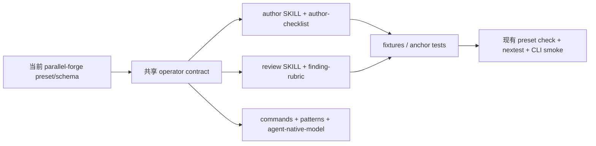

# feat: 同步 Parallel Forge 最新 operator skills

## Goal Capsule

- 目标：让 `skills/ralph-preset-author`、`skills/ralph-preset-review` 及其共享 reference/fixture 能审查当前 `builtin:parallel-forge` 的真实契约，而不是停留在 7 月 28 日至 8 月 1 日前半段的旧模型。
- 权威顺序：当前源码、当前 preset/schema、可执行测试入口高于 Git 提交说明和计划文字；本计划不把 plan 文档中的未落地内容当成现状。
- 实现边界：只修改 `skills/ralph-preset-*` 下的 operator 文档与 fixture/anchor 测试；不修改生产 Rust、`presets/en/parallel-forge.yml`、schema、`crates/ralph-core/data/*.md` 或 builtin 注册。
- 停止条件：若当前 preset/schema 与本计划引用的事件、字段或权限事实不一致，停止当前 Unit，更新 Evidence Ledger 和 Decision Record 后再继续。

## Product Contract

### Requirements

- R1. Preset author 能从 operator skill 判断当前 Parallel Forge 的 artifact-derived `forge.plan.ready` handoff、静态 wave、task settlement 和字段值源。
- R2. Preset reviewer 能独立审查 per-wave review/integration/verification/settlement、失败 observation、bounded correction 和 `correction_round=3` 终局门禁。
- R3. Preset reviewer 能审查当前 `--reuse-worktree` / reuse-history 与 `forge.worktrees.ready` 的复用边界、证据状态和“reuse 不得伪造 `forge.wave.settled`”的边界；未来的 `forge.reuse.assessed` 不得被写成当前 topic。
- R4. Preset reviewer 能审查 readonly hat gate、auditor 单业务终态、reporter 合法的 `forge.report.done → LOOP_COMPLETE` 窄例外、completion payload 一致性和 fail-close Accepted Transition。
- R5. 新规则必须保持 loop 外 operator skill 的知识分层：具体路径和 topic 属于 preset/schema；通用审查模型、finding 和验证命令属于 `skills/ralph-preset-*`；runtime 内部 ledger 不得被写成 agent-facing 业务接口。
- R6. 所有新增规则必须有可复现的 anchor/fixture/CLI 验收；不能用锁定完整 prompt 文案的测试代替结构化行为验证。

### 调用方与行为变化

- 调用方是创建或评审 Ralph preset 的人类 operator，以及执行 `ralph-preset-author` / `ralph-preset-review` 的 agent。
- 当前行为：operator skill 已覆盖 artifact-first、wave/supervisor capability、single-chain 和部分 terminal 规则，但对当前 worktree reuse evidence、新版失败 topic、`failure_fingerprint`、`correction_round`、readonly gate、auditor/reporting terminal ownership 和 accepted flow authority 没有专门规则；`forge.reuse.assessed` 仍是计划中的未落地 topic。
- 目标行为：面对当前 `parallel-forge` YAML/schema，author/reviewer 能定位所有新字段的值源、可见性、消费动作、权限边界和失败恢复路径，并能用现有 CLI/nextest 入口验证。
- 输入：当前 `presets/en/parallel-forge.yml`、`presets/schemas/parallel-forge.yml`、`presets/templates/parallel-forge/`、现有 operator references、fixture 和 `test_skill_anchors.py`。
- 输出：更新后的 author/review SKILL、五个共享 reference、fixture README/新增 fixture、anchor/结构测试，以及本计划要求的验证记录。
- 状态变化：仅改变文档与 operator review contract；不改变 runtime event、TaskStore、preset topology、CLI 行为或持久化数据。
- 错误语义：文档或 fixture 发现当前契约不一致时必须 fail closed，不能用模糊措辞或把缺口标为 FYI；真实 preset 的结构化检查失败时不得通过修改测试削弱断言。
- 兼容性：保留现有通用 preset author/review 规则和全部既有 fixture；新增规则只针对实际使用对应能力的 preset 生效。
- 性能：不增加 runtime 成本；operator 审查可增加只读 CLI 调用，但不引入新依赖或数据库迁移。
- 安全/权限：继续禁止把 `.ralph/events.jsonl`、`.ralph/loops.json`、`.ralph/supervisor.db` 当业务 artifact；readonly hat 的源码/Git mutation 必须可被审查规则发现。

### Scope Boundaries

本次范围：worktree reuse/status evidence、artifact-derived plan handoff、静态 wave settlement、失败 observation/correction、readonly gates、auditor/reporter terminal ownership、Accepted Transition/fail-close、统一 task capability 的 operator 文档和 review fixtures。

非目标：实现上述 runtime 能力；修改 `parallel-forge` YAML/schema；新增 `ralph` CLI；更新 injected `ralph-tools*.md`；新增 finding lint 规则；修改 preset 注册、manifest、index 或 zsh completion。

### Deferred to Follow-Up Work

- 将本次 review-only finding 转成 `ralph preset check` 机械 lint：本计划不改变 lint 生产代码或 finding registry。
- 新增完整 Parallel Forge E2E cassette：当前仓库已有 `ralph-e2e` placeholder，但本计划不把它升级为硬门禁。
- 为每个新 capability 建立独立 runtime skill guide：只有当 agent-facing CLI/topic 行为变化且当前 `crates/ralph-core/data/*.md` 不准确时才另立计划。

## Planning Contract

### 已确认事实与 Evidence Ledger

| Evidence ID | 来源 | 观察结果 | 对计划的影响 | 可靠性 |
|---|---|---|---|---|
| E1 | `presets/en/parallel-forge.yml` 当前内容 | preset 声明 `execution_model: supervisor`、isolated supervisor、artifact-first guardrail、静态 wave loop、reporter terminal；instructions 已引用 `failure_fingerprint`、`correction_round`、`forge.audit.done`。 | 以当前 preset 为 operator skill 的事实输入，不重写 runtime。 | 高 |
| E2 | `presets/schemas/parallel-forge.yml` 当前内容 | schema 已声明 `forge.plan.ready` artifact identity/digest、`forge.wave.review.failed`、`forge.verification.failed`、`forge.correction.requested/done`、`forge.final.correction.settled` 且 final `correction_round` 只允许 3。 | rubric/checklist 必须覆盖这些字段和 allowed values。 | 高 |
| E3 | `docs/solutions/workflow-orchestration/parallel-forge-preset-integration-gap.md` | 记录了 schema pointer、event_filter/triggers、wave settlement、CloseTaskBatch、模板和真实 BDD 的历史集成缺口及验收方式。 | 复用其“结构化契约优先、不得锁 instruction 文案”的验证原则。 | 高 |
| E4 | `docs/plans/2026-07-29-001-fix-parallel-forge-static-wave-settlement-plan.md` | R28 要求新 topic/field/wave 行为同步 AI skill、operator skill、schema、BDD、builtin docs。 | 将 operator skill 同步列为必需交付，不作为可选文档。 | 高 |
| E5 | `docs/plans/2026-07-29-002-feat-parallel-forge-reuse-status-plan.md` | R30 要求 reuse event/required fields/template 与 agent/operator docs 同步；计划提出 `forge.reuse.assessed`、连续 reusable prefix、assessment digest/precheck，但该 topic 尚未出现在当前 schema。 | 新增当前 worktree reuse evidence 规则；将未来 assessment topic 作为 deferred，不把 reuse 当普通 retry。 | 高 |
| E6 | `docs/plans/2026-07-29-003-feat-parallel-forge-readonly-hat-gates-plan.md` | 计划列出 readonly hat 的 `allowed_write_paths`、mutation capture、六个 verdict gate 及 operator reference/fixture 同步面。 | 增加 readonly review checklist/rubric；只验证 operator 规则，不实现 guard。 | 高 |
| E7 | `docs/plans/2026-07-29-004-refactor-parallel-forge-auditor-reporter-single-event-terminal-plan.md` | 计划明确 `forge.audit.done` / `forge.report.done` 单事件终态及 completion payload 规则，并指定 operator references 为受影响文件。 | 增加 terminal/paired payload audit 规则。 | 高 |
| E8 | `git log --all -- skills/ralph-preset-*` | 最近 operator skill 变更停在 `a7411f29`（2026-08-01 artifact-first handoff）；HEAD 后续的 7/30–8/2 PF/runtime commits 未修改这些 skills。 | 当前 skills 存在可验证的时间差，计划不是重复已完成同步。 | 高 |
| E9 | `skills/ralph-preset-common/tests/test_skill_anchors.py` | 现有测试只检查四个通用 anchor，且测试说明明确是 anchor contract，不是完整 prompt 文案锁定。 | 新增测试应延续 anchor/结构化 contract，不做全文 equality。 | 高 |
| E10 | `skills/ralph-preset-common/fixtures/README.md` 与现有 fixtures | 已有 artifact-first、wave/supervisor capability、trigger-context、reentry、terminal 负例，但没有 reuse/readonly/final-correction 专项 fixture。 | 增加最小专项 fixture，并在 README 声明预期 finding。 | 高 |
| E11 | `skills/ralph-preset-common/references/commands.md` 当前命令表 | 已存在 `preset check`、`emit --policy-check`、`inspect prompt`、`capability inventory`、wave 命令和 nextest 门禁。 | 新文档引用现有命令；不编造新 CLI。 | 高 |
| E12 | `AGENTS.md` 当前硬规则 | 测试入口必须使用 nextest；preset/schema 拓扑变化需同步下游；operator skill 允许编辑范围明确；文档必须中文。 | 计划验证命令统一用 nextest，并要求中英文技术标识之外的人类文档使用中文。 | 高 |
| E13 | 独立 repo research：`presets/en/parallel-forge.yml`、`presets/schemas/parallel-forge.yml`、`crates/ralph-cli/src/presets.rs` | 当前 `forge.wave.settled` 通过 `settled_task_ids` 触发 projection-owned batch close；`failure_fingerprint` 和 final `correction_round: [3]` 已是结构化契约；当前源文件未发现 `forge.reuse.assessed`。 | 把 settlement 验收落到 `forge.wave.settled`/`settled_task_ids`；把 reuse topic 改为未落地提案，不作为当前事件契约。 | 高 |
| E14 | 独立 repo research：`presets/en/parallel-forge.yml`、`skills/ralph-preset-common/tests/test_skill_anchors.py` | auditor 是 `forge.audit.done`/`forge.plan.blocked` 单业务终态；reporter 保留 `forge.report.done` 后 `LOOP_COMPLETE` 窄例外；anchor 文件由 `__main__` 直接执行，不是 pytest 收集测试。 | 修正 terminal 规则与 Python 验证命令，避免错误声称存在统一 single-event 或 pytest suite。 | 高 |

### 未确认假设

| 假设 | 为什么需要确认 | 验证动作 | 失败影响 |
|---|---|---|---|
| A1. 现有 operator review 流程能读取任意新增 YAML fixture，而无需新的 parser。 | fixture 只在 review 流程使用，当前仓库没有独立 fixture runner 的完整入口。 | Unit 1 先用现有 `ralph preset check` 对 fixture 做 shape smoke，并检查 `SKILL.md` 的 fixture 自检协议。 | 若不成立，停止 Unit 1，改为仅更新文档并记录缺失 runner；不伪造可执行测试。 |
| A2. `ralph inspect execution-plan` 是计划中的近期能力，而非当前已存在 CLI。 | plan 007 提到它，但用户本次只要求 skill 同步；当前 `commands.md` 可能尚未有命令。 | Unit 2 在实现前用 `ralph --help`/`rg` 确认；若不存在，只写为“计划能力未落地”审查注记，不写成可执行现状。 | 不阻塞其它 Unit，但禁止把该命令列入当前可执行门禁。 |

### Decision Records

| Decision ID | 决策问题 | 候选方案 | 最终选择 | 支持证据 | 排除其他方案 | 置信度 |
|---|---|---|---|---|---|---|
| KTD1 | 新能力放在哪一层 | 写入 injected `ralph-tools*.md`；写入 preset YAML；写入 operator references | 写入 `skills/ralph-preset-common/references/`，具体 preset 路径仍留在 YAML/schema | E1,E2,E4,E12 | 本次不改变 agent-facing runtime command；把具体 preset 细节写进通用 tools 会违反去计划化和知识分层 | 0.98 |
| KTD2 | 是否为每个新 topic 新增 finding lint | 新增 runtime lint；全部 review-only；混合 | 本计划全部作为 review-only checklist/rubric，机械 lint 只验证现有结构 | E6,E7,E9,E11 | 用户目标是 skills 同步；新增 lint 会扩大到生产代码、finding registry 和回归范围 | 0.96 |
| KTD3 | 如何验证文档同步 | 完整文本/byte equality；anchor/fixture/真实 CLI smoke | anchor + fixture 结构 + 当前 preset CLI smoke + nextest | E9,E10,E11,E12 | 全文 equality 会锁 prompt 文案；只 grep 文本不能证明行为 | 0.98 |
| KTD4 | reuse 如何建模 | 把未来 `forge.reuse.assessed` 当当前 topic；审查现有 reuse-worktree/reuse-history；只写概念说明 | 审查当前 `--reuse-worktree` / reuse-history、`forge.worktrees.ready`、artifact/commit evidence 和禁止伪造 `forge.wave.settled`；未来 assessment topic 单独标为 deferred | E5,E8,E13 | 当前 schema 没有 `forge.reuse.assessed`，不能把计划设计写成现状；只写概念又无法指导 author/reviewer | 0.98 |
| KTD5 | readonly 如何判定 | hat ID 硬编码；新增 preset 字段；依据现有 write-path/mutation contract | 依据当前计划和 preset 的 allowed write path / mutation capture / verdict gate 规则建立通用审查表 | E1,E6 | 不新增字段或 runtime guard；避免只对 Parallel Forge 名称硬编码 | 0.94 |
| KTD6 | terminal 规则 | 所有 terminal 都强制单事件；任意 hat 可双 emit；auditor 单业务终态 + reporter 窄例外 | auditor 只允许 `forge.audit.done`/blocked 终态；reporter 遵守 `forge.report.done` 后 `LOOP_COMPLETE` 的现有窄例外和相同 `report_path` | E1,E2,E7,E14 | “全都单事件”与当前 reporter schema/config 冲突；任意双 emit 又会误放其它 hat | 0.99 |
| KTD7 | Unit 顺序 | 按目录文件并行；先 fixtures；先契约模型再流程再验收 | U1 rubric/command contract → U2 author/review workflow → U3 fixtures/anchors → U4 final validation | E9,E10,E11,E12 | 后续 fixture 和验收依赖前置 finding/命令语义；并行会产生双 SSOT | 0.97 |

所有关键决策置信度均 ≥ 0.85；A1/A2 是执行前验证项，不被伪装为已确认事实。

### High-Level Technical Design



数据面和控制面分层保持不变：preset/schema 提供 topic、field、source 和 topology；operator reference 提供审查方法和 finding；fixture 只提供可复现反例；现有 CLI/nextest 提供验证证据。

## BDD 行为规格

### Feature: Parallel Forge operator contract coverage

  Background:
    Given 当前仓库的 `presets/en/parallel-forge.yml` 与 `presets/schemas/parallel-forge.yml` 是被审查的真实输入
    And operator skill 使用 `references/commands.md` 中已有的 CLI 与 nextest 入口

  Scenario: author identifies artifact-derived plan handoff
    Given `forge.plan.ready` 只携带 artifact reference/identity/digest
    When author 填写该 handoff 的 Payload Contract
    Then contract 必须标明 task/wave DAG 从 artifact 派生
    And 不得要求 planner 双写 derived `unit_tasks`

  Scenario: reviewer rejects invisible or fabricated wave fields
    Given topic 携带 `execution_wave`、`integration_order` 或 `execution_plan_digest`
    When reviewer 检查 field source、visibility、identity 和 downstream use
    Then 缺少 live/artifact 值源或要求 agent 手写时产生对应 finding

  Scenario: reviewer distinguishes reusable prefix from retry
    Given prior run 有 reusable wave assessment 和 digest
    When reviewer 检查 `forge.worktrees.ready`、artifact/commit evidence 和当前 plan identity
    Then reviewer 必须区分 reuse evidence 与当前运行的 retry/correction 状态
    And reuse 不得伪造新的 `forge.wave.settled` 或 `settled_task_ids`

  Scenario: reviewer enforces correction exhaustion
    Given failure observation 带 `failure_fingerprint` 和 `correction_round`
    When reviewer 检查 final correction path
    Then `forge.final.correction.settled` 只能在 `correction_round: 3` 时成立
    And round 0–2 必须继续走 requested/done correction path

  Scenario: reviewer detects readonly mutation
    Given reviewer/verifier/tester 被声明为只读
    When activation 前后 protected Git snapshot 发生其权限范围内的 mutation
    Then review 必须阻塞 verdict 或记录 strict readonly finding
    And 不得自动 reset 用户工作区

  Scenario: reviewer enforces auditor and reporter terminal ownership
    Given auditor 发布 `forge.audit.done`，reporter 发布 `forge.report.done`
    When reviewer 检查 terminal ownership 和 completion payload
    Then auditor 不得引入第二个业务终态 publisher
    And reporter 只能使用已有 `forge.report.done` 后 `LOOP_COMPLETE` 窄例外
    And reporter 的 completion path 必须遵守已有 report path consistency 规则

  Scenario: existing generic fixtures remain valid
    Given 现有 artifact-first、wave/supervisor、trigger-context 和 terminal fixtures
    When 运行现有 anchor/fixture review checks
    Then 既有 finding 仍可被发现，新增规则不改变无关 fixture 的预期

## 验收与测试策略

| Scenario | 验收条件 | 测试入口 | 层级 | 风险补充 | E2E |
|---|---|---|---|---|---|
| artifact-derived handoff | reference/identity/digest、derived DAG、禁止 payload 双写均有 checklist/rubric 条目 | `skills/ralph-preset-common/tests/test_skill_anchors.py` + review 自检 | 文档 contract/fixture | 结构化 grep，防止只写 prose | 否 |
| worktree reuse | `--reuse-worktree`、reuse-history、`forge.worktrees.ready`、plan/artifact/commit evidence、no fake settlement 均出现 | 新增 fixture + `ralph preset check` smoke | fixture/CLI 集成 | dirty/tampered/drift/legacy evidence | 否 |
| correction exhaustion | fingerprint、round 0–2、final round 3 的 finding/放行规则可区分 | 新增 fixture + operator review protocol | fixture/结构化 | round=1 冒充 final、重复 fingerprint | 否 |
| readonly gate | protected snapshot、allowed path、hard stop、无自动清理写入 rubric | 新增 fixture + reference anchor | fixture/文档 contract | pre-existing dirty workspace | 否 |
| auditor/reporter terminal | auditor 单业务终态、reporter required event + completion 窄例外、completion payload match 规则存在 | `test_skill_anchors.py` + preset/schema CLI smoke | anchor/CLI | duplicate terminal、report path mismatch | 否 |
| backward compatibility | 既有 fixture/anchors 不退化，通用规则仍保留 | `.venv/bin/python` 直接运行 anchor 脚本及可收集的 Python tests | 回归 | 旧 finding 被重命名或误报 | 否 |

所有 fixture 的具体 expected finding 必须以当前 review protocol 能观察到的结果为准；若实际 fixture runner 不存在，必须停止并把该验收降级为人工 review evidence，不得伪造自动化通过。

## 需求—测试追踪矩阵

| Requirement ID | 需求 | Scenario | 验收测试 | 单元/文档测试 | 集成/契约 | E2E | Evidence |
|---|---|---|---|---|---|---|---|
| R1 | artifact-derived handoff | S1,S2 | U1/U2 contract checks | anchor + checklist | preset/schema smoke | — | E1,E2,E3 |
| R2 | wave/failure/correction | S2,S4 | U2 rubric checks | fixture expected findings | preset check | — | E2,E3 |
| R3 | worktree reuse boundary | S3 | U2/U3 reuse fixture | anchor + rubric | preset check if supported | — | E5,E13 |
| R4 | readonly/terminal/authority | S5,S6 | U2/U3 fixtures | rubric + anchors | current preset/schema smoke | — | E1,E2,E6,E7 |
| R5 | knowledge layering | all | U1/U2 reference review | path/ledger scans | `check-cli-doc-drift.sh` only if affected command reference | — | E4,E11,E12 |
| R6 | reproducible verification | S7 | U3/U4 test suite | `test_skill_anchors.py` + pytest | preset lint/strict smoke | — | E9,E10 |

## Implementation Units

### U1. 冻结当前 Parallel Forge operator contract 与 finding taxonomy

1. Unit 目标：建立一份不重复 runtime 实现、但完整覆盖当前 PF topic/field/capability 的共享 operator contract。
2. 对应需求与 Scenario：R1,R2,R3,R4,R5；S1–S6；KTD1–KTD6；E1–E8,E11。
3. 外部可观察结果：author/reviewer reference 能明确区分 artifact path、control payload、runtime ledger、reuse evidence、failure observation、terminal event。
4. 当前行为基线：`references/agent-native-model.md` 已有 artifact-first、task authority、wave/supervisor 基础段，但对本计划列出的新 PF-specific fields/topics 无覆盖；`finding-rubric.md` 现有 finding 表未出现当前 reuse-worktree evidence、`failure_fingerprint`、`correction_round`、readonly snapshot 等完整专项规则。当前 schema 也没有 `forge.reuse.assessed`，不得把它当现状。
5. 输入输出：输入为当前 preset/schema；输出为 reference 中的术语、审查问题、finding ID/严重度建议、命令证据等级；不得改 runtime。
6. 修改位置：
   - `skills/ralph-preset-common/references/agent-native-model.md`：补 PF handoff/wave/reuse/readonly/terminal 的通用模型，禁止写某次 plan ID。
   - `skills/ralph-preset-common/references/finding-rubric.md`：补 review-only finding 表、默认 severity/confidence/aaf question 与 lint-vs-review-only 边界。
   - `skills/ralph-preset-common/references/patterns.md`：补 per-wave settlement、correction、worktree reuse evidence、single-event/paired terminal pattern。
   - 明确不修改 `crates/ralph-core/src/`、`presets/*`、`crates/ralph-core/data/*`。
7. 可依赖能力：E1/E2 的当前 schema/preset；现有 artifact-first/wave/supervisor rubric。
8. 禁止依赖未来能力：不依赖新 lint、`forge.reuse.assessed`、`inspect execution-plan`、新 runtime guard 或未注册 E2E。
9. 验收测试：检查每个当前 PF 新 topic/field 在 reference 中有 source/visibility/consumer/错误语义；检查 runtime internal ledger 禁止项仍存在；检查 finding ID 不与现有 finding 冲突。
10. Acceptance Red：先对当前 references 做关键词和 capability inventory 对照；预期发现 reuse/failure fingerprint/readonly/auditor 的覆盖缺失。若只得到命令环境错误、路径不存在或未执行到 reference 内容，不算有效 Red。
11. 单元测试拆分：术语覆盖；topic/field coverage；finding ID 唯一性；review-only 与 lint boundary；knowledge-layer 禁止项。不得 mock 当前 preset/schema 事实。
12. Red → Green → Refactor：先写 coverage inventory 的失败断言 → 增加最小 reference 条目 → 验证每个 finding/term → 合并重复规则 → 重新扫描 plan-specific wording 和 internal-ledger 泄漏。
13. 最小实现范围：只建立可被 U2 引用的共享模型和 finding 语义，不写 author/reviewer 流程步骤，不新增 CLI。
14. 集成验证：以当前 schema/preset 的 `rg`/YAML 结构为真实输入，运行现有 `ralph capability inventory --format json`（若 binary 可用）确认引用的 capability ID 可追溯；失败则记录环境原因。
15. 风险驱动测试：Characterization（当前 reference anchors）；结构化 coverage scan（防漏新 topic）；不做全文 snapshot。
16. 回归范围：现有 `test_skill_anchors.py`、所有现有 fixture README 交叉引用、现有 finding ID 表；原因是新增通用条目可能改变 reviewer 的 finding 解释。
17. 预期文件变更：见第 6 项，全部为修改现有 operator reference；Evidence E1–E11。
18. 完成标准：contract coverage 完整、finding ID 唯一、中文说明可执行、无计划编号/过窄 preset 事故泄漏、anchor 测试仍通过、可独立提交。
19. 停止条件：发现 schema 中的 topic/field 与 E1/E2 不一致；无法确定 finding 是 review-only 还是 lint；需要新生产接口；任一决策低于 0.85。
20. 风险与注意事项：最大风险是把具体 PF 行为误写成全局 runtime 规则；检测为逐条核对知识分层；缓解是只引用 agent 可见动作和 operator 可执行命令。

### U2. 同步 preset author/review 的执行流程与专项检查

1. Unit 目标：让 author/reviewer workflow 能使用 U1 contract 审查当前 Parallel Forge，而不是只知道通用 artifact-first。
2. 对应需求与 Scenario：R1–R5；S1–S6；KTD1–KTD6；E1–E8,E11,E12。
3. 外部可观察结果：运行 author/review skill 时，报告会要求检查 reuse、readonly、failure correction、auditor/reporter terminal、accepted flow authority，并给出当前可执行验证命令。
4. 当前行为基线：`skills/ralph-preset-author/SKILL.md` 已有 artifact-first、capability discovery、wave/supervisor、template 规则；`skills/ralph-preset-review/SKILL.md` 已有 artifact-first、wave/supervisor、single-chain、payload/terminal 规则，但无上述最新 PF 专项流程。规则必须采用 capability-triggered gating，不能按 builtin 名称硬编码。
5. 输入输出：输入为 U1 references + 当前 preset/schema；输出为 author draft gate、review workflow、report sections、命令顺序和停止条件。
6. 修改位置：
   - `skills/ralph-preset-author/SKILL.md`：在 capability discovery/Payload Contract/自检流程中加入 PF-specific contract 使用规则。
   - `skills/ralph-preset-review/SKILL.md`：加入 PF 专项审查步骤、报告表列、failure/readonly/terminal/reuse finding 映射。
   - `skills/ralph-preset-common/references/author-checklist.md`：加入可执行 checklist。
   - `skills/ralph-preset-common/references/commands.md`：只补已确认存在的命令/验证顺序；A2 命令未确认前不得写成当前事实。
   - 明确不修改 preset YAML/schema 和 injected skill。
7. 可依赖能力：U1 的 finding/术语；现有 `ralph preset check`、`ralph emit --policy-check`、`inspect prompt`、`capability inventory` 命令。
8. 禁止依赖未来能力：不要求 reviewer 运行未确认的 `inspect execution-plan`；不引入新的 lint ID；不要求读取 runtime ledger。
9. 验收测试：author checklist 能逐 topic 要求 source/visibility/identity/downstream/artifact；review workflow 能在 lint fail 时继续 review-only audit；报告 Executive Summary 能分别列 mechanical lint、payload、artifact-first、reuse、readonly、terminal 结果。
10. Acceptance Red：用当前 PF preset 走 reference checklist，预期在新增专项 section 出现前无法定位 reuse/readonly/final correction/accepted transition；若执行失败仅来自命令不存在而未阅读文档，不算有效 Red。
11. 单元测试拆分：author capability gate；review capability gate；命令证据等级；report table completeness；停止条件/禁止行为。
12. Red → Green → Refactor：先添加缺失 section 的结构化 anchor 断言 → 最小更新 SKILL/checklist/commands → 运行现有 anchor/文本结构扫描 → 去除重复命令表和 plan-specific wording。
13. 最小实现范围：使两套 SKILL 能调用 U1 contract；不改变通用 AAF 五问、artifact-first finding 名称或已有 fixture 预期。
14. 集成验证：对 `builtin:parallel-forge` 执行 `ralph preset check --strict`、`ralph emit --schema`/`--policy-check` 的只读 smoke；命令失败必须记录真实输出并区分 preset finding 与环境失败。
15. 风险驱动测试：contract test（commands.md 与 `--help`）；negative path review（lint fail 仍继续 AAF）；knowledge-layer scan。
16. 回归范围：现有 author/review SKILL anchors、artifact-first/wave/supervisor fixture 说明、commands.md 现有命令；原因是 workflow 扩展容易覆盖旧窄例外。
17. 预期文件变更：`skills/ralph-preset-author/SKILL.md`、`skills/ralph-preset-review/SKILL.md`、`skills/ralph-preset-common/references/author-checklist.md`、`commands.md`；Evidence E1,E2,E4–E8,E11。
18. 完成标准：author/review 都能从当前 preset/schema 找到新规则；命令未确认项被明确标记；无假设性 CLI；review report contract 完整。
19. 停止条件：CLI help 与 commands.md 冲突；出现必须改 runtime 的规则；发现 author/review 需要不同 SSOT；置信度下降。
20. 风险与注意事项：review 流程可能将 PF-specific rule 误套到普通 preset；缓解是显式以“capability applies_when” gating，并保留通用路径。

### U3. 增加专项 fixture 与 anchor/结构化验收

1. Unit 目标：用最小 fixture 证明 U1/U2 的新规则能区分反例，不锁定完整 prompt 文案。
2. 对应需求与 Scenario：R2–R6；S3–S7；KTD2,KTD3,KTD7；E9,E10。
3. 外部可观察结果：reviewer 能针对 reuse、readonly、correction exhaustion、terminal ownership 看到预期 finding；既有 fixture 继续验证旧规则。
4. 当前行为基线：现有 fixtures 覆盖 artifact-first、wave/supervisor、trigger-context、reentry、terminal，但没有四类 PF 专项 fixture；`test_skill_anchors.py` 只有四个 anchor。
5. 输入输出：输入为最小 YAML anti-pattern；输出为可读 README 说明、预期 finding 类别和 anchor/结构测试结果；不要求新增生产 parser。
6. 修改位置：
   - `skills/ralph-preset-common/fixtures/README.md`：登记专项 fixture、运行入口和预期边界。
   - `skills/ralph-preset-common/fixtures/`：计划新增 worktree-reuse、readonly、correction exhaustion、terminal ownership 四个最小负例；实际文件名在 Unit 3 开始前按现有命名与 fixture runner 约定冻结，不能在执行中随意扩展。
   - `skills/ralph-preset-common/tests/test_skill_anchors.py`：增加稳定 section/anchor/唯一性检查，不做全文 equality；保持脚本直接执行入口。
7. 可依赖能力：U1 finding taxonomy、U2 workflow 条目、现有 fixture schema/README 运行说明。
8. 禁止依赖未来能力：不编写真实 runtime BDD；不要求 fixture 触发尚未存在的 mechanical lint ID；不把计划 ID 写入通用 fixture 文本。
9. 验收测试：四个专项 fixture 可加载；每个 fixture 的反例轴可被人工 review protocol 定位；anchors 只检查稳定标题/关键词存在且无重复；既有 fixture 仍保留。
10. Acceptance Red：先新增预期 finding/anchor 断言而不新增条目，确认失败是“缺少目标 contract/fixture”，不是 YAML parse 或路径错误；若失败由 fixture runner 不存在引起，记录 A1 并停止，不继续伪造 Green。
11. 单元测试拆分：fixture YAML parse/load；finding axis presence；anchor uniqueness；existing fixture inventory；README command references。
12. Red → Green → Refactor：fixture loader/anchor Red → 添加最小 fixture → 让每个 axis 可被 review protocol 识别 → 收敛重复 YAML → 运行旧 fixture 回归。
13. 最小实现范围：只增加能证明新规则的最小反例；不新增正例全文 preset，不复制 `parallel-forge.yml`。
14. 集成验证：使用当前 `ralph preset check -H <fixture> --strict --format json`（若 fixture 支持该入口）和 `.venv/bin/python skills/ralph-preset-common/tests/test_skill_anchors.py`；对 review-only finding 必须以人工 protocol 记录，不声称 CLI 自动吐出。
15. 风险驱动测试：Characterization（旧 fixture）；negative fixture；唯一性扫描；不做 mutation/fuzz，因为输入是受控文档 fixture 且没有 parser 生产边界变化。
16. 回归范围：所有旧 fixture、`test_skill_anchors.py`、fixture README 的命令和路径；原因是新增 fixture/anchor 可能造成遗漏或命名冲突。
17. 预期文件变更：`fixtures/README.md`、四个计划新增 fixture（Unit 3 起先确认实际名称）、`tests/test_skill_anchors.py`；Evidence E9,E10。
18. 完成标准：每个新增 fixture 有单一主要反例、预期 finding、运行说明；旧 fixture 不减少；无 skip/only/弱断言。
19. 停止条件：fixture 无法被现有流程加载；需要新增 parser/dependency；expected finding 只能靠全文 prompt 比较；发现旧 fixture 行为改变。
20. 风险与注意事项：review-only finding 不会自动出现在 `preset check` JSON；README 必须明确这一点，避免将人工 review 误报为机械 lint 通过。

### U4. 完成文档漂移、CLI 契约和全量质量门禁

1. Unit 目标：证明更新后的 operator skill 与当前 CLI、preset/schema、anchor/fixture 测试一致，并形成可独立提交的最终文档变更。
2. 对应需求与 Scenario：R1–R6；S1–S7；KTD3,KTD7；E1–E12。
3. 外部可观察结果：从仓库干净 checkout 运行规定命令，operator skill anchors、fixtures、preset strict lint、CLI help/doc drift 和 Python tests 均通过或明确记录环境阻塞。
4. 当前行为基线：仓库硬规则要求 nextest；已有 fixture README 指定 `ralph preset check`；`test_skill_anchors.py` 是当前 skill contract 测试入口，使用 `__main__` 直接执行而非 pytest 收集。
5. 输入输出：输入为 U1–U3 完成的 docs/fixture 变更；输出为验证结果、更新后的 Evidence/Decision 记录和 implementation-ready plan completion evidence。
6. 修改位置：
   - `skills/ralph-preset-common/references/*.md`：仅修复验证发现的交叉引用/命令 drift。
   - `skills/ralph-preset-common/fixtures/README.md` 与 anchor test：仅修复验证发现的路径/anchor drift。
   - 不修改生产代码；不修改计划残留 runtime 状态。
7. 可依赖能力：U1–U3 全部已验证能力；仓库已有 `scripts/check-cli-doc-drift.sh`、`./scripts/run-tests.sh`、cargo nextest、Python `.venv` 约束。
8. 禁止依赖未来能力：不因某条命令缺失而新增 CLI；不把未注册 E2E placeholder 作为完成条件。
9. 验收测试：CLI help 与 commands reference 一致；strict preset lint 通过；skill anchors/fixtures 通过；最终 full regression 通过；AGENTS/CLAUDE 未被改动则无需同步。
10. Acceptance Red：先运行 targeted docs/anchor/fixture 命令，记录真实失败；只有失败指向本 Unit 的文档/fixture drift 才是有效 Red，环境/依赖下载/未安装工具失败不得作为 Red。
11. 单元测试拆分：anchor test；Python fixture tests；CLI help drift；PF strict lint；完整 nextest regression。
12. Red → Green → Refactor：先跑 targeted Red → 修复最小文档/fixture drift → targeted Green → 全量回归 → 删除临时输出和 plan residual。
13. 最小实现范围：只闭合 U1–U3 的交叉引用和验证，不新增内容型规则。
14. 集成验证：真实 `builtin:parallel-forge` preset/schema、现有 CLI、skill tests 联合验证；runtime 生产行为不在本计划变更，但 strict lint/scenario smoke 仍需确认未被文档同步误导。
15. 风险驱动测试：command contract、full regression、旧 fixture characterization；不做新 E2E。
16. 回归范围：`skills/ralph-preset-common/tests`、所有 fixture、`ralph-cli` preset_lint/presets、`ralph-core` preset_lint、BDD scenarios、`scripts/check-cli-doc-drift.sh`、最终 `./scripts/run-tests.sh`；原因是 operator docs 引用这些公开契约。
17. 预期文件变更：仅 U1–U3 文件及必要的交叉引用修正；Evidence E9–E12。
18. 完成标准：所有验证命令通过或有明确非代码环境 blocker；无新增 skip/only；plan evidence/decision 更新；可独立提交。
19. 停止条件：发现需要生产代码、preset/schema、injected skill 或新增依赖；全量回归暴露与 docs 无关失败；任何关键决策低于 0.85。
20. 风险与注意事项：全量测试可能暴露 pre-existing baseline failure；必须区分 baseline 与本 Unit 失败，禁止用 `RALPH_BASELINE_SERIAL=1` 作为默认路径。

## Unit 串行依赖图

```text
U1 共享 contract / finding taxonomy
 ↓ U2 引用并落入 author/review workflow
U2 author/review 执行流程
 ↓ U3 按已冻结 finding 设计最小 fixture/anchor
U3 fixture / anchor 验收
 ↓ U4 验证全部公开命令、旧 fixture 与全量回归
U4 最终质量门禁
```

U2 不能先于 U1，因为 author/review 不得各自创造字段语义或 finding SSOT。U3 不能先于 U2，因为 fixture expected finding 必须来自已冻结 workflow。U4 不能提前，因为它验证前三个 Unit 的交叉引用和最终回归。

## 执行命令清单

所有测试按仓库硬规则使用 `cargo nextest run`；Python 测试使用仓库 `.venv`。命令失败不得进入下一条，除非失败被明确标记为环境缺失且不属于有效 Red。

| 时机 | 命令 | 目的 | 预期结果 |
|---|---|---|---|
| U1/U2 targeted | `./.venv/bin/python skills/ralph-preset-common/tests/test_skill_anchors.py` | 验证稳定 skill anchors | 通过；这是当前脚本的直接执行入口，不依赖 pytest 收集 |
| U2 CLI contract | `ralph preset check -H builtin:parallel-forge --strict --format json` | 验证当前 builtin preset 结构化契约 | 无新的 preset finding |
| U2 schema smoke | `ralph emit --schema <topic> -H builtin:parallel-forge` | 验证当前 topic schema 仍可查询 | 对计划列出的 topic 返回 schema；topic 名必须从当前 schema 读取 |
| U2 policy smoke | `ralph emit --policy-check --output json <topic> '<payload>' -H builtin:parallel-forge` | 验证文档引用的 policy-check 入口真实存在 | 返回结构化结果；payload 使用当前 schema 最小合法/非法样本 |
| U3 fixture | `ralph preset check -H skills/ralph-preset-common/fixtures/<fixture>.yml --strict --format json` | 验证 fixture 可加载 | 只接受预期的结构化 finding；review-only finding 不得声称由该命令产生 |
| U3/U4 skill regression | `./.venv/bin/python -m pytest skills/ralph-preset-common/tests`（先确认 pytest 收集到实际测试；anchor 脚本仍单独直接执行） | 验证可收集的 Python skill tests | 通过；若无收集项，不得把“0 tests”当通过，需记录实际入口 |
| U4 docs drift | `scripts/check-cli-doc-drift.sh` | 检查命令/参数文档漂移 | 通过；只有实际修改 agent CLI docs 时才是硬门禁 |
| U4 package regression | `cargo nextest run -p ralph-cli --bin ralph -- preset_lint` | 验证 preset lint 消费者未被文档改动影响 | 通过 |
| U4 package regression | `cargo nextest run -p ralph-core -- preset_lint` | 验证 core preset lint baseline | 通过 |
| U4 preset parity | `cargo nextest run -p ralph-cli --bin ralph -- presets` | 验证 builtin preset parity | 通过 |
| U4 scenario regression | `cargo nextest run -p ralph-core --test scenarios -- parallel_forge` | 验证 PF 真实 EventLoop 场景仍通过 | 通过 |
| U4 final | `./scripts/run-tests.sh` | 仓库要求的最终全量门禁 | 通过；若发生时序 flake，按 AGENTS 规则记录后才允许显式 serial fallback |
| U4 final quality | `cargo fmt --check`、`cargo clippy`、`cargo build` | 格式、lint、build | 全部通过；命令为仓库现有入口 |

`inspect execution-plan` 在 A2 未验证前不得放入命令清单；若 Unit 2 验证它已存在，可在 `commands.md` 增加实际 `--help` 证据，否则只记录为 deferred。

## Verification Contract

| 门禁 | 适用 Unit | 完成信号 |
|---|---|---|
| Evidence/Decision consistency | U1–U4 | 每个新增判断都可回溯当前 preset/schema、测试入口或已标注的计划证据；无低于 0.85 的关键决策 |
| Operator reference contract | U1–U2 | 术语、finding、命令和知识分层无冲突；不包含 plan ID/事故路径/内部 ledger 依赖 |
| Fixture/anchor contract | U3 | 新 fixture 单一反例、expected finding 明确、旧 fixture 不减少、anchor 不锁全文 |
| CLI and preset regression | U4 | strict preset lint、presets parity、scenario 子集通过 |
| Repository regression | U4 | `./scripts/run-tests.sh`、fmt、clippy、build 通过 |

## Definition of Done

- R1–R6 均有至少一个 BDD Scenario、一个可执行验收入口和一个串行 Unit。
- U1–U4 按顺序完成完整的 Acceptance Red → Unit Red → Green → Refactor → Integration → Regression → Close。
- `skills/ralph-preset-author/SKILL.md` 与 `skills/ralph-preset-review/SKILL.md` 能引用共享 contract，而不是各自复制冲突规则。
- reuse、readonly、correction exhaustion、auditor/reporter terminal、artifact-derived handoff 和 accepted authority 均有明确触发条件、动作、证据来源和停止条件。
- 现有 generic fixtures/anchors 保持通过；新 fixture 不依赖全文 prompt equality。
- 所有文档人类说明使用中文；技术标识符、文件名、命令和事件名保持真实拼写。
- 未修改生产代码、preset/schema、injected skill、manifest/index/zsh completion，除非停止条件证明 scope 已变且重新决策达到阈值。
- 没有新增 skip、only、弱化断言、无解释 snapshot/golden 或 ephemeral `.ralph/review` 残留。
- 每个 Unit 可独立提交，且最终变更只落在计划文件列出的 operator skill/reference/fixture/test 范围。

## Final Plan Self-Check

| 检查项 | 结果 | 证据或说明 |
|---|---|---|
| 这是实施计划而不是 Roadmap | 是 | 四个 Unit 都以可观察 operator 行为、真实文件、Red/Green 和回归门禁定义 |
| Executor 仍需做关键设计决策 | 否 | KTD1–KTD7 已冻结；A1/A2 有 Unit 内验证和停止条件 |
| 所有文件和接口有代码库证据 | 是 | E1–E14；计划新增 fixture 已明确标为“计划新增” |
| 所有关键决策置信度 ≥ 0.85 | 是 | KTD1–KTD7 为 0.94–0.98 |
| 存在未处理低置信度假设 | 否 | A1/A2 已给出验证动作、失败影响，不作为已确认事实 |
| 每个 Unit 只有一个可观察行为 | 是 | contract、workflow、fixture、final gate 四个单一纵向切片 |
| 每个 Unit 可以独立验证 | 是 | 每个 Unit 有 Acceptance Red、测试入口、集成和回归范围 |
| 每个 Unit 有真实 Red | 是 | Red 以当前 skills 缺少专项 coverage 或 fixture/anchor 缺失为预期；环境失败明确排除 |
| 每个 Unit 包含回归范围 | 是 | U1–U4 第 16 项均列出直接与相邻回归 |
| 存在未来 Unit 依赖 | 否 | 依赖严格为已完成前置 Unit，不提前实现后续能力 |
| 存在泛化任务描述 | 否 | 每项均指定 reference、fixture、topic、命令或断言 |
| 所有 Scenario 可追踪到测试和 Unit | 是 | S1–S7 映射至矩阵与 U1–U4 |
| 所有关键决策有 Evidence | 是 | KTD 表逐项引用 E1–E14 |
| 计划可以严格串行执行 | 是 | U1 → U2 → U3 → U4，无并行 Unit |

本计划的实现关键决策均已达到 0.85；A1/A2 只允许在指定 Unit 的入口验证，若验证失败必须按停止条件重写计划，不得让 Executor 猜测。
