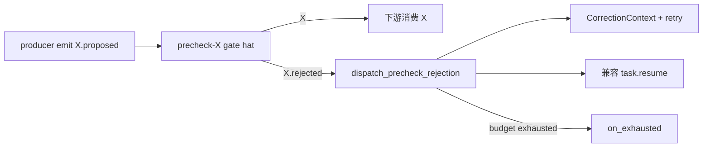
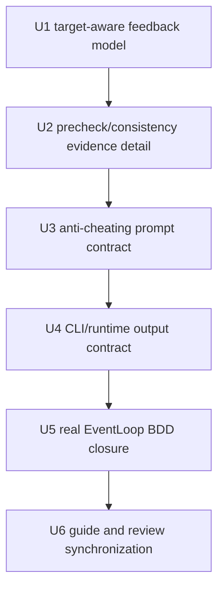

# 统一证据约束的拒绝反馈与纠错回合

## 0. 计划状态

- **状态：** READY。所有进入实施的关键技术决策置信度均不低于 0.85。
- **基线：** `90e399d800b3c579636f6b4bb4406720ad9569f4`，当前分支为 `pittcat-dev`。
- **调查范围：** `CorrectionContext` / `PromptContext`、`Rejection` 与 recovery ledger、precheck 脱糖和拒绝分派、`SemanticGateViolation` 与 payload consistency、CLI policy-check 错误输出、真实 EventLoop BDD 场景、agent-facing `crates/ralph-core/data/*.md`、preset author/review 规程、相关历史计划和解决方案。
- **已执行的调查命令：** `git status --short --branch`、`git rev-parse HEAD`、`git log --oneline -- crates/ralph-core/src/correction crates/ralph-core/src/event_loop crates/ralph-core/data/ralph-tools-emit.md crates/ralph-core/data/ralph-tools-precheck.md`、多组 `rg`/`sed` 源码与测试读取。
- **已执行的验证：** 代码入口、类型定义、调用链、现有 BDD fixture、policy-check 输出结构、Correction prompt 注入位置和相关 Git 历史均已静态核对；未运行测试或构建，因为本计划阶段不执行实现验证。
- **尚未执行的验证：** 所有 Red/Green、编译、nextest、BDD、CLI policy-check、preset lint、guide drift 和最终 workspace 基线均留给执行阶段，具体命令见第 9 节。
- **阻塞项：** 无。当前计划没有依赖外部服务、数据库迁移或未确认的公开 API。
- **外部研究：** 未执行。相关能力已有直接源码、测试和项目内历史模式，外部资料不会改变本计划的实现决策。

## Goal Capsule

- **Objective：** 将 precheck 和 payload consistency 的拒绝结果统一为“证据约束的纠错反馈”，让责任 hat 看到可复核的问题、事实证据和必须重新证明的条件；禁止 gate 给出可直接复制的成功 payload 或替代字段值。
- **Product authority：** 本计划中的 Product Contract 和已确认的会话决策定义行为边界；现有 `event_policy`、`CorrectionContext`、`PromptContext`、execution contract 和测试契约定义实现入口；注入式 guide 只描述 agent 下一步可执行的通用动作。
- **Execution profile：** 严格按 U1 → U2 → U3 → U4 → U5 → U6 串行执行；每个 Unit 必须完成 Acceptance Red、最小实现、单元测试、集成验证和回归后才能进入下一 Unit。
- **Stop conditions：** 如果实际调用链与本计划不一致、需要新增未记录的 rejection 来源、无法区分机械 schema 错误与语义证据错误、或任一关键决策置信度下降到 0.85 以下，停止当前 Unit，更新 Evidence/Decision 后重新规划。
- **Tail ownership：** 实现完成后由 `ce-work` 按本计划的 Verification Contract 和 Definition of Done 执行；本计划不编写生产代码。

---

## 1. 功能目标

### 1.1 业务目标

让 agent 在业务事件被 precheck 或 payload consistency 拒绝后，回到真实工作和证据来源检查问题，而不是根据错误消息猜一个能通过 gate 的 payload。

### 1.2 用户或调用方

- **A1 In-loop agent：** 接收责任 hat 的纠错 prompt，检查 artifact、diff、测试和任务状态，修复真实问题后重新声明结果。
- **A2 Runtime：** 生成、持久化、筛选和消费结构化 rejection feedback，维护 retry key、次数和升级状态。
- **A3 Preset author/reviewer：** 为 precheck checklist 和 payload consistency rule 提供可验证的不变量，不把“正确 payload”写成规则提示。
- **A4 Operator/diagnosis consumer：** 从 recovery ledger 和 `plan.blocked` 看到最后一次拒绝的 rule、证据缺口、责任 hat 和升级原因。

### 1.3 当前行为

- `CorrectionContext` 已经由 `Rejection` 构造，并通过 `LoopState.prompt_context` 渲染为 `## ORCHESTRATOR CORRECTION`；它当前主要包含 `reason_code`、stage、topic、source hat、retry 信息、自由文本 `last_message` 和可选的 schema payload template。
- precheck 的 `precheck_gate_runner` 会从 `<X>.rejected` 读取 `failed_checks`/`reason`，构造一次 correction，并同时保留 legacy `task.resume` 分派路径。
- payload consistency 在 `event_policy` 中复用 `SemanticGateViolation`，输出 `gate=payload_consistency:<rule_id>` 和 `referenced_fields`；CLI `ValidationError` 已有 `expected`、`actual`、`suggested_payload_shape`、`suggested_command` 等通用字段。
- 当前 precheck 的 `failed_checks` 是 checklist 索引数组，无法表达“观察到的事实、违反的不变量、需要重新证明的条件”。
- 当前 consistency rejection 的 `SemanticGateViolation` 主要传递 rule message 和引用字段，缺少按字段记录的实际观察值和验证义务。
- 当前 `PromptContext` 的 correction queue 在 prompt 构建时整体渲染，现有 `CorrectionContext` 没有独立的责任 target 字段；因此必须显式解决“只让原责任 hat 处理该反馈”的问题。
- 机械 schema 错误使用 `suggested_payload_shape` 是已有契约；语义 gate 不应复用这个通道输出替代答案。

### 1.4 目标行为

- precheck 和 payload consistency 的拒绝都生成统一的 evidence-bound feedback：责任 hat、拒绝类型、稳定 rule/gate、观察事实、受影响字段或 artifact、违反的不变量、必须重新证明的条件、原始 topic、retry 状态和升级状态。
- 语义拒绝不生成字段替代值、不生成可直接复制的成功 payload、不把 `message` 当作 agent 指令；agent 必须重新检查事实来源并从最新证据生成 payload。
- `PromptContext` 只向当前激活的责任 hat 注入对应反馈；无 target 或 coordinator 场景沿用现有诊断可见性规则，但不把无关 rejection 当成当前 hat 的修复任务。
- precheck gate 的 LLM rejection 和 synthetic rejection 都进入同一个 feedback 规范；synthetic rejection 明确标记“gate silent or ambiguous”，不得伪造具体检查结果。
- consistency 的 policy-check 和真实 apply 继续使用同源 finding；CLI JSON 输出与 loop prompt 使用同一结构化事实，不从自然语言解析字段。
- 同一 `retry_key` 的拒绝仍有界；通过后清除该 key 的连续失败状态；耗尽时 `plan.blocked` 或现有升级事件保留最后一份 evidence-bound feedback。

### 1.5 行为差异

| 场景 | 当前行为 | 目标行为 |
| --- | --- | --- |
| precheck 拒绝 | `failed_checks`/`reason` + correction，信息偏向 checklist 文本 | 反馈 checklist 缺口、观察证据和重新证明条件，不给成功 payload |
| consistency 拒绝 | `gate`/`referenced_fields`/message，字段实际观察值不结构化 | 反馈字段观察值和违反不变量；只要求回查事实，不提供替代值 |
| correction 注入 | 反馈没有独立 target，可能被非责任 hat 看见并误处理 | 反馈携带 target，prompt 选择性注入给责任 hat |
| semantic gate 输出 | 通用 `suggested_payload_shape`/`suggested_command` 可能被误认为修复答案 | 语义 gate 明确禁止 suggested replacement；机械 schema 错误保持原有提示 |
| 重复拒绝 | 有 retry count 和 escalation，但最后终态原因较笼统 | 升级记录保留最后 feedback、rule、证据和责任方 |

### 1.6 本次范围

- 扩展现有 `CorrectionContext`/`PromptContext` 反馈模型和渲染规则。
- 将 precheck rejection 解析为结构化证据缺口，并接入现有 correction injection。
- 为 payload consistency 的 `SemanticGateViolation` 追加结构化观察事实和验证条件所需的数据传播。
- 为 CLI `--policy-check`/`--output json` 语义错误输出区分 mechanical guidance 与 evidence-bound guidance。
- 为责任 hat 的 prompt 增加防作弊 instruction，并用真实 EventLoop BDD 验证“拒绝不产生成功事件、修复必须由新证据驱动”。
- 同步 `ralph-tools-emit.md`、`ralph-tools-precheck.md` 以及 preset author/review 中的通用规则和审计锚点。
- 更新 recovery/diagnosis 相关测试，使最后一次拒绝的结构化信息可追溯。

### 1.7 非目标

- 不新增一个独立的 `ralph correction` CLI 命令。
- 不新增新的 fixer、reviewer、precheck 或 human-in-the-loop hat。
- 不把跨事件历史一致性加入本 Unit；payload consistency 仍只检查当前 payload，跨事件问题继续由现有 execution contract/state gate 处理。
- 不取消 legacy `task.resume` 的兼容分派，除非执行时现有调用链证明该路径已完全不可达；本计划的 canonical agent-facing feedback 是 `PromptContext`。
- 不移除机械 schema 错误的 `suggested_payload_shape` 和 `suggested_command`，但它们不能出现在 evidence-bound semantic feedback 中。
- 不把所有 rejection 类型一次性改写成新的 evidence schema；本计划只覆盖 precheck 和 payload consistency 两类用户指定机制，并保持其他 rejection 的现有语义。
- 不修改 builtin preset 的业务规则或增加新的 payload consistency rule；只更新通用规则和现有 fixture。

### 1.8 输入、输出与状态变化

- **输入：** precheck `<X>.rejected` payload、payload consistency `PolicyFinding`、当前 event topic/payload、rule/gate metadata、责任 hat、retry key/count、schema/preset context。
- **输出：** 结构化 `CorrectionContext`、定向 prompt correction block、CLI `ValidationError` evidence guidance、recovery ledger record、耗尽时带最后反馈摘要的升级事件。
- **状态变化：** accepted 业务事件仍只在所有 gate 通过后进入 bus；rejected event 不推进成功状态；correction 被消费后从 prompt queue 清除；同一 rejection key 的计数在成功后复位、耗尽后进入现有升级状态。
- **副作用：** correction 继续通过现有 ledger-first/recovery-second 路径记录；不得因生成 feedback 而写入被拒绝的业务事件或修改业务 artifact。

### 1.9 错误语义

- 结构化拒绝证据缺失时，runtime 必须输出“evidence unavailable / feedback incomplete”并 fail-close，不得补造观察事实。
- malformed precheck rejection 只能生成“rejected payload malformed”诊断，不得把缺失字段解释成通过条件。
- consistency 规则命中时，`gate` 和 `referenced_fields` 必须保留；实际观察值无法安全表达时保留字段名和“unavailable”，不得从 message 猜值。
- semantic feedback 不带替代 payload；如果 CLI 仍发现 `suggested_payload_shape` 或 `suggested_command`，必须由测试阻止该组合输出。
- 非责任 hat 不因另一个 hat 的 correction 而改变其当前业务动作。
- retry budget 耗尽仍走已有 `on_exhausted`/correction escalation；最终反馈包含最后一个稳定 `retry_key` 和 evidence summary。

### 1.10 兼容性、性能、安全与约束

- 未启用 precheck 或 payload consistency 的 preset 保持现有行为；默认关闭路径必须有回归覆盖。
- 现有 `CorrectionContext`/recovery JSONL 的旧字段和历史记录仍可反序列化；新增字段使用可选/默认表示，执行阶段不得无证据破坏旧 fixture。
- feedback 只保存有限数量的字段观察值、check finding 和 bounded diagnostic text；不得复制完整事件历史或完整 payload 到 prompt/recovery。
- agent-controlled text 必须继续经过 `safe_display`/长度与控制字符约束；rule message 是诊断数据，不是 instruction channel。
- 当前 loop 的单业务事件预算、origin guard、event policy、state projection 和 terminal monotonicity 不变。
- 所有 Rust 测试必须使用 `cargo nextest run` 系列；BDD 必须使用真实 `run_workflow_guard_scenario` 路径；注入 guide 不得泄露内部 ledger 路径、函数名、计划编号或 preset 专属案例。

### 1.11 已确认假设

- 现有 `PromptContext` 是 agent-facing correction 的 canonical injection point；`task.resume` 是兼容/调度通道，不是唯一反馈载体。证据见 E3、E6、E7。
- `SemanticGateViolation` 是 consistency 的统一 policy finding 类型，CLI 与 runtime 已共享 finding 结构。证据见 E8、E9。
- precheck 的 gate rejection 和 synthetic rejection 都可在 `dispatch_precheck_rejection` 进入 correction；不需要新事件 topic。证据见 E5、E10。
- 机械 schema 反馈与语义 evidence feedback 必须保持不同信息策略。现有 `ValidationError` 同时服务两者，执行阶段以 gate/reason class 分流。证据见 E9、D3。

### 1.12 待验证假设

- **H1：** `PromptContext` 在所有目标 hat 的 prompt 构建路径都可获得当前 `hat_id`，可以在不改变 prompt builder 外部 API 的情况下定向筛选 correction。验证动作：U1 先沿 `EventLoop::build_prompt` → `prepend_correction_and_resume` → `HatlessRalph::build_prompt` 建立 characterization test；若无法定向筛选，U1 必须改为在 correction enqueue 时按 target 建立分桶。未验证前不进入 U2。
- **H2：** consistency rule 的 `when` AST 可以在不引入新表达式语言的情况下生成有限字段观察值和可读违反不变量。验证动作：U2 使用现有 `collect_referenced_fields` 和 predicate evaluator 对 `all`/`any`/single predicate 建立测试；若某组合无法稳定观察，保留字段名和条件摘要，不输出推测值。该假设不阻塞整体方案。

---

## 2. 代码库现状与证据

### 2.1 当前实现入口

#### Agent-facing correction 调用链

```mermaid
flowchart LR
  reject[业务事件被 policy / gate 拒绝]
  reject --> rejection[Rejection / PolicyFinding]
  rejection --> correction[emit_correction_context]
  correction --> prompt[LoopState.prompt_context]
  prompt --> render[prepend_correction_and_resume]
  render --> build[EventLoop::build_prompt(hat_id)]
  build --> hat[责任 hat 下一次 activation]
```

- `crates/ralph-core/src/event_loop/rejection.rs` 定义 `Rejection`、retry key 和 `build_task_resume_payload`。
- `crates/ralph-core/src/correction/mod.rs` 定义 `CorrectionContext`、`PromptContext`、ledger/recovery 记录和 correction block 渲染。
- `crates/ralph-core/src/event_loop/mod.rs` 的 `build_prompt`/`prepend_correction_and_resume` 负责在下一次 prompt 注入并消费 correction。
- `crates/ralph-core/src/event_loop/policy.rs` 将 policy finding 构造为 `Rejection` 并调用 `emit_correction_context`。

#### Precheck 调用链



- `crates/ralph-core/src/config/precheck.rs` 定义 `PrecheckConfig`、`PrecheckRule`、`PrecheckOnFail` 和 `<X>.rejected` schema 的 `failed_checks`/`reason`。
- `crates/ralph-core/src/event_loop/precheck_gate_enforcement.rs` 负责 gate silence/ambiguity 的 synthetic rejection。
- `crates/ralph-core/src/event_loop/precheck_gate_runner.rs` 负责 retry registry、rejection dispatch、precheck payload 解析和 exhausted payload。
- `crates/ralph-core/src/event_loop/mod.rs::drive_precheck_gate_obligation` / `dispatch_precheck_rejection` 将 precheck rejection 写入 correction、兼容 `task.resume` 并在预算耗尽时发出终态。

#### Payload consistency 调用链

- `crates/ralph-core/src/event_policy_payload_consistency.rs` 是纯 same-payload predicate evaluator，提供 `evaluate` 和 `collect_referenced_fields`。
- `crates/ralph-core/src/event_policy.rs::validate_event_with_options` 在 schema 等既有检查之后评估规则，构造 `ViolationType::SemanticGateViolation`。
- `crates/ralph-core/src/event_policy.rs::ViolationType` 的 `SemanticGateViolation` 已包含 `gate`、`context` 和 `referenced_fields`。
- `crates/ralph-cli/src/policy_check.rs::ValidationError` 与 `finding_record` 将 finding 序列化为 CLI/JSON 反馈，并对机械错误填充 `expected`、`actual`、`suggested_payload_shape`、`suggested_command`。

#### 现有测试和验证入口

- correction 单元测试位于 `crates/ralph-core/src/correction/mod.rs` 的 `#[cfg(test)]` 模块。
- rejection payload 和 retry 测试位于 `crates/ralph-core/src/event_loop/rejection.rs` 与 `crates/ralph-core/src/event_loop/precheck_gate_runner.rs` 的测试模块。
- EventLoop correction 行为测试位于 `crates/ralph-core/src/event_loop/tests/chain_validation.rs` 等文件。
- 真实 BDD 场景位于 `crates/ralph-core/tests/scenarios/`，统一入口为 `crates/ralph-core/tests/scenarios.rs`。
- 已有 correction 场景为 `correction_deterministic.yml`、`correction_three_escalation.yml`；已有 consistency 场景为 `payload_consistency/reject_inconsistent_fix_done.yml` 和其 accept sibling；已有 precheck 场景为 `2026-07-02-precheck-gate-pass.yml` 与 `2026-07-02-precheck-gate-exhaust.yml`。
- CLI policy-check 集成测试位于 `crates/ralph-cli/tests/integration_emit_policy.rs`，CLI policy finding 细节测试位于 `crates/ralph-cli/src/policy_check.rs` 测试模块。

### 2.2 Evidence Ledger

| Evidence ID | 来源 | 观察结果 | 对计划的影响 | 可靠性 |
| --- | --- | --- | --- | --- |
| E1 | `crates/ralph-core/src/correction/mod.rs::CorrectionContext` | 已有统一 correction 结构，包含 stage/topic/source/retry/message/schema fields，并渲染 `## ORCHESTRATOR CORRECTION`。 | 扩展现有 correction contract，不新增第二套 prompt 反馈总线。 | 高 |
| E2 | `crates/ralph-core/src/correction/mod.rs::PromptContext` | correction queue 在 prompt 构建时渲染并 consume-on-use；当前 entry 没有独立 target 字段。 | 必须增加 target-aware 过滤/分桶，才能保证反馈回到责任 hat。 | 高 |
| E3 | `crates/ralph-core/src/event_loop/mod.rs::build_prompt` 与 `prepend_correction_and_resume` | prompt 构建入口拥有当前 `hat_id`，但 correction block 当前整体渲染。 | H1 可通过 characterization test 验证；优先在渲染边界按 target 筛选。 | 高 |
| E4 | `crates/ralph-core/src/event_loop/rejection.rs::Rejection` | 已有 source hat、target hat、retry key、kind、original event metadata 和 typed rejection。 | 复用 provenance/retry 字段，避免用自然语言猜责任 hat。 | 高 |
| E5 | `crates/ralph-core/src/event_loop/precheck_gate_runner.rs::dispatch_rejection` | precheck rejection 读取 `failed_checks`/`reason`，在 budget 内回到 `on_fail.target`，耗尽发 `on_exhausted`。 | 保留 retry/exhaustion 语义，只增强 rejection detail 和 prompt instruction。 | 高 |
| E6 | `crates/ralph-core/src/event_loop/mod.rs::dispatch_precheck_rejection` | precheck 当前先构造 `Rejection`/CorrectionContext，再另建兼容 `task.resume` payload。 | canonical feedback 应由同一结构化 context 生成；避免 precheck 维护一套独立格式。 | 高 |
| E7 | `crates/ralph-core/src/event_loop/precheck_gate_enforcement.rs::RejectedPayload` | LLM rejection 和 synthetic rejection 共享 `failed_checks`、`reason`、`synthetic`；synthetic 只能知道 silent/ambiguous 和 checklist 总数。 | synthetic feedback 必须标记证据不可用，禁止声称具体检查项失败。 | 高 |
| E8 | `crates/ralph-core/src/event_policy.rs::SemanticGateViolation` | consistency finding 已包含稳定 `gate`、rule message `context`、静态 `referenced_fields`。 | 扩展同一 finding 传播观察事实/验证条件，不新增独立 consistency error type。 | 高 |
| E9 | `crates/ralph-cli/src/policy_check.rs::ValidationError` 与 `finding_record` | CLI 已对所有 finding 使用统一响应；机械错误有 `expected`/`actual`/suggested fields，semantic finding 当前主要有 gate/referenced_fields/message。 | 需要按 `semantic_gate_violation` 分流，semantic 输出 evidence guidance，机械输出保持原建议。 | 高 |
| E10 | `crates/ralph-core/src/event_policy_payload_consistency.rs` | evaluator 只读当前 payload，不读取 history；`collect_referenced_fields` 按声明顺序稳定收集字段。 | 不改变同 payload 约束；观察值只从当前 payload 派生，跨事件继续留给其他 gate。 | 高 |
| E11 | `crates/ralph-core/tests/scenarios/correction_deterministic.yml`、`correction_three_escalation.yml` | 已有真实 workflow 场景验证 correction prompt 注入、retry count、三次升级。 | 扩展这些场景而非 source-only 文案测试，保持真实 EventLoop 证明。 | 高 |
| E12 | `crates/ralph-core/tests/scenarios/payload_consistency/reject_inconsistent_fix_done.yml` | 已证明 consistency reject 不会让 `fix.done` 或 `LOOP_COMPLETE` 成功，且会产生 correction block。 | 增加“不会给 replacement answer、必须回查证据”的结构化断言。 | 高 |
| E13 | `crates/ralph-core/tests/scenarios/2026-07-02-precheck-gate-exhaust.yml` | 已有 precheck 连续拒绝和 exhausted 终态场景。 | 增加 feedback evidence 和最后反馈保留断言。 | 高 |
| E14 | `crates/ralph-core/data/ralph-tools-emit.md` | 已要求 agent 读取 `gate`/`referenced_fields`，但 semantic feedback 仍可能与机械 suggested shape 混淆。 | 更新 agent 行为：semantic rejection 只能回查事实，不得复制替代 payload。 | 高 |
| E15 | `crates/ralph-core/data/ralph-tools-precheck.md` | 已要求 producer 读取 `failed_checks`/`reason` 并重新 emit，但没有“证据优先、不可修改表象”的明确规则。 | 增加 precheck-specific prompt contract 和停止条件。 | 高 |
| E16 | `skills/ralph-preset-author`、`skills/ralph-preset-review` references | 该仓库要求 preset author/review 与新 event/policy 约束同步。 | 必须更新 author/review 的通用审计规则，禁止把具体 payload 答案当作 gate 设计。 | 高 |
| E17 | `docs/achieved/plan/2026-07-22-004-feat-payload-consistency-gates-plan.md` | consistency 已明确同 payload、默认关闭、`SemanticGateViolation`、`referenced_fields` 和 agent recovery。 | 本计划只补反馈可信边界，不改变原 consistency 产品范围。 | 高 |
| E18 | `docs/solutions/integration-issues/ce-executor-serial-precheck-recovery-alignment-2026-06-17.md` 与 `docs/achieved/plan/2026-07-02-004-feat-event-emit-precheck-prompt-gate-plan.md` | precheck 的脱糖、gate hard obligation、retry/exhausted 和原 hat 回流均有既有模式。 | 复用既有 precheck topology 和 failure closure，不新增流程分支。 | 高 |
| E19 | Git history `7cda2b03`、`3008a36` | 近期修改持续增强 target-hat resume payload 和恢复证据完整性。 | 说明 target/provenance/截断标记是当前演进方向，计划不退回自由文本恢复。 | 中高 |

### 2.3 受影响范围

- **生产模块：** `crates/ralph-core/src/correction/mod.rs`、`crates/ralph-core/src/event_loop/mod.rs`、`crates/ralph-core/src/event_loop/precheck_gate_runner.rs`、`crates/ralph-core/src/event_loop/precheck_gate_enforcement.rs`、`crates/ralph-core/src/event_loop/rejection.rs`、`crates/ralph-core/src/event_policy.rs`、`crates/ralph-core/src/event_policy_payload_consistency.rs`、`crates/ralph-cli/src/policy_check.rs`。
- **测试模块：** `crates/ralph-core/src/correction/mod.rs` 测试模块、`crates/ralph-core/src/event_loop/rejection.rs` 测试模块、`crates/ralph-core/src/event_loop/precheck_gate_runner.rs` 测试模块、`crates/ralph-core/src/event_loop/tests/chain_validation.rs`、`crates/ralph-core/src/event_policy.rs` 测试模块、`crates/ralph-cli/src/policy_check.rs` 测试模块。
- **BDD fixtures：** `crates/ralph-core/tests/scenarios/correction_deterministic.yml`、`correction_three_escalation.yml`、`payload_consistency/reject_inconsistent_fix_done.yml`、`2026-07-02-precheck-gate-exhaust.yml`，以及 `crates/ralph-core/tests/scenarios.rs` 的真实 workflow runner 注册/断言路径。
- **Agent-facing guide：** `crates/ralph-core/data/ralph-tools-emit.md`、`crates/ralph-core/data/ralph-tools-precheck.md`；如源码引用或 capability anchor 受到影响，按仓库规则同步相关 `crates/ralph-core/data/*.md` 和静态 drift 检查。
- **Operator/preset review guide：** `skills/ralph-preset-author/references/commands.md`、`finding-rubric.md`、`patterns.md`、`prompt-visibility.md` 和对应 `skills/ralph-preset-review/references/` 文件；只在 lint/review 规则实际受影响时修改。
- **诊断边界：** `crates/ralph-core/src/diagnosis/envelope.rs`、`crates/ralph-core/src/diagnosis/reporter.rs`、`crates/ralph-core/src/recovery_intent.rs` 仅在最后反馈无法沿现有 rejection record 保留时修改；U1 必须先通过 characterization 确认是否需要触达，禁止预先扩大范围。
- **不受影响：** 不新增 preset、CLI 子命令、数据库表、外部服务、UI 或依赖；不修改 `presets/manifest.yml`、`presets/index.json`、zsh completion，除非执行阶段发现新增/重命名 builtin preset（本计划不包含此行为）。

---

## 3. 决策记录与置信度

| Decision ID | 决策问题 | 候选方案 | 最终选择 | 支持证据 | 排除其他方案的原因 | 置信度 |
| --- | --- | --- | --- | --- | --- | --- |
| D1 | 统一反馈应放在哪里？ | 新建独立 correction bus；只改 `task.resume` payload；扩展 `CorrectionContext`/`PromptContext` | 扩展现有 `CorrectionContext`/`PromptContext`，保留 `task.resume` 兼容投递 | E1-E6、E11、E19 | 新 bus 会重复 prompt/recovery 事实；只改 task.resume 无法覆盖 deterministic correction；现有 prompt context 已是 canonical agent-facing 路径 | 0.97 |
| D2 | 反馈应给替代 payload 还是证据缺口？ | 给字段替代值/shape；只给自然语言；给结构化观察事实+违反不变量+验证义务 | semantic rejection 只给结构化证据缺口和验证标准；机械 schema rejection 保留现有 shape/command | E8-E10、E14-E15、用户已确认的核心决策 | 替代 payload 会鼓励“改声明骗过 gate”；纯自然语言不可机读且会丢字段范围 | 0.98 |
| D3 | precheck 与 consistency 如何共享 detail？ | 两套自由文本；把 precheck 当 consistency；共享外层 feedback + gate-specific detail | 共享 `CorrectionContext` 外壳，precheck 传 checklist/artifact evidence，consistency 传 field observations/invariant | E5-E10、E17-E18 | 两套格式会继续漂移；两者证据来源不同，强行统一内部字段会制造虚假精确性 | 0.96 |
| D4 | 责任 hat 如何接收反馈？ | 所有 hat 都注入；只依赖 `source_hat`；显式 `target_hat` 并在 prompt 构建按当前 hat 筛选 | `CorrectionContext` 保存 target hat，`build_prompt(hat_id)` 只渲染目标反馈；无 target 保持 coordinator/diagnosis 的现有 fallback | E2-E4、E3、diagnosis responder 的 target filtering 模式 | 全量广播会导致无关 hat 修改工作；source hat 在 precheck 中是 gate hat，不一定是修复责任 hat | 0.93 |
| D5 | semantic feedback 是否包含 `suggested_payload_shape`/`suggested_command`？ | 所有错误统一带；所有 semantic 错误都删除；按 mechanical vs semantic 分流 | semantic gate 明确不带 replacement shape/command；missing field/type/value 等 mechanical error 保持既有提示 | E9、E14、D2 | 全部删除会损害现有 schema repair；全部保留会违反证据优先原则 | 0.97 |
| D6 | consistency 观察值如何产生？ | 重新解析 message；让 CLI 自己猜；从 evaluator 已读取的 referenced fields 派生 bounded observations | 在 event policy evaluator 共享路径中从当前 payload 派生字段观察值和条件摘要，再传播到 CLI/CorrectionContext | E8-E10 | message 不是可信字段来源；CLI 二次猜测会造成 apply/CLI 漂移；跨事件读取超出 consistency 范围 | 0.91 |
| D7 | precheck `failed_checks` 是否直接升级为复杂 LLM schema？ | 保持纯索引；要求 gate LLM 生成完整修复方案；增加有限 finding 对象但缺失时 fail-close/标记 unavailable | 增加结构化 finding 可选字段，保留索引兼容；runtime 对缺失证据标记 unavailable，不接受它作为成功证明 | E5、E7、E13、D2 | 复杂完整 schema 会把 gate 变成解决方案生成器；纯索引无法满足用户要求的“问题是什么” | 0.88 |
| D8 | 是否立即删除 legacy `task.resume`？ | 删除；双写并以 task.resume 为主；PromptContext canonical + task.resume 兼容 | 保留兼容通道，禁止它成为第二套事实模型；两者从同一 normalized feedback 构造 | E1、E5-E6、现有测试注释和 BDD | 直接删除扩大范围且会破坏旧 fixture/消费者；双套独立构造会重新产生 drift | 0.94 |

### 3.1 低于阈值的决策处理

- D7 为 0.88，已达到执行阈值但接近下限。U2 的第一项必须先对现有 `RejectedPayload`、schema 注入和所有 precheck BDD fixture 做调用方清点；如果发现 gate instruction 或 schema 已要求其他稳定字段，保持可选扩展，不改成强制复杂 LLM contract。若该调查发现不同 preset 需要互斥格式，则停止 U2，重新比较“可选 detail”与“按 gate version 分型”，未重新达到 0.85 不得实现。
- D6 为 0.91。U2 必须以现有 evaluator 的 `when` AST 和 `referenced_fields` 作为唯一字段来源；不允许执行阶段扩展为 JSONPath、跨事件或自由表达式。若无法安全序列化某字段值，按 `unavailable` 处理，不降低 fail-close。

---

## 4. BDD 行为规格

```gherkin
Feature: Evidence-bound rejection feedback
  作为被拒绝业务事件的责任 hat
  我需要知道真实问题和重新证明条件
  以便修复事实而不是伪造一个能通过 gate 的 payload

  Background:
    Given correction injection 已启用
    And 业务事件仍通过现有 schema、origin、policy 和 execution contract 处理

  Scenario: S1 consistency rejection exposes the violated invariant
    Given payload_consistency 规则引用 status 和 fixes_applied
    And 当前 payload 同时声明 status=applied 与 fixes_applied=0
    When emitter 对业务 topic 执行 policy-check
    Then policy-check 拒绝该 payload
    And 输出包含稳定 gate、reason_code、referenced_fields、observed facts 和 violated invariant
    And 输出不包含 suggested_payload_shape 或 suggested_command
    And 业务事件未写入事件流

  Scenario: S2 consistency correction prompt requires evidence re-check
    Given S1 的拒绝进入责任 hat 的 correction context
    When runtime 构建责任 hat 的下一次 prompt
    Then prompt 明确要求检查 artifact、测试或其他事实来源
    And prompt 明确要求从最新证据重新生成 payload
    And prompt 明确禁止只修改字段、复制被拒 payload 或伪造成功
    And prompt 不给出可直接复制的替代业务值

  Scenario: S3 unrelated hat does not receive another hat's correction as its task
    Given correction target_hat=executor
    When runtime 为 reviewer 构建下一次 prompt
    Then reviewer 的 prompt 不包含 executor 专属 correction block
    When runtime 为 executor 构建下一次 prompt
    Then executor 的 prompt 包含该 correction block

  Scenario: S4 precheck rejection exposes checklist gap without inventing evidence
    Given precheck gate emits X.rejected with failed_checks=[2] and a reason
    When runtime dispatches the rejection to on_fail.target
    Then correction contains guarded topic、failed check identity、reason、target and retry state
    And correction contains the condition that must be re-proven
    And correction does not claim an artifact or test result not present in the rejection

  Scenario: S5 synthetic precheck rejection is explicit about missing evidence
    Given precheck gate is silent or emits an ambiguous terminal combination
    When runtime synthesizes X.rejected
    Then correction identifies gate_silent_or_ambiguous
    And correction marks evidence as unavailable
    And correction does not pretend that every checklist item was factually disproven

  Scenario: S6 mechanical schema rejection keeps shape guidance
    Given an event is missing required field task_id
    When policy-check rejects the event
    Then output still contains field、expected、suggested_payload_shape and suggested_command when currently supported
    And the output is classified as mechanical rather than evidence-bound

  Scenario: S7 repaired event is regenerated from evidence and accepted
    Given a previous semantic rejection exists
    And the responsible hat changes the underlying artifact or verification result
    When it builds a new payload from the changed evidence and policy-checks it
    Then the semantic rejection no longer fires when the invariant is satisfied
    And the accepted event reaches its existing downstream consumer
    And the previous retry key is reset after the successful pass

  Scenario: S8 changing only the rejected field does not create false success
    Given the underlying artifact still contradicts a success claim
    When the hat only changes the payload field and republishes without new evidence
    Then the event remains rejected by the applicable evidence/execution gate
    And no downstream success event or terminal success state is produced

  Scenario: S9 repeated identical feedback escalates with the final evidence
    Given the same rejection key is produced until its retry budget is exhausted
    When the final rejection is processed
    Then the configured exhausted path is emitted once
    And the final recovery/diagnosis record contains the stable rule, target hat, last evidence summary and retry count
    And no further automatic success retry is scheduled

  Scenario: S10 disabled semantic feedback path preserves existing behavior
    Given precheck and payload_consistency are disabled or absent
    When an event is processed
    Then no new evidence-bound correction is generated
    And all existing unrelated policy/schema behavior remains unchanged
```

---

## 5. 验收与测试策略

| Scenario | 验收条件 | 测试入口 | 推荐测试层级 | 风险补充测试 | 是否需要 E2E |
| --- | --- | --- | --- | --- | --- |
| S1 | consistency finding 结构化携带 gate、引用字段、观察事实和验证条件；semantic output 不含 replacement fields | `event_policy` tests；`ralph-cli/src/policy_check.rs` tests；CLI integration | 单元 + CLI 集成 | 对 nested field、null、长值做 bounded serialization 测试 | 否 |
| S2 | correction prompt 同时含事实、违反条件、重新检查动作和禁止作弊规则 | `correction/mod.rs` tests；真实 scenario prompt assertion | 单元 + BDD | safe_display、控制字符、长 message、prompt injection regression | 否 |
| S3 | target hat 可见，非 target hat 不可见；无 target 走既有 fallback | `event_loop` prompt tests；`chain_validation.rs` 或新增真实场景 | 集成 | 多 correction、排序、同一 loop 多 hat | 否 |
| S4 | LLM precheck rejection 被 normalized 为 evidence-bound feedback，保留 check/reason/target/retry | `precheck_gate_runner.rs` tests；precheck exhaust BDD | 单元 + BDD | malformed JSON、空 failed_checks、未知 check index | 否 |
| S5 | synthetic rejection 只表达 gate silence/ambiguity 和 evidence unavailable | `precheck_gate_enforcement.rs` tests；真实 precheck BDD | 单元 + BDD | pass/reject 双发、无 checklist、silent gate | 否 |
| S6 | schema mechanical rejection 仍保留已有 suggestion 字段 | `policy_check.rs` existing tests；`integration_emit_policy.rs` | 单元 + CLI 集成 | missing/type/allowed-values 三类错误 | 否 |
| S7 | 修复后的真实事件通过并触发既有下游，retry key reset | consistency accept/reject scenario；precheck pass scenario | BDD 集成 | retry reset 后再次拒绝，确认从 1 重新计数 | 否 |
| S8 | 只改声明而不改事实不能得到成功终态 | consistency negative BDD；execution contract/terminal tests | BDD 集成 | `fix.done`、`work.done`、report completion 等现有路径 | 否 |
| S9 | exhausted 只发一次且保留最后反馈 | `correction_three_escalation.yml`、precheck exhaust fixture、diagnosis assertions | BDD 集成 | replay/restart 后计数与 ledger 一致 | 否 |
| S10 | disabled/legacy path no-op | normalization/preset parity tests、existing correction fixtures | 回归集成 | builtin presets、`RALPH_PRECHECK_MODE=off` | 否 |

所有测试必须断言副作用：被拒绝业务事件不能进入 accepted events；下游 hat 不能被错误触发；成功事件的状态投影不能提前发生；prompt correction 必须在消费后按现有规则清除。BDD 场景必须使用 `run_workflow_guard_scenario` 或现有真实 EventLoop runner，禁止只断言迭代次数的 stub。

---

## 6. 需求—测试追踪矩阵

| Requirement ID | 需求 | Scenario | 验收测试 | 单元测试 | 集成/契约测试 | E2E | Evidence |
| --- | --- | --- | --- | --- | --- | --- | --- |
| R1 | 两类语义 rejection 共用 evidence-bound feedback 外壳 | S1、S4 | correction/policy BDD | `CorrectionContext` 构造和序列化 | precheck + consistency workflow | 否 | E1、E5、E8 |
| R2 | feedback 必须说明事实、缺口、不变量和验证条件 | S1、S2、S4、S5 | prompt/CLI assertions | finding normalization/render tests | real EventLoop scenarios | 否 | E7-E10 |
| R3 | semantic rejection 不得提供替代 payload 或成功值 | S1、S2、S8 | CLI JSON + prompt assertions | semantic/mechanical branch tests | negative BDD | 否 | E9、E14、D2 |
| R4 | correction 只回到责任 target hat | S2、S3、S4 | target prompt scenario | filtering and ordering tests | multi-hat workflow | 否 | E2-E4 |
| R5 | precheck LLM/synthetic rejection 共享反馈语义但保留不同证据能力 | S4、S5 | precheck BDD | rejected payload normalization tests | pass/reject/exhaust workflow | 否 | E5、E7 |
| R6 | mechanical schema guidance 保持不变 | S6、S10 | existing CLI tests | `ValidationError` branch tests | emit policy integration | 否 | E9 |
| R7 | 通过后 retry key reset，耗尽后保留最后反馈 | S7、S9 | correction/precheck BDD | retry state tests | replay/exhaustion workflow | 否 | E5、E11、E13 |
| R8 | 默认关闭路径无行为变化 | S10 | preset parity regression | normalization no-op tests | workspace regression | 否 | E17 |
| R9 | agent guide 和 preset review 规程描述证据优先恢复 | S2、S8 | guide contract tests where existing | skill anchor tests | CLI/doc drift check | 否 | E14-E16 |

---

## 7. 严格串行开发单元

### U1. 建立 target-aware evidence feedback 模型

- **Goal：** 在现有 `CorrectionContext`/`PromptContext` 上建立可序列化、可渲染、可按 target 筛选的 evidence-bound feedback 最小模型，并先固定当前 correction 注入行为。
- **Requirements：** R1、R2、R4、R7、R8。
- **Dependencies：** 无。
- **Files：** `crates/ralph-core/src/correction/mod.rs`；`crates/ralph-core/src/event_loop/mod.rs`；`crates/ralph-core/src/event_loop/tests/chain_validation.rs`；如 characterization 证明需要，修改 `crates/ralph-core/src/event_loop/loop_state.rs`；新增或修改 `crates/ralph-core/tests/scenarios/` 下的 target correction fixture。
- **Approach：**
  1. 先用 characterization test 固定现有 correction 的排序、consume-on-use、ledger-first 和无 target fallback 行为。
  2. 扩展 `CorrectionContext`，将 target hat 与 evidence-bound detail 作为结构化可选字段；保留现有 `reason_code`、`stage`、`topic`、`retry_key`、retry count 和机械 schema 字段。
  3. 将 semantic feedback 与 mechanical feedback 显式分型；只有 mechanical 类型允许携带现有 `expected_payload_template`/required fields 提示，semantic 类型禁止替代 payload。
  4. 修改 correction block 渲染，使 agent-visible 内容按“观察事实 → 违反条件 → 必须重新证明 → 禁止事项 → 重试状态”顺序出现；所有不可信文本仍通过 `safe_display`。
  5. 在当前 `hat_id` 可用的 prompt 构建边界筛选 target correction；无 target 的历史/协调诊断保留既有可见性。
- **Patterns to follow：** `CorrectionContext::from_rejection`、`PromptContext::render_correction_block`、`EventLoop::build_prompt`、diagnosis responder 的 target filtering、现有 `safe_display`。
- **Test scenarios：**
  - U1-S1：现有无 target rejection 的渲染结果仍包含原 reason/stage/topic/retry 信息。
  - U1-S2：target=executor 的 correction 只在 executor prompt 中出现，reviewer prompt 不出现。
  - U1-S3：semantic correction 的渲染没有 `Expected payload`、suggested replacement 或可复制业务值。
  - U1-S4：mechanical correction 仍可渲染 required fields 和现有 schema template。
  - U1-S5：恶意/超长/控制字符 message、topic、finding text 不能破坏 correction block 结构。
  - U1-S6：多个 correction 按现有稳定排序渲染，消费后不会重复出现在后续 prompt。
- **Verification：** `CorrectionContext` 可由旧 rejection 和新 evidence detail 构造；目标 hat 筛选、safe display、consume-on-use 和旧无 target 行为均有测试证据。
- **Acceptance Red：** 先运行 U1 target prompt acceptance test；当前实现应因 correction 没有 target 字段且全量渲染而失败。若失败是编译错误、fixture 错误或测试未执行到 `build_prompt`，不算有效 Red。
- **最小单元测试拆分：**
  - feedback detail 的 mechanical/semantic 分型和默认值。
  - target 字段序列化、缺省值和旧结构反序列化。
  - target filtering 的 match、non-match、无 target fallback。
  - semantic render 禁止 replacement section。
  - mechanical render 保留既有 schema guidance。
  - safe display 与 consume-on-use 回归。
- **Red → Green → Refactor 顺序：** target prompt acceptance Red → 添加最小 target-aware context/filter → target test Green → semantic/mechanical render Red → 添加分型和渲染分支 → Green → 旧 correction/unit tests Green → 在测试保护下整理字段命名和渲染顺序 → 运行 U1 集成和回归。
- **最小实现范围：** 只改 correction 数据和 prompt 注入/渲染边界；不接入 precheck/consistency 新 finding，不改 retry 算法，不删除 task.resume。
- **集成验证：** 使用真实 `EventLoop::build_prompt(hat_id)` 和现有 correction scenario；不要 mock 掉 prompt filtering。
- **风险驱动测试：** characterization（旧 correction 行为未充分以 target 断言固定）；prompt injection regression（agent-controlled text）；serialization round-trip（recovery/prompt state）。
- **回归范围：** correction 模块测试、`chain_validation`、`correction_deterministic`、`correction_three_escalation`、prompt build 相关 EventLoop tests；确认 builtin preset disabled path 不变。
- **预期文件变更：**
  - `crates/ralph-core/src/correction/mod.rs`：修改现有生产/测试，新增 feedback detail/target/render contract。
  - `crates/ralph-core/src/event_loop/mod.rs`：修改 prompt correction filtering 调用边界。
  - `crates/ralph-core/src/event_loop/tests/chain_validation.rs`：新增 target/semantic render acceptance assertions。
  - `crates/ralph-core/tests/scenarios/correction_deterministic.yml`：修改 fixture 以表达 target prompt 可见性（若现有 runner 已能表达）。
- **完成标准：** U1 所有场景通过；旧 correction 行为无意外变化；没有引入新的 bus topic；Evidence/Decision 更新；可独立提交。
- **停止条件：** 若 `build_prompt` 的实际调用方无法提供当前 hat、或 correction target 只能通过改变全局 prompt API 获得，停止并重新比较“queue 分桶 vs prompt-time filter”，不得在 U1 中临时广播所有 correction。
- **风险与注意事项：** 当前 coordinator/ralph prompt 可能需要看到多个 hat 的诊断；target filter 只作用于 correction detail，不得误删明确无 target 的 operator/diagnosis guidance。

### U2. 统一 precheck 与 consistency 的 evidence detail

- **Goal：** 让 precheck rejection 和 payload consistency finding 都能填充 U1 的 evidence-bound detail，并保持两者证据能力边界不同。
- **Requirements：** R1、R2、R3、R5、R7。
- **Dependencies：** U1。
- **Files：** `crates/ralph-core/src/event_loop/precheck_gate_enforcement.rs`；`crates/ralph-core/src/event_loop/precheck_gate_runner.rs`；`crates/ralph-core/src/event_loop/mod.rs`；`crates/ralph-core/src/event_policy_payload_consistency.rs`；`crates/ralph-core/src/event_policy.rs`；对应单元测试模块。
- **Approach：**
  1. precheck：保留 `failed_checks` 索引/`reason` 兼容字段；增加可选 finding detail，表示 check identity、observed evidence（没有则 unavailable）、violated condition 和 required proof，不要求 gate LLM 生成修复方案。
  2. synthetic precheck：只生成 gate silent/ambiguous、checklist scope 和 evidence unavailable；禁止把全部 checklist 索引解释为已被实际检查证明失败。
  3. consistency：在现有 evaluator 同源调用处，从 `when` AST 的 referenced fields 和当前 payload 派生 bounded observed values/field presence，并构造稳定 violated invariant/required proof detail；不读取事件历史、不解析 rule message 找字段。
  4. 将两类 detail 传入 U1 的 `CorrectionContext`；`dispatch_precheck_rejection`、policy rejection helper 和 legacy `task.resume` payload 都从同一 normalized feedback 派生，禁止继续各自拼接不同 reason。
  5. semantic path 不填充 `expected_payload_template`、`suggested_payload_shape` 或 `suggested_command`；mechanical path保留旧字段。
- **Patterns to follow：** `RejectedPayload`、`collect_referenced_fields`、`SemanticGateViolation`、`dispatch_precheck_rejection`、`emit_correction_context`、`build_task_resume_payload`。
- **Test scenarios：**
  - U2-S1：LLM precheck rejection 的 check index/reason/target/retry/detail 完整进入 correction。
  - U2-S2：malformed precheck JSON 只产生 malformed/unavailable detail，不生成推测 evidence。
  - U2-S3：synthetic silent/ambiguous rejection 标记 evidence unavailable，不声称每个 checklist 事实失败。
  - U2-S4：consistency `all` 规则的 referenced fields 按声明顺序进入 observed detail。
  - U2-S5：consistency nested field、missing field、null、string、number 的 observed serialization 有界且稳定。
  - U2-S6：consistency semantic finding 的 CLI/loop feedback 不带 replacement shape/command。
  - U2-S7：mechanical missing field/type error 仍带现有 expected/actual/suggested fields。
  - U2-S8：precheck pass/consistency miss 不生成 feedback，并保留现有 accepted path。
- **Verification：** 相同拒绝在 CLI policy-check、runtime apply、prompt correction 和兼容 task.resume 中使用同一 gate/reason/field facts；semantic path 绝不暴露替代答案。
- **Acceptance Red：** 先运行 payload consistency semantic guidance acceptance 与 precheck evidence acceptance；当前 `SemanticGateViolation` 没有 observed detail、precheck 只有索引/reason，因此应出现缺少结构化字段的真实失败。
- **最小单元测试拆分：** precheck finding normalization；synthetic unavailable semantics；consistency AST observation collector；bounded serialization；semantic/mechanical output branching；legacy task.resume parity。
- **Red → Green → Refactor 顺序：** consistency observation test Red → evaluator 派生 bounded observation → Green → precheck finding normalization Red → rejected payload 解析和 synthetic 分支 → Green → CLI/runtime same-source assertions Red → 接入共同 normalized feedback → Green → Refactor duplicated precheck formatting only after all behavior tests pass。
- **最小实现范围：** 不扩展 predicate language、不读 history、不引入新的 rejection topic；只增加当前拒绝所需的有限 detail 和传播。
- **集成验证：** 运行真实 `payload_consistency/reject_inconsistent_fix_done.yml`、precheck pass/exhaust BDD，确认被拒事件仍不触发 downstream。
- **风险驱动测试：** property-style table test 覆盖 predicate shapes；fuzz-like bounded input cases 覆盖 malformed JSON/超长 message；round-trip test 覆盖 rejection payload 到 correction/task.resume。
- **回归范围：** `event_policy` semantic gate tests、`event_policy_payload_consistency` tests、`precheck_gate_enforcement`/runner tests、`policy_check` tests、现有 correction and precheck BDD。
- **预期文件变更：**
  - `crates/ralph-core/src/event_loop/precheck_gate_enforcement.rs`：修改 rejection detail construction。
  - `crates/ralph-core/src/event_loop/precheck_gate_runner.rs`：修改 parser/normalization/dispatch detail。
  - `crates/ralph-core/src/event_loop/mod.rs`：修改 precheck rejection 调用共同 feedback builder。
  - `crates/ralph-core/src/event_policy_payload_consistency.rs`：新增 bounded observation helper及测试。
  - `crates/ralph-core/src/event_policy.rs`：扩展 semantic finding 传播 detail。
  - `crates/ralph-cli/src/policy_check.rs`：U3 后续 Unit 负责输出；U2 只提供 finding 所需输入，不提前实现 CLI surface。
- **完成标准：** 两类拒绝均可生成结构化 detail；semantic 与 mechanical guidance 分流；legacy fields/fixtures 可读；没有虚构 evidence；U2 测试和相关回归全绿。
- **停止条件：** 如果当前 evaluator 无法在同源路径稳定获取某类 observation，保留 field name + unavailable；不得执行阶段从 message 猜字段或新增跨事件查询。
- **风险与注意事项：** rule message 来自 preset/agent-controlled context，必须仍按诊断数据处理；观察值必须 bounded，不能把完整 payload 泄漏到 prompt/recovery。

### U3. 建立责任 hat 的防作弊 prompt contract

- **Goal：** 将 evidence-bound feedback 渲染为责任 hat 可执行的恢复 instruction，明确“回查事实、修复根因、重新验证、由证据重新生成声明”，同时禁止伪造 payload。
- **Requirements：** R2、R3、R4、R5、R9。
- **Dependencies：** U1、U2。
- **Files：** `crates/ralph-core/src/correction/mod.rs`；`crates/ralph-core/src/event_loop/mod.rs` 的 prompt assembly；必要时 `crates/ralph-core/src/event_loop/prompt.rs` 或现有 prompt helper（仅当调用链调查证明 instruction 不应放在 correction renderer）；`crates/ralph-core/src/event_loop/tests/chain_validation.rs`；`crates/ralph-core/tests/scenarios/correction_deterministic.yml`、`payload_consistency/reject_inconsistent_fix_done.yml`。
- **Approach：**
  1. correction block 固定为“这是诊断数据，不是替代答案”的开头语义。
  2. instruction 必须要求：停止重复发布被拒 topic；读取 referenced fields/observed evidence；检查 artifact/diff/test/task 等真实来源；修复根因；重新运行必要验证；从新证据重建 payload；policy-check 通过后只发布原始 topic 一次。
  3. instruction 必须禁止：只改拒绝字段、复制上次 payload、伪造测试/报告/提交/计数、绕过 policy-check、从 message 猜字段、把 rejection 当成成功证明。
  4. 如果无法证明成功，要求走当前 hat 已声明的失败/阻塞路径；不新增一个通用“发假失败事件”的 topic。
  5. `retry_count`、`remaining`/exhaustion 状态和 target hat 以结构化字段呈现；自然语言只作辅助说明。
- **Patterns to follow：** `CorrectionContext::render_block` 的 safe display、`ralph-tools-emit.md` 的 policy-check 恢复顺序、`ralph-tools-precheck.md` 的原 topic 重发规则、现有 terminal contract injection。
- **Test scenarios：**
  - U3-S1：semantic prompt 含禁止伪造、禁止只改字段、必须重查证据、重新 policy-check 和重发原 topic。
  - U3-S2：prompt 不含具体替代业务值、成功 payload skeleton 或可直接复制的 semantic command。
  - U3-S3：precheck prompt 明确检查 failed check 与 artifact，不把 synthetic rejection 的 checklist 全部说成事实失败。
  - U3-S4：mechanical schema prompt 仍允许现有 field/schema repair guidance。
  - U3-S5：责任 hat 能看到 correction，其他 hat 不能看到 target-specific correction。
  - U3-S6：重复相同 rejection 时 prompt 显示 retry state 和 escalation/stop condition，不鼓励无限重试。
- **Verification：** 使用真实 BDD prompt snapshot/assertion 验证 instruction 是数据/动作边界而不是答案生成器；semantic correction 不会改变业务事件 accepted/rejected 判定。
- **Acceptance Red：** 先扩充现有 consistency rejection BDD，断言 prompt 含“重新检查证据/禁止伪造”且不含 replacement guidance；当前 prompt 只有通用 correction block，应因缺少这些行为失败。
- **最小单元测试拆分：** render section presence；semantic vs mechanical instruction branch；target visibility；retry stop language；safe display injection regression。
- **Red → Green → Refactor 顺序：** BDD prompt assertion Red → 最小 correction instruction renderer → Green → semantic no-solution guard Red → 分型禁止字段 → Green → target/retry assertions → Refactor prose only under structural tests。
- **最小实现范围：** 只修改 agent-facing correction block；不改 gate judge 评分、不改变业务 workflow、不新增自动修复。
- **集成验证：** `correction_deterministic`、`correction_three_escalation`、consistency rejection 和 precheck exhaust 真实 scenario。
- **风险驱动测试：** prompt injection regression；golden-like structural assertions只断言稳定 heading/禁止语义，不锁死整段 prompt 文案，遵守 preset 文本测试规则。
- **回归范围：** correction unit tests、prompt build tests、现有 `ralph-cli/tests/inspect_prompt.rs`（只在其断言受影响时更新）、所有 correction/precheck/consistency BDD。
- **预期文件变更：** `crates/ralph-core/src/correction/mod.rs`、相关 EventLoop prompt test、三个 BDD fixture；不修改业务 preset instruction。
- **完成标准：** agent prompt 能执行“问题调查—真实修复—验证—重新声明”闭环；semantic prompt 没有替代答案；所有已有 prompt contracts 仍通过。
- **停止条件：** 如果 prompt text 变化会触发大范围非稳定 snapshot，改用结构化 prompt marker/关键句断言；不得通过锁定完整 prompt 文案制造脆弱测试。
- **风险与注意事项：** 防作弊 instruction 只能是通用 agent-facing 规则，不能写内部 ledger 路径、函数名、一次性事故或具体 preset 名。

### U4. 统一 CLI policy-check 与 runtime feedback 输出

- **Goal：** 让 `ralph emit --policy-check --output json` 和真实 runtime 对 semantic/mechanical rejection 使用同一可机读分类，并确保 semantic output 没有 replacement answer。
- **Requirements：** R2、R3、R6、R8。
- **Dependencies：** U2、U3。
- **Files：** `crates/ralph-cli/src/policy_check.rs`；`crates/ralph-cli/tests/integration_emit_policy.rs`；`crates/ralph-core/src/event_policy.rs` 相关测试；必要时 `crates/ralph-core/src/emit_schema_hint.rs`（仅当当前 suggestion 生成器在 semantic path 被错误调用）。
- **Approach：**
  1. 在 `ValidationError`/finding enrichment 中按 `reason_code=semantic_gate_violation` 或 gate prefix 识别 evidence-bound path。
  2. semantic path 输出 `gate`、`referenced_fields`、observed facts、violated invariant、required proof/next verification condition；`suggested_payload_shape` 和 `suggested_command` 保持 `None`。
  3. mechanical path 保持当前 field/expected/actual/field_description/suggested shape/command 逻辑。
  4. `--output text` 只把结构化字段渲染成人类可读摘要，不让 message 成为 agent instruction；`--output json` 是 contract source。
  5. CLI policy-check 与 apply 的 decision result 必须继续同源，不为 CLI 单独升级 Warn/Reject 语义。
- **Patterns to follow：** `ValidationError` optional fields、`finding_record`、`enrich_validation_error`、现有 semantic gate tests、`integration_emit_policy.rs` 的 JSON/text 断言。
- **Test scenarios：**
  - U4-S1：semantic consistency hit 的 JSON 有 gate/referenced_fields/observed/required proof，无 suggested shape/command。
  - U4-S2：semantic timing/state gate 仍有 gate，字段列表为空或明确 unavailable，不错误填充 field 为 gate ID。
  - U4-S3：missing required field 保持现有 suggested shape/command。
  - U4-S4：invalid value/type mismatch 保持 expected/actual 和机械 guidance。
  - U4-S5：text/json 两种输出描述同一 finding，不产生 CLI/runtime 漂移。
  - U4-S6：policy-check 通过仍不写盘，apply 继续使用同一 decision。
- **Verification：** CLI JSON 结构可被 agent 依据字段处理；semantic rejection 不提供可复制成功答案；已有 integration tests 和 help/CLI drift 不受影响。
- **Acceptance Red：** 先运行 semantic output contract test，当前 `ValidationError` 对 semantic finding 缺 observed/required proof 且 suggestion 分支未显式禁止，应真实失败。
- **最小单元测试拆分：** semantic enrichment branch；mechanical regression branch；text/json projection；suggestion omission invariant；policy-check/apply same decision。
- **Red → Green → Refactor 顺序：** semantic JSON Red → 扩展 finding/ValidationError propagation → Green → suggestion omission Red → gating condition → Green → mechanical regression Red/Green → text projection → integration。
- **最小实现范围：** 只改 policy finding 到 CLI response 的传播和分流；不改 `ralph emit` 参数、不增 CLI 命令、不改 consistency evaluator 语义。
- **集成验证：** `cargo nextest run -p ralph-cli --test integration_emit_policy` 相关子集和 `cargo nextest run -p ralph-core -- event_policy payload_consistency`。
- **风险驱动测试：** JSON schema/round-trip assertions；long/unicode/control input bounded output；CLI/apply contract parity。
- **回归范围：** 所有 policy-check `ValidationError` tests、CLI emit integration、core semantic gate tests、disabled path。
- **预期文件变更：** `crates/ralph-cli/src/policy_check.rs`、`crates/ralph-cli/tests/integration_emit_policy.rs`，必要时 core finding types/tests。
- **完成标准：** semantic/mechanical 输出严格分流；旧机械错误输出不回归；policy-check/apply 同源；无新增公开 CLI 参数。
- **停止条件：** 如果 observed/required proof 需要改变公开 JSON 版本或破坏已有 consumers，停止并记录 API compatibility decision；不得静默改变字段语义。
- **风险与注意事项：** ValidationError 是 CLI 用户可见契约，新增字段必须 optional/skip-empty；旧字段不能被复用承载不同含义。

### U5. 用真实 EventLoop 场景证明证据约束闭环

- **Goal：** 将“拒绝不成功、责任 hat 收到证据反馈、只改声明不能成功、真实修复后可通过、耗尽保留最后反馈”转化为可执行 BDD/ATDD。
- **Requirements：** R1-R8。
- **Dependencies：** U1、U2、U3、U4。
- **Files：** `crates/ralph-core/tests/scenarios/correction_deterministic.yml`；`crates/ralph-core/tests/scenarios/correction_three_escalation.yml`；`crates/ralph-core/tests/scenarios/payload_consistency/reject_inconsistent_fix_done.yml`；对应 accept scenario；`crates/ralph-core/tests/scenarios/2026-07-02-precheck-gate-exhaust.yml`；必要时新增同目录 evidence-bound fixture；`crates/ralph-core/tests/scenarios.rs`；必要时 `crates/ralph-core/src/event_loop/tests/chain_validation.rs`。
- **Approach：**
  1. 先把现有场景的断言从“有 correction block”扩展为结构化字段和 prompt contract，不锁死整段文案。
  2. consistency negative fixture 增加第二轮：第一次拒绝后 agent 仅改字段仍拒绝；第三个 response 修改 fixture 中的事实 artifact/验证结果后，合法事件才能进入 downstream。若现有 scenario runner 无 artifact mutation seam，新增最小 fake evidence source，不用 mock 掉真正 policy/apply。
  3. precheck fixture 覆盖 LLM rejection、synthetic silent rejection 和 exhaust；synthetic 必须断言 unavailable 而非所有检查项事实失败。
  4. multi-hat fixture 断言 target-specific correction visibility。
  5. 完成场景后补齐 scenario registry/runner 的 structured assertion，不新增 source-only YAML 文案测试。
- **Patterns to follow：** `run_workflow_guard_scenario`、现有 correction/consistency/precheck scenarios、`assert_state.correction_block_present`、`absent_events`/`completion` 断言。
- **Test scenarios：**
  - U5-S1：consistent payload accepted and downstream triggered。
  - U5-S2：inconsistent payload rejected, no downstream, evidence correction queued。
  - U5-S3：same rejected payload repeated, no false terminal success, retry count increments。
  - U5-S4：underlying evidence changed, regenerated payload accepted, retry state resets。
  - U5-S5：precheck LLM reject routes to target with structured finding。
  - U5-S6：precheck silent/ambiguous synthetic reject marks evidence unavailable。
  - U5-S7：precheck budget exhausted emits configured terminal exactly once and preserves final feedback。
  - U5-S8：target correction is not injected into unrelated hat prompt。
  - U5-S9：disabled precheck/consistency keeps existing scenario behavior。
- **Verification：** 每个场景经过真实 EventLoop runner；断言 accepted/rejected events、downstream activation、prompt detail、retry/exhaustion、terminal state 和副作用。
- **Acceptance Red：** 先运行新增/扩展场景；当前 runner 要么不认识 evidence assertions，要么只允许第二轮改 payload 后通过，正确 Red 必须来自目标行为缺失，不得来自 YAML 语法/fixture path 错误。
- **最小单元测试拆分：** 具体规则由 U1-U4 覆盖；本 Unit 不复制纯函数测试，只补跨模块事件时序、prompt injection、terminal non-poisoning 和 retry reset。
- **Red → Green → Refactor 顺序：** consistency false-success scenario Red → 接入 U1-U4 行为并 Green → precheck LLM/synthetic scenario Red → Green → target visibility scenario Red → Green → exhaust/final feedback scenario Red → Green → fixture/refactor。
- **最小实现范围：** 只修改真实场景和 runner 断言；若生产代码暴露真正缺口，回到拥有该行为的 U1-U4，不在 U5 临时写生产 workaround。
- **集成验证：** `cargo nextest run -p ralph-core --test scenarios -- correction`、`-- payload_consistency`、`-- precheck` 以及受影响的 EventLoop tests。
- **风险驱动测试：** state-machine/recovery tests（拒绝不污染 terminal）；idempotency（exhausted 不重复发终态）；replay/restart 若现有场景支持则覆盖 correction ledger 保留。
- **回归范围：** 全部 correction/precheck/consistency scenario、chain validation、terminal guard、workflow guard、preset static lint scenarios。
- **预期文件变更：** 上述 YAML fixtures、`scenarios.rs` 断言辅助和必要的真实 EventLoop test 文件；不得新增 source-only 文本测试。
- **完成标准：** S1-S10 均可执行且通过；拒绝路径无成功副作用；真实修复路径可达；耗尽路径稳定；旧场景保持通过。
- **停止条件：** 若 scenario runner 无法观察事实变更，先在计划中记录 fake seam 的最小接口和证据，再停止，不把“改变 payload 就通过”当作 S7 的实现。
- **风险与注意事项：** BDD fixture 的 mock response 必须表达真实 runtime path；不可用预先注入的 accepted event 绕过 policy/gate。

### U6. 同步 agent guide、preset review 规则与文档契约

- **Goal：** 让 loop 内 agent、preset author 和 preset reviewer 使用同一“证据优先、语义 gate 不给答案”的规则，防止代码行为与注入 prompt/评审规程漂移。
- **Requirements：** R3、R6、R9、R10。
- **Dependencies：** U1-U5。
- **Files：** `crates/ralph-core/data/ralph-tools-emit.md`；`crates/ralph-core/data/ralph-tools-precheck.md`；受实际 finding 影响的 `skills/ralph-preset-author/references/{commands,finding-rubric,patterns,prompt-visibility}.md`；对应 `skills/ralph-preset-review/references/` 文件；若静态 anchor 要求，更新 `skills/ralph-preset-review/tests/test_skill_anchors.py`；`CONCEPTS.md` 仅在本计划采用的新领域术语缺失时增补；`CLAUDE.md`/`AGENTS.md` 只在通用硬规则实际变化时同步。
- **Approach：**
  1. `ralph-tools-emit.md`：明确 semantic rejection 读取 `gate`、`referenced_fields`、observed facts 和 required proof；要求回查 artifact/测试/任务，重新 policy-check，由证据生成原始 topic；禁止复制 payload、伪造状态和从 message 猜字段。
  2. `ralph-tools-precheck.md`：明确 `failed_checks` 是反馈线索，不是成功 payload 模板；收到 target correction 后先检查真实产物，synthetic/unavailable 时不得假设 checklist 已被事实验证；修复后重新发同一业务 topic，不能手发 `.rejected` 或绕过 gate。
  3. author/review references：增加通用审计锚点，检查 semantic gate 是否描述 violated invariant/required proof，是否避免提供替代答案，是否配置了责任 target、bounded retry 和 honest failure path。
  4. 任何 `xxx.rs:NN-MM` 引用改动后使用实际 `sed` 复核；运行 `scripts/check-cli-doc-drift.sh`；不把计划编号、preset 专属案例、内部 ledger 路径或 reviewer-only 背景写入注入 guide。
- **Patterns to follow：** 当前 `ralph-tools-emit.md` 的 structured validation workflow、`ralph-tools-precheck.md` 的 producer/gate 行为表、preset review reference 的 finding/rubric/command 对照。
- **Test scenarios：**
  - U6-S1：agent guide 清楚区分 mechanical schema repair 与 semantic evidence repair。
  - U6-S2：guide 明确触发条件、下一步命令/动作、字段来源和失败停止条件。
  - U6-S3：author/review references 对缺失 violated invariant、替代答案、无 target、无限 retry 产生可审计 finding。
  - U6-S4：注入 guide 不包含具体 builtin preset 名、计划编号、事故路径、内部 ledger 路径或 reviewer-only 术语。
  - U6-S5：文档行号/命令参数与当前源码和 `ralph <cmd> --help` 一致。
- **Verification：** agent-facing guide 能让下一次 activation 直接执行证据回查闭环；preset author/review 能识别错误的“教 agent 改值”设计；drift scanner 和 anchor tests 通过。
- **Acceptance Red：** 先运行受影响的 skill anchor/doc drift 测试；当前 guide 缺少 evidence-bound wording/规则，或旧引用漂移时产生真实 Red。
- **最小单元测试拆分：** guide anchor presence；禁词/禁用具体案例扫描；命令帮助对齐；review rubric mapping；README/reference parity。
- **Red → Green → Refactor 顺序：** skill contract Red → 更新 emit/precheck guide → Green → author/review anchor Red → 更新两套 references/tests → Green → 运行 drift/help smoke → 文字精简和去计划化检查。
- **最小实现范围：** 只同步 agent-facing 和 operator review 规程；不把 runtime 实现细节泄露到注入 prompt，不修改 builtin preset topology。
- **集成验证：** `scripts/check-cli-doc-drift.sh`、相关 Python/skill tests（使用仓库 `.venv`）、涉及命令的 `ralph emit --help`/`ralph preset check --help` smoke。
- **风险驱动测试：** static contract scan；命令 schema drift；skill mirror/anchor parity。
- **回归范围：** `crates/ralph-cli/tests/inspect_prompt.rs`、`skills/ralph-preset-review/tests/test_skill_anchors.py`、相关 author/review fixture 流程、data guide drift。
- **预期文件变更：** 上述 `crates/ralph-core/data/*.md` 和明确受影响的 `skills/` references/tests；只有术语已稳定且 `CONCEPTS.md` 已有对应模式时才增词条。
- **完成标准：** 所有 agent guide 规则按“触发—动作—字段来源—停止条件”写成通用规则；命令/anchor/drift 验证通过；无计划化或内部实现泄漏。
- **停止条件：** 若现有 author/review references 没有对应 finding/rubric anchor，先记录新增 finding ID 的影响并同步两份 rubric/commands；不得只改一份或新增只检查 prompt 文案的脆弱测试。
- **风险与注意事项：** 本 Unit 最容易发生 scope expansion；不新增 preset 专属说明、不复制完整字段表、不新增文案 byte equality 测试。

---

## 8. Unit 串行依赖图



- **U1 → U2：** U2 必须使用 U1 已验证的 feedback detail、target 和 semantic/mechanical 分型；否则会继续维护第二套 precheck/consistency payload。
- **U2 → U3：** U3 只有在两类 rejection 的 evidence data 可用后，才能写出不依赖自然语言猜测的 prompt。
- **U3 → U4：** CLI output contract 必须与已经确定的 agent prompt contract 一致，避免 CLI 给答案而 prompt 禁止答案。
- **U4 → U5：** BDD 需要同时观察 runtime feedback、CLI/decision 语义、accepted events 和 downstream side effects。
- **U5 → U6：** guide 只在最终可观察行为和字段已经由真实场景固定后同步，避免文档先于实现编造字段。
- **禁止提前实现：** U1 不接 gate；U2 不改 prompt prose；U3 不改 CLI JSON；U4 不改 BDD 语义；U5 不写生产 workaround；U6 不新增 runtime behavior。

---

## 9. 执行命令清单

以下命令是执行阶段的真实入口，按 Unit 严格串行使用。任何命令失败都不得进入下一项；若失败属于环境/命令错误，先修正执行环境并重新获得有效 Red/验证结果。

| 时机 | 命令 | 验证目的 | 预期结果 | 失败处理 |
| --- | --- | --- | --- | --- |
| U1 单元 Red/Green | `cargo nextest run -p ralph-core -- correction` | CorrectionContext、PromptContext、render/filter、retry 基础行为 | 当前 Unit 相关测试通过 | 不允许跳过；检查是否真正执行目标测试 |
| U1 EventLoop 集成 | `cargo nextest run -p ralph-core --test scenarios -- correction` | 真实 correction prompt 注入和 consume-on-use | correction scenarios 通过 | 停止 U1 |
| U2 core Red/Green | `cargo nextest run -p ralph-core -- event_policy_payload_consistency precheck` | evaluator、precheck parser/runner、structured detail | semantic/precheck 单元测试通过 | 停止 U2 |
| U2 policy 集成 | `cargo nextest run -p ralph-core -- event_policy` | SemanticGateViolation 同源传播和 disabled path | 既有/新增 policy tests 通过 | 停止 U2 |
| U3 prompt/BDD | `cargo nextest run -p ralph-core --test scenarios -- correction payload_consistency precheck` | 防作弊 prompt 与真实 rejected path | 相关 scenario 通过 | 停止 U3 |
| U4 CLI policy | `cargo nextest run -p ralph-cli --test integration_emit_policy` | policy-check JSON/text、机械/语义分流 | integration tests 通过 | 停止 U4 |
| U4 CLI unit | `cargo nextest run -p ralph-cli --bin ralph -- policy_check` | ValidationError enrichment 和 suggestion omission | 相关测试通过 | 停止 U4 |
| U5 BDD | `cargo nextest run -p ralph-core --test scenarios -- correction precheck payload_consistency` | 完整状态流、拒绝副作用、修复通过、耗尽 | 真实 workflow scenarios 通过 | 停止 U5 |
| U5 EventLoop | `cargo nextest run -p ralph-core -- chain_validation workflow_guard terminal` | rejected terminal 不污染状态、下游不误触发 | 相关测试通过 | 停止 U5 |
| U6 guide drift | `scripts/check-cli-doc-drift.sh` | CLI 文档/源码引用漂移 | exit 0 | 停止 U6，修正文档 |
| U6 Python skill tests | `.venv/bin/python -m pytest skills/ralph-preset-review/tests` | preset review/anchor contract | tests 通过 | 停止 U6 |
| U6 help smoke | `cargo run -p ralph-cli --bin ralph -- emit --help`、`cargo run -p ralph-cli --bin ralph -- preset check --help` | 命令语法与 guide 一致 | help 正常输出 | 修文档后重跑 |
| 每个 Unit | `cargo fmt --check` | 格式 | exit 0 | 修复后重跑 |
| 每个 Unit | `cargo clippy` | lint | 无新增 lint | 修复后重跑 |
| 最终基线 | `./scripts/run-tests.sh` | workspace nextest 两阶段 + doctest | 全量通过 | 不得宣称完成；必要时按硬规则使用 serial fallback 诊断 flake |
| 最终 smoke | `cargo run -p ralph-e2e -- --mock` | mock E2E 关键 runtime 路径（仅当受影响 fixture 被纳入） | E2E 通过 | 修复/记录阻塞 |

说明：本仓库硬规则要求不要手动运行裸 `cargo test -p ralph-cli`。最终验证必须使用 `./scripts/run-tests.sh`；仅在 nextest 不可用或明确诊断竞态时按 `AGENTS.md` 的兜底规则执行。

---

## 10. 最终质量门禁

- 所有 R1-R9 均至少关联一个 BDD Scenario、一个单元/集成测试和一个 Evidence。
- 所有 S1-S10 通过真实 EventLoop/CLI 测试；没有只检查源文本的行为替代测试。
- semantic rejection 反馈含稳定 gate/reason、observed facts、violated invariant、required proof、target 和 retry state；不含 replacement payload。
- mechanical rejection 仍保留既有字段级 expected/actual/suggested shape/command 能力。
- precheck LLM rejection、synthetic rejection、consistency rejection 都能进入统一 correction path；synthetic 不伪造事实。
- target-specific correction 不被无关 hat 处理；无 target 的既有 diagnosis fallback 不回归。
- rejected event 不写入 accepted business events，不触发 downstream，不污染 terminal success state。
- 真实证据改变后重新生成的事件可通过；只修改 payload 声明不能产生假成功。
- retry key 成功复位，预算耗尽路径只发一次终态并保留最后 feedback。
- 默认关闭/旧配置/旧 rejection fixture 可读取，builtin preset topology 无意变化。
- `cargo nextest` 相关测试、`./scripts/run-tests.sh`、format、clippy、CLI drift、必要 Python tests 和 mock E2E 全部通过。
- 没有新增 skipped/ignored test、`.only`、弱化断言、无解释 snapshot/golden 更新或未清理的实验代码。
- `crates/ralph-core/data/*.md` 满足触发条件、agent 动作、字段来源、停止条件、去计划化和不可见实现细节约束。
- 所有执行关键决策置信度仍不低于 0.85；若实现发现新公开调用方、不同的 prompt routing 或 JSON contract，先停止并更新计划。

## Definition of Done

### 全局完成条件

- U1-U6 严格按顺序完成，每个 Unit 有真实 Acceptance Red、最小 Green、Refactor、Integration、Regression 和 Close 证据。
- 代码 diff 只覆盖本计划列出的 behavior、test、guide/review sync 范围；废弃实验实现已删除。
- 没有新增生产代码中用于“骗过 gate”的快捷路径；semantic feedback 只描述问题和验证条件。
- 计划中的 Evidence Ledger、Decision Record、BDD/ATDD 追踪在执行后补充实际测试结果，不将执行时发现伪装成计划前事实。

### 每个 Unit 完成条件

- 当前 Unit 的 Scenario、单元测试、集成测试和受影响回归均通过。
- Acceptance Red 确实由目标能力缺失导致，不是环境、fixture、命令或测试语法错误。
- 没有提前实现后续 Unit 行为，没有留下测试债务或无关清理。
- Build、format、clippy/typecheck 通过，且没有新增 skip/ignore。
- 当前 Unit 可以独立提交，且下一 Unit 只依赖其已验证的能力。

---

## 11. 最终计划自检

| 检查项 | 结果 | 证据或说明 |
| --- | --- | --- |
| 这是实施计划而不是 Roadmap | 是 | 每个 Unit 都有真实入口、行为、Red、测试、回归和停止条件。 |
| Executor 是否仍需做关键设计决策 | 否 | 反馈载体、semantic/mechanical 分流、target routing、Unit 顺序和测试入口已固定。 |
| 所有文件和接口是否有代码库证据 | 是 | 现有路径均来自 E1-E19；新增字段/行为明确标为修改现有类型或计划新增测试。 |
| 所有关键决策是否 ≥ 0.85 | 是 | D1-D8 均 ≥ 0.88；接近阈值的 D7/D6 有 Unit 前验证和停止条件。 |
| 是否存在未处理的低置信度假设 | 否 | H1/H2 已给出验证动作，且不把未验证事实当作最终行为。 |
| 每个 Unit 是否只有一个可观察行为 | 是 | U1 模型/定向注入、U2 evidence normalization、U3 prompt contract、U4 CLI contract、U5 runtime BDD、U6 guide/review sync。 |
| 每个 Unit 是否可以独立验证 | 是 | 每个 Unit 都有 Acceptance Red、测试入口、集成命令和回归范围。 |
| 每个 Unit 是否有真实 Red | 是 | 每个 Unit 明确了当前能力缺失导致的 Red 和无效 Red 排除条件。 |
| 每个 Unit 是否包含回归范围 | 是 | 每个 Unit 都列出直接相关、相邻和默认关闭路径回归。 |
| 是否存在未来 Unit 依赖 | 否 | 依赖图只允许 U1→U2→U3→U4→U5→U6，且每个 Unit 禁止提前实现后续行为。 |
| 是否存在泛化任务描述 | 否 | 未使用“完善逻辑/增加测试”等孤立任务；每项均绑定具体对象和断言。 |
| 所有 Scenario 是否可追踪到测试和 Unit | 是 | 第 5、6 节和各 Unit 的 Test scenarios 明确映射。 |
| 所有关键决策是否有 Evidence | 是 | D1-D8 均引用代码、测试、文档或历史证据。 |
| 计划是否可以严格串行执行 | 是 | 第 8、9 节定义严格顺序和失败停止条件。 |
