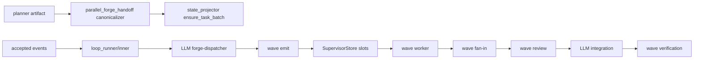
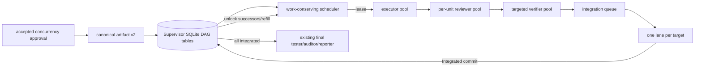
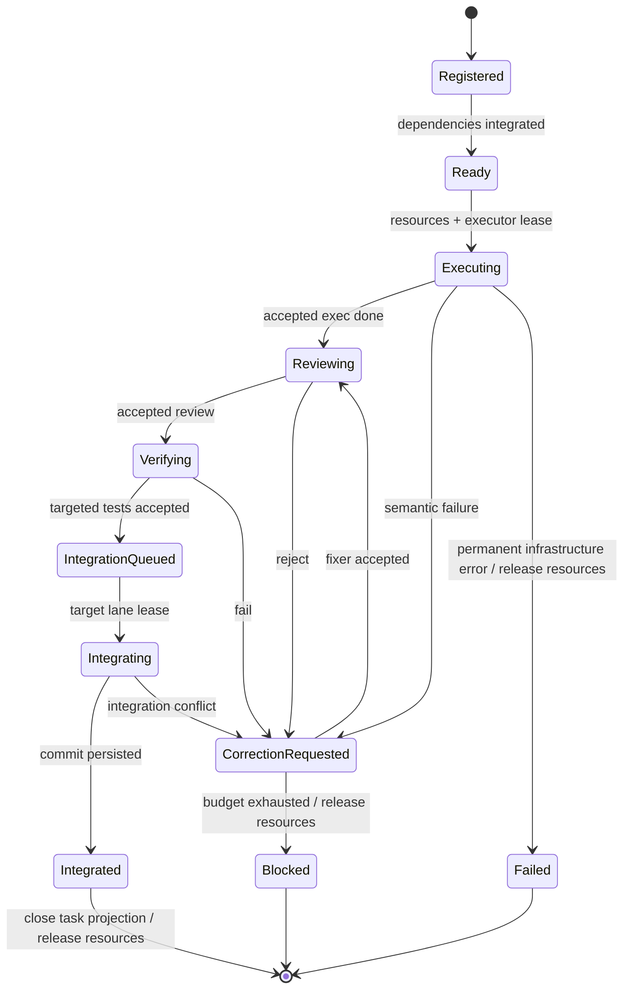
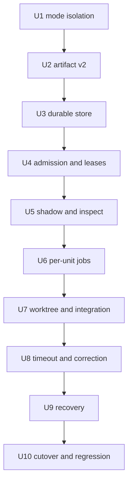

# Parallel Forge runtime-owned work-conserving DAG scheduler

## Goal Capsule

### 0. 计划状态

**READY**。本计划的实施关键决策均达到 `0.85`；Coding Agent 可严格按 `Unit 1 → Unit 10` 执行，不需要临时决定调度模型、持久化位置、兼容开关、集成顺序、超时语义或回归范围。

- 基线：分支 `pittcat-dev`，提交 `4b512a89886deae53eb17985eba2fbb1504bd2ee`。
- 调查范围：目标运行命令及其只读运行产物、`parallel-forge` preset/schema/template、plan handoff、accepted-event 流程、Supervisor store、wave dispatcher/worker/worktree、配置合并、诊断入口、BDD/E2E、相关 Git 历史与仓库硬规则。
- 已执行验证：只读 `rg`、`sed`、`wc -l`、`git log`、`git status`、`git rev-parse`；未启动 Ralph。
- 尚未执行：任何测试、构建、lint、typecheck、preset check、E2E；这是规划阶段的刻意边界，不代表实现验收已完成。
- 阻塞项：无。
- 计划产物不进入 `.ralph/`，且不产生生产代码。
- 非交互文档评审：coherence、feasibility、security、adversarial 四个独立 reviewer 全部完成；其高置信度问题均已转化为 D17-D26、R17-R20、S17-S20 及对应 Unit 验收，不留待 Executor 决策。

### 结论先行

当前瓶颈不是 worker cap 太小，而是控制流仍是“LLM 产生静态 wave → wave barrier → 串行 review/integrate/verify → 下一 wave”。目标计划本身只有 5 个 Unit、4 个 wave，峰值并行仅 2；后三个 wave 都只有 1 个 Unit。即使把 worker cap 从 8 调到 80，也不会创造 runnable work。

目标架构是：accepted plan 进入 runtime 后，一次性持久化 DAG；scheduler 每次状态变化都持续填满可用槽位；依赖在前置 Unit **成功集成**后解锁；executor、per-unit reviewer、targeted verifier 使用独立池；每个目标分支只有一条串行 integration lane；资源许可、超时、恢复、幂等和可观测性由 runtime 确定性实现。LLM dispatcher、worktree hat 和正常路径 integrator hat 在正式切换后退出控制面。

## Product Contract

### 1. 功能目标

#### 1.1 业务目标与调用方

- 业务目标：对具有真实并行度的开发计划，尽可能让 runnable Unit 持续占满安全 worker 容量，消除 wave barrier 和中间 LLM 编排激活造成的空槽。
- 调用方：运行 `ralph run -H builtin:parallel-forge ...` 的 operator；间接调用方是 planner、guardian、executor、reviewer、verifier、fixer、tester、auditor 和 reporter hats。

#### 1.2 当前行为

- planner 生成静态 `execution_wave`；runtime 会重新推导最早安全 wave 并投影 task，但实际执行仍由 `forge-dispatcher` 读取计划并调用 `ralph wave emit exec.unit.ready`。
- runtime 只能并行执行已经形成的 wave；review、integration、verification 和 settlement 是 wave 级 barrier。
- 用户目标计划为 `Wave 1: U01 ∥ U05 → Wave 2: U02 → Wave 3: U03 → Wave 4: U04`，理论峰值只有 2；运行中还存在启动/规划/建 worktree 和每 wave 的串行激活开销，以及一次 60 分钟 hard deadline 后重试。

#### 1.3 目标行为与差异

| 维度 | 当前 | 目标 |
|---|---|---|
| 调度权 | LLM dispatcher + wave runtime | runtime DAG scheduler |
| 可运行条件 | 静态 wave 到达 | 所有依赖已集成且资源可租用 |
| 补槽 | 下一次 dispatcher/wave 激活 | 任一 job/集成状态变化后同一调度 tick |
| 隔离 | wave slot worktree，部分由 hat 编排 | runtime 按 Unit 创建/复用稳定 worktree |
| review/verify | wave barrier 后串行 | 每 Unit 完成即进入 reviewer/targeted-verifier 池 |
| integration | LLM hat 执行 git | runtime 每目标分支单 lane，确定性 git adapter |
| 超时 | hard timeout + worker heartbeat | hard cap + 可证明进度续租的 idle deadline |
| 恢复 | wave-centric redrive | DAG/job/lease/integration intent 持久化恢复 |
| rollout | 直接由 preset 行为决定 | `wave` 默认、`dag_shadow` 观测、`dag` 权威 |

#### 1.4 输入、输出与状态

- 输入：accepted `forge.concurrency.approved`、经 canonicalizer 验证的 execution-plan artifact、Unit dependency/resource/test metadata、worker terminal events、review/fix/verifier verdict、git integration result、deadline/restart signal。
- 输出：Unit/job/scheduler 状态；现有 task 投影；新的 typed per-unit lifecycle events；最终仍只触发一次 `forge.exec.development.done`，继续复用 final tester/auditor/reporter 主路径。
- 状态变化：依赖未集成保持 `Pending`；依赖已满足但资源不可用保持 `Ready` 并记录 resource blocker；其余主链为 `Ready → Executing → Reviewing → Verifying → IntegrationQueued → Integrating → Integrated`。
- 错误语义：配置/artifact 非法在注册前 fail closed；永久基础设施错误把 Unit 标为 `Failed` 并把 plan 标为 `Blocked`；review/test/integration conflict 进入 bounded correction，预算耗尽后 Unit/plan 均为 `Blocked`；不可信 base 直接 `Blocked`，任何失败均不得自动改写目标分支。

#### 1.5 兼容、性能、安全

- 兼容：`scheduler_mode` 默认 `wave`；所有未显式选择 DAG 的 preset 走原路径、原事件、原 DB wave 表和原 worker 行为。无需兼容旧版 parallel-forge 的中途 DAG run；但 `dag_shadow` 必须可与旧 wave authority 同时观察而不产生副作用。
- 性能：当存在可租用资源的 Ready Unit 时，空闲槽不得跨越一个 scheduler tick；不得等待同 wave 的慢 Unit；有效并发等于 `min(runnable, pool cap, global cap, resource permits)`；调度热路径不得调用 LLM。
- 安全：只接受 canonical artifact；worktree base 必须等于已验证目标 commit；DAG job 只继承声明的环境/credential，写入必须通过完整 changed-path authorization；agent 可读取 checkout 但无权让越界写入进入 target；不使用强推、reset-hard 或未计划的 destructive git；inspect/DB 不得保留或暴露 raw payload、prompt、secret 或私有绝对路径。

#### 1.6 范围与非目标

范围：artifact v2、mode gate、DAG store/state machine、work-conserving admission、资源 lease、shadow、job runtime、per-unit review/verify/correction、runtime worktree、integration lane、progress timeout、recovery、inspect、parallel-forge 切换、其他 preset differential regression、文档/skills 同步。

非目标：跨机器分布式 scheduler；动态自动拆 Unit；猜测路径冲突；取消最终 full-suite gate；改变所有 preset 的 wave contract；用更多 prompt 代替 runtime；为提升并发绕过依赖或测试。

#### 1.7 已知约束、事实与假设

- 已确认：Supervisor SQLite 已有 WAL、迁移、slot attempt、delivery state 和全局 cap；`ProcessedEvents.accepted_events` 提供 policy 后的完整 payload；TaskStore 不保存 wave/resource/integration metadata；accepted-transition outbox 不保存 payload body。
- 已确认：`inner.rs` 已 5100 行，不能继续堆功能；`dispatcher/dispatch.rs` 4147 行、`supervisor/rusqlite.rs` 4402 行，也应只保留接线。
- 已确认：默认 supervisor store 可能因 wave persistence 被打开，即使 `enabled=false`，所以不能用“DB 存在”作为 DAG authority 判据。
- 已确认假设：目标仓库为单机进程模型；每个 loop 的目标分支可解析为稳定 branch/worktree；SQLite 是当前恢复 SSOT。
- 待验证假设：无实施关键假设。不同平台 git 行为由 Unit 7 的真实临时仓库 contract test 在切换前验证；验证失败即停止该 Unit，不降级为 shell 文案。

#### 1.8 需求清单

| ID | 可验收需求 |
|---|---|
| R1 | 只有 `scheduler_mode: dag` 才取得 DAG 执行权；默认 `wave` 行为不变，非法组合 fail closed。 |
| R2 | approved artifact 被 canonicalize 并原子持久化；重复 accepted event 不重复建 plan/task/job。 |
| R3 | scheduler 对依赖已集成且资源可租用的 Unit work-conserving admission，并在一个 tick 内补槽。 |
| R4 | typed resource capacity/claim 原子租用；不足时不超售、不误失败，终态/取消/恢复后正确释放或重建。 |
| R5 | 每 Unit executor 完成后立即进入 per-unit review 和 targeted verification，不等待同行 Unit。 |
| R6 | 依赖 Unit 只有在前置 Unit 集成后才 Ready；reviewed 或 verified 不足以解锁。 |
| R7 | runtime 从 verified base 创建稳定 Unit worktree；重启复用同一身份并验证 HEAD/base。 |
| R8 | 每个 target branch 只有一个 integration lane；eligible Unit 按 `integration_order` 稳定选择，FF 更新并持久化 commit。 |
| R9 | hard cap 不可延长；idle lease 只被强进度或有界弱进度刷新；超时、取消和 correction 有 typed、bounded 语义。 |
| R10 | 在 spawn、terminal event、merge、emit 任一 crash window 重启，最多执行一次不可逆提交，且不丢失可恢复工作。 |
| R11 | `dag_shadow` 计算与记录决策/利用率但不 spawn、建 worktree、merge、emit 业务终态或关闭 task。 |
| R12 | operator 可通过现有 `ralph inspect loop --format json` 看到 sanitized scheduler 摘要和阻塞原因。 |
| R13 | 全部 Unit integrated 后只触发一次最终 full-suite tester；tester 通过后保留 auditor/reporter 收尾。 |
| R14 | 除 parallel-forge 外的 builtin/local preset 在默认 `wave` 下事件序列、slot 行为和配置解析不变。 |
| R15 | 正式 DAG 切换后，正常路径不再激活 forge-dispatcher、worktree 或 LLM integrator；agent 只做规划、判断、编码、review、修复和审计。 |
| R16 | executor/reviewer/verifier/fixer 各有显式 pool cap；未配置时各 pool cap 等于 global cap，global cap 始终是所有 agent job 总上限。 |
| R17 | accepted `forge.plan.ready` 在 ensure-task projection/ack 前产生可恢复 registration receipt；后续 accepted approval 激活该 receipt；Scheduler DB 为 authority，TaskStore 为幂等 projection。 |
| R18 | DAG job 采用显式环境/credential allowlist；完整 changed path set 在 review 前和 integration lane 内两次授权，越界代码不可集成。 |
| R19 | worker channel 必须经过现 EventLoop origin/policy/schema/contract acceptance，并与当前 job/attempt/unit/stage/hat/token 原子关联。 |
| R20 | 同 base sibling 在当前 target 上生成 squash candidate，targeted tests 验证的 object ID 必须就是 CAS FF 的 object ID。 |

#### BDD 行为规格正文

```gherkin
Feature: Runtime-owned work-conserving Parallel Forge DAG execution

  Background:
    Given an isolated loop with supervisor persistence and a canonical approved execution plan

  Scenario S1: default wave mode preserves legacy execution
    Given scheduler_mode is omitted or wave
    When accepted events are processed
    Then no DAG plan or DAG job is created
    And the existing wave dispatcher remains authoritative

  Scenario S2: invalid DAG configuration fails closed
    Given scheduler_mode is dag but supervisor is disabled or execution_mode is not isolated
    When configuration is validated
    Then startup fails with a stable field-specific error

  Scenario S3: independent Units fill available executor slots
    Given four dependency-free Units, global capacity three, executor pool capacity at least three, and sufficient resources
    When the approved plan is registered
    Then exactly three executor jobs become leased in the first scheduling tick
    And the fourth remains Ready without being failed

  Scenario S4: completion immediately refills a slot
    Given all executor slots are occupied and one Ready Unit is queued
    When one executor reaches a durable terminal state
    Then the queued Unit is admitted in the same scheduler tick
    And no wave settlement or LLM dispatcher activation is required

  Scenario S5: dependency unlock waits for integration
    Given U2 depends on U1
    When U1 is reviewed and verified but not integrated
    Then U2 remains Pending
    When U1 becomes Integrated
    Then U2 becomes Ready

  Scenario S6: resource capacity prevents oversubscription
    Given two Ready Units each claim one permit from a capacity-one resource
    When admission runs concurrently
    Then only one Unit owns the lease
    And the other remains Ready until the lease is released
    And the owner retains the lease through review, verification, correction, and integration

  Scenario S7: each Unit flows through review and targeted verification
    Given an executor job completes for U1
    When its accepted result is persisted
    Then a reviewer job is queued immediately
    And only an accepted review queues targeted verification
    And only accepted targeted verification queues integration

  Scenario S8: rejected work enters bounded correction
    Given review or targeted verification rejects U1
    When the failure handler emits an accepted correction request
    Then runtime queues one fixer job in U1's worktree
    And resumes at review after the fix
    And exhaustion emits one typed blocked outcome

  Scenario S9: runtime provisions a trusted stable worktree
    Given U1's dependencies are integrated at commit C
    When U1 is admitted
    Then its worktree is created or reused from verified commit C
    And a mismatched reused worktree is rejected before spawning an agent

  Scenario S10: integration is serialized per target branch
    Given two verified independent Units target the same branch
    When both enter IntegrationQueued
    Then one integration lease is held
    And eligible Units are selected deterministically by integration_order
    And a successful integration records the resulting target commit before releasing the lane

  Scenario S11: progress-aware timeout remains bounded
    Given a running job with a fixed hard deadline and an idle deadline
    When strong progress is observed
    Then only the idle deadline advances within the hard deadline
    When only repetitive weak output continues beyond its allowance
    Then the job times out with a typed reason and its process is cancelled

  Scenario S12: crash recovery is idempotent
    Given the process crashes after durable intent but before acknowledgement at any job or integration boundary
    When the same loop resumes
    Then scheduler state is reconstructed from SQLite
    And stale processes cannot commit accepted effects
    And each durable attempt or integration idempotency key commits at most one merge, task close, or terminal event
    And each retry uses a new persisted attempt whose total count does not exceed its budget

  Scenario S13: shadow mode has no execution side effects
    Given scheduler_mode is dag_shadow and legacy wave execution is active
    When accepted events and worker completions occur
    Then shadow decisions and utilization deltas are persisted
    And no DAG worker, worktree, merge, task close, or business event is produced

  Scenario S14: operator sees sanitized scheduler state
    Given a DAG plan has running, resource-blocked, and integration-queued Units
    When ralph inspect loop --format json is invoked
    Then scheduler mode, counts, capacity, utilization, oldest wait, and sanitized blockers are shown
    And raw payloads, DB paths, prompts, and secrets are absent

  Scenario S15: final verification fires exactly once
    Given every Unit is Integrated
    When scheduler closes the plan
    Then forge.exec.development.done is accepted exactly once
    And the existing final tester, auditor, and reporter path runs

  Scenario S16: other presets remain unchanged
    Given any preset without scheduler_mode dag or dag_shadow
    When its existing BDD and supervisor tests run
    Then its accepted event sequence and wave lifecycle match the baseline
    And no DAG scheduler row is created

  Scenario S17: stale or forged worker verdict cannot advance a Unit
    Given a terminal event has the wrong attempt token, Unit, stage, or emitting hat
    When it passes through the existing EventLoop acceptance path
    Then scheduler CAS rejects it without a state transition

  Scenario S18: out-of-scope changes and ambient secrets are contained
    Given a DAG job receives an undeclared host secret and changes a forbidden or traversal path
    When its result reaches review or integration
    Then the secret is absent from the job environment and persisted diagnostics
    And the complete changed set is rejected before target mutation

  Scenario S19: sibling branches integrate the exact tested candidate
    Given two non-conflicting Units were created from the same base
    When the first advances target and the second enters its lane
    Then the second is squashed onto current target and targeted-tested
    And compare-and-swap advances target to that exact candidate object

  Scenario S20: plan registration survives projection crash windows
    Given a forge.plan.ready receipt is durable before task projection and later approval only activates that receipt
    When the process crashes before either scheduler or task projection completes
    Then restart revalidates the immutable artifact and converges both projections exactly once
```

## Planning Contract

### 2. 代码库现状与证据

#### 2.1 当前实现入口



- 外部入口：`crates/ralph-cli/src/main.rs` 的 `run`/`resume`，进入 `loop_runner/inner.rs`。
- policy 后入口：`ProcessedEvents.accepted_events`；当前 `inner.rs` 随后调用 wave handling。
- 计划边界：`parallel_forge_handoff.rs::canonicalize_plan_ready_payload`；state projector 从同一 artifact 原子创建 tasks。
- 持久化边界：`SupervisorStore` 的 memory/rusqlite 实现和 `.ralph/supervisor.db`。
- 执行边界：wave dispatcher、`run_wave_worker`、`WorktreeFactory`。
- 可观测边界：`ralph inspect loop` 已输出 `SupervisorInspectSummary`。
- 最终目标调用链：accepted approval → canonical plan snapshot → DAG scheduler tick → runtime jobs → integration lane → final tester/auditor/reporter。

#### 2.2 Evidence Ledger

| Evidence ID | 来源 | 观察结果 | 对计划的影响 | 可靠性 |
|---|---|---|---|---|
| E1 | 用户指定 plan `docs/plans/2026-09-01-2102-feat-trusted-worktree-continuation-plan.md` | 5 Unit/4 wave；仅 Wave 1 有 2 个并行 Unit，后三波各 1 个 | 当前任务图本身把峰值限制为 2，调 cap 无法解决 | 高 |
| E2 | 本次会话对目标 run 的 event/log 只读统计 | 启动约 25m；wave1≈19m；wave2≈73m 且 60m deadline 后重试；wave3≈55m；波间有串行 hats | 需要持续补槽、progress timeout 和减少 LLM 控制面 | 高 |
| E3 | `presets/en/parallel-forge.yml` | forge-dispatcher 每次最多发 3 waves，但 worktree/review/integrate/verify 仍为 wave 级 | 机制是 wave-batched，不是持续 DAG | 高 |
| E4 | `crates/ralph-core/src/parallel_forge_handoff.rs` | 已做大小/path/digest/DAG/cycle/parallel-wave 校验并重算 earliest wave | 扩展同一 trust boundary，不新建 parser | 高 |
| E5 | `crates/ralph-core/src/state_projector/task.rs`、`task.rs`、`task_store.rs` | tasks 原子投影依赖，但不保存 wave/order/resource | TaskStore 保持 operator 视图；scheduler metadata 进入 Supervisor SQLite | 高 |
| E6 | `event_loop/types.rs::ProcessedEvents`、`loop_runner/inner.rs` | accepted events 带完整 payload，可在 policy/contract 后接 runtime | scheduler 不读 raw JSONL，不从 outbox 猜 payload | 高 |
| E7 | `event_loop/accepted_transition.rs` | outbox 只有 topic/payload digest，无 payload body | 热路径用 accepted events；恢复用 scheduler DB | 高 |
| E8 | `wave/dispatcher/dispatch.rs`、`wave_detection.rs` | `join_all` 只并发已出现的完整 waves，fan-in 仍序列化 | 新增计划级 ready queue/admission，不扩写 wave detector | 高 |
| E9 | `supervisor/{mod,memory,rusqlite}.rs` 与 migrations | 已有 WAL、全局 cap、attempt、PID、payload ledger、四阶段 delivery、redrive | 复用 DB/幂等模式；新增独立 DAG trait/module | 高 |
| E10 | `supervisor/worktree_bind.rs` | WorktreeFactory 已存在；当前 branch/base 以 wave slot/HEAD 为中心 | 扩展为 Unit-stable identity 和显式 verified base | 高 |
| E11 | `wave/worker.rs` | PTY worker 已实现 PID、hard timeout、idle heartbeat/startup grace | 提取 generic runtime job kernel，wave adapter 保持兼容 | 高 |
| E12 | `config/loop_config.rs`、`preflight.rs`、`config_resolution.rs` | supervisor 默认 false，配置 deny unknown；preset opt-in 有专门 merge 规则 | 新 mode 必须默认 wave，并纳入 config merge/preflight | 高 |
| E13 | `commands/inspect.rs`、`integration_wave_inspect.rs` | `inspect loop` 已有 sanitized supervisor summary 与 corrupt/missing DB 语义 | 扩展同一 JSON surface，不新增重叠 CLI | 高 |
| E14 | `presets/templates/parallel-forge/*.yml` | 已有 depends_on、integration_order、allowed_paths、owned_resources、tests，但资源仅语义文本 | artifact v2 增加 typed capacities/claims | 高 |
| E15 | Git `358acd7b`、`e94c0782`、`125bb945` | 已多次做 prompt fanout、earliest-wave 和资源规划修复 | 继续调 prompt 收益有限；runtime ownership 是下一层修复 | 高 |
| E16 | `wc -l` | inner=5100，dispatch=4147，rusqlite=4402 | 新功能必须模块化，inner 只加 seam，禁止跨 5000 堆叠 | 高 |
| E17 | `crates/ralph-core/tests/scenarios/parallel_forge_*`、CLI supervisor tests、`ralph-e2e/.../parallel_forge.rs` | 已有真实 runtime BDD、supervisor integration 和 mock E2E | 可建 characterization/differential，不用 source-text 测试 | 高 |
| E18 | `AGENTS.md` Build/Test 和 preset sync hard rules | nextest、schema、BDD、skills/docs、全量 gate 有明确要求 | 每 Unit 固定使用真实命令和同步清单 | 高 |

#### 2.3 受影响范围

- 生产：`parallel_forge_handoff.rs`；`supervisor/`；`config/loop_config.rs`；CLI `loop_runner`、wave worker/worktree seam、`commands/inspect.rs`。
- preset：`presets/en/parallel-forge.yml`、`presets/schemas/parallel-forge.yml`、两个 parallel-forge templates。
- 测试：core handoff/supervisor tests、真实 scenario runner、CLI config/preflight/loop supervisor/integration inspect、ralph-e2e parallel_forge。
- 文档：`CLAUDE.md` 与 `AGENTS.md` 同步副本、`.cursor/rules/feature-flags.mdc` / `multi-hat-isolation.mdc`、operator preset author/review references 与 fixtures。
- 不修改：其他 preset YAML/schema/event topology；manifest/index/zsh（builtin 名称不变）。若实现需要改变 parallel-forge 的 public description，才同步 `PRESETS`/index/补全；否则禁止顺手改。

### 3. 决策记录与置信度

| ID | 决策问题 | 候选方案 | 最终选择 | 支持证据 | 排除原因 | 置信度 |
|---|---|---|---|---|---|---|
| D1 | 谁拥有调度 | 更多 dispatcher prompt / runtime DAG / 外部队列 | runtime DAG | E1-E3,E8,E15 | prompt 无法持续持有全局状态；外部队列超出 thin coordinator | 0.97 |
| D2 | rollout gate | boolean / `wave,dag_shadow,dag` | 三态 `scheduler_mode`，默认 wave | E12,E9 | boolean 无 shadow；复用 enabled 会误触默认 wave DB | 0.96 |
| D3 | plan parser | 新 parser / 扩展 canonical handoff | artifact v2 扩展现入口 | E4,E14 | 第二 parser 产生信任/摘要漂移 | 0.98 |
| D4 | scheduler 状态 | TaskStore / 新 DB / Supervisor SQLite 新表 | 同 DB、独立 `DagSchedulerStore` trait/table | E5,E7,E9,E16 | TaskStore 信息不足；第二 DB 无法原子恢复；巨型 trait/文件继续膨胀 | 0.94 |
| D5 | 依赖解锁点 | executor done / verified / integrated | Integrated | E3,E10 | 前两者的代码尚未进入目标 branch，后继 base 不可信 | 0.96 |
| D6 | 资源模型 | 路径 glob 推断 / shared-exclusive / capacity+permits | typed capacity+permits | E14,E4 | glob overlap 不可可靠判定；capacity 统一表达 exclusive(1)和共享(N) | 0.90 |
| D7 | job runtime | 复制 worker / 提取 generic kernel | 提取 kernel，wave adapter 不变 | E11,E14 | 复制会让 timeout/PID/env 修复漂移 | 0.93 |
| D8 | review/verify 粒度 | wave / per-unit | per-unit pools | E1-E3 | wave barrier 是空槽来源 | 0.96 |
| D9 | integration | LLM git / runtime global lock / per-target lane | runtime `GitIntegrationPort`，每 target lane | E3,E9,E10 | LLM 非确定；全局锁会阻塞无关 branch | 0.91 |
| D10 | ready 排序 | 随机/FIFO/integration_order | dependencies first，eligible 内 `(integration_order, unit_id)` 稳定序 | E4,E14 | 随机不可重放；纯 FIFO 不能稳定比较 shadow | 0.90 |
| D11 | timeout | 只 hard / 任意输出续命 / hard+progress lease | 固定 hard cap + 强进度 idle lease + 有界弱进度 | E2,E11 | hard-only误杀；任意输出可无限挂死 | 0.91 |
| D12 | correction | runtime 修代码 / agent 判断且 runtime 管预算 | failure-handler/fixer 做判断和修复，runtime 管状态/预算 | E3,E9 | runtime 不应承担语义修复；agent 不应拥有计数/调度 | 0.91 |
| D13 | 可观测入口 | 新 CLI / inspect loop 扩展 | 扩展 sanitized supervisor summary | E13 | 新入口与现有 read-only surface 重叠 | 0.95 |
| D14 | 旧路径退休 | 立即删 / 永久双跑 / shadow 后切换并删正常控制 hats | shadow parity 达标后 parallel-forge 切 dag，移除其 dispatcher/worktree/integrator 正常路径 | E3,E15,E17 | 立即删风险高；永久双路径会重复执行和维护 | 0.92 |
| D15 | 其他 preset | 全局替换 / opt-in only | wave default + differential tests | E12,E17,E18 | 全局替换违反无回归要求 | 0.98 |
| D16 | 各阶段并发上限 | 单一 cap / 固定常量 / per-pool cap + global cap | `dag_pools` 四个 cap，默认各等于 `max_concurrent_workers`；所有 active agent jobs 仍受 global cap | E1-E3,E9,E12 | 单一 cap 无法诊断阶段挤占；固定常量降低最大并发；取消 global cap 会超售 | 0.92 |
| D17 | TaskStore 与 scheduler DB 一致性 | 假设跨存储事务 / TaskStore authority / scheduler authority + projection | scheduler registration receipt/DB 是 authority；TaskStore 是带 marker 的幂等可重放投影 | E5,E7,E9 | 两种存储不能同事务；TaskStore 缺少调度元数据 | 0.94 |
| D18 | plan-ready/approval 如何跨 crash 恢复 | 只用 digest outbox / 存完整 payload / bounded registration receipt | `forge.plan.ready` accepted boundary 在 ensure-task projection/ack 前持久化 plan key、artifact path、artifact digest、target identity；approval 只把 receipt CAS 为 active；artifact 保留到 plan terminal，恢复时重验 digest | E4-E7 | 现 outbox 无 payload；完整 payload扩大敏感/体积面；不可变 artifact 引用已存在 | 0.93 |
| D19 | sibling Unit 如何线性集成 | 纯 FF / rebase 后 FF / squash candidate + gate + CAS FF | lane 从当前 target HEAD 创建候选，squash 应用 Unit diff，对候选跑 targeted gate，再 compare-and-swap FF | E3,E9,E10 | 纯 FF 无法集成同 base sibling；未重验的 rebase不能证明被测代码等于集成代码 | 0.95 |
| D20 | raw process exactly-once | 声称 spawn exactly-once / at-least-once launch + fencing | raw launch 可 at-least-once；durable attempt token、exclusive worktree lease和结果 CAS fencing 保证 stale process 无 accepted effect；存活不明则 block | E9,E11 | OS spawn 到 PID 持久化存在不可消除窗口 | 0.96 |
| D21 | Unit 资源 lease 生命周期 | executor结束释放 / verify后释放 / Unit终态释放 | `Ready→Executing` 原子获取，跨 review/verify/correction/integration 保持，且只在 Integrated/Blocked/Failed/explicit cancellation 幂等释放 | E9,E14 | 提前释放允许冲突 Unit 同时修改；无终态规则会泄漏 | 0.94 |
| D22 | job result ingress | 直接信 worker / 新旁路 / 复用 EventLoop acceptance | durable channel batch 合入现 main-ledger/EventLoop policy/contract path；accepted event 按 job/attempt/unit/stage/hat/token CAS 后推进 | E6,E8,E11 | 旁路会绕过 origin/policy；只等 topic 可被旧/错事件推进 | 0.94 |
| D23 | DAG job 环境与写范围 | 继承全部环境/仅 prompt ACL / DAG allowlist+changed-set guard | generic kernel接受 policy；legacy wave保持 inherited；DAG job使用显式环境 allowlist和 backend credential declaration，并在 review前及 lane锁内校验完整 changed path set | E10,E11,E14,E18 | 全继承会泄露凭据；prompt ACL不是runtime授权 | 0.91 |
| D24 | 持久化 terminal 数据 | raw payload / typed fields+digest | 仅存 schema字段、digest和有界 sanitized摘要；owner-only DB，terminal恢复窗口结束删除详情 | E7,E9,E13 | raw payload有 secret/磁盘DoS风险；只存digest不足恢复 | 0.90 |
| D25 | lane key 与 task close | mutable target推断 / canonical target + typed integrated event | Unit `target_branch` 进入artifact digest/store并严格校验；integrated commit持久化后 emit `forge.unit.integrated`，其幂等投影关闭task；全 task marker acknowledged后才 final done | E4,E5,E10,E17 | 无target字段无法选lane；删除wave settled后需明确task close入口 | 0.93 |
| D26 | shadow promotion | ready set全相等 / 只看吞吐 / safety parity + expected delta + authoritative canary | 共同边界 exact parity；barrier fixture记录合法提前admission；正式切换前另跑真实DAG canary/crash matrix | E1-E3,E8,E17 | 全相等否定目标；纯shadow不覆盖副作用 | 0.94 |

不存在低于 0.85 的实施决策。

### 4. BDD 行为规格

本节的完整 Feature 与 S1-S20 已在 Product Contract 的“BDD 行为规格正文”中定义；该正文是本节的规范内容，Scenario ID 在 §5、§6 和各 Unit 中保持一致。

## High-Level Technical Design





Hot path ordering is invariant: **persist intent/attempt token → perform fenced side effect → persist outcome → pass result through existing EventLoop acceptance → CAS-project event/task → acknowledge**. Raw process creation itself is at-least-once；只有持有当前 attempt token 的进程结果可被接受，不可逆 integration/task/event projection 按 idempotency key exactly-once。Scheduler never derives authority from prompt text or raw events. Shadow invokes the same pure decision engine against a read-only snapshot but sends decisions to shadow tables/metrics only.

## Verification Contract

### 5. 验收与测试策略

| Scenario | 验收条件/断言 | 测试入口 | 层级 | 风险补充 | E2E |
|---|---|---|---|---|---|
| S1-S2 | mode default/invalid组合；无 DAG rows | loop_config/preflight/config_resolution | unit+integration | characterization | 否 |
| S3-S6 | 精确 admitted IDs、cap、lease owner、refill tick、Integrated gate | 新 `supervisor/dag_scheduler` tests | unit+state-machine | property+concurrency | 否 |
| S7-S8 | job 顺序、拒绝不越级、correction≤3、task未提前关闭 | 新 CLI scheduler integration + BDD | integration | fault injection | 是 |
| S9 | base/HEAD/branch identity；mismatch 无 spawn | temp git repo + WorktreeFactory fake | contract+integration | recovery | 是 |
| S10 | 同 target 最大一个 merge；不同 target 可并行；commit-before-release | GitIntegrationPort fake + temp repo | unit+contract | concurrency | 是 |
| S11 | strong/weak/hard deadline 的虚拟时钟断言；PID cancel | worker kernel tests | unit+integration | fault injection | 否 |
| S12 | 每个 crash point 重启后 side effect count=1 | rusqlite reopen tests | integration | crash matrix | 是 |
| S13 | shadow decision 存在，所有 side-effect fakes count=0 | scheduler driver integration | differential | shadow parity | 否 |
| S14 | JSON keys/计数/脱敏；missing/corrupt DB 保持旧语义 | inspect unit + integration | integration | contract | 否 |
| S15 | development.done一次，final gate未绕过 | runtime BDD + mock E2E | BDD+E2E | idempotency | 是 |
| S16 | baseline scenarios/events unchanged；无 DAG row | existing suites | differential/regression | cross-preset | 是 |
| S17 | wrong token/unit/stage/hat 的 accepted event 无状态推进 | EventLoop→DAG ingress | integration | replay/forgery | 是 |
| S18 | undeclared env 不可见；越界完整 changed set 不可集成 | env policy + temp git | contract+integration | security/fault | 是 |
| S19 | targeted-tested candidate object 等于 CAS FF object | real git siblings | contract | concurrency | 是 |
| S20 | receipt→scheduler/task 两种 crash 顺序均收敛 | accepted transition + SQLite/TaskStore | integration | crash matrix | 是 |

所有验收测试都必须断言副作用：spawn 次数、worktree 数、merge 次数、task 状态、typed event 次数和 DB 状态；不得只断言 prompt/YAML 文本。BDD 必须使用 `run_workflow_guard_scenario` 真实 EventLoop runner。

### 6. 需求—测试追踪矩阵

| Requirement | Scenario | 验收测试 | 单元测试 | 集成/契约 | E2E | Evidence | Unit |
|---|---|---|---|---|---|---|---|
| R1 | S1,S2 | mode gate | config parse | preflight merge | — | E12 | U1 |
| R2 | S2,S12 | duplicate approval | canonical v2 | rusqlite reopen | PF mock | E4,E7,E9 | U2,U3,U9 |
| R3,R16 | S3,S4 | work-conserving admission | pure scheduler | driver refill/pool caps | PF mock | E1-E3,E8,E12 | U1,U4,U6 |
| R4 | S6 | permit ownership | lease algebra/property | concurrent transaction | — | E9,E14 | U4 |
| R5 | S7 | per-unit chain | transition table | worker integration | PF mock | E3,E11 | U6 |
| R6 | S5 | integrated gate | readiness | temp git chain | PF mock | E4,E10 | U4,U7 |
| R7 | S9 | trusted worktree | identity validation | temp git | PF mock | E10 | U7 |
| R8 | S10 | serialized lane | queue choice | Git port contract | PF mock | E9,E10 | U7 |
| R9 | S8,S11 | bounded correction/timeout | virtual clock | PID/failure injection | — | E2,E11 | U8 |
| R10 | S12 | crash matrix | transition idempotency | SQLite reopen | PF resume | E7,E9 | U9 |
| R11 | S13 | zero side effects | shadow decision | differential driver | — | E12,E17 | U5 |
| R12 | S14 | inspect JSON | summary sanitizer | CLI process | — | E13 | U5 |
| R13 | S15 | one final trigger | close predicate | BDD | PF mock | E3,E17 | U10 |
| R14 | S1,S16 | unchanged modes/events | config default | existing suites | all mock | E12,E17,E18 | U1,U10 |
| R15 | S4,S15 | no retired activation | topology semantics | BDD event absence | PF mock | E3,E15 | U10 |
| R16 | S3,S4 | pool/global cap | config/admission | scheduler driver | PF mock | E9,E12 | U1,U4,U6 |
| R17 | S12,S20 | receipt/projection convergence | receipt state | SQLite+TaskStore crash order | PF resume | E5,E7,E9 | U3,U5,U9 |
| R18 | S18 | env/path denial | policy/normalization | DB/env/temp-git guard | PF mock | E10,E11,E14 | U6,U7 |
| R19 | S7,S17 | attempt-bound verdict | token CAS | real EventLoop ingress | PF mock | E6,E8,E11 | U6,U9 |
| R20 | S10,S19 | exact candidate commit | candidate/CAS | real git sibling contract | PF mock | E3,E10 | U7 |

#### 执行命令清单正文

规划阶段均未执行。Executor 按 Unit 中的 Red/Green 顺序运行，失败不得进入下一步。

| 命令 | 时机/目的 | 预期 |
|---|---|---|
| `cargo nextest run -p ralph-core -- parallel_forge_handoff` | U2 parser | targeted green |
| `cargo nextest run -p ralph-core -- supervisor::dag` | U3-U5 store/engine | targeted green |
| `cargo nextest run -p ralph-cli --bin ralph -- dag_scheduler` | U1,U5-U9 runner/config | targeted green |
| `cargo nextest run -p ralph-cli --test integration_dag_scheduler` | U5-U9 新 integration | green |
| `cargo nextest run -p ralph-cli --test integration_wave_inspect` | U5 inspect regression | green |
| `cargo nextest run -p ralph-cli --test integration_supervisor_runtime_p0` | U6-U9 supervisor regression | green |
| `cargo nextest run -p ralph-core --test scenarios -- parallel_forge` | U6-U10 真实 runtime BDD | green |
| `cargo nextest run -p ralph-cli --bin ralph -- preset_lint` | U10 preset validation | green |
| `cargo nextest run -p ralph-core -- preset_lint` | U10 schema/lint | green |
| `cargo nextest run -p ralph-cli --bin ralph -- presets` | U10 embedded parity | green |
| `cargo run -p ralph-e2e -- --mock` | U10 mock E2E | parallel-forge 与其他场景通过；若 harness 标记非阻塞，计划 gate 仍把 PF failure 视为阻塞 |
| `./scripts/check-cli-doc-drift.sh` | U10 skill/CLI drift | zero drift |
| `./scripts/sync-embedded-files.sh check` | U10 embedded docs | clean |
| `cargo fmt --all -- --check` | 每 Unit close | clean |
| `cargo clippy --all-targets --all-features -- -D warnings` | 每 Unit close | zero warning |
| `cargo check --all` | 每 Unit close typecheck | success |
| `cargo build --workspace --all-targets` | U10 build | success |
| `./scripts/run-tests.sh` | U10 最终全量 | nextest 两阶段 + doctest 全绿 |
| `RALPH_BASELINE_SERIAL=1 ./scripts/run-tests.sh` | 仅并发 flake 且证据表明时 | 若仍失败即真实失败，禁止继续 |
| `wc -l crates/ralph-cli/src/loop_runner/inner.rs crates/ralph-cli/src/loop_runner/dag_scheduler/*.rs crates/ralph-core/src/supervisor/*.rs` | U10 文件规模 | 每个新增/修改源码文件≤5000；inner 不再增长，优先拆出 seam |

## Implementation Units

### 7. 严格串行开发单元

```text
Unit 1 → Unit 2 → Unit 3 → Unit 4 → Unit 5 → Unit 6 → Unit 7 → Unit 8 → Unit 9 → Unit 10
```

所有 Unit 固定闭环：Acceptance Red → Unit Red → 最小 Green → 受保护 Refactor → integration → regression → fmt/clippy/typecheck → evidence/decision 更新 → 独立提交。任何 Red 若因命令、fixture、编译环境或无关测试失败，不算有效 Red。

### Unit 1：用三态 mode 隔离新旧 scheduler authority

1. **Unit 目标**：默认/显式 `wave` 完全保持旧路径；`dag_shadow`/`dag` 只有在 supervisor enabled + isolated 时有效。
2. **追踪**：R1,R14；S1,S2；D2,D15；E12,E17。
3. **外部结果**：旧配置照常启动；非法 DAG 配置在 preflight 返回稳定字段错误。
4. **基线**：SupervisorConfig deny unknown 且无 scheduler mode；preset opt-in merge 只认识 supervisor block。
5. **I/O**：输入 YAML；输出 enum；错误不创建 scheduler rows/worktree/process。
6. **修改位置**：修改 `config/loop_config.rs`、`config_resolution.rs`、`preflight.rs`；新增 `supervisor/dag_mode.rs`。不改 worker/wave 行为。
7. **可依赖**：现有 serde defaults、preflight、preset opt-in merge。
8. **禁止未来依赖**：不得创建 DAG 表、调度 job 或改 parallel-forge preset。
9. **验收测试**：新增 config/preflight tests：omitted=`wave`；三值 roundtrip；dag 非 isolated/disabled reject；wave accepted；运行 `cargo nextest run -p ralph-cli --bin ralph -- dag_scheduler_mode`。
10. **Acceptance Red**：unknown `scheduler_mode` 或缺少字段 API 导致目标测试失败；serde syntax/fixture failure 无效。
11. **单测拆分**：default；valid values；unknown value；invalid combinations；preset-over-operator merge。真实 config resolver 不得 mock。
12. **顺序**：default Red→enum/default Green→组合 Red→validation Green→merge Red→opt-in Green→refactor。
13. **最小实现**：只增加 enum/default/validation/merge；错误含 `event_loop.supervisor.scheduler_mode`。
14. **集成**：解析 parallel-forge 当前 YAML（仍 wave）和两个非 forge presets；不得出现 DAG side effect。
15. **风险测试**：Characterization 锁定 omitted mode；Differential 比较旧 config effective value。
16. **回归**：loop_config、preflight、config_resolution、all embedded preset parse。
17. **预期文件变更**：修改 `crates/ralph-core/src/config/loop_config.rs`（mode/pools，E12）、新增 `supervisor/dag_mode.rs`（组合校验，E12/E16）、修改 `crates/ralph-cli/src/{config_resolution,preflight}.rs`（merge/preflight，E12）及现有测试模块（characterization）。
18. **完成**：S1/S2 green；build/lint/typecheck；无 preset 改动；可独立提交。
19. **停止**：merge semantics 与 E12 不符、需要改变其他 preset 或 error contract 时重新决策。
20. **风险**：误用 `enabled` 触发旧 preset；通过 omitted-mode + no-row assertions 缓解，剩余风险低。

### Unit 2：canonical artifact v2 表达资源与稳定调度元数据

1. **目标**：approved plan 可确定性产生 typed capacities/claims、unit metadata 和 digest，非法/超限输入 fail closed。
2. **追踪**：R2,R4；S2,S6；D3,D6,D10；E4,E14。
3. **外部结果**：同一 artifact 总是得到同一 canonical plan；未知资源、零/溢出 permits、重复 key、缺失或不安全 `target_branch` 被拒绝。
4. **基线**：现 parser 支持≤512 Unit/4096 edge、cycle/digest，但忽略资源字段。
5. **I/O**：artifact v2；输出 private canonical scheduler spec；失败不投影 task。
6. **位置**：修改 `parallel_forge_handoff.rs`；修改两个 templates；测试留在该模块。不得在 YAML prompt parser 中重复实现。
7. **依赖**：U1 mode type、artifact_canonicalizer、CanonicalTaskSpec。
8. **禁止**：不写 DB、不租 lease、不修改 preset topology。
9. **验收**：happy/exclusive/shared/unknown/duplicate/zero/overflow/digest tests；命令见 §9。
10. **Red**：v2 字段未反序列化或非法 claim 被接受；文本 substring failure 无效。
11. **单测**：capacity key/positive bound；claim references capacity；sum 不需静态≤capacity但单 claim≤capacity；stable ordering；`target_branch` 必须通过 `git check-ref-format --branch` 等价的纯校验并进入 digest；v1 absence maps empty resources for shadow migration only。
12. **顺序**：schema structs Red→parse Green→validation cases逐个 Red/Green→canonical digest Red/Green→refactor。
13. **最小实现**：计划级 `resource_capacities[{key,capacity}]`，Unit `resource_claims[{key,permits}]` 与 canonical `target_branch`；保持 allowed_paths/forbidden_paths 并把它们纳入 digest。
14. **集成**：state projector 对 v2 tasks 仍原子创建；invalid artifact 不创建任何 task。
15. **风险测试**：property test 针对输入顺序 canonicalization；fuzz/size limits 沿用现边界。
16. **回归**：handoff 全测试、task projector、existing plan duplicate/cycle tests。
17. **预期文件变更**：修改 `parallel_forge_handoff.rs`（artifact v2，E4/E14）和两个 template（资源 contract，E14）；新增 `parallel_forge_handoff/tests_resources.rs`（资源/property tests，E16/E17）。
18. **完成**：canonical/digest/atomic projection green，文件≤5000。
19. **停止**：模板真实结构与 E14 冲突或需要公开 API 时更新 Decision。
20. **风险**：资源漏声明仍由 Guardian 语义门禁发现；runtime 只保证已声明 lease，不宣称推断路径冲突。

### Unit 3：持久化 DAG、job、lease 与 integration intent

1. **目标**：`forge.plan.ready` accepted boundary 在 ensure-task projection/ack 前写入 bounded registration receipt；accepted approval 只激活该 receipt，再把 plan 幂等注册为 scheduler snapshot；重复注册无变化，digest 冲突 fail closed。
2. **追踪**：R2,R10,R17；S12,S20；D4,D17,D18；E5,E7,E9,E16。
3. **外部结果**：关闭/重开 SQLite 后 plan/unit/job/lease/lane 状态一致。
4. **基线**：SupervisorStore 只有 wave tables/trait；SQLite v12、WAL。
5. **I/O**：canonical plan + loop/target identity；先输出含 artifact path/digest 的 durable receipt，再输出 scheduler snapshot；Scheduler DB 是 authority，TaskStore 是带 projection marker 的可重放投影，不宣称跨存储单事务。
6. **位置**：新增 `supervisor/dag_store.rs`、`dag_store_memory.rs`、`dag_store_rusqlite.rs`、`dag_types.rs`；修改 `event_loop/accepted_transition.rs` 写 optional bounded registration receipt；`rusqlite.rs` open 只接 v13 migration；`mod.rs` 只 export。
7. **依赖**：U2 canonical spec、现 transaction/idempotency conventions。
8. **禁止**：不 spawn、不做 readiness 决策、不改 wave tables。
9. **验收**：register/reopen/duplicate/digest-conflict/transaction-rollback tests，memory 与 sqlite contract suite 共用。
10. **Red**：reopen 后 snapshot missing 或 duplicate rows；DB open 环境错误无效。
11. **单测**：receipt-before-projection；artifact retention/digest recheck；plan identity；unit lifecycle CAS；job attempt uniqueness；lease owner uniqueness；lane intent/outcome；TaskStore projection marker；receipt→DB与DB→TaskStore两个 crash顺序。
12. **顺序**：contract Red→memory Green→SQLite Red→migration/queries Green→differential→refactor。
13. **最小实现**：实现 bounded receipt、store CRUD/CAS/transactions 和 v13 tables/indexes；receipt 仅含 plan key/path/digest/target identity，不复制 raw payload；artifact 保留到 plan terminal；所有时间由注入 clock。
14. **集成**：同一 contract suite 跑 memory/rusqlite；旧 v12 fixture migration 后 wave summary不变。
15. **风险测试**：state-machine illegal transition；SQLite busy/concurrent lease；migration differential。
16. **回归**：全部 supervisor store/fan-in/redrive tests、inspect corrupt DB。
17. **预期文件变更**：新增 `supervisor/{dag_store,dag_store_memory,dag_store_rusqlite,dag_types}.rs`（DAG persistence，E9/E16）；修改 `event_loop/accepted_transition.rs`（bounded registration receipt，E7）；最小修改 `supervisor/{mod,rusqlite}.rs`（export/v13 seam，E9）。
18. **完成**：重开等价、无 wave schema 回归、clippy/typecheck green。
19. **停止**：无法与 wave 写入共享事务/connection 或 migration 破坏旧 DB 时停止。
20. **风险**：InMemory clone 语义与 SQLite 不同；contract suite 使用共享 handle 明确约束，不依赖 deep clone。

### Unit 4：纯 work-conserving admission 与资源 lease 引擎

1. **目标**：给定 snapshot/caps，单 tick 选择所有可安全 admission 的 Unit，并原子持有资源。
2. **追踪**：R3,R4,R6；S3-S6；D5,D6,D10；E1,E5,E8,E9。
3. **外部结果**：无 wave barrier；结果稳定、不过 cap/资源、不提前解锁。
4. **基线**：`try_dispatch_next(max)` 只对 wave slots；无 plan DAG readiness。
5. **I/O**：unit states/deps/resources/pool/global caps；输出 ordered decisions + blockers；无进程副作用。
6. **位置**：新增 `supervisor/dag_scheduler.rs`、`resource_leases.rs`；测试在 sibling modules。
7. **依赖**：U3 store contract、U2 spec。
8. **禁止**：不调用 LLM/worktree/git/event emitter。
9. **验收**：S3-S6 table tests；断言 exact IDs、permits、Ready blockers、tick sequence；Unit lease 从 Executing 跨 review/verify/correction/integration 保持，且只在 Integrated/Blocked/Failed/cancelled 释放。
10. **Red**：selected count/ID 不符或 dependent 在 Integrated 前选中；线程调度差异无效。
11. **单测**：empty/all-blocked；global/pool cap；stable ordering；resource capacity；atomic competing ticks；全生命周期 lease；四种终态幂等 release；multi-resource all-or-none。
12. **顺序**：readiness Red/Green→caps Red/Green→leases Red/Green→concurrent CAS Red/Green→refactor。
13. **最小实现**：纯 decision function + store transaction apply；`Ready` 是派生/持久化状态，依赖必须 Integrated。
14. **集成**：两个 scheduler handles 竞争同 DB，断言无重复 lease/admission。
15. **风险测试**：property invariant `admitted≤caps`、permits≤capacity、topological safety；Concurrency test。
16. **回归**：Supervisor global cap 和 existing wave dispatch tests。
17. **预期文件变更**：新增 `supervisor/{dag_scheduler,resource_leases}.rs`（admission/pool/global cap/lease，E8/E9）；修改 `supervisor/{mod,dag_store}.rs`（export/CAS，E9/E16）。
18. **完成**：所有不变量和竞争测试 green，可独立提交。
19. **停止**：需要放宽 Integrated gate 或无法原子租用多资源。
20. **风险**：稳定 `(integration_order, unit_id)` 可能让高序号 Unit 等待；inspect 暴露 oldest wait，但时间不得进入选择键，以保持重放确定性。资源永久占用由 U9 recovery 收口。

### Unit 5：接入 accepted-event shadow driver 与 inspect

1. **目标**：`dag_shadow` 对真实 accepted events 计算/persist scheduler decisions 和指标，但零执行副作用。
2. **追踪**：R11,R12；S13,S14；D1,D2,D13；E6,E7,E13,E16。
3. **外部结果**：`inspect loop --format json` 可看 shadow utilization/blockers；旧 wave run 仍 authority。
4. **基线**：inner 已持有 accepted events；inspect 有 SupervisorInspectSummary。
5. **I/O**：accepted registration receipt/completion + mode；输出 shadow records/sanitized summary；副作用 fakes 全为0。driver 不依赖 outbox 中不存在的 raw payload。
6. **位置**：新增 `loop_runner/dag_scheduler/{mod,driver,shadow}.rs`；`inner.rs` 仅调用 seam；扩展 core inspect summary和 `commands/inspect.rs`。
7. **依赖**：U1-U4。
8. **禁止**：不 spawn/worktree/merge/emit/task-close；不读 raw event file。
9. **验收**：新 `integration_dag_scheduler.rs` 以 durable receipt 和 accepted completion 驱动；模拟 receipt 后/TaskStore 前及 TaskStore 后/DB 前 crash 均可收敛；inspect JSON 精确 key/脱敏；命令见 §9。
10. **Red**：无 shadow decision/summary 或 fake side effect>0；无法启动 CLI 无效。
11. **单测**：topic filter；duplicate event；shadow delta；sanitizer；missing/corrupt DB沿用旧 availability。
12. **顺序**：driver Red/Green→zero-side-effect Red/Green→summary Red/Green→CLI integration→refactor。
13. **最小实现**：一个 `DagSchedulerDriver::observe_accepted` 和 tick；shadow sink 独立标记，不改变 authoritative unit state。
14. **集成**：污染 agent env 下 `inspect loop` 仍只读；legacy wave fixture event sequence不变。
15. **风险测试**：共同可运行边界要求 shadow 与 wave exact parity；barrier-removal fixture 要求 DAG 出现有解释的提前 admission，并断言依赖/cap/resource safety。Contract test JSON 无敏感字段；正式切换另受 U10 authoritative DAG canary 约束。
16. **回归**：inspect_prompt、integration_wave_inspect、legacy wave supervisor。
17. **预期文件变更**：新增 `loop_runner/dag_scheduler/{mod,driver,shadow}.rs` 和 `ralph-cli/tests/integration_dag_scheduler.rs`（E6/E17）；修改 `inner.rs` seam、core supervisor inspect summary 与 `commands/inspect.rs`（E13/E16）。
18. **完成**：S13/S14 green；inner 总行数不增加（先提取等量旧 helper）；可提交。
19. **停止**：accepted events 在实际 seam 不含 payload、inspect 要暴露内部路径或旧 inspect JSON 破坏。
20. **风险**：shadow 与 authority 输入时点不同；记录 accepted event digest/tick epoch，差异可解释。

### Unit 6：generic job kernel 驱动 per-unit executor→reviewer→verifier

1. **目标**：在 `dag` 测试配置下，一个 Unit 无 barrier 地依次执行三个 fenced runtime jobs；worker channel 必须经现 EventLoop acceptance 后，按当前 attempt token CAS 才推进。
2. **追踪**：R3,R5,R18,R19；S4,S7,S17,S18；D7,D8,D22-D24；E6,E9,E11。
3. **外部结果**：executor terminal 后同 tick queue reviewer；review accepted 后 queue targeted verifier；同行慢 Unit 不阻塞。
4. **基线**：wave worker 绑定 wave context 和 slot；review/verifier 在 preset 中为 wave hats。
5. **I/O**：job descriptor/hat/unit/worktree/显式 env policy/job+attempt token；输出 bounded schema fields + digest + sanitized summary；durable channel batch 合入主 ledger/EventLoop 后产生 accepted verdict；task 尚不关闭。
6. **位置**：从 `wave/worker.rs` 提取新增 `loop_runner/runtime_job/{mod,worker,prompt,process,environment,result_ingress}.rs`；wave worker 使用 legacy inherited-env adapter；DAG driver 新 `jobs.rs` 并复用主 ledger/EventLoop acceptance。
7. **依赖**：U4 admission、U5 driver、现 CliBackend/PTY/env scrub rules。
8. **禁止**：不做 git integration/correction/最终 full suite；不得改变 wave worker env/event contract。
9. **验收**：fake backend 控制三阶段完成顺序；两个 Unit 时快者进入 review 而慢者仍 executing；stale/cross-unit/cross-stage/wrong-hat token 全拒绝；DAG env 中未声明 secret 不存在且诊断不泄露；真实 accepted-event assertion。
10. **Red**：reviewer 仅在 wave fan-in 后启动或 duplicate job；mock wiring错误无效。
11. **单测**：job descriptor；prompt context；stage transition；global/per-pool cap；job/attempt/unit/stage/hat/lease CAS；result batch persist-before-channel-delete；payload size/redaction/retention；DAG env allowlist/backend credential declaration。不得 mock EventLoop policy/contract acceptance。
12. **顺序**：worker differential Red→extract Green→executor Red/Green→review Red/Green→verify Red/Green→refactor。
13. **最小实现**：generic kernel承载 spawn/PID/output/channel batch；DAG adapter生成 descriptor/stage/token/env policy；result ingress 使用现 acceptance path；DB 以 owner-only权限创建，仅存有界 typed fields/digest，并在恢复窗口结束清理 detail。
14. **集成**：现 wave worker tests结构化行为等价且仍使用 legacy env policy；CLI scheduler integration 跑真实 channel→main ledger→EventLoop→CAS lifecycle，并直接检查 DB 不含 injected secret/raw oversized output。
15. **风险测试**：Differential old/new wave adapter；Fault injection channel persist failure；Concurrency pools。
16. **回归**：wave supervisor dispatch/timeouts/redrive、integration_supervisor_runtime_p0。
17. **预期文件变更**：新增 `loop_runner/runtime_job/{mod,worker,prompt,process,environment,result_ingress}.rs` 与 `dag_scheduler/jobs.rs`（E6/E11/E16）；修改 wave worker/dispatcher 最小 adapter 接点及现有 tests（E8/E17）。
18. **完成**：S4/S7 green；所有旧 wave worker tests green；无文件超限。
19. **停止**：提取要求改变其他 preset payload、DAG backend 所需 credential 无法枚举、result 无法通过现 EventLoop 或 accepted verdict 无法绑定当前 attempt。
20. **风险**：全局 cap 与三个 pool双重计数；store 中统一 active-job 计数并用 invariant tests 缓解。

### Unit 7：trusted Unit worktree 与每目标分支 integration lane

1. **目标**：Unit 从已集成依赖 commit 创建/复用 worktree；verified Unit 通过 runtime 单 lane 确定性集成并解锁后继。
2. **追踪**：R6-R8,R18,R20；S5,S9,S10,S18,S19；D5,D9,D10,D19,D23,D25；E9,E10。
3. **外部结果**：target branch 线性前进；不同 canonical target 可并行；同 base siblings 通过 current-target squash candidate 集成；冲突不修改 target，后继不启动。
4. **基线**：WorktreeFactory 基于 wave/HEAD；LLM integrator执行 rebase/squash/FF。
5. **I/O**：unit identity/verified base/canonical target/unit commit/allowed+forbidden paths；输出 clean stable worktree binding、targeted-tested candidate、integrated commit或typed conflict/scope violation。
6. **位置**：扩展 `worktree_bind.rs` 的 clean explicit-base API（禁止复制 host dirty/untracked 文件）；新增 CLI `dag_scheduler/worktree.rs`、`integration.rs`；新增 core `supervisor/integration_lane.rs`、`changed_path_guard.rs` 与 `GitIntegrationPort`。
7. **依赖**：U3 intents、U4 ordering、U6 verified jobs。
8. **禁止**：不 force push/reset-hard；不自动解决语义 conflict；不关闭 final plan。
9. **验收**：temp git repo 含 dirty/untracked host、independent/dependent Units；多依赖 Unit base 是包含全部已集成依赖的 current target HEAD；两个 sibling 依次 squash 到 candidate、对该 candidate 跑 targeted gate、CAS FF；越界 tracked/rename/delete/untracked、symlink traversal、submodule 变化均拒绝；断言 lane exclusivity 和 conflict target unchanged。
10. **Red**：worktree仍从当前 HEAD创建、双 merge并发或 conflict后 target变化；git缺失环境无效且应明确 skip policy不得假绿。
11. **单测**：ref/name sanitize与option-like revision拒绝；clean worktree/dirty host隔离；base mismatch；完整 changed-set normalization；eligible order；same/different target leases；candidate/CAS；persist-intent/outcome；dependency unlock。
12. **顺序**：port fake Red/Green→worktree contract Red/Green→lane Red/Green→real git happy/conflict Red/Green→refactor。
13. **最小实现**：显式 base、clean stable binding；review 前和 lane 锁内各做一次 changed-path authorization；`prepare_squash_candidate/run_targeted_gate/compare_and_swap_ff/verify_head` port；候选基于 lane 获取时的 target HEAD，gate 通过且 target HEAD 未变化才 FF；result commit写入DB后 emit typed `forge.unit.integrated`。
14. **集成**：真实 git adapter 在临时 repo/worktrees；使用受控 Git 环境禁用 hooks、外部 helpers、系统/全局 config 和不需要的 file protocol；禁止 mock 真正 squash/conflict/CAS行为。
15. **风险测试**：Concurrency same-target；两个 sibling 成功线性集成；Fault injection FF后persist前；State-machine conflict→bounded correction；path traversal/symlink/submodule/rename/delete/untracked；Git参数注入/hook执行为零。
16. **回归**：现 worktree_bind、merge queue、wave salvage merge tests。
17. **预期文件变更**：修改 `supervisor/worktree_bind.rs`（clean explicit base，E10）；新增 `supervisor/{integration_lane,changed_path_guard}.rs`、`dag_scheduler/{worktree,integration}.rs` 及 CLI contract tests（E9/E10/E17）。
18. **完成**：S5/S9/S10 green，实际被 targeted-tested 的 candidate object ID 等于最终 FF commit，target commit/DB一致，旧 worktree tests green。
19. **停止**：现 git helper无法安全复用、target解析不唯一、需要 destructive git。
20. **风险**：FF后DB写失败；保留 intent+expected object ID，U9恢复核验并做 CAS，不重复提交。Agent 被视为可被 prompt injection 影响：允许读取 checkout，但其写入只有通过双重 changed-path guard 才可集成。

### Unit 8：progress-aware timeout、取消与 bounded correction

1. **目标**：每个 runtime job 有不可延长 hard cap、强进度 idle lease、有界弱输出，并由 runtime 管理 retry/correction预算。
2. **追踪**：R9；S8,S11；D11,D12；E2,E9,E11。
3. **外部结果**：真实进度避免误杀；刷屏不无限续命；拒绝进入同 worktree fixer，最多3轮后单一 blocked。
4. **基线**：worker 有 hard/heartbeat/startup grace；parallel-forge failure-handler/wave-fixer 管部分 correction语义。
5. **I/O**：clock/progress signal/verdict/failure class；输出 deadline、cancel、attempt/correction transition、typed event。
6. **位置**：新增 core `supervisor/job_deadline.rs`、`correction.rs`；runtime_job worker接 signal classifier；DAG jobs接 fixer stage。
7. **依赖**：U6 generic jobs、U7 worktree。
8. **禁止**：不靠扩大timeout掩盖死锁；不让 agent自增预算；不重复 final blocked。
9. **验收**：virtual clock strong/weak/silent/hard tests；fake process cancel；review/test reject→fix→review；round3 exhaust。
10. **Red**：任意输出无限延长、hard cap被移动、预算跨重启丢失；sleep时序flake无效。
11. **单测**：signal classes；startup→idle；hard min；weak allowance；retryable/permanent；correction CAS；fix resume stage。
12. **顺序**：deadline Red/Green→cancel Red/Green→failure taxonomy Red/Green→correction loop Red/Green→refactor。
13. **最小实现**：deadline纯函数+persisted epoch；process cancellation；复用现 failure classes；correction请求必须accepted。
14. **集成**：worker process fake与真实 short-lived child；agent runtime env不清除；event count准确。
15. **风险测试**：Fault injection；State-machine；无需真实长 sleep，使用 injected clock。
16. **回归**：wave timeout/startup grace/partial timeout suites、parallel_forge_correction/round_exhaustion BDD。
17. **预期文件变更**：新增 `supervisor/{job_deadline,correction}.rs`（E9/E11）；修改 runtime_job worker、DAG jobs 和现 timeout/correction tests（E11/E17）。
18. **完成**：S8/S11 green，无超时放宽，无flake sleep。
19. **停止**：无法区分强进度、现 failure taxonomy矛盾或 correction topic contract需另行设计。
20. **风险**：弱输出分类误判；只给固定小额 allowance并在inspect显示last strong progress。

### Unit 9：全 crash-window recovery 与 exactly-once projection

1. **目标**：对 launch fencing、terminal persist、worktree bind、integration、task close、terminal emit 的每个中断点恢复；raw process launch 可 at-least-once，但 stale attempt 无权提交 accepted effect。
2. **追踪**：R2,R4,R7,R9,R10,R17,R19；S12,S17,S20；D4,D9,D11,D17,D18,D20-D22,D25；E7,E9,E10,E11。
3. **外部结果**：`--continue`/resume 不重复不可逆 merge/task/event，不遗失 Ready work；attempt token fencing 保证最多一个有效 writer；无法证明 orphan 存活状态时阻塞而不盲目 respawn/kill。
4. **基线**：wave有四阶段 delivery、attempt、PID、redrive；DAG需覆盖新 lifecycle。
5. **I/O**：DB snapshot、process probe、worktree/git事实、accepted digest；输出 recovery actions/blocked ambiguity。
6. **位置**：新增 `dag_scheduler/recovery.rs`；扩展 DAG store recovery queries；复用 accepted-transition/slot attempt patterns。
7. **依赖**：U3-U8全部 durable boundaries。
8. **禁止**：不从 outbox重建artifact payload；不对无法证明的 merge重放；不删不可信 worktree。
9. **验收**：参数化 crash matrix，在每个 persist 前后重开 SQLite/driver；每 durable attempt 的 accepted-effect counter≤1、总 attempts≤预算、merge/task/event idempotency key≤1；可证明旧 attempt失效后才新建 attempt。
10. **Red**：stale attempt结果被接受、同 key duplicate merge/close/emit或可恢复状态卡住；raw wrapper launch次数>1本身不是失败，前提是只有当前token可产生effect；人为删fixture无效。
11. **单测**：intent-only/child handshake；live/dead/ambiguous process identity；token revoke；terminal no projection；merge intent + target already advanced；full-lifecycle resource lease reclaim；duplicate accepted event；Integrated后 `forge.unit.integrated` task-close projection marker；ambiguous target blocked。
12. **顺序**：每个 crash point逐一 Red→最小 recovery Green；最后全矩阵→refactor。
13. **最小实现**：wrapper在业务命令前写 attempt-token handshake；EventLoop ingress CAS验证当前token；recovery planner纯决策；integration/task/event adapter带idempotency key；ambiguity fail closed。
14. **集成**：真实 SQLite reopen、temp git、fake process probe/event/task projector；至少一条 CLI resume mock E2E。
15. **风险测试**：Fault injection + Differential wave recovery invariants + concurrent resume lock。
16. **回归**：parallel_forge_resume_* BDD、supervisor redrive/salvage、accepted emission idempotency。
17. **预期文件变更**：新增 `loop_runner/dag_scheduler/recovery.rs`；修改 DAG store/driver/adapters 最小接口；扩展 `integration_dag_scheduler.rs` crash matrix（E7/E9/E17）。
18. **完成**：所有窗口收敛；accepted effects/integration/task/event exactly-once，raw launch明确为 fenced at-least-once；Scheduler DB authority 与 TaskStore projection marker一致；旧 wave recovery green。
19. **停止**：发现不可观测 side effect、target commit无法证明或需要人工选择；记录BLOCKED而非猜测。
20. **风险**：OS PID复用和spawn-before-PID窗口；identity 使用 PID+start marker+attempt token+handshake，无法证明则不kill、不respawn并blocked。

### Unit 10：parallel-forge 正式切换、旧控制面退休与全仓回归

1. **目标**：parallel-forge 使用 `scheduler_mode: dag`，runtime 替代正常 dispatcher/worktree/integrator barrier；最终 tester/auditor/reporter保留且其他 preset零回归。
2. **追踪**：R13-R20及全部需求；S15-S20及全部场景；D14-D26；E3,E13,E17,E18。
3. **外部结果**：正常 run 不激活退休 hats；每个 Integrated commit持久化后由 typed `forge.unit.integrated` 幂等关闭对应 task；全部 task projection marker acknowledged 后只触发一次 final gate；operator能诊断；其他 preset仍wave。
4. **基线**：preset 12+ hats，schema含 wave topics/required_fields，已有 parallel_forge BDD和mock E2E。
5. **I/O**：updated preset/schema/artifact v2；输出新 per-unit event拓扑和既有最终报告；失败保持 loop open/typed blocked。
6. **位置**：修改 `presets/en/parallel-forge.yml`、schema、templates、`presets.rs`仅结构测试必要处、BDD/scenarios/E2E、docs/skills；删除 preset 中 dispatcher/worktree/LLM integrator正常 hats及孤儿 topics。runtime step-close/correction按硬清单审计。
7. **依赖**：U1-U9全部 green；shadow 在共同边界 exact parity，在 barrier-removal fixture 出现合法提前 admission；随后 authoritative DAG canary 用真实 runtime jobs、临时 git worktrees 和完整 crash matrix 证明零非法超售、提前解锁和重复 accepted projection。
8. **禁止**：不修改其他 preset；不删通用 wave runtime；不跳过 final full suite；不以prompt文本测试代替行为。
9. **验收**：S1-S20全部；新增真实 runtime scenarios覆盖 immediate refill、receipt crash、attempt forgery、env/path guard、sibling candidate、integrated task close、correction、resume、final once；在改 preset default 前以临时 config 运行 authoritative DAG canary 和完整 crash matrix；随后 mock E2E。
10. **Red**：切换 preset 后旧 scenario因预期 wave barrier失败、新 DAG scenario尚无目标事件；YAML文本差异本身无效。
11. **单测**：preset parse/lint/schema parity；topic ownership/deny；`forge.unit.integrated` required fields/step close/projection marker；config merge；summary；retired hats不存在且无触发者用结构化检查。
12. **顺序**：新增 DAG BDD Red→拓扑/schema Green→退休 hats Red/Green→docs/skills drift→全 targeted→full suite→refactor only under green。
13. **最小实现**：仅 parallel-forge选择dag；保留 planner/guardian/executor/reviewer/verifier/failure-handler/fixer/tester/auditor/reporter中仍有判断价值者；runtime 在 integrated record 后 emit per-unit integrated，projection acknowledged 后 close plan，并 emit final development done once。
14. **集成**：逐条执行§9 preset/BDD/CLI/E2E/build commands；`./scripts/run-tests.sh` 为最终阻塞 gate。
15. **风险测试**：Differential其他 presets；Concurrency saturation；Idempotency final event；Fault injection final tester failure；Characterization legacy wave。
16. **回归**：全部7/8 workspace packages、doctest、hooks BDD、all embedded presets、all parallel-forge resume/correction/receipt scenarios、ce-executor/implementation-review/merge-batch supervisor cases。
17. **预期文件变更**：修改 parallel-forge preset/schema/templates、相关 runtime contract、真实 scenarios/E2E（E3/E17/E18）；同步 `CLAUDE.md`/`AGENTS.md`、`.cursor/rules/{feature-flags,multi-hat-isolation}.mdc` 和 preset author/review 的 commands/rubric/fixtures/tests（E18）；若通用 agent-facing topic/命令语义实际改变，则同步 `crates/ralph-core/data/ralph-tools-{emit,wave}.md`，且不得写 preset 专属内容（E18）。
18. **完成**：所有 Scenario/requirements追踪 green；无 skip/only/弱化断言；schema同步；docs drift/line cap/full suite green；每 Unit commit可审计。
19. **停止**：任何其他 preset event序列变化、schema orphan、final gate绕过、shadow parity出现无法解释差异、Decision<0.85。
20. **风险**：切换面最大；以 mode default、旧 wave保留、结构化 parity、真实 BDD、mock E2E和全量nextest共同降低；剩余风险是计划本身串行度不足，scheduler会如实呈现而不会虚构并发。

### 8. Unit 串行依赖图



- U2 使用 U1 的明确 authority gate，避免 parser落地即误执行。
- U3 使用 U2 canonical spec 作为唯一持久化输入。
- U4 使用 U3 原子状态/lease，否则并发正确性不可证明。
- U5 先 shadow 验证 U4 决策且零副作用，不能与 authority 执行交换。
- U6 使用已观察的 driver 接 job kernel；U7 再引入不可逆 git边界。
- U8 依赖真实 job/worktree lifecycle 才能定义进度和修复恢复点。
- U9 必须覆盖所有前置 side effects 后再做完整 crash matrix。
- U10 只有在 U1-U9 均可恢复、可观察且 shadow parity通过后才能切换 preset；各 Unit 禁止提前编辑正式 topology。

### 9. 执行命令清单

Verification Contract 中的“执行命令清单正文”是本节的权威命令表；其命令均来自当前仓库配置，规划阶段未执行，Executor 必须按 Unit 时机执行且失败不得前进。

## Definition of Done

### 10. 最终质量门禁

- S1-S20 全通过，R1-R20 每项至少一个可执行测试，追踪矩阵无空格。
- Unit、integration、contract、真实 EventLoop BDD、mock E2E、Characterization、Differential、Concurrency、Idempotency、Fault Injection 按风险全部通过。
- `cargo fmt`、clippy、typecheck、build、preset lint/parity、CLI doc drift、embedded sync、`./scripts/run-tests.sh` 全通过。
- 无新增失败/skip/ignore/only；无削弱断言；Snapshot/Golden 若变化必须逐项解释和审核。
- 其他 preset 默认 `wave`；没有 DAG tables/jobs；现有 wave supervisor、recovery、inspect和event sequence保持。
- parallel-forge 不再依赖正常路径 LLM dispatcher/worktree/integrator；最终 full tester未被移除。
- 任意 crash window不重复不可逆 side effect；resource/worker/integration cap不超售。
- 所有关键 Decision 仍≥0.85；实现发现若推翻 Evidence，停止并修订计划。
- 每个源码文件≤5000行；`inner.rs` 不增加净职责；无 ephemeral `.ralph/review/**` 被提交。
- 所有 Unit 严格顺序、完整 TDD闭环、可独立提交；实际 diff 不超出本计划。

### 11. 最终计划自检

| 检查项 | 结果 | 证据或说明 |
|---|---|---|
| 这是实施计划而不是 Roadmap 吗 | 是 | 10个原子行为 Unit，均含真实入口、Red、最小边界与命令 |
| Executor 是否仍需做关键设计决策 | 否 | D1-D26 已固定 mode/store/receipt/ingress/security/readiness/resource/integration/recovery |
| 所有文件和接口是否有代码库证据 | 是 | 现有位置见 E1-E18；新文件均明确标记“新增” |
| 所有关键决策置信度是否 ≥0.85 | 是 | 最低 D6/D10=0.90 |
| 是否存在未处理的低置信度假设 | 否 | git平台行为作为 U7 contract停止门禁，不是开放设计选择 |
| 每个 Unit 是否只有一个可观察行为 | 是 | 每 Unit标题和外部结果唯一 |
| 每个 Unit 是否可以独立验证 | 是 | 各 Unit列出 targeted/contract/regression |
| 每个 Unit 是否有真实 Red | 是 | 每 Unit第10项说明缺失能力导致的失败 |
| 每个 Unit 是否包含回归范围 | 是 | 每 Unit第16项 |
| 是否存在未来 Unit 依赖 | 否 | 仅依赖已完成前置，禁止项明确 |
| 是否存在泛化任务描述 | 否 | 无“完善/视情况/相应测试”任务 |
| 所有 Scenario 是否可追踪到测试和 Unit | 是 | §5、§6 |
| 所有关键决策是否有 Evidence | 是 | D1-D26均引用 E-ID |
| 计划是否可以严格串行执行 | 是 | U1→U10，依赖图线性 |

## Sources & References

### Internal References

- `presets/en/parallel-forge.yml`
- `presets/schemas/parallel-forge.yml`
- `presets/templates/parallel-forge/execution-plan.template.yml`
- `presets/templates/parallel-forge/unit.template.yml`
- `crates/ralph-core/src/parallel_forge_handoff.rs`
- `crates/ralph-core/src/artifact_canonicalizer.rs`
- `crates/ralph-core/src/state_projector/task.rs`
- `crates/ralph-core/src/supervisor/`
- `crates/ralph-core/src/supervisor/worktree_bind.rs`
- `crates/ralph-core/src/event_loop/accepted_transition.rs`
- `crates/ralph-cli/src/loop_runner/inner.rs`
- `crates/ralph-cli/src/loop_runner/wave/`
- `crates/ralph-cli/src/commands/inspect.rs`
- `crates/ralph-core/tests/scenarios/parallel_forge_*.yml`
- `crates/ralph-e2e/src/scenarios/parallel_forge.rs`
- Git commits `358acd7b`, `e94c0782`, `125bb945`

### External References

无。该决策完全基于当前仓库代码、测试、历史和目标运行产物，不使用通用外部架构替代仓库证据。
