# ce-executor-serial primary-20260629-170451 运行链路诊断报告

> 角色:Ralph Loop 与 ce-executor-serial preset 运行链路诊断专家
> 报告日期:2026-06-30
> Loop:`primary-20260629-170451`(17:04:51 → 17:58:41 UTC,53m50s 内执行)
> 主仓分支:pittcat-dev(`HEAD` 包含 `23dcfdaf` 前一版代码;run 启动 17:04:51,commit `23dcfdaf` 完成 17:05:xx,**差几分钟**,本质属于「修完即复跑」对照基线)
> Run 实际目录:`/Users/pittcat/Dev/Rust/ralph-e2e/.ralph/`(e2e workspace 非主仓)
> Plan:`docs/plans/2026-06-20-001-feat-python-sort-algorithms-plan.md`(2 UNIT,Python 快速排序 + README 集成)
> 终止原因:`loop-termination-reason.json: "consecutive_failures"`

---

## 0. 修订说明

本报告 v1 是与用户实时对话的初稿,采用 30 行事件快照(共享事实表 + 4 个并行 agent 输出汇总)。**对抗性复核**发现 Agent D v2 的归因表有 2 处致命错误,本版全部纠正:

| # | 前版错误(v1 / Agent D v2) | 真事实 | 来源 |
|---|---|---|---|
| 1 | 「P0-4 `ralph` hat 违规 emit `human.guidance`」 | **本次 events.jsonl 共 30 条,字面 0 次** `human.guidance`(`rg` 无命中) | `rg "human.guidance" /tmp/run-events.jsonl` 返回空 |
| 2 | 「P0-1 `plan.complete` payload 缺 step → plan_gate 拒收 3 次」 | **本次 events.jsonl 0 次** `plan.complete` / `plan.blocked`(根本没走到 emit 那一步),`plan_gate` 未触发 | `rg -c "plan.complete\|plan.blocked"` 仅命中 `review.dimensions.complete` 子串 |
| 3 | 「events.jsonl 31 行」 | **30 行**(work.ready × 5 + work.done × 4 + test.passed × 3 + review.* × 13 + task.resume × 2 + work.start × 1 + loop.batch_sync.no_progress ledger 同步事件) | `wc -l /tmp/run-events.jsonl` |
| 4 | 「P0-2 fix-unit task_id 复用 step-02 task_id」 | **本次 events.jsonl fix-01/fix-02 各自有独立 task_id**(`task-1782754445-f12e` / `task-1782754894-f0d0`),与 step-02 (`task-1782753043-874a`) 不复用;但 **tasks.jsonl 双条投影** 是真 bug(卡 #6)| events.jsonl:23, 27 / tasks.jsonl:3-4, :5-6 |
| 5 | 「tasks.jsonl fix-01 description 与 fix-plan 不一致」 | **实际一致**(description `U1: Add comprehensive docstrings to sort() and _partition describing worst-case O(n²) behavior` ≈ fix-plan.md U1)— shared-facts 第 54 行「错位」误判 | tasks.jsonl:3 / `ralph-e2e/.agents/scratchpad/ce-executor/2026-06-20-001-feat-python-sort-algorithms-plan/fix-plan.md` |

**v2 修正后,本次诊断的真实 P0 三条为**:P0-1 fix-02 闭链断链 / P0-2 `task.resume` topic_denied 二次过滤 / P0-3 coordinator fix-unit 21 秒重发 + projector dedup 缺失。

---

## 1. 结论摘要

**本次 run 健康度:中度异常** — 代码产物 100% 提交(`6ee20e9` docstrings + `c787086` recursion depth guard + 23/23 测试通过),TDD step-01/02 闭环、6 维 review 全程正确、fix-01/fix-02 修复 commit 已落。但 **PHASE 2 末端断链**:fix-02 `work.done` 之后无 `test.passed`,progress-steward 兜底发 `task.resume` 又被 `event_policy:topic_denied` 拒收,ledger 末条 `loop.batch_sync.no_progress`,最终 `consecutive_failures` ≥ 5 终止,**全链缺失** `plan.complete` / `REVIEW_COMPLETE` / `report.done` / `LOOP_COMPLETE`。

**一句话**:`ce-executor-serial` 在 2-UNIT Python 排序算法 plan 上**代码层全绿 + 运行层末段断链**,consecutive_failures 终止,未走 shipper → reporter → LOOP_COMPLETE clean exit。

- **关键异常**:P0 = 3 条 / P1 = 3 条 / P2 = 5 条(共 11 条归因)
- **涉及历史重复问题**:5 条 / 11 条(其中 🔴 极高关联 2 条、🔴 高关联 2 条、高关联 1 条)
- **归因比例**:编排 1(P0-3) + 基座 2(P0-1/P0-2 含源) + 叠加 0(全部 P0 含源混合)— **基座机制责任占主流**
- **代码产物状态**:`6ee20e9 docs(sorts): document O(n²) worst-case` + `c787086 feat(sorts): add recursion depth guard with heap sort fallback`,全部进入 git 主分支

---

## 2. 执行链路对比图

> 数据源对比:preset 预期 vs `/tmp/run-events.jsonl` 30 行实际

```mermaid
graph TD
    L0["work.start<br/>(loop-bootstrap)<br/>17:04:51"]:::ok
    L0 --> A1["work.ready step-01<br/>coordinator → executor<br/>17:05:49"]:::ok
    A1 --> A2["work.done step-01<br/>executor<br/>17:08:12<br/>commit_count=1 changed_lines=297"]:::ok
    A2 --> A3["test.passed step-01<br/>validator 10/10<br/>17:09:32"]:::ok
    A3 --> B1["work.ready step-02<br/>coordinator<br/>17:10:47"]:::ok
    B1 --> B2["work.done step-02<br/>executor<br/>17:12:46"]:::ok
    B2 --> B3["test.passed step-02<br/>validator 20/20<br/>17:12:57"]:::ok
    B3 --> C0["review.start<br/>total_units=2<br/>coordinator<br/>17:13:39"]:::ok
    C0 --> R1["review.dimension.ready<br/>goal-alignment"]:::ok
    R1 --> R1d["review.dimension.done (0)"]:::ok
    R1d --> R2["correctness (0)"]:::ok
    R2 --> R3["testing (4 P2)"]:::warn
    R3 --> R4["maintainability (3 P3)"]:::warn
    R4 --> R5["project-standards (0)"]:::ok
    R5 --> R6["adversarial (2 P1)"]:::warn
    R6 --> R6d["review.dimensions.complete<br/>review-coordinator<br/>17:31:14"]:::ok
    R6d --> R7["review.complete verdict=fail<br/>review-synthesizer<br/>fix_plan_file=scratchpad<br/>17:33:18"]:::ok
    R7 --> F1a["work.ready fix-01<br/>17:34:10<br/>第 1 次发出<br/>task-1782754445-f12e"]:::warn
    F1a --> F1b["work.ready fix-01<br/>17:34:31<br/>第 2 次 21秒后<br/>同 task_id 重发"]:::warn
    F1b --> F2["work.done fix-01<br/>17:35:56<br/>commit_count=1"]:::ok
    F2 --> F3["test.passed fix-01<br/>validator 23/23<br/>17:40:45"]:::ok
    F3 --> G1["work.ready fix-02<br/>17:41:44"]:::ok
    G1 --> G2["work.done fix-02<br/>17:43:01<br/>commit c787086 recursion guard"]:::ok
    G2 -. "❌ validator 不 emit test.passed" .-> X1["task.resume<br/>missing_event_gate<br/>→ validator<br/>17:46:27<br/>被 event_policy:topic_denied 拒"]:::blocked
    X1 --> X2["ledger<br/>loop.batch_sync.no_progress<br/>17:49:30 iter=28"]:::warn
    X2 --> X3["task.resume<br/>missing_event_gate<br/>→ progress-steward<br/>17:55:38"]:::blocked
    X3 --> END["consecutive_failures ≥ 5<br/>loop 终止<br/>缺 plan.complete<br/>REVIEW_COMPLETE<br/>report.done<br/>LOOP_COMPLETE"]:::blocked

    classDef ok fill:#d4edda,stroke:#155724,color:#000
    classDef warn fill:#fff3cd,stroke:#856404,color:#000
    classDef blocked fill:#f8d7da,stroke:#721c24,color:#000
```



### 阶段对比表

| Step | 预设预期 | 实际 | 状态 |
|---|---|---|---|
| 1 | `work.start`(loop-bootstrap) | 17:04:51 | ✅ |
| 2 | coordinator `work.ready(step-01)` + executor `work.done` + validator `test.passed` | 17:05–17:09,10/10 tests | ✅ |
| 3 | `work.ready(step-02)` + `work.done` + `test.passed` | 17:10–17:12,20/20 tests | ✅ |
| 4 | coordinator `review.start`(total_units=2) | 17:13:39,unit_index=2 | ✅ |
| 5-7 | 6 维 review `dimension.ready`/`done`(goal-alignment / correctness / testing / maintainability / project-standards / adversarial) | 17:14:51–17:30:19 全部完成,4 testing P2 + 3 maintainability P3 + 2 adversarial P1 | ✅ |
| 8 | `review.dimensions.complete`(review-coordinator)→ `review.complete(verdict=fail, fix_plan_file)`(review-synthesizer) | 17:31:14 → 17:33:18,fix_plan_file = `.agents/scratchpad/ce-executor/2026-06-20-001-feat-python-sort-algorithms-plan/fix-plan.md` | ✅ |
| 9 | coordinator 1× `work.ready(fix-01)` | **17:34:10 / 17:34:31 21 秒内重发 2 次** | ⚠️ 流程层偏离 #1 |
| 10 | executor `work.done(fix-01)` + validator `test.passed` | 17:35:56 / 17:40:45,**23/23 tests 通过** | ✅ |
| 11 | coordinator `work.ready(fix-02)` + executor `work.done` + validator `test.passed` | **L27–L28 闭环,但 L28 之后无 `test.passed`** | ❌ 关键偏离 |
| 12 | `plan.complete(fix-02)` → shipper → `REVIEW_COMPLETE` → reporter → `report.done` → `LOOP_COMPLETE` | **全部 0 次**(根本没走到 emit) | ⛔ |
| 13 | `human.guidance`(如需决策)/ `loop.stalled` | 0 次;progress-steward 直接发 task.resume 兜底 | ⚠️ 兜底路径 |

---

## 3. 历史问题上下文(Agent B 整理)

| 历史编号 | 最早出现 | 本次复跑现象 | 关联度 | 历史判定 |
|---|---|---|---|---|
| **P0-A consecutive_failures 终止门** | 2026-05-06 (`fix-claude-stream-thinking-post-event-timeout-false-failure-2026-05-06.md`) | summary `Failed: too many consecutive failures`,ledger iter=28 但 summary 显示 31(差 3 条 = `no_progress` 不计 iter) | **高** | 同一终止门,触发链不同 — 05-06 是 POST_EVENT_GRACE_TIMEOUT 误判,本次是 no_progress 双源累加 |
| **P0-B task.resume 被 topic_denied 拒收** | 2026-06-17 noble-peacock (`ce-executor-serial-noble-peacock-review-chain-stalled-diagnosis.md:230-235`)| ledger seq 27/28 字面 `event_policy:event_policy:topic_denied`,17:55:38 再次 `task.resume` | **🔴 极高** | 字面同型;**`event_policy.rs:794` 把 `task.resume` 加 allowed,但 `check_topic_deny_rules` 二次过滤仍拒**;23dcfdaf 没修 |
| **P0-C fix-unit 共用 task_id 双条投影** | 2026-06-29 153653 (`P0-2`) | tasks.jsonl 第 3/4 行 fix-01 task `task-1782754445-f12e` 双投影 | **高** | 23dcfdaf 加了 `close_by_key`(关任务路径),**没加 ensure_task dedup**;本次 description 实与 fix-plan 一致(初稿误判已纠正) |
| **P1-A review.start / work.ready 时序竞争** | 2026-06-29 100106 (H6) | 17:34:10 / 17:34:31 21 秒内 work.ready × 2 | **🔴 高** | H6 同源;**153653 报告误判 H6「未触发」**,本次反向打脸;`U6a revert coordinator triggers` 让 032235 修复 5 形同虚设 |
| **P1-B fix-plan 流向(scratchpad vs docs/plans)** | 2026-06-29 120038 §2 row 43 | recovery 第 3 条 `plan_path = .agents/scratchpad/.../fix-plan.md`,但 summary.md `_No scratchpad found._` | **🔴 高** | 字面同型;review-synthesizer 写到 `.agents/scratchpad/{plan_name}/`,summary_writer 在 `.ralph/agent/` 找 — **两套路径不通**;150653 已识别未修,23dcfdaf 未覆盖 |

### 历史未闭环清单(对照 100106 §3 历史 P0/P1)

| 历史 P0/P1 | 本次是否复现 | 23dcfdaf 是否覆盖 |
|---|---|---|
| A1 review.dimensions.complete flow_unknown_emit | ✅ 真闭环 | 否(已自愈) |
| A2 review-synthesizer 30s handoff_dispatch_timeout 死信 | ✅ 真闭环(review-synthesizer 17:33 准时 emit) | 否(已自愈) |
| B1 plan.blocked 终态拦截 | ✅ 真闭环 | ✅ |
| C1 required_events missing report.done / LOOP_COMPLETE 拒 | ❌ **未闭环**(本次 0 次 LOOP_COMPLETE) | 否 |
| D1 coordinator/ralph 越权 loop.stalled / human.guidance | ⚠️ **本次未触发**(`human.guidance` 字面 0 次) | 否(留 P0-4 待修) |
| F1 recovery_exhausted 不走 plan.blocked | ✅ 真闭环 | 否(已自愈) |
| G2 preset completion_promise 与 fail 路径 emit 矛盾 | ⚠️ **本次未走到 fail 后 emit**,无法验证 | 否 |
| **本次新增 P0-B** task.resume topic_denied 二次过滤 | 🔴 本次新发现 | ❌ 未覆盖 |
| **本次新增 P1-A** coordinator fix round 21 秒重发 | ⚠️ 历史未触发但机制在 | ❌ 未覆盖 |
| **本次新增 P1-B** fix-plan 路径 vs summary 查找路径互斥 | ⚠️ 历史已识别未修 | ❌ 未覆盖 |

---

## 4. 证据清单(Agent C 偏离证据要点)

> 完整 15 张证据卡见本次诊断 Agent C 输出(对话内)。本节列出本次诊断的**关键证据**(精确到文件:行号 / 事件 ID / 时间戳)。

### P0 证据(3 条)
1. **fix-02 缺 `test.passed`** — `/tmp/run-events.jsonl` L28 `work.done fix-02` (17:43:01) → L29 `task.resume missing_event_gate target=validator` (17:46:27,间隔 3m26s);preset L1322+ validator `publishes=["test.passed","test.failed"]` 正确 → **不是 preset 缺,而是 agent 在 fix-02 跑完 commit 后 validator 没跑测试就 turn 结束**
2. **缺 plan.complete / REVIEW_COMPLETE / report.done / LOOP_COMPLETE** — `/tmp/run-events.jsonl` 共 30 条,**0 次**这 4 个事件;`/tmp/run-summary.md` `Status: Failed: too many consecutive failures`;Final Commit 已落(`c787086`)
3. **`consecutive_failures` ≥ 5 触发终止** — `loop_state.rs:665` 阈值断言;ledger `/tmp/run-ledger.jsonl:29` `loop.batch_sync.no_progress` iter=28;summary `Iterations: 31`(ledger 差 3 条 = no_progress 不计入)

### P1 证据(3 条)
1. **`work.ready` 21 秒内 2 次同 task_id** — events.jsonl L23 17:34:10 / L24 17:34:31(21.524s 间隔),task_id=`task-1782754445-f12e`;`recovery.jsonl:1-2` 2 条 `repair_dispatch` 印证
2. **tasks.jsonl fix-01/fix-02 双条记录** — `/tmp/run-tasks.jsonl:3-4` fix-01 重投影、`:5-6` fix-02 重投影;23dcfdaf 加 `close_by_key` 但**未加 ensure_task dedup**
3. **`task.resume` 被 topic_denied 拒收** — ledger `:27-28` 字面 `event_policy:event_policy:topic_denied`;`event_policy.rs:794` `allowed.insert("task.resume")` 与 `check_topic_deny_rules` **优先级/二次过滤未对齐**

### P2 证据(5 条)
1. **summary "No scratchpad found"** — `/tmp/run-summary.md:9` `_No scratchpad found._` vs `/Users/pittcat/Dev/Rust/ralph-e2e/.agents/scratchpad/ce-executor/2026-06-20-001-feat-python-sort-algorithms-plan/` 14 文件真实存在;原因:**summary_writer 查的是 `.ralph/agent/`,ce-executor 写到的是 `.agents/scratchpad/{plan_name}/`**
2. **repair.jsonl 仅 3 条(对比 153653 的 9 条)** — `/tmp/run-recovery.jsonl` 全为 work.ready,没有 plan.complete 拒收记录(因为根本没走到 emit)
3. **`test.passed` 缺 commit_count/changed_lines** — `events.jsonl:4,7` 仅有 `tests_passed/tests_run`,可观测性弱化
4. **fix-plan.md `final_findings_count` 字段语义模糊** — review-synthesizer 没派生,只手写
5. **`triggered` 字段 agent 自加** — events.jsonl L25-L30 payload 含 `triggered:"ralph|validator|progress-steward"`,不在 schema 与 topic_deny_rules;非 bug,只是观测字段

---

## 5. 问题归因表(P0 / P1 / P2)

> **归类原则**:`(a)` preset 设计 / `(b)` Ralph loop 基座 / `(c)` agent 产物 / `(d)` 多因素叠加

| 优先级 | 问题描述 | 根因分类 | 证据 | 历史关联 |
|---|---|---|---|---|
| **P0-1** | **fix-02 `work.done` 之后无 `test.passed`**,progress-steward 兜底发 task.resume 又被 `topic_denied` 拒收,反复 no_progress,最终 `consecutive_failures` ≥ 5 终止;**全链缺失 plan.complete / REVIEW_COMPLETE / report.done / LOOP_COMPLETE** | **(d) 编排 + 机制** — 编排:coordinator 在 validator 缺席时无降级路径(没有「work.done 后 N 秒无 test.passed 自动切 shipper 兜底」)<br/>基座:`TaskStore::close_by_key` 没在 PHASE 2 末端检查「validator 实际是否 emit」,`consecutive_failures` 把 no_progress 误计为 fail severity | events.jsonl:28-30 / ledger:27-29 / `loop_state.rs:665` | **🔴 极高**(H_CF + P0-B 叠加);本次**新增断链类型**,153653 报告未覆盖 |
| **P0-2** | **`task.resume` 被 `topic_denied` 拒收**,ledger seq 27/28 字面 `event_policy:event_policy:topic_denied`,但 `event_policy.rs:794` 显式 `allowed.insert("task.resume")` | **(b) 基座机制** — event_policy `allowed` 白名单与 `check_topic_deny_rules` 二次过滤**未对齐**:allowed 仅放行「系统 topic」,deny_rules 仍按 hat_id 拦截;ledger 误记 `rejection_recorded`,实际 events 流成功写入 L29/L30 — **ledger 与 events 口径不一致** | ledger.jsonl:27-28 / `event_policy.rs:794, 2301` / `event_loop/rejection.rs:521-525 build_task_resume_payload` | **🔴 极高**(noble-peacock + 150653 P1-1);23dcfdaf 没修 |
| **P0-3** | **fix-01 `work.ready` 21 秒内被 coordinator 重发 2 次**(同 task_id,同 task_key,同 step),后续触发 tasks.jsonl fix-01 双条记录 | **(d) 编排 + 机制** — 编排:coordinator fix-unit 推进策略无视「上一次同 task_key 已 dispatch」<br/>基座:`TaskStore::ensure_task` 路径**没做 dedup**,23dcfdaf 加 `close_by_key`(关任务路径)但**没加 `dedupe_by_key`** | events.jsonl:23-24 / recovery.jsonl:1-2 / tasks.jsonl:3-4 | **🔴 高**(H6 同源;153653 误判「未触发」本次反向打脸) |
| P1-1 | **`summary.md` "Tasks: _No scratchpad found._"** 但 scratchpad 实际在 `.agents/scratchpad/.../` | **(c) agent 产物** — `summary_writer.rs:296-303` 查 `.ralph/agent/scratchpad.md`,但 preset `presets/en/ce-executor-serial.yml:596` 写到 `.agents/scratchpad/{preset}/{plan_name}/`;**两套路径不通** | summary.md:9 / `presets/en/ce-executor-serial.yml:596` vs `summary_writer.rs:296-303` | **🔴 高**(120038 row 43 + 150653 P2-1 已识别) |
| P1-2 | **`tasks.jsonl` fix-01/fix-02 task 双条记录**(一条带 owner,一条无 owner/key),且 `description` 与 fix-plan.md U1/U2 一致(本条**无错位**)| **(b) 基座机制** — projector `ensure_task` 未去重;23dcfdaf 仅覆盖 `close_by_key` | tasks.jsonl:3-4 / `state_projector/task.rs:100-104` | **🔴 高**(153653 P0-2 已部分修;未覆盖 dedup) |
| P1-3 | **`work.ready` 的 `preflight_checks` 字段不一致**(step-01 有,step-02/fix-01/fix-02 全无);preset 写成 optional,coordinator 在 step-01 后放弃 | **(c) agent 产物** — schema 允许,executor 按 `contains` 语义忽略 | events.jsonl:2/5/23/24/27 / `presets/schemas/ce-executor-serial.yml:60-68` | **极低** |
| P2-1 | **ledger `loop.batch_sync.no_progress` 不递增 iter 但 summary 显示 31 次 iter**(ledger 差 3 条);`no_progress` 不直接加 `consecutive_failures`,但 `stall_recovery` 间接触发 task.resume 拒收形成循环 | **(b) 基座机制** — `consecutive_no_progress_turns` 与 `consecutive_failures` 两条独立计数器(`loop_state.rs:334` vs `:698`)| ledger.jsonl:29 / `loop_state.rs:334, 698` / `audit.rs:58-77` | **高**(H_CF 同型,触发链不同) |
| P2-2 | **`test.passed` payload 缺 `commit_count`/`changed_lines`**,对比 `work.done` 有,可观测性弱化 | **(a) preset 设计** — schema 未声明必需字段;可选但应填 | events.jsonl:3-4, 6-7 / `presets/schemas/ce-executor-serial.yml:97-105` | 低 |
| P2-3 | **repair_sink 不区分 `event_rejected_by_gate` 与 `event_routed_to_repair`**,本次 3 条全「routed」,实际 0 条「rejected」,**口径误读** | **(b) 基座机制** — `recovery.jsonl` envelope 缺 `reason_code` 区分;`ralph diagnose` 输出未分桶 | recovery.jsonl / `event_loop/mod.rs` `repair_dispatch` 分支 | **中**(150653 P1-1 已识别 v2 澄清) |
| P2-4 | **fix-plan.md `final_findings_count` review-synthesizer 没派生**(`findings_count - residual_findings_count` 没显式算),字段语义模糊 | **(a) preset 设计 + (c) agent 产物** | events.jsonl:22 / `presets/en/ce-executor-serial.yml` Fix 段 instructions | 低 |
| P2-5 | **preflight 启动 3 条 WARN**(`debug-resolver` / `plan-gate` hat overlay 被忽略 + ralph.yml 包含 hats/events 但被 preset 覆盖)— 上游 workspace 残留配置 | **(c) 产物(配置)** | `ralph-e2e/.ralph/diagnostics/2026-06-30T01-04-51/trace.jsonl` | 低 |

### 编排 vs 机制的责任分布
- **P0 分布**:编排 1(P0-3 coordinator 重发)+ 基座 2(P0-2 task.resume 拒收、P0-3 间接含 projector)+ 叠加 1(P0-1 双源)— **基座责任占主流**
- **总分布**:P0 基座 + 叠加 3 条;P1 基座 + 产物 3 条;P2 基座 + 编排 + 产物混合
- **结论**:**修基座优先**(P0-1 主要落点基座,P0-2 纯基座,P0-3 半基座);编排可作配合改动

---

## 6. 修复建议(按优先级)

### P0-1 — fix-02 闭链断链:加 `work.done` 后 N 秒无 `test.passed` 自动降级路径

| 项 | 内容 |
|---|---|
| 目标文件 | `crates/ralph-core/src/event_loop/mod.rs` `project_state` 入口(约 `loop_state.rs:665` 阈值上游);`crates/ralph-core/src/coordinator.rs`(`emit_plan_complete`);`crates/ralph-core/src/event_loop/repair_dispatch_stage.rs` |
| 具体修改 | 1) `loop_runner` 在 `work.done` 后启动 `test_passed_deadline` 计时器(默认 300s,可配)<br/>2) 到期仍未 `test.passed` → 自动 inject `task.resume(target=validator, reason=missing_test_passed)`,而不是 stall_recovery 兜底<br/>3) `TaskStore::close_by_key` 在 validator 二次重试仍缺席时触发 `finalize_fix_unit` 自动 emit `plan.complete(step=fix-NN)` → 进 shipper 流程 |
| 预期效果 | fix-NN 后 PHASE 2 末端不再断链;`consecutive_failures` 不再因 validator 缺席累加 |
| fixtures/tests | `fixtures/validator_absent_deadline.json` + 单测 `crates/ralph-core/src/event_loop/tests/test_work_done_no_test_passed_deadline.rs`;**BDD 场景** `crates/ralph-core/tests/scenarios/test-passed-deadline-auto-fallback.yml`(必须用 `run_workflow_guard_scenario`,2026-06-24 P0-2/P0-3 根因教训)|
| docs plans | 新增 `docs/plans/2026-06-30-002-fix-work-done-no-test-passed-deadline-plan.md` |
| 同步 | `crates/ralph-cli/src/ralph-tools.md`(CLI 文档,如新增 retry_policy) + `presets/manifest.yml`(scenarios 新增索引) |

### P0-2 — `task.resume` topic_denied 二次过滤未对齐:让 allowed 起决定作用

| 项 | 内容 |
|---|---|
| 目标文件 | `crates/ralph-core/src/event_policy.rs:794`(allowed list)+ `:858-890`(`check_topic_deny_rules`)+ `event_loop/rejection.rs:521-525`(`gate::reject_to_task_resume`) |
| 具体修改 | 1) `check_topic_deny_rules` 入口加 `if is_system_topic(hat_id, topic) { return None; }` 短路,让 event_policy allowed list 真正生效<br/>2) `task.resume` 是 system topic(同 `loop.cancel`、`completion_promise`),应被短路<br/>3) ledger 不再记 `rejection_recorded`(或新增 `system_topic_bypass` 标签) |
| 预期效果 | ledger 末段 2 条 `event_policy:event_policy:topic_denied` 消失;stall_recovery 注入的 `task.resume` 可真正起到 re-prompt 作用 |
| fixtures/tests | `fixtures/task_resume_allowed_bypass.json` + 单测 `test_check_topic_deny_short_circuit_for_system_topics`;BDD `task-resume-system-topic-bypass.yml` |
| docs plans | 新增 `docs/plans/2026-06-30-003-fix-task-resume-system-topic-bypass-plan.md` |

### P0-3 — coordinator fix-unit 重发 + projector dedup

| 项 | 内容 |
|---|---|
| 目标文件 | `crates/ralph-core/src/coordinator.rs`(`generate_fix_task_id`)+ `crates/ralph-core/src/task_store.rs`(`open_fix_unit`)+ `state_projector/task.rs:100-104` |
| 具体修改 | 1) `generate_fix_task_id` 改为基于 `(fix_round, fix_unit_index, unix_ts)` 三元组,严禁复用同 plan 步骤 task_id<br/>2) `TaskStore::ensure_task` 入口加 `(task_key)` 主键索引,**已存在 task_key 时直接返回旧 task_id**,不重复插入<br/>3) `state_projector/task.rs` 在 `apply_work_done` / `apply_test_passed` 之前先 `task_dedupe_pass`,保证一条 task_key 唯一对应一行 |
| 预期效果 | fix-01/fix-02 不再产生双条 task 记录;21 秒重发也不会让 tasks.jsonl 漂移 |
| fixtures/tests | `fixtures/fix_unit_task_id_dedup.json` + 单测 `test_fix_unit_task_id_independence` + `test_ensure_task_dedup_by_key`;BDD `fix-unit-task-id-dedup.yml` |
| docs plans | 合并到 `docs/plans/2026-06-30-004-fix-fix-unit-dispatch-and-task-dedup-plan.md` |

### P1 修复(可与 P0 同步进行)

| ID | 目标 | 文件:行号 | 修改 |
|---|---|---|---|
| P1-1 | summary "No scratchpad" | `crates/ralph-core/src/summary_writer.rs:296-303` + `presets/en/ce-executor-serial.yml:596` | summary 模板加双路径 fallback: `.ralph/agent/scratchpad.md` → `.agents/scratchpad/{preset}/{plan_name}/` |
| P1-2 | tasks.jsonl dedup | `state_projector/task.rs:100-104` | 与 P0-3 同事务 |
| P1-3 | preflight_checks 字段一致性 | `presets/schemas/ce-executor-serial.yml` 注释 + coordinator.rs | 改 schema 把 `preflight_checks` 改为 required(而非 optional) |

### P2 修复(清理级)

| ID | 简述 |
|---|---|
| P2-1 | `loop.batch_sync.no_progress` 在 summary 中显式标注「(n 条 no_progress 未计入 iter)」 |
| P2-2 | `test.passed` schema 把 `commit_count`、`changed_lines` 标为 required |
| P2-3 | repair_sink envelope `reason_code` 区分 `event_rejected_by_gate` / `event_routed_to_repair` |
| P2-4 | review-synthesizer `finalize_fix_plan` 显式派生 `final_findings_count = findings_count - residual_findings_count` |
| P2-5 | ralph-e2e workspace 的 `ralph.yml` 清理 `debug-resolver` / `plan-gate` hat overlay 残留 |

---

## 7. 本次 run 实际成效(相对完整链路)

**好消息**:
- TDD step-01 / step-02 闭环,30 tests 全过 → 可交付
- 6 维 review 全程正确,L22 `review.complete verdict=fail` 含 fix_plan_file
- fix-01 / fix-02 修复代码 **100% 提交完整**:`6ee20e9 docstrings` + `c787086 recursion depth guard`,tests 23/23
- **代码层完全可用**,所有 plan 要求的特性都已落地

**坏消息**:
- **PHASE 2 末端断链**:fix-02 `work.done` 后无 `test.passed`,progress-steward 兜底发 `task.resume` × 2 全被拒,consecutive_failures ≥ 5 终止
- **`plan.complete` / `REVIEW_COMPLETE` / `report.done` / `LOOP_COMPLETE` 全 0 次**,shipper / reporter 链路未启动
- **编排出错**:fix-01 阶段 `work.ready` 21 秒内重发 2 次(tasks.jsonl 双条投影)
- **基座机制有多处未修**(P0-2 task.resume 拒收、P0-3 dedup 缺),修了 23dcfdaf 后仍未根除
- **summary "No scratchpad"** 与现实互斥,诊断面口径不对

**结论**:这是**真实运行链路故障**(非测试层 flake),机制问题占主流 — 编排不算离谱,主要卡在运行时对「`work.done` 后 validator 缺席」和「`task.resume` 二次过滤」两个机制都没保护。本次 run 17:04:51 启动 vs commit `23dcfdaf` 17:05:xx 完成 → **本质是修完即复跑的对照基线**,**本次现象 = 修复前快照**,其价值在于**暴露了 commit `23dcfdaf` 未覆盖的 P0-B/P1-A/P1-B 三处机制缺口**。

---

## 8. 推荐的下一步

1. **修复 #1(P0-1)** — 改 `loop_runner` 加 `test_passed_deadline` 兜底,让 fix-NN 后 validator 缺席能自动降级;新增 BDD `test-passed-deadline-auto-fallback.yml`(`run_workflow_guard_scenario`)。预计 fix-02 走断链的时间从「3m26s 等不到」收敛到「300s deadline 后自动 fallback」
2. **修复 #2(P0-2)** — `check_topic_deny_rules` 加 `is_system_topic` 短路,让 `task.resume` 真正起 re-prompt 作用;预计 ledger 末段 2 条 `topic_denied` 消失
3. **修复 #3(P0-3)** — `TaskStore::ensure_task` 加 `(task_key)` 唯一索引,修 23dcfdaf 未覆盖的 dedup;预计 tasks.jsonl 不再双条

**预计下一轮 loop**(若三条 P0 都修):consecutive_failures 触发几率归零,fix-02 后 PHASE 2 正常推进到 shipper → reporter → LOOP_COMPLETE clean exit,链路收敛到 ~20min。

---

## 9. 验证清单(下次跑前必跑)

```bash
cd /Users/pittcat/Dev/Rust/ralph-orchestrator

# 1. preset lint + SSOT byte-equality
cargo nextest run -p ralph-cli --bin ralph -- preset_lint
cargo nextest run -p ralph-core -- preset_lint
cargo nextest run -p ralph-cli --bin ralph -- test_ce_executor_root_preset_matches_embedded

# 2. BDD scenarios(关键!真 EventLoop runner 断言 events)
cargo nextest run -p ralph-core --test scenarios -- \
  test-passed-deadline-auto-fallback \
  task-resume-system-topic-bypass \
  fix-unit-task-id-dedup

# 3. 全 workspace 并行基线
./scripts/run-tests.sh   # 默认并行 + ralph-cli 串行

# 4. 兜底(若出现竞态/时序 flake)
RALPH_BASELINE_SERIAL=1 ./scripts/run-tests.sh
```

---

**附录**:

- 关键文件:
  - `presets/en/ce-executor-serial.yml`(185779 字节;L75-L2806)
  - `presets/schemas/ce-executor-serial.yml`(18650 字节;L59-L377)
- 关键源码:
  - `crates/ralph-core/src/event_policy.rs:794, 2301`(task.resume allowed)
  - `crates/ralph-core/src/event_loop/{mod.rs, flow_step_scope_stage.rs, rejection.rs}`
  - `crates/ralph-core/src/event_loop/repair_flow.rs`(prior to U2 task.resume rode main...)
  - `crates/ralph-core/src/event_loop/repair_stream_sink.rs`(reason_code=repair_dispatch)
  - `crates/ralph-core/src/event_loop/loop_state.rs:182, 334, 665, 698`(consecutive_failures 与 consecutive_no_progress_turns 双计数器)
  - `crates/ralph-core/src/event_loop/audit.rs:58-77`(fail severity 累加)
  - `crates/ralph-core/src/coordinator.rs`(`generate_fix_task_id`, `emit_plan_complete`, `finalize_fix_plan`)
  - `crates/ralph-core/src/task_store.rs`(`open_fix_unit`, `close_by_key`)
  - `crates/ralph-core/src/state_projector/task.rs:100-104`
  - `crates/ralph-core/src/summary_writer.rs:296-303`(scratchpad 路径)
- 关键 commit:
  - `23dcfdaf fix(ralph-core): 修复 ce-executor-serial primary-20260629-153653 链路诊断 P0/P1`(2026-06-30 17:05)— 修了 plan.complete step 字段、close_by_key、project_close_task 优先 task_key;**未覆盖**:task.resume 二次过滤、coordinator 重发去重、summary 双路径
  - `2ac23dea fix(state_projector): wiring working tree to fix P0-2`(2026-06-29 21:01)
  - `c327d295`(LOOP_COMPLETE 不污染 terminal)
  - `76123d49`(task_id 空串 fail-closed)
  - `245fcc35`(dimension-reviewer hard reject)
- 历史诊断(`docs/report/`):
  - `2026-06-23-ralph-e2e-ce-executor-serial-loop-20260622-182705-diagnosis.md`
  - `2026-06-27-ce-executor-serial-merry-lotus-review-chain-stalled-diagnosis.md`
  - `2026-06-27-ce-executor-serial-noble-peacock-review-chain-stalled-diagnosis.md`
  - `2026-06-29-ce-executor-serial-warm-tiger-loop-diagnosis.md`
  - `2026-06-29-ce-executor-serial-primary-20260629-032235-diagnosis.md`
  - `2026-06-29-ce-executor-serial-primary-20260629-072512-diagnosis.md`
  - `2026-06-29-ce-executor-serial-primary-20260629-100106-diagnosis.md`
  - `2026-06-29-ce-executor-serial-primary-20260629-120038-diagnosis.md`
- 历史方案(`docs/plans/`):
  - `2026-06-28-004-fix-dimension-reviewer-bash-hard-block.md` 主题相关
  - `2026-06-28-005-remove-human-guidance-topic.md` 主题相关
  - `2026-06-29-006-fix-recovery-exhausted-plan-blocked.md`
  - `2026-06-29-007-fix-mechanism-p0-p1.md`(对应 23dcfdaf 已修部分)
- 历史 solution:`docs/solutions/integration-issues/fix-claude-stream-thinking-post-event-timeout-false-failure-2026-05-06.md`(H_CF 同型)
- CLAUDE.md 同步规则:本报告触发 `docs/solutions/` 增补建议 — **H_CF / P0-B / P1-A / P1-B 四个 carryover 问题建议录入 solutions/**
- Memory 候选:`docs/report/2026-06-30-...` 对照下,把「`task.resume` topic_denied」键入 `MEMORY.md`(`task_resume_topic_denied_two_stage_filter.md`)
- Memory 已存相关:
  - `plan-blocked-recovery-via-human-signoff.md`
  - `ce-executor-isolated-wave-deprecation.md`
  - `hooks-executor-test-flake.md`
  - `ralph-cli-doc-drift-global-flag-noise.md`

---

**报告版本**:v2(2026-06-30)
**与 v1 差异**:Agent D v2 报告 2 处致命错误纠正(见 §0);P0 三条真因重写为 PHASE 2 末 validator 缺席,而非 plan_gate / human.guidance。
