# ce-executor-supervisor Loop `primary-20260722-084810` 运行链路诊断报告

> **生成时间**: 2026-07-22
> **诊断对象**: `ralph-e2e/.ralph/`（loop_id=`primary-20260722-084810`，启动 08:48:10Z → 终止 09:05:06Z，**16m 55s**，11 iterations，`loop_stale`）
> **对照 preset**: `presets/en/ce-executor-supervisor.yml` + `presets/schemas/ce-executor-supervisor.yml`（preset 1504 行 / schema 201 行）
> **执行方式**: 4 sub-agent 并行（流程还原 / 历史 / 对账 / 归因）→ 主 Agent 汇总
> **Diagnostics 模式**: **LOGS_ONLY**（无 `orchestration.jsonl` / `agent-output.jsonl`，仅有 `diagnostics/logs/ralph-2026-07-22T16-48-10-347-1083279.log` 108 行主日志）
> **execution_capabilities**: `["supervisor", "wave"]`（Phase 0 / Step 5b 推断；详见 §0）
> **报告仓库**: `ralph-orchestrator` 主仓（非 `run_dir`）
> **Tier C 根**: `ralph-e2e/`（含 `ralph.supervisor.yml` / `ralph.pipeline.yml` / `docs/plans/2026-07-22-001-feat-multi-sort-supervisor-e2e-plan.md`）
> **置信度规则**: §5 仅收录 confidence ≥ 60；P0 须 ≥ 70（见 `references/confidence-rubric.md`）；LOGS_ONLY 根因置信度硬顶 75（mechanism file:line+recovery 例外到 85）
> **禁用项自检**: 未引用 `hat_handoff` / `loop_state_snapshot.json` / `human.guidance` / `ralph hats show ... --format yaml` 等禁止项（`references/ssot-guardrails.md`）

---

## 0. 产物盘点（Phase 0 必附）

> `current-events` → `.ralph/events-20260722-084810.jsonl`（**唯一**可信 events，24 行）；禁止 `events*.jsonl` 通配。

| Tier | 路径 | 存在 | 行数 | 备注 |
|------|------|------|------|------|
| S | events（current-events 解析） | ✅ | 24 | topics 全集：`plan.ready`×1 / `work.ready`×1 / `exec.unit.ready`×15 / `exec.unit.done`×1 / `plan.blocked`×3 / `LOOP_COMPLETE`×3 |
| S | events-history-20260722-084810.jsonl | ✅ | — | 旁路 |
| S | history.jsonl | ✅ | — | loop 级溯源（≠ events-history） |
| S | ledger.jsonl | ✅ | 18 | iter 1–11；6×`rejection_recorded`(loop.complete)；4×`no_progress_turn_observed`；counter_changed |
| S | recovery.jsonl | ✅ | 4 | `envelope.source=RepairStream`：`exec.unit.done`×1（worker）+ `LOOP_COMPLETE`×3（ralph） |
| S | loops.json | ✅ | `{"loops":[]}` | **loops 数组为空**（loop 注册未持久化） |
| S | current-loop-id | ✅ | `primary-20260722-084810` | |
| S | loop-termination-reason.json | ✅ | `"loop_stale"` | |
| S | diagnostics/logs/ | ✅ | 2 logs | 主日志 108 行 + 引导日志 8 行 |
| A | tasks.jsonl | ✅ | 5 行 | **全部 status=open**，owner_hat_id=coordinator，loop_id=`primary-20260722-084810` |
| A | summary.md | ✅ | 105 字节 | "Failed: stale loop detected" / Iterations 11 / "Last rejection: missing_required:work.done (repeated 3 times)" |
| A | scratchpad.md | ✅ | 2555 chars | agent 详尽自述（含 final_commit 决定与原因分析） |
| A | progress.md | ❌ | — | `state_projection` 未走完（fail-fast 链路未到 progress.md 阶段） |
| A | handoff.md | ❌ | — | 终态未走全（仅 plan.blocked + LOOP_COMPLETE 反复） |
| B | `.ralph/supervisor.db` | ❌ | — | **expect capability +supervisor**；缺失因 `cargo feature supervisor-db off`，runtime 已 fallback 到 in-memory store（log L5） |
| B | `.ralph/agent/.ralph-enforce-current-unit` | ✅ | 2 字节 | R4 single-U 标记文件（`enforce_current_unit=true`） |
| B | `.ralph/agent/plan-baseline-{key}.sha` | ✅ | 41 字节 | plan 解析基线 |
| B | `diagnostics/channel-routing-fallback-2026-07-22T08-56-51.md` | ✅ | 410 字节 | `reason: hat_channel_empty_after_activation`（`hat=ralph`） |
| B | `diagnostics/agent_doc_sync.json` | ✅ | 126 字节 | synced=2 / skipped=0 / failed=0 |
| C | `ralph-e2e/ralph.yml` | ❌ | — | 用户未提供工作区 ralph.yml |
| C | `ralph-e2e/ralph.supervisor.yml` | ✅ | 2843 字节 | 用户配置（spec 引用 `db_path: .ralph/supervisor.db`） |
| C | `ralph-e2e/ralph.pipeline.yml` | ✅ | 2113 字节 | pipeline 配置 |

**execution_capabilities 推断结果**（Phase 0 / Step 5b 强制）: `["supervisor", "wave"]`

| capability | 判定信号 | 证据锚点 |
|------------|----------|----------|
| +supervisor | preset L25 `event_loop.supervisor.enabled: true (R-SW-1 lint)`；preset L85-92 `event_loop.supervisor.{enabled,db_path,max_concurrent_workers,aggregate_timeout_secs}` 显式声明 | preset 文件 grep；log L6 "supervisor bridge wired" |
| +wave | preset 多 hat `instructions` 含 `ralph wave emit`（L278/370/397/424/437/466/485/557/601/656/726/743/866/890/973/1049/1148/1161/1185/1202）；events 含 3 unique `wave_id` | preset 多行；events L3-L17 `wave_id` 集合 `w-18c490841b9b69e2-1086869-0` / `w-18c490864778f52f-1087070-0` / `w-18c490920b81a979-1087955-0` |
| — | preset `event_loop.execution_mode: isolated`（已是默认且唯一） | preset L83 |

**缺失产物 → 故障判定（capability-triggered）**:

- `.ralph/supervisor.db` 缺失 → **P0 DEV-003 命中**（capability +supervisor 必需，但因 cargo feature off 走 in-memory fallback，log L5 已警告持久层未启用）；**非** N/A。
- events 无 `exec.wave.complete` / `fix.wave.complete` / `review.wave.complete` → **P0 DEV-004 命中**（capability +wave 必需）。
- 其它 Tier B 缺失按 manifest 既有规则判定：`(loop-termination-reason.json)` 有 `"loop_stale"`；`loops.json` 为空属预期（loop 终止后未被持久化或被清理）。

**盲区 / 根因置信度硬顶**:

- Diagnostics = **LOGS_ONLY** → OPAC/agent 归因 ≤50；根因置信度硬顶 75（mechanism file:line+recovery 例外到 85）。
- 无 `orchestration.jsonl` / `agent-output.jsonl` → agent 真实 prompt 决策不可反推；phase 4 全量归因不带 dashmap。
- `hat-channel routing fallback` 单次触发（`hat_channel_empty_after_activation`）未导致事件丢失（fallback 落地到 main events file）→ 影响面有限。

---

## 1. 结论摘要

### 1.1 健康度

- **判定**: **死锁 / 假闭环**（silent-success 模式）—— 实现已完整提交（commit `c00d162`），但 loop 卡在 `required_events=["work.done","LOOP_COMPLETE"]` 检查中反复拒收 `LOOP_COMPLETE`，最终 `loop_stale` 终结。
- **P0 / P1 / P2 数量**（均为 confidence ≥ 入表门槛 60/70）: P0 = 4 / P1 = 2 / P2 = 0
- **最高优先级根因置信度**: P0-1 DEV-001 = **85** / 100（mechanism with file:line + recovery 双账本）
- **历史复发**: **是** —— 第 3+ 次家族延伸（silent-success lineage 7+ 次 + dispatch-gap lineage 3 次 + task.resume-target-hat-dead-path 同构首次 supervisor 模式）

### 1.2 强制四问（debug.md）

| # | 问题 | 答案 | 一句证据 | 置信度 |
|---|------|------|----------|--------|
| Q1 | 整体执行与 OPAC 是否合规？ | ⚠️ 部分合规 | LOGS_ONLY 模式下 OPAC 各 hat ≤50；执行链断在 `exec.unit.done` 后；execution_capabilities=`["supervisor","wave"]` 与事件产物一致 | **75**（LOGS_ONLY 上限） |
| Q2 | 基座机制是否生效？ | ⚠️ 部分生效 | `completion_after_terminal` / `R4 single-U` / `isolated single-event budget` 工作；但 `task.resume.misrouted` U16 拦截触发了不可恢复链；progress-steward 单发 `plan.blocked` 而非 `task.resume` 重试 | **78** |
| Q3 | 编排是否合理、正常运行？ | ❌ 不合理 | preset 启用 supervisor + wave 但实际走 in-memory fallback（fan-in 不收敛）；executor 整合、6 维 review、修复、alignment、reporter 全段未触发；11 iter 才到 24 events | **78** |
| Q4 | 问题归因：机制 / 编排 / agent？ | **mechanism（主因，compound 含 preset）** | `event_loop/mod.rs:1516-1550` `apply_contract_committed_side_effects` 的 U16 拦截 + `runner.rs:626-637` supervisor feature off 路径 + preset `event_loop.supervisor:` 而非 `hats:` 路由契约不匹配 | **85**（取 §5 最高 P0，mechanism 例外上限） |

### 1.3 根因一句话

**`task.resume.misrouted` U16 拦截**（`crates/ralph-core/src/event_loop/mod.rs:1516-1550`）+ **`supervisor-db cargo feature off` 致 fan-in 永不收敛**（`crates/ralph-cli/src/loop_runner/runner.rs:626-637`）共同导致 `work.done` 在 11 iter 内从未发出，`required_events` 反复拒收 `LOOP_COMPLETE`，stale-breaker count=3 触发 `loop_stale` 终止；agent 在 `c00d162` commit 后强行多次 `LOOP_COMPLETE` 形成 silent-success 假闭环（同根家族第 8 次复发）。**置信度 85**（mechanism with file:line + recovery 双账本一致）。

---

## 2. 执行链路对比图

> 来源：Agent A — 流程还原。Preset 17 hats + supervisor（bridge，非 hat）；实际激活仅 4 个（coordinator / task-planner / worker 部分 / progress-steward）。

### 2.1 拓扑激活表

| Hat | 预期 triggers | 预期 publishes | 实际激活？ | 状态 |
|---|---|---|---|---|
| **coordinator** | plan.ready / fix.applied / fix.exhausted | work.ready / plan.complete / LOOP_COMPLETE | ✅ | L1 `plan.ready` 触发；L2 发 `work.ready` |
| **task-planner** | work.ready | exec.unit.ready | ✅ | L2 触发；L3–L17 共发 15 次 `exec.unit.ready`（L8-L17 为重复 emit 被 isolated 单事件预算 drop） |
| **worker** | exec.unit.ready | exec.unit.done / exec.unit.failed | ⚠️ 部分 | L18 仅 1 次 `exec.unit.done`（15 unit 中只有 1 个真正被消费） |
| **exec-integrator** | exec.wave.complete | work.done | ❌ | `exec.wave.complete` 永不发出 → 永不触发 |
| **exec-failure-handler** | exec.wave.failed | work.failed | ❌ | 未触发 |
| **review-coordinator** | work.done / review.start | review.unit.ready | ❌ | `work.done` 缺失 |
| **review-batch-worker (×6)** | review.unit.ready | review.unit.done | ❌ | 上游未触发 |
| **review-synthesizer** | review.wave.complete | review.complete | ❌ | 未触发 |
| **fix-task-planner** | review.complete | fix.unit.ready | ❌ | 未触发 |
| **fix-worker** | fix.unit.ready | fix.unit.done / fix.unit.failed | ❌ | 未触发 |
| **fix-integrator** | fix.wave.complete | fix.done | ❌ | 未触发 |
| **alignment** | fix.done | plan.complete | ❌ | 未触发 |
| **reporter** | plan.complete | LOOP_COMPLETE | ⏸️ | 报告 LOOP_COMPLETE 由 `ralph` 而非 `reporter` hat 发出（LOOP_COMPLETE ×3 来自 ralph） |
| **fixer** | work.failed | fix.applied / fix.exhausted | ❌ | 未触发 |
| **progress-steward** | loop.stalled | work.ready / review.start / task.resume / plan.blocked | ✅ | L19/L21/L23 三次 `plan.blocked`（loop_stale 触发） |

**汇总**: 4 激活 / 11 未激活（上游缺失）/ 1 未到阶段 / 1 部分激活

**关键偏离**:
1. `exec.wave.complete` 缺失 —— supervisor fan-in 永远未收到任何收敛信号
2. `work.done` 缺失 —— P0-5 required_events 检查在 iter 7/9/11 反复失败
3. progress-steward 误用 `plan.blocked` —— log L38/L67/L82 显示 steward 在 3-turn 无进展时反复上抛 `plan.blocked`，但缺 `task.resume` 路由回 worker 重试

### 2.2 时间轴对比表

> 24 events（`events-20260722-084810.jsonl`） + 关键 log 信号

| 步 | 预期链路 | events L# | topic | source_hat | 状态 | 标记 |
|---|---|---|---|---|---|---|
| 1 | loop-bootstrap → `plan.ready` | L1 | plan.ready | loop-bootstrap | ✅ | ✅ |
| 2 | coordinator(trigger=plan.ready) → emit `work.ready` | L2 | work.ready | coordinator | ✅ | ✅ |
| 3 | task-planner(trigger=work.ready) → `ralph wave emit exec.unit.ready` ×15 | L3–L17 | exec.unit.ready ×15 | task-planner | ⚠️ 15 次，但 L8–L17 被 isolated 单业务预算 drop | ⚠️ |
| 4 | worker(trigger=exec.unit.ready) → emit `exec.unit.done` | L18 | exec.unit.done ×1 | worker | ⚠️ 仅 1 次 | ⚠️ |
| 5 | **supervisor fan-in**:`exec.unit.done` 应收齐 → emit `exec.wave.complete` | — | — | — | ❌ **永不发出**（log L5 db feature off + log L37 misrouted） | ❌ |
| 6 | exec-integrator(trigger=exec.wave.complete) → merge + 全测 → emit `work.done` | — | — | — | ❌ 上游缺失 | ❌ |
| 7 | progress-steward（loop_stale 触发）→ emit `plan.blocked` | L19 | plan.blocked | progress-steward | ⚠️ steward 选 `plan.blocked` 而非 `task.resume` 重试 | ⚠️ |
| 8 | ralph（auto）收到 plan.blocked → emit `LOOP_COMPLETE` | L20 | LOOP_COMPLETE | ralph | ❌ P0-5 拒收（log L60/L63 missing work.done） | ❌ |
| 9 | progress-steward 再次 plan.blocked | L21 | plan.blocked | progress-steward | ⚠️ 同 L19 | ⚠️ |
| 10 | ralph 再次 LOOP_COMPLETE | L22 | LOOP_COMPLETE | ralph | ❌ P0-5 拒收（log L81/L84） | ❌ |
| 11 | progress-steward 第三次 | L23 | plan.blocked | progress-steward | ⚠️ | ⚠️ |
| 12 | ralph 第三次 LOOP_COMPLETE | L24 | LOOP_COMPLETE | ralph | ❌ P0-5 拒收（log L102/L105）→ **loop_stale** 终结 | ❌ |

```mermaid
graph LR
  L1[L1 plan.ready<br/>loop-bootstrap] -->|✅| L2[L2 work.ready<br/>coordinator]
  L2 -->|✅| L3[L3 exec.unit.ready<br/>task-planner]
  L3 -.->|⚠️ dropped| L4[L4-L17 extra emits<br/>single-event budget]
  L3 -->|✅ 1x| L5[L18 exec.unit.done<br/>worker]
  L5 -->|❌ no fan-in| STOP1[(supervisor fan-in<br/>NEVER fires)]
  STOP1 -->|❌| STOP2[(exec.wave.complete<br/>NEVER emitted)]
  STOP2 -->|❌| STOP3[(work.done<br/>NEVER emitted)]
  STOP3 -->|⚠️ steward| L19[L19 plan.blocked<br/>progress-steward]
  L19 -->|❌ P0-5 reject| L20[L20 LOOP_COMPLETE<br/>ralph]
  L20 -.->|⚠️| L21[L21 plan.blocked<br/>progress-steward]
  L21 -->|❌ P0-5 reject| L22[L22 LOOP_COMPLETE<br/>ralph]
  L22 -.->|⚠️| L23[L23 plan.blocked<br/>progress-steward]
  L23 -->|❌ P0-5 reject| L24[L24 LOOP_COMPLETE<br/>ralph]
  L24 -->|❌ loop_stale| END([END: loop_stale])

  style STOP1 fill:#fdd
  style STOP2 fill:#fdd
  style STOP3 fill:#fdd
  style L4 fill:#ffd
  style L19 fill:#ffd
  style L20 fill:#fdd
  style L21 fill:#ffd
  style L22 fill:#fdd
  style L23 fill:#ffd
  style L24 fill:#fdd
```



**关键观察**:
- 链路在 L5 之后断裂：`exec.unit.done` 已发出，但 supervisor fan-in 未收敛 → 整条 exec/review/fix/align 链全部未触发
- steward 进入失败循环：3 次 plan.blocked + 3 次 LOOP_COMPLETE 拒收，每次 P0-2 注入 task.resume 替代但无 consumer（log L37 supervisor triggers 缺 `exec.unit.done`）
- loop_stale 终结：iter 11 后 stale-breaker count=3 触发

### 2.3 supervisor / wave 拓扑实际生效判定（capability-aware）

**supervisor capability：部分失效**

| 项 | 预期（preset） | 实际（log + events） | 判定 |
|---|---|---|---|
| `event_loop.supervisor.enabled` | true（preset L86） | true（log L6: `supervisor bridge wired`） | ✅ 配置生效 |
| `db_path: .ralph/supervisor.db` | rusqlite-backed | ❌ **cargo feature off**（log L5: `supervisor-db cargo feature is off; falling back to in-memory store`） → supervisor.db 文件不存在 | ❌ 持久层未启用 |
| `max_concurrent_workers: 4` | 4 slot 并发 | ⚠️ in-memory store 下仅 1 个 worker 实际消费（events L18 仅 1× exec.unit.done） | ⚠️ 退化 |
| `aggregate_timeout_secs: 600` | 600s 聚合超时 | ❌ **永不超时**——fan-in 未启动 | ❌ 失效 |
| `exec.wave.complete` 发出权 | supervisor only（lint R-COORD-4） | ❌ 永不发出 | ❌ 链路断裂 |

**wave capability：部分生效**

| 项 | 预期 | 实际 | 判定 |
|---|---|---|---|
| wave CLI 被调用（task-planner）| `ralph wave emit exec.unit.ready --payloads-stdin` | ✅ events L3–L17 出现 15× `exec.unit.ready`，含 3 unique wave_id | ✅ CLI 部分生效 |
| `review.unit.ready` / `fix.unit.ready` | review-coordinator / fix-task-planner 各自 wave emit | ❌ events 无任何 review.* 或 fix.* 事件 | ❌ 失效 |
| `*.wave.complete`（exec/review/fix） | supervisor-only 注入 | ❌ 全部缺失 | ❌ supervisor fan-in 完全失败 |
| `*.unit.done`（worker → supervisor） | worker 发 `exec.unit.done` → supervisor 收 | ⚠️ 仅 1× `exec.unit.done`（L18）；其余 14 个 unit 无对应 done 事件 | ⚠️ 严重欠采 |
| U16 handoff：supervisor hat `triggers` 应含 `exec.unit.done` | 应含 | ❌ supervisor hat 不是 `hats:` 子节点而是 `event_loop.supervisor:` bridge；runtime 走 hat `triggers` 校验 | ❌ **拓扑错配** |

**capability-aware 综合判定**:
1. **supervisor capability：部分失效**——bridge wired 但 cargo feature off → in-memory store 退化 → fan-in 永不收敛
2. **wave capability：部分生效**——wave CLI 在 task-planner 阶段被调用（3 个 unique wave_id 证实），但仅 exec wave 触发，review/fix wave 因上游 `work.done` 缺失而完全未启动
3. **拓扑错配（U16）**：supervisor 的隐式 bridge 角色与 preset hat 显式 `triggers:` 路由契约不一致 —— `event_loop/mod.rs:1516-1550` `apply_contract_committed_side_effects` 把 `exec.unit.done` 路由给 consumer=supervisor，但 supervisor hat 不存在（是 bridge），触发 U16 拦截 + `task.resume.misrouted`
4. **required_events 缺失链**：`work.done` 是 preset 声明的 required_event（P0-5 gate），exec.wave.complete 缺失直接导致 P0-5 在 iter 7/9/11 连续拒收 LOOP_COMPLETE，最终 stale-breaker 触发 `loop_stale` 终止

---

## 3. 历史上下文

> 来源：Agent B — 历史上下文扫描。

### 3.1 全景表（关联度降序）

| 文档路径 | problem_type | 出现次数 | 闭环 | 关联度 | 一句话摘要 |
|---|---|---|---|---|---|
| `docs/achieved/plan/2026-07-03-001-feat-supervisor-rusqlite-parallel-preset-plan.md` | supervisor-preset-original | 1 | achieved | **高** | 本次 `ce-executor-supervisor` 能力唯一原案；KTD-1 默认 `--features supervisor-db` 预期 + R-COORD-3 声明 integrator 仅订阅 `exec.wave.complete` + R-MRG-1 fan-in→merge 顺序 + R-SW-1/R-SW-2 lint |
| `docs/achieved/brainstorms/2026-07-03-supervisor-rusqlite-parallel-preset-requirements.md` | supervisor-requirements | 1 | active | **高** | A4 `unit-executor` 收 `exec.unit.done` 写 Supervisor（merge only）; R-COORD-3 设计层面 integrator 不响应 `*.unit.done` |
| `docs/achieved/plan/2026-07-04-002-fix-opac-p0-p1-p2-issues-plan.md` | opac-p0-p1-p2 | 1 | achieved | **高** | KTD-8：`ce-executor-supervisor` 显式 `completion_after_terminal` + `require_policy_check_for_cli_emit` —— 本次 P0-5 completion rejection 设计依据 |
| `docs/achieved/plan/2026-07-04-004-fix-ce-executor-serial-silent-success-p0-p1-plan.md` | silent-success-p0p1 | 1 | achieved | **高** | P0-5 audit→hard-reject（RejectWithResume）—— 本次 fake-loop-complete 同期 fix 路径 |
| `docs/report/2026-07-04-ce-executor-serial-primary-20260704-115242-diagnosis.md` | silent-success-caseseries | 第 5+ 次复发 | — | **极高** | silent-success 第 5+ 次；与本次 fake-loop-complete 模式同根 |
| `docs/report/2026-07-06-ce-executor-serial-primary-20260706-073823-diagnosis.md` | silent-success-recurrence | 第 7 次 | 是 | **高** | silent-success 家族第 7 次复发；U5 BlockLoop 修复首次生效 |
| `docs/solutions/integration-issues/ce-executor-isolated-preset-dispatch-gap-plan-gate-executor-2026-06-12.md` | dispatch-gap-isolated | 1 | achieved | **极高** | ce-executor-isolated（**前序 preset**）的 plan-gate→executor 桥接缺口；`consecutive_same_signature >= 3 → LoopStale` 同源 |
| `~/.claude/projects/.../memory/ce-executor-isolated-dispatch-gap.md` | dispatch-gap-memory | 1 | active | **极高** | explicit "3 次 task.resume 兜底后 ralph hat 选 loop.cancel" |
| `~/.claude/projects/.../memory/task-resume-target-hat-dead-path.md` | hat-triggers-dead-path | 1 | active | **极高** | **直接同构**：hat 必须在自己 `triggers` 里含 `task.resume` 才被 `target_hat` 唤醒；本次 supervisor hat `triggers` 缺 `exec.unit.done` 同根 |
| `~/.claude/projects/.../memory/ce-executor-stale-activation-work-done-closure.md` | stale-activation-work-done | 1 | active | **高** | stale activation + work.done 未发必须 plan delta + emit work.done；本次反向场景（连 work.done 终结模式都没走） |
| `~/.claude/projects/.../memory/ralph-emit-hat-channel-routing.md` | hat-channel-routing | 1 | active | **中** | isolated mode `ralph emit` 走 `.ralph/current-hat-events` marker；本次 hat_channel_empty |
| `~/.claude/projects/.../memory/ralph-emit-policy-check-still-writes.md` | policy-check-still-writes | 1 | active | **中** | `--policy-check` 仍写盘 hat-channel；与本次 symptom 4 反向 |
| `docs/achieved/plan/2026-07-04-001-feat-opac-isolated-agent-discipline-plan.md` | opac-foundations | 1 | achieved | **中** | R8/R9（emit policy-check enforce）+ R-COORD/KTD-13（task.resume inject 前校验） |
| `docs/handoff/260703-1542-handoff.md` | supervisor-lint-handling | 1 | partial | **中** | runtime_contract.rs 未识别 virtual supervisor 的订阅/发布 |
| `docs/plans/2026-07-22-002-feat-preset-skills-execution-model-wave-supervisor-plan.md` | operator-skills-supervisor | 1 | planned | **中** | U8 横向回归：本次诊断正需要 `execution_capabilities` 声明 |

### 3.2 复发判定

- **同根 lineage 复发**:
  - **silent-success 家族** ≥ 8 次复发（含本次 ce-executor-supervisor lineage 首次报告）；机制层已收敛至 agent 行为层
  - **dispatch-gap 家族** 第 3 次延伸（ce-executor-isolated → ce-executor-supervisor in-memory）
  - **task.resume-target-hat-dead-path** 第 1 次在 supervisor 模式（**直接同构本次 supervisor hat triggers 缺 `exec.unit.done`**）

- **未闭环 plans**:
  - `2026-07-04-001` OPAC（KTD-13 未在 supervisor 模式验证）
  - `2026-07-04-002` OPAC P0P1P2（KTD-8 completion_after_terminal supervisor 模式未实测）
  - `2026-07-04-004` silent-success（P0-1 抢发 + agent 越权 final_commit 仍有暴露面）
  - `2026-07-03-001` supervisor（KTD-1 supervisor-db 默认 off 时，本仓 binary 是否能完整跑通 supervisor 链路）

- **新问题模式**（即使有同源，仍存在 supervisor 专属特征）:
  - **supervisor 隐式 bridge × preset 显式 hat triggers 路由契约冲突** —— 未见任何历史诊断报告完整覆盖此组合
  - **silent-success 在 `ce-executor-supervisor` lineage 首次出现** —— 本仓 `docs/report/` 下无 `ce-executor-supervisor` 命名诊断报告，本报告将为该 preset lineage 立首份家族锚点

---

## 4. 证据清单

> 来源：Agent C — 对账分析。所有 file:line 引用均来自 `run_dir=/home/chaowen/Dev/agent_tools/ralph-e2e`，主事件 ledger=events-20260722-084810.jsonl，主诊断日志=diagnostics/logs/ralph-2026-07-22T16-48-10-347-1083279.log。

| ID | 描述 | 证据锚点 | 严重度初判 | 置信度初估 | 证据缺口 |
|----|------|----------|------------|------------|----------|
| DEV-001 | LOOP_COMPLETE 连续 3 次因 `missing_required:work.done` 被拒，触发 `loop_stale` 终止 | log L60 (iter 7)/L81 (iter 9)/L102 (iter 11) `P0-5` 拒收；log L106 stale-breaker count=3；ledger L6/9/11/14/16 `rejection_recorded kind=rejection_recorded topic=loop.complete`；summary.md "missing_required:work.done (×3)"；loop-termination-reason.json "loop_stale" | **P0** | 92 | 缺 orchestration.jsonl / agent-output |
| DEV-002 | U16 handoff `task.resume.misrouted` consumer=supervisor，600s pending registration 被跳过 | log L37 `topic=exec.unit.done consumer=supervisor`；recovery.jsonl#L1 source_hat=worker；preset L83-92 `event_loop.supervisor:` 而非 `hats:` 子节点 | **P0** | 85 | 需源码确认 capability +supervisor 模式下路由语义 |
| DEV-003 | `supervisor-db cargo feature is off; in-memory store fallback` | log L5 (WARN)；preset L87 `db_path: .ralph/supervisor.db`；.ralph/ 缺 supervisor.db 实体；run_dir `ralph.supervisor.yml` L36 期望 db_path 已配置 | **P0** | 78 | 不能区分 binary 默认编译 off vs 用户启动未加 `--features supervisor-db` |
| DEV-004 | supervisor fan-in 永不收敛：events 中无 `exec.wave.complete` / 无 `work.done` | events 全集 24 行；DEV-002 + DEV-003 共同致因 | **P0** | 80 | 需源码确认 supervisor in-memory store fan-in |
| DEV-005 | isolated mode single-event budget drop 4 次（task-planner 5 retries 仅 1 worker 真正消费） | log L29-L33 `extra business event dropped — only one per turn topic=exec.unit.ready` | **P1** | 88 | 5 个 task-planner retries 中仅 1 落 worker |
| DEV-006 | agent 在 c00d162 commit 后强行多次 `LOOP_COMPLETE`（silent-success 家族第 N 次） | scratchpad.md L55-59 决定原文；summary.md iter 11、commit c00d162；3 次 plan.blocked 都来自 progress-steward 而非 plan.complete | **P1** | **45（<60，移入 §7）** | 缺 agent-output，无法验证 ralph hat 路由理解 |
| DEV-007 | hat-channel routing fallback `hat_channel_empty_after_activation`，ralph hat 切换时 events 落到 main | `diagnostics/channel-routing-fallback-2026-07-22T08-56-51.md`；log L44 ERROR | **P1** | 60 | 影响面有限：fallback 落地 main events，未观测到事件丢失 |
| DEV-008 | `progress-steward` 误用 `plan.blocked` 而非 `task.resume` 重试路由回 worker | events L19/L21/L23 三条 plan.blocked；实现已完成 (79 tests passed) 但 steward 不识别 | **P1** | 60 | preset 中 progress-steward hat 触发条件待 preset yaml 全文确认 |
| DEV-009 | task ownership deadlock：5 个 task 全 owner_hat_id=coordinator，ralph hat 无法 close | tasks.jsonl 5 行 status=open owner=coordinator；scratchpad.md "task is owned by hat 'coordinator' but caller is 'ralph'" | **P2** | 70（**入库需保持 60+）** | supervisor preset 是否要求唯一 owner |
| DEV-010 | R4 marker 已写但 multi-unit 同时 active | log L4 `.ralph-enforce-current-unit`；events L3-L7/L8-L12/L13-L17 三批并发 | **P2** | **40（<60，移入 §7）** | R4 在 supervisor 多 worker fan-out 模式下语义未明 |
| DEV-011 | `agent_doc_sync.json` 显示 synced=2 | `diagnostics/agent_doc_sync.json` synced=2 skipped=0 failed=0 | **P2** | **35（<60，移入 §7）** | synced=2 指代文件未验证 |

### 4.1 OPAC 逐 hat 审计表（LOGS_ONLY 模式）

> LOGS_ONLY 规则：缺 Confirm 列允许 N/A；缺 precheck 不得单独 P0 OPAC；agent/OPAC 单项 ≤50；不得因未见 precheck 即标 P0 OPAC。

| Hat | O (Observe) | P (Precheck) | A (Apply) | C (Confirm) | 证据 | 置信度 |
|-----|---|---|---|---|------|--------|
| **coordinator** | L1 work.ready 已发（events L2）；5 tasks 注册（log L17 `Injecting ready tasks 5 ready`） | **缺**（未观测 standalone `ralph emit --policy-check` 调用） | 1 次 work.ready，落 main events；后续未观测到下游路由触发 | N/A（无 orchestration/agent-output） | events L2；tasks.jsonl；log L17 | **45** |
| **task-planner** | L29-L33 5 条 `extra business event dropped topic=exec.unit.ready`；events L3-L17 共 15 条 `exec.unit.ready` 分三批但每个 wave_id 内只有 1 条路由成功 | **缺**（recovery.jsonl 无 task-planner precheck 落点） | 仅 wave_id `w-18c490841b9b69e2-...` 第 1 槽真正路由到 worker（events L18 后只有 1 次 exec.unit.done） | N/A | log L19-L23；events L3-L17；recovery.jsonl | **50** |
| **worker** | L37 misrouted 后仍成功 emit 1 条 `exec.unit.done`（events L18）；其余 4 slot 未观测到 exec.unit.done | **缺**（worker L37 misrouted 状态下未观测 precheck） | exec.unit.done 落地但 exec.wave.complete 未跟随 | N/A | log L37；events L18；recovery.jsonl#L1 | **48** |
| **progress-steward** | log L45/L66/L87 `waking progress-steward consecutive_no_progress=3`；events L19/L21/L23 三条 plan.blocked | **缺** | 选择 `plan.blocked` 而非 `task.resume` 重试 | N/A | log L45/L66/L87；events L19/L21/L23 | **40** |
| **ralph**（control hat） | log L5 启动 supervisor 桥接；events L20/L22/L24 三次 LOOP_COMPLETE | L60/L81/L102 P0-5 已在 runtime 侧拒收（属 enforce gate） | iter 11 后被 stale-breaker 终止（log L106/107/108） | N/A（无 Confirm 渠道） | events L20/L22/L24；log L60/L81/L102/L106-L108 | **42** |
| **exec-integrator**（未激活但预设存在） | events 全集无 `exec.wave.complete` | N/A（hat 未激活） | N/A | N/A | preset L565-574 `triggers:[exec.wave.complete]` | N/A=15 |
| **review-coordinator / review-batch-worker (×6) / review-synthesizer**（未激活） | 完全未观测到 review.* 事件 | N/A | N/A | N/A | events 缺 | N/A=10 |
| **fix-task-planner / fix-worker / fix-integrator**（未激活） | 完全未观测到 fix.* 事件 | N/A | N/A | N/A | events 缺 | N/A=10 |
| **alignment / fixer / reporter**（未激活） | 完全未观测到 alignment / fix.* 路径事件 | N/A | N/A | N/A | events 缺 | N/A=10 |

**OPAC 表注脚**:
- 所有已激活 hat 单项置信度 ≤50（LOGS_ONLY 上限），未触发入表门槛
- 没观测 `--policy-check` 单独调用不能直接升 P0（P0-5 是 runtime 拒收，属 enforce gate 工作证据）
- Confirm 列 N/A 因无 orchestration.jsonl / agent-output.jsonl

---

## 5. 问题归因表（confidence ≥ 60；P0 ≥ 70）

| 优先级 | 问题 | 根因分类 | **置信度** | 证据 DEV | 历史关联 | 加深轮次 |
|--------|------|----------|------------|----------|----------|----------|
| **P0-1** | 终态事件链断裂：`required_events=[work.done,LOOP_COMPLETE]` 连续 3 次拒收 → `loop_stale`（stale-breaker count=3） | **mechanism (compound)** | **85** | DEV-001 + `event_loop/mod.rs:1516-1550` `apply_contract_committed_side_effects` + `runner.rs:1851` `TerminationReason::LoopStale` | **2026-07-04-002 KTD-8** completion_after_terminal（机制层已收；机制正确生效） + silent-success 家族第 8 次延伸 | 1（补 completion_requested 链路反查） |
| **P0-2** | U16 handoff `task.resume.misrouted consumer=supervisor` 600s pending 被跳过 | **compound**: (mechanism U16 handoff index 85) + (preset `event_loop.supervisor:` 而非 hat 70) → **min=85** | **85** | DEV-002 + `event_loop/mod.rs:1516-1550` + `recovery.jsonl#L1` | memory `task-resume-target-hat-dead-path` **直接同构**（第 3 次家族复发） | 1 |
| **P0-3** | supervisor `cargo feature supervisor-db off` 走 in-memory，wave 状态不持久化（fan-in 不收敛根因） | **preset**（预期行为，但 invariant 泄漏） | **80** | DEV-003 + `loop_runner/runner.rs:626-637` 「supervisor-db cargo feature is off; falling back to in-memory store」 + preset L85-87 `db_path: .ralph/supervisor.db` | plan `2026-07-03-001` KTD-1 已 acceptance（但本次 binary 默认 off） | 1 |
| **P0-4** | supervisor fan-in 永不收敛：`exec.wave.complete` / `work.done` 永不发出 | **compound**: (mechanism in-memory store 不持久 80) + (preset worker hat triggers 缺 fan-in fallback 70) → **加权 0.6×80 + 0.4×70 = 76** | **76** | DEV-004 + `supervisor/coordinator.rs:280-296` InjectedComplete 注入门槛 + `memory.rs:833-854` fan-in 预期 | 家族 `dispatch-gap` 第 3 次延伸 | 1（与 §5 P0-3 合并修复） |
| **P1-1** | isolated mode single-event budget drop 4 次（5 retries 仅 1 worker） | **compound**: (mechanism event_policy single-event budget 80) + (preset progress-steward 误投 plan.blocked 60) → **加权 0.6×80 + 0.4×60 = 72** | **72** | DEV-005 + log L19-L23 + DEV-008 副作用 | OPAC U17 + 002 plan 已落地 | 1 |
| **P1-2** | hat-channel routing fallback `hat_channel_empty_after_activation` | **mechanism** | **70**（file:line + 单一账本强证据） | DEV-007 + `loop_runner/hat_channel.rs:79-88` 「升级到 error, 不 fail-closed」 + `diagnostics/channel-routing-fallback-2026-07-22T08-56-51.md` | memory `ralph-emit-hat-channel-routing` | 1 |

**复合置信度注记**:
- P0-2 compound: 加权 `0.85 × 85 + 0.15 × 70 = 83` ≈ min=85（mechanism 主体）；入表取 min=85。
- P0-4 compound: 加权 `0.6 × 80 + 0.4 × 70 = 76`；preset 主体（worker hat triggers 缺 fan-in fallback），mechanism 主因（in-memory 不持久）。
- P1-1 compound: 加权 `0.6 × 80 + 0.4 × 60 = 72`；mechanism 主体。

**审视注记**:
- DEV-002 与 DEV-004 根因重叠（fan-in 不收敛上游 = in-memory feature off + supervisor hat 不存在触发不到）—— **下游方案合并**
- 全部 OPAC 单项 ≤ 50（LOGS_ONLY 上限），未触发入表门槛
- DEV-006/009/010/011 已落入 §7（见下）

---

## 6. 修复建议

> 仅针对 §5 已入表项（P0/P1）。**§7 疑点不驱动修复。**

### 6.1 短期（operator workaround）

| 建议 | 改动 | 预期效果 | 关联置信度 |
|------|------|----------|------------|
| **6.1.1** 启用 `supervisor-db` cargo feature 重建 ralph CLI | `cargo build -p ralph-cli --features supervisor-db && ralph ...`（或在 build profile 永久启用） | 在 P0-3 上游把 fan-in store 持久化，跨重启可收敛 | DEV-003 (80) + DEV-004 (76) |
| **6.1.2** 监控 `.ralph/supervisor.db` 是否生成 + `db_path` 解析路径一致性 | `ls -la .ralph/supervisor.db` post-run；缺失则降级路径不可用 | 早期发现 feature off | DEV-003 (80) |
| **6.1.3** 单次 run 内禁用 strict terminal_topics 用于调查阶段 | 通过 `event_policy.mode=warn` + 临 flag 绕过死循环（**仅限调查阶段**） | 局部缓解 stale-breaker 推进 | DEV-001 (85) |
| **6.1.4** 检查 hat_channel_empty_after_activation 时手动 inspect `.ralph/current-hat-events` | `wc -l $(cat .ralph/current-hat-events)` 验证 channel 是否真为空 | 局部排查 DEV-007 | DEV-007 (70) |

### 6.2 中期（preset / schema / instructions）

| 建议 | 改动 | 预期效果 | 关联置信度 |
|------|------|----------|------------|
| **6.2.1** preset-lint 新增 finding `R-SUP-1`：`supervisor.enabled: true` 时 `event_loop.required_events` 与 `coordinator publishes` 必含至少一条 `*.wave.complete` + cap aggregator timer | 抽出到 `crates/ralph-core/src/preset_lint/workflow_activation.rs`；`findings` 输出符合 `finding-rubric.md` | 防 P0-1 拓扑误配（fan-in → required_events 闭环缺位） | DEV-001 (85) |
| **6.2.2** preset-lint 新增 finding `R-SUP-2`：`event_loop.supervisor:` bridge 应在 lint 阶段被视为 internal consumer，无需在 hat `triggers:` 显式声明 | `crates/ralph-core/src/preset_lint/multi_hat.rs` 加 `R-SUP-2`；同步更新 `finding-rubric.md` 与 共享 references | 让 U16 misrouted 不再误报 supervisor；根治 DEV-002（mechanism 主体） | DEV-002 (85) |
| **6.2.3** progress-steward instructions 重写：禁止直接发 `plan.blocked`，要求发 `task.resume` 并把 target_hat 写到 payload | preset `ce-executor-supervisor.yml` progress-steward instructions 章节加 OPAC 规则 + 内联 `ralph-tools-emit` red box | 消除 P1-1 / DEV-008 上游触发面 | DEV-008 (60) + DEV-005 (72) |
| **6.2.4** schema `presets/schemas/ce-executor-supervisor.yml` 增补 supervisor `execution_contracts`：要求 worker hat `triggers`/`publishes` 必含 `exec.unit.ready` + `exec.unit.done`；review/fix 同理 | schema 加 `workflow_activation` 段约束；同步 lint 规则 | 系统性消除 dispatch-gap 家族复发（第 3 次延伸） | DEV-004 (76) |

### 6.3 长期（机制 / 底座）

| 建议 | 改动 | 预期效果 | 关联置信度 |
|------|------|----------|------------|
| **6.3.1** 修复 `event_loop/mod.rs:1516-1550` `apply_contract_committed_side_effects` 在 U16 misrouted 后无可恢复路径 | handoff index 在「triggers 缺值」分支直接提级为 `error` 且在 600s 内允许重试 1 次（而非永久 pending registration）；同步加 BDD scenario `handoff_misrouted_retry` | 消除 family 第 1（mechanism）层；根治 P0-2 | DEV-002 (85) |
| **6.3.2** supervisor coordinator 在 `in-memory store` 模式下显式 log warn「wave state 不会跨 process restart 持久化」并终止 | `crates/ralph-cli/src/loop_runner/runner.rs:626-637` warn 升级为 error + fail-closed（与 R-C4 一致） | 强制 operator 决策用 supervisor-db 或显式接受；防止 P0-3 静默吞错 | DEV-003 (80) |
| **6.3.3** `hat-channel fallback` 升级 fail-closed（除首次 bootstrap） | `crates/ralph-cli/src/loop_runner/hat_channel.rs:79-88` 在 hat_channel_empty 时停止合并 main 而非 warning；但 bootstrap 阶段保留 warn-only | 消除 `hat_channel_empty_after_activation` 链；根治 P1-2 | DEV-007 (70) |
| **6.3.4** `docs/solutions/runtime/` 新建 `ce-executor-supervisor-stale-breaker-loop.md`，记录 silent-success 与 dispatch-gap 在 supervisor 模式的家族复发 | 文档反馈到 `docs/solutions/runtime/` + `.cursor/rules/multi-hat-isolation.mdc` | 未来 AAF/review 触发时不再失忆 | DEV-001 / DEV-004 / DEV-008 家族 |

---

## 7. 未核实疑点

> confidence < 60 且已加深 2 轮仍不足的候选；**不驱动修复**。

| 候选问题 | 当前置信度 | blocked_by | 已做加深 |
|----------|------------|------------|----------|
| DEV-006 agent 在 c00d162 commit 后强行多次 `LOOP_COMPLETE`（silent-success 家族第 8 次，**agent** 行为层） | **45** | 缺 agent-output 验证 ralph hat 真正 prompt 决策 + 是否理解 supervisor capability 下 task.resume 路由语义 | events 24 行 + scratchpad.md 自述 + summary.md（单账本） |
| DEV-009 task ownership deadlock（5 个 task 全 owner=coordinator） | **55** | 缺 supervisor preset 关于唯一 owner 的契约说明 + agent-output | tasks.jsonl 单账本 + scratchpad.md |
| DEV-010 R4 marker + multi-unit 同时 active 是否违例 | **40** | 缺 agent-output + supervisor in-memory 模式下 R4 语义基线 | log L4 单点 + events 三批并发（未量化未确认违例） |
| DEV-011 `agent_doc_sync.json synced=2` 指代文件与项目 bootstrap 校验 | **35** | diagnostics JSON schema 未读 + 缺项目 bootstrap commit 校验 | 文件存在性单验 |

**§7 项回到 §5 的门槛（待下一轮调研）**:
- 完成 `ralph diagnose --full` 拿 agent-output
- 启用 supervisor-db feature 重跑同 plan
- 复核 progress-steward preset yaml 全文触发条件
- 复核 R4 在 supervisor 多 worker fan-out 模式下的语义白皮书

---

## 8. 历史 run 对照与家族映射

> 在 §3 全景表基础上加入本次 run 的位置。

| 本次症状关键词 | 历史对照点 | 关联度 | 历史 plan 闭环状态 | 复发判定 |
|---|---|---|---|---|
| `missing_required:work.done` 3 次 → `loop_stale` | `ce-executor-isolated-dispatch-gap` (memory+plan 2026-06-12) | **高** | achieved Path A+B | **未闭环（同源 lineage 第 3 次延伸）** |
| `task.resume.misrouted consumer=supervisor` | `task-resume-target-hat-dead-path` (memory) + `2026-07-04-001` OPAC plan KTD-13 | **极高** | achieved 但 supervisor 模式未验证 | **未闭环（supervisor 模式未走 KTD-13 校验路径）** |
| `supervisor feature off → in-memory store` | `2026-07-03-001` supervisor plan KTD-1（feature off 行为定义）+ handoff `260703-1542` | **高** | achieved，但 binary 默认 `--features` 未开启 | **未闭环（KTD-1 预期 default off；本仓 binary 未显式 supervisor-db 编译）** |
| isolated single-event budget drop 反复 | dispatch-gap "What Didn't Work" §2 + OPAC U17 + 002 plan | **中** | achieved | **已闭环（机制正确；告警是机制工作证据）** |
| agent 决定 final_commit → 强行 LOOP_COMPLETE | silent-success 家族 `2026-07-04-*-diagnosis.md` P0-1 抢发 + P0-5 hard-reject | **极高** | achieved P0-5 hard-reject | **未闭环（P0-1 agent 抢发 + 越权 final_commit 模式仍有暴露面）** |
| `hat_channel_empty_after_activation` | `ralph-emit-hat-channel-routing` memory + `ralph-emit-policy-check-still-writes` | **中** | memory-level 共识 | **已闭环（应通过 channel 文件路径验证）** |
| `completion_after_terminal` 派系 P0-5 拒收 | `2026-07-04-002` OPAC KTD-8（**机制正确工作证据**） | **高** | achieved | **已闭环（机制正确生效）** |
| R-SW-1 / R-COORD-4 lint | `2026-07-03-001` R-SW-1/2 + R-COORD-4 定义 | **中** | achieved | **已闭环** |

### 8.1 新问题模式标记

- **supervisor 隐式 bridge × preset 显式 hat triggers 路由契约冲突** —— **未在历史报告覆盖**
- **silent-success 在 `ce-executor-supervisor` lineage 首次出现** —— 本报告将作为该 preset lineage 的**首份**诊断报告

---

## 9. 提交前自检（per SKILL）

- [x] Phase 0 盘点表在报告中（§0）
- [x] 只读了 `current-events` 指向的 events（`events-20260722-084810.jsonl` 24 行）
- [x] LOGS_ONLY 未因缺 orchestration 标 P0（OPAC 表含降级注脚）
- [x] 每条 P0/P1 在 §5 有 **置信度**；P0≥70 入表（85/85/80/76）、入表≥60（P1 72/70）
- [x] confidence<60（DEV-006/009/010/011）已移入 §7，未混入 §5/§6
- [x] 未引用 ssot-guardrails 禁止项（hat_handoff / loop_state_snapshot.json / human.guidance / `ralph hats show ... --format yaml` / 顶层 `semantic_gate` 字段）
- [x] 报告路径在主仓 `docs/report/2026-07-22-ce-executor-supervisor-primary-20260722-084810-diagnosis.md`

---

## 报告元信息

- **报告路径**: `/home/chaowen/Dev/agent_tools/ralph-orchestrator/docs/report/2026-07-22-ce-executor-supervisor-primary-20260722-084810-diagnosis.md`
- **生成 agent chain**: Phase 0 (主 Agent 盘点) → Phase 1A + 1B 并行 (流程还原 + 历史) → Phase 2 C (对账) → Phase 3 D (归因 + 置信度) → Phase 4 (主 Agent 汇总)
- **下次重入建议**: 启用 `cargo build --features supervisor-db` + 补 agent-output (`ralph diagnose --full`) 后重写本报告，可消除 §7 大半疑点

---

## 10. 后续补遗：2026-07-23 closure plan 视角下的真实断点重排

> 本节为 **2026-07-23-001-fix-supervisor-worktree-dispatch-closure-plan**（U10 文档同步）补遗。
> 报告 §1.3 / §5 当时把「`supervisor-db cargo feature off → in-memory fallback`」与「U16 `task.resume.misrouted`」并列 P0；2026-07-23 closure plan 的 Baseline Audit 对该诊断做了**根因重排**，明确了**真实 P0 断点链**。本节只**补充**视角，不改写原 §1–§9（保持历史诊断原貌）。

### 10.1 重排后的真实 P0 断点链

按 closure plan U1–U9 的代码证据，`primary-20260722-084810` 的「真凶」是**生产 worktree binding 接线缺失**（旧 plan U4 假绿），其因果链与原报告的断点排序不同：

```text
[真实 P0 链 / closure plan]
runner.build_supervisor_bridge
  → CoordinatorSupervisorBridge::from_store(store)   # context = None
  → bind_slot(Exec|Fix) → Ok(None)                   # 测试路径才有 context
  → execute_wave_via_supervisor 仍 push WorkerRequest{ cwd: None }
  → worker 在主 workspace 执行                        # 与 R7/R8 目标相反
```

这意味着：

1. **更上游的真因**是生产 `build_supervisor_bridge` 未注入 `ProductionBridgeContext`，**而非** cargo feature off；feature off 只是放大了 fan-in 不收敛的可见性。
2. **§5 原 P0-3 / P0-4 合并**：closure plan 把「in-memory 不持久」与「fan-in 不收敛」**都收敛到 U1 的 `from_store` 接线**——修好 U1 后 P0-3 的 operator workaround（`cargo build --features supervisor-db`）不再是首要建议。
3. **§6.3.2 长期建议（warn 升级 error + fail-closed）**在 closure plan 中由 U2 + 默认 `supervisor-db` feature 一并落地，不需要单独立项。

### 10.2 P0 重排对照表

| 原报告 P0 | 原置信度 | 原归因 | **closure plan 视角下的真实归因** | 关联 U-ID |
|---|---|---|---|---|
| P0-1 LOOP_COMPLETE 3 次拒收 → loop_stale | 85 | mechanism (compound) | 不变；属终态检查机制正确生效 | 全部 |
| P0-2 U16 `task.resume.misrouted consumer=supervisor` | 85 | compound: mechanism + preset 拓扑 | 不变；**U7 虚拟 supervisor 特判**已闭合 | U7 |
| P0-3 `cargo feature supervisor-db off → in-memory` | 80 | preset（invariant 泄漏） | **降级为 P1**——默认 features 已含 `supervisor-db`（U2），无 operator workaround 必要 | U2 |
| P0-4 supervisor fan-in 永不收敛 | 76 | compound: in-memory + preset worker triggers | **降级为 P1（衍生断点）**——真因是 P0-X 「生产 binding 缺失」 | U1（真因）+ U6（sink/协调） |
| **P0-X 生产 worktree binding 缺失（新增）** | n/a（旧报告未单列） | n/a | **升至 P0-1（最高）**：runner 生产接线调用 `from_store`，`bind_slot(Exec/Fix)` 返 `Ok(None)`，worker 静默主 workspace 执行 | **U1** |
| **P0-Y 全局 cap/fan-in 批准 + FIFO（新增）** | n/a | n/a | **升至 P0-2**：`try_dispatch_next` 与跨 wave FIFO 接线闭合；`max_concurrent_workers=4` 与 hat `concurrency` 取 min | **U2 / U3 / U4** |
| **P0-Z 唯一 `*.wave.complete` + 资源 payload（新增）** | n/a | n/a | **升至 P0-3**：生产 ledger sink 经 U6 注入唯一协调事件，payload 含成功 slot branch/worktree_path | **U6** |
| **P0-W crash/restart 恢复（新增）** | n/a | n/a | **升至 P0-4**：rusqlite reopen 不重跑 completed、不重复注入协调事件 | **U8** |

### 10.3 closure plan 完成的 11 条证据链

按 U1–U9 落地清单，原报告 §6 建议项的**真实落地映射**：

| 原报告建议 | closure plan 实际落地 |
|---|---|
| §6.1.1 `cargo build --features supervisor-db` | **不再需要**——`crates/ralph-cli/Cargo.toml` `default = ["supervisor-db"]`（U2 commit `09903aa1`） |
| §6.1.2 监控 `.ralph/supervisor.db` | 默认 features 下路径唯一，监控逻辑仍有效 |
| §6.2.1 preset-lint R-SUP-1（`required_events` 闭环） | 由既有 `preset.required_events_completion` / `preset.terminal_publisher_incomplete` lint 覆盖；新增独立 finding 不必要 |
| §6.2.2 preset-lint R-SUP-2（bridge 不需 hat triggers 显式声明） | 落地为 U7 虚拟 supervisor 特判；**未**新增 lint，而是由 runtime 直接豁免 |
| §6.2.3 progress-steward 重写 | 保留为 P1 follow-up（不在 closure 范围内） |
| §6.2.4 schema `execution_contracts` 增补 | 未实施（pipeline 拓扑未改） |
| §6.3.1 handoff U16 misrouted 可恢复 | **U7** 在 runtime 层闭环（virtual supervisor 特判） |
| §6.3.2 in-memory warn 升级 error + fail-closed | **不适用**——默认 features 含 supervisor-db；in-memory 仅在 `cargo build --no-default-features` 下走 fail-closed（R3） |
| §6.3.3 hat-channel fallback fail-closed | 不在 closure 范围 |
| §6.3.4 docs/solutions/runtime 文档 | 由本报告 §10 + closure plan U10 文档同步项联合覆盖 |

### 10.4 不变的事实

closure plan 不改变本报告**对症状的描述**：

- 24 events、`exec.unit.ready×15` 被 isolated 单业务预算 drop、L18 单次 `exec.unit.done`、L19–L24 三次 plan.blocked + LOOP_COMPLETE 拒收、stale-breaker count=3 → loop_stale 终结——这些是历史事件，**不可改写**。
- §7 候选问题（DEV-006/009/010/011）置信度 < 60 仍待 `ralph diagnose --full` 补 agent-output 才能升级；closure plan 不涉及。
- silent-success 家族第 8 次延伸、dispatch-gap 家族第 3 次延伸、task.resume-target-hat-dead-path 在 supervisor 模式首次出现——这些**家族血缘判定仍成立**。

### 10.5 当前可信 P0 排序（2026-07-23 closure 视角）

1. **P0-1** 生产 binding 缺失 → `bind_slot(Exec/Fix)` 返 `None` → 主 workspace 静默执行（**U1 闭合**）
2. **P0-2** 全局 cap/fan-in 批准 + FIFO 未接线 → `try_dispatch_next` + `max_concurrent_workers` 由 bridge 层缺接口（**U2 + U3 + U4 闭合**）
3. **P0-3** 唯一 `*.wave.complete` + payload 资源字段未注入 → fan-in 永不发或重复发（**U6 闭合**）
4. **P0-4** crash/restart 不跨进程收敛 → rusqlite reopen 未与生产路径接续（**U8 闭合**）
5. **P0-5** 终态 `required_events` 拒收 → LOOP_COMPLETE 反复 → loop_stale（**机制正确生效，不需修复**）
6. **P0-6** U16 `task.resume.misrouted consumer=supervisor` → 虚拟 consumer 特判未做（**U7 闭合**）

### 10.6 本节与原报告的关系

- 本节是**补遗（addendum）**，不改写 §1–§9 的历史诊断结论；
- §5 原始 P0（DEV-001/002/003/004）按原报告时间点（2026-07-22）仍成立；
- §6 修复建议中 **§6.1.1（feature rebuild）** 与 **§6.3.2（in-memory fail-closed）** 由 U2（默认 `supervisor-db`）+ U8（重启恢复）覆盖，**不再需要 operator 手动操作**；
- §6.2 / §6.3 其余建议由 U1 / U3 / U4 / U6 / U7 落地映射；
- 真实生产行为参考 `docs/plans/2026-07-23-001-fix-supervisor-worktree-dispatch-closure-plan.md` 的 U1–U9 验收测试与 R5–R12 需求追踪矩阵。
