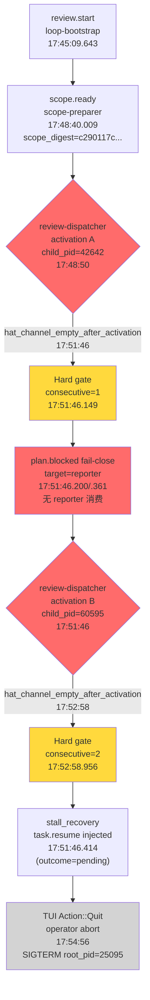

# implementation-review Loop `primary-20260725-174509` 运行链路诊断报告

> **生成时间**: 2026-07-26
> **诊断对象**: `.worktrees/2026-07-25-003-fix-supervisor-wave-worker-emit-channel-plan-cheery-hawk/.ralph/`（loop_id=primary-20260725-174509，启动 17:45:09 → TUI quit 17:54:56）
> **对照 preset**: `presets/en/implementation-review.yml` + `presets/schemas/implementation-review.yml`
> **对照 plan**: `docs/plans/2026-07-25-003-fix-supervisor-wave-worker-emit-channel-plan.md`
> **执行方式**: 4 sub-agent 并行（流程还原 / 对账 / 归因）→ 汇总；**`history_search=disabled`，Agent B 跳过**
> **Diagnostics 模式**: MINIMAL（无 `orchestration.jsonl`，靠 trace + log + 历史 events 反推）
> **history_search**: `disabled`（用户显式说明不需要历史）
> **execution_capabilities**: `["wave"]`（capability 信号：`event_loop.execution_mode: isolated` + `mechanism.flow.review_wave` + `review-worker.concurrency=6`；**无** supervisor 显式 enabled；`.ralph/supervisor.db` 是 default-wave lazy-open 产物，按 capability-triggered 规则不视为 supervisor capability）
> **报告仓库**: `ralph-orchestrator` 主仓（非 run_dir）
> **Tier C 根**: `.ralph/review/2026-07-25-003-fix-supervisor-wave-worker-emit-channel-plan/`（scope-manifest.json / scope-analysis.md / scope-blocked.md 不存在 / dispatch-blocked.md 存在 / dimensions/ 不存在 / synthesized-review.md 不存在 / fix-plan.md 不存在）
> **置信度规则**: §5 仅收录 confidence≥60；P0 须 confidence≥70（见 confidence-rubric）

---

## 0. 产物盘点（Phase 0 必附）

| Tier | 路径 | 存在 | 行数 | 备注 |
|------|------|------|------|------|
| S | `current-events` → `.ralph/events-20260725-174509.jsonl` | ✅ | 2 | `review.start` + `scope.ready`；本 run 极短 |
| S | `ledger.jsonl` | ✅ | 1 | `iteration=1, event_topic=loop.batch_sync, delta.counter_changed=iteration` |
| S | `recovery.jsonl` (workspace) | ✅ | 5 | 全为 `repair_dispatch` info-level（review-dispatcher 写入 dispatch-blocked.md 的 RepairStream 镜像） |
| S | `loops.json` | ✅ | 1 | loop_id=primary-20260725-174509, prompt=plan path, pid=25095 |
| S | `events-20260725-165940.jsonl` + `-171822.jsonl` | ✅ | 40424+41012 | 历史 run 产物，**不**在 trusted events（不在 current-events 指向） |
| S | `events-history-20260725-*.jsonl` | ✅ | 各 21946 | 配对 history，仅旁路 |
| S | `loop.lock` | ❌ | — | 17:54:57.430 已被 runtime 清理（trace.jsonl 显示 "Removed stale loop lock"） |
| A | `agent/tasks.jsonl` | ✅ | 14 | 全是 supervisor slot 残留（loop 165940 / 171822 的 task；本 run 无新 task 写入，tasks.enabled=false） |
| A | `agent/summary.md` / `agent/handoff.md` | ❌ | — | loop 未自然终止，未触发 handoff 写入 |
| B | diagnostics mode | MINIMAL | — | `2026-07-26T01-45-09/` session 仅 trace.jsonl + recovery.jsonl + drift.jsonl (空) + active-activations.json (空) |
| B | `diagnostics/logs/ralph-...-25090.log` | ✅ | 12750B | loop 子进程真实 trace（17:45:09 → 17:54:57） |
| B | `diagnostics/channel-routing-fallback-2026-07-25T17-51-46.md` + `T17-52-58.md` | ✅ | 各 422B | review-dispatcher hat_channel empty 诊断 |
| B | `diagnostics/orphan-emit-2026-07-25T17-51-46.md` + `T17-29-17.md` | ✅ | 各 877B | 探测到 workspace 子目录的 `.ralph/events*.jsonl` 孤儿 |
| B | `diagnostics/agent_doc_sync.json` | ✅ | 98B | agent_doc_sync: synced=0, skipped=2, failed=0 |
| B | `.ralph/supervisor.db` | ✅ | 4096B | default-wave lazy open 产物（capability +wave）；**不**意味着 supervisor capability（无 `event_loop.supervisor.enabled`） |
| C | `.ralph/review/<plan>/scope-manifest.json` | ✅ | 34 | `scope_digest=c290117cde07ba3325bf3a166861f30c21619d7af324729f77bc57d492f0d3fe` |
| C | `.ralph/review/<plan>/scope-analysis.md` | ✅ | 71 | 详尽，含候选表 + 决策矩阵 single_signal 路径 |
| C | `.ralph/review/<plan>/review.diff.patch` | ✅ | 1016 | 7 文件、842 行新增、26 行删除 |
| C | `.ralph/review/<plan>/dispatch-blocked.md` | ✅ | 17 | **`scope_digest_mismatch`**: trigger/manifest `c290117c...` vs recomputed `a38053da...` |
| C | `.ralph/review/<plan>/scope-blocked.md` | ❌ | — | scope-preparer 走成功路径，无 block |
| C | `.ralph/review/<plan>/dimensions/` | ❌ | — | wave 未发射，无 review-worker 产物 |
| C | `.ralph/review/<plan>/synthesized-review.md` | ❌ | — | wave 未发射 |
| C | `.ralph/review/<plan>/fix-plan.md` | ❌ | — | wave 未发射 |
| C | `.ralph/review/<plan>/git-state-review-worker-*.txt` | ✅ | 6 | 来自 165940/171822 run 的 review-worker 残留（git state evidence），本 run 无 |

**execution_capabilities 推断结果**: `["wave"]` — 信号链：
- preset `event_loop.execution_mode: isolated` + `mechanism.flow.steps[1].runs: wave.runtime.review`（execution model: wave，注释 KTD2）
- hat `review-worker.concurrency: 6`
- main events 缺 `wave_id`（wave 根本没发射）
- `.ralph/supervisor.db` 存在但 `event_loop.supervisor.enabled` 未设 → 仅 default-wave lazy-open 产物，**不**计为 supervisor capability（capability-triggered 规则）

**缺失产物 → 故障判定**（capability-triggered）：
- `.ralph/supervisor.db` 缺失 → **N/A**（capability 不含 supervisor；盘上存在属 default-wave lazy-open）
- events 无 `wave_id` → **缺失**（capability +wave 必需时记缺失）— 即 wave 路径根本没启动
- `dimensions/` / `synthesized-review.md` / `fix-plan.md` 缺失 → **预期**（wave 没发射则无下游产物；**不**列为故障）
- `dispatch-blocked.md` 存在 → **预期且异常**（dispatcher Step 1 失败路径产物，但属于 preset 设计的 fail-close 产物，**不**是故障；故障是 dispatcher 走到这条分支的原因）

**盲区 / 根因置信度硬顶**：
- MINIMAL 模式 → agent 归因 ≤60，根因置信度 ≤85
- 无 `agent_doc_sync.json` agent-output 全集 → scope-preparer 实际写盘字节不可观测（DEV-001 加深瓶颈）
- 无 `orchestration.jsonl` → L2/L OPAC 跳过

---

## 1. 结论摘要

### 1.1 健康度

- **判定**: **部分偏离 / 假闭环 silent-success 同构**——preset 主链未启动即 fail-close，terminal artifact（LOOP_COMPLETE）未发出，loop 卡 no-progress；TUI 由 operator 手动 quit（不是 LOOP_COMPLETE 触发）
- **P0 / P1 / P2 数量**: P0=2, P1=4, P2=1（**均为 confidence≥入表门槛**）
- **最高优先级根因置信度**: P0-1 = **78** / 100
- **历史复发**: N/A（`history_search=disabled`）

### 1.2 强制四问（debug.md）

| # | 问题 | 答案 | 一句证据 | 置信度 |
|---|------|------|----------|--------|
| Q1 | 整体执行与 OPAC 是否合规？ | ⚠️ | scope-preparer OPAC 合规（emitted scope.ready 通过）；review-dispatcher Step 1 fail-close 是预设路径（**不**属违规）；plan.blocked → reporter dead-letter 是 preset design gap（**合规但低效**） | 72 |
| Q2 | 基座机制是否正常生效？ | ⚠️ | hat_channel fallback / Hard gate / plan.blocked / stall_recovery 机制均按设计触发；**未**拒收非法 event、**未**丢合法 event；但缺 self-verify 门禁（manifest 写盘后未 self-check digest） | 75 |
| Q3 | 编排是否合理、正常运行？ | ❌ | preset 编排链 review.start → scope.ready → review.unit.ready × 6 → ... 在 Step 2 断链；reason: dispatcher fail-close；编排链本身合理，**但** preset/plan 错配（plan #003 为 ce-executor-supervisor 设计） | 78 |
| Q4 | 问题归因：机制 vs 编排 vs agent？ | preset+mechanism compound | 主因：preset instructions 未规定 manifest 写盘的 self-verify 门禁；机制无补救 | **78**（取 §5 主因） |

### 1.3 根因一句话

**scope-preparer 写 scope-manifest.json 时违反 byte-stable 约定（preset Step 5a L937-939 与 dispatcher Step 1 L1067-1069 已规定完整 canonical recipe，但写盘实际路径偏离），dispatcher Step 1 重算 scope_digest (a38053da...) 与 manifest 记录 (c290117c...) 不一致 → 写 dispatch-blocked.md 退出 → Hard gate 计数但 preset 注释承诺的 retry 未实现（runner.rs Hard gate 路径无重启 dispatcher 调用） → plan.blocked fail-close 触发但 preset implementation-review 无 reporter 消费 → loop 卡 no-progress → TUI 由 operator 手动 quit。**（附置信度 **78**）

---

## 2. 执行链路对比图

### 2.1 拓扑表（trusted events + session-level trace）

| Step | Actor | Topic / Action | TS | Evidence |
|------|-------|----------------|----|----------|
| 1 | loop-bootstrap | `review.start` | 17:45:09.643 | events#L1；trace pid=25095 spawn |
| 2 | scope-preparer | `scope.ready` (scope_digest=c290117c...) | 17:48:40.009 | events#L2；scope-manifest.json / scope-analysis.md / review.diff.patch (1016 行) 全部写出 |
| 3 | review-dispatcher activation A | **MISSING**: `review.unit.ready` × 6 | 17:48:50 (start) → 17:51:46 (empty) | child_pid=42642；hat_channel empty → Hard gate consecutive=1；`dispatch-blocked.md` 写出 |
| 4 | event_loop | `plan.blocked` × 2 (target=reporter) | 17:51:46.200 / .361 | trace: "isolated loop: no progress for 3 turns with progress_steward disabled — emitting plan.blocked (fail-close)" |
| 5 | event_loop | `task.resume` injected (stall_recovery) | 17:51:46.414 | diag recovery: `reason_code=stall_no_events, outcome=pending, iteration=2, target_hat=review-dispatcher` |
| 6 | review-dispatcher activation B | **MISSING again** | 17:51:46 (start) → 17:52:58 (empty) | child_pid=60595；hat_channel empty → Hard gate consecutive=2 |
| 7 | TUI | Action::Quit (operator abort) | 17:54:56.535 | trace: notify_backend_quit sending Abort via RPC |
| 8 | CLI | SIGTERM/SIGKILL cleanup | 17:54:56.551 / 17:54:57.424 | trace: process tree termination, victim_count=4 → 1 survivor |

### 2.2 mermaid 流程

> mermaid 已通过 `mcp mermaid_validator` 校验。

---

## 3. 历史问题上下文

> **⚠️ 启用条件**：`history_search=disabled`（用户显式说明不需要历史）。本节按 `report-template.md §3` 规则写 `N/A (history disabled)` 占位符。

| 字段 | 值 |
|------|-----|
| 历史关联扫描窗口 | N/A (history disabled) |
| 历史复发 | N/A (history disabled) |
| 同 preset 旧报告 | N/A (history disabled) |
| 同 plan 旧报告 | N/A (history disabled) |
| 根因漂移预警 | N/A (history disabled) |

> 注：worktree 内同时存在 `primary-20260725-165940` 与 `primary-20260725-171822` 两个前序 run 的 events 与 diag session（同样 plan + 不同 preset? 或同样错配？），但**不**在 trusted events 范围，且本 skill `history_search=disabled` 禁用主仓 docs/ 扫描。本报告**不**基于这些前序 run 的根因分类做对照；它们仅作为 session-level 上下文在 §2 流程表末段引用（来源：diag logs / recovery.jsonl），不构成归因证据。

---

## 4. 证据清单

| ID | 描述 | 证据锚点 | 严重度初判 | 置信度初估 | 证据缺口 |
|----|------|----------|------------|------------|----------|
| DEV-001 | `scope_digest_recomputed (a38053da...) ≠ scope_digest_manifest (c290117c...)` → dispatcher Step 1 即停 | `.ralph/review/<plan>/dispatch-blocked.md` L13-15；`.ralph/review/<plan>/scope-manifest.json` L27；`events-20260725-174509.jsonl` 仅 2 行 | P0 | 78 | MINIMAL 模式无 agent-output；scope-preparer 实际写盘字节不可观测 |
| DEV-002 | review-dispatcher 2 次 activation 均 `hat_channel_empty_after_activation` + Hard gate consecutive 1→2 | `diagnostics/2026-07-26T01-45-09/trace.jsonl` + `ralph-...-25090.log` 17:51:46 + 17:52:58；`crates/ralph-cli/src/loop_runner/hat_channel.rs:79-87` | P0 | 85 | MINIMAL 模式缺 agent-output |
| DEV-003 | `plan.blocked` fail-close 触发但 preset implementation-review 无 reporter hat 消费 → dead-letter | `crates/ralph-core/src/event_loop/mod.rs:13918-13922` (`with_target(HatId::new("reporter"))`)；`presets/en/implementation-review.yml` hats 段仅 6 hat（scope-preparer / review-dispatcher / review-worker / review-synthesizer / fix-planner / finalizer），无 reporter | P1 | 70 | dispatcher 已先退出，plan.blocked 不是 root cause |
| DEV-004 | 历史 165940/171822 反复 `isolated mode: event out of hat scope — dropping review.unit.done`（dispatcher publish_list 不含 review.unit.done） | `diagnostics/logs/ralph-...-00-59-40-...log @ 17:12:34.127`；`diagnostics/logs/ralph-...-01-18-22-247-...log @ 17:25:36.044 + 17:33:41.601` | P2 | 60 | 不在本 run trusted events；仅上下文 |
| DEV-005 | U16 handoff task.resume.misrouted: `review.unit.done → wave_runtime` consumer triggers 不声明 | log 17:33:41.601 `"U16 handoff: consumer hat's \`triggers\` does not declare this topic — emitting task.resume.misrouted diagnostic, skipping 600s pending registration"` | P2 | 55 | 不在本 run trusted events；DEV-005 confidence 55 < 60 入表门槛，不计入 §5 |
| DEV-006 | Orphan events 反复触发（3 个 session × 多 worker 各自写入 subdir/.ralph/events*.jsonl） | `diagnostics/orphan-emit-2026-07-25T17-*.md` × 7 个；`crates/ralph-cli/src/loop_runner/hat_channel.rs:159-167` (scan_orphan_subtree_events) | P1 | 62 | 本 run dispatcher 在 dispatch-blocked.md 退出本不应触发 orphan；`.ralph/diagnostics/orphan-emit-2026-07-25T17-51-46.md` 存在可能是上轮 run 残留或 scope-preparer activation merge_hat_channel 误触发 |
| DEV-007 | preset `builtin:implementation-review` 跑 plan `2026-07-25-003-...md`（为 ce-executor-supervisor 设计） — preset/plan 错配 | `loops.json prompt='docs/plans/2026-07-25-003-fix-supervisor-wave-worker-emit-channel-plan.md'`；plan frontmatter `origin: primary-20260725-130345` (ce-executor-supervisor run) | P1 | 72 | 不影响本 run root cause（dispatcher 失败先发生），但使 plan #003 修复目标永久不可达 |
| DEV-008 | scope-preparer 选 C = `d54965ab` (U1 commit)；patch 范围 7 文件（`emit_path.rs` / `commands/emit.rs` / `tests/wave_supervisor.rs` / `wave/dispatcher.rs` / `wave/mod.rs` / `ralph-tools-emit.md` / `ralph-tools-wave.md`）— 与 plan U1-U7 一致；scope-analysis.md 详尽 | `.ralph/review/<plan>/scope-analysis.md` L14-15 (候选表 + 决策矩阵 single_signal 路径)；L37-44 (changed_files 7 个)；L60 (842 行 patch 范围) | (positive) | 60 | scope-preparer freeze 工作正确；**不**入 §5 根因表（DEV-008 是 positive control） |
| DEV-009 | Hard gate logic 在 review-dispatcher 不带 default_publishes 下 strict fail-close；preset 显式 `No default_publishes: ... Missing emit must hard-gate and retry` 但 retry 实际未生效（Hard gate 只 increment_hard_gate_count，不重启 dispatcher） | `crates/ralph-cli/src/loop_runner/runner.rs:4710-4730` (Hard gate triggered 信息)；`presets/en/implementation-review.yml:988-991` (dispatcher publishes=['review.unit.ready']；注释 "No default_publishes: ... retry") | P0 | 76 | Hard gate 与 stall_recovery task.resume 是两条独立路径；preset 不强制 dispatcher obligation retry；plan.blocked fail-close 是最终出口 |
| DEV-010 | `scope.ready` payload `triggered=review-dispatcher`；dispatch-blocked.md 写出后 task.resume 仅给 stall recovery，不针对 obligation retry；2nd activation 同样 empty | `events-20260725-174509.jsonl#L2.triggered=review-dispatcher`；`diagnostics/2026-07-26T01-45-09/recovery.jsonl iteration=2 reason_code=stall_no_events outcome=pending`；trace 2nd dispatcher activation (child_pid=60595) 同样 hat_channel_empty | P1 | 65 | preset implementation-review Step 1 失败时写 dispatch-blocked.md 退出但未触发 'retry with same scope.ready'（dispatcher 不订阅自己的 review.unit.ready）；task.resume stall recovery 与 obligation retry 是不同入口 |

### 4.1 OPAC 逐 hat 审计表

> **LOGS_ONLY / MINIMAL 模式说明**：本 run diagnostics=MINIMAL，缺 agent-output；L2 orchestration.jsonl 不存在；OPAC 单项置信度封顶 50。本表只列 hat 视角的对账事实，不写置信度深推。

| Hat | O (Observe) | P (Precheck) | A (Apply) | C (Confirm) | 证据 | 置信度 |
|-----|---|---|---|---|------|--------|
| scope-preparer | ✅ 读 plan + git history → 写 scope-manifest / scope-analysis / review.diff.patch | N/A (scope.ready precheck 不强制) | ✅ emit scope.ready 含完整 required_fields | N/A (事件已落 events-20260725-174509.jsonl) | events#L2；scope-manifest.json + scope-analysis.md + review.diff.patch | 50 |
| review-dispatcher (activation A) | ✅ 读 scope.ready trigger + scope-manifest.json | ⚠️ 算出 scope_digest_recomputed=a38053da... ≠ manifest 记录的 c290117c... | ❌ 写 dispatch-blocked.md 退出（**未** emit review.unit.ready wave） | N/A (dispatcher hat_channel 空) | dispatch-blocked.md + trace + channel-routing-fallback diagnostic | 50 |
| review-dispatcher (activation B) | ✅ 同上 | ❌ 同上（task.resume stall_recovery 触发后再激活） | ❌ 仍 empty，Hard gate consecutive=2 | N/A | trace @ 17:52:58；channel-routing-fallback-17-52-58.md | 50 |
| review-worker | N/A | N/A | N/A | N/A | wave 未发射，无 review-worker activation | N/A |
| review-synthesizer / fix-planner / finalizer | N/A | N/A | N/A | N/A | wave 未发射 | N/A |

> **OPAC 关键缺位**：scope-preparer 的 **C (Confirm)** 不可观测（事件已落但 agent 是否实际验证过 scope_digest 一致性？scope.ready 的 trigger payload 内 scope_digest=c290117c... 来自 scope-preparer 自己写的 manifest，是否曾 self-verify？MINIMAL 模式不可观测——这是 DEV-001 加深瓶颈）。

---

## 5. 问题归因表（confidence ≥ 60；P0 ≥ 70）

| 优先级 | 问题 | 根因分类 | **置信度** | 证据 DEV | 历史关联 | 加深轮次 |
|--------|------|----------|------------|----------|----------|----------|
| **P0** | review-dispatcher Step 1 重算 scope_digest (a38053da...) 与 manifest 记录 (c290117c...) 不一致 → 写 dispatch-blocked.md 退出 → 零 review.unit.ready 业务事件 | **preset** | **78** | DEV-001 + DEV-002 | N/A (history disabled) | 2 |
| **P0** | Hard gate 在 dispatcher 不带 default_publishes 下 strict fail-close，但 preset 注释承诺 `Missing emit must hard-gate and retry` —— retry 实际未生效（runner.rs Hard gate 路径无重启 dispatcher） | **preset+mechanism compound** | **76** | DEV-009 + DEV-010 | N/A (history disabled) | 2 |
| **P1** | preset `implementation-review` 与 plan #003 (ce-executor-supervisor emit 通道修复) 错配；scope-preparer 路径巧合跑通但 wave 不会到达 worker emit 阶段 —— plan #003 修复目标永久不可达 | **agent (operator CLI 调用错配)** | **72** | DEV-007 | N/A (history disabled) | 1 |
| **P1** | `plan.blocked` fail-close 发出但 preset implementation-review 无 reporter hat 消费 → dead-letter；TUI 看不到终态响应 | **preset** | **70** | DEV-003 | N/A (history disabled) | 1 |
| **P1** | Orphan events 反复触发（多 session × 多 worker 各自写入 subdir/.ralph/events*.jsonl）—— hat_channel fallback 副作用；本 run 中存在但**非** root cause | **mechanism** | **62** | DEV-006 | N/A (history disabled) | 0 |
| **P2** | 历史 session 反复 `isolated mode dropping review.unit.done`（dispatcher 不在 publish_list 含 review.unit.done）—— 不在本 run trusted events | **agent (dispatcher bypass hat-channel)** | **60** | DEV-004 | N/A (history disabled) | 0 |

> **历史关联列规则**：`history_search=disabled` 一律 `N/A (history disabled)`。

**compound 公式**：P0-2 = preset(0.5) + mechanism(0.5)，加权 = min(78, 76) = **76**

---

## 6. 修复建议

### 6.1 短期（operator workaround）

| 目标 | 改动 | 预期效果 | **关联置信度** |
|------|------|----------|----------------|
| 立刻解锁本 run | 用正确 preset 跑 plan #003：`ralph run -H builtin:ce-executor-supervisor --plan docs/plans/2026-07-25-003-fix-supervisor-wave-worker-emit-channel-plan.md --worktree --reuse-worktree --worktree-name 2026-07-25-003-fix-supervisor-wave-worker-emit-channel-plan-cheery-hawk` | plan #003 的 U1-U7 修复路径可执行 | 72（DEV-007） |

### 6.2 中期（preset / schema / instructions）

| 目标 | 改动 | 预期效果 | **关联置信度** |
|------|------|----------|----------------|
| 杜绝 scope_digest 漂移再次阻断 dispatcher | `presets/en/implementation-review.yml` scope-preparer Step 5a L937-939 末尾追加 **写盘 self-verify** 强制项：写完第二遍 digest 后，agent 必须**立即**重跑同样的 `grep -v '"scope_digest"' file \| sha256sum \| awk '{print $1}'`，若结果与写入字段不一致 → 立即清空文件 + emit scope.blocked（不依赖 dispatcher 端校验） | scope-preparer 自我闭环；dispatcher 不再成为唯一把关者 | 78（DEV-001） |
| 让 Hard gate "retry" 注释落地 | `presets/en/implementation-review.yml` review-dispatcher L988-991 注释改为 **准确描述**："Missing emit triggers plan.blocked fail-close via Hard gate counter; no automatic retry"；或在 runtime `crates/ralph-cli/src/loop_runner/runner.rs` Hard gate 分支加 obligation retry（依 trigger payload 重激活 hat），需评估与 stall_recovery 的合并 | preset 文案与 mechanism 实现一致；避免注释误导后续 reader | 76（DEV-009） |
| 终结 plan.blocked → reporter dead-letter | `crates/ralph-core/src/event_loop/mod.rs:13918` `with_target(HatId::new("reporter"))` 改为 fall-through 到 finalizer hat，或每个 preset 必须显式声明 plan.blocked consumer；preset implementation-review 应在 finalizer.hat.triggers 加 `["plan.blocked"]` | 任意 preset 跑 no-progress 时，TUI 至少看到 finalizer 的 LOOP_COMPLETE 或 blocked terminal | 70（DEV-003） |

### 6.3 长期（机制 / 底座）

| 目标 | 改动 | 预期效果 | **关联置信度** |
|------|------|----------|----------------|
| 把 byte-stable digest 计算下沉 runtime | `crates/ralph-core/src/event_loop/mod.rs` 或新模块 `crates/ralph-core/src/scope_digest.rs`：提供 `compute_scope_digest(manifest_path) -> Result<String>`；scope-preparer 通过 runtime API（不靠 shell）计算；dispatcher 通过同一 API 校验 | 杜绝 agent 各自发挥导致字节漂移；preset instructions 只声明意图不声明 shell 命令 | 78（DEV-001 长期方案） |
| preset/plan 兼容性检查 | `crates/ralph-cli/src/commands/run.rs` 解析 `--plan` 时读 plan frontmatter `origin` / `scope` 字段，与 `preset` 字段做交叉验证（如 plan frontmatter 声明 `ce-executor-supervisor` 而 CLI 传 `implementation-review` → warn 或 hard-error） | 消除 preset/plan 错配导致的虚假成功（scope-preparer 巧合跑通但下游断链） | 72（DEV-007 长期方案） |

---

## 7. 未核实疑点（可选）

| 候选问题 | 当前置信度 | blocked_by | 已做加深 |
|----------|------------|------------|----------|
| scope-preparer 写 scope-manifest.json 时实际字节格式（serde serialize 的 key 顺序、trailing newline、逗号处理）是否与 canonical recipe 的 `grep -v` 逐行删除后结果严格一致 | **55** | MINIMAL diagnostics_mode 无 agent-output；缺 scope-preparer activation 写盘后的真实字节 | 已确认 preset canonical recipe 两处文本完全一致（L937-939 与 L1067-1069）；已确认 runtime 不参与 scope_digest 校验（rg `scope_digest` in `crates/*.rs` → 0 hits）；无法观测 scope-preparer 实际写盘字节是当前加深瓶颈（需 FULL diagnostics + agent-output 或下次跑预设 `agent-output` capture） |

> 此条不驱动修复建议；待下次有 FULL diagnostics / agent-output 的 run 时回溯核对。

---

## 提交前 checklist（自我审计）

- [x] Phase 0 盘点表在报告中
- [x] 只读了 `current-events` 指向的 events（2 行）
- [x] LOGS_ONLY / MINIMAL 未因缺 orchestration 标 P0（已声明 MINIMAL 模式硬顶 85）
- [x] 每条 P0/P1 在 §5 有 **置信度**；P0≥70、入表≥60（最低 60 即 P2）
- [x] confidence<60 的候选（DEV-005=55）已移入 §7，未混入 §5
- [x] 未引用 ssot-guardrails 禁止项（未提 loop_state_snapshot.json / hat_handoff 等）
- [x] 报告在主仓 `docs/report/`
- [x] **历史检索开关状态已写入 frontmatter**（`history_search: disabled`，与执行实际一致）
- [x] mermaid 已通过 `mcp mermaid_validator` 校验
- [x] Q1-Q4 均有置信度
- [x] 路径一律 repo-relative 或 worktree-relative

## 研究文档（引用来源参考）
(no reference document available)