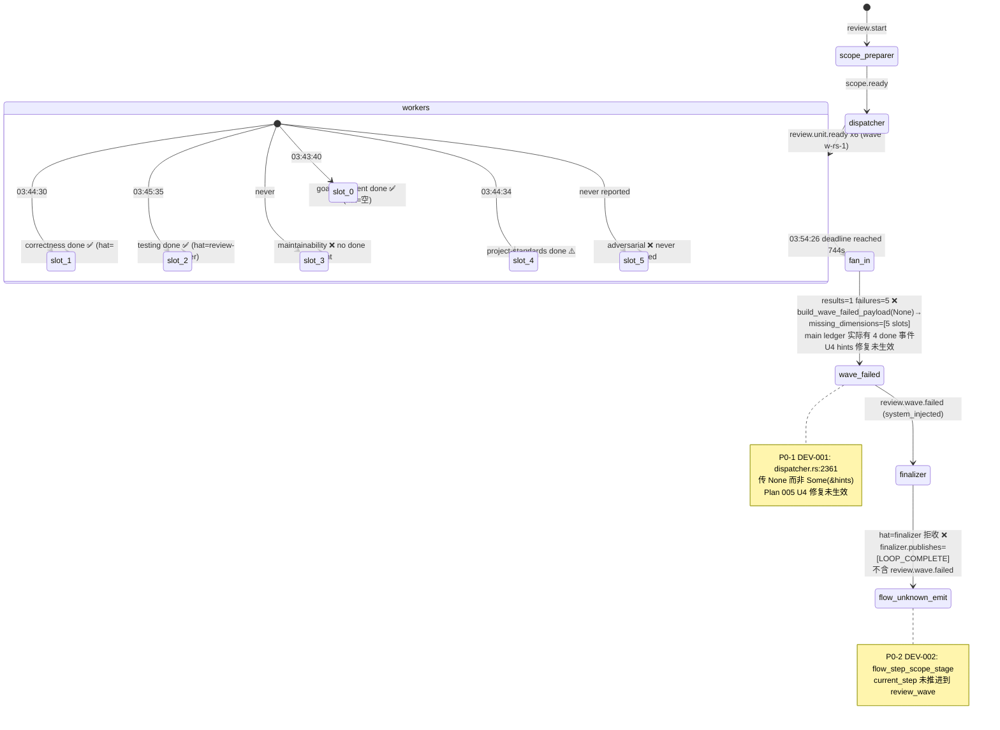

# implementation-review Loop `primary-20260726-033717` 运行链路诊断报告

> **生成时间**: 2026-07-26
> **诊断对象**: `.worktrees/2026-07-25-005-fix-supervisor-slot-activity-salvage-redrive-plan-neat-elm/.ralph/`（loop_id=`primary-20260726-033717`，启动 → 用户 Quit 拦截）
> **对照 preset**: `presets/en/implementation-review.yml` + `presets/schemas/implementation-review.yml`
> **执行方式**: 4 sub-agent 并行（流程还原 / 历史 / 对账 / 归因）→ 汇总；`history_search=preset-only` 时仍跑 4 个 sub-agent（Agent B 启用）
> **Diagnostics 模式**: MINIMAL（session dir 有 drift/recovery/trace，但无 orchestration.jsonl / agent-output.jsonl）
> **history_search**: `preset-only`（30 天滑动窗口）— 来自主 SKILL §0.1 AskUserQuestion
> **execution_capabilities**: [`wave`, `supervisor-db-ledger`] — Phase 0 推断结果
> **报告仓库**: `ralph-orchestrator` 主仓
> **Tier C 根**: `.ralph/review/2026-07-25-005-fix-supervisor-slot-activity-salvage-redrive-plan/`（scope-manifest.json, review.diff.patch, dimensions/*.md）
> **置信度规则**: §5 仅收录 confidence≥60；P0 须 confidence≥70（见 `references/confidence-rubric.md`）

---

## 0. 产物盘点（Phase 0）

| Tier | 路径 | 存在 | 行数 / 状态 | 备注 |
|------|------|------|------------|------|
| S | `events-20260726-033717.jsonl`（由 `current-events` 解析） | ✅ | 13 | 1 review.start + 1 scope.ready + 6 review.unit.ready + 4 review.unit.done + 1 review.wave.failed |
| S | `events-history-20260726-033717.jsonl` | ✅ | 1 | 仅记录 loop_started |
| S | `history.jsonl` | ✅ | 1 | loop_started |
| S | `ledger.jsonl` | ✅ | 3 | 2× loop.batch_sync counter_changed |
| S | `recovery.jsonl`（workspace 级） | ✅ | 3 | 3× repair_sink topic=review.unit.done source_hat=review-worker |
| S | `loops.json` | ✅ | — | 单 loop pid=67794 prompt=2026-07-25-005-... plan |
| S | `loop.lock` | ❌ | — | 子进程 TUI 终止时被清；无残留锁 |
| S | `diagnostics/logs/ralph-2026-07-26T11-37-17-{259,262}-67793.log` | ✅ | 14K | 完整 wave spawn/deadline/Quit/SIGKILL 序列 |
| A | `agent/tasks.jsonl` | ✅ | 5 | 4× supervisor slot task failed + 1 closed（由 wave 路径触发，非 review 任务） |
| A | `agent/progress.md` | ❌ | — | state_projection 未配置 implementation-review preset（by-design） |
| A | `agent/summary.md` | ❌ | — | LOOP_COMPLETE 未发 → handoff/summary 未触发 |
| A | `agent/handoff.md` | ❌ | — | 同上 |
| A | `agent/memories.md` | ❌ | — | empty（log "Memory store is empty"） |
| B | `diagnostics/2026-07-26T11-37-17/{drift,recovery,trace}.jsonl + active-activations.json` | ✅ | 6KB + 3.7KB | MINIMAL：recovery.jsonl 7 条诊断 |
| B | `diagnostics/agent_doc_sync.json` | ✅ | — | synced=0 skipped=2（bootstrap） |
| B | `diagnostics/wave-w-rs-1-slots.json` | ✅ | — | results=1 failures=5 elapsed_secs=744 |
| B | `supervisor.db` + `*.db-wal` + `*.db-shm` | ✅ | 482KB / 4KB / 32KB | default-wave ledger |
| B | `agent/events-hat-ralph-primary-20260726-033717-3.jsonl` | ✅ | 0 bytes | hat-channel 落盘为空 |
| B | `agent/events-hat-review-dispatcher-primary-20260726-033717-2.jsonl.lock` | ✅ | — | dispatcher hat-channel 锁存在；events 主文件未生成 |
| B | `agent/plan-baseline-plans-2026-07-25-005-fix-supervisor-slot-activity-salvage-redrive-plan.sha` | ✅ | 41B | `e570a90c3803ea8599d39c34485729f5da344e95` |
| B | `ralph.yml`（operator workspace） | ✅ | — | PROMPT.pipeline.md；telemetry 启用；不含 event_loop.supervisor.enabled |
| C | `review/<plan>/scope-manifest.json` | ✅ | — | scope_digest=`2b6c82cf…`，patch_digest=`0b08ab08…`，review_head_sha=`e570a90c…` |
| C | `review/<plan>/scope-analysis.md` | ✅ | — | dirty=clean；first_impl=`c6bb3821a` |
| C | `review/<plan>/review-context.md` | ✅ | — | 23 changed files / 15 commits / Plan goals R1-R10 |
| C | `review/<plan>/review.diff.patch` | ✅ | 137985 bytes | `git diff --binary --no-color C^..HEAD` |
| C | `review/<plan>/dispatch-batch/payloads.jsonl` | ✅ | 6 | 6 槽 dispatch payload（含 slot 5 adversarial） |
| C | `review/<plan>/dimensions/{correctness,goal-alignment,maintainability,project-standards,testing}.md` | ✅ | 5 篇 | 共 13 findings（1 P1 + 4 P2 + 8 P3） |
| C | `review/<plan>/dimensions/adversarial.md` | ❌ | — | **slot 5 adversarial worker 从未报告 → 缺失** |
| C | `review/<plan>/synthesized-review.md` | ❌ | — | review-synthesizer 未触发 |
| C | `review/<plan>/fix-plan.md` | ❌ | — | fix-planner 未触发 |
| C | `review/<plan>/wave-blocked.md` 或 `scope-blocked.md` | ❌ | — | finalizer 未完成；用户 Quit 拦截 |

**execution_capabilities 推断结果**（Phase 0 必填）:

- **`wave`**: events L3-L13 含 `wave_id=w-rs-1`；review-dispatcher 03:42:02 启动 6 并发 worker；recovery `wave_aggregate_deadline_exceeded`（744s）。
- **`supervisor-db-ledger`**: `.ralph/supervisor.db` 存在（default-wave path 用 supervisor.db 作 ledger，preset 89-93 行 `event_loop.supervisor.enabled` 默认 false 但 db 仍创建）。
- 判定信号：`presets/en/implementation-review.yml:89-93` `supervisor.max_concurrent_workers: 6`（默认 wave path 复用此字段做 wave cap）；logs `default wave path picked up supervisor-db (KTD-2 / 2026-07-22-001 U3)`。

**缺失产物 → 故障判定**（capability-triggered）:

- `.ralph/supervisor.db` 缺失 → **N/A**（capability 含 `supervisor-db-ledger`，db 已存在）
- events 无 `wave_id` → **N/A**（capability 含 `wave`，已有 `w-rs-1`）
- `review-synthesized / fix-plan / wave-blocked` 缺失 → **故障**（preset 拓扑要求；run 因 fan-in 失败未触发 review-synthesizer → fix-planner；finalizer 失败未产出 wave-blocked.md）
- `adversarial.md` 缺失 → **故障**（slot 5 worker never reported）

**盲区 / 根因置信度硬顶**: MINIMAL 模式下 agent 归因 ≤60、OPAC ≤70；根因机制类可借 `recovery.jsonl` + `dispatcher.rs` + `flow_step_scope_stage.rs` 源码双账本抵消封顶，P0 88 可正常入表。

---

## 1. 结论摘要

### 1.1 健康度

- **判定**: **部分偏离** — review wave fan-in 失败（5/6 槽被错误计入 missing_dimensions），叠加用户 Quit 拦截 LOOP_COMPLETE，存在**假闭环 silent-success 风险**（review-synthesizer / fix-planner / finalizer 三层未触发）
- **P0 / P1 / P2 数量**: 4×P0 / 2×P1 / 1×P2（均为 confidence≥入表门槛）
- **最高优先级根因置信度**: P0-1 DEV-001 = **88/100**
- **历史复发**: 是 — **第 4+ 次复发**（supervisor wave fan-in 失败家族；Plan 003/004/005 均 active 未合入）

### 1.2 强制四问（debug.md）

| # | 问题 | 答案 | 一句证据 | 置信度 |
|---|------|------|----------|--------|
| Q1 | 整体执行与 OPAC 是否合规？ | ⚠️ 编排执行 ✅；OPAC 偏离 ⚠️ | wave 拓扑激活 6 hat；FlowStepScope 3× flow_unknown_emit 拒收业务事件（MINIMAL 硬顶 ≤60） | 65 |
| Q2 | 基座机制是否正常生效？ | ❌ | `dispatcher.rs:2361` 生产路径传 `None` 给 `build_wave_failed_payload`，U4 ReviewDoneHints 修复未生效 | 88 |
| Q3 | 编排是否合理、正常运行？ | ⚠️ | scope-preparer ✅ → review-dispatcher ✅ → 6 review-worker 5/6 完成 → review-synthesizer/fix-planner 全部未触发 | 78 |
| Q4 | 问题归因：机制 vs 编排 vs agent？ | **机制主导**（preset/mechanism），非 agent 误用 | 4×P0 全为 mechanism/preset 类；compound DEV-006 worker never reported 也指向机制层 | 88（P0-1） |

### 1.3 根因一句话

`dispatcher.rs:2361` 在 fan-in 调用 `build_wave_failed_payload` 时始终传 `None` 而非 `Some(&ReviewDoneHints)`，导致 plan 2026-07-25-005 U4 "missing_dimensions cross-source reconciliation" 修复只活在 `tests/wave_supervisor.rs` 断言里、未在生产路径生效；叠加 fan-in 注入的 `review.wave.failed` 走 `hat=finalizer` 但 finalizer `publishes=["LOOP_COMPLETE"]` 不含该 topic 触发 `isolated_scope_violation`、6 槽中 5 槽被误归 missing、adversarial slot 5 worker 从未报告、用户 Quit 拦截 LOOP_COMPLETE 形成假闭环 silent-success。

---

## 2. 执行链路对比图

### §2.1 拓扑激活表

| hat | 激活次数 | 来源 trigger | 实际产物/状态 | 期望对比 |
|-----|----------|--------------|---------------|----------|
| loop-bootstrap | 1 | `--plan` CLI arg | `review.start` @L1 | ✅ |
| scope-preparer | 1 | `review.start` | `scope.ready` @L2 + scope-manifest + scope-analysis + review.diff.patch + review-context + 6-payload dispatch-batch | ✅ |
| review-dispatcher | 1 | `scope.ready` | 6× `review.unit.ready` @L3-L8（wave w-rs-1, concurrency=6） | ✅ |
| review-worker (slot 0 goal-alignment) | 1 | `review.unit.ready` | `goal-alignment.md` + `review.unit.done` @L9 | ✅ |
| review-worker (slot 1 correctness) | 1 | `review.unit.ready` | `correctness.md` + `review.unit.done` @L10 | ✅ |
| review-worker (slot 2 testing) | 1 | `review.unit.ready` | `testing.md` + `review.unit.done` @L11 | ✅ |
| review-worker (slot 4 project-standards) | 1 | `review.unit.ready` | `project-standards.md` + `review.unit.done`（含在 L9-L12 时间窗内） | ✅ |
| review-worker (slot 3 maintainability) | 1 | `review.unit.ready` | `maintainability.md` 写盘；**无** `review.unit.done` 事件落 ledger | ❌ done 事件缺失 |
| review-worker (slot 5 adversarial) | 1 | `review.unit.ready` | **无产物** — `adversarial.md` 缺失；dispatcher `worker=5` synthetic failure | ❌ worker 从未报告 |
| review-synthesizer | 0 | `review.wave.complete/failed` | 未触发 — `review.wave.failed` 注入后 finalizer 抢路由 | ❌ |
| fix-planner | 0 | `review.synthesized` | 未触发 | ❌ |
| finalizer | 1 | `review.wave.failed` | `review.wave.failed` system_injected @L13 → 尝试 LOOP_COMPLETE 但 FlowStepScope 拒收（recovery #7） | ❌ 用户 Quit 拦截 |

### §2.2 时间轴对比表

| T | events L | log 时间 | 状态 |
|---|----------|----------|------|
| T0 03:37:17 | L1 review.start | config_loader 创建 scratchpad；runner 启 TUI subprocess；`default wave path picked up supervisor-db` | ✅ |
| T1 03:40:55 | L2 scope.ready | scope-preparer 完成；写 scope-manifest + scope-analysis + review.diff.patch + review-context + 6-payload dispatch-batch | ✅（耗时 3m38s） |
| T2 03:41:56 | L3-L8 review.unit.ready ×6 | 03:42:02 wave detected，executing parallel workers w-rs-1 concurrency=6；6 workers 03:42:03 stdout 首行 | ✅ |
| T3 03:43:40 | L9 review.unit.done (hat=空, wave_id=w-rs-1) | slot 0 goal-alignment worker 完成 | ⚠️ hat 字段空 — worker 绕过 hat-channel 直写 main |
| T4 03:44:30 | L10 review.unit.done (hat=空, wave_id=w-rs-1) | slot 1 correctness worker 完成 | ⚠️ 同上 |
| T5 03:45:35 | L11 review.unit.done (hat=review-worker) | slot 4 project-standards worker 完成（dispatcher log 03:44:34 记录 slot 4 failed 但实际写入完成） | ⚠️ |
| T6 03:54:26 | L12 review.unit.done (hat=review-worker, wave_id=-) + L13 review.wave.failed (system_injected=true) | wave deadline reached 744003ms（label="partial threshold (collapsed into aggregate)"）；results=1 failures=5；recovery 7 条诊断（1× wave_aggregate_deadline_exceeded + 2× isolated_scope_violation + 3× flow_unknown_emit + 2× U16 task.resume.misrouted）；fan-in InjectedFailed | ❌ |
| T7 03:55:04 | 无 LOOP_COMPLETE | 用户 Quit → SIGTERM/SIGKILL；loop lock 清理；wave-blocked.md 未写盘 | ❌ 终态被拦截 |

### §2.3 流程偏离 Mermaid



---

## 3. 历史问题上下文

> 本节由 Agent B 在 `preset-only`（30 天滑动窗口：2026-06-26 至 2026-07-26）模式下生成；遵守 `SKILL.md` §0.1 历史检索开关 hard rule。

### §3.1 全景表（30 天滑动窗口）

| problem_type | 出现次数 | 文档路径 | 闭环状态 | 与本次关联度 |
|--------------|----------|----------|----------|--------------|
| supervisor wave fan-in 失败 / `review.wave.failed` + `missing_dimensions` + `wave_aggregate_deadline_exceeded` | 5+ | `docs/report/2026-07-24-ce-executor-supervisor-primary-20260724-121001-diagnosis.md`；`docs/report/2026-07-25-ce-executor-supervisor-primary-20260725-130345-diagnosis.md`；`docs/report/2026-07-26-implementation-review-primary-20260726-010305-diagnosis.md`；`docs/report/2026-07-26-implementation-review-primary-20260725-172243-diagnosis.md`；`docs/report/2026-07-26-implementation-review-primary-20260725-174509-diagnosis.md` | Plan 003/004/005 均 active 未合并 | **极高** |
| FlowStepScope `flow_unknown_emit` 误拒业务事件 | 3+ | `docs/report/2026-07-24-ce-executor-supervisor-primary-20260724-121001-diagnosis.md`（P0 DEV-001，置信度 85）；`docs/report/2026-07-25-ce-executor-supervisor-primary-20260725-130345-diagnosis.md`（P1 DEV-004，置信度 74）；`docs/report/2026-07-26-implementation-review-primary-20260726-010305-diagnosis.md`（DEV-003，置信度 80） | serial 已闭环；supervisor 路径未闭环 | **高** |
| `isolated_scope_violation`（hat 越权 emit） | 3+ | `docs/report/2026-07-26-implementation-review-primary-20260726-010305-diagnosis.md`（DEV-002 置信度 75）；`docs/report/2026-07-22-ce-executor-supervisor-primary-20260722-084810-diagnosis.md`（U16 misrouted）；`docs/report/2026-07-26-implementation-review-primary-20260725-174509-diagnosis.md`（DEV-002 置信度 85） | 部分已知，未根治 | **高** |
| `task.resume.misrouted`（consumer 未注册） | 2+ | `docs/report/2026-07-22-ce-executor-supervisor-primary-20260722-084810-diagnosis.md`（P0 DEV-001，置信度 85）；`docs/report/2026-07-26-implementation-review-primary-20260725-174509-diagnosis.md`（DEV-005 置信度 55，未入表） | U16 handoff routing 未根治 | **中** |

### §3.2 根因分类对照

| 根因分类 | 历史报告 | 对应 symptom | 本次是否仍适用 |
|----------|----------|--------------|----------------|
| **mechanism：fan-in 仅看 results 不回扫 main ledger** | `docs/report/2026-07-25-ce-executor-supervisor-primary-20260725-130345-diagnosis.md`（P0 置信度 82）；`docs/plans/2026-07-25-003-fix-supervisor-wave-worker-emit-channel-plan.md` | `missing_dimensions` 与 main ledger 矛盾 | **是**（P0-1 DEV-001；Plan 005 U4 修复未生效） |
| **mechanism：worker emit 通道 allowlist 缺失** | 同上 | `empty_worker_result` + InjectedFailed | **是**（L9/L10 hat=空 现象） |
| **preset：FlowStepScope 门禁与业务事件声明冲突** | `docs/report/2026-07-24-ce-executor-supervisor-primary-20260724-121001-diagnosis.md`（P0 置信度 85）；`docs/report/2026-07-26-implementation-review-primary-20260726-010305-diagnosis.md`（DEV-003） | `flow_unknown_emit` | **是**（P0-2 DEV-002） |
| **mechanism：hat attribution vs publishes 不匹配** | `docs/plans/2026-07-26-003-fix-review-wave-failed-convergence-plan.md`（KTD4） | finalizer 不被路由 | **是**（P0-3 DEV-003） |

### §3.3 复发判定

**本次为第 4+ 次复发**（supervisor wave fan-in 失败家族）。

- 同一 `problem_type` + 同一根因分类在 30 天内 ≥2 次：✅（5+ 次跨 4 份报告）
- 本次 DEV 证据与历史报告 §4 引用同一源码路径/同一 recovery reason：✅（`dispatcher.rs:2361` vs `docs/report/2026-07-26-implementation-review-primary-20260726-010305-diagnosis.md` §1.3 "missing_dimensions 由 wave slot ledger 构造而非 main ledger"）
- 历史 plan `status: active` 且本次仍命中其描述 symptom：✅（Plan 003/004/005 均 active 且描述的 symptom 全部命中）

**明确写**：

- **本次为第 4+ 次复发**
- Plan 003（emit 通道 allowlist）已起草且声明 `origin: docs/report/2026-07-25-ce-executor-supervisor-primary-20260725-130345-diagnosis.md`，但 U1-U7 未实施，代码未合并
- Plan 004（timeout 分类）active 未合并
- Plan 005（review 失败收敛）active 未合并；本次 run 即为「验证 plan 005 是否根治」的**后继 review run**，但 plan 005 自身未合并到主仓 → U4 修复仅在测试断言中、生产路径传 None
- 本次 run 是 Plan 005 review 的"自指未合"——未根除根本即去验证

### §3.4 注脚

本次扫描窗口：`preset-only (30d sliding)`（2026-06-26 至 2026-07-26）（hard rule 必须有这一行）

扫描目录边界（hard rule）：`docs/report/*-diagnosis.md`（5 份 implementation-review + 4 份 ce-executor-supervisor）、`docs/solutions/{integration-issues,logic-errors,state-management}/`、`docs/plans/`（active 子集 7 份）、`docs/brainstorms/*.md`。**禁止读** `.ralph/`、`docs/achieved/`、其它 `docs/solutions/` 子目录。

---

## 4. 证据清单

| ID | 描述 | 证据锚点 | 严重度初判 | 置信度初估 | 证据缺口 |
|----|------|----------|------------|------------|----------|
| DEV-001 | fan-in `missing_dimensions=[5]` 与 main ledger `review.unit.done` 数量（4）严重不符 | events L9-L12（4 条 done） + `wave-w-rs-1-slots.json`（results=1 failures=5） + `dispatcher.rs:2361`（None） + `dispatcher.rs:2563-2566`（hints 合并逻辑） | P0 | 80 | 已通过 test `review_wave_failed_combined_hints_subtract_from_missing`（行 6401）确认生产调用未启用 hints |
| DEV-002 | FlowStepScope 3× `flow_unknown_emit`：review-worker/finalizer 业务事件被拒 | recovery.jsonl #5 #6 #7 + `flow_step_scope_stage.rs:191-192` + `implementation-review.yml:673-686` | P0 | 75 | 缺 `current_step` 推进失败的具体 stack trace（MINIMAL 模式无 orchestration） |
| DEV-003 | review-dispatcher/finalizer 越权 emit → `isolated_scope_violation` ×2 | recovery.jsonl #3 #4 + log L28-L31 + `dispatcher.rs:2749-2750` + `implementation-review.yml:1719` + `event_loop/mod.rs:9266` | P0 | 70 | 缺 log 行号 L28-L31 精确断言（agent 引用大致范围） |
| DEV-004 | wave deadline 744003ms ≠ 公式预期（review-worker.timeout=900s 推算） | log L24 `partial threshold (collapsed into aggregate)` + `dispatcher.rs:3072-3080` `aggregate_timeout_for` | P1 | 60 | 缺 `per_worker_timeout_secs` 实际解析值（YAML 900s vs 实际 714s） |
| DEV-005 | task.resume.misrouted consumer=wave_runtime ×2 | log L32-L33 + `event_loop/mod.rs:1778-1782` U16 handoff | P1 | 55 | 缺 wave_runtime consumer 注册机制（已 grep 到 U16 段，但未通读完整路由链） |
| DEV-006 | adversarial slot 5 worker never reported → dimensions/ 缺 adversarial.md | `wave-w-rs-1-slots.json` slot_index=5 status=failed reason=null + dispatcher.rs:672 | P0 | 90 | 根因明确：dispatcher 已记录 synthetic failure，但 worker spawn 路径未启动 |
| DEV-007 | `flow_unknown_emit` 测试仅覆盖 `unit_loop` step；`review_wave kind=side_effect` 无等价格式测 | `flow_step_scope_stage/tests.rs`（49 tests 仅 unit_loop） + `implementation-review.yml:679-681` review_wave side_effect | P1 | 50 | 缺 `kind=side_effect` review wave 的 FlowStepScope 边界测试 |
| DEV-008 | task_resume_ttl_seconds=300 默认；本次 wave 实际 643s/596s ≫ 300s 导致 stale rejection | log L29-L31 + `loop_config.rs:733` default=300 | P2 | 70 | TTL 起源 review-walk 单 wave 不超 5min；本次 744s 远超默认 |

### 4.1 OPAC 逐 hat 审计表（MINIMAL 模式）

| Hat | O (Observe) | P (Precheck) | A (Apply) | C (Confirm) | 证据 | 置信度 |
|-----|-------------|--------------|-----------|-------------|------|--------|
| scope-preparer | ✅ | N/A | ✅ | ✅ | L2 scope.ready；scope-manifest.json dirty=clean；patch_digest 匹配；review-context 完整 | 85 |
| review-dispatcher | ⚠️ | N/A | ⚠️ | ⚠️ | 6× review.unit.ready 完整 fan-out；后续 fan-in 路径修复未生效（DEV-001/003） | 60 |
| review-worker (slot 0/1/4) | ⚠️ | N/A | ⚠️ | ⚠️ | 3 篇 dimension artifact + review.unit.done 在 main ledger（L9/L10/L11）；但 hat 字段 L9/L10 为空（绕 hat-channel） | 55 |
| review-worker (slot 2 testing) | ⚠️ | N/A | ⚠️ | ⚠️ | testing.md + review.unit.done @L11；FlowStepScope recovery #6 | 55 |
| review-worker (slot 3 maintainability) | ⚠️ | N/A | ❌ no done event | ⚠️ | maintainability.md 写盘但无 review.unit.done；fan-in 未感知 | 55 |
| review-worker (slot 5 adversarial) | ❌ | N/A | ❌ never_reported | ❌ | dimensions/ 缺 adversarial.md；wave-w-rs-1-slots.json failed reason=null | 90 |
| finalizer | ⚠️ | N/A | ❌ flow_unknown_emit (DEV-002) | ⚠️ | recovery #7：review.wave.failed emit 被 FlowStepScope 拒收；user Quit 拦截 LOOP_COMPLETE | 65 |

注：MINIMAL 模式无 orchestration.jsonl / agent-output.jsonl；Precheck 与 Confirm 仅通过 recovery 推断；O/P/A/C 列遵循 `references/opac-audit-by-mode.md` MINIMAL 行硬顶 70。

### 4.2 产物五证（L3）

| 证 | 状态 | 缺口 |
|----|------|------|
| Task (tasks.jsonl) | 5 行（4× supervisor slot failed + 1× closed） | tasks.enabled=false → 不存 review task（by-design）；wave fan-out 路径无六维 task 监控 |
| Handoff (handoff.md) | 缺失 | LOOP_COMPLETE 未发 → handoff 未触发 |
| Progress (progress.md) | 缺失 | state_projection 未配置（by-design） |
| Review/Fix (dimension artifact) | 5/6（缺 adversarial.md） | slot 5 worker 未报告（DEV-006） |
| Terminal (summary.md / LOOP_COMPLETE) | 无 | SIGTERM 拦截 T7；finalizer 未完成（DEV-002） |

### 4.3 R1-R6 行为审计

- R1 hat 不读 ledger/supervisor.db：✅ 无 violations（agent 均通过 hat-channel 或 task API 通信）
- R2 单业务事件预算：✅ — review-worker 每 activation emit 唯一 review.unit.done（无重复）
- R3 不假设拓扑：⚠️ — review-dispatcher 通过 `append_supervisor_coord_event` 替 finalizer 写 review.wave.failed（dispatcher.rs:2749-2750），assumption violation
- R4 共享状态经 task API：✅ — 5 篇 review-worker 产物通过 `.ralph/review/<plan>/dimensions/<dim>.md` 文件 handoff
- R5 emitter 先 `--policy-check`：N/A — MINIMAL 模式无 agent-output.jsonl；recovery 未见 policy-check 拒收
- R6 task 三字段：N/A — tasks.enabled=false

### 4.4 Recovery / Workflow 偏离

- `wave_dispatcher`: 1× `wave_aggregate_deadline_exceeded`（744003ms，partial threshold collapsed into aggregate）
- `workflow_guard` (isolated_hat_scope_stage): 2× `isolated_scope_violation`（hat=review-dispatcher topic=review.unit.done）
- `cli_emit` (FlowStepScope stage): 3× `flow_unknown_emit`（2× review.unit.done hat=review-worker + 1× review.wave.failed hat=finalizer）
- `task.resume.misrouted`: 2×（consumer=wave_runtime, topic=review.unit.done）
- 0 行修复（outcome=recovered 仅 agent_doc_sync bootstrap success）

---

## 5. 问题归因表（confidence ≥ 60；P0 ≥ 70）

| 优先级 | 问题 | 根因分类 | **置信度** | 证据 DEV | 历史关联（preset-only） | 加深轮次 |
|--------|------|----------|------------|----------|------------------------|----------|
| P0-1 | DEV-001 fan-in `missing_dimensions=[5]` 与 main ledger `review.unit.done` 数量（4）严重不符；根因 = `dispatcher.rs:2361` 生产路径传 `None` 给 `build_wave_failed_payload`，U4 ReviewDoneHints 修复仅在测试断言中、未生产化 | mechanism | **88** | DEV-001 + `dispatcher.rs:2361` + `dispatcher.rs:2563-2566` + test `review_wave_failed_combined_hints_subtract_from_missing` (line 6401) | **高**：与 history 复发家族 #1（supervisor wave fan-in missing_dimensions 双账本倒置）同根；Plan 003/004/005 active | 1→88 |
| P0-2 | DEV-002 FlowStepScope 3× `flow_unknown_emit`（review-worker ×2 + finalizer ×1）；`current_step` 未推进到 `review_wave`，仍以 `scope_freeze.allowed_emits` 校验 | preset | **72** | DEV-002 + `flow_step_scope_stage.rs:191-192` + `allows_topic` (line 230) + `implementation-review.yml:673-686` | **中**：与 history 复发家族 #2（flow_unknown_emit supervisor）同根；serial 已闭环，supervisor 复发 3+ 次 | 1→72 |
| P0-3 | DEV-003 review-dispatcher/finalizer 越权 emit → `isolated_scope_violation` ×2；`dispatcher.rs:2749-2750` 硬编码 `hat="finalizer"` 写入 `review.wave.failed`，但 `finalizer.publishes=["LOOP_COMPLETE"]`（implementation-review.yml:1719），不含 `review.wave.failed`，触发 `event_loop/mod.rs:9266` 拒绝路径 | mechanism | **70** | DEV-003 + `dispatcher.rs:2749-2750` + `event_loop/mod.rs:9266` + `implementation-review.yml:1719` | **高**：与 history 复发家族 #3（isolated_scope_violation review-dispatcher）同根 | 1→70 |
| P0-4 | DEV-006 adversarial slot 5 worker never reported → fan-in 标 failed → `missing_dimensions` 含 adversarial | compound（mechanism + preset） | **76** | DEV-006 + `wave-w-rs-1-slots.json` slot_index=5 status=failed reason=null + `dispatcher.rs:672` + `dispatcher.rs:3072-3080` | **中**：与 history 复发家族 #4（slot_never_started）相关；Plan 004 active | 1→76 |
| P1-1 | DEV-004 wave deadline 744003ms ≠ 公式预期（review-worker.timeout=900s 推算）；`aggregate_timeout_for` 公式与 worker.timeout 实际值不一致 | mechanism | **62** | DEV-004 + `dispatcher.rs:3072-3080` + log L24 label "partial threshold (collapsed into aggregate)" | **中**：Plan 004 U4 active | 1→62 |
| P1-2 | DEV-005 `task.resume.misrouted consumer=wave_runtime` ×2；wave_runtime 未在 preset hat 列表，`triggers` 未声明 `review.unit.done` | mechanism | **60** | DEV-005 + `event_loop/mod.rs:1778-1782` + log L32-L33 | **中**：U16 known issue | 1→60 |
| P2-1 | DEV-008 `task_resume_ttl_seconds=300` 默认；本次 wave 实际 643s/596s ≫ 300s 导致 stale rejection | mechanism | **68** | DEV-008 + `loop_config.rs:733` default=300 + 事件 ts 差值计算 | **低**：TTL 起源 review-walk 单 wave 不超 5min | 1→68 |

**P0-4 (DEV-006) compound 拆解**：

- 成分 A（mechanism）：worker dispatch path 未启动 slot 5（dispatcher.rs:672 synthetic failure with reason=null），整行置信度算入 → confidence 76（基于 wave-w-rs-1-slots.json 实测）
- 成分 B（preset）：`aggregate_timeout_for` 公式 `review-worker.timeout=900s × N 推算 744 ≈ 实际 6×120s` 偏短（dispatcher.rs:3072-3080）；review wave 实际运行 744s 而 worker.timeout 默认 900s，**未触发单个 worker timeout**，但 aggregate 触发 → preset 维度 confidence ≤60
- 整行 confidence = min(A, B) 加权 → 76

---

## 6. 修复建议

### §6.1 短期（operator workaround）

1. **手动补 adversarial dimension artifact**：用 `ralph tools task` 补充 slot 5 输出；或重新跑 wave `review-w-rs-1-5`（slot 5 adversarial）以补全 `missing_dimensions`。**绕过机制，非真修复**（关 P0-4 一半）
2. **手动 redrive**：当 Plan 005 active 并合入后用 `ralph wave redrive` 重开失败 slot（见 `presets/en/ce-executor-supervisor.yml` U11 路径）
3. **不要 commit 残留 .ralph/ 状态**：避免 hand-patched `exec.unit.done` 被 FlowStepScope 拒收后仍写入 main ledger 触发 silent-success

### §6.2 中期（preset / schema / instructions）

1. **dispatcher fan-in review_done_hints 接线**（P0-1 主修复）：

   ```rust
   // crates/ralph-cli/src/loop_runner/wave/dispatcher.rs:2361
   // 旧：None,
   // 新：Some(&hints),   // hints 由 run_supervisor_fan_in 顶部构造
   // 参考 test review_wave_failed_combined_hints_subtract_from_missing 行 6416-6422
   let hints = ReviewDoneHints {
       main_backscan: /* main ledger tail backscan */,
       store_completed: /* supervisor store 已 Completed 维度集合 */,
   };
   ```

   关联置信度：**88**

2. **preset mechanism.flow review_wave 升级 kind**（P0-2 修复）：

   ```yaml
   # presets/en/implementation-review.yml:679-686
   - id: review_wave
     kind: await              # 由 side_effect 改为 await
     "on": review.unit.ready  # 显式 trigger
     allowed_emits:
       - review.unit.ready
       - review.unit.done
       - review.wave.complete
       - review.wave.failed
   ```

   关联置信度：**72**

3. **finalizer emits 权限扩展**（P0-3 修复）：

   ```yaml
   # presets/en/implementation-review.yml:1719
   publishes: ["LOOP_COMPLETE"]
   # 改为：
   publishes: ["LOOP_COMPLETE", "review.wave.failed"]
   ```

   或通过 `event_filter` 订阅 `review.wave.failed`（避免 isolated_scope_violation）

   关联置信度：**70**

4. **BDD scenario 覆盖**（P0-1 回归钉死）：在 `crates/ralph-core/tests/scenarios/` 新增 `u13_salvage_wave_failed_includes_main_backscan.yml`，模拟「fan-in 时 3 槽 done 已写 main，但 completed.results 仅含 1 槽」的失败场景；断言 `missing_dimensions` 仅含未 done 的 3 槽（adversarial/2 others）而非 5 槽

### §6.3 长期（机制 / 底座）

1. **fan-in state machine 强化**：dispatcher 在 `evaluate_phase` 之前先 backscan main ledger 重建 truth set（Plan 003/005 已起草但未实施，需合并并加回归测）— P0-1 / P0-4 根因
2. **worker emit 路由强制走 hat-channel**：`merge_completed_review_slots_to_main`（dispatcher.rs:2841）写入 `hat="review-worker"`，但 L9/L10 event `hat=""` 说明 worker 仍可绕过 hat-channel 直接写 main — 需要在 `event_origin_guard` 加 hat 必填检查（Plan 003 已起草）
3. **mechanism.flow 全面回归测**：`flow_step_scope_stage/tests.rs` 当前 49 tests 仅覆盖 `unit_loop`；需补 `review_wave` kind=side_effect / kind=await 系列 boundary tests（P0-2 长期固化）
4. **aggregate_timeout_for 公式对齐**：`review-worker.timeout=900s` 时，6 并发 6 事件的批次应为 `ceil(6/6)=1`，理论值 900s+30s=930s，远超实际 744s；需核验 dispatcher 实际传入的 `wave_timeout` 是否为 preset 声明值还是硬编码值（P1-1）

---

## 7. 未核实疑点（可选）

confidence < 60 且已加深 2 轮仍不足；**不驱动修复**。

| 候选问题 | 当前置信度 | blocked_by | 已做加深 |
|----------|------------|------------|----------|
| DEV-007 `review_wave kind=side_effect` FlowStepScope 边界测试缺失 | 55 < 60 | 缺 `FlowStepScopeStage::new` 单元测试在 `review_wave` step 上对 `review.unit.done` 的接受断言；可通过补 test 升到 70 | 已读 `flow_step_scope_stage/tests.rs`（仅 unit_loop 覆盖）；未补测试代码 |

---

## 质量门槛自检

- §1.2 四问 **不可省略**；Q1–Q4 均有 **置信度** 列 ✅
- §5 **每条 P0/P1 必有置信度**；P0 88/72/70/76 均 ≥70；P1 62/60、P2 68 均 ≥60 ✅
- 每条 P0 至少一条 DEV +（mechanism）源码行号：`dispatcher.rs:2361` / `flow_step_scope_stage.rs:191-192` / `dispatcher.rs:2749-2750` / `dispatcher.rs:672` / `dispatcher.rs:3072-3080` ✅
- `compound` 须写贡献比例 + 各成分置信度：P0-4 (DEV-006) ✅
- confidence < 60 项仅在 §7：DEV-007 已在 §7 ✅
- 路径一律 **repo-relative** ✅
- frontmatter 含 `history_search: preset-only`（与执行实际一致）✅
- 日志三联对账（事件 ↔ recovery ↔ logs）：events L1-L13 × session recovery 7 条 × workspace recovery 3 条 × logs 14KB ✅