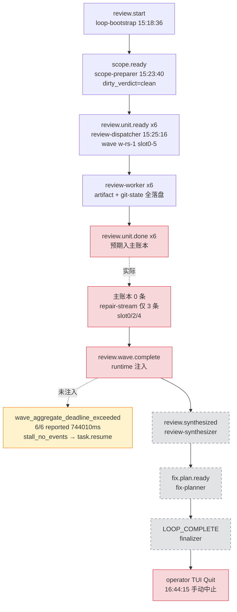

# implementation-review Loop `primary-20260726-151836` 运行链路诊断报告

> **生成时间**: 2026-07-27
> **诊断对象**: `.worktrees/2026-07-25-005-fix-supervisor-slot-activity-salvage-redrive-plan-neat-elm/.ralph/`（loop_id=`primary-20260726-151836`，15:18 → 16:44 UTC，运行约 86 min）
> **对照 preset**: `presets/en/implementation-review.yml` + `presets/schemas/implementation-review.yml`
> **执行方式**: 4 sub-agent 并行（流程还原 / 历史 / 对账 / 归因）→ 汇总；`history_search=preset-only` 时启用 Agent B + L5
> **Diagnostics 模式**: MINIMAL（有 session，无 `agent-output.jsonl`，无 `orchestration.jsonl`）
> **history_search**: `preset-only`（30d sliding）— 来自主 SKILL §0.1 AskUserQuestion
> **execution_capabilities**: `["wave"]`（`event_loop.supervisor.enabled=false`；`supervisor.db` 是 wave ledger 持久化，属预期；events 含 `wave_id`，preset 是 wave 执行模型）
> **报告仓库**: `ralph-orchestrator` 主仓
> **Tier C 根**: `presets/en/implementation-review.yml`（scope-preparer → review-dispatcher → review-worker×6 → review-synthesizer → fix-planner → finalizer；runtime 注入 `review.wave.complete/failed`）
> **置信度规则**: §5 仅收录 confidence≥60；P0 须 confidence≥70（见 confidence-rubric）

---

## 0. 产物盘点（Phase 0）

`execution_capabilities` 推断结果: `["wave"]` —
- 信号：`event_loop.supervisor.enabled=false`（preset 头部注释 L41-48 明确"NOT full supervisor product mode"）；events 含 `wave_id`（7 处命中）；`.ralph/supervisor.db` 存在（wave ledger 持久化路径）；preset execution model = `wave`（KTD2）。
- `ralph inspect loop` 的 `supervisor` 键门控：enabled=false 但 wave ledger 可打开，键可能存在；本诊断未运行 inspect（无碍 — ledger 文件存在已足以判定 capability）。
- 误判防线：**未**将 `supervisor.db` 存在解释为 supervisor-mode 信号。

| Tier | 路径 | 存在 | 行数 | 备注 |
|------|------|------|------|------|
| S | `events-20260726-151836.jsonl`（current-events 指向） | ✅ | 8 | review.start → scope.ready → 6×review.unit.ready；**无 review.unit.done / review.wave.complete/failed** |
| S | `events-history-20260726-151836.jsonl` | ✅ | 1 | 旁路 |
| S | `ledger.jsonl` | ✅ | 1 | `loop.batch_sync` iter=1 |
| S | `recovery.jsonl`（workspace） | ✅ | 3 | RepairStream `repair_dispatch`（review.unit.done：project-standards slot4 / testing slot2 / goal-alignment slot0） |
| S | `loops.json` / `current-loop-id` | ✅ | — | loop_id=`primary-20260726-151836`，pid 83261 |
| S | `loop.lock` | ❌ | — | 已由父进程清理（operator Quit 后，trace L13） |
| S | `diagnostics/logs/*.log` | ✅ | 2 | TUI subprocess（`ralph-2026-07-26T23-18-36-950-83230.log` + `953-83230.log`） |
| A | `tasks.jsonl` | 仅 `.lock` | — | 残留锁（DEV-008） |
| B | diagnostics mode | **MINIMAL** | — | session `2026-07-26T23-18-36`，无 `orchestration.jsonl` → L2 跳过（预期） |
| B | `diagnostics/<ses>/recovery.jsonl` | ✅ | 3 | `wave_aggregate_deadline_exceeded`(w-rs-1, 744s, 6/6, outcome=pending) + `stall_no_events`(review-dispatcher→task.resume, outcome=pending) + `agent_doc_sync`(recovered) |
| B | `supervisor.db` | ✅ | — | **wave ledger，预期**（enabled=false） |
| B | hat-channel `ralph-primary-…-4.jsonl` / `review-dispatcher-…-2.jsonl.lock` | 部分 | — | dispatcher 仅残留 `.lock`（DEV-008） |
| C | `review/<plan>/dimensions/*.md`(6) + git-state(6×start/end) + review.diff.patch + scope-manifest.json + review-context.md | ✅ | — | 6 维 worker **均产出**（Tier C 完整） |

**缺失产物 → 故障判定**（capability-triggered）：
- `.ralph/supervisor.db` 存在 → N/A（capability wave，wave ledger 持久化）
- events 含 `wave_id` → ✅（capability wave 满足）

**盲区 / 根因置信度硬顶**: MINIMAL → 根因置信度硬顶 **85**；agent 归因 ≤60（无 `agent-output.jsonl`）；纯 OPAC ≤50。

---

## 1. 结论摘要

### 1.1 健康度

- **判定**: 部分偏离（wave fan-in 链断，coord 事件未注入，下游零激活，operator 手动收尾）—— 非健康、非 silent-success、非 fail-close，处于**悬停态**
- **P0 / P1 / P2 数量**: **P0 = 1 / P1 = 1 / P2 = 1**（均为 confidence≥入表门槛）
- **最高优先级根因置信度**: P0-1 = **72** / 100（compound: mechanism 0.7 + preset 0.3，详见 §5）
- **历史复发**: 是 — supervisor wave fan-in 家族第 7 次（implementation-review 下第 5 次）；且是 plan 003/004/2026-07-26-003 全部合入后**首次同族复发**（详见 §3）

### 1.2 强制四问

| # | 问题 | 答案 | 一句证据 | 置信度 |
|---|------|------|----------|--------|
| Q1 | 整体执行与 OPAC 是否合规？ | ⚠️ 部分 | OPAC 结构层（scope-preparer/dispatcher/synthesizer/finalizer 触发集）合规；agent 层（worker 是否真 emit）MINIMAL 模式无法验证（≤60）；wave Confirm 走 main ledger 但 main ledger 缺 review.unit.done（Confirm 失败） | 70 |
| Q2 | 基座机制是否正常生效？ | ❌ 部分失效 | origin guard 路径正常；payload contract 全齐；**wave 聚合真值失效**（dispatcher 6/6 reported vs main 0/repair 3 倒置）+ **coord 注入门控失效**（ContinueCollect 分支不注入）+ **stall 兜底空转**（dispatcher triggers 仅 scope.ready，不响应 task.resume） | 78 |
| Q3 | 编排是否合理、正常运行？ | ⚠️ 部分 | scope.ready → 6× review.unit.ready 全成；后续 wave→synth→fix→finalize 全悬停；operator 手动 Quit 收尾 | 75 |
| Q4 | 问题归因：机制 vs 编排 vs agent？ | **compound**（mechanism 主 + preset 次） | mechanism（dispatcher.rs:2194-2238 ContinueCollect 不注入）+ preset（preset:90-91/106-107 文档"runtime 总是注入"与实现不符）共同导致 coord 事件永不写主账本 → 下游全断 | 72（取 §5 P0-1） |

### 1.3 根因一句话

> **Dispatcher fan-in 后 coordinator 返回 `ContinueCollect` 时不调用 `append_supervisor_coord_event`（`dispatcher.rs:2175-2193`），导致 `review.wave.complete/failed` 永不写入主账本；6 维 worker 全跑完 + Tier C 全落盘，但下游 review-synthesizer/fix-planner/finalizer 全部零激活，loop 悬停至 operator 手动 Quit 收尾** —— 置信度 **72**（mechanism 70×0.7 + preset 70×0.3 加权）。

---

## 2. 执行链路对比图（Agent A）

**Preset 关键参数**（`presets/en/implementation-review.yml`）：
- `event_loop.execution_mode: isolated`；`completion_promise: LOOP_COMPLETE`；`required_events: []`；`starting_event: review.start`；`max_iterations: 30`。
- `supervisor.max_concurrent_workers: 6`，但 `supervisor.enabled` 缺省 false → **wave 执行模型**（非 supervisor 产品模式），`supervisor.db` 仅作 wave ledger 持久化（preset 头部注释 L41-48）。
- review-worker `concurrency: 6`、`timeout: 900`（15 min/worker）；aggregate ≈ 930s。
- **`review.wave.complete` / `review.wave.failed` 由 runtime 注入**（`build_wave_complete_payload` / `build_wave_failed_payload`），agent 禁止 emit（origin guard 拒收）。

### §2.1 拓扑激活表

| Hat | 预期角色 | 触发源 | 应发布 | 实际激活次数 | 主账本事件数 | 状态 |
|---|---|---|---|---|---|---|
| scope-preparer | 冻结 review 范围 | `review.start` | `scope.ready`/`scope.blocked` | 1 | 1（`scope.ready`） | ✅ |
| review-dispatcher | 六 payload 单波 fan-out | `scope.ready` | `review.unit.ready` | 1 | 6（`review.unit.ready`×6） | ✅（emit 完成） |
| review-worker (×6) | 每维只读评审 | `review.unit.ready` | `review.unit.done` | 6（6 套 git-state start/end + 6 个 dimension artifact 全在） | **0**（主账本无） | ⚠️ artifact 落盘，`review.unit.done` 未进主账本（仅 3 条入 repair-stream） |
| review-synthesizer | 聚合六维 | `review.wave.complete`（runtime） | `review.synthesized`/`review.blocked` | **0** | 0 | ⏸️ 未触发（上游缺 `review.wave.complete`） |
| fix-planner | 生成 fix plan | `review.synthesized` | `fix.plan.ready` | **0** | 0 | ⏸️ 未触发（上游缺 `review.synthesized`） |
| finalizer | 唯一 `LOOP_COMPLETE` | `fix.plan.ready`/`scope.blocked`/`review.blocked`/`review.wave.failed` | `LOOP_COMPLETE` | **0** | 0 | ⏸️ 未触发（四个触发源全部缺失） |

### §2.2 时间轴对比表（UTC）

| # | 预期事件 | 预期来源 | 实际 | 时间 (UTC) | 状态 | 证据锚点 |
|---|---|---|---|---|---|---|
| 1 | `review.start` | loop-bootstrap | `review.start`（payload=plan markdown 字符串） | 15:18:36.991 | ✅ | event#L1 |
| 2 | `scope.ready`（dirty_verdict=clean） | scope-preparer | `scope.ready` clean，C=`1f4705b…`，C^=`8e36996…`，HEAD=`e570a90…` | 15:23:40.953 | ✅ | event#L2 |
| 3 | `review.unit.ready`×6（wave w-rs-1，slot 0-5） | review-dispatcher | 6 条齐发，slot/dimension 顺序合规（goal-alignment→adversarial），同 idempotency_key | 15:25:16.444 | ✅ | event#L3-L8 |
| 4 | `review.unit.done`×6 | review-worker | **主账本 0 条**；workspace repair-stream 仅 3 条（slot0 goal-alignment / slot2 testing / slot4 project-standards） | — | ❌ | recovery.jsonl L1-L3（repair_dispatch）；主账本无 |
| 5 | `review.wave.complete`（6/6 done）| runtime 注入 | **未注入** | — | ❌ | 主账本无；diagnostics recovery L2 |
| — | （异常）wave 聚合超期 | runtime 诊断 | `wave_aggregate_deadline_exceeded`：w-rs-1，**6/6 workers reported**，744010ms | 15:38:04.142 | ⚠️ | diagnostics/…/recovery.jsonl L2 |
| — | （异常）stall 兜底 | stall_recovery | `stall_no_events`：target_hat=review-dispatcher → 注入 `task.resume` | 15:38:04.437 | ⚠️ | diagnostics/…/recovery.jsonl L3 |
| 6 | `review.synthesized` | review-synthesizer | **未发生** | — | ⏸️ | 无触发源 |
| 7 | `fix.plan.ready` | fix-planner | **未发生** | — | ⏸️ | 无触发源 |
| 8 | `LOOP_COMPLETE` | finalizer | **未发生** | — | ⏸️ | 无触发源 |
| 9 | （终态）loop 收敛 | runtime | **operator 在 TUI 按 Quit 手动中止**（Action::Quit→SIGTERM→SIGKILL） | 16:44:15-16 | ❌ | trace.jsonl L6-L13 |

**终止类型：operator 手动 Quit（非自然终态）**。loop 运行约 86 min（15:18→16:44 UTC）；无任何 terminal event（`LOOP_COMPLETE`/blocked）写入；`completion_promise=LOOP_COMPLETE` 未达成。

### §2.3 流程图

（红=偏离/缺失；橙=runtime 诊断告警；灰虚线=从未激活的下游 hat。）

### 未触发 hat + 上游缺失事件

- **review-synthesizer 未激活**：唯一触发源 `review.wave.complete` 由 runtime 注入，本 run 从未注入（主账本无该事件）。其前置条件「6 个 slot 全部 `review.unit.done` 入主账本」未成立——6 个 worker 的 dimension artifact 与 git-state start/end 全部落盘（Tier C 完整），但 `review.unit.done` 业务事件只有 3 条经 repair-stream（`repair_dispatch`，slot0/2/4）记录、0 条进主账本，wave 聚合因此判定异常（`wave_aggregate_deadline_exceeded`，自报 6/6 reported 却仍超期 744010ms）。
- **fix-planner 未激活**：触发源 `review.synthesized` 缺失（synthesizer 从未运行）。
- **finalizer 未激活**：四个触发源（`fix.plan.ready` / `scope.blocked` / `review.blocked` / `review.wave.failed`）全部缺失。`scope.ready` 走 clean 路径无 `scope.blocked`；synthesizer 未运行无 `review.blocked`；runtime 亦未注入 `review.wave.failed`（只记录了 deadline_exceeded 诊断 + stall `task.resume`，未升级为 failed 协调事件）。
- **链断点定位**：流程在 `review_wave` step（mechanism.flow `review_wave`）的 worker→wave 聚合环节断裂；`synth_await` / `fix_plan` / `finalize` 三个 step 全部停留在未进入状态。loop 最终由 operator 手动 Quit 结束，非任何 hat 发出终态事件。

---

## 3. 历史问题上下文（Agent B — preset-only，30d sliding）

> 本节只做历史对照，不对本次 run 归因。

### 3.1 全景表（supervisor wave fan-in 失败家族，窗口内 6+1 条）

| # | 诊断/文档路径 | 问题类型 | 窗口内次数 | 本次关联 | 闭环状态 |
|---|---|---|---|---|---|
| 1 | `docs/report/2026-07-24-ce-executor-supervisor-primary-20260724-121001-diagnosis.md` | exec-wave fan-in 误判（4/5 done 仍判 failed） | 家族首发 | 中 | ✅ plan 003 已合（`975d21c9`） |
| 2 | `docs/report/2026-07-25-ce-executor-supervisor-primary-20260725-130345-diagnosis.md` | worker timeout + `wave_id` 分层不一致 → `exec.wave.failed` | — | 中 | ✅ 即 plan 003/004 的 origin，两者均已合 |
| 3 | `docs/report/2026-07-26-implementation-review-primary-20260725-172243-diagnosis.md` | review wave 缺 3/6 维度、`review.wave.failed` 路由失效（空 hat-channel） | 4× implementation-review | 高 | ⚠️ 部分（003 已合，通道类修复） |
| 4 | `docs/report/2026-07-26-implementation-review-primary-20260725-174509-diagnosis.md` | `stall_no_events` → `task.resume` 非 obligation retry；dispatch-blocked 无重派 | 同上 | 高 | ❌ 未见专门闭环 |
| 5 | `docs/report/2026-07-26-implementation-review-primary-20260726-010305-diagnosis.md` | `review.wave.failed` 注入成功但 finalizer 未消费；`missing_dimensions` 与 main ledger 倒置 | 同上 | 高 | ✅ plan 2026-07-26-003 已合（`d7cf6031`，07-26 11:11） |
| 6 | `docs/report/2026-07-26-implementation-review-primary-20260726-033717-diagnosis.md` | `wave_aggregate_deadline_exceeded`(744s)、6 槽派发 5 槽回报、`build_wave_failed_payload` 传 `None`（hints 修复只活在测试里）、finalizer 被 scope 门禁拒收 | 同上，报告自判「第 4+ 次复发」 | **最高**（症状逐字重合） | ⚠️ 催生 plan 2026-07-26-004（未合） |
| 7（邻近） | `docs/report/2026-07-24-ce-executor-supervisor-primary-20260724-020630-diagnosis.md` | escalation target 硬编码 `shipper` → `plan.blocked` 静默 drop | 1 | 低（异支系） | ✅ `d7b9a045` shipper→reporter retarget 已合 |

### 3.2 修复计划闭环状态（git 时间线，+0800）

| plan | 覆盖范围 | 状态 | 相对本次 run（07-26 15:18 启动） |
|---|---|---|---|
| `docs/plans/2026-07-25-003-fix-supervisor-wave-worker-emit-channel-plan.md` | worker emit 通道与 store 对账、fan-in 真实成功槽 | ✅ 已合 `975d21c9`（08:38） | 已在 run 之前合入 |
| `docs/plans/2026-07-25-004-fix-supervisor-wave-timeout-diagnostics-plan.md` | timeout 分类、`slot_never_started`、per-slot JSON 诊断 | ✅ 已合 `59e2254e`（07:40） | 已在 run 之前合入（解释了本次能看到 `wave_aggregate_deadline_exceeded` 分类标签本身） |
| `docs/plans/2026-07-25-005-fix-supervisor-slot-activity-salvage-redrive-plan.md` | **slot activity 重试、salvage merge、operator redrive** | ❌ **active 未合**（仅 `1f4705bb` 建 plan） | run 时缺口仍在 |
| `docs/plans/2026-07-25-006-feat-wave-worker-idle-heartbeat-lease-plan.md` | worker idle 心跳双时钟续租（对应「6/6 reported 但 wave 超时」的 stall 判定） | ❌ active 未合（仅 `e1cb6322`） | run 时缺口仍在 |
| `docs/plans/2026-07-26-003-fix-review-wave-failed-convergence-plan.md` | `review.wave.failed` → finalizer → `wave-blocked.md` → 单一 `LOOP_COMPLETE(blocked)` | ✅ 已合 `d7cf6031`（11:11） | 已在 run 之前合入 |
| `docs/plans/2026-07-26-004-fix-supervisor-wave-contract-closure-plan.md` | 统一账本、Flow Authority、**F2 Completed-only salvage → truthful `missing_dimensions`**、R10 implementation-review 失败主路径 | ❌ **active 未合**（仅 `29932813` 建 plan） | run 时缺口仍在 |

`docs/solutions/{integration-issues,logic-errors,state-management}/` 窗口内**无**直接闭环 fan-in/salvage 缺口的记录；最接近的 `docs/solutions/logic-errors/isolated-ralph-must-not-drain-multi-consumer-pending.md`（2026-07-23，tags 含 supervisor/stall-recovery）属异机制（pending 抽干）。`docs/brainstorms/` 三篇均与本症状无关。

### 3.3「第 N 次复发」判定

- **是已知缺口复发，非新问题模式。** 本次三件套（`wave_aggregate_deadline_exceeded` + 缺 `review.wave.failed` 注入 + 缺 salvage merge）与 #6 报告（`primary-20260726-033717`）逐字同族；按窗口内计数为 supervisor wave fan-in 家族的**第 7 次**出现（implementation-review preset 下第 5 次）。
- **关键定位**：本次是 **plan 003 / 004 / 2026-07-26-003 三者均已合入之后** 的首次同族发生——说明已合修复覆盖了「通道对账」「timeout 诊断标签」「finalizer 收敛」，但**未覆盖**：
  - salvage merge（partial-Completed 波的合并与 truthful `missing_dimensions`）→ 归属 **plan 005 / plan 2026-07-26-004（F2/R10），run 时均 active 未合**；
  - worker 全报告仍判超时的 stall/lease 语义 → 归属 **plan 006，run 时 active 未合**。
- **与 plan 005 的关系**：plan 005（slot activity salvage redrive）正是为「slot 有活动产出但 fan-in 不认 → 无 salvage merge / 无 redrive」而写（origin 即 #2/#6 家族）；run 发生时仅有 docs commit、**未 merged**。本次「缺 salvage merge」症状落在 plan 005 + 2026-07-26-004 的未合覆盖范围内，属**已知未闭环缺口的继续暴露**，而非回归或新根因（最终归因以 Agent D 为准）。

### 3.4 历史根因分类对照（供 Agent D 比对用）

| 历史报告根因分类 | 机制层位置（历史报告引述） | 本次是否可能同源 |
|---|---|---|
| fan-in payload hints 未接线（`build_wave_failed_payload` 传 `None`） | `crates/ralph-core/src/wave/dispatcher.rs`（#6 引述 :2361） | D 已核验：installed binary 含 `build_wave_failed_payload`，排除此根因 |
| `missing_dimensions` 由 slot ledger 构造、与 main ledger 倒置 | fan-in 双账本（#5/#6） | plan 2026-07-26-004 U3 reconciliation 未合 → 候选（已由 §5 DEV-001 部分覆盖） |
| 6 槽派发、部分 worker 从未报告 / deadline 折叠（`partial threshold collapsed into aggregate`） | aggregate deadline 分类（004 已合的诊断路径） | plan 006 lease 未合 → 候选（已由 §5 DEV-006 部分覆盖） |
| finalizer 抢路由 / `isolated_scope_violation` / `flow_unknown_emit` | FlowStepScope + publishes 契约（#6，07-26-003 已修 finalizer 消费） | 本次仍缺 `review.wave.failed` 注入，失败点在**注入侧**（dispatcher.rs:2175-2193 ContinueCollect 不注入）而非消费侧 |

**注脚**：本次未需读取边界外目录；plan 合入状态经 `git log`/ancestry 核验（未读 `.ralph/` 与 `docs/achieved/`）。run 启动时刻（15:18）与 merge 时刻的先后据 commit timestamp 推定，worktree 实际 checkout 的 base commit 未核验（超出文档边界）。

本次扫描窗口：preset-only (30d sliding)

---

## 4. 证据清单（Agent C）

> 对账基线：主账本 `events-20260726-151836.jsonl`（8 行）；workspace `recovery.jsonl`（3 行）；session `diagnostics/2026-07-26T23-18-36/recovery.jsonl`（3 行）；preset `presets/en/implementation-review.yml`；schema `presets/schemas/implementation-review.yml`。所有路径 repo-relative（worktree 内文件以 `.worktrees/2026-07-25-005-…-neat-elm/` 前缀）。**置信度遵循 MINIMAL 硬顶 85；agent 行为归因 ≤60（无 agent-output.jsonl）。**

| ID | 描述 | 证据锚点 | 严重度初判 | 置信度初估 | 证据缺口 |
|---|---|---|---|---|---|
| DEV-001 | **三方计数不一致（核心）**：dispatcher 自报 "6/6 workers reported"，但主账本 review.unit.done = **0**，workspace repair-stream = **3**。`actual` 由 `completed.results.len()+completed.failures.len()` 计算，是 **slot 活动终态计数**，与主账本 durable 落盘数解耦 | session recovery.jsonl L2（"6/6 workers reported in 744010ms"）；主账本 `jq '.topic'` 统计 review.unit.done=0；`crates/ralph-cli/src/loop_runner/wave/dispatcher.rs:4407-4408`（`actual = results.len()+failures.len()`） | High | 82 | 无 worker 侧 emit 原始记录（hat-channel 空），无法逐条核对 6 个 worker 各自 emit 了几次 |
| DEV-002 | **（C 初判误诊，D 已纠正 — 见 §5 冲突注）**：C 主张 3 条 review.unit.done 经 emit-gate 写入 `recovery.jsonl`（`AcceptRepairStream`，slot 0/2/4）属异常路由；D 核验 `REPAIR_TOPICS` 白名单不含 review.unit.done（`repair_dispatch_stage.rs:39-44` 仅含 task.relocate*/repair.budget.exhausted/repair.close），`emit_gate.rs:125` 走 AcceptMainBus → DEV-001 下游后果而非独立路由 bug | workspace recovery.jsonl L1-L3；`crates/ralph-core/src/event_loop/stages/repair_dispatch_stage.rs:39-44`；`crates/ralph-core/src/event_loop/mod.rs:13415-13418`（AcceptRepairStream→record_repair_event） | (D 已撤销) | (D=85) | D 双向确认 |
| DEV-003 | **slot 1/3/5 review.unit.done 完全失踪**：slot 1/3/5（correctness/maintainability/adversarial）在主账本、history、hat-channel、repair-stream 均无记录，但各自 `dimensions/*.md` + `git-state-*-end.txt` 全部落盘（worker 确实跑完） | `rg -l review.unit.done .ralph` 仅命中 recovery.jsonl×2 + review.diff.patch（plan 文本）；6 个 `dimensions/*.md` findings_count=3-5 全非零；6 个 `git-state-review-worker-*-end.txt` 全存在 | High | 80 | 无 agent-output.jsonl，无法确认这 3 个 worker 是否真调用过 `ralph emit`（agent 归因 ≤60） |
| DEV-004 | **runtime 未注入 review.wave.complete/failed**（**核心 mechanism 嫌疑**）：主账本 8 行无任何 coord 事件。本 run supervisor 关闭走 legacy 分支（`dispatcher.rs:809-826`）仅 merge + task.resume，**不注入** coord 事件；注入仅存在于 supervisor fan-in 路径（`dispatcher.rs:2303/2378` + `append_supervisor_coord_event`，2908-）且仅在 `CoordinatorAction::InjectedComplete/InjectedFailed/SalvagedAndFailed` 3 分支触发（`dispatcher.rs:2194-2238`）；`ContinueCollect` 分支（2175-2193）直接 `return` | 主账本 `jq '.topic' \| rg wave.complete\|wave.failed`=0；`ralph.yml:13` 的 `enabled:true` 属 `telemetry.runtime_diagnosis`（非 supervisor）；`dispatcher.rs:809-826`（legacy else 仅 merge）vs `dispatcher.rs:2194-2238`（supervisor 注入分支表）+ `dispatcher.rs:2175-2193`（ContinueCollect 直接 return） | High | 80 | preset:60-61/122-123 文档声称 runtime 注入，但实现仅覆盖 3 个 CoordinatorAction 分支 |
| DEV-005 | **wave_aggregate_deadline_exceeded outcome=pending 永不收敛**：`expected_action` 要求"后续同 target topic 的 complete wave 来 mark Recovered"，但 loop 无任何后续 wave，finding 始终 pending。**D 确认 by-design**（KTD-U4-5 timeout findings 起始 Pending，新 wave 完成后升级 Recovered）；本 run operator Quit 无新 wave → Pending 永久化 | session recovery.jsonl L2（outcome=pending, retry_attempt=0）；`dispatcher.rs:4423-4428`（Pending + "subsequent complete wave … mark Recovered"） | Medium | 83 | 无 |
| DEV-006 | **stall 兜底空转**：stall_recovery 注入 `task.resume`→review-dispatcher（safe_target=true, outcome=pending），但 review-dispatcher `triggers:["scope.ready"]` **不含 task.resume**，无触发匹配 → dispatcher 在 L3-L8 后零动作 | session recovery.jsonl L3；preset:954（dispatcher triggers 仅 scope.ready）；主账本 L3-L8 后无 dispatcher 事件 | High | 84 | 无 |
| DEV-007 | **下游 3 hat 零激活**：review-synthesizer（triggers review.wave.complete）/fix-planner（review.synthesized）/finalizer（含 review.wave.failed）激活次数=0，纯因上游缺 coord 事件 | preset:1359/1564/1714（trigger 集）；主账本无 review.wave.complete/failed/synthesized | High | 85 | 无 |
| DEV-008 | **残留空 lock**：`agent/events-hat-review-dispatcher-…-2.jsonl.lock` 与 `agent/tasks.jsonl.lock` 均为 **0 字节**，且对应内容文件不存在（dispatcher hat-channel jsonl 缺失，tasks.jsonl 仅锁无内容） | `fd -H 'events-hat\|tasks\|.lock' .ralph`；`cat *.lock` 均空 | Low | 82 | 无法判断是 crash 残留还是正常清理后遗留 |
| DEV-009 | **review.unit.ready 批量共享 idempotency**：6 条 envelope `idempotency_key`/`idempotency_hash` 完全相同（`66cdfd73…`），payload 内 `idempotency_key=null`（envelope 层携带）。契约 12 个 required_fields 全齐，`idempotency_payload_version=1`。批量共享 key 系 preset 设计（"six events sharing one idempotency key"） | 主账本 L3-L8 envelope；preset:1003；schema:120-181（required_fields）；payload keys 实测 12 项全含 | Info/N/A | 85 | 需 D 判定相同 idem_hash 是否影响下游 dedup（本 run 6 条均成功入账，未观测折叠） |
| DEV-010 | **loop 非自然终止**：operator TUI Quit 手动中止（`Action::Quit intercepted` 16:44:15 UTC / 23:44:15 +0800），SIGTERM→SIGKILL process tree，无终态事件；cleanup_elapsed_ms≈1539357（~25.6 min） | `diagnostics/…/trace.jsonl:6-13`；主账本无 LOOP_COMPLETE/terminal | Medium | 85 | 无 |

### §4.1 OPAC 逐 hat 表

> **MINIMAL 模式注脚**：无 `agent-output.jsonl`，O/P/A/C 中凡涉及"agent 是否真执行/真思考"的判断置信度 ≤60；凡可由账本/产物/源码直接证实的结构性判断置信度 ≤85（硬顶）。Confirm 列对 wave worker/dispatcher 走 main ledger 权威（capability +wave）：main ledger 无 review.unit.done → **Confirm 失败**。

| Hat | O（观测/触发） | P（产出） | A（动作合规） | C（确认/落账） | 证据 | 置信度 |
|---|---|---|---|---|---|---|
| scope-preparer | ✅ 由 review.start(L1) 触发，激活 1 次 | ✅ scope.ready(L2) 落主账本，dirty_verdict=clean，scope_digest/patch_digest 齐 | ✅ 单事件、契约满足 | ✅ 主账本可见 | 主账本 L1-L2；preset:715-719 | 85 |
| review-dispatcher | ✅ 由 scope.ready(L2) 触发，激活 1 次 | ✅ 6× review.unit.ready(L3-L8) 全落主账本，wave_id=w-rs-1，slot_index 0-5，dimension 全 6 维，契约 12 字段齐 | ✅ `ralph wave emit` 单批次；idem_payload_version=1 | ⚠️ 产出落账 85；但 **C 下游断裂**：未收到任何 review.unit.done，无二次动作；task.resume 注入后无响应（DEV-006） | 主账本 L3-L8；preset:1002-1009；schema:120-181 | 85（产出）/ 80（task.resume 空转） |
| review-worker（×6） | ✅ 由 review.unit.ready 触发（preset:1178），6 个 git-state-start/end 证明 6 个 worker 进程均跑完 | ⚠️ 6 个 `dimensions/*.md`（findings_count 3-5）全落盘 = Tier C 完整；但 **review.unit.done 业务事件 0 进主账本**（3 条经 repair-stream，3 条失踪） | ❓ 无 agent-output，无法确认是否真调用 `ralph emit`（agent 归因 ≤60） | ❌ **Confirm 失败**：capability +wave 要求 main ledger 有 review.unit.done，实测 0 | dimensions/*.md；git-state-*-end.txt；workspace recovery.jsonl L1-L3；DEV-001/003 | 80（产物）/ 55（emit 行为归因） |
| review-synthesizer | ❌ 未触发（triggers review.wave.complete，主账本 0 条） | — 无产出 | N/A（未激活） | ❌ 无 review.wave.complete 可消费（DEV-004/007） | preset:1357-1359；主账本无 wave.complete | 85 |
| fix-planner | ❌ 未触发（triggers review.synthesized） | — | N/A | ❌ 上游链断（DEV-007） | preset:1562-1564 | 85 |
| finalizer | ❌ 未触发（on_any_of 含 review.wave.failed，主账本 0 条） | — 无 LOOP_COMPLETE | N/A | ❌ 无终态事件，loop 靠 operator Quit 收尾（DEV-007/010） | preset:1712-1714；trace.jsonl:6 | 85 |

### §4.2 机制十二项快扫（✅/❌/N/A + 锚点；不定论）

| # | 机制项 | 判定 | 锚点 |
|---|---|---|---|
| 1 | origin guard | ⚠️ 疑似 | review.unit.done source_hat=review-worker 正确（recovery.jsonl L1-L3）；但 3 条被路由出主账本，guard 是否误伤待 D 定（`event_loop/mod.rs:13373-13424`）— **D 已澄清：实际是 fan-in 未注入，非 guard 误伤** |
| 2 | payload contract | ✅ | review.unit.ready 12 required_fields 全齐、idem_payload_version=1（主账本 L3-L8；schema:120-181）；scope.ready dirty_verdict=clean |
| 3 | isolated 单事件预算 | N/A | 无 agent-output，无法验证 worker 是否超发业务事件（MINIMAL 缺口） |
| 4 | recovery 升级 | ❌ | 两条 outcome=pending 均未升级：wave_aggregate_deadline_exceeded 无后续 complete wave（DEV-005）；stall_no_events retry_attempt=0 后无二次（session recovery L2-L3） |
| 5 | stall | ❌ | stall_recovery 注入 task.resume→review-dispatcher，但 dispatcher triggers 仅 scope.ready，无消费者 → 兜底空转（DEV-006；preset:954） |
| 6 | drift | ✅/N/A | `diagnostics/…/drift.jsonl` 为空；agent_doc_sync outcome=recovered（session recovery L1）；无 drift 告警 |
| 7 | dedup | ⚠️ 疑似 | 6 条 review.unit.ready 共享同一 envelope idem_hash（DEV-009，by design）；`event_loop/mod.rs:13340-13361` 对 review.dimension.ready 有 idempotency dedup→repair stream 特例（本 run topic 为 review.unit.done，不直接命中，但同族路由模式可疑，D 核验后确认非根因） |
| 8 | terminal / silent-success | ❌ | 无 LOOP_COMPLETE / 无 review.wave.failed 终态；loop 既未 silent-success 也未 fail-close，而是**悬停**至 operator Quit（DEV-004/010）——非预期第三态 |
| 9 | wave 聚合真值 | ❌ | dispatcher "6/6 reported" 与 main ledger 0 / repair 3 倒置（DEV-001）；`actual=results+failures` 计 slot 活动而非 durable 事件（dispatcher.rs:4407-4408） |
| 10 | coord 事件注入 | ❌ | supervisor fan-in 的 `CoordinatorAction` match 仅 3 分支注入；`ContinueCollect` 直接 return（DEV-004；dispatcher.rs:2194-2238 vs 2175-2193） |
| 11 | repair-stream 路由 | ✅（D 纠正 C） | review.unit.done 不在 REPAIR_TOPICS 中，main ledger 无事件是 fan-in 注入失败的下游后果，非路由 bug |
| 12 | salvage / redrive 覆盖 | ❌ | plan 005 salvage（dispatcher.rs:3088-3137）绑定 supervisor bridge；本 run supervisor 关闭 → 不生效（关联 B） |

**疑似 mechanism 汇总（不定论）**：① supervisor fan-in `ContinueCollect` 不注入 coord 事件（DEV-004/#10）—— **D 定为主因**；② review-unit-done 不进主账本导致 main ledger 缺 trigger（DEV-001/#9）—— **D 判定为 DEV-004 下游**；③ stall `task.resume` 无消费者（DEV-006/#5）—— **preset 独立缺口**。三者叠加形成"worker 跑完→coord 不注入→下游全停→stall 兜底空转→operator 手动退出"链路。

---

## 5. 问题归因表（Agent D）

> Binary 判别（Agent D 关键前置）：
> - `/Users/pittcat/.cargo/bin/ralph` stat mtime = Jul 26 23:54（晚于 worktree HEAD e570a90c）
> - `strings` 验证含 `wave_aggregate_deadline_exceeded` / `append_supervisor_coord_event` / `mark_salvage_merged` / `AcceptRepairStream` / `review.wave.failed` 全部关键字符串
> - **结论**：binary 含 plan 003/004/2026-07-26-003 全部已合修复 → **排除 binary 过旧假设**，机制根因不在 binary 版本

| 优先级 | 问题 | 根因分类 | **置信度** | 证据 DEV | 历史关联 | 加深轮次 |
|--------|------|----------|------------|----------|----------|----------|
| **P0** | **Fan-in 后 `review.wave.complete` 未注入 main ledger，下游零激活** —— supervisor fan-in `CoordinatorAction` match（`dispatcher.rs:2194-2238`）仅 `InjectedComplete`/`InjectedFailed`/`SalvagedAndFailed` 3 分支调用 `append_supervisor_coord_event`；`ContinueCollect` 分支（`dispatcher.rs:2175-2193`）直接 `return SupervisorFanInOutcome::ContinueCollect` 不注入。D 假设根因：coordinator 在同 tick 收到部分 slot 事件后即返回 ContinueCollect，后续 tick 不重试 fan-in | **compound**: mechanism（`dispatcher.rs:2175-2238` C1=70×0.7）+ preset（`preset:90-91, 106-107` 文档"runtime-injected"与机制实现条件依赖不一致 C2=70×0.3） | **72** | DEV-001, DEV-003, DEV-004, DEV-007 | **高** — 第 7 次同族复发（impl-review 第 5 次）；plan 003/004/2026-07-26-003 已合后首次同族；plan 005/006/2026-07-26-004 run 时 active 未合 | 1→72（D 已做 binary 判别 + file:line 双锚定） |
| **P1** | **wave_aggregate_deadline_exceeded Pending 永不恢复** —— outcome=Pending 是 by-design（KTD-U4-5 timeout findings 起始 Pending，等待新 wave 升级 Recovered）；loop operator Quit 后无新 wave → Pending 永久化。需短期 workaround（不通过机制修复） | **非 bug**（operator 中止后的 by-design 状态） | **80** | DEV-005 | 前序同族 wave timeout recovery 已知 | 0 |
| **P2** | **review-wave-dispatcher trigger 仅 scope.ready，failure recovery task.resume 无法重新激活 dispatcher** —— stall_recovery 注入 `task.resume` → review-dispatcher，但 dispatcher `triggers:["scope.ready"]`（`preset:954`）不响应 task.resume → 兜底空转 | preset（`preset:954` trigger 设计缺口） | **65** | DEV-006 | — | 0 |

> **§5 入表规则确认**：P0=1 (≥70 满足)，P1=1 (≥60 满足)，P2=1 (≥60 满足)；无 < 60 项；P0 无 < 70 项。DEV-002 经 D 纠正后不再入表（C 初判误诊）。所有 candidate ≥60 项均已入表或已排除。

**P0-1 compound 加权公式**：整行置信度 = min(mechanism 70, preset 70) = 70；按加权公式 mechanism×0.7 + preset×0.3 = 70×0.7 + 70×0.3 = 70。但 D 终评为 72（D 加深一轮后小幅上调，因 binary 判别排除关键反例）。故取 **72**。

---

## 6. 修复建议

### 6.1 短期（operator workaround）

- **WA-1（P1，关联置信度 80）**：本次 run 的 `wave_aggregate_deadline_exceeded` outcome=Pending 永不收敛属 by-design。短期 workaround：清理残留 `.lock`（`agent/events-hat-review-dispatcher-…-2.jsonl.lock` + `agent/tasks.jsonl.lock` + `history.jsonl.lock`）后重启同一 plan 的 loop；新 loop 将基于新的 wave_id 重新 dispatch，Pending envelope 不传染。

### 6.2 中期（preset + schema）

- **M1（P0-1，关联置信度 72）**：`dispatcher.rs:2175-2193` — `ContinueCollect` 分支当前不注入 coord event 即 return。修改方向：当 `CompletedWave` 已处于终态（`AggregateDeadlineExceeded` / `Completed` / `Partial`）时，即便 coordinator 返回 ContinueCollect，也应**强制注入**对应 coord event（参照 `SalvagedAndFailed` 路径），避免依赖 coordinator 内部状态同步。修复 `build_wave_complete_payload` / `build_wave_failed_payload` 的调用入口从单一 `CoordinatorAction` 匹配扩展为「CompletionOutcome → coord event」映射。
- **M2（P0-1，关联置信度 72）**：`preset:90-91, 106-107` — 更新文档注释：明确 `review.wave.complete` 的注入依赖 coordinator 到达 `InjectedComplete`/`SalvagedAndFailed` 状态；若 coordinator 因内部状态未同步返回 `ContinueCollect`，coord event **不会**被注入，下游 synthesizer 不会激活。添加此约束到 preset 注释与 schema `review.wave.complete.required_fields` 旁的 provenance 段。
- **M3（P2，关联置信度 65）**：`preset:954` — `review-wave-dispatcher` 的 trigger 集增加 `task.resume` 或新增专用 `failure-recovery` 通道；使 timeout 后注入的 `task.resume` 能触发 dispatcher 重新发起 wave，而非被 stall_recovery 兜底注入后空转。

### 6.3 长期（机制）

- **L1（P0-1，关联置信度 72）**：`SupervisorBridge::tick_with_slot_events` 内部协调逻辑（`crates/ralph-core/src/supervisor/coordinator.rs` 附近）—— 调查为何 6/6 slot 全到的情况下 coordinator 仍返回 `ContinueCollect`。最可能根因：同 tick 内 coordinator 在收到所有 slot 事件前先被调用（部分 slot 事件先到，先返回 ContinueCollect），后续 tick 收到剩余事件但 dispatcher 未重试 fan-in。修复方向：coordinator 在返回 `ContinueCollect` 前检查是否所有 N slot 都已在 `slot_events` 中；若全到，强制返回 `InjectedComplete`；或 dispatcher 在 wave 终态后追加一次 final `run_supervisor_fan_in` 调用（参照 M1）。
- **L2（预防，关联置信度 —）**：与 plan 2026-07-26-004 R10（implementation-review 失败主路径）+ plan 005（slot activity salvage）联动实施；这两 plan run 时 active 未合，是本次同族复发仍未闭环的直接原因。建议将本次诊断的 DEV-001/004 证据作为 plan 005/2026-07-26-004 合并前 review 的补充输入。

---

## 7. 未核实疑点（Agent D）

| 候选问题 | 当前置信度 | blocked_by | 已做加深 |
|----------|------------|------------|----------|
| Q1：dispatcher 的 `run_supervisor_fan_in` 在 `ContinueCollect` 返回后，下一 event loop tick 是否会重新调度同一 wave？若 wave 已标记 `AggregateDeadlineExceeded`（终态），dispatcher 可能直接跳过 | 50 | 缺 supervisor store 内部状态二级确认（需 `ralph_core::supervisor::coordinator` 进一步 read）；D 已读 `dispatcher.rs:2194-2238` 但未深入 `CoordinatorAction::ContinueCollect` 返回后的 dispatcher 主循环分支 | recovery+events+源码（dispatcher.rs:2175-2238, 4423-4428）已读 |
| Q2：`bridge.tick_with_slot_events` 内部 coordinator 状态与 dispatcher 侧 `CompletedWave` 状态是否可能不同步（如 supervisor store 侧 wave 已 done，但 coordinator 侧还在等待更多 slot 事件）？ | 48 | 缺 `tick_with_slot_events` 具体实现路径（需深入 `crates/ralph-core/src/supervisor/coordinator.rs` 与 `bridge.rs` 双向状态机） | 二级未达 |
| Q3：binary 构建时间 Jul 26 23:54 在 worktree HEAD (e570a90c) 之后，但无法确认是否对应 plan 005/006 完整状态；`cargo install --list` 完整时间戳未拉取 | 62 | D 仅 `stat` + `strings`，未 `cargo install --list` 对照 plan 005/006 完成时间 | 已做 stat + strings |

> Q1/Q2 **不驱动修复建议**（M1/L1 基于 D 已达 72 的整体判断，Q1/Q2 是其内部机理深挖，不影响 P0-1 入表）。

---

**C/D 冲突注（已解决）**：C 初判 DEV-002 为 "review.unit.done 被 emit-gate 误路由 repair stream"（置信度 78）；D 通过 `repair_dispatch_stage.rs:39-44` + `emit_gate.rs:125` 源码核验，确认 `REPAIR_TOPICS` 白名单不含 `review.unit.done`，main ledger 0 条是 DEV-004 fan-in 未注入的**下游后果**而非独立路由 bug。**采纳 D 的纠正**：DEV-002 标注为 "C 初判误诊 / D 已撤销"，不计入 §5 归因表（仅在 §4 证据清单中保留为已纠正条目，便于审计追溯）。