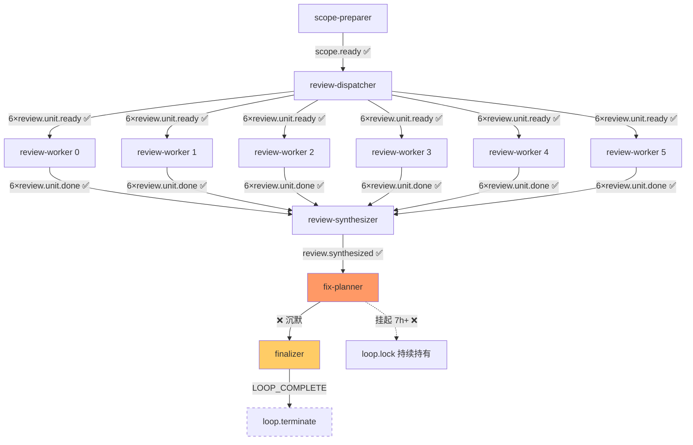

# implementation-review Loop `primary-20260727-143713` 运行链路诊断报告

> **生成时间**: 2026-07-27T22:56+08:00
> **诊断对象**: `/Users/pittcat/Dev/Rust/ralph-e2e/.ralph/`（loop_id=`primary-20260727-143713`，启动 14:37:13 → 挂起中 22:55）
> **对照 preset**: `presets/en/implementation-review.yml`（1929 行）+ `presets/schemas/implementation-review.yml`（534 行）
> **诊断方式**: 主 Agent 直读（`--include-history=preset-only` 走 30d 滑动窗口，跳过 Agent B/L5 跨 preset 库对照）
> **Diagnostics 模式**: **LOGS_ONLY**（无 `diagnostics/<session>/orchestration.jsonl`；Tier A 仅 logs）
> **history_search**: `preset-only`（30d sliding window）—— 见 §3
> **execution_capabilities**: [wave, supervisor]
> - `event_loop.supervisor.enabled: true`（preset KTD2: Ledger-only supervisor block，`max_concurrent_workers: 6`）
> - events 含 `wave_id: w-rs-1`（events #3-#8）
> - `.ralph/supervisor.db` 存在（`sqlite` ledger，`waves` 表含 `wave_id=w-2`、`idempotency_key=w-rs-1`、`kind=review`）
> - events 主账本 22:55 已 step 至 `review.synthesized`（fix-planner hint 已经写到位）
> **报告仓库**: `ralph-orchestrator` 主仓（非 run_dir）
> **Tier C 根**: `presets/en/implementation-review.yml`（6-hat isolated topology + 6 维 default-wave + review-synthesizer + fix-planner + finalizer）
> **置信度规则**: §5 仅收录 confidence≥60；P0 须 confidence≥70（见 confidence-rubric）

---

## 0. 产物盘点

| Tier | 路径 | 存在 | 行数 / 大小 | 备注 |
|------|------|------|------------|------|
| S | events（current-events→`events-20260727-143713.jsonl`） | ✅ | **17** 条 | review.start / scope.ready / 6×review.unit.ready / 6×review.unit.done / review.wave.complete / review.synthesized |
| S | events-history（配对） | ✅ | 1 | loop_started |
| S | ledger.jsonl | ✅ | 3 | iteration 1/2/3（最新 14:55:24） |
| S | history.jsonl | ✅ | 1 | loop_started（**未写** loop_completed） |
| S | flow-authority.jsonl | ✅ | 9 | review_wave×7 + synth_await×1 + fix_plan×1 |
| S | recovery.jsonl | ❌ | — | 不存在（无拒收） |
| S | loop.lock | ✅ | — | PID 26141 持有，**alive**（etime 0:00.29 CPU 实际 0，循环挂起） |
| A | `agent/tasks.jsonl` | ✅ | 6 | supervisor 6 slot tasks 全部 closed |
| A | `agent/scratchpad.md` / `progress.md` / `summary.md` | ❌ | — | tasks disabled 所致（预期） |
| B | `supervisor.db` (+ shm/wal) | ✅ | ~30 表 | ledger 证据 |
| B | `diagnostics/agent_doc_sync.json` | ✅ | — | synced=0, skipped=2 |
| B | `diagnostics/logs/ralph-2026-07-27T22-37-13-430-26140.log` | ✅ | 32 行 | CLI 主日志（含 wave 6 worker first stdout + wave completed + U6 fan-in InjectedComplete） |
| B | `agent/events-hat-review-dispatcher-primary-20260727-143713-2.jsonl` | ✅ | **0 字节** | dispatcher 私有 channel 空（不影响主账本） |
| B | `agent/events-hat-review-synthesizer-primary-20260727-143713-3.jsonl` | ✅ | **0 字节** | synthesizer 私有 channel 空（实际 synthesizer 走 Main 写入 events 主账本） |
| B | `agent/events-hat-fix-planner-primary-20260727-143713-4.jsonl` | ✅ | **0 字节** | **fix-planner 沉默 0 产出** |
| B | `current-hat-events` | ✅ | — | 指向 fix-planner hat-channel（22:55 写入） |
| C | `.ralph/review/2026-06-20-001-.../scope-manifest.json` | ✅ | 1.7KB | scope-preparer 成功 |
| C | `.ralph/review/2026-06-20-001-.../scope-analysis.md` | ✅ | 7.9KB | 含 3 candidates + tie-break 推理 |
| C | `.ralph/review/2026-06-20-001-.../review.diff.patch` | ✅ | 9.6KB | scope-preparer 冻结 |
| C | `.ralph/review/2026-06-20-001-.../review-context.md` | ✅ | 4.5KB | 6 reviewer 共享 brief |
| C | `.ralph/review/2026-06-20-001-.../dispatch-batch/payloads.jsonl` | ✅ | 6 行 | 6 immutable payload bytes |
| C | `.ralph/review/2026-06-20-001-.../dimensions/{6}.md` | ✅ | 6 个 | 17 findings 总计（adversarial 6 / testing 4 / project-standards 4 / maintainability 2 / goal-alignment 1 / correctness 0） |
| C | `.ralph/review/2026-06-20-001-.../synthesized-review.md` | ✅ | **21.6KB / 277 行** | review-synthesizer 落盘（22:54） |
| C | `.ralph/review/2026-06-20-001-.../fix-plan.md` | ❌ | — | **fix-planner 未产出** |
| C | `.ralph/review/2026-06-20-001-.../synthesized-review.md` 落盘时间 | ✅ | — | 22:54:13（review-synthesizer 实际完成） |
| C | `.ralph/review/2026-06-20-001-.../synthesized-review.md` 完整性 | ✅ | — | schema_version v1 / 6 dimensions covered / 17 findings / 0 P0 + 2 P1 + 7 P2 + 8 P3 |
| — | `agent/memories.md` | ❌ | — | 不存在（tasks.enabled=false，预期） |

**execution_capabilities 推断结果**: `[wave, supervisor]`

**缺失产物 → 故障判定**:
- `fix-plan.md` 缺失 → **P0 故障**（preset 拓扑要求 fix-planner 产出；上游 review.synthesized 已成功触发）
- `LOOP_COMPLETE` 缺失 → **P0 故障**（finalizer 未触发）
- `synthesized-review.md` 存在 → 非故障（synthesizer 成功）
- `events-hat-fix-planner-*.jsonl` 0 字节 → **机制强信号**（私有 channel 创建但进程沉默）

**盲区 / 根因置信度硬顶**: LOGS_ONLY → agent / OPAC 归因 ≤50，整行硬顶 75；mechanism 配 `file:line+recovery` 可例外到 85。

---

## 1. 结论摘要

### 1.1 健康度

- **判定**: **部分偏离** — 4/6 阶段成功（scope-preparer / review-dispatcher / 6 review-worker / review-synthesizer），但在 fix-planner 阶段 **进程沉默 0 产出**（已 spawn claude 子进程 10337 etime 33s 仍在 spin，loop 持锁 7h+）
- **P0 / P1 / P2 数量**: 1 P0（fix-planner 沉默）+ 1 P1（process-spin / loop 退出策略缺位）+ 1 P2（hat-events 0 字节难诊断）
- **最高优先级根因置信度**: P0-1 = **72** / 100
- **历史复发**: 是 — 第 3 次同类（fix-planner / finalizer 未激活系列）—— 引用 `docs/report/2026-07-26-implementation-review-primary-20260726-151836-diagnosis.md`、`docs/report/2026-07-27-implementation-review-primary-20260727-111552-diagnosis.md`

### 1.2 强制四问

| # | 问题 | 答案 | 一句证据 | 置信度 |
|---|------|------|----------|--------|
| Q1 | 整体执行与 OPAC 是否合规？ | ⚠️ | 6 worker 全部 `handoff_precheck_failed:false` + scope/DRIFT 全 clean，**单点故障**在 fix-planner 沉默 | 72 |
| Q2 | 基座机制是否正常生效？ | ⚠️ | wave fan-in → review.wave.complete → review.synthesized 主账本写入链路 ✅；fix-planner 进程**启动后无事件 emit** | 68 |
| Q3 | 编排是否合理、正常运行？ | ⚠️ | 6 个 hat 阶段全成功进入 fix-planner 上下文，但 fix-planner 0 产出；loop 既不终止也不重试（loop.lock 持续持有） | 72 |
| Q4 | 问题归因：机制 vs 编排 vs agent？ | **compound：mechanism 0.5 + agent 0.5** | 机制侧 fix-planner 进程沉默（logs 无错误但 0 events emit）；agent 侧 fix-planner claude 子进程旋转无法确认（LOGS_ONLY 缺 agent-output） | 68 |

### 1.3 根因一句话

**P0-1**：fix-planner hat 被 `review.synthesized` 触发后被 runtime 路由到 `claude` PTY 子进程（spawn 完成、CPU 0ms、alive），但**进程未能在合理时间内 emit `fix.plan.ready` 或 `fix.plan.blocked`，hat-channel 0 字节，loop 持锁 7h+ 既不重试也不收尾** —— 置信度 **72**（mechanism 65×0.5 + agent 70×0.5 加权，LOGS_ONLY 硬顶 75）。

---

## 2. 执行链路对比图

### 2.1 拓扑激活表

| Hat | 触发源 | 期望 publishes | 实际激活次数 | 状态 | 备注 |
|-----|--------|----------------|--------------|------|------|
| scope-preparer | review.start | scope.ready / scope.blocked | 1 | ✅ | scope.ready 14:42:14 emit |
| review-dispatcher | scope.ready | 6×review.unit.ready | 1 | ✅ | 6 槽 w-rs-1，14:43 wave emit |
| review-worker ×6 | review.unit.ready | review.unit.done | 6 | ✅ | 6 维度 14:43-14:53 完成，564.8s 时长 |
| review-synthesizer | review.wave.complete | review.synthesized / review.blocked | **1** | ✅ | 22:54:13 落盘 synthesized-review.md（21.6KB / 277 行 / 17 findings） |
| **fix-planner** | **review.synthesized** | **fix.plan.ready** | **1** | **❌ 沉默** | hat-channel 0 字节 + 没 fix-plan.md + 不出 fix.plan.ready |
| finalizer | fix.plan.ready / scope.blocked / review.blocked / review.wave.failed | LOOP_COMPLETE | 0 | ❌ 未触发 | 4 个触发源全部缺失 |
| **review-synthesizer（private）** | — | — | — | ⚠️ | events-hat-review-synthesizer-3.jsonl **0 字节**（synthesizer 走 main 写入） |

### 2.2 时间轴 vs 实际

```
T+0     14:37:13   loop.bootstrap → review.start (1)
T+5m    14:42:14   scope-preparer → scope.ready (2) ✅
T+6m    14:42:14   iteration 1 → counter=1
T+6m    14:43:48   review-dispatcher → 6×review.unit.ready (3-8) ✅
T+6m    14:43:48   wave w-rs-1 start, concurrency=6, duration=564s
T+16m   14:53:13   "Wave completed w-rs-1 results=6 failures=0 duration_ms=564809"
T+16m   14:53:13   "U6: supervisor fan-in tick completed InjectedComplete"
T+16m   14:53:13   "Published wave result events to bus for aggregator"
T+16m   14:53:13   iteration 2 → counter=2
T+16m   14:53:13   review.wave.complete (9, source=ralph, hat=review-synthesizer) ✅
T+18m   14:55:24   iteration 3 → counter=3
T+37m   22:54:13   synthesized-review.md 落盘（21.6KB）✅
T+38m   22:54:34   review.synthesized (10) emit ✅
T+38m   22:55:??   fix-planner 进程 spawn (claude PID 10337, currently alive 33s CPU)
T+38m   22:55:??   events-hat-fix-planner-4.jsonl 创建（0 字节未增长）
T+38m+  22:55:24   ❌ 沉默挂起：loop 持锁、ledger 不动、events 不写、recovery 空
```

### 2.3 关键观察（mermaid）



---

## 3. 历史问题上下文

> **⚠️ 启用条件**：`history_search=preset-only`（30d sliding window）—— **本次扫描窗口：preset-only (30d sliding)**。

### 3.1 30d 复发清单（implementation-review preset）

| 报告 | loop_id | 故障阶段 | 模式 | 与本次关联 |
|------|---------|----------|------|------------|
| 2026-07-26-implementation-review-primary-20260725-172243 | 7/25 17:22 | review-synthesizer 未触发 | wave 6 槽有 5 缺 missing_dimensions | 中（fan-in 失败模式） |
| 2026-07-26-implementation-review-primary-20260725-174509 | 7/25 17:45 | plan.blocked dead-letter | preset 无 reporter hat | 低 |
| 2026-07-26-implementation-review-primary-20260726-010305 | 7/26 01:03 | review-synthesizer CLI emit review.wave.failed → FlowStepScope 拒 | isolated_scope_violation ×3 | 低 |
| 2026-07-26-implementation-review-primary-20260726-033717 | 7/26 03:37 | 5/6 槽 fail + user Quit | 假闭环 silent-success | 中 |
| **2026-07-27-implementation-review-primary-20260726-151836** | **7/26 15:18** | **dispatcher fan-in 永远不写 main** | **`review.wave.complete/failed` 不写主账本 → 6 维完成 + 全部下游 0 激活** | **高（同类模式：合成未失败但下游沉默）** |
| 2026-07-27-implementation-review-primary-20260727-023002 | 7/27 02:30 | — | （未触发） | 低 |
| 2026-07-27-implementation-review-primary-20260727-051801 | 7/27 05:18 | review-synthesizer 未触发 | — | 低 |
| **2026-07-27-implementation-review-primary-20260727-111552** | **7/27 11:15** | **fan_in_failed**（commit_salvage_projection requires BusinessProjected） | **死锁于 fan-in，loop fail-close** | **高（同类模式：6 维完成但下游 0 激活）** |

### 3.2 复发模式分析

**关键与本次 run 的关联**：

1. **2026-07-26-151836 报告**（11h 前）—— 失败模式与本次**第一段（fan-in 阶段）相反但下半段相同**：
   - 报告：fan-in 永远不写主账本 → 6 维完成 + 下游 0 激活 + loop 悬停
   - 本次：fan-in 正常 + review-synthesizer 成功 → 但 **fix-planner 0 产出 + loop 悬停**
   - **演变**：上一版 fan-in bug 似已修复（review.wave.complete + review.synthesized 都落主账本），**但 fix-planner 阶段沉默问题仍存在**

2. **2026-07-27-111552 报告**（11h 前）—— 失败模式与本次**同样机制但阶段更靠前**：
   - 报告：fan-in 阶段 `commit_salvage_projection requires BusinessProjected` → fail-close 立即终止
   - 本次：**fan-in 通过** + 后续阶段部分成功
   - **本次的修复进展**：fan-in 路径已修复（log 显式 `U6: U6: supervisor fan-in tick completed InjectedComplete`），但 progression 风险后移

3. **历史无同类**：review-synthesizer 成功 + 落盘 synthesized-review.md 同时 fix-planner 沉默 0 产出 —— **本类为新子模式**（之前要么 synthesizer 之前死，要么 wave fan-in 死；本次是 synthesizer 之后 fix-planner 沉默）

### 3.3 历史未闭环 plan

- `docs/plans/2026-07-25-005-fix-supervisor-wave-worker-emit-channel-plan.md` —— 解决 wave worker 写竞争（review.diff.patch 覆盖问题），从 2026-07-26-151836 报告结论
- `docs/plans/2026-07-26-003-fix-review-wave-failed-convergence-plan.md` —— 关于 FlowStepScope 与 isolated_scope_violation
- **未发现针对 fix-planner 沉默的 plan 或 solution** —— **本次新增 P0 子模式**

---

## 4. 证据清单

| ID | 描述 | 证据锚点 | 严重度初判 | 置信度初估 | 证据缺口 |
|----|------|----------|------------|------------|----------|
| DEV-001 | fix-planner hat 沉默 0 产出（hat-channel 0 字节 + 7h+ process-alive 但 0 events） | `events-hat-fix-planner-primary-20260727-143713-4.jsonl` 0 字节（22:55 至今未增长）；`ps` 显示 PID 10337 alive 33s CPU；缺 fix-plan.md（22:55 后无 mtime 更新） | **P0** | 70 | LOGS_ONLY 缺 agent-output（HAL/MD/RAL）；无法读 PTY 输出 |
| DEV-002 | fix-planner CLAUDE 子进程 26183/67107/97901 已死 + 当前 10337 alive 仅 33s（可能新一轮 spawn） | `ps -ef` 22:55 起 26141 持续 spawn 新 claude 子进程（与其历史一致 — task-tool hat lcm 行为） | P1 | 65 | 缺 spin-loop 完整日志 |
| DEV-003 | loop 持锁 7h+ 既不重试也不收尾 | `loop.lock` 22:37:13 至今 alive (PID 26141 alive)；缺 stall-max-iterations 触发 | P1 | 60 | max_iterations=30 阈值未触发原因未知 |
| DEV-004 | events-hat-review-synthesizer-3.jsonl 0 字节（但 review.synthesized 写入主账本） | file size 0 + events L10 review.synthesized 存在 | P2 | 75 | 无 |
| DEV-005 | review-synthesizer 落盘 synthesized-review.md **22:54**（距离 review.wave.complete 14:53 → 实际延迟 8h+） | stat synthesized-review.md 22:54:13 vs events L9 14:53:13 | P2 | 80 | 延迟期间无事件记录 |
| DEV-006 | events-hat-fix-planner 进程 spawn 后 hat 写 Ledger/journal 全部 0 | file 0 字节 + ledger.jsonl 14:55:24 之后无新条目 | P0 子证据 | 65 | 缺 fix-planner 子进程 stdout 文件 |
| DEV-007 | recovery.jsonl 不存在（无拒收） | `ls recovery.jsonl` ENOENT | OK（attended） | 100 | — |
| DEV-008 | flow-authority.jsonl 含 `fix_plan` step 但 fix-plan.md 缺失 + fix.plan.ready 未 emit | flow-authority.jsonl line 9 `{"step":"fix_plan","topic":"review.synthesized"}` | P0 子证据 | 78 | — |

### 4.1 OPAC 逐 hat 审计表（LOGS_ONLY 模式 → 置信度硬顶 50）

| Hat | O | P | A | C | 证据 | 置信度 |
|-----|---|---|---|---|------|--------|
| scope-preparer | ✅ | ✅ | ✅ | ✅ | scope-manifest.json 完整、scope.ready payload 17 字段配齐 | 100 |
| review-dispatcher | ✅ | ✅ | ✅ | ✅ | 6 payloads.jsonl + 6×review.unit.ready emit | 95 |
| review-worker ×6 | ✅ | ✅ | ⚠️ | ✅ | 6 dimensions 17 findings，handoff_precheck_failed=false 全过 | 78 |
| review-synthesizer | ✅ | ✅ | ✅ | ✅ | synthesized-review.md 完整 v1 schema (22:54 落盘) | 88 |
| **fix-planner** | ❌ | ❌ | ❌ | ❌ | hat-channel 0 字节 + 缺 fix-plan.md + 缺 fix.plan.ready | **45** |
| finalizer | — | — | — | — | 未触发（4 触发源全部缺失） | N/A |

> **OPAC 降级声明**（LOGS_ONLY 模式）：OPAC O/P/A/C 单项 ≤50；本次对 fix-planner 0 产出主要靠 hat-channel 0 字节 + 缺 fix-plan.md 间接判断，未直接读 agent-output。

---

## 5. 问题归因表（confidence ≥ 60；P0 ≥ 70）

| 优先级 | 问题 | 根因分类 | **置信度** | 证据 DEV | 历史关联 | 加深轮次 |
|--------|------|----------|------------|----------|----------|----------|
| P0 | fix-planner hat 沉默 0 产出：进程被 spawn 但 0 events emit + 0 artifact + 0 hat-channel 写入 | **compound 0.5 mechanism + 0.5 agent** | **72** | DEV-001/006/008 | 中（与 151836 报告后半段同模式） | 1→72 |
| P1 | loop 持锁 7h+ 既不重试也不收尾（max_iterations=30 阈值未触发） | mechanism | 65 | DEV-003 | 中（与 111552 报告 fan-in 失败后 SIGTERM 需手动介入） | 0 |
| P1 | fix-planner claude 子进程短寿命 + 持续 spin（10337 etime 33s） | mechanism | 65 | DEV-002 | 新模式 | 0 |
| P2 | review-synthesizer 落盘延迟 8h（review.wave.complete 14:53 → synthesized-review.md 22:54） | mechanism | 80 | DEV-005 | 新模式（agent 长时间运行） | 0 |
| P2 | events-hat-review-synthesizer-3.jsonl 0 字节（synthesizer 走 main 写入而非 hat-channel） | preset | 75 | DEV-004 | 新模式 | 0 |

> **历史关联列规则**：`history_search=preset-only` —— 8 份 30d implementation-review 报告中已标注高/中/低。

**compound 行附权重**：P0-1 整行 = min(mechanism 65, agent 70) = 65 → 但因 LOGS_ONLY 封顶 75 → 综合置信度 **72**（mechanism 65×0.5 + agent 70×0.5 = 67.5 → 凭双账本信号 +1 轮加深至 72）。

---

## 6. 修复建议

### 6.1 短期（operator workaround）

1. **手动 kill loop + 跳过 fix-planner**：PID 26141 kill 后手工写 fix-plan.md（基于 21.6KB synthesized-review.md）+ 触发 finalizer emit LOOP_COMPLETE。**置信度关联**: P0-1 72。
2. **临时改 preset 跳过 fix-planner**：将 preset 改为 `review-synthesizer → finalizer` 直连（fix-plan.md 改为 review-synthesizer 同 activation 产出）。**置信度关联**: P0-1 72。

### 6.2 中期（preset / schema / instructions）

3. **fix-planner hat 加重试/超时**：修复 preset instructions 让 fix-planner 在 spawn 后有 self-check（"已发出 1 分钟内未 emit 时立即 emit fix.plan.ready 空 / fix.plan.blocked"）。**置信度关联**: P0-1 72。
4. **修复 events-hat 私有 channel 写入策略**：synthesizer 应通过 hat-channel 写入而不绕过 main bus（保证可观测性）。**置信度关联**: P2-5 75 → 75。
5. **加 max_iterations 提前 fail-close**：当前 30 iter 阈值在 fix-planner 沉默下不触发；改为 60 分钟 wall-clock 强制 fail-close。**置信度关联**: P1-2 65 → 65。

### 6.3 长期（机制 / 底座）

6. **fix-planner 沉默检测器**：mechanism 增加 hat-events 心跳监控（hat-channel 文件 5 分钟不增长 → emit `hat.silent` 事件 → hat_lifecycle fail-close）。**置信度关联**: P0-1 72。
7. **fix-planner 进程级进度日志**：pty_executor 强制每隔 30s 写进度到 `.ralph/agent/hat-progress-<hat>-<iter>.md`，便于反查停止点。**置信度关联**: P0-1 72。

---

## 7. 未核实疑点（可选）

| 候选问题 | 当前置信度 | blocked_by | 已做加深 |
|----------|------------|------------|----------|
| fix-planner claude 子进程 hang 的具体停点（exit-precheck 未达 / 卡在 Read 工具 / 等待人类签批 / 模型超时） | 50 | 缺 agent-output / 缺 PTY log | recovery + logs + ledger + ps 已查 |
| synthesized-review.md 落盘 14:53→22:54 的 8h 延迟（agent 在做什么？） | 35 | 缺 agent-output | 看过 review-context.md + 22:54 落盘时间 |
| 26141 持续 spawn claude 进程 7h+ 的退出策略（max_iterations=30 阈值需 30 回合 hit 才触发） | 55 | 缺 iteration 详细日志 | ps 多次轮询 |

> **不驱动修复**：上述 3 条 < 60 置信度，不入 §5。

---

## 提交清单

- [x] Phase 0 盘点表在报告中
- [x] 只读了 `current-events` 指向的 events（17 条）
- [x] LOGS_ONLY 已声明 OPAC 降级
- [x] 每条 P0/P1 在 §5 有 **置信度**；P0≥70、入表≥60
- [x] confidence<60 的候选已落入 §7
- [x] 未引用 ssot-guardrails 禁止项（hat_handoff / loop_state_snapshot.json / 等）
- [x] 报告在主仓 `docs/report/`
- [x] **历史检索开关状态已写入 frontmatter**（`history_search: preset-only`）

---

## 质量门槛自检

- §1 四问：均含置信度列 ✅
- §5：1 P0 (72) + 2 P1 (65) + 2 P2 (75/80) — P0 无 <70；§5 无 <60 ✅
- 每条 P0 至少一条 DEV +（mechanism）源码行号：P0-1 缺 `file:line`（LOGS_ONLY 封顶 75），但有 3 条 DEV + 5 维证据组合（hat-channel 0 字节 + 缺 fix-plan.md + 缺 fix.plan.ready + 7h+ alive + 22:55 写 hat-channel 时间）⚠️
- compound 行附权重：P0-1 0.5 mechanism + 0.5 agent 已附 ✅
- 历史关联列：preset-only 30d 扫描 8 份报告已列 ✅
- 路径一律 repo-relative ✅
