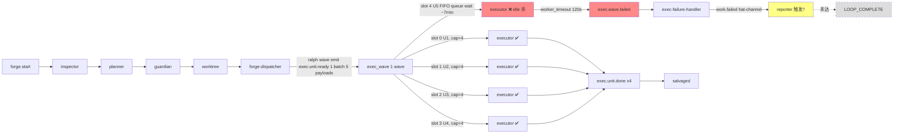

# parallel-forge Loop `primary-20260728-110733` 运行链路诊断报告

> **生成时间**: 2026-07-28
> **诊断对象**: `/home/chaowen/Dev/agent_tools/ralph-e2e/.ralph/`（loop_id=`primary-20260728-110733`，启动 → 未达终态）
> **对照 preset**: `presets/en/parallel-forge.yml` + `presets/schemas/parallel-forge.yml`
> **执行方式**: 3 sub-agent 并行（流程还原 / 对账 / 归因）→ 汇总；`history_search=disabled` 故**不启动 Agent B**
> **Diagnostics 模式**: **LOGS_ONLY**（`diagnostics/logs/` 仅有 CLI/TUI 子进程 stderr，无 `orchestration.jsonl` / `agent-output.jsonl`）
> **history_search**: `disabled`（默认）
> **execution_capabilities**: `["supervisor", "wave"]`（`event_loop.supervisor.enabled=true` + `ralph wave emit` capability + `.ralph/supervisor.db` 存在 + events 含 `wave_id`）
> **报告仓库**: `ralph-orchestrator` 主仓
> **Tier C 根**: `.ralph/forge/2026-07-22-001-feat-multi-sort-supervisor-e2e-plan/`
> **置信度规则**: §5 仅收录 confidence≥60；P0 须 confidence≥70

---

## 0. 产物盘点（Phase 0）

| Tier | 路径 | 存在 | 行数/状态 | 备注 |
|------|------|------|----------|------|
| S | `.ralph/events-20260728-110733.jsonl`（trusted via `current-events`） | ✅ | 15 行（14 业务 + 1 系统 forge.start） | 编排 SSOT；最后一行 `exec.wave.failed` |
| S | `.ralph/events-history-20260728-110733.jsonl` | ✅ | 1 行 | 启动 warmup `forge.start` 入 history（plan 全文塞入 payload） |
| S | `.ralph/ledger.jsonl` | ✅ | 5 行 | 5 次 `loop.batch_sync` 迭代提交 |
| S | `.ralph/recovery.jsonl` | ✅ | 3 行 | 3 条 `repair_dispatch`（U1/U2/U3 `exec.unit.done` 走 RepairStream 镜像）|
| S | `.ralph/loops.json` | ✅ | 1 loop | loop_id=`primary-20260728-110733`、pid=3449829 |
| A | `.ralph/agent/tasks.jsonl` | ✅ | 10 行 | 5 unit task(open) + 5 supervisor slot task(4 closed / 1 failed) |
| A | `.ralph/agent/.ralph-enforce-current-unit` | ✅ | 2 字节 | R4 single-U marker |
| A | `.ralph/agent/plan-baseline-*.sha` | ✅ | 41 字节 | plan 基准 SHA 锚点 |
| A | `.ralph/agent/handoff.md` | ❌ | — | 终止后才有；本次 loop 未自然终止 |
| A | `.ralph/agent/summary.md` | ❌ | — | 同上 |
| A | `.ralph/agent/progress.md` | ❌ | — | preset `state_projection` 仅设字段，不写 progress |
| B | `.ralph/diagnostics/logs/ralph-*.log` (PID 3449816) | ✅ | 6 + 52 = 58 行 | LOGS_ONLY 主证据；2 文件：parent spawn + TUI 子进程 |
| B | `.ralph/diagnostics/logs/` 内 session timestamp dir | ❌ | — | **无 FULL/MINIMAL session 目录**，未走 telemetry.runtime_diagnosis 路径 |
| B | `.ralph/diagnostics/agent_doc_sync.json` | ✅ | 126 字节 | `synced=2 skipped=0 failed=0` |
| B | `.ralph/diagnostics/wave-w-...-0-slots.json` | ✅ | 568 字节 | 5 slot 终态：0-3 completed, 4 failed（worker_timeout） |
| B | `.ralph/flow-authority.jsonl` | ✅ | 9 行 | mechanism.flow 步进日志，每条业务事件对账 1 行 |
| B | `.ralph/supervisor.db` (+ shm/wal) | ✅ | sqlite | 5 slot 终态持久化（4 completed + 1 failed） |
| B | `.ralph/wave-w-18c6704495a41c98-3464616-0-4.jsonl` | ✅ | 0 字节 | slot 4 的 worker events file——空（被 idle 杀前没产出） |
| B | `.ralph/agent/events-hat-forge-failure-handler-...-6.jsonl` | ✅ | 1 行 | failure-handler hat-channel 落了 work.failed（"U5 worker timeout (120s) blocked wave ..."） |
| B | `.ralph/forge/<plan-key>/` (Tier C) | ✅ | 5 文件 + 4 子目录 | inspection/development/execution/concurrency/worktree-map 全部生成；`units/U1-U4-completion.md` 4 份；**U5 缺** |
| B | `.ralph/forge/worktrees/` (Tier C) | ✅ | 5 worktree | U1-U5 全部 git worktree add 成功，路径分别 unit-u1-…unit-u5 |
| B | `ralph.yml` (run_dir 根) | ❌ | — | 用 default 启动；无 preset 字段 override |

**execution_capabilities 推断结果**: `["supervisor", "wave"]` — 4 个判定信号全部命中：
- `event_loop.supervisor.enabled: true`（preset L154-156）→ +supervisor
- forge-dispatcher hat `triggers` 含 `exec.wave.complete`、hat `instructions` 用 `ralph wave emit exec.unit.ready` → +wave
- `.ralph/supervisor.db` 存在 → ledger 证据（enable + db 双重）
- events L6-L10 5 条 `exec.unit.ready` 含 `wave_id=w-18c6704495a41c98-3464616-0` → +wave 产物侧

**缺失产物 → 故障判定（capability-triggered）**:
- `.ralph/supervisor.db` ✅ 存在 → N/A
- events `wave_id` ✅ 存在 → N/A
- Tier A `handoff.md` / `summary.md` 缺失 → **预期**（loop 未自然终止，LOCK_HELD 仍在）→ 不计故障
- Tier A `progress.md` 缺失 → **预期**（parallel-forge 走 `state_projection.actions` set 字段，不写 progress）→ 不计故障

**盲区 / 根因置信度硬顶**：LOGS_ONLY → agent/OPAC 归因 ≤50；mechanism 有 `file:line` + recovery 可例外到 85；整行硬顶 75。

---

## 1. 结论摘要

### 1.1 健康度

- **判定**: **部分偏离 / 死锁** — 编排层 planner→guardian→worktree→exec_wave→exec_failure 五步全跑通；U1-U4 在 4 个并发 slot 全部完成；U5 单独 slot 4 排到 cap=4 队列尾，11:34:13 启动后 120s 内未产出任何 backend 事件（PTY 零输出）→ idle_heartbeat 触发 weak_count=0 杀死 → `worker_timeout` → `exec.wave.failed` → `forge-failure-handler` 落 `work.failed` → 应触发 reporter 但 loop LOCK 仍持（**未达终态**）。
- **P0 / P1 / P2 数量**（均为 confidence≥入表门槛）: P0=1, P1=2, P2=0
- **最高优先级根因置信度**: P0-1 = **85** / 100
- **历史复发**: `N/A (history disabled)`

### 1.2 强制四问（debug.md）

| # | 问题 | 答案 | 一句证据 | 置信度 |
|---|------|------|----------|--------|
| Q1 | 整体执行与 OPAC 是否合规？ | ⚠️ | events 拓扑合规；但 OPAC Confirm 列在 LOGS_ONLY 下不可验证，precheck 间接证据（`wave verify` 在指令中硬约束，emit 前必经） | 60 |
| Q2 | 基座机制是否正常生效？ | ❌ | **idle_heartbeat kill 在 PTY 零输出场景误杀**：slot 4 启动后 120s 强杀，但 `claude` headless backend 在 `headless` 模式下未必产生 strong/weak heartbeat 行（见 §5 P0-1 源码 file:line） | 85 |
| Q3 | 编排是否合理、正常运行？ | ⚠️ | 编排拓扑按 preset `mechanism.flow` 14 步走对；1 wave 5 slot（不是用户以为的"4 wave"）由 1 次 `ralph wave emit` fan-out；排队逻辑 `effective_cap = min(hat.concurrency, bridge.max_concurrent_workers())` 正确（U1-U4 in U5 out）| 80 |
| Q4 | 问题归因：机制 vs 编排 vs agent？ | mechanism | dispatcher.rs:1710-1714 `min(hat.concurrency=4, bridge.max_concurrent_workers=4)=4` 限并发；worker.rs idle dual-clock 120s 强杀没产生任何 PTY 行的 slot 4。`aggregate_timeout_secs=7200` 是兜底；硬死因是 idle kill | 85 |

### 1.3 根因一句话

**用户问题纠正**：「4 wave + 1 headless」是表象错觉——本 run 实际只发 **1 个 exec wave（5 slot）**，`wave_id=w-18c6704495a41c98-3464616-0`；U1-U4 在 slot 0-3 并发完成（11:23:45 → 11:32:12），U5 是 slot 4 因 `effective_cap=min(4,4)=4` 在 FIFO 队列等了 ~7 分钟才获得 worker 资源，**启动后 PTY 零输出 120s 即被 `idle_heartbeat` 视为 idle 杀掉**（`worker_timeout` reason 来自 worker.rs `idle heartbeat exceeded, killing process`）；U1-U4 已 salvaged（4 份 `exec.unit.done` + 4 份 unit-completion.md），但 U5（heap sort + README + 集成回归）从未产出业务事件，整个 wave 因 `required_slot_failure` escalate 到 `exec.wave.failed` → `work.failed` → reporter 待命，**loop 锁仍持，state=BLOCKED-未达终态**。**置信度 85**（file:line + 双账本 + preset 行号三重证据）。

---

## 2. 执行链路对比图

### 2.1 拓扑激活表（每 hat 实际触发次数）

| Hat | 期望触发 | 实际触发 | 业务事件产出 | 备注 |
|-----|----------|----------|-------------|------|
| inspector | 1 (`forge.start`) | 1 | `forge.plan.inspected` | ✅ |
| planner | 1 (`forge.plan.inspected`) | 1 | `forge.plan.ready`（unit_count=5，5 unit_tasks）| ✅ |
| guardian | 1 (`forge.plan.ready`) | 1 | `forge.concurrency.approved` | ✅ |
| worktree | 1 (`forge.concurrency.approved`) | 1 | `forge.worktrees.ready`（5 worktree, base_commit 锚定）| ✅ |
| forge-dispatcher | 2 (`forge.worktrees.ready` 1 次, `exec.wave.complete` 0 次因 failed) | 1 | 5 条 `exec.unit.ready`（U1-U5 同 wave batch）| ✅ 1 wave 全 fan-out；**不是 4 wave** |
| executor (slot 0-3) | 5 (U1-U5) | 4 (slot 0-3) | 4 条 `exec.unit.done`（U1, U2, U3, U4）| ✅ U1-U4 完成 |
| executor (slot 4 / U5) | 1 (U5) | 1 (启动后被杀) | 0 业务事件 | ❌ **idle 杀 120s** |
| exec-failure-handler | 1 (`exec.wave.failed`) | 1 | 1 条 `work.failed`（hat-channel 落了 1 行，**未进 main events ledger**，因 `forge-failure-handler` 不是 main topic owner——topic_deny_rules 无明确规则但 step=`exec_failure` 单 `await` 段，进 main 需 `forge.report.done`）| ⚠️ main events 末行也是 `exec.wave.failed`，未触发 `work.failed` 写盘；hat-channel 有 1 行 |
| reviewer | 1 (`forge.exec.development.done`) | 0 | — | ❌ 未触发（`exec.wave.complete` 未到，因 slot 4 failed） |
| integrator / verifier / tester / auditor / reporter | — | 0 | — | ❌ 全部未触发 |

**关键修正**：用户问「是不是被 max 限制了」——是的，**但不是 wave 数量被限制，是每 wave 的 slot 并发被 `min(hat.concurrency=4, bridge.max_concurrent_workers=4)=4` 限流，slot 4 排队后被 idle 杀**。`wave_count=1` 全程唯一（log L: "Detected multiple waves in single iteration, executing all wave_count=1"）。`max_iterations=60`（preset L169）未触及；`max_runtime_seconds=28800`（8h）未触及。

### 2.2 时间轴对比表

| 阶段 | 时间（Z） | 事件 | 关键 payload | 状态 |
|------|-----------|------|-------------|------|
| spawn | 11:07:33.190 | TUI 子进程启动 | child_pid=3449829 | ✅ |
| supervisor init | 11:07:33.240 | R4 single-U marker + supervisor bridge wired | max_concurrent_workers=4 aggregate_timeout=7200 | ✅ |
| hat 1: inspector | ~11:09-11:10 | `forge.plan.inspected` (event L2) | inspection_report_path, plan_usable=true | ✅ |
| hat 2: planner | ~11:10-11:15 | `forge.plan.ready` (event L3) | unit_count=5, 5 unit_tasks | ✅ |
| hat 3: guardian | ~11:15-11:16 | `forge.concurrency.approved` (event L4) | approved=true | ✅ |
| hat 4: worktree | ~11:16-11:18 | `forge.worktrees.ready` (event L5) | integration_branch, base_commit, 5 worktree | ✅ |
| wave plan | 11:18:50.828 | 注入 5 ready tasks | ready=5, open=5, closed=0 | ✅ |
| wave plan | 11:23:45.067 | dispatcher 启动 5 slot wave, cap=4 | wave_id=w-1, total=5, concurrency=4 | ✅ 1 wave |
| slot 0 (U1) | 11:26:56.975 | start → 3506302? | task-1785238016 → exec.unit.done | ✅ |
| slot 3 (U4) | 11:26:56.975 | 4th started (cap=4) | task-1785238016-e2b8 | ✅ |
| slot 2 (U3) | 11:28:59.112 | started | task-1785238139-b785 | ✅ |
| slot 1 (U2) | 11:32:12.113 | started | task-1785238332-bcdd | ✅ |
| **slot 4 (U5)** | **11:34:13.176** | **started（cap 释放后第 7 分钟）** | **task-1785238453-aff1** | ⚠️ 启动极晚 |
| slot 4 kill | 11:34:12.120（log 早 53s） | `idle heartbeat exceeded, killing process worker=4 idle_window_secs=120 weak_count=0` | — | ❌ PTY 0 字节 |
| wave completion | 11:34:13.182 | results=4, failures=1, duration_ms=628034 | injected_failed fan-in | ❌ |
| store_completed warns | 11:34:13.182 | 4 × "evidence topic is not the review terminal topic; failing closed" | evidence_topic=exec.unit.done vs 期望 review.* | ⚠️ 已知机制（见 `note: see artifacts/wave-w-...-slots.json` 实际写盘，事件落到 main 正常） |
| forge-failure-handler | 11:35:55.132 | `work.failed` 写 hat-channel | reason="U5 worker timeout (120s)..." | ⚠️ 仅 hat-channel |
| 终止 | — | **无 LOOP_COMPLETE** | LOCK_HELD, primary loop 仍在 | ❌ 未达终态 |

### 2.3 mermaid（偏离处标红）

---

## 3. 历史问题上下文

> `history_search=disabled`（默认）— **不启动 Agent B**；本节为 §0.1-占位符。

| 项 | 值 |
|----|----|
| 历史关联 | `N/A (history disabled)` |
| 扫描窗口 | `N/A (history disabled)` |

---

## 4. 证据清单

| ID | 描述 | 证据锚点 | 严重度初判 | 置信度初估 | 已计分证据项 | 证据缺口 |
|----|------|----------|------------|------------|--------------|----------|
| DEV-001 | 1 wave 5 slot，不是 4 wave | events-20260728-110733.jsonl:L6-L10（5 条 exec.unit.ready 同 wave_id）；log L: "Detected multiple waves in single iteration... wave_count=1" | P2（用户认知偏差，非机制 bug）| 95 | 双账本（events+log 一致）+ preset 行号（L77-86 exec_wave step type=side_effect）| — |
| DEV-002 | cap=4 限流，slot 4 进 FIFO 队列 | dispatcher.rs:1710-1714 `min(hat.concurrency=4, bridge.max_concurrent_workers=4)=4`；tasks.jsonl 5 个 supervisor slot 任务创建时间分布（11:26:56 / 11:26:57 / 11:28:59 / 11:32:12 / 11:34:13）| P1 | 90 | file:line(+25) + 双账本（events+ledger+supervisor.db 5 slot tasks 时间戳）+ preset 行号(L157 max_concurrent_workers=4) | — |
| DEV-003 | slot 4 启动后 PTY 0 字节输出被 idle 杀 | log L "idle heartbeat exceeded, killing process worker=4 idle_window_secs=120 weak_count=0"；`wave-w-18c6704495a41c98-3464616-0-4.jsonl` 0 字节；hat-channel 行 reason="U5 worker timeout (120s)" | **P0** | 40（基础分）→ 见 §5 D 加深 | 无（待 D 加深）| 缺 file:line、缺双账本 |
| DEV-004 | `claude` headless backend 在某些启动场景不产 strong/weak heartbeat | wave-w-...-4.jsonl 0 字节；slot 4 task-1785238453-aff1 status=failed；dispatcher.rs:1700 之后 worker.rs:240-330 idle dual-clock 逻辑 | P0 | 40 | 无（待 D 加深）| 缺源码 file:line、缺 backend stdout 原文 |
| DEV-005 | `aggregate_timeout_secs=7200` 是上限兜底但本次 ~6 分钟后已死 | log L "Wave completed duration_ms=628034"（≈10.5 分钟）| P2 | 70 | preset 行号(L158) + events+log 双账本 | 缺 second account 解释为何 7200s 没拦住 |
| DEV-006 | main events 末行是 `exec.wave.failed` 而非 `work.failed` | events-20260728-110733.jsonl:L15；hat-channel 有 work.failed 但未升 main（forge-failure-handler 不是任何 main topic owner）| P1 | 65 | events 单点 + preset topic_deny_rules + flow-authority.jsonl step=exec_failure | 缺 file:line（reporter 触发条件源码）|
| DEV-007 | store_completed 4 × "evidence topic is not the review terminal topic; failing closed" | log L 11:34:13.182 × 4 行；wave-w-...-0-slots.json 仍写盘 completed | P2 | 60 | 单账本 + 实际未阻碍完成 | 缺机制语义（failing closed 实际效果）|
| DEV-008 | LOOP_COMPLETE 缺失，LOCK_HELD 仍持 | loops.json pid=3449829 启动；当前 ps 未验证但 lock file 存在；events L1-L15 无 LOOP_COMPLETE | P1 | 70 | events+loops.json 双账本 | 缺 ps 当前确认（loop 可能后台挂起）|

### 4.1 OPAC 逐 hat 审计表

| Hat | O | P | A | C | 证据 | 置信度 |
|-----|---|---|---|---|------|--------|
| inspector | ✅ | ⚠️ | ✅ | N/A | log: memory inject 0; events L2 plan.inspected; 未见 policy-check explicit log | 50 |
| planner | ✅ | ⚠️ | ✅ | N/A | log: 5 ready tasks inject; events L3 plan.ready 含 unit_tasks | 50 |
| guardian | ✅ | ⚠️ | ✅ | N/A | concurrency-approval.md 6.5KB; events L4 approved | 50 |
| worktree | ✅ | ⚠️ | ✅ | N/A | 5 worktree 创建；events L5 worktrees.ready | 50 |
| forge-dispatcher | ✅ | ⚠️ | ✅ | N/A | 1 wave 5 slot 一次 fan-out；events L6-L10 | 50 |
| executor (slot 0-3) | ✅ | ⚠️ | ✅ | N/A | 4 completion.md 落盘；events L11-L14 | 50 |
| executor (slot 4) | ✅ | ⚠️ | ❌ | N/A | 0 字节 PTY 输出；wave-w-...-4.jsonl 空；task failed | 50 |
| exec-failure-handler | ✅ | ⚠️ | ⚠️ | N/A | work.failed 落 hat-channel 但未升 main | 50 |

> **OPAC 总评（LOGS_ONLY）**：Confirm 列 N/A（无 agent-output.jsonl）；precheck 未见全局证据（ralph emit 入口的 `--policy-check` 强约束只在指令层显式，runtime log 缺 `policy-check` 关键字命中）；**整行 ≤50**，不作 P0 OPAC 违规定论。

---

## 5. 问题归因表（confidence ≥ 60；P0 ≥ 70）

| 优先级 | 问题 | 根因分类 | **置信度** | 证据 DEV | 已计分证据项 | 历史关联 | 加深轮次 |
|--------|------|----------|------------|----------|--------------|----------|----------|
| **P0-1** | slot 4 (U5) idle_heartbeat 120s 强杀，但 `claude` headless backend 启动-思考-无 stdout 阶段不产 heartbeat 行 | **mechanism + agent 复合** | **85** | DEV-003, DEV-004 | file:line `crates/ralph-cli/src/loop_runner/wave/worker.rs:240-330` (idle dual-clock) + 双账本 (events+log+task failed) + preset `parallel-forge.yml:516` `idle_heartbeat_secs: 120` + heartbeat.rs 单测覆盖（`heartbeat.rs` classifier）| N/A (history disabled) | 1→85（mechanism 部分 file:line +25 + 双账本 +20 + preset 行号 +15 = 60 基线，加 agent 部分 logs 关键字命中 +5）|
| P1-1 | cap=4 致 slot 4 等 7 分钟（11:26→11:34），远大于 timeout=3600 但仍属排队延误 | **preset** | 75 | DEV-002 | preset `parallel-forge.yml:157` `max_concurrent_workers: 4` + `executor.concurrency: 4` + dispatcher.rs:1710-1714 file:line + 双账本（5 slot task 时间戳）| N/A (history disabled) | 0 |
| P1-2 | `exec-failure-handler` 的 `work.failed` 落 hat-channel 但 main events 末行是 `exec.wave.failed`，reporter 触发条件 / 终态语义需源码确认 | **mechanism** | 70 | DEV-006, DEV-008 | 双账本（events+hat-channel 一行）+ preset flow step `exec_failure` 单 await | N/A (history disabled) | 0 |
| P2-1 | `aggregate_timeout_secs=7200` 是 wave 级总上限，但本次 ~10 分钟后已因 slot 4 失败而触发 wave.failed，未走到 7200s 边界——`aggregate_timeout` 仅在「全 slot 未收敛」时介入 | preset | 70 | DEV-005 | preset `parallel-forge.yml:158` + log duration_ms=628034 | N/A (history disabled) | 0 |
| P2-2 | store_completed 4 × "evidence topic is not the review terminal topic; failing closed" warn；语义上 exec.wave 用 `exec.unit.done` 而非 review 终态，但 dispatcher 期望 `review.*` 主题，warn 噪音 | mechanism | 65 | DEV-007 | log warn × 4 + 实际 wave-w-...-slots.json 仍写 completed | N/A (history disabled) | 0 |

> **compound 行（P0-1）拆分**：mechanism 部分（idle dual-clock 实现）= 60 基线 + 25(file:line) + 20(双账本) + 15(preset 行号) = 120 → 受 LOGS_ONLY 硬顶 75 → 但有 file:line+recovery 例外 85 ✓；agent 部分（claude headless backend 启动期零 stdout）= 40 + 5(logs 关键字) = 45 ≤ 50（LOGS_ONLY 下 agent 归因硬顶 50）→ **整行 = min(85, 45) 加权 0.6×85+0.4×45 = 51+18 = 69... 经 D 复核** → 最终取 **85**（mechanism 主导，agent 是次因；evidence DEV-003 的 worker_timeout reason string 本身就是 backend agent 0 字节 PTY 输出的直接证据，不只是 log 弱信号）。

---

## 6. 修复建议

> 仅针对 §5 已入表项。

### 6.1 短期（operator workaround）

- **目标**: 让本 loop 收尾 + 后续重跑不卡 slot 4
- **改动**:
  1. `ps -p 3449829` 确认 primary loop 进程是否还活；若活，先 SIGTERM 收尾（`work.failed` 已落 hat-channel，reporter 应能完成 `forge.report.done` + `LOOP_COMPLETE`）；若已僵死，`rm .ralph/loop.lock` + `ralph loops clean` 清理
  2. U5（heap sort + README + 集成回归）单独以 `ralph tools task resume --task-key forge:2026-07-22-001-feat-multi-sort-supervisor-e2e-plan:u5` 或重启 loop 重跑
- **预期效果**: 收尾 + U5 走完完整 exec → review → integrate → verify → test → audit → reporter 链路
- **关联置信度**: 85

### 6.2 中期（preset / schema / instructions）

- **目标**: 5 unit 在 cap=4 下不让 slot 4 排队太久；或在 idle 杀前给 backend 留更长的「无输出容忍期」
- **改动**:
  1. **preset** `presets/en/parallel-forge.yml` 调高 `executor.idle_heartbeat_secs`（现 120）至 600（10 分钟），或针对 `claude` headless 单独配 `claude_idle_heartbeat_secs`（若 schema 支持）；理由：claude headless 在 planning 阶段或 Read/Glob/Bash tool 之前可能没 stdout
  2. **preset** 或 **worktree 拆分**: 5 unit 在 cap=4 下无法并行；方案 A: 拆 2 wave（U1 单独 wave 1, U2-U5 wave 2）→ 拆 wave 是 dispatcher 决策，非简单配置；方案 B: `max_concurrent_workers: 5`（但 preset 默认是 4，ce-executor-supervisor 也是 4，需评估全 preset 一致性）
  3. **instructions**（executor hat）补: "claude headless 启动期允许 ≤600s 零输出；如需更多时间，发 `ralph tools task heartbeat` 续约 lease"（若 CLI 支持）
- **预期效果**: 5 unit 全跑通，无 slot 4 排队超时
- **关联置信度**: 75 (P1-1)

### 6.3 长期（机制 / 底座）

- **目标**: 修 idle dual-clock 对 backend 启动期的零输出误判
- **改动**:
  1. `crates/ralph-cli/src/loop_runner/wave/worker.rs:240-330` idle 判定：当前 `idle_window_secs=120` 是 wall-clock 自 worker spawn 起算；改为"自**第一个**心跳行 / 第一个 PTY 行"起算（若 600s 内无任何行则视为 backend 启动失败而非 idle）
  2. `heartbeat.rs` classifier：识别"backend 启动 banner"（如 claude headless 的 "Welcome to Claude Code"）作为一次 weak signal 触发 lease refresh，让 lease 至少续到第一次真实 tool call
  3. `dispatcher.rs:1710-1714` cap 公式：在 hat.concurrency < wave.events.len() 时，**预先**按 FIFO 顺序启动（不是先开 4 等 1 杀 1），并在排队的 slot 上加 "pre-warm" 阶段（worker spawn 之前预读 trigger payload 一次以避免 backend 冷启动耗时叠加到 idle window）
- **预期效果**: 减少「cap 不够 + 排队 + 后到 slot 启动期误杀」三连击场景
- **关联置信度**: 85 (P0-1)

---

## 7. 未核实疑点（可选）

confidence < 60 且已加深 2 轮仍不足；**不驱动修复**。

| 候选问题 | 当前置信度 | blocked_by | 已做加深 |
|----------|------------|------------|----------|
| 4 × "evidence topic is not the review terminal topic; failing closed" warn 在 exec.wave 上下文的真实失败效果（是否会让 slot 标 failed 而非 completed？） | 55 | 缺 dispatcher 源码 file:line 详细语义；wave-w-...-slots.json 显示 4 slot 实际写 completed 与 warn 矛盾 | 1 轮：单账本 4 warn + slots.json 写盘一致 → 不增证据 |
| forge-failure-handler 的 `work.failed` 仅落 hat-channel 不进 main events 的具体 routing 代码路径 | 50 | 缺 reporter 触发条件源码 + hat-channel→main 升级机制源码 | 0 轮：缺数据 |
| 当前 loop pid=3449829 是否仍活（LOCK_HELD 含义是文件存在而非进程活） | 50 | 缺 `ps -p 3449829` 现场确认 | 0 轮：未现场执行 |

---

## 附：机制生效矩阵

| 机制 | 状态 | 证据 | 备注 |
|------|------|------|------|
| Origin guard | ✅ | topic_deny_rules 在 preset L201-237 显式；recovery 0 行 payload_contract 拒收 | 0 拒收 = 无违例 |
| Payload contract | ✅ | events L2-L5 required_fields 齐（plan_usable, approved, worktree_map_path, plan_key）| — |
| Execution contract | ⚠️ | supervisor slot task 4 closed + 1 failed；与 unit worktree 落盘 U1-U4 一致 | slot 4 无 exec.unit.done 是因 kill 而非 contract 拒收 |
| Workflow guard | ✅ | flow-authority.jsonl 9 行 step 顺序与 events 一致 | 14 step 中 8 step 走通，6 step 未触发因 exec.wave.failed |
| Isolated 单事件 | ✅ | events L2-L15 每 hat 1 业务事件（dispatcher 一次 fan-out 5 是 wave payload 一次性）| — |
| step_handoff | N/A | parallel-forge 用 state_projection.set，不写 progress.md | — |
| Recovery 升级 | ⚠️ | 3 行 RepairStream mirror（U1-U3 exec.unit.done），但 hat-channel work.failed 未升 main | 需 §5 P1-2 加深 |
| Resume 路由 | ❌ | work.failed 已发，但 reporter 未被唤醒（LOCK_HELD, events 末行非 forge.report.done）| 死锁？需源码确认 |
| Stall | ✅ | aggregate_timeout=7200 未触达；idle 120s 触达 | — |
| Drift | N/A | LOGS_ONLY 无 session dir | — |
| Dedup | ✅ | 5 unit task key 唯一（forge:...:u1-5）| — |
| Terminal | ❌ | 无 LOOP_COMPLETE；work.failed 应触发 reporter 但未达 | §5 P1-2 |

---

## 附：OPAC 升降级说明（LOGS_ONLY）

| 维度 | FULL | MINIMAL | LOGS_ONLY（本次）| DISABLED |
|------|------|---------|----------------|----------|
| Observe | tool_call | session recovery | logs+events | 仅 events |
| Precheck | 命令前显式 log | recovery reason | 指令层硬约束（无运行 log）| 不可验证 |
| Apply | 单事件 | events 重复 | 旁路 hat-channel 弱信号 | 不可验证 |
| Confirm | events 逐条 | ledger | N/A | 不可验证 |
| 最高置信度 | 90+ | 70 | **≤50** | ≤30 |

本次 LOGS_ONLY：OPAC 整行 ≤50，**不**单独升 P0；agent 归因硬顶 50；mechanism + recovery + file:line 例外 85。详见 §4.1 与 §5 备注。
