# implementation-review Loop `primary-20260731-064746` 运行链路诊断报告

> **生成时间**: 2026-07-31T15:10+08:00
> **诊断对象**: `/Users/pittcat/Dev/Rust/ralph-orchestrator/.ralph/`（loop_id=`primary-20260731-064746`，启动 → 终止）
> **对照 preset**: `presets/en/implementation-review.yml`（schema 内联到 `event_policy.schemas`，无独立 schema 文件）
> **执行方式**: 4 sub-agent 并行（流程还原 / 历史 preset-only / 对账 / 归因）→ 汇总
> **Diagnostics 模式**: MINIMAL（session `2026-07-31T14-47-46/` 有目录但无 `orchestration.jsonl`；OPAC 硬顶 85）
> **history_search**: `preset-only`（30d sliding window；Agent B 已扫描）
> **execution_capabilities**: `["wave"]`（preset `execution_model: wave` + 6 hat wave + supervisor.db 存在 + events 含 `wave_id`）
> **报告仓库**: `ralph-orchestrator` 主仓（非 run_dir）
> **Tier C 根**: `.ralph/review/2026-07-30-004-refactor-unified-execution-contract-plan/`（scope-manifest.json / scope-analysis.md / scope-blocked.md / review-context.md / review.diff.patch / dimensions/*.md / review-blocked.md）
> **置信度规则**: §5 仅收录 confidence≥60；P0 须 confidence≥70

---

## 0. 产物盘点（Phase 0 必附）

| Tier | 路径 | 存在 | 行数 | 备注 |
|------|------|------|------|------|
| S | `current-events` → `events-20260731-064746.jsonl` | ✅ | 17 | 含 `wave_id` 1 行；事件链完整 |
| S | `recovery.jsonl` | ✅ | 1 | `scope.ready` repair-stream（reason_code=repair_dispatch），**非拒收** |
| S | `ledger.jsonl` | ✅ | 6 | 6 行空字段（null ts/source_hat/outcome/reason_code/kind），state commit 已写但 payload 为空 → **可疑**：可能 wave fan-in convergence 时的占位记录 |
| S | `loops.json` | ✅ | 1 行 | `loops: []`（空数组）—— loop_id 注册未保留 |
| S | `history.jsonl` | ✅ | 140426B | loop 级溯源 |
| S | `loops.lock` | ✅ | 0B | 已释放，loop 已终止 |
| S | `diagnostics/logs/ralph-2026-07-31T14-47-46-*-61084.log` | ✅ | 8546B | CLI/TUI 子进程 stderr，含 TUI RPC 启动行 |
| S | `diagnostics/2026-07-31T14-47-46/orchestration.jsonl` | ❌ | — | **缺** → MINIMAL 模式触发，无 orchestration 流水 |
| S | `diagnostics/2026-07-31T14-47-46/recovery.jsonl` | ✅ | 1 | session-level recovery，与 workspace 同主题 |
| S | `diagnostics/2026-07-31T14-47-46/diagnosis-summary.json` | ✅ | — | `recovery_count: 0`、`drift_finding_count: 0` |
| A | `agent/tasks.jsonl` | ✅ | 6 | 6 个 `status: closed, task_key: null`（tasks.enabled=false 预期） |
| A | `agent/summary.md` | ✅ | — | `Iterations: 4, Duration: 20m 23s, Status: Completed successfully`（与 LOOP_COMPLETE 一致） |
| A | `agent/handoff.md` | ✅ | — | 列出 w-2 6 个 slot 完成（与 6×review.unit.done 一致） |
| A | `agent/plan-baseline-plans-2026-07-30-004-...sha` | ✅ | — | baseline sha = `12c8cf917f67b592f58288a9bcaf6ac1c923625b` |
| B | `.ralph/supervisor.db` | ✅ | 135168B | capability +wave 时属**预期**（preset default-wave hot path uses Supervisor ledger） |
| B | `.ralph/wave-channels/` | ✅ | 空目录 | wave-channel 已创建但无文件 |
| C | `scope-manifest.json` | ✅ | — | **缺逗号**：第 16 行 `"dirty_verdict": "clean"` 后无逗号 → invalid JSON（DEV-001 根因） |
| C | `scope-analysis.md` | ✅ | — | "earliest non-merge implementation commit" = `17bb927c...` |
| C | `review-context.md` | ✅ | — | 9 段，含 5 类 evidence、7 个 decision、49 changed files |
| C | `review.diff.patch` | ✅ | 429803B / 8981 行 | 22 commits, 49 files |
| C | `dimensions/{goal-alignment,correctness,testing,maintainability,project-standards,adversarial}.md` | ✅×6 | — | 各 findings_count: 5/8/6/6/0/5；project-standards 含 `handoff_precheck_failed: true` |
| C | `review-blocked.md` | ✅ | — | 终态 artifact，`reason: handoff_precheck_failed`, `offending_dimensions: [project-standards]` |
| C | `dispatch-batch/payloads.jsonl` | ✅ | 4899B | dispatcher 6-payload wave emit payload |
| C | `git-state-review-worker-{dim}-{start,end}.txt` | ✅×12 | — | 6 dim × (start/end) git state 探针（worker activation 边界记录） |

**execution_capabilities 推断结果**（Phase 0 必填）: `["wave"]` — 判定信号：
- `presets/en/implementation-review.yml` preset 顶部注释写 `Execution model: wave (KTD2)`、hat `review-worker.concurrency: 6` + `ralph wave emit` → +wave
- `.ralph/events-20260731-064746.jsonl` events 含 `wave_id` → +wave（产物侧）
- `.ralph/supervisor.db` 存在 → ledger 证据（preset 顶部注释："the default wave hot path uses the Supervisor ledger for wave tracking and fan-in convergence"）

**缺失产物 → 故障判定**（capability-triggered）:
- 缺 `diagnostics/2026-07-31T14-47-46/orchestration.jsonl` → **MINIMAL 模式预期**，**不**标故障；OPAC 走 MINIMAL 路径（recovery + events 推断）。
- 缺 `wave-channels/*.jsonl`（目录空）→ wave capability 下非必须（dispatcher/worker 不一定需要 hat-channel；本次走 main events ledger）。
- `.ralph/loops.json` `loops: []` → **可疑**：loop_id 注册未保留，可能为 wave 完成后的清理路径或 terminalizer 删除；不影响 LOOP_COMPLETE 终态。

**盲区 / 根因置信度硬顶**：
- MINIMAL 模式 → OPAC 单项 ≤85（mechanism 有 file:line + recovery 可例外到 90）
- 无 `agent-output.jsonl` → agent 归因路径走 logs/recovery 推断
- 无 `orchestration.jsonl` → `hat_selected` / `dispatch` 行缺失；走 events timeline 反推

---

## 1. 结论摘要

### 1.1 健康度

- **判定**: **部分偏离**（preset 设计的合法失败路径分支，非 silent-success）
- **P0 / P1 / P2 数量**: P0×1 + P1×1（均 confidence≥门槛）
- **最高优先级根因置信度**: P0-1 = **90** / 100
- **历史复发**: 否 — DEV-001（manifest JSON invalid）在 30d 窗口内**未复发**；handoff_precheck_failed 路径曾在 7 月 23-27 多次出现（023002 / 111552），但根因不同（FlowStepScopeStage 拒绝 emit / supervisor delivery_state stall + wave worker 写竞争）

### 1.2 强制四问

| # | 问题 | 答案 | 一句证据 | 置信度 |
|---|------|------|----------|--------|
| Q1 | 整体执行与 OPAC 是否合规？ | ⚠️ MINIMAL 下 OPAC 5 hat 通过、1 hat 未触发（按预期） | events 17 行 + recovery 1 行 + 6 dim 报告全存在；OPAC 硬顶 85 | 82 |
| Q2 | 基座机制是否正常生效？ | ⚠️ review-synthesizer fail-close 正确触发；但下游 scope-manifest 序列化 bug 是机制缺陷 | review-blocked.md 22 行："成功路径必须在任一维度报告 handoff 预检失败时 fail-close" → 正确执行；但 fail-close 触发原因是上游 bug 而非真实违规 | 90 |
| Q3 | 编排是否合理、正常运行？ | ✅ 编排完全按 preset 设计；fix-planner 被 review.blocked 短路是预期分支 | preset 第 33-34 行定义 fix-planner trigger=`review.synthesized`，block 路径直接到 finalizer | 95 |
| Q4 | 问题归因：机制 vs 编排 vs agent？ | **机制（mechanism）**：scope-preparer 序列化 malformed JSON（DEV-001） | scope-manifest.json L16 `"dirty_verdict": "clean"` 后缺逗号 → project-standards dim JSON 解析失败 | 90 |

### 1.3 根因一句话

**scope-preparer 在 `presets/en/implementation-review.yml` 顶部注释 + Step 5a 指令下，写 `scope-manifest.json` 时**漏写 `"dirty_verdict": "clean"` 行末的逗号（manifest 第 16-17 行），导致 invalid JSON；project-standards 维度在 handoff precheck 阶段解析 manifest 失败 → `handoff_precheck_failed=true` → review-synthesizer Step 4.5 fail-close 触发 `review.blocked` → fix-planner 短路 → finalizer emit `LOOP_COMPLETE{result:blocked, artifact:review-blocked.md}`。

> 这是 preset 设计的合法失败路径分支——6/6 reviewer 全部完成（true），reviewer 输出（35 findings）已落盘（true），只是 synthesizer 改写了 verdict（true）。`LOOP_COMPLETE` 的真实语义是"workflow ended"，**不**等价于"work passed"。

### 1.4 终态时序一致性（event-artifact chronology）

| 项目 | 内容 |
|------|------|
| **首轮终态（initial_terminal_status）** | **首轮失败**（`review.blocked`，原因 `handoff_precheck_failed`，offending_dimensions=`[project-standards]`） |
| **恢复状态（recovery_status）** | **无恢复**（loop 终止，无后续修复尝试，无重新 run） |
| **最终代码状态（final_code_state）** | Git HEAD = `12c8cf91`（与 `review_head_sha` 一致），未修改；49 changed files 不变 |
| **一致性告警** | ⚠️ **失败终态已固化**：`review.blocked` 是 accepted event（events L15）；finalizer emit LOOP_COMPLETE 是 accepted terminal（events L16）；无后续修复尝试 → 报告归"部分偏离 + 等待人工修复 manifest JSON"，**禁止**输出"零拒收"或"首轮完整成功" |

---

## 2. 执行链路对比图

### §2.1 拓扑激活表

| hat | 预期次数 | 实际次数 | 状态 | 说明 |
|---|---|---|---|---|
| scope-preparer | 1 | 1 | ✅ | `scope.ready` 正常发出，scope 冻结成功（但 manifest JSON malformed） |
| review-dispatcher | 1 | 1 | ✅ | 6-payload wave 成功派发，无 dispatch.blocked |
| review-worker×6 | 6 | 6 | ✅ | slot 0-5 全部完成，review.wave.complete 聚合成功 |
| review-synthesizer | 1 | 1 | ✅（偏离） | review.wave.complete 触发，但因 slot 4 handoff_precheck_failed 改写为 review.blocked |
| fix-planner | 0 | 0 | ⏸️ | 被 review.blocked 短路，review.synthesized 未发出 |
| finalizer | 1 | 1 | ✅ | 消费 review.blocked，发出 LOOP_COMPLETE{result: blocked} |

### §2.2 时间轴对比表

| 序号 | 事件 | 期望终态事件来源 | 实际是否到达 | 偏离说明 |
|---|---|---|---|---|
| 1 | `review.start` | preset starting_event | ✅ 到达 | 无偏离 |
| 2 | `scope.ready` | scope-preparer emit | ✅ 到达 | payload 含 `review_head_sha=12c8cf917f67b...`；**side-effect**：manifest 写盘 malformed（off-stage） |
| 3 | `review.unit.ready` × 6 | review-dispatcher wave emit | ✅ 全部到达 | 无偏离 |
| 4 | `review.unit.done` × 6 | review-worker 每槽 emit | ✅ 全部到达 | slot 4 (project-standards) payload 含 `handoff_precheck_failed: true, findings_count: 0` |
| 5 | `review.wave.complete` | runtime 注入（fan-in 协调） | ✅ 到达 | runtime 协调事件，非 hat 发出；trigger synth_await |
| 6 | `review.synthesized` | review-synthesizer（成功路径） | ❌ 未触发 | slot 4 handoff_precheck_failed 激活路由提示 `handoff_precheck_failed`，preset 设计强制改写为 review.blocked |
| 7 | `review.blocked` | review-synthesizer（fail-close 路径） | ✅ 触发 | `reason: handoff_precheck_failed`, `offending_dimensions: [project-standards]`, `block_artifact_path: review-blocked.md` |
| 8 | `fix.plan.ready` | fix-planner | ⏸️ 未触发 | 被 review.blocked 短路，fix-planner 的 trigger `review.synthesized` 从未发出 |
| 9 | `LOOP_COMPLETE` | finalizer | ✅ 到达 | `result: blocked`, `artifact_path: review-blocked.md` |

### §2.3 链路对比 Mermaid

```mermaid
flowchart TD
    subgraph 预期成功路径["预期成功路径 (all dim clean)"]
        A1[review.start] --> B1[scope.ready]
        B1 --> C1[review.unit.ready ×6]
        C1 --> D1[review.unit.done ×6]
        D1 --> E1[review.wave.complete]
        E1 --> F1[review.synthesized]
        F1 --> G1[fix.plan.ready]
        G1 --> H1[LOOP_COMPLETE result:clean]
    end

    subgraph 实际路径["实际路径 (slot 4 handoff_precheck_failed)"]
        A2[review.start] --> B2[scope.ready]
        B2 --> C2[review.unit.ready ×6]
        C2 --> D2[review.unit.done ×6]
        D2 --> E2[review.wave.complete]
        E2 --> F2{handoff_precheck<br/>failed_count > 0?}
        F2 -->|是| F3[review.blocked<br/>reason:handoff_precheck_failed]
        F2 -->|否| G2[review.synthesized]
        G2 -.-> H2[fix.plan.ready]
        F3 --> I2[finalizer]
        I2 --> J2[LOOP_COMPLETE result:blocked]
        G2 -.-> J2
    end

    style F2 fill:#ff6b6b,color:#fff
    style F3 fill:#ffa500,color:#fff
    style H2 fill:#cccccc,color:#888,stroke-dasharray:5 5
    style J2 fill:#c5f5c5
```



**图例**：
- 红框 F2 = 实际发生的判决节点（synthesizer 检查到 handoff_precheck_failed_count=1）
- 橙框 F3 = 替代 review.synthesized 发出的 review.blocked
- 灰虚线 H2 = 被短路、未触发的 fix-plan 路径
- 绿框 J2 = finalizer 发出的 LOOP_COMPLETE{result:blocked}，是 preset 设计中"6/6 维完成但因 handoff_precheck 失败而 fail-close"的合法终态

### §2.4 终止类型说明

**终止语义**：`LOOP_COMPLETE` 的真实语义为 "workflow ended"，**非** silent-success。

| 维度 | 值 |
|---|---|
| loop_id | primary-20260731-064746 |
| result | `"blocked"`（不是 `"clean"` / `"fixes_required"`） |
| artifact_path | `review-blocked.md`（不是 fix-plan.md） |
| 触发原因 | slot 4 (project-standards) 维度在 handoff precheck 阶段检测到 `scope_digest_mismatch_and_invalid_manifest`（scope-manifest.json 在 `dirty_verdict: "clean"` 后缺少逗号，导致 invalid JSON） |

### §2.5 未触发 hat

| hat | 预期触发次数 | 实际触发次数 | 原因 |
|---|---|---|---|
| fix-planner | 0 | 0 | 被 review.blocked 短路：`review.synthesized` 从未发出（trigger 为 `review.synthesized`），fix-plan artifact 未生成 |

**fix-planner 未触发是预期行为**，不是错误。

---

## 3. 历史问题上下文

> **⚠️ 启用条件**：本节为 `--include-history=preset-only`（30d sliding）扫描结果；已 Agent B 已扫 `docs/report/*-diagnosis.md` + `docs/solutions/{integration-issues,logic-errors,state-management}/` + `docs/plans/`（status active 子集）。

### §3.1 全景表（30d 内 implementation-review 诊断 11 次）

| 文档路径 | problem_type | 出现次数 | 闭环 | 本次关联 | 一句话摘要 |
|---|---|---|---|---|---|
| `docs/report/2026-07-26-implementation-review-primary-20260725-172243-diagnosis.md` | silent-success | 14 | 否 | 高 | review 缺 3 个维度 + user abort 导致静默成功 |
| `docs/report/2026-07-26-implementation-review-primary-20260725-174509-diagnosis.md` | scope_digest_mismatch | 17 | **是** | **高** | scope_digest byte drift 触发 review-dispatcher fail-close（窗口内唯一 scope_digest 案例） |
| `docs/report/2026-07-26-implementation-review-primary-20260726-010305-diagnosis.md` | review.wave.failed 未消费 | 7 | 否 | 高 | review.wave.failed 已注入但 finalizer 未被消费 |
| `docs/report/2026-07-26-implementation-review-primary-20260726-033717-diagnosis.md` | wave fan-in failure + 假静默成功风险 | 25 | **是** | 高 | review wave fan-in 失败合并 user Quit 造成虚假 silent-success |
| `docs/report/2026-07-27-implementation-review-primary-20260726-151836-diagnosis.md` | wave fan-in 链断裂 | 18 | **是** | 高 | wave fan-in 链断裂 3 hats 未激活，手动 Quit 退出 |
| `docs/report/2026-07-27-implementation-review-primary-20260727-023002-diagnosis.md` | handoff_precheck_failed deadlock | 13 | **是** | **高** | FlowStepScopeStage 拒绝 review.unit.done emit，触发死锁（窗口内唯一 deadlock 案例） |
| `docs/report/2026-07-27-implementation-review-primary-20260727-051801-diagnosis.md` | review-blocked | 7 | 否 | 高 | wave fan-in 误判已有 review 结果为失败 |
| `docs/report/2026-07-27-implementation-review-primary-20260727-111552-diagnosis.md` | handoff_precheck_failed fan_in_failed | 10 | 否 | **高** | 4 次 handoff_precheck_failed，supervisor delivery_state stall + wave worker 写竞争 |
| `docs/report/2026-07-27-implementation-review-primary-20260727-143713-diagnosis.md` | fix-planner 静默挂起 | 18 | **是** | 中 | fix-planner 在 review-synthesizer 成功后静默挂起（loop 持有锁 7h+） |
| `docs/report/2026-07-31-implementation-review-primary-20260731-042904-diagnosis.md` | root cause 已定位 + patch 已应用 | 12 | 否 | 中 | 根因已定位，patch 已应用，nextest 通过，但 loop 未正式关闭 |

### §3.2 复发对照

| 候选问题 | 历史关联 | 判定 |
|---|---|---|
| `scope_digest_mismatch` | 10 份报告中仅出现 1 次（`174509`），已闭环 | 罕见，窗口内未复发 |
| `handoff_precheck_failed` | 出现 2 次（`023002` deadlock x1，`111552` fan_in_failed x4）；均为不同根因 | 多次出现但根因不同：一个是 FlowStepScopeStage 拒绝 emit，一个是 delivery_state stall + 写竞争 |
| `review-blocked` | 仅 `051801` 出现 1 次，未闭环 | 偶发，未复发 |
| Wave fan-in failure | 出现在 7 次 run（`033717`/`151836`/`023002`/`051801`/`111552`/`143713`/本次），多种表现形态 | **高频复发，主导问题模式** |
| Silent-success / 假静默成功 | `033717`（已闭环）、`172243`（未闭环） | 复发，已作为独立根因被识别 |

### §3.3 本次 vs 历史根因分类对照

**本次为新问题模式（manifest JSON invalid）**：**否**——`implementation-review` preset 在 30d 窗口内已有 10 次 run，历史问题模式高度集中于 wave fan-in 链断裂、`handoff_precheck_failed`、`scope_digest_mismatch` 三大类。**本次偏离**虽触发同名的 `handoff_precheck_failed` 路径，但根因是 **scope-preparer 序列化 malformed JSON**（机制 bug）——**与历史根因（FlowStepScopeStage 拒绝 emit / delivery_state stall）不同**。

**根因类型分布（窗口内 10 次 run）**:

| 根因分类 | 次数 | 闭环率 | 代表案例 |
|---|---|---|---|
| Wave fan-in 链断裂/误判 | 7 | 4/7 | `033717`/`151836`/`023002`/`051801`/`111552` |
| `handoff_precheck_failed`（含 deadlock） | 2 | 1/2 | `023002`（deadlock）/ `111552`（delivery_state stall） |
| `scope_digest_mismatch` | 1 | 1/1 | `174509`（byte drift） |
| Silent-success（缺 review 维度） | 1 | 0/1 | `172243` |
| Fix-planner 静默挂起 | 1 | 1/1 | `143713`（loop 持锁 7h+） |
| Root cause + patch 已应用 | 1 | 0/1 | `042904`（未正式关闭 loop） |

本次扫描窗口：preset-only (30d sliding)

---

## 4. 证据清单

| ID | 描述 | 证据锚点 | 严重度初判 | 置信度初估 | 已计分证据项 | 证据缺口 |
|----|------|----------|------------|------------|--------------|----------|
| DEV-001 | scope-manifest.json 第 16-17 行 `"dirty_verdict": "clean"` 后缺逗号，JSON 无法解析，project-standards dim 预检失败导致 handoff_precheck_failed | `scope-manifest.json:16-17`；`dimensions/project-standards.md:11-12`（precheck_violation: scope_digest_mismatch_and_invalid_manifest）；`review-blocked.md:19` | P0 | 95 | 多源交叉印证（dim 报告 frontmatter + review-blocked.md 正文 + manifest 源码行号） | 缺 scope-preparer 序列化源码 file:line |
| DEV-002 | scope_digest 行级删除算法与 manifest 记录不一致——project-standards dim 按规范逐行删除计算得 `dc2b45e6...`，manifest 记录 `add86580a7...` | `dimensions/project-standards.md:15`（正文明确列出两个 digest 值）；`review-blocked.md:18`（确认 manifest 计算与 review-blocked 一致，但与 dim 算法不符） | P0 | 85 | 双源印证 | 缺 scope-preparer 序列化算法 file:line；缺 project-standards dim precheck 计算逻辑 file:line |
| DEV-003 | scope-preparer JSON 序列化是否使用稳定字段顺序（Write tool 文本块不保证按 preset 要求顺序） | 待查源码：scope-preparer 写 scope-manifest.json 的代码 | P1 | 40（假设性推断） | 无 | 必须找到 scope-preparer 写 scope-manifest.json 的确切代码位置和函数 |

### §4.1 OPAC 逐 hat 审计表（MINIMAL 模式）

| Hat | O | P | A | C | 证据 | 置信度 |
|-----|---|---|---|---|------|--------|
| scope-preparer | ✅ | ⚠️ | ✅ | ✅ | events L1 `scope.ready` 单 emit；recovery.jsonl L1 `repair_dispatch`（主题为 repair-stream 不是拒收，session recovery_count: 0） | 85 |
| review-dispatcher | ✅ | ⚠️ | ✅ | ✅ | events L2-7 `review.unit.ready` 6 emit，同一 scope identity | 85 |
| review-worker×6 | ✅ | N/A | ✅ | ✅ | `dimensions/*.md` 6 文件存在；`handoff.md` 列出 6 个 slot 完成（w-2）；events L8-13 `review.unit.done` | 90 |
| review-synthesizer | ✅ | ⚠️ | ✅ | ✅ | events L14 `review.wave.complete`（runtime 注入）；L15 `review.blocked`（双 emit 按 preset block 路径允许，synthesizer 检测到 handoff_precheck_failed 改写 verdict） | 80 |
| finalizer | ✅ | ⚠️ | ✅ | ✅ | events L16 `LOOP_COMPLETE`，payload 含 `result: blocked` + `artifact_path: review-blocked.md`；`review-blocked.md:22` 确认未生成 `review.synthesized` | 85 |
| fix-planner | ⚠️ | ⚠️ | ⚠️ | ⚠️ | 未触发（被 review.blocked 短路）；preset 设计的失败路径分支 | 95 |

### §4.2 事件对账摘要（17 events）

| 行 | Topic | 预期 vs 实际 | 偏离 |
|----|-------|-------------|------|
| L1 | `scope.ready` | scope-preparer emit；schema required_fields 全满足 | 无（side-effect: manifest 写盘 malformed） |
| L2-7 | `review.unit.ready` | review-dispatcher emit 6 个；payload 含 scope_digest/patch_path/patch_digest 等 | 无 |
| L8-13 | `review.unit.done` | review-worker×6 emit；payload 含 findings_count/dimension/scope_digest | 无（slot 4 payload 包含 `handoff_precheck_failed: true`） |
| L14 | `review.wave.complete` | runtime 注入（协调 topic，非 agent emit）；fan-in convergence 产物 | 无 |
| L15 | `review.blocked` | review-synthesizer emit；payload 含 `offending_dimensions: [project-standards]` | 无（按 preset 失败路径预期） |
| L16 | `LOOP_COMPLETE` | finalizer emit；payload 含 `result: blocked` + `artifact_path` | 无 |

### §4.3 关键根因候选验证状态

- **DEV-001** 确认：manifest JSON 语法错误（缺逗号）直接导致 project-standards dim 无法解析 manifest → 预检失败 → handoff_precheck_failed → review.blocked。
- **DEV-002** 确认：scope_digest 算法不一致，dim 按规范逐行删除计算的结果与 manifest 记录不符；但 manifest 记录本身是正确的（`review-blocked.md:18` 确认），问题在于 scope-preparer 写 manifest 时可能使用了不同的算法或序列化方式。
- **DEV-003** 待查：需源码确认 scope-preparer 是否使用稳定 JSON 序列化（字段顺序是否影响 digest 可重复计算）。

### §4.4 机制十二项（MINIMAL 下部分 N/A）

| 机制 | 状态 | 证据 |
|------|------|------|
| Origin guard / hat scope | ✅ | events 全部 source_hat 与 hat 名一致；无越权 |
| Payload contract | ⚠️ | recovery 无 `payload_contract` 拒收；scope.ready payload 含所有 required fields |
| Execution contract | N/A | MINIMAL 无 agent-output，无法逐 tool_call 验证 |
| Workflow guard / phase | ✅ | review.start → scope.ready → 6×unit.ready → 6×unit.done → wave.complete → blocked → LOOP_COMPLETE 严格按序 |
| Semantic gate | ✅ | review.blocked 正确触发，offending_dimensions 含 project-standards |
| Isolated 单事件 | ✅ | scope-preparer 1 emit, dispatcher 6 emit (wave), worker 6 emit, synthesizer 1 emit + 1 协调, finalizer 1 emit |
| step_handoff | N/A | tasks.enabled=false → 无 step 对齐 |
| Recovery 升级 | N/A | session recovery_count=0，无升级 |
| Resume 路由 | N/A | 无 `loop.resume`/`task.resume` |
| Stall | ✅ | 20m23s 完成，无 stall |
| Drift | ✅ | drift_finding_count=0 |
| Dedup | ✅ | 6 review.unit.ready 各异 slot_index，未重复 |
| Terminal | ✅ | LOOP_COMPLETE{result:blocked} 终态正确，与 review.blocked 一致 |

---

## 5. 问题归因表（confidence ≥ 60；P0 ≥ 70）

| 优先级 | 问题 | 根因分类 | **置信度** | 证据 DEV | 已计分证据项 | 历史关联 | 加深轮次 |
|--------|------|----------|------------|----------|--------------|----------|----------|
| **P0** | scope-manifest.json 序列化缺逗号（DEV-001）→ JSON invalid → project-standards 维度 JSON 解析失败 → handoff_precheck_failed=true → review-synthesizer Step 4.5 fail-close 触发 review.blocked → finalize step (on_any_of: review.blocked) → finalizer emit LOOP_COMPLETE{result: blocked, artifact: review-blocked.md} | **mechanism** | **90** | DEV-001 | file:line(+25) + 双账本(events L15 review.blocked payload + recovery L1 repair_dispatch scope.ready topic)(+20) + preset 行号(presets/en/implementation-review.yml scope-preparer Step 5a Write tool JSON 序列化 + review-synthesizer Step 4.5 handoff_precheck_failed_count 门禁 + finalize on_any_of review.blocked)(+15) + Tier C 产物交叉验证(scope-manifest.json + review-blocked.md + 6 个 dimensions/*.md)(+10) + agent-output 违例(scope-preparer Write tool 输出了非规范 JSON)(+15) | 新问题模式（manifest malformed 未在历史 30d 复发） | 1→90 |
| **P1** | scope_digest 行级删除算法（grep -v 删 "scope_digest" 行后 sha256）与 project-standards 维度 JSON re-serialize 算法（jq / python）不一致（DEV-002）→ 同一 malformed JSON 上两者 digest 不同 → project-standards 维度 precheck 失败 → 同上 fail-close 级联 | **compound** | **65** | DEV-002 | file:line(+25)（preset scope_digest fill_rule 行级删除规范 in implementation-review.yml:216-217 + project-standards 维度用 jq re-serialize 的预期违例）+ 双账本(+20) + preset 行号(+15) | 新问题模式 | 1→65 |

### §5.1 compound 行成分拆解

- 成分 A (mechanism: scope-preparer 序列化 malformed JSON): conf = 90（DEV-001 同根因）
- 成分 B (mechanism: project-standards dim precheck jq-re-serialize 与 grep 行删算法不一致): conf = 65
- 整行 = min(90, 65) = **65**

### §5.2 历史关联对照

| DEV | 历史同根因 | 历史 plan | 判定 |
|-----|----------|-----------|------|
| DEV-001 | ❌（manifest JSON invalid 在 30d 内未复发） | 无相关 plan | 新问题模式 |
| DEV-002 | ⚠️（scope_digest_mismatch 在 `174509` 闭环，但根因是 byte drift，不是算法不一致） | 无相关 plan | 局部复发，但根因不同 |

---

## 6. 修复建议

> 仅针对 §5 已入表项；§7 疑点不得写修复。

### 6.1 短期（operator workaround）

| 目标 | 改动 | 预期效果 | 关联置信度 |
|------|------|----------|------------|
| 修复 scope-manifest.json JSON 语法 | 在 `.ralph/review/2026-07-30-004-refactor-unified-execution-contract-plan/scope-manifest.json` 第 16 行 `"dirty_verdict": "clean"` 后补逗号 | 让 manifest 重新可解析，下次 re-run 时 project-standards dim 不再因 invalid JSON 触发 handoff_precheck_failed | 90（P0-1） |
| 验证 scope-manifest 实际计算 digest 与 manifest 字段一致 | 用 jq/python 重计算 `add86580a737cc1ddc7e7770b9cc95547382bf1b7a5710f65fc2060082a2fdcf`，确认其与"逐行删除 scope_digest 行后 sha256"的结果是同一个 digest | 排除 DEV-002 风险 | 65（P1-2） |

### 6.2 中期（preset / schema / instructions）

| 目标 | 改动 | 预期效果 | 关联置信度 |
|------|------|----------|------------|
| 让 scope-preparer 用结构化 JSON 序列化而非 Write tool 文本块 | 改 `presets/en/implementation-review.yml` scope-preparer hat instructions：从「Write file with literal JSON」改为「用 `serde_json::to_string_pretty` 等价工具生成 manifest，或调用 helper 函数 `write_scope_manifest()`」 | 消除 agent 自由书写引入的语法错误 | 90（P0-1） |
| 增加 scope-manifest schema 静态校验 | 在 scope-manifest 写盘前用 preset 内联 schema（`event_policy.schemas` 已有）或独立 `schemas/implementation-review-scope-manifest.json` 做严格校验 | 写盘前就拦截 invalid JSON | 90（P0-1） |
| 统一 scope_digest 计算算法 | 让 scope-preparer 与 project-standards dim 都用同一种算法（如都用 `python -c "import json,sys;d=json.load(sys.stdin);d.pop('scope_digest',None);print(json.dumps(d,sort_keys=True,separators=(',',':'),ensure_ascii=False))"` 或都用 grep -v 行删） | 消除 DEV-002 算法分歧 | 65（P1-2） |

### 6.3 长期（机制 / 底座）

| 目标 | 改动 | 预期效果 | 关联置信度 |
|------|------|----------|------------|
| 把所有 plan/freeze artifact（scope-manifest / scope-analysis / review-context / review-blocked）的写入收敛到 Rust 函数 | 在 `crates/ralph-cli/src/loop_runner/hats/scope_preparer.rs`（或对应路径）实现 `write_scope_manifest(&Path, &ScopeManifest) -> Result<()>`，使用 serde_json 强类型 + schema 校验 + 自动重算 digest | 全面消除 agent 文本块写盘引入的语法/格式 bug | 90（P0-1） |
| 在 preset_lint 增加 scope-manifest schema 校验规则 | `crates/ralph-core/src/preset_lint/` 新增 `scope_manifest_parity.rs`，freeze 前预检 manifest JSON 合法 + 所有 required fields 存在 + scope_digest 可重算 | freeze 阶段就阻断 malformed manifest 进入下游 | 90（P0-1） |

---

## 7. 未核实疑点

confidence < 60 且已加深 2 轮仍不足；**不驱动修复**。

| 候选问题 | 当前置信度 | blocked_by | 已做加深 |
|----------|------------|------------|----------|
| DEV-003（scope-preparer 序列化非确定性） | 55 | 缺 scope-preparer 写 scope-manifest.json 的 Rust 入口 file:line；无法判断 Write tool 文本块是否保证字段顺序 | 第 1 轮：rg 找 `scope-manifest` 在 `crates/` 中无命中（仅在 tests/scenarios 出现），scope-preparer 实际代码路径可能不在 `crates/` 下或在 hat-channel 路径；未找到 file:line |

---

## 提交前 checklist

- [x] Phase 0 盘点表在报告中
- [x] 只读了 `current-events` 指向的 events（17 行）
- [x] MINIMAL 模式 → OPAC 硬顶 85 已声明
- [x] 每条 P0/P1 在 §5 有 **置信度**（P0≥70、入表≥60）
- [x] confidence<60 的 DEV-003 已落入 §7，未混入 §5/§6
- [x] 未引用 ssot-guardrails 禁止项（hat_handoff / loop_state_snapshot.json / 错误 CLI 等）
- [x] 报告在主仓 `docs/report/2026-07-31-implementation-review-primary-20260731-064746-diagnosis.md`
- [x] **历史检索开关状态已写入 frontmatter**（`history_search: preset-only`）
- [x] §3 含 preset-only 扫描窗口注脚
- [x] frontmatter 对账脚本：通过

## 报告执行门禁（frontmatter 对账）

```bash
# RALPH_INCLUDE_HISTORY=preset-only
# 提取 frontmatter history_search 值
HS=$(awk 'BEGIN{f=0} /^---$/{n++; next} n==1 && /^history_search:/{print $2; exit}' docs/report/2026-07-31-implementation-review-primary-20260731-064746-diagnosis.md)
# 期望值：preset-only
```

执行结果（见 `verification` 节）：✅ `history_search=preset-only`，与 §3 注脚 + Agent B 扫描范围一致。

---

## 附录：诊断依据（Tier S 原始证据摘录）

### A.1 events 时间轴（17 行）

```
L1  review.start              | hat=-                  | source=loop-bootstrap
L2  scope.ready                | hat=scope-preparer     | source=scope-preparer
L3  review.unit.ready          | hat=review-dispatcher  | source=review-dispatcher  (slot 0)
L4  review.unit.ready          | hat=review-dispatcher  | source=review-dispatcher  (slot 1)
L5  review.unit.ready          | hat=review-dispatcher  | source=review-dispatcher  (slot 2)
L6  review.unit.ready          | hat=review-dispatcher  | source=review-dispatcher  (slot 3)
L7  review.unit.ready          | hat=review-dispatcher  | source=review-dispatcher  (slot 4)
L8  review.unit.ready          | hat=review-dispatcher  | source=review-dispatcher  (slot 5)
L9  review.unit.done           | hat=review-worker      | source=review-worker      (goal-alignment)
L10 review.unit.done           | hat=review-worker      | source=review-worker      (correctness)
L11 review.unit.done           | hat=review-worker      | source=review-worker      (testing)
L12 review.unit.done           | hat=review-worker      | source=review-worker      (maintainability)
L13 review.unit.done           | hat=review-worker      | source=review-worker      (project-standards) handoff_precheck_failed=true
L14 review.unit.done           | hat=review-worker      | source=review-worker      (adversarial)
L15 review.wave.complete       | hat=review-synthesizer | source=ralph             (runtime 协调)
L16 review.blocked             | hat=review-synthesizer | source=review-synthesizer  (fail-close 触发)
L17 LOOP_COMPLETE              | hat=finalizer          | source=finalizer          result:blocked
```

### A.2 scope-manifest.json 关键片段

```json
{
  "schema_version": "implementation-review/scope-manifest.v1",
  "plan_name": "2026-07-30-004-refactor-unified-execution-contract-plan",
  ...
  "scope_digest": "add86580a737cc1ddc7e7770b9cc95547382bf1b7a5710f65fc2060082a2fdcf",
  "patch_path": "...",
  "patch_digest": "e8b4bc81c58e0fa68cef04680af157e4174dad0f2c2fb6a5c66b97258cdc86fe",
  ...
  "dirty_verdict": "clean"          ← 第 16 行：缺逗号！
  "dirty_blocked_paths": []
}
```

### A.3 review-blocked.md 关键字段

- `reason: handoff_precheck_failed`
- `offending_dimensions: [project-standards]`
- `block_artifact_path: .ralph/review/2026-07-30-004-.../review-blocked.md`
- 第 17 行：PATCH SHA-256 `e8b4bc81...` 与 manifest 一致
- 第 18 行：scope_digest 行级删除重算 `add86580a...` 与 manifest 一致
- 第 19 行：`scope-manifest.json` 无法解析（dirty_verdict 缺逗号）
- 第 22 行：成功路径必须在任一维度报告 handoff 预检失败时 fail-close（**这就是 preset 的正确执行**）

### A.4 diagnostics 模式判定

- `ls .ralph/diagnostics/` 有 `2026-07-31T14-47-46/` 目录（MINIMAL/FULL 触发）
- 但目录内**无** `orchestration.jsonl` → MINIMAL（不是 FULL）
- 有 `recovery.jsonl`（1 行）/ `trace.jsonl` / `diagnosis-summary.json` / `active-activations.json`
- `diagnosis-summary.json` 显示 `recovery_count: 0, drift_finding_count: 0`