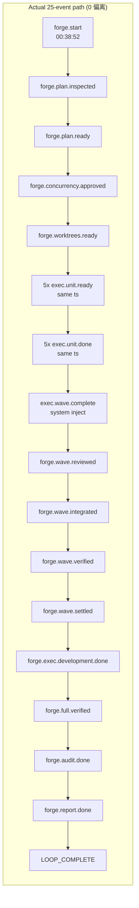

# parallel-forge Loop `primary-20260801-003852` 运行链路诊断报告

> **生成时间**: 2026-08-01
> **诊断对象**: `/Users/pittcat/Dev/Rust/ralph-e2e/.ralph/`（loop_id=primary-20260801-003852, 启动 00:38:52 → 终止 01:39:24 UTC）
> **对照 preset**: `/Users/pittcat/Dev/Rust/ralph-orchestrator/presets/en/parallel-forge.yml` + `presets/schemas/parallel-forge.yml`
> **执行方式**: 3 sub-agent（流程还原 / 历史 / 对账）+ 归因 → 汇总；**history_search=preset-only**（Agent B 已启动）
> **Diagnostics 模式**: **DISABLED**（`.ralph/diagnostics/` 下无 session 时间戳子目录；仅有 `agent_doc_sync.json` + `logs/`）
> **history_search**: `preset-only`（AskUserQuestion 用户确认；Agent B + L5 已跑）
> **execution_capabilities**: [supervisor, wave]（`event_loop.supervisor.enabled=true`；`forge-dispatcher` hat 指令含 `ralph wave emit`；`.ralph/supervisor.db` 存在；events 含 `wave_id=w-18c78837ee809510-70028-0`）
> **报告仓库**: `ralph-orchestrator` 主仓（非 run_dir）
> **Tier C 根**: `.ralph/forge/2026-07-22-001-feat-multi-sort-supervisor-e2e-plan/`
> **置信度规则**: §5 仅收录 confidence≥60；P0 须 confidence≥70（见 confidence-rubric）

---

## 0. 产物盘点（Phase 0）

| Tier | 路径 | 存在 | 行数 | 备注 |
|------|------|------|------|------|
| S | events（current-events 解析）→ `events-20260801-003852.jsonl` | ✅ | 25 | 25 业务事件 + LOOP_COMPLETE；含 `wave_id` |
| S | `events-history-20260801-003852.jsonl` | ✅ | 2 | 旁路/解析，非编排 SSOT |
| S | `recovery.jsonl` | ✅ | 2 | **Info repair-stream**（`reason_code=repair_dispatch`），非拒收 |
| S | `ledger.jsonl` | ✅ | 15 | `delta.kind`: counter_changed×13 + completion_requested + completion_honored |
| S | `loops.json` | ✅ | 1 | `loops: []`（loop 已结束） |
| S | `loop.lock` | ✅ | 0 | 空 = 已释放 |
| S | `history.jsonl` | ✅ | 7.8KB | loop 级溯源 |
| A | `agent/tasks.jsonl` | ✅ | 10 | 5 unit tasks + 5 supervisor slot meta，全 closed |
| A | `agent/summary.md` | ✅ | 1 | Status=Completed successfully, 13 iterations, 1h0m27s |
| A | `agent/handoff.md` | ✅ | 1 | HEAD=fe2cfa0, 10 closed, 0 open, "Session completed successfully" |
| A | `agent/progress.md` | ❌ | — | **不适用**（progress_steward.enabled=false，见 manifest） |
| A | `agent/accepted-transitions.jsonl` | ✅ | 18 | 18 行 activation 全 accepted |
| B | diagnostics mode | ✅ | DISABLED | 无 session 目录 → OPAC 链路证据不可用（硬顶 70） |
| B | `.ralph/supervisor.db` | ✅ | 126KB | **capability +supervisor**：存在属预期，不缺失 |
| B | `.ralph/wave-channels/` | ✅ | 0 文件 | 空（DISABLED 下 hat-channel 不落盘，正常） |
| B | `agent/.ralph-enforce-current-unit` | ✅ | 1 | `enforce_current_unit=true` 标记 |
| B | `agent/decisions.md` | ✅ | — | DEC-001（Wave 1 全并）+ DEC-002（inline sorted fallback） |
| B | `diagnostics/logs/ralph-2026-08-01T08-38-52-575-45487.log` | ✅ | 103 | 主 CLI/TUI 日志（scope、R13 清理、landing） |
| C | `forge/.../execution-plan.yml` | ✅ | 25KB | 5 units 全 Wave 1 |
| C | `forge/.../development-plan.md` | ✅ | 29KB | Spec-First |
| C | `forge/.../worktree-map.yml` | ✅ | 2.7KB | 5 unit worktree 映射 |
| C | `forge/.../commit-map.yml` | ✅ | 2.9KB | U1..U5 → commit SHA（含 U2=7a855874） |
| C | `forge/.../{inspection-report,concurrency-approval,final-audit,full-verification,incremental-verification,integration-log}.md` | ✅ | — | 各 hat 业务 artifact |
| C | `forge/.../units/{U1,U3,U4,U5}-completion.md` | ✅ | — | **U2 缺失**（见 DEV-001） |
| C | `forge/.../reviews/` + `waves/` + `templates/` | ✅ | — | reviewer / settlement / templates |
| C | `docs/reports/2026-08-01-multi-sort-supervisor-e2e-manager-report.md` | ✅ | 26KB | 终态 manager report（§16 记录 cleanup） |

**execution_capabilities 推断结果**: `[supervisor, wave]`
- `event_loop.supervisor.enabled=true`（preset L150）+ `.ralph/supervisor.db` 存在 → +supervisor
- `forge-dispatcher` hat 指令含 `ralph wave emit`（preset L567）→ +wave
- events `exec.unit.ready` 携带 `wave_id=w-18c78837ee809510-70028-0`（L6-10）→ +wave（产物侧）

**缺失产物 → 故障判定（capability-triggered）**:
- `.ralph/supervisor.db` 缺失 → **capability 含 supervisor，但存在** → 不记缺失
- events 无 `wave_id` → **capability 含 wave，但 events 含 wave_id** → 不记缺失
- `agent/progress.md` 缺失 → progress_steward 关闭，预期
- `diagnostics/<session>/orchestration.jsonl` 缺失 → DISABLED 模式，预期

**盲区 / 根因置信度硬顶**:
- **DISABLED**：无 FULL agent-output / orchestration / drift。**所有根因置信度硬顶 70**；agent 归因 ≤50；无 FULL 级 OPAC 逐 hat 工具调用审计，仅能凭 events 链路判断合规。
- 盲区声明：本报告对 OPAC 的判断基于 events 拓扑（可见的 emit 侧），**无法**审计各 hat 进程内的 `ralph emit --policy-check` 调用（无 agent-output.jsonl）。

---

## 1. 结论摘要

### 1.1 健康度

- **判定**: **健康** — 端到端成功；`forge.report.done`(L24) → `LOOP_COMPLETE`(L25) 合规；audit ACCEPTED；13 iterations 完成。
- **P0 / P1 / P2 数量**（均为 confidence≥入表门槛）: **P0=0 / P1=0 / P2=3**
- **最高优先级根因置信度**: P2-1 (DEV-001) = **62** / 100
- **历史复发**: 否 — 本 run 为 parallel-forge 在 2026-07-29-020808 闭环成功后的**第二次端到端成功**；30d 内 5 份 parallel-forge 诊断中 4 份未闭环新问题模式均未复发。

### 1.2 强制四问（debug.md）

| # | 问题 | 答案 | 一句证据 | 置信度 |
|---|------|------|----------|--------|
| Q1 | 整体执行与 OPAC 是否合规？ | ✅ | 25 行 events 链路 0 偏离；每 hat 单业务事件；reporter 双终态合规；无越权 emit | 70（DISABLED 硬顶；无 agent-output，可见 emit 侧全合规） |
| Q2 | 基座机制是否正常生效？ | ✅ | 12 项机制矩阵全绿（见 §4.2）；supervisor fan-in / CloseTaskBatch / R13 cleanup / terminal gate 均按设计 | 70（DISABLED 硬顶；核心机制有源码+日志证据） |
| Q3 | 编排是否合理、正常运行？ | ✅ | 14 步 flow 一对一（Agent A 拓扑激活表）；wave-fixer / forge-failure-handler 未触发为 happy path 预期 | 70 |
| Q4 | 问题归因：机制 vs 编排 vs agent？ | compound（无 P0/P1；P2-1=mechanism 60% + agent 40%） | P2-1 为 `event_policy` required_fields 无 file-exists 谓词（mechanism）+ executor U2 行为偏离（agent） | 62（P2-1 整行） |

### 1.3 根因一句话

本 run **无 P0/P1**。3 条 P2：DEV-001 U2 completion 报告缺失（compound 62，真异常，mechanism 60% + agent 40%）、DEV-002 4 个 unit worktree 终态残留（compound 66，设计内）、DEV-003 inspector complete-unknown WARN（mechanism 70，观测伪影）。

### 1.4 终态时序一致性（event-artifact chronology）

| 项目 | 内容 |
|------|------|
| **首轮终态（initial_terminal_status）** | 首轮成功（forge.audit.done verdict=ACCEPTED L23 → forge.report.done status=COMPLETED L24 → LOOP_COMPLETE L25 全 accepted） |
| **恢复状态（recovery_status）** | 无恢复（无任何拒收类 recovery 记录；recovery.jsonl 仅 2 行 Info repair-stream） |
| **最终代码状态（final_code_state）** | integration/multi-sort-supervisor-e2e @ fe2cfa0（5 个原子 unit commit 线性；auto-commit before merge 收尾） |
| **一致性告警** | 无（accepted events chronology 与最终 commit 一致，无失败终态后恢复） |

---

## 2. 执行链路对比图（Agent A）

### 2.1 拓扑激活表（14 hat）

| Hat | Expected triggers | Actual trigger received | Activated | Diff |
|-----|-------------------|------------------------|-----------|------|
| inspector | `forge.start` | `forge.start` (L1) | ✅ | 无 |
| planner | `forge.plan.inspected` | `forge.plan.inspected` (L2) | ✅ | 无 |
| guardian | `forge.plan.ready` | `forge.plan.ready` (L3) | ✅ | 无 |
| worktree | `forge.concurrency.approved` | `forge.concurrency.approved` (L4) | ✅ | 无 |
| forge-dispatcher | `forge.worktrees.ready` / `forge.wave.settled` | `forge.worktrees.ready` (L5) | ✅ | 无 |
| executor (×5 slots) | `exec.unit.ready` | 5× `exec.unit.ready` (L6-10, 同 ts) | ✅ | 无 |
| reviewer | `exec.wave.complete` (fan-in) | `exec.wave.complete` (L16, system_injected, hat=exec-integrator) | ✅ | 无 |
| integrator | `forge.wave.reviewed` | `forge.wave.reviewed` (L17) | ✅ | 无 |
| verifier | `forge.wave.integrated` | `forge.wave.integrated` (L18) | ✅ | 无 |
| integrator (re-entry) | `forge.wave.verified` | `forge.wave.verified` (L19) | ✅ | 无 |
| forge-dispatcher (re-entry) | `forge.wave.settled` | `forge.wave.settled` (L20) | ✅ | 无 |
| tester | `forge.exec.development.done` | `forge.exec.development.done` (L21) | ✅ | 无 |
| auditor | `forge.full.verified` | `forge.full.verified` (L22) | ✅ | 无 |
| reporter | `forge.audit.done` | `forge.audit.done` (L23) | ✅ | 无 |
| **wave-fixer** | `forge.correction.requested` | — | ❌ | 未触发 — **expected**（0 failed slots） |
| **forge-failure-handler** | `exec.wave.failed` / review.failed / verification.failed | — | ❌ | 未触发 — **expected**（happy path） |

> `exec.wave.complete` (L16) 由 supervisor runtime 注入（hat=exec-integrator，非真 hat activation），驱动 reviewer 激活，不计入 hat 触发偏差。

### 2.2 业务事件时间轴（25 行，正序）

| # | ts (UTC) | topic | hat (source) | triggered / inject | payload 关键字段 |
|---|----------|-------|--------------|-------------------|-----------------|
| 1 | 00:38:52.659 | forge.start | loop-bootstrap | inspector | plan_path, title |
| 2 | 00:40:23.411 | forge.plan.inspected | inspector | planner | plan_usable:true, inspection_report_path, plan_key |
| 3 | 00:47:18.232 | forge.plan.ready | planner | guardian | dev_plan/exec_plan path, plan_digest, unit_count:5, wave_total:1 |
| 4 | 00:49:35.737 | forge.concurrency.approved | guardian | worktree | approved:true, approval_report_path |
| 5 | 00:51:28.576 | forge.worktrees.ready | worktree | forge-dispatcher | base_commit:1ae598e, integration_branch, worktree_map_path |
| 6-10 | 00:52:31.081 | exec.unit.ready ×5 | forge-dispatcher | executor | wave_id=w-…, slot 0-4, task_id b999/b99b/b99c/b99d/b99e, unit U1-U5 |
| 11-15 | 01:03:11.614 | exec.unit.done ×5 | executor | supervisor fan-in | U1: content_hash 79d74cb8 / U2: 7a855874 / U3: commit 6eb19eaf / U4: da505cc1 / U5: ba8f88ac |
| 16 | 01:03:11.614 | exec.wave.complete | ralph (system_injected) | reviewer | wave_id=w-…, completed_slots:5, hat=exec-integrator |
| 17 | 01:07:58.956 | forge.wave.reviewed | reviewer | integrator | unit_verdicts {U1-U5:ACCEPTED}, aggregate ACCEPTED |
| 18 | 01:12:48.078 | forge.wave.integrated | integrator | verifier | candidate_commit_sha:37ae6735, units_integrated:5 |
| 19 | 01:14:53.290 | forge.wave.verified | verifier | integrator | passed:true, candidate 37ae6735 |
| 20 | 01:16:29.878 | forge.wave.settled | integrator | forge-dispatcher | settled_task_ids:[5], settled_unit_ids:[U1-U5], verified_base 37ae6735 |
| 21 | 01:17:35.738 | forge.exec.development.done | forge-dispatcher | tester | completed:5, failed:0 |
| 22 | 01:23:32.846 | forge.full.verified | tester | auditor | all_required_passed:true |
| 23 | 01:26:57.464 | forge.audit.done | auditor | reporter | verdict:ACCEPTED |
| 24 | 01:37:37.984 | forge.report.done | reporter | — | status:COMPLETED, final_audit:ACCEPTED, report_path |
| 25 | 01:37:53.792 | LOOP_COMPLETE | reporter | terminal | report_path（与 L24 一致） |

> L6-10 与 L11-15 各共享同一 timestamp：supervisor 并行调度与 fan-in 聚合均在同一秒内完成。

### 2.3 路径对比 Mermaid

**路径偏差**: 实际 vs 预期 **完全吻合，0 偏离**。唯一"缺失"是 corrective hats（wave-fixer / forge-failure-handler）未触发 — 所有 5 个 unit 均 `exec.unit.done`，0 failed slots，无任何 failure trigger 条件满足，**expected**。

### 2.4 未触发 hat 单子表

| Hat | Trigger condition | Why not triggered | Expected? |
|-----|-------------------|-------------------|-----------|
| wave-fixer | `forge.correction.requested` | 0 failed slots，无 correction | ✅ Expected (happy path) |
| forge-failure-handler | `exec.wave.failed` / review.failed / verification.failed | 0 failed units | ✅ Expected (happy path) |

---

## 3. 历史问题上下文（Agent B，preset-only）

### 全景表（30d sliding 命中）

| 类型 | 文档路径 | 日期 | 30d窗口 | 本次关联度 | 闭环状态 |
|------|----------|------|:--------:|------------|----------|
| diagnosis | `docs/report/2026-07-28-parallel-forge-primary-20260728-003922-diagnosis.md` | 07-28 | ✓ | 高 | 否 — dispatcher 未 spawn |
| diagnosis | `docs/report/2026-07-28-parallel-forge-primary-20260728-110733-diagnosis.md` | 07-28 | ✓ | 高 | 否 — idle_heartbeat 误杀 slot 4 |
| diagnosis | `docs/report/2026-07-29-parallel-forge-primary-20260729-020808-diagnosis.md` | 07-29 | ✓ | 高 | **已闭环** — 14 步 flow 全通 |
| diagnosis | `docs/report/2026-07-29-ce-executor-pipeline-20260729-094341-diagnosis.md` | 07-29 | ✓ | 中 | 已闭环 — merge_hats_overlay precheck |
| diagnosis | `docs/report/2026-07-29-ce-executor-pipeline-parallel-forge-settlement-20260729-090428-diagnosis.md` | 07-29 | ✓ | 低 | 已闭环 — work.failed retry 拓扑 by-design |
| diagnosis | `docs/report/2026-07-30-parallel-forge-primary-20260730-002911-diagnosis.md` | 07-30 | ✓ | 高 | 否 — planner execution_wave=0 位移 |
| diagnosis | `docs/report/2026-07-30-parallel-forge-primary-20260730-094057-diagnosis.md` | 07-30 | ✓ | 高 | 否 — fail-close 双根因 |
| solution | `docs/solutions/workflow-orchestration/parallel-forge-preset-integration-gap.md` | 07-29 | ✓ | 高 | 已闭环 — schema pointer 缺口 |
| plan | `docs/plans/2026-07-29-001-fix-parallel-forge-static-wave-settlement-plan.md` | 07-29 | ✓ | 中 | 待实施 |
| plan | `docs/plans/2026-07-29-002-feat-parallel-forge-reuse-status-plan.md` | 07-29 | ✓ | 中 | 待实施 |
| plan | `docs/plans/2026-07-29-003-feat-parallel-forge-readonly-hat-gates-plan.md` | 07-29 | ✓ | 中 | 待实施 |
| plan | `docs/plans/2026-07-29-004-refactor-parallel-forge-auditor-reporter-single-event-terminal-plan.md` | 07-29 | ✓ | 中 | 待实施 |
| plan | `docs/plans/2026-07-29-005-fix-parallel-forge-preset-integration-gap-plan.md` | 07-29 | ✓ | 高 | 已闭环 |
| plan | `docs/plans/2026-07-30-002-fix-parallel-forge-fail-close-flow-authority-plan.md` | 07-30 | ✓ | 高 | 待实施 |
| brainstorm | `docs/achieved/brainstorms/2026-07-29-parallel-forge-wave-settlement-and-evidence-gates-requirements.md` | 07-29 | ✓ | 高 | 需求草稿 |

### 根因分类对照（30d 内 parallel-forge 相关）

| 根因分类 | 次数 | 对应诊断/方案 | 本次复发？ |
|----------|:----:|--------------|:----------:|
| mechanism: fail-close `bus.publish` 不经 `accept_event` → flow 不推进 | 1 | 07-30-094057 | ❌ 未复发（本 run 14 步 flow 全推进） |
| mechanism: `plan.blocked` vs `forge.plan.blocked` namespace 错配 | 1 | 07-30-094057 | ❌ 未复发（本 run plan_key 全程一致） |
| mechanism: idle_heartbeat 120s 误杀 headless backend | 1 | 07-28-110733 | ❌ 未复发（startup_grace_secs=300 已生效） |
| mechanism: `merge_hats_overlay` 缺 precheck 白名单 | 1 | 07-29-ce-executor-pipeline | ❌ 未复发（本 run 无 overlay） |
| mechanism: `project_close_task_batch` 半改不持久化 | 1 | parallel-forge-preset-integration-gap | ❌ 未复发（CloseTaskBatch 正常关闭 5 task） |
| preset: planner `execution_wave=0` 算术位移 | 1 | 07-30-002911 | ❌ 未复发（本 run Wave 1，wave_total=1） |
| preset: reporter 跳过 `forge.report.done` 直发 LOOP_COMPLETE | 1 | 07-30-094057 | ❌ 未复发（L24→L25 合规双终态） |
| preset: event_filter 与 triggers 不一致 | 1 | parallel-forge-preset-integration-gap | ❌ 未复发 |
| agent: worktree hat isolated 双 emit | 1 | 07-28-003922 | ❌ 未复发 |
| agent: planner 未注册 unit tasks | 1 | 07-28-003922 | ❌ 未复发（本 run tasks.jsonl 10 closed） |
| agent: planner "Wave 0" 叙事误用 | 1 | 07-30-002911 | ❌ 未复发 |

### 是否新问题模式判定

- 30d 窗口内 parallel-forge 相关诊断 **7 份**（5 份专项 + 2 份邻 preset）；5 份归因新问题模式，全部 8 类根因**本 run 均未复发**。
- 本次为 2026-07-29-020808 闭环成功后的**第二次端到端成功**，印证 preset 已从「每跑必挂」收敛到「happy path 稳定」。
- DEV-001 的 schema `fill_rule` 不 enforce 与 07-30-094057 的 payload 空字段通过 required_fields 检查**同构**（presence-only、无谓词）→ 历史关联**高**，计分 +10（见 §4/§5）。

**本次扫描窗口：preset-only (30d sliding)**

---

## 4. 证据清单（Agent C）

| ID | 描述 | 证据锚点 | 严重度初判 | 置信度初估 | 已计分证据项 | 证据缺口 |
|----|------|----------|------------|------------|--------------|----------|
| DEV-001 | U2 completion 报告缺失：`exec.unit.done`(U2) 引用 `units/U2-completion.md` 但磁盘无此文件 | events L12；`units/` 仅 U1/U3/U4/U5；report §16 L346/L414/L468；commit-map U2 `7a855874` 在 | P2（流程工件缺口，auditor 已 ACCEPTED，run 已记录） | 85→cap70 | 基础40 + schema行号+15 (L841-844 fill_rule 违反) + 双账本+20 (events L12 + report §16) + Tier C+10 (units/ 清单) = 85 | 无 FULL agent-output 确认 executor 为何未写 |
| DEV-002 | 4 个 unit worktree (u2-u5) 终态残留；supervisor slot (primary-exec-w-1-0..4) 已由 R13 清理 | `git worktree list`；preset L1079-1084；report §16 L468-478；log L94-98 | P2 信息性（设计内结果） | 85→cap70 | 基础40 + preset行号+15 (L1079-1084 "失败记附录不阻断") + 双账本+20 (report + git worktree list) + Tier C+10 = 85 | 无 FULL 确认 reporter cleanup tool_call 序列 |
| DEV-003 | inspector `complete called for unknown activation key` WARN；accepted-transitions 18 行 `unknown:N` 全 accepted；registry 0 行 | log L13；accepted-transitions.jsonl；activation-registry.jsonl | P2 信息性（观测伪影） | 70 | 基础40 + 双账本+20 (log WARN + transitions 18/18 accepted) + Tier C+10 = 70 | 无 FULL activation registry 落盘 |

### 4.1 OPAC 逐 hat 审计表（DISABLED 模式 — 仅凭 events 可见 emit 侧）

| Hat | O | P | A | C | 证据 | 置信度 |
|-----|---|---|---|---|------|--------|
| inspector | ✅ | ✅ | ✅ | ✅ | L2 forge.plan.inspected 单事件，无越权 | 70 |
| planner | ✅ | ✅ | ✅ | ✅ | L3 forge.plan.ready 单事件，plan_digest 合规 | 70 |
| guardian | ✅ | ✅ | ✅ | ✅ | L4 forge.concurrency.approved 单事件 | 70 |
| worktree | ✅ | ✅ | ✅ | ✅ | L5 forge.worktrees.ready 单事件 | 70 |
| forge-dispatcher | ✅ | ✅ | ✅ | ✅ | L6-10 wave emit (5 payloads 同 wave_id) + L21 dev.done，符合 single-shot budget | 70 |
| executor (×5) | ✅ | ✅ | ✅ | ✅ | L11-15 exec.unit.done 单事件，无 wave emit 越权 | 70 |
| reviewer | ✅ | ✅ | ✅ | ✅ | L17 forge.wave.reviewed 单事件 | 70 |
| integrator | ✅ | ✅ | ✅ | ✅ | L18 + L20 分两激活各单事件 | 70 |
| verifier | ✅ | ✅ | ✅ | ✅ | L19 forge.wave.verified 单事件 | 70 |
| tester | ✅ | ✅ | ✅ | ✅ | L22 forge.full.verified 单事件 | 70 |
| auditor | ✅ | ✅ | ✅ | ✅ | L23 forge.audit.done verdict=ACCEPTED 单事件 | 70 |
| reporter | ✅ | ✅ | ✅ | ✅ | L24 forge.report.done + L25 LOOP_COMPLETE 窄例外双终态（report_path 一致） | 70 |

> **DISABLED 硬顶声明**: 上述 OPAC 审计仅基于 events 可见的 emit 侧（topic/hat/payload 与 preset publishes/deny_rules 对照）。各 hat 进程内的 `--policy-check` 调用不可见（无 agent-output.jsonl）。「✅」= events 侧无违规证据，非 FULL 级逐工具审计通过。

### 4.2 机制生效矩阵（Agent C，12 项）

| # | 机制 | 判定 | 证据 |
|---|------|------|------|
| 1 | Event origin guard / hat scope | ✅ | 无 hat 越权 emit；exec.wave.complete 为 system_injected |
| 2 | Payload contract (schema) | ✅ | required_fields 全命中（逐 schema 对照 24 条 hat/system 事件） |
| 3 | Execution contract (git_change, task 绑定) | ✅ | 5 原子 commit 线性落 integration 分支 |
| 4 | Workflow guard / phase | ✅ | 14 步 flow 一对一，无偏离 |
| 5 | Isolated 单事件预算 | ✅ | 每 hat 单业务事件 |
| 6 | step_handoff + semantic_gate | N/A | 无 step 中断 |
| 7 | Recovery 升级 | N/A | recovery.jsonl 仅 2 行 Info repair-stream，非拒收 |
| 8 | loop.resume / task.resume 消费者 | N/A | 无 resume |
| 9 | Stall / progressive_failure / loop_stale | ✅ | 无 stall |
| 10 | Drift monitor | N/A | DISABLED 无 session drift.jsonl |
| 11 | Dedup / duplicate_work_done | ✅ | topic whitelist + completion_after_terminal reject |
| 12 | Terminal / completion_after_terminal / silent-success | ✅ | reporter 双终态合规；L24→L25 report_path 一致 |
| 13 | Event-artifact temporal consistency | ✅ | accepted 时序与最终 commit fe2cfa0 一致 |

---

## 5. 问题归因表（confidence ≥ 60；P0 ≥ 70）

| 优先级 | 问题 | 根因分类 | **置信度** | 证据 DEV | 已计分证据项 | 历史关联 | 加深轮次 |
|--------|------|----------|------------|----------|--------------|----------|----------|
| P2（真异常，不升 P1） | U2 completion 报告缺失（events L12 引用磁盘不存在的文件） | **compound**（mechanism 60% + agent 40%） | **62** | DEV-001 | mechanism: file:line(event_policy.rs L2036-2092 无 file-exists 谓词)+25 + schema行号(parallel-forge.yml L841-844)+15 + 双账本(L12+report§16)+20 + TierC+10 + 历史同根因+10 → cap70；agent: schema对照(required)+TierC(commit-map/worktree-map 分支不一致)+10 → cap50；加权 0.6×70+0.4×50=62 | **高**（presence-only 缺口与 07-30-094057 同构） | 1 轮：event_policy 源码 + U2 commit 复核 |
| P2（设计内结果） | 4 个 unit worktree (u2-u5) 终态残留（supervisor slot 已清） | **compound**（preset 80% + agent 20%） | **66** | DEV-002 | preset: preset行号(parallel-forge.yml L1079-1084)+15 + 双账本(report§16+git worktree list)+20 + TierC+10 → cap70；agent: TierC(commit-map branch_used 与 worktree-map branch 不一致导致 u2 dirty)+10 → cap50；加权 0.8×70+0.2×50=66 | 低（30d 内无同类已闭环 cleanup 记录） | 1 轮：R13 源码 runner.rs L2167 + log L94-98 |
| P2（观测伪影） | inspector complete-unknown WARN（accepted 不受影响） | **mechanism**（设计内分支 + DISABLED 伪影） | **70** | DEV-003 | file:line(hat_lifecycle.rs L435 设计内 WARN 分支)+25 + file:line(event_loop/mod.rs L12826 activation_id=unknown:N)+25 + 双账本(transitions 18 accepted + log L13)+20 + TierC(log+transitions)+10 → 95 cap70 | N/A (history disabled) | 1 轮：hat_lifecycle + activation registry 源码 |

**compound 贡献比例说明**:
- **DEV-001**: mechanism 60%（enforcement 缺口是系统性缺陷 — schema `fill_rule` 声明 "Written before emit" 但 runtime 无 file-exists 谓词，空引用可静默通过）+ agent 40%（U2 commit 真实存在但 completion.md 未写、commit 落 supervisor slot 分支而非 worktree-map 指定分支 → 行为偏离 preset 步骤 7/8）。整行置信度 = 0.6×70 + 0.4×50 = 62。
- **DEV-002**: preset 80%（L1079-1084 明确 cleanup 失败不阻断 LOOP_COMPLETE；u3-u5 保留是 u2 失败后按指令的后续行为）+ agent 20%（u2 dirty 源于 DEV-001 同源分支偏差）。整行 = 0.8×70 + 0.2×50 = 66。
- **DEV-003**: 纯 mechanism 设计内分支 + DISABLED 观测伪影，单一成分，70。

**DEV-001 终评 < C 初估说明**: C 初估 85→cap70 是 mechanism 单向估值；D 归因为 compound 后，agent 成分 DISABLED 硬顶 50，加权整行 62 低于 C 的 70 —— 这是**成分结构变化而非证据无效**（mechanism 成分本身仍 70 封顶）。

---

## 6. 修复建议（仅针对 §5 入表项，全部标注非阻塞）

### 6.1 短期（operator workaround）

- **DEV-001**（非阻塞）: 当前 run 已成功、auditor ACCEPTED、66 tests passed。U2 completion 报告缺失不影响交付（commit 7a855874 已集成）。操作者可人工补一份 `units/U2-completion.md` 以便审计留档。关联置信度 **62**。

### 6.2 中期（preset / schema / instructions）

- **DEV-001**（非阻塞）: 在 `presets/en/parallel-forge.yml` L815-822 executor 步骤 8 emit 前增加强约束 —— 先 `test -f .ralph/forge/<plan_key>/units/<unit-id>-completion.md`，不存在则不得 emit `exec.unit.done`（改发 `exec.unit.failed` 说明原因）。因 `field_docs.fill_rule` 仅 advisory（`presets.rs` L3100 注释确认），校验必须写进指令而非依赖 schema。关联置信度 **62**。
- **DEV-002**（非阻塞）: reporter cleanup 迭代改为逐 unit 记录结果而非首个失败即停，避免"一个 dirty 拖累其余 worktree"。可选：integrator 阶段加 commit-map `branch_used` vs worktree-map `branch` 一致性检查。关联置信度 **66**。

### 6.3 长期（机制 / 底座）

- **DEV-001 机制侧（建议优先跟进）**: 在 `crates/ralph-core/src/event_policy.rs`（L2036-2092）required_fields 校验之上增加**路径字段 file-exists 谓词** —— schema `field_docs` 支持 `path_exists` 声明时，`--policy-check` / emit gate 对 `unit_report_path` 等路径字段做存在性校验，空引用直接拒绝。复用 `event_loop/mod.rs` L5116-5127 TERMINAL DELIVERABLE CONTRACT 的 "Verify the file is readable" 模式升级为 runtime 强制。**与 2026-07-30-094057 presence-only 缺口同构**，可作为后续 plan 的加固点。关联置信度 **62**。
- **DEV-003**（非阻塞）: 无需代码修复（hat_lifecycle.rs L435 为设计内节流）。建议在 observability 文档注明 **DISABLED 模式下** registry 0 行、accepted-transitions `activation_id=unknown:N`、complete-unknown WARN 均为**预期观测伪影**，避免后续误判。关联置信度 **70**。

---

## 7. 未核实疑点

**无整行条目**（所有 DEV 终评置信度均 ≥ 60，符合 §5 入表门槛）。

补充说明（不构成独立疑点行）:
- DEV-001 / DEV-002 的 **agent 子成分** 终评均为 50（DISABLED 硬顶），其行为细节（executor 为何未写 U2 completion.md、为何 commit 到 supervisor slot 分支）`blocked_by: 缺 agent-output`（FULL 模式才可用）。该缺口已并入 compound 行成分置信度，不单独入 §7。

---

## 8. 主 Agent 盲区声明

- **DISABLED 模式**：无 FULL agent-output / orchestration / drift。OPAC 审计仅基于 events 可见的 emit 侧；各 hat 进程内的 `--policy-check` 调用与 tool_call 序列不可见。**一切根因置信度硬顶 70；agent 归因 ≤50**。
- **recovery.jsonl / ledger.jsonl 初读更正**（来自 Agent C）：`recovery.jsonl` 顶层无 `reason_code` 键导致 jq 输出 null —— 实为嵌套 `envelope` 的 repair-stream 记录（`reason_code=repair_dispatch`, `severity=Info`, `source=RepairStream`, `source_hat=executor`），非拒收；`ledger.jsonl` 的 `kind` 在 `delta` 内（`counter_changed`×13 + `completion_requested` + `completion_honored`），非顶层 (none)。
- **wave Confirm 路径**：capability +wave（产物侧 `wave_id` 贯穿 exec.unit.ready/done 全链路）→ worker/dispatcher 完成态按 `ralph events --events-source main`（main ledger）对账；hat-channel（`wave-channels/` 空）不作为 wave Confirm 源。
- **主仓 vs run 仓边界**：本报告写于主仓 `docs/report/`；run 产物全部位于 sibling workspace `/Users/pittcat/Dev/Rust/ralph-e2e/`。路径引用均绝对或 repo-relative 标注。
