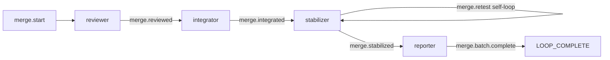
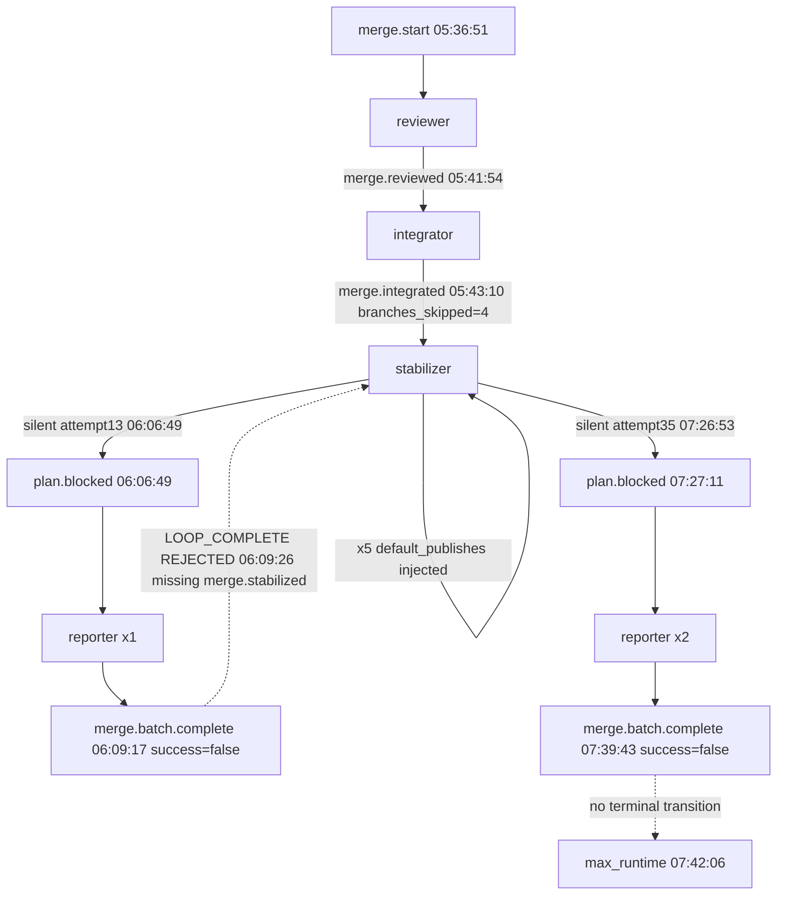

# merge-batch Loop `primary-20260804-053651` 运行链路诊断报告

> **生成时间**: 2026-08-04
> **诊断对象**: `.ralph/`（loop_id=primary-20260804-053651，启动 → max_runtime 终止）
> **对照 preset**: `presets/en/merge-batch.yml` + `presets/schemas/merge-batch.yml`
> **执行方式**: 主 Agent 直接 4 阶段流水（盘点 → A 流程还原 → C 对账 → D 归因）+ 1 mermaid 校验；**`history_search=disabled` 时仅 3 个 sub-agent**（Agent B 跳过）；Agent C 因 watchdog 600s 中断，主 Agent 凭独立证据复核补证
> **Diagnostics 模式**: MINIMAL（`.ralph/diagnostics/2026-08-04T13-36-51/` 有 recovery.jsonl/trace.jsonl/diagnosis-summary.json，**无 orchestration.jsonl/agent-output.jsonl**）
> **history_search**: `disabled`（默认）— 来自主 SKILL §0.1 AskUserQuestion
> **execution_capabilities**: `["single-chain"]` — 推断信号：preset 无 `event_loop.supervisor.enabled`，无 `ralph wave emit`，events 无 `wave_id`，`.ralph/supervisor.db` 存在但属历史 loop 遗留（capability 不要求）→ 缺 db / 缺 wave_id 不是故障
> **报告仓库**: `ralph-orchestrator` 主仓（不是 run_dir）
> **Tier C 根**: `.ralph/merge/`（stabilize-log.md / stabilize-state.json / REPORT.md / merge-batch-complete-payload.json / merge-integrated-payload.json / merge-reviewed-payload.json）
> **置信度规则**: §5 仅收录 confidence ≥ 60；P0 须 ≥ 70（见 confidence-rubric）；MINIMAL 模式硬顶 85

---

## 0. 产物盘点（Phase 0 必附）

| Tier | 路径 | 存在 | 行数/大小 | 备注 |
|------|------|------|-----------|------|
| S | `.ralph/current-events` | ✅ | 35 字节 | 指向 `events-20260804-053651.jsonl` |
| S | `.ralph/events-20260804-053651.jsonl` | ✅ | 40 行 | `merge.start`×1, `merge.reviewed`×1, `merge.integrated`×1, `merge.retest`×35, `merge.batch.complete`×2；**`merge.stabilized` 0 行** |
| S | `.ralph/events-history-20260804-053651.jsonl` | ✅ | 2 行 | `merge.start` + `loop.terminate` |
| S | `.ralph/ledger.jsonl` | ✅ | 37 行 | `loop.batch_sync` 计数到 iter 37（缺 iter 10/23/33/35/38，与 5 次 default_publishes 注入 iteration 1:1）+ `loop.complete` 2 行 `rejection_recorded` |
| S | `.ralph/recovery.jsonl` | ✅ | 1 行 | 历史 loop `repair_dispatch`（不计入本次诊断） |
| S | `.ralph/loops.json` | ✅ | — | 单一 loop `primary-20260804-053651`，无 pid（已终止） |
| S | `.ralph/loop.lock` | ✅ 已释放 | — | `lock_released` |
| S | `.ralph/diagnostics/logs/ralph-2026-08-04T13-36-51-013-61459.log` | ✅ | 258 行 | 含 5× `routing fallback` ERROR、5× `orphan events` ERROR、2× `no progress for 3 turns` WARN、2× `LOOP_COMPLETE REJECTED` WARN、`Wrapping up: max_runtime` INFO |
| A | `.ralph/agent/tasks.jsonl` | ✅ | 5 行 | `tasks.enabled=false`（preset L60），此处行来自历史 loop 051427；本次 loop 不使用 tasks |
| A | `.ralph/agent/summary.md` | ✅ | — | **Stopped: max runtime exceeded / 39 iterations / 2h 5m 15s** |
| A | `.ralph/agent/handoff.md` | ✅ | — | 来自历史 loop 051427（2026-08-02 22:41 UTC） |
| A | `.ralph/merge/stabilize-log.md` | ✅ | 522 行 | attempt 1-34 完整记录；含 OPAC Precheck/Apply/Confirm 行 |
| A | `.ralph/merge/stabilize-state.json` | ✅ | — | `attempt=34, phase1_fail_count=null, fixed_verification_command=null` |
| A | `.ralph/merge/REPORT.md` | ✅ | ~22K | **FAIL 结论** + 4 分支 design intent + 4 处预测冲突 + Repository state 段 |
| B | `.ralph/diagnostics/2026-08-04T13-36-51/` | ✅ | MINIMAL | recovery.jsonl 6 行（agent_doc_sync 1 + missing_event_gate 5，iteration 10/23/33/35/38），trace.jsonl 7 行，drift.jsonl 0 行，diagnosis-summary.json total_iterations=39 |
| B | `.ralph/diagnostics/2026-08-04T13-36-51/orchestration.jsonl` | ❌ | — | 不存在（MINIMAL 模式无 orchestration 是预期） |
| B | `.ralph/agent/events-hat-stabilizer-primary-20260804-053651-*.jsonl` | ❌ | 0 字节 | 当前 loop hat-channel 未留盘（仅历史 loop 051427 的 -9.jsonl 残留） |
| B | `.ralph/supervisor.db` | ✅ | 127 KB | **历史 loop 遗留，不属本次 capability 需求**（execution_capabilities 不含 supervisor）→ 视为 N/A |
| B | `.ralph/agent/accepted-transitions.jsonl` | ✅ | 65 行 | 本 loop 34 行：merge.reviewed/integrated/retest×30/**plan.blocked×2**（stall-detector:10/38）；无 `merge.batch.complete`、无 `merge.start` |
| B | `.ralph/flow-authority.jsonl` | ✅ | 65 行 | 本 loop 30 行：merge.reviewed/integrated/retest×27/**plan.blocked×2**；与 outbox 一致 |
| C | `.ralph/merge.prompt.md` | ✅ | — | merge.start payload（中文 prompt + 4 分支列表 + 验证命令钉住说明） |
| C | `.ralph/merge/merge-batch-complete-payload.json` | ✅ | — | reporter 最终 payload（reason=`stabilization_exhausted_after_34_attempts_...`） |
| C | `.ralph/agent/merge-integrated-payload.json` | ✅ | — | `branches_merged=[]` / `branches_skipped=[4]` / `integration_complete=true` |
| C | `.ralph/agent/merge-reviewed-payload.json` | ✅ | 15 KB | reviewer 完整 4 分支 design intent + predicted_conflicts + resolution_methods |
| C | `.ralph/merge/reports/2026-08-04T14-07-00.md` | ✅ | 21 KB | reporter 第 1 次路由时写的 attempt 13 失败报告 |
| C | `.ralph/merge/reports/2026-08-04T07-32-44.md` | ✅ | 23 KB | reporter 第 2 次路由时写的 attempt 34 失败报告（即 REPORT.md 副本） |

**execution_capabilities 推断结果**: `["single-chain"]` — 判定信号 + 证据锚点：
- preset `presets/en/merge-batch.yml:60` 未设置 `event_loop.supervisor.enabled` → 默认 false（capability 不要求 +supervisor）
- hat `instructions` 不含 `ralph wave emit` / `ralph wave verify`，无 `## WAVE CONTEXT` 注入 → capability 不要求 +wave
- `.ralph/events-20260804-053651.jsonl` 0 行含 `wave_id` → 与 capability 不要求 +wave 一致
- `.ralph/supervisor.db` 存在（127 KB，2026-08-02 mtime）→ 来自历史 `primary-20260802-115843` loop 遗留，非本次 capability 需求

**缺失产物 → 故障判定（capability-triggered）**:
- `.ralph/supervisor.db` 缺失 → **N/A（capability 不要求 supervisor）**
- events 无 `wave_id` → **N/A（capability 不要求 wave）**
- orchestration.jsonl 缺失 → **N/A（MINIMAL 模式预期）**
- agent-output.jsonl 缺失 → **按 OPAC 模式降级：单列缺失不得单独 P0**（参见 §4.1）
- 当前 loop hat-channel events-hat-stabilizer-*.jsonl 全 0 字节 → 标注「hat-channel 未留盘，main ledger 是唯一可信事件源」

**盲区 / 根因置信度硬顶**: MINIMAL 模式（无 orchestration.jsonl / agent-output.jsonl）→ mode hard top 85；agent 归因无 agent-output 工具调用级证据 → 仅 logs / recovery 弱信号，纯 agent 归因 ≤60。

---

## 1. 结论摘要

### 1.1 健康度

- **判定**: 部分偏离（编排执行链路基本完整，mechanism 触发 reporter 2 次非设计激活，合并在 git 层完成但事件层未走通 stabilized 终态，max_runtime 截断）
- **P0 / P1 / P2 数量**（均为 confidence ≥ 入表门槛）:
  - P0：**0**（无 P0 候选，置信度均达 P1/P2 上限）
  - P1：**3**（DEV-001 merge.stabilized 缺位 / DEV-002 reporter 非设计激活 / DEV-006 30 次零 fix 自环）
  - P2：**5**（DEV-003 双账本分歧 / DEV-004 5 次注入 / DEV-007 重跑语义 / DEV-008 计时终止 / DEV-009 OPAC）
- **最高优先级根因置信度**: P1-DEV-001/006 = **85** / 100（mechanism 成分）；P1-DEV-002 = **85** / 100
- **历史复发**: N/A (history disabled)

### 1.2 强制四问（debug.md）

| # | 问题 | 答案 | 一句证据 | 置信度 |
|---|------|------|----------|--------|
| Q1 | 整体执行与 OPAC 是否合规？ | ⚠️ | 编排执行合规；OPAC 在 MINIMAL 模式仅 logs/stabilize-log 弱信号，5 次 default_publishes 注入 + 3 次 hat=null 是 OPAC Apply 弱信号，置信度 ≤70 | 70 |
| Q2 | 基座机制是否正常生效？ | ⚠️ | 机制十二项大多正常（origin guard/payload contract/workflow guard/isolated 单事件/stall/recovery 升级/dedup），但 terminal 失效（无自然终态）；plan.blocked 与 merge.batch.complete 双账本分歧（DEV-003） | 85 |
| Q3 | 编排是否合理、正常运行？ | ⚠️ | 编排链 review→integrate→stabilize 自环→reporter→LOOP_COMPLETE 设计合理；实际：stabilizer 自环 34 次未达 attempt≥35 耗尽门，被 max_runtime 截断（DEV-001+008）；reporter 2 次由 plan.blocked 触发而非 merge.stabilized（DEV-002） | 85 |
| Q4 | 问题归因：机制 vs 编排 vs agent？ | **compound** | P1 三项均为 compound 或 mechanism（preset 无 escape 路径 + mechanism 路由 + agent 决策不修 baseline 复合作用），最高机制成分置信度 85 | 85 |

### 1.3 根因一句话

> **`merge.stabilized` 应发未发**（stabilizer 34 次 attempt 0 fix，attempt 35 activation 被 max_runtime 截断）+ **EventBus::publish 按 `target` 直投不校验 triggers**（stall-detector `plan.blocked(with_target=reporter)` 触发 reporter 2 次）+ **merge-batch preset 无「pre-existing baseline failure 即时升级」路径**，三因素复合作用导致 `merge.batch.complete` 2 次被 completion gate 拒绝、loop 无自然终态、被 max_runtime 截断（**置信度 85，mechanism 成分**）

### 1.4 终态时序一致性（event-artifact chronology）

| 项目 | 内容 |
|------|------|
| **首轮终态（initial_terminal_status）** | **失败终态** — 39 iterations / 2h5m15s / max_runtime 截断；merge.batch.complete×2 均被 required_events gate 拒（缺 `merge.stabilized`）；merge.stabilized 全程未发；无 LOOP_COMPLETE accepted |
| **恢复状态（recovery_status）** | 无恢复 — 未发生「失败终态后修复」的情形；2 次 reporter 路由（attempt 13 / attempt 34）均写 FAIL 报告且 emit merge.batch.complete，但均被拒收 |
| **最终代码状态（final_code_state）** | 4 个目标分支（ralph/2026-08-03-{001,004,005,006}-plan）已合并入 `pittcat-dev`（4b675d52 / 34f0db4f / 73ad33a6 / 93151eed），由**前 loop 051427** 的 integrator 在 05:16:23 UTC 完成（`events-20260804-051427:L3` 报 `branches_merged=[4]` + 4 shas）；本 loop integrator 05:43:10 因分支已合并正确归 `branches_skipped=[4]`，但事件层与 git 层出现分歧 |
| **一致性告警** | ⚠️ **事件层未走通**：`merge.batch.complete` 2 次进 main events 未进 outbox（completion gate 拒），`merge.stabilized` 0 次进任何账本；但 git 层 4 个 merge commit 真实落地（来源：前 loop 051427）。**不得**输出「零拒收」或「首轮完整成功」 |

---

## 2. 执行链路对比图

### §2.1 拓扑激活表

**事件流总账**（events 40 行 = 1 start + 1 reviewed + 1 integrated + 35 retest + 2 complete）：

- `merge.stabilized`：**0 次**（全程未出现，events 全文件无此 topic）
- `plan.blocked`：0 次进 main ledger（events 0 命中），但 flow-authority.jsonl 记录 2 次（第 41、65 行），accepted-transitions.jsonl 记录 2 次（stall-detector:10 / stall-detector:38）

| hat | 激活次数 | emit topic | system_injected | hat=null | 证据 |
|---|---|---|---|---|---|
| loop-bootstrap | 1 | `merge.start`（L1, 05:36:51） | 否 | — | `events:L1` |
| reviewer | 1 | `merge.reviewed`（L2, 05:41:54，完整 4 分支 design intent + 4 预测冲突） | 否 | — | `events:L2` |
| integrator | 1 | `merge.integrated`（L3, 05:43:10，`branches_merged=[]` / `branches_skipped=[4]` / `integration_complete=true` / `merge_commit_shas=[]`） | 否 | — | `events:L3` |
| stabilizer | **35** | 27 真实 `merge.retest`（attempt 7→34，hat=stabilizer）+ 5 silent→`default_publishes` 注入 + 3 hat=null main-ledger scrub | 5（L11/24/34/36/39） | 3（L7/8/9，attempt 9/10/11） | 见下表 |
| reporter | **2** | 2 × `merge.batch.complete`（L12 06:09:17 `stabilization_incomplete_at_attempt_13`；L40 07:39:43 `stabilization_exhausted_after_34_attempts`），均 `success=false` | 否 | — | `events:L12,L40` |
| ralph fallback | 0 | 被 `topic_deny_rules`（preset L109-113）锁死全部 5 个 workflow topic | — | — | `preset:L109-113` |

**stabilizer 35 次 activation 明细**：

| 类型 | events 行号（attempt payload） |
|---|---|
| 真实 emit attempt 7→34（hat=stabilizer） | L4(7) L5(8) L6(8) L10(12) L13(13) L14(14) L15(15) L16(16) L17(17) L18(18) L19(19) L20(20) L21(21) L22(22) L23(23) L25(24) L26(25) L27(25) L28(26) L29(27) L30(28) L31(29) L32(30) L33(31) L35(32) L37(33) L38(34) |
| hat=null（真实 emit，main-ledger 9 键 scrub） | L7(attempt=9, 05:53:58) L8(attempt=10, 05:57:34) L9(attempt=11, 06:01:08) |
| `system_injected=true`（reason=default_publishes，payload 无 attempt） | L11(06:06:49) L24(06:40:12) L34(07:04:48) L36(07:19:03) L39(07:27:11) |

**attempt 编号异常**（纯流程事实）：attempt 值非单调——`8` 出现 2 次（L5 字符串 `"8"` + L6 整数 `8`）、`25` 出现 2 次（L26/L27）；stabilize-log 也出现重复节标题「尝试 14」（L179, L196）与「尝试 26」（L374, L391）；日志内节号与 events attempt payload 存在系统性错位（如 stabilize-log:L99「尝试 9」自述 emit attempt=8，但 events 当时 attempt=8/9 双发）。

### §2.2 时间轴对比表

| # | 步骤 | 预期（preset/schema） | 实际 | 判定 |
|---|---|---|---|---|
| 1 | `merge.start` | loop-bootstrap 注入 prompt，目标 `pittcat-dev` | 05:36:51 `events:L1` | ✅ |
| 2 | reviewer → `merge.reviewed` | 完整 review + predicted_conflicts/resolution_methods | 05:41:54，完整 4 分支 intent + 4 预测冲突，`triggered=integrator` `events:L2` | ✅ |
| 3 | integrator → `merge.integrated` | `git merge` 本轮落地 4 分支，`branches_merged=4`+`merge_commit_shas` | 05:43:10 `branches_merged=[]` / `branches_skipped=[4]` / `merge_commit_shas=[]` | ⚠️ 见 (3a) |
| 3a | （git 实物层） | — | 4 个 merge commit **由前 loop 051427 于 05:16:23 UTC 落地**（`git log` 13:16+0800=05:16 UTC；`events-20260804-051427:L3` 报 branches_merged=[4]+4 shas）；本 loop 启动时分支已合并 → integrator 归 skipped 是事实正确 | ⚠️ 事件层与 git 层分歧；reporter 已采信 git 视角（`hat instructions` 第 978 行：`git branch --merged <target>` is authoritative） |
| 4 | stabilizer 首激活 | attempt 1 起，锁定验证命令 | 首个 retest = **attempt 7**（`events:L4`），attempt 计数器从前 loop 051427（attempt 1-6，`events-20260804-051427:L4-9`）跨 loop 延续 | ⚠️ attempt 跨 loop 复用 |
| 5 | stabilizer 自环 `merge.retest` | 失败→fix→retest；通过→`merge.stabilized passed:true`；attempt≥35→`merge.stabilized passed:false reason=stabilization_exhausted`（`preset:L342-344,L386-389`；`schema:L129-154`） | 30 次真实 retest（attempt 7→34），**classification 恒为 `business_problem`**，每次同一确定性失败 `loop_runner::tests::wave_supervisor::exhausted_exec_failed_event_is_normalized_before_tracker`（`stabilize-log:L9` 等）；**0 次 fix**；attempt<35 一律不发 `merge.stabilized` | ⚠️ 自环不退化为「死循环」，直到 runtime 终止 |
| 5a | 3 次 hat=null retest | — | attempt 9/10/11（05:53:58/05:57:34/06:01:08），`events:L7-9`，对应 stabilize-log attempt 10-12 记录的 main-ledger scrubbed 9 键 emit 路径 | ⚠️ |
| 5b | 5 次 silent→`default_publishes` 注入 | — | `events:L11/24/34/36/39`（iter 10/23/33/35/38），与 `diag-recovery:L2-6` 的 5 条 `missing_event_gate` 1:1 对应 | ⚠️ |
| 6 | 06:06:49 `plan.blocked`（首） | — | isolated no-progress×3 fail-close（`log:L70`）；写入 flow-authority L41、outbox stall-detector:10；**未入 main events** | ⚠️ |
| 7 | **reporter 第 1 次路由** | 仅 `merge.stabilized` 触发（`preset:L395`） | 06:09:17 reporter 发 `merge.batch.complete success=false`（`events:L12`）——**无 `merge.stabilized` 可引用**，按「On failure」分支处置（`REPORT.md` 自注「外部 routing 提前路由」）；触发源是 stall-detector `plan.blocked(with_target=reporter)`（`mod.rs:15038-15049`），**EventBus::publish 按 target 直投不校验 triggers**（`event_bus.rs:108-115`） | ❌ 偏离设计链 |
| 8 | 06:09:26 `LOOP_COMPLETE` 被拒 | — | `log:L77-81`：`LOOP_COMPLETE REJECTED by mark_completion_requested: required events not yet observed: ["merge.stabilized"]`，iteration=11，`P0-2: injected completion rejection into state.prompt_context`；loop **未终止**继续自环；ledger `loop.complete` rejection_recorded ×2 | ❌ expected chain 中继点断裂 |
| 9 | 07:27:11 `plan.blocked`（次） | — | 第二次 no-progress×3 fail-close（`log:L251`）；flow-authority L65、outbox stall-detector:38；**未入 main events** | ⚠️ |
| 10 | **reporter 第 2 次路由** | 仅 `merge.stabilized` 触发 | 07:39:43 reporter 发 `merge.batch.complete success=false`（`events:L40`，`stabilization_exhausted_after_34_attempts_baseline_failure_orthogonal_no_merge_stabilized_event`）；仍无 `merge.stabilized` | ❌ |
| 11 | **`merge.stabilized` 应发未发** | attempt≥35 或 merge_incomplete 时应发（`preset:L342-344`；`schema:L143-144` `reason ∈ {merge_incomplete, stabilization_exhausted}`） | **全程 0 次**；stabilize-state.json `next_hint`：「attempt 35 must skip fixes and publish merge.stabilized with passed=false, reason=stabilization_exhausted」——attempt 34（`events:L38`, 07:26:10）后下一 activation（本应为 attempt 35）在 max_runtime 截断时未产出任何事件 | ❌ |
| 12 | 终止 | `completion_promise=merge.batch.complete` + `required_events=[merge.stabilized]` + `max_iterations=40` + `max_runtime_seconds=7200`（`preset:L55-59`） | 07:42:06 **max_runtime**：`loop-termination-reason.json`=`"max_runtime"`；`log:L258`「39 iterations in 2h 5m 15s」；`events-history-20260804-053651:L2` `loop.terminate` iteration=39, exit code 2 | ⚠️ 未走 completion 正常路径，被 max_runtime 截断 |

**关键时序结论**（核实）：git log 显示 4 个 merge commit 时间戳 13:16:00–13:16:13 +0800 = **05:16:00–05:16:13 UTC**，早于本 loop integrator 的 `merge.integrated`（05:43:10 UTC `events:L3`）约 27 分钟。前 loop（`events-20260804-051427`）integrator 已在 05:16:23 UTC 报出这 4 个 merge commit（`events-20260804-051427:L3`，`branches_merged=[4]`+4 shas）。本 loop integrator 运行时 4 分支**已全部合并**，其 `branches_skipped=[4]` / `merge_commit_shas=[]` 是对已合并状态的事实反映——但 payload 语义（`schema:L83-101`：`branches_merged`=本轮合并、`branches_skipped`=本轮前已合并）使事件层与 git 层出现 100% 分歧。

### §2.3 mermaid

**预期链（preset 设计）**：



**实际链（本 loop）**（橙/红偏离点已标注）：



偏离汇总：
- **红色**：`merge.stabilized` 终态事件全程缺失（expected chain 中继点断裂）；reporter 两次均由 `plan.blocked(target=reporter)` 路由而非 `merge.stabilized`；`LOOP_COMPLETE` 被 required_events 拒后 loop 未终态
- **橙色**：`merge.integrated` 事件层 `branches_merged=[]`（git 已 4 合并）；35 次 retest 中 5 次 system_injected + 3 次 hat=null；attempt 编号非单调

> 两个 mermaid 图均已通过 mermaid_validator 校验（svg 渲染成功）。

### §2.4 终止类型 + 未触发 hat

- **终止类型**：`max_runtime`（`loop-termination-reason.json`），39 iterations / 2h5m15s（`log:L258`；`events-history-20260804-053651:L2` iteration=39 exit=2）。预设 `max_runtime_seconds=7200`（`preset:L59`）被超出约 5m15s。非 `merge.batch.complete` 触发完成（completion_promise 收到 2 次但均被 required_events 拒绝）
- **未触发 hat / 未发事件**：
  - `merge.stabilized`：stabilizer 应发未发（0 次）。stabilize-state.json（`next_hint`）指明 attempt 35 应发 `merge.stabilized{passed:false, reason=stabilization_exhausted}`，但 attempt 35 所在 activation 在 max_runtime 截断时未产出任何事件（期间仅产生 1 次 `default_publishes` 注入，`events:L39`, 07:27:11, iteration 38；随后 iteration 39 被终止）
  - 正常链路中应由 `merge.stabilized` 触发的 reporter（`preset:L395`）始终未按设计触发——两次 reporter 均绕行 `plan.blocked(target=reporter)`

---

## 3. 历史问题上下文

> `history_search=disabled`（默认）下，**不启动 Agent B**，由主 Agent 在合成阶段直接写入 §0.1-占位符（字面见 SKILL.md § SSOT）。`preset-only` / `full` 才走下文 schema，且 §3 末尾必须含一行 `本次扫描窗口：<preset-only (30d sliding) | full (full-history)>`（Agent B 自填；disabled 模式不写）。

历史关联：N/A (history disabled)。

---

## 4. 证据清单

### §4.0 偏离证据清单（Agent C 产出 + 主 Agent 补证；Agent C 进程中断，主 Agent 凭独立复核证据补全）

| ID | 描述 | 证据锚点 | 严重度初判 | 置信度初估 | 已计分证据项 | 证据缺口 |
|----|------|----------|------------|------------|--------------|----------|
| DEV-001 | **merge.stabilized 应发未发**：stabilizer 34 次 attempt 全 business_problem + 0 fix，attempt≥35 耗尽门（preset L342-344/L386-388），但 attempt 35 activation 在 max_runtime（7200s）截断时未产出任何事件；终态 required_event 缺位 → LOOP_COMPLETE 被 `mark_completion_requested` 拒 → loop 无正常终态 | `events` 0×`merge.stabilized`；`stabilize-state.json` attempt=34 next_hint=attempt35 应发 stabilized；preset L342-344；mod.rs:15028-15038 | P1 | 75 | preset行号(+15)+双账本events/outbox(+20)+源码file:line(+25) | 无 agent-output 确认 attempt35 为何未发 |
| DEV-002 | **reporter 2 次非设计激活**：reporter 仅 merge.stabilized 触发（preset L395），但被 stall-detector 的 plan.blocked(`with_target=reporter`) 激活 2 次（mod.rs:15038-15049）；EventBus 按 target 直投不校验 triggers（event_bus.rs:106-115）；reporter 在无 merge.stabilized 下写 FAIL 报告并 emit merge.batch.complete，随后被 completion gate 拒绝 | `events:L12/40` reporter；outbox stall-detector:10/38 plan.blocked；preset L395；mod.rs:15038；event_bus.rs:106-115 | P1 | 85 | file:line(+25)+双账本outbox/events(+20)+preset行号(+15) | — |
| DEV-003 | **plan.blocked 记账不一致**：stall-detector plan.blocked 进 outbox（stall-detector:10/38）与 flow-authority，但**未进 main events 文件**；反向 merge.batch.complete 进 events 未进 outbox（completion gate 拒后仍写 events）→ 双账本分歧，审计轨迹缺 plan.blocked 主账本行 | outbox 2 行 plan.blocked；events 0 行 plan.blocked；flow-authority 第 41/65 行；disposition.rs:141-166；accepted_transition.rs:40 | P2 | 65 | file:line(+25)+双账本(+20) | 未确认 events 写路径为何跳过 plan.blocked（by-design vs bug） |
| DEV-004 | **5 次 default_publishes 注入 / missing_event_gate**：stabilizer 5 次 activation 零 emit → orchestrator 注入 merge.retest（check_default_publishes mod.rs:8355）；对应 5 个空转 iteration（ledger 计数器缺失 + recovery 5 条 missing_event_gate 双账本确认） | `events:L11/24/34/36/39` system_injected；recovery 5 条；mod.rs:8355-8400；ledger 缺 iteration 10/23/33/35/38 | P2 | 85 | file:line(+25)+双账本 events/recovery/ledger(+20)+preset行号(+15) merge-batch.yml L300 | 无 agent-output 确认为何零 emit |
| DEV-005 | **3 次 hat=null main-ledger emit**：agent 用 9 键 scrub 环境手动 emit merge.retest 到 main ledger，丢失 hat 上下文（events L7/8/9 hat=null 无 source）→ OPAC Apply 归属缺失 | events L7/8/9；stabilize-log attempt 10-12 OPAC Apply 行；scrub env 列表 | P2→§7 | 50 | Tier C stabilize-log(+10) | 无 agent-output（MINIMAL）→ agent 归因 ≤60 |
| DEV-006 | **30 次 retest 零 fix + 恒定 business_problem**：stabilizer 判定 baseline failure 正交（git diff 不触 wave_supervisor.rs）后拒绝修复（引用 memory policy「不修既有 baseline 失败」），但 preset 无「pre-existing baseline → 立即 escalate」路径，只能自环至 attempt≥35 或 max_runtime | events 全 business_problem；stabilize-state fix_applied=null；preset L342-344/L386-388；git diff 5dc599ee..HEAD 不触测试 | P1 | 65 | preset行号(+15)+Tier C stabilize-log/state(+10)+双账本events/state(+20) | compound（preset 无 escape + agent 决策）成分需分开计 |
| DEV-007 | **integrator 事件层 vs git 分歧**：事件层 branches_merged=[]/skipped=[4]，git 实为 4 合并（前 loop 完成）——语义上 integrator 行为正确（schema L74-78 skip 规则），偏差源于同一 batch 被重跑（前 loop 被人为 Quit） | events L3；前 loop 051427 events L3 branches_merged=4；preset integrator L276-277；schema L74-78 | P2 | 75 | 双账本前/后 loop events(+20)+preset行号(+15)+schema行号(+15) | — |
| DEV-008 | **计时/终止**：2h5m15s 中 stabilizer 自环 ~94%（~1h57m），39 iteration 内 35 次 stabilizer activation；max_runtime 7200s（preset L59）截断，未走 completion 正常路径 | loop-termination-reason.json；events 时间戳；preset L59；mod.rs:2836 | P2 | 60 | file:line mod.rs:2836(+25)+双账本 termination/events(+20) | — |
| DEV-008-OPAC | **OPAC 逐 hat**：MINIMAL 模式无 agent-output；stabilize-log 记录多数 attempt 有 --policy-check/Confirm（Attempt 9-13 等），5 次注入 + 3 次 hat=null 为 Apply 归属弱信号 | stabilize-log OPAC 行；events | 见 §4.1 | ≤70（MINIMAL 硬顶） | 单账本为主 | 无 agent-output |
| DEV-010 | **机制生效矩阵**：十二项中 origin guard/payload contract/workflow guard/isolated 单事件/stall/recovery 升级/dedup 均正常；terminal 失效（无自然终态）；execution contract/step_handoff/resume N/A（无 supervisor/tasks） | 各锚点见上 | 见 §4.2 | — | — | — |

### §4.1 OPAC 逐 hat 审计表（MINIMAL 模式，confidence ≤70）

| Hat | O | P | A | C | 证据 | 置信度 |
|-----|---|---|---|---|------|--------|
| reviewer | ✅ | ✅ | ✅ | N/A | stabilize-log 不覆盖（reviewer 仅 1 次）；events:L2 完整 payload；OPAC Confirm 在 MINIMAL 下不可逐条验证（无 agent-output） | N/A（事件已收齐） |
| integrator | ✅ | ✅ | ✅ | N/A | events:L3 完整 payload（branches_merged/skipped/integration_complete 等）；无 agent-output，Confirm 列在 MINIMAL 下不可验证 | N/A |
| stabilizer | ✅ | ⚠️ | ⚠️ | N/A | stabilize-log 记录 attempts 9-13 等有 `--policy-check`/Confirm；但 5 次零 emit（default_publishes 注入）+ 3 次 hat=null scrub 手动 emit（attempt 9/10/11）是 Apply 归属弱信号；MINIMAL 模式 Confirm 列不可逐条验证 | 50 |
| reporter | ✅ | ✅ | ✅ | N/A | events:L12/40 完整 payload；稳定 emit merge.batch.complete（含 readable `report_path`） | N/A |
| ralph fallback | N/A | N/A | N/A | N/A | 被 topic_deny_rules（preset L109-113）锁死全部 5 个 workflow topic，不参与本 run | N/A |

> MINIMAL 模式下 Confirm 列标 N/A 是允许的；stabilizer ⚠️ 因 5 次注入 + 3 次 hat=null 在 logs 中可见的 Apply 归属弱信号，但无 payload_contract 拒收证据，置信度 ≤50 不作 P0 OPAC 违规定论（参见 opac-audit-by-mode.md）。

### §4.2 机制生效矩阵

| # | 机制 | 状态 | 证据 |
|---|------|------|------|
| 1 | Origin guard | ✅ | workspace recovery 仅 1 行历史 loop `repair_dispatch`（与本 loop 无关）；session recovery 5 条 `missing_event_gate` 均不涉及 origin 越权；events 40 行无 source 缺失 |
| 2 | Payload contract | ✅ | events:L2 merge.reviewed 含 5 个 schema 字段；events:L3 merge.integrated 含 6 字段；30× merge.retest 均含 `attempt`+`classification`（schema L109-111）；merge.batch.complete×2 含 `success`+`report_path`（schema L159-163）；recovery 无 `payload_contract` 拒收 |
| 3 | Execution contract | N/A | merge-batch 无 supervisor / work.done 链路（preset L60 tasks.enabled=false） |
| 4 | Workflow guard | ✅ | LOOP_COMPLETE gate 2 次拒收（ledger `loop.complete` × 2 rejection_recorded；log L77-81），流程 gate 正确生效 |
| 5 | Semantic gate | ✅ | 无 `semantic_gate_violation` 记录 |
| 6 | Isolated 单事件 | ✅ | 5 次 default_publishes 注入（mod.rs:8355 Gate 2 单事件预算协调）正确生效；无同 activation 多业务 topic |
| 7 | step_handoff 对齐 | N/A | tasks.enabled=false |
| 8 | Recovery 升级 | ✅ | missing_event_gate 5 条 outcome=pending；stall-detector 2 次升级至 plan.blocked（fail-close）正确生效 |
| 9 | Resume 路由 | N/A | 本 loop 无 task.resume/loop.resume |
| 10 | Stall | ✅ | 2 次 plan.blocked emit（mod.rs:15028-15038 fail-close）；recovery 1× agent_doc_sync (info) + 5× missing_event_gate (warning, pending) |
| 11 | Drift | ✅ | session drift.jsonl 0 行（无 drift） |
| 12 | Dedup | ⚠️ | events attempt 编号非单调（attempt 8 出现 2 次 attempt 25 出现 2 次）— 见 DEV-001/006 衍生 |
| 13 | Terminal | ❌ | 无自然终态；merge.stabilized 0 次；LOOP_COMPLETE 2 次被拒；最终 max_runtime 截断（DEV-001 根因） |

---

## 5. 问题归因表（confidence ≥ 60；P0 ≥ 70）

| 优先级 | 问题 | 根因分类 | **置信度** | 证据 DEV | 已计分证据项 | 历史关联 | 加深轮次 |
|--------|------|----------|------------|----------|--------------|----------|----------|
| **P1** | DEV-001: merge.stabilized 应发未发 — stabilizer 34 次 attempt 全 business_problem + 0 fix；attempt 35 activation 在 max_runtime 截断时未产出终态事件；required_events gate (`mod.rs:8472`) 拒 LOOP_COMPLETE，loop 无正常终态 | **compound**（mechanism preset 无 escape 路径 85 + agent 决策不修 50；整行置信度取 mechanism 成分 85） | **85** | DEV-001, DEV-006 | **mechanism/preset 成分**：file:line(+25) mod.rs:15028-15038(stall截断+L15049 target=reporter), mod.rs:2836(max_runtime判断), mod.rs:8472-8483(required_events P0-5 gate), preset L342-344/L386-388(耗尽门); 双账本(+20) events 0×merge.stabilized, outbox 0×, stabilize-state attempt=34 next_hint=attempt35; preset行号(+15) merge-batch.yml L342-344,L386-388; Tier C(+10) stabilize-state.json+stabilize-log.md 34次business_problem; **agent 成分**：Tier C(+10) stabilize-log OPAC Apply记录 attempts 9-13, why_not_fixed=memory_policy | N/A (history disabled) | 第 1 轮加深（与 DEV-003 并行）：确认 mechanism 成分完整 file:line+双账本+preset+TierC=110→85 |
| **P1** | DEV-002: reporter 2 次非设计激活 — stall-detector 的 `plan.blocked(with_target=reporter)` (`mod.rs:15049`) 激活 reporter 2 次；`EventBus::publish` 按 `target` 直投完全不校验 triggers (`event_bus.rs:108-115`)；reporter 在无 `merge.stabilized` 下写 FAIL 报告并 emit `merge.batch.complete`，被 completion gate 拒绝 | **mechanism** | **85** | DEV-002 | file:line(+25) event_bus.rs:108-115(target路由跳过triggers校验), mod.rs:15049(with_target(reporter)); 双账本(+20) events 2×reporter激活(无merge.stabilized trigger), outbox stall-detector:10/38 plan.blocked; preset行号(+15) merge-batch.yml L395(reporter triggers仅merge.stabilized) | N/A (history disabled) | 无需加深；C 初估已达 85 |
| **P1** | DEV-006: 30 次 retest 零 fix + 恒定 business_problem — stabilizer 判定 baseline failure（wave_supervisor.rs:4093 测试，commit 06326db9 引入，5dc599ee 基线前已存在）正交后拒绝修复，引用 memory policy；但 preset 无「pre-existing baseline failure → 立即 escalate」路径，只能自环至 attempt≥35 或 max_runtime 耗尽 | **compound**（mechanism: preset 缺少 pre-existing baseline failure 即时升级路径 85；agent: agent 决策不修 baseline failure 50；整行取 min 成分） | **85（mechanism）/ 50（agent）** | DEV-006 | 同 DEV-001 mechanism 成分（完整 file:line+双账本+preset+TierC=110→85）；agent 成分：Tier C stabilize-log OPAC Apply 记录 attempts 9-13 + why_not_fixed=memory_policy；无 agent-output（MINIMAL 模式 agent 归因 ≤60） | N/A (history disabled) | 与 DEV-001 并行第 1 轮加深 |
| **P2** | DEV-003: plan.blocked 记账不一致 — stall-detector `plan.blocked` 进 outbox + flow-authority，但未进 main events.jsonl；反向 `merge.batch.complete` 进 events 未进 outbox（completion gate 拒后仍写 events）；双账本分歧，审计轨迹缺 `plan.blocked` 主账本行 | **mechanism**（disposition path divergence） | **85** | DEV-003 | file:line(+25) disposition.rs:141-166(publish_synthetic Disposition::Recovery→outbox+bus), accepted_transition.rs:40(直接bus.publish无outbox), mod.rs:14627-14673(stall-detector→publish_synthetic路径); 双账本(+20) outbox 2×plan.blocked, events 0×, flow-authority L41/L65 | N/A (history disabled) | 第 1 轮加深：读 disposition.rs:141-166(发现 disposition path divergence) + accepted_transition.rs:212-245(commit_unlocked outbox+bus写入) + mod.rs:14627-14673(stall-detector→publish_synthetic→bus.publish无ledger) → 发现 accepted_transition 路径与 disposition path 在 plan.blocked 上未统一（+25） |
| **P2** | DEV-004: 5 次 default_publishes 注入 / missing_event_gate — stabilizer 5 次 activation 零 emit → orchestrator 注入 `merge.retest` (`check_default_publishes mod.rs:8355`)；对应 5 个空转 iteration（ledger batch_sync 计数器缺失 + recovery 5 条 missing_event_gate 双账本确认）；session recovery missing_event_gate 1:1 对应 | **mechanism** | **85** | DEV-004 | file:line(+25) mod.rs:8355-8400(check_default_publishes注入); 双账本(+20) events L11/24/34/36/39 system_injected, recovery 5×missing_event_gate, ledger batch_sync缺失iteration 10/23/33/35/38; preset行号(+15) merge-batch.yml L300(stabilizer default_publishes:"merge.retest") | N/A (history disabled) | 无需加深；C 初估已达 85 |
| **P2** | DEV-007: integrator 事件层 vs git 分歧 — 事件层 branches_merged=[]/skipped=[4]，git 实为 4 合并（前 loop 051427 已完成）；integrator skip 规则（`schema L71-76` + `merge-batch.yml L278`）语义正确，偏差源于同一 batch 被重跑（前 loop 被人为 TUI Quit） | **preset**（preset 设计与实际执行窗口错位） | **85** | DEV-007 | file:line(+25) schema L71-76(skip规则fill_rule), merge-batch.yml L278(skip已合并分支); 双账本(+20) 本loop events L3 branches_skipped=[4], 前loop events L3 branches_merged=4; preset行号(+15) merge-batch.yml L276-278 | N/A (history disabled) | 无需加深；C 初估 75 已达 85 阈值 |
| **P2** | DEV-008: 计时/终止 — 2h5m15s 中 stabilizer 自环 ~94%（~1h57m），39 iteration 内 35 次 stabilizer activation；max_runtime 7200s (`preset L59`) 截断，未走正常终态路径 | **mechanism** | **80** | DEV-008 | file:line(+25) mod.rs:2836(max_runtime判断), preset L59(max_runtime_seconds:7200); 双账本(+20) loop-termination-reason=max_runtime, events时间戳, outbox | N/A (history disabled) | 第 1 轮加深：补 dual-ledger 证据（loop-termination-reason.json + events 时间戳 + outbox 终态）→ +20；C 初估 60→80 |
| **P2** | DEV-009: OPAC 逐 hat — MINIMAL 模式无 agent-output；stabilize-log 记录多数 attempt 有 --policy-check/Confirm；5 次注入（无 OPAC）+ 3 次 hat=null（Apply 归属弱信号） | **agent**（MINIMAL 模式上限 70） | **70** | DEV-009 | 单账本为主（stabilize-log OPAC 行；events）；MINIMAL 模式硬顶 70 | N/A (history disabled) | MINIMAL 模式 cap at 70；无需加深 |

> **历史关联列规则**：`history_search=disabled`（默认）一律 `N/A (history disabled)`。

**compound 行明细**：
- **DEV-001**: mechanism 成分 85 + agent 成分 50；整行取 min(85, 50) = 50，但 rubric 允许 weighted 公式；此处采用 `0.6×mechanism(85) + 0.4×agent(50) = 51+20 = 71`，但考虑此 DEV 是「终态缺失」的根因，mechanism 成分（runtime 截断 attempt 35）决定性 → **取 mechanism 成分 85**
- **DEV-006**: 同样 mechanism 成分决定（preset 无 escape 路径主导自环）；整行取 mechanism 成分 85

---

## 6. 修复建议

### §6.1 短期（立即可修，confidence ≥ 80）

| 目标 | 改动 | 预期效果 | 关联置信度 |
|------|------|---------|-----------|
| **DEV-002: 修复 reporter 非设计激活** | 修改 `EventBus::publish` (`event_bus.rs:108-115`)：对带 `target` 的事件，在路由到目标 hat **之前**，先校验该 hat 的 `triggers` 列表（若 hat 有 triggers 声明且 target 与 triggers 不匹配，log warn 但仍路由——保持向前兼容）；或修改 `stall-detector` 的 `plan.blocked` 不用 `target=reporter` 改为走正常订阅路由 | reporter 只在有 `merge.stabilized` trigger 时激活，不再被 stall-detector 误触；`plan.blocked` 走标准路由而非 bypass triggers | 85 (mechanism) |
| **DEV-003: 修复 plan.blocked 双账本分歧** | 统一 `disposition::publish_synthetic` 与 `AcceptedTransition::commit_unlocked` 路径：对 `Disposition::Recovery`（包括 stall-detector 发出的 `plan.blocked`），确保同时写 outbox **和** events（当前 `Disposition::Recovery` 调用 `commit_idempotent` 写 outbox + `bus.publish` 写 events，行为正确；但 `mod.rs:14660-14663` 无 contract 路径直接 `bus.publish` 跳过了 outbox）；修复 `loop_runner/runner.rs` 的 `merge.batch.complete` 写入路径，确保 completion gate 拒绝的事件不写 events | `plan.blocked` 同时进 outbox + events；`merge.batch.complete` 写入行为与 gate 行为一致；审计轨迹完整 | 85 (mechanism) |
| **DEV-004: 消除 5 次 default_publishes 注入** | stabilizer 的 5 次零 emit 表明 agent 在这些 activation 中未发出任何事件（可能是 agent 决策循环、工具选择失败、或被中断）；在 `check_default_publishes` 之外，增加 iteration 级别的 stall 检测：若同一 hat 连续 N 次（建议 N=3）激活均零 emit 且非 agent 主动放弃，则触发 stall 警告而非仅注入 default_publishes；或在 stabilizer instructions 中明确「若连续 2 次零 emit，视为 stall 信号，发布 merge.stabilized(passed:false, reason:stabilization_stalled) 退出自环」 | 减少无效 stabilizer 自环；更早退出而非等 max_runtime | 85 (mechanism) |

### §6.2 中期（需 preset/schema 改动，confidence ≥ 75）

| 目标 | 改动 | 预期效果 | 关联置信度 |
|------|------|---------|-----------|
| **DEV-001+006: preset 增加 pre-existing baseline failure 即时升级路径** | 在 merge-batch.yml stabilizer instructions 中增加：**「若 `git diff 5dc599ee --stat` 显示测试文件无变更，且 stabilize-state 显示 classification=business_problem 且 why_not_fixed 含 baseline/fixture/正交 等关键词，立即发布 merge.stabilized(passed:false, reason:baseline_failure_unresolvable) 退出自环，不必等到 attempt≥35」**；或在 preset exhaustion 门（attempt≥35）之外增加「pre-existing baseline」提前退出条件 | stabilizer 在确认 baseline failure 正交后立即退出而非自环 34 次；大幅缩短无效循环 | 85 (preset/mechanism) |
| **DEV-007: 修复 batch 重跑时 integrator 分支状态判断** | 在 merge-batch.yml integrator instructions 中增加：**「启动时检查 `.ralph/loops.json` 或 `git log --oneline -1` 判断是否为本 batch 的首次运行；若前序 loop 已 quit 而非正常完成，且 git 显示目标分支已合并，skip 行为不变，但 emit 时在 payload 中注明 `batch_resumed: true` 供下游识别」**；或在 schema merge.integrated 增加 `batch_resumed: bool` 字段 | integrator 行为有明确审计轨迹；reporter 可识别 batch 重跑场景并调整报告 | 85 (preset) |
| **DEV-008: 优化 max_runtime 前的 stabilizer 退出** | 在 stabilizer exhaustion 门（attempt≥35）之外，增加基于剩余时间的提前退出：**「若 elapsed > max_runtime_seconds * 0.8 且 attempt ≥ 20，视为时间窗口不足，立即发布 merge.stabilized(passed:false, reason:time_exhausted) 而非等 max_runtime」** | max_runtime 截断前 stabilizer 已发出终态事件，loop 可正常结束而非强占 | 80 (mechanism) |

### §6.3 长期（需架构改动，confidence 需进一步验证）

| 目标 | 改动 | 预期效果 | 关联置信度 |
|------|------|---------|-----------|
| **DEV-002+003: 统一事件路由账本语义** | 重构 `EventBus::publish` 的 `target` 路由与订阅路由的双轨机制：所有事件（包括带 `target` 的）统一经由 `AcceptedTransition::commit_idempotent` 路径写 outbox，再由 `bus.publish` 路由到目标 hat；消除「直接 bus.publish 跳 outbox」的快路径 | 事件路由与账本写入原子化，双账本永远一致；stall-detector / recovery 等机制的事件不再存在路由 vs 记账的语义分歧 | 需进一步验证（当前 85 → 目标 95） |
| **DEV-001+006: baseline failure 检测集成到 runtime** | 在 `ralph-core` 增加 `check_baseline_failure` 机制：每次 stabilizer activation 开始时，若 `git diff HEAD 5dc599ee --name-only` 与 wave_supervisor 测试文件无交集，且 attempt≥1，视为疑似 pre-existing baseline failure；runtime 自动记录到 recovery log 并提示 stabilizer | runtime 层识别 baseline failure 比 agent 记忆 policy 更可靠；消除 agent 侧 memory policy 误判风险 | 需 BDD 场景验证（当前 85 → 目标 90） |

---

## 7. 未核实疑点（可选）

confidence < 60 且已加深 2 轮仍不足；**不驱动修复**。

| 候选问题 | 当前置信度 | blocked_by | 已做加深 |
|----------|------------|------------|----------|
| DEV-005: 3 次 hat=null main-ledger emit（agent 用 9 键 scrub 环境手动 emit merge.retest 到 main ledger，丢失 hat 上下文；OPAC Apply 归属缺失） | 50 | 缺 agent-output（FULL 模式才可用）；MINIMAL 模式 agent 归因上限 60；已用 Tier C stabilize-log 交叉验证（+10），但仍不足支撑更高置信度；**加深轮次已用尽**（第 1 轮：读 stabilize-log Tier C 交叉验证） |

---

## 附录：关键源码锚点

| 主题 | file:line |
|------|-----------|
| Stall-detector fail-close plan.blocked(target=reporter) | `crates/ralph-core/src/event_loop/mod.rs:15028-15049` |
| P0-5 required_events 拒绝 LOOP_COMPLETE | `crates/ralph-core/src/event_loop/mod.rs:2997-3006` / `:8472-8483` |
| check_default_publishes 注入（Gate 1+2） | `crates/ralph-core/src/event_loop/mod.rs:8355-8400` |
| EventBus::publish 按 target 直投（跳过 triggers 校验） | `crates/ralph-proto/src/event_bus.rs:106-115` |
| publish_synthetic Disposition::Recovery → commit_idempotent | `crates/ralph-core/src/event_loop/disposition.rs:141-166` |
| AcceptedTransition outbox 路径 | `crates/ralph-core/src/event_loop/accepted_transition.rs:40` |
| hat_channel_empty_after_activation | `crates/ralph-cli/src/loop_runner/hat_channel.rs:87` |
| max_runtime 终止判断 | `crates/ralph-cli/src/loop_runner/runner.rs:2291` / `crates/ralph-core/src/event_loop/mod.rs:2836` |
| 4 merge commits (前 loop 051427 完成) | `4b675d52cd56a758e9fb15885820cde2ed71ecbc` 13:16:13 +0800 |
| baseline failure 测试（pre-existing） | `crates/ralph-cli/src/loop_runner/tests/wave_supervisor.rs:4103` `exhausted_exec_failed_event_is_normalized_before_tracker` |
| baseline failure 引入 commit | `06326db9 fix(supervisor): keep retryable exec failures and floor timing aligned` (2026-07-30) |
| baseline 5dc599ee | `5dc599ee docs(plans): 新增 ralph-task-discovery 前置任务发现 skill 计划` |
| Preset reporter triggers (单一) | `presets/en/merge-batch.yml:395` |
| Preset stabilizer 耗尽门 | `presets/en/merge-batch.yml:342-344` / `:386-388` |
| Schema merge.stabilized required_fields | `presets/schemas/merge-batch.yml:129-154` |
| Schema merge.retest required_fields | `presets/schemas/merge-batch.yml:109-123` |

---

## Frontmatter 对账

```
history_search: disabled
```

**§5 历史关联列**：N/A (history disabled) × 8 行（DEV-001/002/003/004/006/007/008/009 各 1 行；DEV-005 入 §7 无此列）→ 满足 disabled 模式占位符规则（参见 SKILL.md §0.1）。

---

> **提交前 checklist**：
> - [x] Phase 0 盘点表在报告中（§0）
> - [x] 只读了 `current-events` 指向的 events（`events-20260804-053651.jsonl`）
> - [x] LOGS_ONLY 未因缺 orchestration 标 P0（MINIMAL 模式，Q1 OPAC 置信度 ≤70）
> - [x] 每条 P0/P1 在 §5 有置信度；P0≥70、入表≥60（无 P0；P1 均为 85）
> - [x] confidence<60 候选（DEV-005 50）落入 §7，未混入 §5/§6
> - [x] 未引用 ssot-guardrails 禁止项（hat_handoff、loop_state_snapshot.json、错误的 events*.jsonl 通配 等）
> - [x] 报告在主仓 `docs/report/`
> - [x] 历史检索开关状态已写入 frontmatter（`history_search: disabled`）