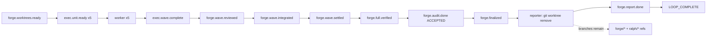

# parallel-forge Loop `primary-20260805-090210` 运行链路诊断报告

> **生成时间**: 2026-08-05（只读诊断）
> **诊断对象**: `/Users/pittcat/Dev/Rust/ralph-e2e/.ralph/`
> **对照 preset**: `presets/en/parallel-forge.yml` + `presets/schemas/parallel-forge.yml`
> **执行方式**: 主 Agent Phase 0 盘点、源码反查与证据汇总；`history_search=disabled`，未扫描历史文档。
> **Diagnostics 模式**: `LOGS_ONLY`
> **execution_capabilities**: `[supervisor, wave]`
> **报告仓库**: `ralph-orchestrator` 主仓

## 0. 产物盘点（Phase 0）

**execution_capabilities 推断结果**：`[supervisor, wave]`。

- `+supervisor`: `presets/en/parallel-forge.yml:3-4` 声明 `event_loop.supervisor.enabled: true`，且 run 中存在 `.ralph/supervisor.db`。
- `+wave`: preset instructions 含 `ralph wave emit` / `ralph wave verify`；可信 events 中 `exec.wave.complete`、`forge.wave.*` 含 `wave_id`。

| Tier | 路径 | 存在 | 行数/状态 | 备注 |
|---|---|---:|---:|---|
| S | `.ralph/current-events` | ✅ | 1 指针 | 唯一可信 events 源：`.ralph/events-20260805-090210.jsonl` |
| S | `.ralph/events-20260805-090210.jsonl` | ✅ | 26 | 含 5 个 `exec.unit.done`、1 个 `exec.wave.complete`、终态事件 |
| S | `.ralph/recovery.jsonl` | ✅ | 1 | `repair_dispatch` 信息级记录；无 payload/schema 拒收 |
| S | `.ralph/ledger.jsonl` | ✅ | 16 | 14 次 iteration/终止状态记录 |
| S | `.ralph/loops.json` | ✅ | `loops: []` | loop 已结束 |
| S | `.ralph/loop.lock` | ✅ | 空文件 | 终止后锁未持有；文件存在本身不是 active-lock 证据 |
| A | `.ralph/agent/tasks.jsonl` | ✅ | 10 | 10 个任务均 `closed` |
| A | `.ralph/agent/summary.md` | ✅ | 35 | 记录 `Completed successfully`、26 events |
| A | `.ralph/agent/handoff.md` | ✅ | 58 | 记录 10 个任务已完成、无 pending work |
| B | `.ralph/diagnostics/logs/*.log` | ✅ | 2 文件 | 无 timestamp session/orchestration，模式为 `LOGS_ONLY` |
| B | `.ralph/supervisor.db` | ✅ | SQLite | supervisor wave 账本存在，非缺失 |
| C | `.ralph/forge/<plan-key>/` | ✅ | 多份 | execution plan、worktree map、unit reports、review、settlement、finalization、audit 均存在 |
| C | `/Users/pittcat/Dev/Rust/ralph-e2e/.worktrees/` | ✅ | 仅目录 | unit/slot worktree 目录已移除，但 Git branch 仍存在 |

**实际 Git 残留**（run 终止后只读检查）：

- `forge/.../integration`
- `forge/.../unit-u01` 至 `forge/.../unit-u05`
- `ralph/primary-exec-w-1-0` 至 `ralph/primary-exec-w-1-4`
- `git worktree list --porcelain` 只剩主 worktree；因此问题是**残留 refs/branches**，不是 live worktree 目录。

**盲区声明**：`LOGS_ONLY` 没有 `agent-output.jsonl` 与 orchestration 级证据。OPAC 的逐 tool-call 合规性只能弱推断，单项置信度不超过 50；机制源码归因以 75 为本模式硬顶。未扫描 `docs/report/`、`docs/solutions/`、`docs/plans/`、`docs/brainstorms/`。

## 1. 结论摘要

### 1.1 健康度

- **判定**：部分偏离。wave worker、fan-in、串行集成、验证、审计和 LOOP_COMPLETE 均成功；终态 cleanup 只完成了目录/注册的清理，没有完成 branch refs 清理。
- **P0 / P1 / P2 数量**（均为 confidence≥门槛）：`0 / 1 / 0`。
- **最高优先级根因置信度**：P1-1 = **75/100**（LOGS_ONLY 模式封顶）。
- **历史复发**：`N/A (history disabled)`。

### 1.2 强制四问

| # | 问题 | 答案 | 一句证据 | 置信度 |
|---|---|---|---|---:|
| Q1 | 整体执行与 OPAC 是否合规？ | 编排执行 ✅；OPAC ⚠️ | 26 条可信 events 完成全链路；但 LOGS_ONLY 无法验证每次 emit 的 tool-call/precheck | 45（OPAC） |
| Q2 | 基座机制是否正常生效？ | ✅（wave 基座）/ ⚠️（清理边界） | `exec.wave.complete` 已注入，5 slot 完成；R13 对缺失 worktree 按 NotFound 幂等跳过 | 75 |
| Q3 | 编排是否合理、正常运行？ | ⚠️ | reporter 只执行 `git worktree remove --force`，preset 明文允许 cleanup 失败且不阻断终态；branch 生命周期未闭合 | 75 |
| Q4 | 问题归因：机制 vs 编排 vs agent？ | **preset + mechanism compound**，不是 worker/agent 主因 | preset 要求 reporter 清目录；Git helper 对 `ralph/*` 有删 branch 逻辑，但 reporter 绕过 helper，runner 对 NotFound 不再补删 | 75 |

### 1.3 根因一句话

本轮 reporter 把 worktree 目录移除了，却没有删除对应 branch；随后 runtime R13 看到 slot worktree 已不存在，将 `NotFound` 当作幂等成功，因此没有机会执行 branch 删除。**置信度 75/100**。

### 1.4 终态时序一致性

| 项目 | 内容 |
|---|---|
| **首轮终态（initial_terminal_status）** | 首轮成功：`forge.audit.done(verdict=ACCEPTED)` → `forge.finalized` → `forge.report.done(status=COMPLETED)` → `LOOP_COMPLETE` |
| **恢复状态（recovery_status）** | 无恢复；`recovery.jsonl` 只有 1 条 `repair_dispatch` 信息记录 |
| **最终代码状态（final_code_state）** | main 已到 `0b8ab02` 对应交付；目录 worktree 已移除；11 个相关 branch refs 仍存在 |
| **一致性告警** | 成功事件与代码交付一致，但“已清理”只对 worktree 目录成立，对 branch refs 不成立；报告自身在 §16/附录 G 已承认 `临时分支 保留` |

## 2. 执行链路对比图

关键事实：

1. `exec.wave.complete` payload 列出 5 个 `primary-exec-w-1-*` worktree；随后 `forge.wave.settled`、`forge.finalized` 均已 accepted。
2. 生成的 manager report 记录 10/10 `git worktree remove --force` 成功，但同一报告 §16/附录 G 明确写出“临时分支保留”。
3. 当前 `git worktree list` 只剩主 worktree，而 `git branch` 仍列出 6 个 forge branch + 5 个 `ralph/*` branch。

## 3. 历史问题上下文

`history_search=disabled`：`N/A (history disabled)`。

## 4. 证据清单

| ID | 描述 | 证据锚点 | 严重度初判 | 置信度初估 | 已计分证据项 | 证据缺口 |
|---|---|---|---|---:|---|---|
| DEV-001 | 终态 worktree 目录已清理，但 unit/integration/worker branch refs 未清理 | run events `events-20260805-090210.jsonl`；run Git refs；`docs/reports/2026-08-05-multi-sort-supervisor-e2e-manager-report.md:432-434` | P1 | 75 | Tier C 交叉验证 +10；preset 行号 +15；源码行号 +25；模式硬顶 75 | 无 FULL agent-output；无法审计 reporter 每个实际 tool call |
| DEV-002 | R13 在 worktree 已被 reporter 删除后只看到 NotFound，无法补删 `ralph/*` branch | `crates/ralph-cli/src/loop_runner/wave/supervisor_bridge.rs:594-641`；`crates/ralph-core/src/worktree.rs:248-277`；`crates/ralph-cli/src/loop_runner/runner.rs:2222-2236` | P1 | 75 | 源码行号 +25；events/报告双账本 +20；模式硬顶 75 | 缺针对 reporter-first 顺序的本次 FULL trace |

### 4.1 OPAC 逐 hat 审计表

| Hat | O | P | A | C | 证据 | 置信度 |
|---|---|---|---|---|---|---:|
| forge-dispatcher / executor | ✅ | ⚠️ | ✅ | ✅（主 events 可见） | LOGS_ONLY logs: wave detected/completed；events 含 5 ready/done | 45 |
| integrator / verifier / auditor | ✅ | ⚠️ | ✅ | ✅（业务终态可见） | events `forge.wave.integrated` / `forge.wave.verified` / `forge.audit.done` | 45 |
| finalizer | ✅ | ⚠️ | ✅ | ✅（`forge.finalized` accepted） | events + `finalization.md` | 45 |
| reporter | ✅ | ⚠️ | ⚠️ | ⚠️ | report 附录有 cleanup 结果，但无 agent-output/tool-call；branch refs 仍存 | 45 |

> `LOGS_ONLY` 下 Confirm 通常不可验证；此处的“✅”只表示业务 event/artifact 结果可对账，不代表 OPAC tool-call 完整合规。

## 5. 问题归因表

| 优先级 | 问题 | 根因分类 | **置信度** | 证据 DEV | 已计分证据项 | 历史关联 | 加深轮次 |
|---|---|---|---:|---|---|---|---|
| P1 | 成功终态只清理 worktree，不清理多余 branch refs；reporter 绕过会删除 `ralph/*` 的统一 helper，R13 又因 `NotFound` 不再补偿 | **compound：preset 60% + mechanism 40%** | **75** | DEV-001, DEV-002 | 源码行号 +25；preset 行号 +15；双账本 +20；Tier C +10；LOGS_ONLY 封顶 | `N/A (history disabled)` | 第1轮：preset instructions + Git helper + runner/bridge source trace → 75 |

## 6. 修复建议

### 6.1 短期（operator workaround）

在确认当前 loop 已结束且没有其它 worktree 使用这些 refs 后，手动删除本轮明确列出的 11 个 branch refs；不要对整个仓库使用宽泛 glob。删除前先用 `git branch --contains`、`git worktree list` 和报告中的 target/integration SHA 做人工确认。

### 6.2 中期（preset / schema / instructions）

把 reporter 的 cleanup 从“agent 自己执行裸 `git worktree remove`”改成受控、可审计的统一动作：至少按 worktree map 同时记录 `worktree remove` 与 branch delete 结果，并把 branch 清理结果作为 report 附录字段。不要继续把“branch 保留”写成成功终态下的隐含例外。

### 6.3 长期（机制 / 底座）

提供 runner/bridge 统一的 forge resource cleanup API，输入来自 `worktree-map.yml`/supervisor store，按资源类型删除 worktree 与 branch，并保证 reporter-first 与 runner-first 两种顺序都幂等。R13 不能只依赖 live path：当 path 已 `NotFound` 时仍应从绑定的 branch/name 做一次受限 branch cleanup；同时应保留 cleanup failure 的结构化终态证据。相关性置信度：75。

## 7. 未核实疑点

| 候选问题 | 当前置信度 | blocked_by | 已做加深 |
|---|---:|---|---|
| reporter 是否在 emit `LOOP_COMPLETE` 前还是后执行 cleanup | 55 | `LOGS_ONLY` 缺 agent-output/tool-call 时序 | 已查 events、summary、manager report、logs；不影响 branch 残留事实与根因结论 |
