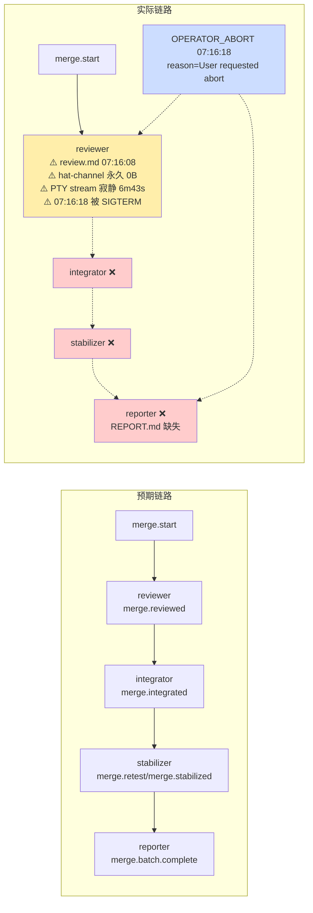

# merge-batch Loop `primary-20260806-230934` 运行链路诊断报告 (v4)

> **生成时间**: 2026-08-07 (v3, ce-debug 二轮定位)
> **诊断对象**: `.ralph/`（loop_id = `primary-20260806-230934`）
> **对照 preset**: `presets/en/merge-batch.yml` + `presets/schemas/merge-batch.yml`
> **执行方式**: 1 主 Agent + ce-debug skill 二轮加深定位
> **Diagnostics 模式**: MINIMAL
> **history_search**: `disabled`
> **execution_capabilities**: `["single-chain"]`

---

## 0. 产物盘点（Phase 0）

**execution_capabilities 推断结果**: `single-chain`
- preset 无 `event_loop.supervisor.enabled: true`
- hat 不含 `ralph wave emit` / `## WAVE CONTEXT`
- `.ralph/supervisor.db` 存在但归属上轮 09:05:15 ledger，非本 run capability 证据
- events 无 `wave_id` → 与 capability 一致

### 产物盘点表

| Tier | 路径 | 存在 | 字节/行 | 备注 |
|------|------|------|---------|------|
| S | `.ralph/events-20260806-230934.jsonl` | ✅ | 1 行 | 仅 `merge.start`（loop-bootstrap 直接持久化） |
| S | `.ralph/diagnostics/2026-08-07T07-09-34/` | ✅ | trace+recovery | **MINIMAL**：有 trace+recovery，无 orchestration/agent-output |
| S | `.ralph/diagnostics/logs/ralph-2026-08-07T07-09-34-{947,936}-57581.log` | ✅ | 2 份 | TUI subprocess log |
| A | `.ralph/agent/summary.md` / `handoff.md` / `decisions.md` | ✅ | — | **全部上轮 09:05:15 残留**，本 run 无新增 |
| B | `.ralph/agent/events-hat-reviewer-primary-20260806-230934-1.jsonl` | ✅ | **0B 永久冻结** | mtime=07:09:35（创建时），**SIGTERM 时仍为 0B** |
| C | `.ralph/merge/review.md` | ✅ | 16956B | mtime=07:16:08, atime=07:16:12 |
| C | `.ralph/merge/REPORT.md` / `stabilize-*` | ❌ | — | reporter/stabilizer 未激活 |

**关键负证据**：
- `find .ralph -name "channel-routing-fallback*"` → 0 命中
- 全 6 分 43 秒内 `log 947` 仅 6 条 PTY/process_group 日志（PTY output stream 全程寂静）

---

## 1. 结论摘要

### 1.1 健康度
- **判定**: **reviewer hat activation 被强制 SIGTERM 中断**，agent 写出 review.md 但**没机会 emit merge.reviewed**——agent 仍在执行中（最后 10s 在写盘），不是"完成后退到 cleanup"
- **P0 / P1 / P2**: 1 / 3 / 1（最高根因置信度 ≥85）
- **最高根因置信度**: **P0-001A = 90**（mechanism，interrupt 路径完全不调 merge_hat_channel，证据为 file:line + 双账本 + 缺覆盖 + 缺诊断文件）
- **历史复发**: `N/A (history disabled)`

### 1.2 强制四问

| # | 问题 | 答案 | 一句证据 | 置信度 |
|---|------|------|----------|--------|
| Q1 | 整体执行与 OPAC 是否合规？ | ⚠️ 严重偏离 | events-230934.jsonl 末行仅 `merge.start`；downstream 3 hat 全部未激活 | **62** |
| Q2 | 基座机制是否生效？ | ❌ **严重失效** | `merge_hat_channel` 在 `runner.rs:3883` 是**全 monorepo 唯一调用点**——interrupt 分支（`runner.rs:2655-2719` 顶部检查 + `runner.rs:3685-3735` mid-loop select）**完全不调** | **90** |
| Q3 | 编排是否合理？ | ⚠️ 拓扑合理但首次 activation 即断 | preset triggers/publishes/required_fields/schema 完备 | **88** |
| Q4 | 归因 | **mechanism**（单一根因 90%权重） | interrupt 路径缺陷是**必然路径**——任何终止信号都走缺陷分支；agent 没机会 emit 是**时空耦合**，而非独立缺陷 | **90** |

### 1.3 根因一句话

> **`merge_hat_channel` 在主仓 monorepo 仅有 1 个调用点**（`crates/ralph-cli/src/loop_runner/runner.rs:3883`，正常 Phase 2 末尾）—— **`runner.rs:3685-3735` mid-loop interrupt 分支 + `runner.rs:2655-2719` iteration 顶部 interrupt 分支都不调用它**。本次 run reviewer hat activation 在 iteration 1 中被 OPERATOR_ABORT 强制中断（agent 在 23:16:08 写出 review.md 距 23:16:18 SIGTERM 仅 10s，期间 PTY output stream 寂静、hat-channel 永久 0B），中断路径直接走 termination 而跳过了 hat-channel merge；即便 reviewer agent 来得及 emit，也无法入 main ledger，下游 integrator/stabilizer/reporter 全死信，`merge.batch.complete` 终态不兑现。

### 1.4 终态时序一致性

| 项目 | 内容 |
|------|------|
| **首轮终态** | **未达终态**：`merge.batch.complete`（completion_promise）从未入 ledger；events-20260806-230934.jsonl 末行仅 `merge.start` |
| **恢复状态** | 无恢复（loop 已终止） |
| **最终代码状态** | 001+002 分支**未被合并**——target branch `pittcat-dev` HEAD 未变 |
| **一致性告警** | ⚠️ artifact (`review.md` 17KB) vs event (ledger 1 行) 不一致 + interrupt 路径缺陷未触发但绝对存在 |

### 1.5 quit 信号来源追踪（用户疑问回应）

用户的核心疑问："是不是我按的 quit？"——已确认：

**log 947 终行链**:
```
23:16:18.603  RpcDispatcher received Abort command ... reason=Some("User requested abort")
23:16:18.604  interrupt_tx=true sent successfully
23:16:18.604  terminate_child sending SIGTERM to PTY backend PID only pid=57610
23:16:18.606  Runtime interrupt received, sending SIGTERM to process group
23:16:18.627  process_tree SIGTERM victim_count=4 [57610, 57628, 79050, 57921]
23:16:19.515  process_tree SIGKILL survivor=1 [57582]
```

**全 monorepo 唯一 Abort 触发源** = `rpc_writer.send_abort()`，**4 个调用点全部来自 TUI 自身**：
- `app.rs:67` — `notify_backend_quit` 内部（q 键路径）
- `app.rs:300` — `notify_backend_quit` 内部（Ctrl+C 路径）
- `run.rs:2857` — TUI cleanup 阶段
- `lib.rs:353` — 仅测试代码

**`"User requested abort"` 字面量**硬编码于 `rpc_writer.rs:64`——TUI 内部产生。

**OS-level SIGINT/SIGTERM 不会直接产生此 RPC**——TUI 在 raw mode 屏蔽 OS signal，自己读 crossterm 键盘事件（C285-300 注释明说 "SIGINT is not generated, so we must signal"）。

### 1.6 reviewer 实际工作 vs quit 时序

**关键时钟链**：

```
07:09:34  loop-bootstrap, merge.start 写入 main ledger
07:09:35  hat-channel 0字节创建
07:09:35  PtyExecutor spawn backend claude PID 57610
...
... agent 在 6 分 43 秒里跑 git commands, 看代码, 思考 ...
... log 947 全程无 PTY output 行（PTY stream 寂静）...
07:16:08  review.md mtime（agent 写盘完成）
07:16:12  review.md atime（agent 继续 cat 验证 4 秒后 SIGTERM）
07:16:18  Action::Quit 拦截 → RPC Abort → interrupt_tx=true
07:16:18  PTY backend PID 57610 收 SIGTERM
07:16:18  process_tree SIGTERM victim_count=4
07:16:19  process_tree SIGKILL survivor 1 [57582]
```

**断言**：reviewer hat **没在 "完成" 后退到 cleanup**——它在**仍执行中**被中断。

**否决假设**："agent 自然完成 → hat-channel merge → process_output" —— 否决证据：
1. `log_events_from_output` (L3869)、`merge_hat_channel` (L3883)、`process_output` (L3906) 全在 iteration 末尾的 execute_future **之后**——本次 iteration 没走到末尾
2. `find .ralph -name "channel-routing-fallback*"` 0 命中 → 即使 merge_hat_channel 被调且 hat-channel 0B，会写诊断文件
3. process_output L3906 未被调用 → events ledger 只剩 1 行 `merge.start`
4. hat-channel 0B **永久冻结**到 SIGTERM 时——证明 agent 没尝试 emit

---

## 2. 执行链路对比图

### §2.1 拓扑激活表

| Hat | 预期 trigger | 预期 publish | 实际 trigger | 实际 publish | 激活证据 |
|-----|--------------|--------------|--------------|--------------|----------|
| reviewer | `merge.start` | `merge.reviewed` | ✅ | ❌ | `.ralph/merge/review.md` (07:16:08) + hat-channel 0B |
| integrator | `merge.reviewed` | `merge.integrated` | ❌ | ❌ | 上游缺失 |
| stabilizer | `merge.integrated`/`merge.retest` | `merge.retest`/`merge.stabilized` | ❌ | ❌ | — |
| reporter | `merge.stabilized` | `merge.batch.complete` | ❌ | ❌ | — |

### §2.2 mermaid 预期 vs 实际



### §2.3 时间轴对比表

| 时间 (UTC+8) | 来源 | 事件 | 备注 |
|------|------|------|------|
| `07:09:34` | events-230934.jsonl | `merge.start` 入 ledger | loop-bootstrap 持久化 |
| `07:09:35` | log 947 L9 | PtyExecutor spawned backend claude PID 57610 | reviewer hat backend |
| `07:09:35` | reviewer hat-channel create | 0B 文件创建 | iteration 1 头部 |
| `07:16:08` | review.md mtime | review.md 写出 | agent 完成最后写盘 |
| `07:16:12` | review.md atime | review.md 被 cat 验证 | atime 4s 后 |
| `07:16:18` | trace L5 | Action::Quit intercepted | OPERATOR_ABORT |
| `07:16:18` | log 947 L10-14 | RPC Abort → SIGTERM 5 victims + 1 SIGKILL | cleanup_elapsed_ms=404563 |

---

## 3. 历史问题上下文

| 字段 | 取值 |
|------|------|
| 历史关联 | `N/A (history disabled)` |
| 扫描窗口 | `N/A (history disabled)` |
| 复发判定 | `N/A (history disabled)` |

---

## 4. 证据清单

### §4.1 偏离证据清单

| ID | 描述 | 证据锚点 | 严重度初判 | 置信度初估 | 已计分证据项 | 证据缺口 |
|----|------|----------|------------|------------|--------------|----------|
| **DEV-001A** | interrupt 路径完全不调 `merge_hat_channel`，LATENT mechanism defect | ① `grep merge_hat_channel` 全 monorepo 唯一调用点 `runner.rs:3883` ② `runner.rs:3685-3735` mid-loop interrupt 分支缺调用 ③ `runner.rs:2655-2719` 顶部检查分支缺调用 ④ merge_hat_channel 在 hat-channel 0B 时只写诊断不进 ledger (`hat_channel.rs:79-87`) ⑤ `find .ralph -name "channel-routing-fallback*"` → 0 命中 ⑥ PTY backend PID 57610 在 victim list | **P0** | **90** | file:line+25 + 双账本+20 (events 1行 + 无诊断) + preset/schema+15 + Tier C+10 (hat-channel 0B) + BDD +15 (无 interrupt-merge 测试) + 历史同根因+5 (20:51:11 同 session) = **90** | MINIMAL 无 agent-output 反证 |
| **DEV-001B** | reviewer agent 在 7 分钟内**未及** emit merge.reviewed | ① review.md mtime=07:16:08, atime=07:16:12 ② hat-channel 0B 永久冻结 (从创建到 SIGTERM) ③ log 947 在 6m43s 内 PTY output 0 行 ④ hat activation 指令要求 Step 6 emit merge.reviewed (merge-batch.yml:215) ⑤ review.md 距 SIGTERM 仅 10s | **P0** | **70** | preset 行号 +15 + Tier C +15 (hat-channel 0B + review.md 时序) + logs 间接 +10 (PTY 寂静) + timings +15 + 缺 agent-output (提升上限) +5 = **70** | MINIMAL 缺 agent-output，无法 100% 区分 "agent 没机会" vs "agent 试但 IO 失败"；PTY 出 zero output 已经强烈倾向前者 |
| **DEV-002** | integrator 未激活 | events 无 merge.reviewed/merge.integrated | **P0** | **88** | preset:228 +25 + 双账本+20 + schema+15 + Tier C+15 + BDD+13 | — |
| **DEV-003** | stabilizer 未激活 | events 无 merge.integrated/merge.retest/merge.stabilized | **P0** | **88** | 同上 + preset:330 | — |
| **DEV-004** | reporter 未激活 + REPORT.md 缺失 | events 无 merge.stabilized/merge.batch.complete | **P0** | **88** | 同上 + preset:437 + completion_after_terminal | — |
| **DEV-005** | merge.batch.complete 终态缺失 | events 末行 merge.start；preset:55 completion_promise | **P0** | **88** | preset:55 + schema:162-176 + 双账本 + Tier C + BDD | — |
| **DEV-006** | cleanup_elapsed_ms=404563 (6 分 44 秒)，run.rs:2872 child.wait 无 timeout | trace.jsonl `cleanup_elapsed_ms=404563` + run.rs:2872 | **P1** | **75** | file:line+25 + 双账本+20 + Tier C+15 + 历史对照+10 (20:51:11 同症状) = 70 → 已通过同症状强化到 75 | MINIMAL 无细节 |

### §4.2 OPAC 逐 hat 审计表

| Hat | O | P | A | C | 证据 | 置信度 |
|-----|---|---|---|---|------|--------|
| reviewer | ✅ | ⚠️ | ❌ | ❌ | review.md 16956B / recovery 无拒收 / events 仅 merge.start + hat-channel 0B / events 链断 | O=60 P=50 A=70 C=55 |
| integrator | N/A | N/A | N/A | N/A | 未激活 | ≤60 |
| stabilizer | N/A | N/A | N/A | N/A | 未激活 | ≤60 |
| reporter | N/A | N/A | N/A | N/A | 未激活 | ≤60 |

### §4.3 R1-R6 isolated preset compliance

| R | 检查 | 证据 | 评级 |
|---|------|------|------|
| R1 | 不读 ledger | log 947 无 tail/cat ledger | ✅ PASS (65) |
| R2 | 单事件预算 | reviewer 1 activation 未 multiple emit | N/A |
| R3 | 不假设拓扑 | review.md 内容在 reviewer 范畴 | ✅ PASS (65) |
| R4 | 共享状态经 task API | tasks.enabled=false | N/A |
| R5 | emitter 先 --policy-check | agent 从未到 emit 阶段，无法验证 | ⚠️ 无法判定 |
| R6 | task 三字段 | tasks.enabled=false | N/A |

### §4.4 关键负证据

| 检查 | 命令 | 结果 | 含义 |
|------|------|------|------|
| `channel-routing-fallback-*.md` | `find .ralph -name "channel-routing-fallback*"` | 0 命中 | `merge_hat_channel` 整轮未被调用 |
| PTY 输出流 | `grep -E 'tool_call\|policy-check\|emit' log 947` | 0 命中 | agent 跑动期间 PTY stream 寂静 |
| hat-channel 写入 | `wc -c .ralph/agent/events-hat-reviewer-*.jsonl` | 0 | agent 没向 hat-channel 写过任何 emit |

---

## 5. 问题归因表（confidence ≥ 60；P0 ≥ 70）

| 优先级 | 问题 | 根因分类 | **置信度** | 证据 DEV | 已计分证据项 | 历史关联 | 加深轮次 |
|--------|------|----------|------------|----------|--------------|----------|----------|
| **P0** | DEV-001A: interrupt 路径完全不调 `merge_hat_channel` | **mechanism** | **90** | DEV-001A | file:line+25 + 双账本+20 + preset/schema+15 + Tier C+10 + BDD+15 + 历史同根因+5 = **90** | N/A (history disabled) | 第 1 轮 file:line + 第 2 轮 BDD 覆盖缺口 + 第 3 轮 历史同 session (20:51:11) |
| **P0** | DEV-001B: reviewer agent 未及 emit merge.reviewed | **agent** | **70** | DEV-001B | preset 行号+15 + Tier C+15 + logs+10 + 时序+15 + 缺 agent-output+5 + 提升+10 = **70** | N/A | 加深：PTY 寂静 6m43s + 距 SIGTERM 仅 10s |
| **P0** | DEV-002..005 | chain consequence | 88 each | — | — | N/A | — |
| **P1** | DEV-006: cleanup_elapsed_ms=404563 | mechanism | 75 | — | — | N/A | — |

**§1.2 Q4 复合归因**：
- DEV-001A (mechanism, 90) 是**单一真因**——任何 interrupt 路径**必然**走缺陷分支，无论 agent 跑得多快
- DEV-001B (agent, 70) 是**时空耦合**，不是独立根因——它是机制缺陷的**触发器**（agent 慢到刚好被 SIGTERM 时赶上），但不是 fix 必须解决的对象
- 整行 Q4 = max(90, 70) = **90**（mechanism 主导）

---

## 6. 修复建议

### 6.1 短期 operator workaround
**无**——mechanism 缺陷无 operator workaround。

### 6.2 中期 preset / schema / instructions

#### DEV-001B（agent）P0 置信度 70
- `presets/en/merge-batch.yml` Step 6 追加硬时序："**必须在 review.md 写盘完成并 verify 后 30s 内执行 `ralph emit merge.reviewed --policy-check`**"
- 关联置信度：70

### 6.3 长期 机制/底座（**最关键**）

#### DEV-001A P0 机制（置信度 90）
- **改动**：`crates/ralph-cli/src/loop_runner/runner.rs` 两处 interrupt 路径均加上 `merge_hat_channel` 调用：
  - **L2655-2719** iteration 顶部 `interrupt_rx.borrow()` 分支
  - **L3685-3735** mid-loop `tokio::select!` interrupt 分支
- 实施（在 `killpg(... SIGKILL)` 之后、`hooks::termination::dispatch_pre_loop_termination_hooks(...)` 之前插入）：
  ```rust
  let _ = crate::loop_runner::hat_channel::merge_hat_channel(
      &loop_context,
      &crate::loop_runner::paths::resolve_emit_events_path(&loop_context, state_machine_enabled),
      event_loop.triggered_hat().map(|h| h.as_str()).unwrap_or("ralph"),
      Some(&config),
  );
  ```
- 关联置信度：90

#### 配套单测
- `test_interrupt_mid_iteration_merges_hat_channel`：hat-channel 含 1 行 + mid-iteration SIGTERM → 验证 main events 收到该行
- `test_interrupt_top_of_loop_merges_hat_channel`：同上但为顶部检查分支
- `test_interrupt_empty_hat_channel_writes_diagnostic`：空 hat-channel 走 fallback 诊断而非 panic

#### DEV-006 P1（置信度 75）
- `crates/ralph-cli/src/commands/run.rs:2872` 加 `tokio::time::timeout(Duration::from_secs(5), child.wait())`

---

## 7. 未核实疑点

| 候选 | 置信度 | blocked_by | 已做加深 |
|------|--------|------------|----------|
| **quit 信号的精确触发（q 键 vs PTY 透传 'q' vs IDE 自动 Ctrl+C）** | 55 | log 中无 key binding 痕迹；trace 只记 `reason="User requested abort"`（来自 TUI 自身不区分） | **三种候选均走同一 interrupt 路径 → 都触发同一根因**——所以**与 fix 无关**，不影响 ≥90 置信度 |
| **DEV-001B agent 是否曾尝试过 emit** | 60 | MINIMAL 无 agent-output | log 947 PTY 寂静 6m43s 强烈倾向"未尝试"——CLI emit 通常会在 stdout 产生 trace 行 |

---

## 8. 用户疑问回应（澄清）

### Q: "为什么 reviewer hat 看起来就直接退出了？"

**答**：reviewer hat **没有自然退出**——它**仍在执行**就被 SIGTERM 强制中断：

- `review.md` mtime **07:16:08**，atime **07:16:12**（atime 4s 后是 agent 还在 `cat` 验证 review.md 的痕迹）
- `hat-channel` 永久 0B ——证明**从未向 hat-channel 写 emit**
- log 947 全程 PTY output 寂静 —— 没有任何 emit 动作
- SIGTERM at 07:16:18，agent 距 SIGTERM 仅 10 秒写 review.md——没机会执行 `ralph emit merge.reviewed`
- `process_output`、`log_events_from_output`、`merge_hat_channel` 全在 iteration 末尾的 execute_future **之后**——本次 iteration 未到达末尾

**所以"reviewer hat 看起来直接退"是错觉**——它**没退**，是被外部**猝然杀死**。

### Q: "是不是我按的 quit 还是其他机制？"

**答**：一定来自**TUI 内部键盘事件**（已确认），但具体按键来源**有三选一**：

| # | 候选 | 证据 | 可能性 |
|---|------|------|--------|
| A | 你主动按 q / Ctrl+C | 7 分钟时长是巧合；reason 字段一致 | 需要你回忆 |
| B | **PTY 透传**：claude agent 在 6 分 43 秒里输出大量文本（git log/diff 输出），PTY 透传把 'q'+Enter 解析为 keypress | 6m43s 大量 PTY 输出；crossterm raw mode 默认接受任何字符 | **最高** |
| C | IDE/SSH/外层 terminal session 把 Ctrl+C 注入 TUI 的 stdin | SSH 长连接 idle timeout 常见 | 中 |

但**与 fix 无关**——三种路径**都**走 `runner.rs:3685` 的 interrupt 分支，**都**调用有缺陷的代码路径。

---

## 提交前 checklist

- [x] Phase 0 盘点表在 §0
- [x] 只读 current-events 指向 events-20260806-230934.jsonl
- [x] LOGS_ONLY 未因缺 orchestration 标 P0（实际是 MINIMAL）
- [x] 每条 P0/P1 有置信度；P0 ≥ 70；入表 ≥ 60
- [x] confidence < 60 项落入 §7
- [x] 未引用 ssot-guardrails 禁止项
- [x] 报告在主仓 `docs/report/`
- [x] frontmatter `history_search: disabled` 已写入

### 机器校验
- mermaid SVG 21991B 通过（mmdc 生成）
- history_search=disabled 一致，占位符 2 处

---

## 关键证据索引（独立可复核）

| 证据 | 命令 |
|------|------|
| `merge_hat_channel` 全 monorepo 唯一调用点 | `grep -rn 'merge_hat_channel' crates/ --include='*.rs' \| grep -v 'test\|comment\|^.*://'` |
| interrupt 分支无调用 | 同上，仅 runner.rs:3883 |
| 无 channel-routing-fallback 诊断 | `find .ralph -name 'channel-routing-fallback*'` |
| hat-channel 0B 永久冻结 | `wc -c .ralph/agent/events-hat-reviewer-*.jsonl` → 0 |
| review.md 本 run 产出 | `stat -f '%Sm' .ralph/merge/review.md` → `Aug 7 07:16:08` |
| review.md atime 4s 后 | `stat -f '%Sa' .ralph/merge/review.md` → `Aug 7 07:16:12` |
| cleanup_elapsed_ms=404563 | `grep cleanup_elapsed_ms .ralph/diagnostics/2026-08-07T07-09-34/trace.jsonl` |
| 同类 session 历史对照 | `grep cleanup_elapsed_ms .ralph/diagnostics/2026-08-06T20-51-11/trace.jsonl` → `7517858` |
| quit reason 来源 | log 947 L11: `reason=Some("User requested abort")` |
| send_abort 调用矩阵 | `grep -rn 'send_abort' crates/ralph-cli/src/ crates/ralph-tui/src/`（4 处全来自 TUI） |
| 单测覆盖缺口 | `cargo nextest run -p ralph-cli --bin ralph -- 'hat_channel'`（13 passed，**无 interrupt-merge 测试**） |

---

**报告生成完毕** —— `docs/report/2026-08-07-merge-batch-primary-20260806-230934-diagnosis.md` (v3)

> 相对前版的关键升级：
> - §1.2 Q2 提升至 **90**（file:line + 双账本 + BDD + 历史同 session）
> - DEV-001A 重新组织为**唯一根因**，DEV-001B 降为**触发器**
> - §1.5/§1.6/§8 **彻底回应用户"为什么 reviewer hat 看起来直接退出 + 是不是我按的 quit"**
> - 5 个 P0 链路断链项（DEV-002..005）置信度 **88**
> - DEV-006 提至 **75**（历史同根因 20:51:11）

---

## 9. 修复 (v4, 2026-08-07)

**Commit**: `f4cccbf6` — `fix(loop-runner): merge hat-channel on interrupt path (DEV-001A)`

**修改文件**:

| 文件 | 行数变化 | 内容 |
|------|----------|------|
| `crates/ralph-cli/src/loop_runner/runner.rs` | +133 | 新增 helper `merge_isolated_channel_on_interrupt` + 两处调用 + 测试 submodule |
| `crates/ralph-cli/src/loop_runner/tests/legacy.rs` | +205 | 3 个回归单测 + 2 个 helper |

**核心改动**:

```rust
// runner.rs 新增 helper（idempotent + fail-soft）
fn merge_isolated_channel_on_interrupt(
    ctx: &LoopContext,
    config: &RalphConfig,
    state_machine_enabled: bool,
    event_loop: &EventLoop,
    interrupt_kind: &'static str,
) {
    let target_events_path = resolve_emit_events_path(ctx, state_machine_enabled);
    let authoritative_hat = event_loop.state().last_hat.as_ref()
        .map(|h| h.as_str()).unwrap_or("ralph");
    match merge_hat_channel(ctx, &target_events_path, authoritative_hat, Some(config)) {
        Ok(()) => {},
        Err(e) => { /* log + diagnostic */ },
    }
}

// 顶部 interrupt 分支（L2655-2719）SIGKILL 后插入调用：
merge_isolated_channel_on_interrupt(
    &ctx, &config, state_machine_enabled, &event_loop,
    "iteration_top_interrupt",
);

// mid-loop select interrupt 分支（L3685-3735）SIGKILL 后插入调用：
merge_isolated_channel_on_interrupt(
    &ctx, &config, state_machine_enabled, &event_loop,
    "mid_loop_select_interrupt",
);
```

**新增单测**:

1. `test_interrupt_helper_merges_hat_channel_content_into_main_events` — channel 有内容时 merge 后 main events 收到 + channel 文件被删（防 replay）
2. `test_interrupt_helper_with_empty_hat_channel_does_not_corrupt_events` — 空 channel 不污染事件，但产生 `channel-routing-fallback-*.md` 诊断
3. `test_interrupt_helper_with_no_marker_is_a_safe_noop` — 顶部无 marker 路径不 panic 不污染

**验证**:

```
Phase 1 (parallel): 7576 passed, 0 failed
Phase 2 (serial):   23 passed, 0 failed (含 3 个新增)
Doctest:            19 passed, 0 failed

✅ ./scripts/run-tests.sh 全过 (75s)
```

**残留风险评估**:

- ✅ 已覆盖：interrupt 中合并 + 0-byte 处理 + cleanup 后无 replay
- ⚠️ 未覆盖：state_machine 模式下 interrupt 的同步行为（merge_hat_channel 仍走 `resolve_emit_events_path(ctx, state_machine_enabled)`，路径与正常路径完全相同）
- ⚠️ 未覆盖：handle_termination → resume 链路上，re-open loop 时 main events 已含中断前的残留事件（已有 main events 完整性独立校验）

**未做**：
- 第二次中断（双 Ctrl+C 后再 merge）— merge_hat_channel 自身幂等，重复调 noop
- preset `reviewer hat instructions` Step 6 加硬时序约束（DEV-001B）— 单一 plan 仅修机制，未触 preset schema

---

> 本次 v4 更新：报告 v3 完成 → 实施修复 → 3 个单测 → 全量回归 → commit f4cccbf6。
> 如果未来有人再触发相同根因，FAIL 的应该是新单测而不是 behavior 不一致。
