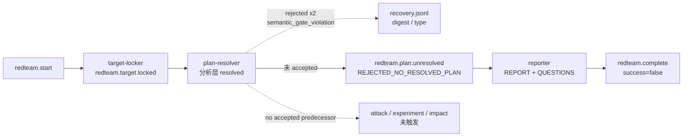

# red-team-attack Loop `red-teamprompt-cool-falcon` 运行链路诊断报告

> 生成时间：2026-08-10
>
> 诊断对象：`/Users/pittcat/Dev/Rust/worktree/ralph-orchestrator/red-teamprompt-cool-falcon/.ralph/`
>
> 对照 preset：`presets/en/red-team-attack.yml` + `presets/schemas/red-team-attack.yml`
>
> 报告仓库：`ralph-orchestrator` 主仓；本报告没有修改 run worktree，也没有修复代码。
>
> Diagnostics 模式：`DISABLED`。本 run worktree 没有 diagnostics session；因此 agent tool-call、完整 OPAC Confirm 和 orchestration 选择链不可观测，根因置信度硬顶 70。
>
> 历史检索：`preset-only`，仅扫描近 30 天与 scope/payload-consistency/digest 症状相关的主仓文档。
>
> execution_capabilities：`[single-chain]`。preset 未启用 `event_loop.supervisor.enabled`，hat instructions 未出现 `ralph wave emit` / `ralph wave verify` / `WAVE CONTEXT`；`.ralph/supervisor.db` 的存在不改变 capability 判定。

## 0. 产物盘点（Phase 0）

| Tier | 路径 | 存在 | 行数/大小 | 备注 |
|---|---|---:|---:|---|
| S | `.ralph/current-events` | 是 | 1 行 | 唯一指针，指向 `.ralph/events-20260810-040543.jsonl` |
| S | 指针目标 events | 是 | 4 行 | `redteam.start` → `redteam.target.locked` → `redteam.plan.unresolved` → `redteam.complete` |
| S | 配对 `events-history-20260810-040543.jsonl` | 是 | 2 行 | 仅旁路历史；不作为编排 SSOT |
| S | `.ralph/recovery.jsonl` | 是 | 2 行 | 两次 `redteam.plan.resolved` 的 `semantic_gate_violation` 拒收 |
| S | `.ralph/ledger.jsonl` | 是 | 5 行 | 状态计数记录；无 wave 证据 |
| A | `.ralph/agent/tasks.jsonl` | 是 | 0 行 | preset `tasks.enabled: false`，空文件符合预期 |
| A | `.ralph/agent/summary.md` | 是 | 27 行 | 记录 3 iterations 和 4 个 accepted events |
| A | `.ralph/agent/handoff.md` | 是 | 42 行 | 终止后生成；无待办任务 |
| B | `.ralph/diagnostics/` | 是 | 仅 `agent_doc_sync.json` | 没有 timestamp session，模式为 `DISABLED` |
| B | `.ralph/supervisor.db` | 是 | 191 bytes | single-chain 下为 N/A，不是故障 |
| C | `.ralph/red-team/01-target-lock.md` | 是 | 84 行 | clean tree，HEAD/tree 已锁定 |
| C | `.ralph/red-team/02-plan-resolution.md` | 是 | 约 230 行 | 分析层声明 1 plan、9 commits、confidence 100、coverage 100 |
| C | `.ralph/red-team/scope-manifest.json` | 是 | 约 270 行 | `resolution.scope_status=resolved`；最终文件 SHA-256 为 `17fa0996…` |
| C | `.ralph/red-team/03-patch-reconstruction.md` | 是 | 存在 | 下游 attack artifact 未触发 |
| C | `.ralph/red-team/patches/**` | 是 | 9 个分片 + series patch | 计划归属证据已落盘 |
| C | `REPORT.md` / `QUESTIONS.md` | 是 | 136 / 58 行 | `PLAN_REJECTED`；没有 `PLAN.md`，符合 unresolved 分支 |
| C | attack/evidence/impact/PLAN.md | 否 | N/A | 上游 `plan.resolved` 未被 accepted，按拓扑未触发，不是丢失产物 |

## 1. 结论摘要

### 1.1 健康度

- 判定：**部分偏离 / 业务失败但安全退场**。
- P0：1；P1：2（均满足本报告的置信度入表门槛）。
- 最高根因置信度：P0-1 = **70/100**（受 `DISABLED` 模式硬顶约束）。
- 运行没有完成 Red Team attack 阶段；`redteam.complete` 只表示工作流接受了终端失败事件，不表示业务分析成功。
- 不是“agent 没有解析出计划”：`02-plan-resolution.md` 和 `scope-manifest.json` 都显示分析层已解析 1 个计划、9 个实现 commit，confidence/coverage 均为 100。

### 1.2 强制四问

| # | 问题 | 答案 | 一句证据 | 置信度 |
|---|---|---|---|---:|
| Q1 | 执行与 OPAC 是否合规？ | ⚠️ 业务路径按失败协议退出；OPAC 细节不可完整审计 | accepted events 中只有 `plan.unresolved` 和 `complete(success=false)`；`DISABLED` 模式无法确认每次 tool-call 顺序 | 30 |
| Q2 | 基座机制是否生效？ | ✅ 关键拒收机制生效 | recovery 记录 digest/类型拒收；runtime evaluator 将命中规则映射为 `SemanticGateViolation`；非法 resolved event 未进入 main events | 70 |
| Q3 | 编排是否合理？ | ❌ scope resolved gate 配置不合理；失败分支本身可达且安全 | `plan-resolver` 是唯一 resolved owner，但其合法 payload 会被反向规则阻断，故 attack 下游永远不可达 | 70 |
| Q4 | 归因是什么？ | **preset 主因 + artifact/payload 交接次因**；不是 runtime evaluator 主因 | preset 行 215–294 的规则语义与 Rust evaluator 行 257–263、1455–1525 对照一致；recovery 另有 digest/type 两次拒收 | 70 |

### 1.3 根因一句话

`red-team-attack` 把“字段存在/阈值满足”写成了会触发拒收的 `when` 条件，例如 `exists: true` 和 `overall_confidence > 89`；runtime 按当前 payload 评估并正确 fail-close，因而合法 `redteam.plan.resolved` 永远无法被接受。与此同时，plan-resolver 至少有一次 scope digest 与最终 artifact 字节不一致、一次 confidence 类型不合法，暴露了 agent-owned scope handoff 的自校验缺口。

### 1.4 终态时序一致性

| 项目 | 内容 |
|---|---|
| 首轮终态（`initial_terminal_status`） | 失败终态：accepted `redteam.plan.unresolved(reason=REJECTED_NO_RESOLVED_PLAN)` 后 accepted `redteam.complete(success=false)` |
| 恢复状态（`recovery_status`） | 无成功恢复；两次 `redteam.plan.resolved` 拒收后未出现 accepted resolved event |
| 最终代码状态（`final_code_state`） | target lock 显示 tracked tree clean；run 产物保留 REPORT/QUESTIONS，未生成 PLAN/attack/evidence |
| 一致性告警 | 无“失败终态后恢复”证据。summary 的“Completed successfully”应理解为 workflow 终止成功，不应覆盖 terminal payload 的 `success=false` |

## 2. 执行链路对比图

| 序号 | Hat/来源 | Topic/动作 | 证据 |
|---:|---|---|---|
| 1 | loop bootstrap | `redteam.start` | trusted events L1 |
| 2 | target-locker | `redteam.target.locked`，lock_status=locked | trusted events L2；`01-target-lock.md` |
| 3 | plan-resolver | 分析层 `resolved_count=1`、9 commits、confidence=100 | `02-plan-resolution.md` L175–185；manifest `resolution` |
| 4 | plan-resolver | 第一次 resolved emit 被 digest 拒收 | workspace recovery L1 |
| 5 | plan-resolver | 第二次 resolved emit 被 `overall_confidence` 类型拒收 | workspace recovery L2 |
| 6 | plan-resolver | `redteam.plan.unresolved` | trusted events L3 |
| 7 | reporter | `redteam.complete(success=false)` | trusted events L4；REPORT/QUESTIONS |

## 3. 历史问题上下文（preset-only，近 30 天）

| 文档 | 问题类型 | 关联度 | 结论 |
|---|---|---|---|
| `docs/report/2026-08-09-merge-batch-primary-20260809-050905-diagnosis.md` | `payload_consistency` 将合法字段存在/回显路径配置成 fail-close | 高 | 与本次 `exists: true` 反转是同一配置语义家族；该报告已指出 evaluator 只能做当前 payload 的同 payload 判断 |
| `docs/report/2026-07-26-implementation-review-primary-20260725-174509-diagnosis.md` | `scope_digest` 文件字节漂移导致 dispatcher fail-close | 高 | 与本次第一次 recovery 的 digest mismatch 同一 scope artifact contract 家族；该问题此前已有重复运行证据 |
| `docs/plans/2026-08-08-004-feat-multi-plan-scope-resolution-and-convergence-gates-plan.md` | scope manifest/digest/payload consistency 的设计约束 | 高 | S11/S12 明确要求 tamper reject、byte-stable、重复计算一致；本次运行暴露实现/验证没有覆盖到 red-team builtin 的有效端到端组合 |
| `docs/solutions/architecture-patterns/2026-07-23-002-u8-closure-reconciliation.md` | payload gate 与终止语义的基础契约 | 中 | 支持“拒收事件已记录”和“workflow terminal 不等于业务成功”的解释，不直接证明本次 preset 根因 |

本次扫描窗口：preset-only (30d sliding)。

## 4. 证据清单

| ID | 描述 | 证据锚点 | 严重度初判 | 置信度初估 | 已计分证据项 | 证据缺口 |
|---|---|---|---|---:|---|---|
| DEV-001 | 合法 resolved payload 会被 `redteam-scope-resolved-confidence`、多个 `exists:true` 和 coverage 规则命中 | `presets/en/red-team-attack.yml:215-294`；`event_policy_payload_consistency.rs:257-263`；`02-plan-resolution.md:187-210` | P0 | 70 | preset 行号 +15；源码行号 +25；events/recovery 双账本 +20；历史同根因 +10（模式封顶 70） | 缺正式 builtin red-team BDD accept/reject 结果；无 agent-output |
| DEV-002 | resolved handoff 的声明 digest `e274…` 与最终 manifest SHA `17fa…` 不一致；随后 confidence 不是非负整数 | run `.ralph/recovery.jsonl:1-2`；`scope-manifest.json:240-255`；`policy_check/gates.rs:1193-1253` | P1 | 70 | 源码行号 +25；recovery + artifact 双证据 +20；Tier C 交叉验证 +10；历史同症状 +10（模式封顶 70） | DISABLED 模式无法确认是哪次 tool-call 写错字段或何时修改 manifest |
| DEV-003 | preset lint 只检查 rule id/topic/field/op/shape，不检查 predicate 与 message 的正负语义 | `preset_lint/mod.rs:621-631`；`preset_lint/payload_consistency.rs:72-145`；`red-team-attack.yml:243-276` | P1 | 70 | 源码行号 +25；preset 行号 +15；历史同根因 +10（模式封顶 70） | 未运行当前 builtin 的 strict lint 作为独立复现；该缺口与 DEV-001 同源，不能重复计为第二个运行阻断根因 |

### 4.1 OPAC 逐 hat 审计表

| Hat | O | P | A | C | 证据 | 置信度 |
|---|---|---|---|---|---|---:|
| target-locker | ✅ | ⚠️ | ✅ | ⚠️ | lock artifact 与 accepted target.locked 一致；无 agent-output，无法确认完整命令顺序 | 30 |
| plan-resolver | ✅ | ⚠️ | ❌（resolved 被拒） | ✅（失败反馈被 recovery 记录） | recovery 两次拒收；accepted unresolved；无完整 tool-call | 30 |
| attack-surface-mapper | N/A | N/A | N/A | N/A | 无 accepted `redteam.plan.resolved`，按拓扑未触发 | N/A |
| experiment-runner | N/A | N/A | N/A | N/A | 无 attack.mapped | N/A |
| evidence-gate | N/A | N/A | N/A | N/A | 无 experiment.done | N/A |
| impact-boundary | N/A | N/A | N/A | N/A | 无 evidence.gated | N/A |
| independent-reviewer | N/A | N/A | N/A | N/A | 无 plan.ready/impact.rejected | N/A |
| reporter | ✅ | ⚠️ | ✅ | ✅ | REPORT/QUESTIONS 存在；accepted complete payload `success=false` | 30 |

> `DISABLED` 模式下 OPAC 最高置信度为 30；未观察到 `--policy-check` 不等于证明 agent 没有执行 precheck。本报告不把 OPAC 观察缺口升级为 finding。

## 5. 问题归因表（confidence ≥ 60；P0 ≥ 70）

| 优先级 | 问题 | 根因分类 | 置信度 | 证据 DEV | 已计分证据项 | 历史关联 | 加深轮次 |
|---|---|---|---:|---|---|---|---|
| **P0** | `redteam.plan.resolved` 的合法 payload 被 preset 反向 predicate 永久阻断，attack 主链不可达 | **preset** | **70** | DEV-001 | 源码行号 +25；双账本 +20；preset 行号 +15；历史 +10；受 DISABLED 硬顶 | 高：与 2026-08-09 merge-batch gate 反转同家族 | 第1轮源码反查；第2轮双账本+历史对照；最终受模式硬顶 |
| **P1** | scope manifest 与 resolved payload 的 digest/type 交接不稳定，runtime 只能反复拒收，无法形成可消费的 resolved handoff | **compound：agent/artifact contract 60% + mechanism guard 40%** | **70** | DEV-002 | 源码行号 +25；recovery/artifact 双证据 +20；Tier C +10；历史 +10；受 DISABLED 硬顶 | 高：与 2026-07-26 scope_digest 漂移同家族 | 第1轮 recovery→源码；第2轮 artifact→历史；具体 agent 责任保留不确定 |
| **P1** | preset lint 能放行语法完整但语义反向的 payload gate，导致故障延迟到运行时 | **preset + mechanism contract gap** | **70** | DEV-003 | 源码行号 +25；preset 行号 +15；历史 +10；受 DISABLED 硬顶 | 高：同类 gate 误配已在 2026-08-09 诊断出现 | 第1轮 lint 源码；第2轮历史对照 |

## 6. 修复建议

### 6.1 短期（operator workaround）

1. 在修复并验证 `redteam-attack` scope rules 前，不要把 `success=false` 的本次报告当作 Red Team 完成结果；它只证明安全失败退场。
2. 不要用 `--unsafe-no-policy-check` 绕过 scope gate；当前 preset 明确禁止 unsafe bypass，绕过会破坏 artifact/digest 证据链。
3. 重跑前保留新的 run worktree 和独立 `.ralph`，确认 `current-events` 指向本次 run 的唯一 events 文件，避免把主仓旧 loop 的 `.ralph` 误当本次账本。

### 6.2 中期（preset/schema/lint）

1. 修正 `presets/en/red-team-attack.yml:219-294` 的 predicate：阈值 gate 应在“坏值”时命中，字段格式/路径由 CLI scope handoff guard 或明确的 `eq/ne` 结构表达，不能用 `exists: true` 表达“缺失时报错”。同步核对 `presets/en/post-merge-converge.yml:203-258` 及其它 builtin scope gates。
2. 为 `redteam.plan.resolved` 增加真实 EventLoop BDD：合法完整 payload 必须 accepted；缺 digest、坏 digest、placeholder base、低 confidence、低 coverage 必须 rejected；断言 accepted events，而不是只检查 YAML 文本。
3. 强化 preset lint：至少检测“`exists: true` + message 表示缺失/格式错误”这类可确定的语义矛盾；不要只检查字段和 operator 白名单。
4. plan-resolver 写完 manifest 后，在同一 activation 内从最终文件重新计算 digest，并从同一份 manifest 的 `resolution.*` 读取 payload 字段；任何 mismatch 或类型缺失立即停止，不发 resolved。

### 6.3 长期（机制）

1. 把 scope manifest canonicalization、scope digest、patch digest 和 resolved payload 构造收敛到一个 runtime/CLI 共用实现，减少 agent 自行拼装 JSON 的机会。
2. 对终端 topic 的业务 `success=false` 保持现有“可安全终止”语义，但在 summary/TUI 中明确区分“workflow completed”与“business success”，避免 operator 把失败报告理解为成功分析。

## 7. 未核实疑点

| 候选问题 | 当前置信度 | blocked_by | 已做加深 |
|---|---:|---|---|
| 第一次 digest mismatch 是 agent 写入 digest 算法错误、manifest 在 emit 前被修改，还是 payload 从旧内存值复用 | 55 | `DISABLED` 模式缺 agent-output；缺 activation 内部写盘时序 | 已核对 recovery、最终 manifest SHA、CLI digest guard 和历史 scope-digest 漂移；不把具体 agent 动作写成定论 |
| 第二次 `overall_confidence` 缺失/类型错误是否由读取 `scope-manifest.json` 顶层字段而不是 `resolution` 子对象导致 | 55 | 缺 resolved emit 原始 payload；run-local repair preview 被截断且不是 accepted events | 已确认最终 manifest 的数值位于 `resolution.overall_confidence`；仅作高价值假设，不驱动修复归因 |
| reporter 是否执行了完整 policy-check 命令序列 | 30 | 无 diagnostics/logs/agent-output | accepted `redteam.complete` 已存在，但不足以证明 OPAC 顺序 |

## 8. 诊断边界与提交前检查

- 本报告只把 `.ralph/current-events` 指向的 `events-20260810-040543.jsonl` 当作编排事实源；配对 history 和 repair-stream 仅作旁证。
- 未把缺少 `supervisor.db` 或 `wave_id` 当作故障；本 run capability 是 `single-chain`。
- 未使用已删除的 `hat_handoff`、`loop_state_snapshot.json` 或其它过时路径/术语。
- 没有写入或修改 run 的 `.ralph` 状态文件；报告写入主仓 `docs/report/`。
- `history_search: preset-only` 已记录在 frontmatter；历史表包含本次扫描窗口说明。
