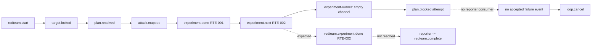

# builtin:red-team-attack Loop `primary-20260814-144832` 运行链路诊断报告

> **生成时间**：2026-08-15
>
> **诊断对象**：`.ralph/`（loop_id=`primary-20260814-144832`）
>
> **对照 preset**：`presets/en/red-team-attack.yml` + `presets/schemas/red-team-attack.yml`
>
> **Diagnostics 模式**：MINIMAL。匹配本次 run 的 bundle 为 `finalized`，有完整 `runtime-trace.jsonl`；没有 `orchestration.jsonl` 或 agent-output 原始记录。
>
> **历史检索**：`preset-only`，仅扫描近 30 天内与本 preset、loop 症状和相关路由问题相近的文档。
>
> **执行能力**：`[single-chain]`。preset 未启用 `event_loop.supervisor.enabled: true`，hat instructions 未出现 `ralph wave emit`、`ralph wave verify` 或 `WAVE CONTEXT`；`.ralph/supervisor.db` 虽存在，但本次没有 supervisor/wave 能力信号，缺 `wave_id` 不构成故障。

## 0. 产物盘点（Phase 0）

### 0.1 Bundle-first 与环境异常

`ralph diagnose --legacy --session latest ...` 选到的最新 session 是 `2026-08-14T23-31-27`，其 `diagnosis-input.json` 为 `pending`，`runtime-trace.jsonl` 与 `feedback.jsonl` 均为空。因此按 bundle-first 规则回退到可信 `current-events` 与 Tier S/A/B 产物。

匹配本次 run 的实际 bundle 是 `2026-08-14T22-48-32`：`manifest_status=finalized`、loop_id 与 preset 均匹配、runtime trace 34 条且序列 1–34 单调。该 bundle 的 `feedback.jsonl` 为空，session 内没有 `orchestration.jsonl`；这些是观测盲区，不是业务事件缺失的证明。

### 0.2 产物盘点表

| Tier | 路径 | 存在 | 行数/状态 | 备注 |
|---|---|---:|---:|---|
| S | `.ralph/current-events` | 是 | 1 行 | 唯一可信指针，指向 `.ralph/events-20260814-144832.jsonl` |
| S | 指针目标 events | 是 | 7 行 | 可信业务/控制事件 SSOT；末条为 `loop.cancel` |
| S | 配对 `events-history-20260814-144832.jsonl` | 是 | 2 行 | 旁路历史，不作为编排 SSOT |
| S | `.ralph/ledger.jsonl` | 是 | 12 行 | accepted observation、取消请求和 iteration 计数；无 wave 证据 |
| S | `.ralph/recovery.jsonl` | 是 | 2 行 | 两次 `redteam.plan.resolved` 的 `semantic_gate_violation`，后续已成功接受修正 payload |
| S | `.ralph/loops.json` | 是 | 2 行 | 当前无活动 loop |
| S | `.ralph/current-loop-id` | 是 | 1 行 | `primary-20260814-144832` |
| S | `.ralph/loop.lock` | 否 | 已释放 | 终止后无锁 |
| A | `.ralph/agent/summary.md` | 是 | 30 行 | 记录 7 iterations、取消状态和 7 个 events |
| A | `.ralph/agent/tasks.jsonl` | 否 | 条件不适用 | preset `tasks.enabled: false`；仅有 lock 文件 |
| A | `.ralph/agent/progress.md` | 否 | 条件不适用 | 未启用 tasks/state projection |
| A | `.ralph/agent/handoff.md` | 否 | 证据缺口 | 取消路径未生成 session handoff；不把它当作丢失的业务 artifact |
| B | `.ralph/diagnostics/2026-08-14T22-48-32/diagnosis-input.json` | 是 | finalized | 匹配本次 run 的 bundle |
| B | 同 session `runtime-trace.jsonl` | 是 | 34 行 | 覆盖 activation、empty batch、accepted、termination |
| B | 同 session `recovery.jsonl` | 是 | 1 行 | `agent_doc_sync` informational recovery |
| B | 同 session `drift.jsonl` | 是 | 0 行 | 未发现 drift finding |
| B | 同 session `feedback.jsonl` | 是 | 0 行 | feedback lifecycle 不可用 |
| B | 同 session `orchestration.jsonl` | 否 | — | MINIMAL 下无 orchestration 是预期盲区 |
| B | `.ralph/supervisor.db` | 是 | 139264 bytes | single-chain 下 N/A，不是故障 |
| B | `.ralph/diagnostics/logs/*22-48-32*` | 是 | 50 行主日志 | 含 empty channel、stall、cancel 证据 |
| C | `.ralph/red-team/01-target-lock.md` | 是 | 75 行 | HEAD/tree 锁定且 clean |
| C | `.ralph/red-team/02-plan-resolution.md` | 是 | 146 行 | 2/2 plans resolved，overall confidence 99 |
| C | `.ralph/red-team/03-patch-reconstruction.md` | 是 | 188 行 | patch reconstruction 已完成 |
| C | `.ralph/red-team/04-attack-surface.md` | 是 | 184 行 | 7 个 attack surfaces |
| C | `.ralph/red-team/05-experiment-plan.md` | 是 | 444 行 | RTE-001…RTE-022，共 22 项 |
| C | `.ralph/red-team/07-evidence-board.md` | 是 | 57 行 | RTE-001 qualified，21 项 remaining |
| C | `experiments/RTE-001.md` + evidence manifest | 是 | 124 + 109 行 | control/attack 重复验证及 hash manifest 完整 |
| C | `experiments/RTE-002.md` | 是 | 94 行 | 计划/状态文件存在，但未见对应 accepted event |
| C | `evidence/RTE-002/evidence-manifest.json` | 否 | — | RTE-002 未形成完整正式实验证据 |
| C | `failures/experiment-runner-stall-RTE-002.md` | 是 | 113 行 | 记录 stall、保留资产和人工后续建议 |
| C | `.ralph/red-team/REPORT.md` / `PLAN.md` / `QUESTIONS.md` | 否 | 未触发 | reporter 未被业务事件激活 |

### 0.3 能力推断

规范化能力为 `[single-chain]`：`presets/en/red-team-attack.yml:69-70` 声明 `execution_mode: isolated`，但没有 supervisor enabled、wave emit/verify 或 `WAVE CONTEXT` 信号；events 也没有 `wave_id`。bundle 原始字段写作 `execution_capabilities=["runner"]`，这里按冻结的执行模型词汇归一为 `single-chain`。`.ralph/supervisor.db` 的存在只作为 inspect 可用性证据，不改变本次能力判定。

### 0.4 可信 events 与三联对账

| # | events（唯一 SSOT） | 第二账本 | 一致性 |
|---:|---|---|---|
| 1 | `redteam.start` | bundle `runtime-trace` activation=target-locker | 一致 |
| 2 | `redteam.target.locked` | trace accepted/committed，Tier C lock artifact | 一致 |
| 3 | `redteam.plan.resolved` | trace accepted/committed；workspace recovery 的两次早期拒收后成功 | 一致 |
| 4 | `redteam.attack.mapped` | trace accepted/committed；7 surfaces/22 experiments artifact | 一致 |
| 5 | `redteam.experiment.done`（RTE-001） | RTE-001 manifest、ledger SHA、evidence board | 一致 |
| 6 | `redteam.experiment.next`（RTE-002，remaining=21） | evidence board aggregate state | 一致 |
| 7 | `loop.cancel` | trace accepted/committed、termination reason=`cancelled`、summary | 一致 |
| 8 | `plan.blocked` / `redteam.failed` / `redteam.complete` | 日志只有 blocked emit attempt；可信 events 没有这些 accepted topic | 不一致/未接受 |

## 1. 结论摘要

### 1.1 健康度

- **判定**：部分偏离；RTE-001 已完成并有完整证据，但 RTE-002 之后的 21 项实验没有形成业务事件，loop 最终被取消。
- **问题数量**：P0=1，P1=2，P2=0；均满足置信度入表门槛。
- **最高根因置信度**：P0-1 = **85/100**（MINIMAL 模式上限）。
- **历史复发**：是，同 preset 在近 30 天至少两次出现 evidence-gate/isolated channel 附近提前终止；具体首发根因与本次不同，不能合并为同一个缺陷。
- **RTF 结论**：没有新增正式 RTF finding。RTE-002 没有 accepted `redteam.experiment.done`、完整 evidence manifest 或 evidence-gate 接纳事件；其文件中若出现 `qualified: true`，不能覆盖 accepted event chronology。RTE-001 的 qualification 保持有效。

### 1.2 强制四问

| # | 问题 | 答案 | 一句证据 | 置信度 |
|---:|---|---|---|---:|
| Q1 | 整体执行与 OPAC 是否合规？ | ⚠️ 拓扑执行可还原，OPAC 顺序不能完整确认 | runtime trace 与 main events 可确认每个 accepted batch；无 agent-output/feedback，无法证明每次 `--policy-check` 的先后顺序 | 60 |
| Q2 | 基座机制是否正常生效？ | ⚠️ 检测生效，闭环不完整 | `merge_hat_channel` 识别空 channel，stall detector 记录 `plan.blocked`；但 blocked 没有成为 accepted 业务事件，最终只能 cancel | 85 |
| Q3 | 编排是否合理、正常运行？ | ❌ RTE-002 续跑的失败路由不可达 | reporter 只触发 `redteam.reviewed`/`redteam.failed`，而 stall 路径发出 `plan.blocked`；`ralph` 被 deny `redteam.failed` | 85 |
| Q4 | 问题归因是什么？ | **compound：mechanism 60% + preset contract 40%**；不是已证实的 agent 忘记 emit | 日志/trace 证明空 channel 与 no-progress；源码证明 fallback/blocked 路由；缺 agent-output，不能把空 channel 首因归给 agent | 85 |

### 1.3 根因一句话

`experiment-runner` 的 RTE-002 activation 结束时 isolated channel 为空，runtime 正确记录 routing fallback 和 no-progress，但当前 preset 没有把 `plan.blocked` 接到 reporter，且不允许 `ralph` 代发 `redteam.failed`；因此 21 项队列停在 `redteam.experiment.next` 之后，只能由 `ralph` 接受 `loop.cancel` 退出。**置信度：85/100。**

### 1.4 终态时序一致性

| 项目 | 内容 |
|---|---|
| **首轮终态（initial_terminal_status）** | 证据不足/未完成业务终态：日志记录了 `plan.blocked` 发出尝试，但可信 events 没有 accepted `plan.blocked`、`redteam.failed` 或 `redteam.complete`。 |
| **恢复状态（recovery_status）** | 取消后退出；没有后续 accepted 成功事件。用户随后做的 marker 清理/验证不能改写首轮 accepted verdict。 |
| **最终代码状态（final_code_state）** | HEAD=`c6eaeed354bee246d4df21a47a9d06ad6cd3fad0`，tree=`6c63d338ddae0de1c7dd7a074924efdc622819d0`，tracked tree clean；RTE-001 及其资产保留。 |
| **一致性告警** | ⚠️ `loop.cancel` 只证明 loop 被取消，不证明 red-team 成功；`experiments/RTE-002.md` 的可变结果声明不能替代 accepted `redteam.experiment.done` 和证据 manifest。 |

## 2. 执行链路对比

### 2.1 预期与实际

| 阶段 | 预期 | 实际 | 状态 |
|---|---|---|---|
| bootstrap | `redteam.start` | accepted | ✅ |
| target lock | `redteam.target.locked` | accepted；HEAD/tree clean | ✅ |
| scope resolution | `redteam.plan.resolved` 或 `redteam.failed` | accepted `redteam.plan.resolved`；此前两次 semantic gate 拒收后修正 | ✅ |
| attack mapping | `redteam.attack.mapped` 或 `redteam.failed` | accepted；7 surfaces、22 experiments | ✅ |
| first experiment | `redteam.experiment.done` | accepted RTE-001；control/attack 证据完整 | ✅ |
| queue continuation | `redteam.experiment.next` | accepted，`next_experiment_id=RTE-002`、remaining=21 | ✅ |
| RTE-002 activation | `redteam.experiment.done` 或 `redteam.failed` | 3 次 empty batch，isolated channel 为空，无 accepted business event | ❌ |
| stall route | `plan.blocked` → 有消费者的 reporter/失败路径 | 日志记录 `plan.blocked` attempt；preset 无 reporter trigger，main events 无 accepted blocked | ❌ |
| final reporting | `redteam.reviewed`/`redteam.failed` → `redteam.complete` | 未激活；无 REPORT/PLAN/QUESTIONS | ⏸️ |
| operator exit | 不覆盖业务终态 | accepted `loop.cancel`，termination reason=`cancelled` | ⚠️ |

### 2.2 Hat 激活表

| Hat | 激活/accepted 结果 | 未触发原因 |
|---|---|---|
| target-locker | 1 次，`target.locked` accepted | — |
| plan-resolver | 1 次，`plan.resolved` accepted；早期拒收已恢复 | — |
| attack-surface-mapper | 1 次，`attack.mapped` accepted | — |
| experiment-runner | RTE-001 成功；RTE-002 activation 无有效事件 | 空 channel/no-progress，未形成 done/failed |
| evidence-gate | 1 次，`experiment.next` accepted | 未收到 RTE-002 的 done |
| impact-boundary | 0 次 | 未收到 `redteam.evidence.gated` |
| independent-reviewer | 0 次 | 未收到 `redteam.plan.ready` |
| reporter | 0 次 | 未收到 `redteam.reviewed` 或 `redteam.failed` |
| ralph | 1 次终止控制，`loop.cancel` accepted | 负责 operator recovery/termination，不是业务 finding owner |

## 3. 历史问题上下文

| 文档 | 问题类型 | 发生/闭环情况 | 与本次关联 |
|---|---|---|---|
| `docs/report/2026-08-10-red-team-attack-red-teamprompt-cool-falcon-diagnosis.md` | `redteam.plan.resolved` predicate 反向，合法 scope payload 被拒收 | 同 preset 前置 gate 阻断；该具体 scope gate 本次已能接受 | 中：说明 preset gate 语义漂移家族，不是本次首因 |
| `docs/report/2026-08-14-red-team-attack-primary-20260813-212249-diagnosis.md` | evidence-gate owner self-deny → 空 isolated channel → 无业务失败终态 → cancel | 报告已落盘；本次不再出现同一 `redteam.retry.required` self-deny，但仍出现空 channel 与 cancel 形态 | 高：相同症状族，首发 deny 原因不同 |
| `docs/report/2026-08-14-red-team-attack-primary-20260814-121000-diagnosis.md` | 多实验调度/证据闭环在 RTE-001 后提前停止 | 本次已推进到 `experiment.next(RTE-002)`，但仍未完成多实验闭环 | 高：同 preset 的队列收敛问题持续 |
| `docs/brainstorms/2026-08-12-003-feat-evidence-driven-orchestration-state-requirements.md` | GAP-08/GAP-09：路由循环、无信息增益 retry、收敛语义不足 | 需求文档，未识别到匹配本次 run 的 active plan | 中：提供系统级背景，不作为本次直接根因 |
| active `docs/plans/` | 本次关键词匹配的 active plan | 未发现匹配的 active plan | 低 |

本次扫描窗口：preset-only (30d sliding)

## 4. 证据清单

| ID | 描述 | 证据锚点 | 严重度初判 | 置信度初估 | 已计分证据项 | 证据缺口 |
|---|---|---|---|---:|---|---|
| DEV-001 | RTE-002 activation 产生 3 次 `valid_events=0`，isolated channel 为空，runner 只进入 fallback/no-progress | `.ralph/diagnostics/2026-08-14T22-48-32/runtime-trace.jsonl:21-27`；`.ralph/diagnostics/logs/ralph-2026-08-14T22-48-32-833-52468.log:37-41`；`hat_channel.rs:79-98`；`inner.rs:3662-3701` | P0 | 85 | file:line +25；trace+logs 双账本 +20；Tier C failure artifact +10；历史同症状 +10；MINIMAL cap=85 | 缺 agent-output，不能确定空 channel 是 backend timeout、agent 无 emit 还是进程中断 |
| DEV-002 | stall detector 的 `plan.blocked` 没有可达 reporter；`ralph` 不能代发 `redteam.failed`，因此无 accepted 失败终态 | `mod.rs:624-659`；`presets/en/red-team-attack.yml:180-182,895-904`；events:7；日志:41,47-50 | P1 | 85 | file:line +25；events+logs 双账本 +20；preset 行号 +15；历史同类 +10；MINIMAL cap=85 | 缺一次以真实 preset 重放 blocked route 的 BDD 证据；当前日志证明 emit attempt，不证明 accepted blocked |
| DEV-003 | RTE-002 文件出现 `qualified: true`，但无 `redteam.experiment.done`、manifest 或 evidence-gate accepted 记录 | `.ralph/events-20260814-144832.jsonl:6-7`；`experiments/RTE-002.md:results`；缺失 `evidence/RTE-002/evidence-manifest.json`；`07-evidence-board.md:11-19` | P1 | 70 | events+artifact 双账本 +20；Tier C 交叉验证 +10；accepted-event chronology 与双账本一致性合并计分，不重复加分；MINIMAL cap=85 | 缺 agent-output，无法确认该可变结果字段由谁何时写入；不将其升级为 RTF finding |

### 4.1 OPAC 逐 hat 审计表

| Hat | O | P | A | C | 证据 | 置信度 |
|---|---|---|---|---|---|---:|
| target-locker | ✅ | ⚠️ | ✅ | ✅ | accepted `target.locked`、lock artifact；无 tool-call 序列 | 60 |
| plan-resolver | ✅ | ⚠️ | ✅ | ✅ | 两次 recovery 拒收后 `plan.resolved` accepted；无 agent-output | 60 |
| attack-surface-mapper | ✅ | ⚠️ | ✅ | ✅ | accepted `attack.mapped` 与 predecessor 字段；无 tool-call 序列 | 60 |
| experiment-runner | ✅ | ⚠️ | ❌ | N/A | `experiment.next` 到达；RTE-002 channel 为空，未形成业务 Apply/Confirm | 50 |
| evidence-gate | ✅ | ⚠️ | ✅ | ✅ | accepted `experiment.next`，board 记录 remaining=21；无 tool-call 序列 | 60 |
| ralph | ✅ | ⚠️ | ✅ | ✅ | logs/trace 与 accepted `loop.cancel`；用户提供的 policy-check transcript 未作为 bundle 主证据 | 60 |

> 本次为 MINIMAL：`ralph-tools-opac` 在 `auto_inject` 中，`ralph-tools-emit` 在 `on_demand` 中；`experiment-runner` instructions 要求先加载 emit skill 再做 policy-check，没有发现 auto/on-demand visibility 矛盾。由于缺 agent-output，Precheck 的逐次顺序不能从运行产物独立确认；这不是单独的 OPAC P0。

## 5. 问题归因表（confidence ≥ 60；P0 ≥ 70）

| 优先级 | 问题 | 根因分类 | 置信度 | 证据 DEV | 已计分证据项 | 历史关联 | 加深轮次 |
|---|---|---|---:|---|---|---|---|
| **P0** | RTE-002 续跑的空 isolated channel 没有转化为可消费的业务失败/恢复事件，21 项实验被阻塞 | **compound：mechanism 60% + preset contract 40%** | **85** | DEV-001 | file:line +25；trace+logs 双账本 +20；Tier C +10；历史 +10；MINIMAL cap=85 | 高：同 preset 近 30 天重复出现 empty-channel/cancel 早停族 | 第1轮源码反查；第2轮双账本+历史对照；最终受 MINIMAL cap |
| **P1** | `plan.blocked` 无 reporter 消费者，且 `ralph` 被 deny `redteam.failed`，所以取消不是业务失败闭环 | **preset + mechanism contract gap** | **85** | DEV-002 | file:line +25；events+logs 双账本 +20；preset 行号 +15；历史 +10；MINIMAL cap=85 | 高：此前同 preset 的 missing-terminal/owner deny 已出现；具体 topic 不同 | 第1轮 preset 行级；第2轮源码+双账本+历史 |
| **P1** | 可变的 RTE-002 `qualified` 声明与 accepted events/evidence board 不一致，存在把未执行实验误读为正式 finding 的风险 | **compound：artifact contract 60% + observability 40%** | **70** | DEV-003 | 双账本 +20；Tier C +10；accepted-event chronology 与双账本一致性合并计分，不重复加分；MINIMAL cap=85 | 中：历史报告反复要求区分 loop completion、业务 success 和证据资格 | 第1轮 events/artifact 对账；第2轮缺 agent-output 后保留为 contract 风险 |

## 6. 修复建议（non-executing）

以下仅是人工可执行建议；本诊断没有自动 rerun、改 preset、改代码、执行删除或运行测试。

### 6.1 短期（operator workaround）

- **目标**：保留可审计状态并避免把取消误报为成功。
- **建议**：人工复跑前先确认新的 isolated channel marker、匹配 loop id 和 current-events 指针；把本次 `loop.cancel` 明确标记为“取消/未完成”，只把 RTE-001 计为 qualified。
- **预期效果**：RTE-002…RTE-022 从 evidence board 的 durable queue 继续，但不会把旧的可变 `qualified` 字段当成 accepted verdict。
- **关联置信度**：85。

### 6.2 中期（preset / schema / instructions）

- **目标**：让 stall/blocked 路径在该 preset 中有合法消费者。
- **建议**：为 `plan.blocked`（或一个明确的 red-team 专用 blocked topic）增加 reporter 的 trigger、schema 和 failure payload；或者让责任 producer 在仍有 activation 时写出符合 schema 的 `redteam.failed`。同步检查 deny rules、terminal events、required fields 和真实 EventLoop 场景，覆盖“empty isolated channel → accepted failure → reporter → `redteam.complete(success=false)`”。
- **预期效果**：空 channel 会进入可审计的失败终态，而不是由 `ralph` 直接 cancel；业务失败与 operator cancel 可区分。
- **关联置信度**：85。

- **目标**：约束实验资格的唯一来源。
- **建议**：把 evidence board 的资格字段与 accepted `redteam.experiment.done`、evidence manifest 和 gate 结果绑定；没有这三者时，实验文件中的结果段只能是未验证状态。
- **预期效果**：未执行的 RTE-002 不会被误读成正式 finding。
- **关联置信度**：70。

### 6.3 长期（机制 / 底座）

- **目标**：区分“agent 没有业务 emit”“backend 中断”和“merge I/O 失败”。
- **建议**：在 isolated channel 为空时记录带 activation、hat、channel 路径、backend termination/watchdog 状态的 durable recovery evidence，并让 accepted recovery/blocked transition 成为继续路由的前置条件；保留必要的短证据快照供诊断使用。
- **预期效果**：下次可把根因落到 backend/agent、channel 生命周期或 runtime 路由，而不依赖单个 fallback Markdown 的推断。
- **关联置信度**：75；当前具体首因仍受缺 agent-output 限制。

## 7. 未核实疑点

| 候选问题 | 当前置信度 | blocked_by | 已做加深 |
|---|---:|---|---|
| RTE-002 空 channel 的首因究竟是 backend timeout/crash、agent 没有 emit，还是 marker/channel 生命周期中断 | 55 | 缺 agent-output、缺 activation 内部 stdout/stderr、空 channel 已被清理 | 第1轮读 trace/log/source；第2轮读 failure artifact、matching bundle 与历史同症状；不写入 §5 根因定论 |
| 日志随后出现 `Completion event redteam.complete detected`，但可信 events 没有 `redteam.complete` | 45 | 缺 orchestration、缺第二进程/termination call stack 证据 | 对照 cancellation 优先分支 `inner.rs:4758-4783` 与 completion 日志分支 `inner.rs:4786-4792`；保留为观测疑点，不驱动修复 |
| 用户最终验证中曾观察到 `hat_channel_size=220`，当前复核时 marker 已不存在且 inspect 默认 events 文件为 0 bytes | 40 | 只存在用户转述，当前磁盘已完成 marker 清理；current-events 指针仍是可信业务源 | 已用 explicit current-events 复核 7 条事件；不把当前 inspect 默认路径结果当业务 events 结论 |

## 8. 关键主仓代码引用清单

- `crates/ralph-cli/src/loop_runner/hat_channel.rs:79-98`：空 isolated channel 产生诊断、删除空 channel 和 marker，并返回错误。
- `crates/ralph-cli/src/loop_runner/inner.rs:3662-3701`：merge 失败记录 routing fallback，但继续 runner fallback；空 channel 被标记为 missing-terminal 条件。
- `crates/ralph-core/src/event_loop/mod.rs:624-659`：progress steward disabled 时，达到阈值后构造 `plan.blocked`，仅在 reporter 订阅该 topic 时添加 reporter target。
- `crates/ralph-core/src/event_loop/mod.rs:861-893`：从 preset flow 推导 blocked topic；当前 red-team preset 未提供可用的专用 blocked flow，因而走默认 `plan.blocked`。
- `crates/ralph-cli/src/loop_runner/inner.rs:4758-4783`：`loop.cancel` 优先于 completion，取消后直接终止。
- `presets/en/red-team-attack.yml:180-182`：`redteam.failed` deny 规则明确排除 reporter 与 ralph。
- `presets/en/red-team-attack.yml:895-904`：reporter 仅订阅 `redteam.reviewed` 与 `redteam.failed`。

## 提交前检查

- [x] Phase 0 产物盘点表与 diagnostics 模式已写入。
- [x] 只将 `current-events` 指向的单一 events 文件作为编排 SSOT。
- [x] MINIMAL 模式下未把缺 orchestration 或 OPAC 观测缺口单独升级为 P0。
- [x] §5 每条 P0/P1 均有置信度；P0≥70，入表项≥60。
- [x] 低置信度候选已加深两轮并移入 §7，未写入修复建议。
- [x] 未使用已删除机制或不存在路径；recovery 使用 `reason_code`/`source` 语义。
- [x] `history_search: preset-only` 已写入 frontmatter，§3 含扫描窗口行。
- [x] `docs/report/` 本次只新增本最终 Markdown 报告；中间 JSON/日志未写入报告目录。
