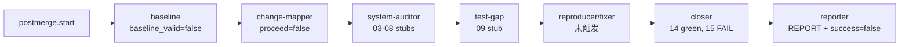

# post-merge-converge Loop `primary-20260817-035157` 运行链路诊断报告

> 生成时间：2026-08-17
>
> 诊断对象：`.ralph/`，loop_id=`primary-20260817-035157`
>
> 对照 preset：`presets/en/post-merge-converge.yml` + `presets/schemas/post-merge-converge.yml`
>
> Diagnostics 模式：`MINIMAL`。有 session trace、events、ledger 和 recovery，但没有 `orchestration.jsonl` / `agent-output.jsonl`；OPAC 只能做降级审计，不能证明每次 agent tool call 的顺序。
>
> 历史检索：`preset-only`，扫描近 30 天与本次 scope / digest / short-circuit 症状相关的主仓文档。
>
> execution_capabilities：`[single-chain]`。preset 未启用 `event_loop.supervisor.enabled`，hat instructions 未出现 `ralph wave emit` / `ralph wave verify` / `WAVE CONTEXT`；`.ralph/supervisor.db` 和 `inspect loop` 的 `supervisor` 键是 default-wave 可用性，不改变本次 capability 判定。

## 0. 产物盘点（Phase 0）

| Tier | 路径 | 存在 | 行数/大小 | 备注 |
|---|---|---:|---:|---|
| S | `.ralph/current-events` | 是 | 1 行 | 唯一指针，指向 `.ralph/events-20260817-035157.jsonl` |
| S | 指针目标 events | 是 | 9 行 | `postmerge.start` → 7 个阶段事件 → `postmerge.complete` |
| S | 配对 `events-history-20260817-035157.jsonl` | 是 | 2 行 | 旁路历史，不作为编排 SSOT |
| S | `.ralph/ledger.jsonl` | 是 | 18 行 | 8 次 iteration，含 completion honored |
| S | `.ralph/recovery.jsonl` | 是 | 1 行 | 一次 `semantic_gate_violation`，change-map 首次 emit 被拒收 |
| A | `.ralph/agent/summary.md` | 是 | 27 行 | 记录 8 iterations；`Completed successfully` 仅表示 loop 终止 |
| A | `.ralph/agent/handoff.md` | 是 | 42 行 | 终止后生成，无待办任务 |
| A | `.ralph/agent/tasks.jsonl` | 否 | — | preset `tasks.enabled: false`，不构成缺失 |
| B | `.ralph/diagnostics/2026-08-17T11-51-57/` | 是 | 9 个文件 | `MINIMAL`；有 `runtime-trace.jsonl`，无 orchestration/agent-output |
| B | `.ralph/supervisor.db` | 是 | 存在 | `single-chain` 下为 N/A，不是故障 |
| B | `.ralph/loop.lock` | 是 | 0 字节 | flock 已释放；空文件残留是正常行为，不是死锁 |
| C | `.ralph/post-merge/01-baseline.md` | 是 | 230 行 | 真实 baseline，但 `baseline_valid: false` |
| C | `.ralph/post-merge/02-change-map.md` | 是 | 133 行 | short-circuit，`proceed: false` |
| C | `.ralph/post-merge/03-09*.md` | 是 | 6 个 stub | 记录上游短路，没有真实审计/测试缺口分析 |
| C | `.ralph/post-merge/10-13*` / `findings/` | 否 | — | reproducer/fixer/alignment/reporter 未触发 |
| C | `.ralph/post-merge/14-15*.md` / `REPORT.md` | 是 | 116/135/147 行 | cold validation 绿；closer 与 reporter 均为 `FAIL` |

**能力推断**：`single-chain` 的证据是 preset 仅设置 `event_loop.execution_mode: isolated`，没有 supervisor 开关、wave fan-out 指令或 events `wave_id`。因此缺少 wave_id 不是异常；supervisor ledger 也不属于本次必需产物。

## 1. 结论摘要

### 1.1 健康度

- **判定**：部分偏离 / 业务收敛失败，但安全短路退出。
- **P0 / P1 / P2**：P1=1，P2=1；均满足置信度入表门槛。
- **最高根因置信度**：P1-1 = **85/100**（MINIMAL 模式封顶 85）。
- **历史复发**：同类 scope/digest 交接问题有历史关联；未发现完全相同的 `scope_base` 占位输入复发。

### 1.2 强制四问

| # | 问题 | 答案 | 一句证据 | 置信度 |
|---|---|---|---|---:|
| Q1 | 执行与 OPAC 是否合规？ | ⚠️ 编排按失败协议执行；OPAC 只能降级确认 | 8 次 activation 均 `backend_exit_code=0`、channel `merged`、事件被接受；缺 agent-output，无法核对每次 policy-check 顺序 | 70 |
| Q2 | 基座机制是否正常生效？ | ✅ | 首次 scope digest 不一致被 recovery 记录并拒收；修正后 change-map 事件被接受；completion 最终 honored | 85 |
| Q3 | 编排是否合理、正常运行？ | ✅ 安全性合理，业务结果失败 | `baseline_valid=false` → `proceed=false` → downstream stub → closer `FAIL`，与 preset 的短路协议一致 | 85 |
| Q4 | 问题归因是什么？ | **operator 输入 / preset 输入契约**；不是 Ralph 基座故障 | prompt 中提供了无效示例 SHA；preset 明确要求无效时设 false 并停止 | 85 |

### 1.3 根因一句话

`.ralph/post-merge.prompt.md:29-35` 把文档示例 `abc1234...` 当成了实际 `scope_base`；baseline 按 `presets/en/post-merge-converge.yml:320` 将其判为无效，change-mapper 按 `:365-371` 正确短路，所以本轮没有进入真实审计、复现和修复。

### 1.4 终态时序一致性

| 项目 | 内容 |
|---|---|
| 首轮终态 | 业务失败：`postmerge.baseline.ready` 的 `baseline_valid=false`，随后 `postmerge.changemap.ready` 的 `proceed=false`，最终 `postmerge.reviewed.verdict=FAIL`、`postmerge.complete.success=false` |
| 恢复状态 | **局部恢复**：change-map 首次 emit 因 digest mismatch 被拒收，随后修正 digest 后形成 accepted event；这只是事件 admission 恢复，不是业务收敛恢复 |
| 最终代码状态 | HEAD `abbd175a`；cold `./scripts/run-tests.sh` 通过，8065/0；但 post-merge 真实审计未执行，10-13 产物缺失 |
| 一致性告警 | `summary.md` 的 “Completed successfully” 只能解释为 workflow 终止成功，不能覆盖 `REPORT.md` / accepted `postmerge.complete` 的 `success=false` |

## 2. 执行链路

关键事件：events 第 2 行 baseline 无效；第 3 行 change-map `scope_status=blocked`、`overall_confidence=0`、`proceed=false`；第 8 行 closer `FAIL`；第 9 行 reporter `success=false`。runtime trace 显示 8 个已触发 hat 均成功合并自己的单事件，未出现空 channel、backend 非零退出或 watchdog timeout。

## 3. 历史问题上下文

| 文档 | 关联度 | 结论 |
|---|---|---|
| `docs/report/2026-08-10-red-team-attack-red-teamprompt-cool-falcon-diagnosis.md` | 高 | 同样涉及 scope/digest handoff 与 fail-close；说明该类交接契约是近期开源问题族，但不是本次 `scope_base` 占位输入的直接证据 |
| `docs/report/2026-07-26-implementation-review-primary-20260725-174509-diagnosis.md` | 中高 | 记录 scope digest 文件字节漂移导致拒收，与本次首轮 digest mismatch 属同一 artifact contract 家族 |
| `docs/plans/2026-08-15-1823-fix-empty-channel-activation-observability-plan.md` | 中 | 规定用 raw activation outcome 与 events/recovery 交叉诊断；本次 runtime trace 正好提供了 merged/backend/channel 事实 |

本次扫描窗口：preset-only (30d sliding)。

## 4. 证据清单

| ID | 描述 | 证据锚点 | 严重度初判 | 置信度初估 | 已计分证据项 | 证据缺口 |
|---|---|---|---|---:|---|---|
| DEV-001 | operator 提供的 `scope_base` 不是可解析 commit，导致 baseline 无效并使 change-map 短路 | `.ralph/post-merge.prompt.md:29-35`; `presets/en/post-merge-converge.yml:320`; events:2-3; `.ralph/post-merge/01-baseline.md:151-169` | P1 | 85 | preset 行号 +15；events + Tier-C 双账本 +20；Tier-C 交叉验证 +10；file 行号 +25 | 无 FULL agent-output，无法确认是谁把示例值保留在 prompt 中 |
| DEV-002 | change-map 首次 emit 的 manifest digest 与文件内容不一致，随后通过修正重试 | `.ralph/recovery.jsonl:1`; session recovery:1; events:3; `crates/ralph-cli/src/policy_check/scope.rs:240-284` | P2 | 85 | 源码行号 +25；recovery + accepted event 双账本 +20；Tier-C 交叉验证 +10 | 缺原始 tool-call，不能判定具体写入动作 |
| DEV-003 | 生命周期有一次 unknown/already-closed activation warning | `.ralph/diagnostics/logs/ralph-2026-08-17T11-51-57-229-3741060.log:8`; `crates/ralph-core/src/hat_lifecycle.rs:406-435` | P2 | 40 | file:line +25；单日志 +0 | 缺第二账本和重复复现；当前只列疑点，不驱动修复 |

### 4.1 OPAC 逐 hat 审计（MINIMAL 降级）

| Hat | O | P | A | C | 证据 | 置信度 |
|---|---|---|---|---|---|---:|
| baseline / change-mapper / system-auditor / test-gap | ✅ | ⚠️ | ✅ | ✅ | runtime-trace 各 activation `backend_success=true`、`merged`；events 接受对应 topic；无 agent-output | 70 |
| closer | ✅ | ⚠️ | ✅ | ✅ | `14-clean-validation.md`、`15-final-review.md` 存在，accepted `postmerge.reviewed` 为 FAIL | 70 |
| reporter | ✅ | ⚠️ | ✅ | ✅ | `REPORT.md` 存在且 `postmerge.complete` 为 `success=false`；无法核对 policy-check tool-call 顺序 | 70 |

> MINIMAL 模式只能以 session recovery + events + runtime trace 判断 Observe/Apply/Confirm 的结果；Precheck 的逐次命令顺序不可观测。未把“看不到 policy-check”升级为 OPAC P0。

## 5. 问题归因

| 优先级 | 问题 | 根因分类 | 置信度 | 证据 DEV | 已计分证据项 | 历史关联 | 加深轮次 |
|---|---|---|---:|---|---|---|---|
| **P1** | 无效 `scope_base` 使 baseline 失效，整个 post-merge 收敛链在 step 02 安全短路 | **preset 输入契约 / operator input** | **85** | DEV-001 | file:line +25；双账本 +20；preset 行号 +15；Tier-C +10；MINIMAL 封顶 | 中：与历史 scope handoff 家族相关，但非同一占位输入 | 第1轮 prompt/preset 行级；第2轮 events + Tier-C 对账 |
| **P2** | 首次 change-map payload 的 scope digest 不稳定，造成一次不必要的 semantic gate rejection | **compound：artifact/agent handoff 70% + mechanism guard 30%** | **85** | DEV-002 | file:line +25；双账本 +20；Tier-C +10；MINIMAL 封顶 | 中高：与历史 scope-digest 漂移同族 | 第1轮 recovery→源码；第2轮 accepted event→最终 manifest |

DEV-003 保留在 §7：置信度 40，缺第二账本，且 warning 的幂等语义由源码明确允许，不足以认定机制缺陷。

## 6. 修复建议

### 6.1 短期（operator）

1. 删除 `.ralph/post-merge.prompt.md` 中的 `scope_base:` 行，让 change-mapper 按 first-parent / merge-parent 自动推导；或替换成真实存在、且是候选 commit 祖先的 40 字符 SHA。
2. 使用新的独立 run 重新执行，不要手改本次 `.ralph/` 状态文件；验收 `01-baseline.md` 为 `baseline_valid: true`、`02-change-map.md` 为 `proceed: true`，再相信后续 Finding/修复结果。
3. 不要把本次冷构建 8065/0 解读成 post-merge 收敛成功，也不要打 `post-merge-hardened` tag。

### 6.2 中期（preset / schema）

1. 在 prompt 模板/生成入口中把示例 `scope_base` 与可直接执行的 operator 输入分离，避免复制示例后仍被当作真实值。
2. 为 post-merge preset 增加真实 EventLoop 场景：无 `scope_base` 可自动推导；有效 SHA 可通过；不存在或非祖先 SHA 必须安全短路。
3. change-mapper 在写完 manifest 后，从最终文件重新计算 digest 并构造 payload；当前 guard 已在 `crates/ralph-cli/src/policy_check/scope.rs:240-284` 执行 canonical digest 校验。

### 6.3 长期（机制）

将 scope manifest canonicalization、digest 和 payload 构造尽量收敛到共享实现，减少 agent 在文件写入与 emit 之间自行拼装交接字段的机会。

## 7. 未核实疑点

| 候选问题 | 当前置信度 | blocked_by | 已做加深 |
|---|---:|---|---|
| lifecycle unknown activation warning 是否由一次重复 close、异步完成竞态或正常重复记录触发 | 40 | 缺 agent-output / orchestration，只有单条日志 | 已读 `hat_lifecycle.rs:406-435`；源码明确该路径是幂等 no-op，未升级为 finding |
| 首次 digest mismatch 的具体写入者/时序 | 55 | 缺原始 tool-call 和完整 activation orchestration | 已核对 recovery、accepted events、最终 manifest 和 canonical verifier；不把具体 agent 动作写成定论 |

## 8. 最终判断

本次 run 的状态是：**Ralph 基座正常，失败门禁正常，输入 scope_base 错误导致业务收敛未开始**。清理 prompt 中的示例 SHA 或直接删除可选字段后重跑，才会进入真正的 scope mapping、六维审计、reproducer 和 fixer 阶段。

本报告只读诊断并写入主仓 `docs/report/`，未修改代码或 `.ralph/` 运行时状态。
