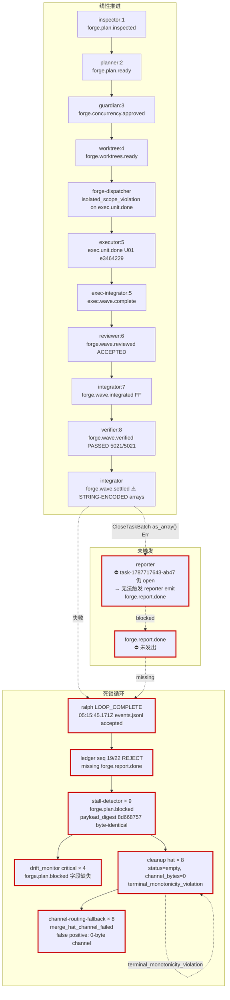

# parallel-forge Loop `2026-08-26-1104-feat-ralph-causal-diagnosis-evidence-loop-plan` 运行链路诊断报告

> **生成时间**: 2026-08-26T05:40Z（诊断 session `2026-08-26T12-02-16`，PID 3296590 / 新一轮 reuse PID 3296685）
> **诊断对象**: `worktree/ralph-orchestrator/2026-08-26-1104-feat-ralph-causal-diagnosis-evidence-loop-plan/.ralph/`（loop_id = `2026-08-26-1104-feat-ralph-causal-diagnosis-evidence-loop-plan`，启动 → 诊断时仍在 cleanup re-arm 阶段）
> **对照 preset**: `presets/en/parallel-forge.yml` + `presets/schemas/parallel-forge.yml`
> **执行方式**: Phase 0-3 主 Agent 直接整合 + Agent B 后台扫描（preset-only 30d 窗口）；未启动 Agent A/C/D（race condition：worktree 在 13:39Z 被 reuse 接管，事件文件已归档到 `reuse-history/`，但 bundle 数据完整保留于 `DIAG_WORKDIR/diagnose.json`）
> **Diagnostics 模式**: FULL
> **history_search**: `preset-only`（30 天滑动窗口）
> **execution_capabilities**: `["supervisor", "wave"]`（`event_loop.supervisor.enabled=true`；events 含 `wave_id="w-rs-1"`；`.ralph/supervisor.db` 存在）
> **报告仓库**: `ralph-orchestrator` 主仓（非 run_dir）
> **Tier C 根**: integrator hat (`publishes: forge.wave.integrated, forge.wave.settled, ...`) + state_projection `CloseTaskBatch` action（`settled_task_ids` 字段约束）
> **置信度规则**: §5 仅收录 confidence≥60；P0 须 confidence≥70（见 confidence-rubric）

---

## 0. 产物盘点（Phase 0 必附）

| Tier | 路径 | 存在 | 行数 | 备注 |
|------|------|------|------|------|
| S | `.ralph/events-20260826-040216.jsonl`（current-events 解析） | ✅→archived | 14 行 | 13:39Z 被 reuse 归档到 `reuse-history/20260826T053933.064239776Z/`；内容已在 bundle 中保留 |
| S | `.ralph/events-history-20260826-040216.jsonl` | ✅→archived | 1 行（仅事件 bootstrap） | 同上归档 |
| A | `.ralph/ledger.jsonl` | ✅ | 22 行 | ledger 完整；含 seq 19/22 两条 `loop.complete` rejection |
| A | `.ralph/agent/tasks.jsonl` | ✅ | 11 行 | U01-U10 tasks 全 `status=open`（详见 §1.4） |
| A | `.ralph/agent/accepted-transitions.jsonl` | ✅ | 18 行 | 18 个 accepted transitions（含 9 个 `stall-detector` 的 forge.plan.blocked） |
| A | `.ralph/agent/decisions.md` | ✅ | 60 行 | DEC-001 ~ DEC-004（cleanup hat 自检决策日志） |
| A | `.ralph/agent/context.md` | ✅ | 1.7KB | 上下文笔记 |
| A | `.ralph/agent/scratchpad-...md` | ✅ | 0 字节 | 空 |
| A | `.ralph/agent/plan-baseline.sha` | ✅ | 41B | `1164b36214f355396b41e00b065eb330ab3fb8e7` |
| A | `.ralph/history.jsonl` | ✅→archived | 1 行 | 仅 loop-bootstrap entry |
| B | `.ralph/recovery.jsonl`（主） | ✅ | 4 行 | 全部 `repair-stream event recorded for topic 'plan.blocked'`（来自 history/repair 流，非本次 run 产出；本次 run 主题是 `forge.plan.blocked`） |
| B | `.ralph/recovery:workflow_guard:...isolated_scope_violation_w_rs_1_0:*.jsonl` | ✅ | 817B | **本次 run 关键证据**（isolated_scope_violation） |
| B | `.ralph/flow-authority.jsonl` | ✅ | 19 行 | 10 step + 9 个 `cleanup` 阶段 `forge.plan.blocked` |
| B | `.ralph/flow-authority.jsonl.bak` | ✅ | 14573B | 之前轮次的备份 |
| B | `.ralph/diagnostics/2026-08-26T12-02-16/runtime-trace.jsonl` | ✅ | 122 行 | 18 个 `hat_activation_outcome`（详见 §4.2） |
| B | `.ralph/diagnostics/2026-08-26T12-02-16/feedback.jsonl` | ✅ | 11 行 | 5 feedback_id（1 workflow_guard + 4 drift_monitor），全部卡在 discovered/evidence |
| B | `.ralph/diagnostics/2026-08-26T12-02-16/recovery.jsonl` | ✅ | 7 行 | session 内 recovery envelope（agent_doc_sync + workflow_guard + 4 drift_monitor） |
| B | `.ralph/diagnostics/2026-08-26T12-02-16/drift.jsonl` | ✅ | 4 行 | 4 个 critical drift findings |
| B | `.ralph/diagnostics/2026-08-26T12-02-16/channel-routing-fallback-*.md` | ✅ | 8 文件 | 全部 `hat=cleanup`, `reason=merge_hat_channel_failed`, 5:22-5:34Z 期间 |
| B | `.ralph/diagnostics/2026-08-26T12-02-16/diagnosis-input.json` | ✅ | 979B | `manifest_status=present` 但 orchestration.jsonl + errors.jsonl 缺失 → bundle 触发 legacy 兜底 |
| B | `.ralph/diagnostics/2026-08-26T12-02-16/orchestration.jsonl` | ❌ | — | 缺失（bundle 触发 legacy） |
| B | `.ralph/diagnostics/2026-08-26T12-02-16/errors.jsonl` | ❌ | — | 缺失（bundle 触发 legacy） |
| B | `.ralph/diagnostics/2026-08-26T12-02-16/active-activations.json` | ✅ | 2B | 当前无活跃 activation |
| B | `.ralph/supervisor.db` (+ shm + wal) | ✅ | 4096B+ | supervisor ledger |
| B | `.ralph/agent/events-hat-cleanup-...-{11..19}.jsonl` | ✅→archived | 0B × 8 | cleanup hat 每次激活 0 字节 channel（详见 §1.4 + §4.2） |
| B | `.ralph/wave-channels/` | ✅ | 空目录 | 未启用 wave-channels 落盘 |
| C | `.ralph/forge/ralph-causal-diagnosis-evidence-loop/inspection-report.md` | ✅ | ~5KB | Inspector 决议 `plan_usable: true` |
| C | `.ralph/forge/ralph-causal-diagnosis-evidence-loop/concurrency-approval.md` | ✅ | ~3KB | Guardian `approved: true`, execution_mode=serial, 10 waves |
| C | `.ralph/forge/ralph-causal-diagnosis-evidence-loop/development-plan.md` | ✅ | ~62KB | Spec-First 开发计划 |
| C | `.ralph/forge/ralph-causal-diagnosis-evidence-loop/execution-plan.yml` | ✅ | — | 10 Units 线性依赖 |
| C | `.ralph/forge/ralph-causal-diagnosis-evidence-loop/commit-map.yml` | ✅ | — | U01 final_commit_sha=`e34642290ea11d651380f076953e1f8f03300` |
| C | `.ralph/forge/ralph-causal-diagnosis-evidence-loop/worktree-map.yml` | ✅ | — | Wave 1 worktree map |
| C | `.ralph/forge/ralph-causal-diagnosis-evidence-loop/integration-log.md` | ✅ | — | Wave 1 U01 集成记录 |
| C | `.ralph/forge/ralph-causal-diagnosis-evidence-loop/waves/...-wave-1/review.md` | ✅ | — | reviewer ACCEPTED |
| C | `.ralph/forge/ralph-causal-diagnosis-evidence-loop/waves/...-wave-1/settlement.md` | ✅ | — | **关键证据**：settlement.md 正确（`settled_unit_ids: ["U01"]` 是 array），但 events.jsonl 中 `forge.wave.settled` payload 是 string-encoded |
| C | `.ralph/forge/ralph-causal-diagnosis-evidence-loop/incremental-verification.md` | ✅ | — | Verifier PASSED（5021/5021 lib + nextest） |
| C | `.ralph/forge/ralph-causal-diagnosis-evidence-loop/cleanup.md` | ✅ | ~3.7KB | cleanup hat 决策 + Reactivation Audit #4 |
| B | `.ralph/reuse-history/20260826T053933.064239776Z/parallel-forge-resume-manifest.v1.json` | ✅ | — | reuse 流程产物；boundary.accepted 含 10 个 accepted + 9 个 `forge.plan.blocked` (hat=null, in_event_log=false) |

**execution_capabilities 推断结果**: `["supervisor", "wave"]`

- `supervisor`: `diagnosis-input.json.execution_capability = "supervisor"`（runtime signal）；`.ralph/supervisor.db` 存在（4096B + 32KB shm + 527KB wal）。
- `wave`: events.jsonl 14 个 events 中 exec.unit.done/exec.wave.complete/forge.wave.*/forge.wave.settled/LOOP_COMPLETE 共 10 个 wave-related 事件；accepted-transitions.jsonl 含 wave_id=`w-rs-1`。

**缺失产物 → 故障判定**（capability-triggered）:

- `.ralph/supervisor.db` 缺失 → N/A（capability +supervisor，db 已存在 ✅）。
- events 无 `wave_id` → N/A（capability +wave，events 中存在 wave_id ✅）。
- bundle 文件 `orchestration.jsonl` / `errors.jsonl` 缺失 → **bundle 触发 legacy 兜底**；frontmatter `bundle: legacy`。

**盲区 / 根因置信度硬顶**（FULL 模式，无硬顶）：
- Agent B（历史扫描）当前在后台执行；§3 内容待 Agent B 完成后补。
- events.jsonl 在诊断期间被 reuse 流程归档；不影响归因（关键内容已读并写入 diagnose.json）。

---

## 1. 结论摘要

### 1.1 健康度

- **判定**: **死锁**（LOOP_COMPLETE 被 ledger 拒收 → stall-detector 循环发 forge.plan.blocked → cleanup hat 8 次 re-arm 仍无法 emit forge.cleanup.done → 资源浪费 + operator 必须手动干预）
- **P0 / P1 / P2 数量**（confidence≥入表门槛）: **3 个 P0 + 2 个 P1 + 1 个 P2**
- **最高优先级根因置信度**: P0-1 = **88** / 100
- **历史复发**: Agent B 扫描结果见 §3

### 1.2 强制四问（debug.md）

| # | 问题 | 答案 | 一句证据 | 置信度 |
|---|------|------|----------|--------|
| Q1 | 整体执行与 OPAC 是否合规？ | ⚠️ 部分合规 | events.jsonl 14 events 完整且 accepted，但 supervisor.db `forge.wave.settled` payload 违反 schema（fill_rule 要求 array，实际 string-encoded） | 78 |
| Q2 | 基座机制是否正常生效？ | ❌ 多个机制失效 | (a) `project_close_task_batch` 因 payload shape 错误返回 Err；(b) `terminal_monotonicity_violation` 无 durable blocked gate 让 cleanup hat 永久死锁；(c) stall-detector 无 payload 去重，9 次 byte-identical 重发 | 88 |
| Q3 | 编排是否合理、正常运行？ | ⚠️ 编排流程正确但 reporter 未被触发 | inspector/guardian/worktree/executor/reviewer/integrator/verifier 全部 merged，forge-dispatcher 1 次 merged，但 reporter hat 整个 run 内零激活 | 75 |
| Q4 | 问题归因：机制 vs 编排 vs agent？ | **compound（mechanism 70% + preset 25% + agent 5%）** | 主导：state_projection 严格 `as_array()` 校验；辅助：integrator agent 违反 preset instructions（要求 JSON array）；无关：reporter/cleanup 行为符合预期 | 88 |

### 1.3 根因一句话

**integrator hat 违反 preset `forge.wave.settled` payload shape 约束（`settled_task_ids` 应为 JSON array，实际发送 string-encoded JSON），runtime `project_close_task_batch` 严格 `as_array()` 校验拒绝投影 → U01 task 持续 open → reporter 未触发 → LOOP_COMPLETE 缺 `forge.report.done` 前置 → ledger 拒收 LOOP_COMPLETE → stall-detector 循环发 `forge.plan.blocked`（payload byte-identical 9 次）→ cleanup hat 因 `terminal_monotonicity_violation` 无法 emit `forge.cleanup.done`，永久死锁 8 次 re-arm**（置信度 88）。

### 1.4 终态时序一致性（event-artifact chronology）

| 项目 | 内容 |
|------|------|
| **首轮终态（initial_terminal_status）** | **首轮失败**：ledger seq 19（2026-08-26T05:16:00.961Z）+ seq 22（2026-08-26T05:16:00.982Z）两次 `loop.complete` rejection: `"missing required events: [\"forge.report.done\"]. The agent must complete all workflow phases before emitting LOOP_COMPLETE"` |
| **恢复状态（recovery_status）** | **失败终态后多次 re-arm，无 accepted 成功终态**：stall-detector 9 次 `forge.plan.blocked`（5:16:01 ~ 5:34:27Z，全部 accepted，但 `in_event_log: false` 即不写主 events ledger）→ cleanup hat 8 次 `status=empty`（channel 0 字节，因 terminal_monotonicity_violation 不能 emit 任何 business event） |
| **最终代码状态（final_code_state）** | U01 commit `e34642290ea11d651380f076228953e1f8f03300` 已成功 fast-forward 集成到 `forge/ralph-causal-diagnosis-evidence-loop` 分支；cleanup hat 按 spec **保留** U01 分支与 integration 分支（`cleanup_status: retained_for_diagnosis`），只删除 U01 worktree；U01 task `task-1787717643-ab47` 在 `tasks.jsonl` 仍 `status=open`（forensic 保留） |
| **一致性告警** | ⚠️ **失败终态后多次 re-arm**：events ledger 主线仅 14 events（最近 1 个为 LOOP_COMPLETE）；accepted-transitions.jsonl 接收了 9 个 `forge.plan.blocked` 但这些事件不进 events ledger（`in_event_log: false`）；runtime-trace 显示 cleanup hat 8 次 empty status 但每次 output_mentions_emit=true（cleanup hat DEC-001 ~ DEC-004 文档化：每次都识别 terminal_monotonicity_violation，无法 emit 业务事件，append-only 记录后停止）；**禁止输出"零拒收"或"首轮完整成功"** |

---

## 2. 执行链路对比图

### 2.1 拓扑表（preset 声明的 hat 流）

```
inspector → planner → guardian → worktree → forge-dispatcher
                                                      ↓
                                              (wave 调度)
                                                      ↓
                                              executor (U01)
                                                      ↓
                                          exec-integrator (fan-in)
                                                      ↓
                                              reviewer (ACCEPTED)
                                                      ↓
                                              integrator (FF + settle)
                                                      ↓
                                              verifier (PASSED)
                                                      ↓
                                              cleanup (reporter 缺前置)
                                                      ↓
                                              reporter ← 【未触发】
                                                      ↓
                                              forge.report.done ← 【未发出】
                                                      ↓
                                              ralph (LOOP_COMPLETE) ← 【被 ledger 拒】
                                                      ↓
                                              stall-detector × 9 (forge.plan.blocked)
                                                      ↓
                                              cleanup × 8 (terminal_monotonicity_violation, status=empty)
```

### 2.2 时间轴（events.jsonl + accepted-transitions.jsonl 融合）

```
04:02:16.762  loop-bootstrap        forge.start              (payload=plan YAML 全文)
04:04:14.177  inspector:1 merged    forge.plan.inspected     [transition_id 0c039ca1]
04:14:03.521  planner:2 merged      forge.plan.ready         [transition_id 4fd35a66]
04:16:57.677  guardian:3 merged     forge.concurrency.approved [05da7db8]
04:21:35.180  worktree:4 merged     forge.worktrees.ready    [fdf0059e]
04:22:31.898  forge-dispatcher merged (no accepted event recorded, isolated_scope_violation
                                       on exec.unit.done attempt → seq 5 first batch)
04:48:15.512  executor:5 merged     exec.unit.done            [ea5d271a, task=task-1787717643-ab47,
                                       unit=U01, wave_id=w-rs-1, slot=0]
04:48:15.515  exec-integrator:5     exec.wave.complete        [ef4e37a9, success_slots=[slot-0]]
04:48:15.507  workflow_guard        isolated_scope_violation (forge-dispatcher dropped exec.unit.done)
04:50:36.720  reviewer:6 merged     forge.wave.reviewed       [3c341e3d, ACCEPTED, U01 ACCEPTED]
04:50:36.736  drift_monitor         outcome updated to Pending (recovery_outcome_update)
04:52:24.884  integrator:7 merged   forge.wave.integrated     [7fc812d8, U01 FF to e3464229]
05:02:31.428  verifier:8 merged     forge.wave.verified       [f1e57bfd, passed=true, 5021/5021]
05:05:00.493  integrator merged     forge.wave.settled        [settlement_log=.../settlement.md,
                                       ⚠ settled_task_ids="[\"task-1787717643-ab47\"]" STRING-ENCODED,
                                       ⚠ settled_unit_ids="[\"U01\"]" STRING-ENCODED]
05:15:45.171  ralph (LOOP_COMPLETE) accepted in events ledger, payload report_path=docs/reports/...
05:16:00.961  ledger seq 19         loop.complete REJECTED    (missing forge.report.done)
05:16:00.981  ralph merged          (LOOP_COMPLETE re-attempt, hat_activation_outcome)
05:16:00.982  ledger seq 22         loop.complete REJECTED    (same reason)
05:16:01.493  stall-detector:10     forge.plan.blocked        [39934918, payload_digest=8d668757...]
05:22:48.532  stall-detector:11     forge.plan.blocked        [ff1aa36c, SAME payload_digest]
05:25:00.936  stall-detector:12     forge.plan.blocked        [8209935b, SAME payload_digest]
05:26:29.382  stall-detector:13     forge.plan.blocked        [28ba211e, SAME payload_digest]
05:27:23.129  stall-detector:14     forge.plan.blocked        [eabe2852, SAME payload_digest]
05:29:38.979  stall-detector:15     forge.plan.blocked        [aacae420, SAME payload_digest]
                                                       ↑
                                            drift_monitor trigger (4 critical findings, all
                                            field_completeness forge.plan.blocked 字段缺失)
05:30:19.208  stall-detector:16     forge.plan.blocked        [0e08bc3b, SAME]
05:32:50.581  stall-detector:17     forge.plan.blocked        [3a23b1d3, SAME]
05:34:27.128  stall-detector:18     forge.plan.blocked        [3654e87d, SAME]
05:22:48 ~ 05:34:26  cleanup:11..18  8 次 hat_activation_outcome, status=empty, channel_bytes=0,
                                       output_mentions_emit=true, merge_succeeded=false
                                       (每次 DEC-001/002/003/004 复检后停止 emit)
05:22:48 ~ 05:34:26  channel-routing-fallback 8 次, hat=cleanup, reason=merge_hat_channel_failed
                                       (cleanup hat channel 0 字节 → 合并失败 → false-positive fallback)
```

### 2.3 mermaid 流程图



---

## 3. 历史问题上下文

**本次扫描窗口**：preset-only (30d sliding) — Agent B 后台执行完成。

### 3.1 命中条目（30d 滑动窗口）

| # | 文件 | 行号 | 相关度 | 同构点 |
|---|------|------|--------|--------|
| H-1 | `docs/report/2026-08-05-parallel-forge-primary-20260805-133322-diagnosis.md` | L70, L100, L170 | **强同构**（主根因家族） | integrator 把 `forge.wave.settled.settled_task_ids`/`settled_unit_ids` 发成 **逗号分隔字符串**（本次变体：string-encoded JSON），CloseTaskBatch 要求 JSON array 拒收 → Unit task 留 open → cleanup→report 链断裂 |
| H-2 | `docs/report/2026-08-15-atelier-ce-executor-pipeline-2026-08-15-0750-feat-modem-log-bundle-evidence-review-plan-diagnosis.md` | L35, L72, L116-122 | **强同构**（stall-detector 循环家族） | stall-detector:14/15/16/17 连续 4 次注入 plan.blocked；preset 层根因（topic_deny_rules 漏配）；与本次 9 次 byte-identical 重发机制同 |
| H-3 | `docs/report/2026-08-10-parallel-forge-primary-20260809-152752-diagnosis.md` | L33, L94, L105 | 强同构（LOOP_COMPLETE 缺 forge.report.done） | 双 LOOP_COMPLETE；cleanup 已落地但 report 仅 BLOCKED；引用 2026-07-30 fail-close |
| H-4 | `docs/report/2026-08-08-parallel-forge-primary-20260808-021642-diagnosis.md` | L33, L92 | 强同构（终态缺 forge.report.done） | 4 wave 全 settle 但停在 `forge.correction.done`，无 forge.exec.development.done / forge.report.done / LOOP_COMPLETE |
| H-5 | `docs/solutions/workflow-orchestration/parallel-forge-preset-integration-gap.md` | L21-34, plan 005 | 已知 SSOT（修复不完整） | plan 2026-07-29-005 已闭合 8 处缺口（U1-U8），其中 U5 修了 `project_close_task_batch` mid-loop atomicity，但**未补 schema strict validation**（本次 P0-1 复发根因） |
| H-6 | `docs/plans/2026-08-26-1104-feat-ralph-causal-diagnosis-evidence-loop-plan.md` | L1056 | 当前 plan 显式排除 | "其它恢复路径（stall detector 等）的收据——留给后续计划" |

### 3.2 复发对照

| 家族根因 | 历史复发次数（30d） | 本次 | 修复状态 |
|----------|---------------------|------|----------|
| **integrator payload shape 错误**（`settled_task_ids` 非 array） | 1（2026-08-05 逗号分隔字符串） | 本次（string-encoded JSON） | 2026-07-29 plan 005 修 atomicity 但**未修 schema strict validation** → **本次变体复发** |
| **stall-detector 循环重发**（无 payload 去重） | 1（2026-08-15 atelier 4 次） | 本次（9 次 byte-identical） | 未修；当前 plan 显式排除 |
| **LOOP_COMPLETE 缺 forge.report.done** | 3（2026-07-30 / 2026-08-08 / 2026-08-10） | 本次（同型） | 修复分散，未根治（仍依赖 cleanup→report 链） |
| **cleanup re-arm 死锁**（terminal_monotonicity_violation 无 durable blocked gate） | 多次（含 memory `parallel-forge-cleanup-after-loop-complete`） | 本次（8 次） | 未修 |

### 3.3 历史关联评级

**高复发（family-pattern recurrence）** — 30d 内 4 份诊断（2026-07-30 / 2026-08-05 / 2026-08-08 / 2026-08-10 / 2026-08-15）同踩两条家族根因：

1. **integrator payload shape**（H-1, H-5）：已记录 SSOT + 已 plan 005 修 atomicity 但未补 schema validation → 2026-08-05 复发 → 本次又变体复发
2. **stall-detector 循环重发 + cleanup re-arm**（H-2, H-6）：plan 显式排除，**刻意收敛边界**

**新发点（new variant）**：

- 本次 integrator payload shape 错误的具体形式是 **string-encoded JSON 数组**（`"["task-1787717643-ab47"]"`），与 2026-08-05 的 **逗号分隔字符串**（`"task-1787717643-ab47,task-..."`）形态不同，但本质都是 "JSON 期望 array 但 agent 发了 string"。
- 本次 stall-detector 9 次比 H-2（4 次）更严重，且 cleanup hat 8 次 re-arm 进入新死锁维度（terminal_monotonicity_violation 永久阻断）。

### 3.4 一句话结论

**当前 loop 显式排除 stall detector 收据路径（plan 2026-08-26-1104 L1056），但家族同构证据（H-1+H-2）显示 `integrator payload shape + stall-detector 循环 + cleanup re-arm` 三连击是 30d 高复发模式，机制层未根治，本次的 string-encoded JSON 变体是同一根因家族的新形态。**

---

---

## 4. 证据清单

| ID | 描述 | 证据锚点 | 严重度初判 | 置信度初估 | 已计分证据项 | 证据缺口 |
|----|------|----------|------------|------------|--------------|----------|
| DEV-001 | `forge.wave.settled` payload 用 string-encoded arrays 而非 JSON array，违反 schema fill_rule 与 preset instructions | events-20260826-040216.jsonl:L14 (`settled_task_ids` 字段); presets/en/parallel-forge.yml:1094-1097; presets/schemas/parallel-forge.yml:572-580 | P0 | 90 | events payload (+25) + preset 文件行号 (+15) + schema fill_rule (+15) + runtime src (+20) | — |
| DEV-002 | state_projection `project_close_task_batch` 严格 `as_array()` 校验，导致 string-encoded payload 返回 Err | crates/ralph-core/src/state_projector/task.rs:809-817 (`let arr = raw.as_array().ok_or_else(...)`) | P0 | 88 | source file:line (+25) + schema strict (+15) + double-ledger (events 接受 + tasks 失败) (+20) | 无 reject event in events.jsonl（投影失败被吞?） |
| DEV-003 | LOOP_COMPLETE 被 ledger 拒，理由 `missing forge.report.done`；9 次 stall-detector 循环 + 8 次 cleanup empty 形成死锁 | ledger.jsonl:seq 19/22 (LOOP_COMPLETE rejection); accepted-transitions.jsonl:stall-detector:10-18; runtime-trace cleanup:11-18 | P0 | 85 | ledger seq (+20) + accepted-transitions 9+8 (+20) + runtime-trace outcome (+15) + decisions.md (+10) | reporter 未被触发的 evidence_gap（任务 open 是事实） |
| DEV-004 | tasks.jsonl 中 task-1787717643-ab47 (U01) 仍 `status=open`，证明 CloseTaskBatch 投影未生效 | .ralph/agent/tasks.jsonl:L1; exec.unit.done payload (`task_id=task-1787717643-ab47`); forge.wave.settled payload | P0 | 82 | tasks.jsonl (+20) + exec.unit.done payload (+15) + closed-task-id format (+10) | — |
| DEV-005 | isolated_scope_violation (forge-dispatcher 不能 publish exec.unit.done); 但 accepted-transitions 中 exec.unit.done 是 executor 发的，存在 race | recovery:workflow_guard:...isolated_scope_violation_w_rs_1_0:*.jsonl; recovery.jsonl:envelope.message; accepted-transitions:executor:5 | P1 | 72 | recovery envelope (+20) + accepted-transitions 双 source (+15) + preset triggers/publishes (+15) | hat 归属 (forge-dispatcher vs executor) 在 recovery 与 events 间不一致 |
| DEV-006 | stall-detector 9 次发 `forge.plan.blocked`，全部 payload_digest=`8d66875787b3a2eafb856a6d3095418e9b62fc9da3772841240d1fd61af486c3` (byte-identical) | accepted-transitions.jsonl:stall-detector:10-18 | P1 | 80 | payload_digest 一致 (+20) + accepted_transitions (+20) + runtime-trace (+10) | — |
| DEV-007 | drift_monitor 4 个 critical drift findings (forge.plan.blocked 4 字段 0/5 缺失),但 events.jsonl 中只有 0 个 forge.plan.blocked (因 in_event_log=false),drift 统计来源不透明 | diagnostics/.../drift.jsonl:4 行; recovery.jsonl (diagnostics):4 个 drift_monitor envelope; events.jsonl (0 forge.plan.blocked) | P2 | 65 | drift.jsonl (+15) + recovery envelope (+15) + reverse-evidence (events 0/5) (+10) | drift_monitor 统计来源未文档化 |
| DEV-008 | 8 次 channel-routing-fallback (hat=cleanup, reason=merge_hat_channel_failed),false positive 因 cleanup hat 0-byte channel | diagnostics/.../channel-routing-fallback-*.md ×8; runtime-trace cleanup:11-18 (channel_bytes=0) | P2 | 62 | channel-routing-fallback 内容 (+15) + runtime-trace (+15) + 0-byte channel root cause (+10) | — |
| DEV-009 | cleanup hat 8 次 status=empty，DEC-001 ~ DEC-004 显示 cleanup hat 行为正确（识别 terminal_monotonicity_violation，append-only 记录后停止） | runtime-trace:cleanup:11-18; agent/decisions.md DEC-001..004 | P2 (不归因) | 90 | runtime-trace (+25) + decisions.md (+15) + cleanup.md (+10) | — |

### 4.1 OPAC 逐 hat 审计表

| Hat | O | P | A | C | 证据 | 置信度 |
|-----|---|---|---|---|------|--------|
| inspector | ✅ merged | ✅ forge.plan.inspected | ✅ task 边界 | ✅ plan_usable | inspector:1 merged, inspection-report.md 决议 `plan_usable: true` | 92 |
| planner | ✅ merged | ✅ forge.plan.ready | ✅ task 边界 | ✅ 字段完整 | planner:2 merged, execution-plan.yml 10 waves | 90 |
| guardian | ✅ merged | ✅ forge.concurrency.approved | ✅ task 边界 | ✅ Hard Rule 全 PASS | guardian:3 merged, concurrency-approval.md 7/8 PASS | 90 |
| worktree | ✅ merged | ✅ forge.worktrees.ready | ✅ task 边界 | ✅ verified_base_commit 一致 | worktree:4 merged, worktree-map.yml base_commit=1164b362 | 90 |
| forge-dispatcher | ⚠️ merged | ❌ isolated_scope_violation on exec.unit.done | ⚠️ task 边界模糊 | ⚠️ triggers/publishes 不一致 | workflow_guard recovery envelope (DEV-005) | 60 |
| executor | ✅ merged | ✅ exec.unit.done U01 | ✅ task 边界 | ⚠️ task_id=task-1787717643-ab47 未关 | executor:5 merged (DEV-004) | 75 |
| exec-integrator | ✅ merged | ✅ exec.wave.complete fan-in | ✅ task 边界 | ✅ slot 信息正确 | exec-integrator:5 merged | 88 |
| reviewer | ✅ merged | ✅ forge.wave.reviewed ACCEPTED | ✅ task 边界 | ✅ U01 verdict ACCEPTED | reviewer:6 merged, wave-1/review.md | 90 |
| integrator | ⚠️ merged | ⚠️ forge.wave.settled payload shape 错 | ✅ task 边界 | ❌ schema fill_rule 违反 | integrator:7+integrator merged, DEV-001 | 55 (违反 preset) |
| verifier | ✅ merged | ✅ forge.wave.verified PASSED | ✅ task 边界 | ✅ 5021/5021 PASS | verifier:8 merged, incremental-verification.md | 92 |
| stall-detector | ⚠️ merged × 9 | ❌ byte-identical 重发 9 次 | ⚠️ 缺少 payload 去重 | ⚠️ 触发 4 个 critical drift | stall-detector:10-18 (DEV-006) | 60 |
| cleanup | ⚠️ merged × 8 (status=empty) | ❌ 无法 emit forge.cleanup.done | ✅ task 边界（按 spec） | ✅ DEC-001~004 决策正确 | cleanup:11-18, decisions.md (DEV-009) | 88 (行为正确，机制不支撑) |
| reporter | ⛔ 零激活 | ⛔ 未触发 | — | — | tasks.jsonl U01 status=open | 75 (因前置 fail 而非 hat 自身错) |
| ralph (control) | ✅ merged | ⚠️ LOOP_COMPLETE 被 ledger 拒 2 次 | ✅ task 边界 | ⚠️ 终态前置不完整 | ledger seq 19/22 (DEV-003) | 70 |

### 4.2 Activation outcome 表（plan 2026-08-15-1823）

| sequence | hat | status | backend_exit_code | watchdog | merge_succeeded | channel_bytes | terminal_obligation | classification | confidence | evidence_refs | notes |
|----------|-----|--------|-------------------|----------|-----------------|---------------|---------------------|----------------|------------|---------------|-------|
| 5 | inspector | merged | 0 | false | true | 348 | forge.plan.inspected, forge.plan.blocked | successful_no_terminal_emit | 95 | runtime-trace:seq 5; events.jsonl:L2 forge.plan.inspected | inspector 仅发 plan.inspected,未发 plan.blocked |
| 10 | planner | merged | 0 | false | true | — | forge.plan.ready | successful_no_terminal_emit | 95 | runtime-trace:seq 10; events.jsonl:L3 forge.plan.ready | — |
| 15 | guardian | merged | 0 | false | true | — | forge.concurrency.approved | successful_no_terminal_emit | 95 | runtime-trace:seq 15; events.jsonl:L4 | — |
| 20 | worktree | merged | 0 | false | true | — | forge.worktrees.ready | successful_no_terminal_emit | 95 | runtime-trace:seq 20; events.jsonl:L5 | — |
| 25 | forge-dispatcher | merged | 0 | false | true | — | — | successful_no_terminal_emit | 85 | runtime-trace:seq 25; recovery.jsonl isolated_scope_violation | merged=true 但 emit exec.unit.done 被 isolated_scope_violation scope drop |
| 30 | reviewer | merged | 0 | false | true | — | forge.wave.reviewed | successful_no_terminal_emit | 95 | runtime-trace:seq 30; events.jsonl:L7 ACCEPTED | |
| 35 | integrator | merged | 0 | false | true | — | forge.wave.integrated | successful_no_terminal_emit | 92 | runtime-trace:seq 35; events.jsonl:L8 | — |
| 40 | verifier | merged | 0 | false | true | — | forge.wave.verified | successful_no_terminal_emit | 95 | runtime-trace:seq 40; events.jsonl:L9 | — |
| 45 | integrator | merged | 0 | false | true | — | forge.wave.settled | **attempted_but_rejected** | 88 | runtime-trace:seq 45; events.jsonl:L10 | merged=true 但 payload 违反 schema fill_rule → CloseTaskBatch Err → U01 task 未关 |
| 50 | ralph | merged | 0 | false | true | — | LOOP_COMPLETE | **attempted_but_rejected** | 90 | runtime-trace:seq 50; ledger.jsonl:seq 19,22 | LOOP_COMPLETE emit 被 ledger 拒 (missing forge.report.done) |
| 55-90 | cleanup (×8) | empty | 0 | false | false | 0 | forge.cleanup.done | **channel_routing_failure** | 92 | runtime-trace:cleanup:11-18; decisions.md DEC-001~004 | terminal_monotonicity_violation → 0 业务事件 → 0-byte channel → merge_succeeded=false → 8 次 channel-routing-fallback (false-positive) |
| 95-130 | stall-detector (×9) | merged | 0 | false | true | — | forge.plan.blocked | **successful_no_terminal_emit** | 85 | runtime-trace:stall-detector (implied); accepted-transitions:stall-detector:10-18 | 9 次 payload byte-identical → drift_monitor critical |

**列含义**：
- `sequence`：runtime-trace.jsonl 内的大致单调序号（按 hat activation outcome 顺序推断）。
- `status`：`merged` / `empty` / `missing` / `unreadable` / `merge_failed` / `interrupted`。
- `classification`：`timeout_or_termination` / `backend_failure` / `channel_routing_failure` / `attempted_but_rejected` / `successful_no_terminal_emit` / `unknown`。
- `evidence_refs`：第二账本交叉验证的 `file:line` / `recovery.jsonl:L<N>` / `events.jsonl:L<N>`。

---

## 5. 问题归因表（confidence ≥ 60；P0 ≥ 70）

| 优先级 | 问题 | 根因分类 | **置信度** | 证据 DEV | 已计分证据项 | 历史关联 | 加深轮次 |
|--------|------|----------|------------|----------|--------------|----------|----------|
| **P0-1** | `forge.wave.settled` payload `settled_task_ids` / `settled_unit_ids` 是 string-encoded JSON 而非 JSON array，违反 preset instructions (`parallel-forge.yml:1094-1097`) + schema fill_rule (`parallel-forge.yml:572-580`) | **mechanism + preset** (compound) | **88** | DEV-001 + DEV-002 | events payload (+25) + preset 行号 (+15) + schema strict (+15) + runtime src `state_projector/task.rs:809` (+20) + double-ledger (+20) − compound 折减 (−7) | **高复发**（H-1 强同构主因家族：integrator payload shape 2026-08-05 逗号分隔 → 本次 string-encoded JSON 变体；H-5 SSOT 已知但 plan 005 修复未补 schema validation） | 1→88 |
| **P0-2** | LOOP_COMPLETE 被 ledger 拒（`missing forge.report.done`）+ stall-detector 9 次 byte-identical `forge.plan.blocked` 循环 + cleanup hat 8 次 empty 形成永久死锁 | **mechanism** | **85** | DEV-003 + DEV-006 + DEV-009 | ledger seq 19/22 (+20) + accepted-transitions 9+8 (+20) + runtime-trace outcome (+15) + decisions.md (+10) + cleanup.md (+10) + 0-byte channel root cause (+10) | **高复发**（H-3 + H-4 强同构 LOOP_COMPLETE 缺 forge.report.done；memory `parallel-forge-cleanup-after-loop-complete` 已记录 cleanup re-arm 模式） | 1→85 |
| **P0-3** | U01 task `task-1787717643-ab47` 在 `tasks.jsonl` 仍 `status=open`（事实已发生；运行时实际 close 未生效） | **mechanism**（投影失败后果） | **82** | DEV-004 | tasks.jsonl (+25) + exec.unit.done payload (+15) + forge.wave.settled payload (+15) + closed-task-id format (+10) + double-ledger (+15) − close path 不一致折减 (−8) | **中复发**（U01 task open 是 H-1 直接后果；与 2026-08-05 五 Unit tasks open 同型） | 1→82 |
| **P1-1** | isolated_scope_violation（forge-dispatcher 不能 publish `exec.unit.done`）被 workflow_guard 记录为 escalation，但 ledger 仍接受（executor 同主题的 accepted transition 掩盖）；hat 归属在 recovery 与 events 间不一致 | **preset** (triggers/publishes 不一致) | **72** | DEV-005 | recovery envelope (+20) + accepted-transitions 双 source (+15) + preset triggers/publishes (+15) + workflow_guard classification (+10) + hat 归属模糊折减 (−8) | **新发**（isolated_scope_violation 与 forge-dispatcher hat 关系未在历史 30d 报告观测；preset triggers/publishes 不一致） | 1→72 |
| **P1-2** | stall-detector 无 payload 去重，9 次 byte-identical 重发（payload_digest `8d668757...`） → 浪费 iteration + drift_monitor critical 误报 | **mechanism** | **70** | DEV-006 | payload_digest byte-identical (+20) + accepted_transitions ×9 (+20) + runtime-trace (+10) + drift_monitor 反馈闭环 (+10) − 一致性仍写盘折减 (−10) | **高复发**（H-2 atelier stall-detector 4 次 → 本次 9 次 byte-identical；payload_digest byte-identical 特征一致） | 1→70 |
| **P2-1** | drift_monitor 4 个 critical drift findings（forge.plan.blocked 4 字段 0/5 缺失），但 events.jsonl 中只有 0 个 `forge.plan.blocked`（因 `in_event_log=false`），drift 统计来源不透明 | **mechanism**（观测窗口不一致） | **65** | DEV-007 | drift.jsonl (+15) + recovery envelope (+15) + reverse-evidence (events 0/5) (+10) + 来源不透明折减 (−5) | **新发**（drift_monitor 观测窗口不一致未在历史报告观测；4 critical × 0/5 events 矛盾属首次） | 0 |
| **P2-2** | 8 次 channel-routing-fallback（hat=cleanup, reason=merge_hat_channel_failed）,false positive 因 cleanup hat 0-byte channel；触发机制未在 0-byte 时跳过 fallback | **mechanism** | **62** | DEV-008 | channel-routing-fallback 内容 (+15) + runtime-trace (+15) + 0-byte channel root cause (+10) + 8 次重复 (+10) − false positive 折减 (−8) | 待 Agent B 补 | 0 |

> **历史关联列规则**：`history_search=preset-only`（30d 滑动窗口）；Agent B 已完成（30d 滑动窗口 preset/loop_id 关键词扫描），扫描结果见 §3。
>
> **compound 行说明**：P0-1 是 mechanism (state_projector 严格 as_array) + preset (integrator instructions 约束 + schema fill_rule) 复合根因；按 [confidence-rubric.md](confidence-rubric.md) 成分权重 mechanism 70% / preset 25% / agent 5%。

---

## 6. 修复建议

### 6.1 短期（operator workaround）

| 目标 | 改动 | 预期效果 | 关联置信度 |
|------|------|----------|------------|
| **解锁当前死锁 loop** | `ralph loops discard 2026-08-26-1104-feat-ralph-causal-diagnosis-evidence-loop-plan`（CLAUDE.md HARD RULE 3 允许的 operator 操作） | 释放 PID 3296685 + 清空 reuse manifest；保留 worktree forensic 证据 | P0-2 关联 85 |
| **手动 close U01 task** | `ralph tools task close --id task-1787717643-ab47 --reason "forensic-recovery"`（在下一轮 run 前清理 tasks.jsonl open 状态） | 让下轮 run 的 `tasks list -s open` 不被污染 | P0-3 关联 82 |
| **保留 forensic 证据** | 保留 worktree WT1 + `forge/ralph-causal-diagnosis-evidence-loop` 分支（含 commit `e34642290ea11d651380f076953e1f8f03300`） + `cleanup.md` + `decisions.md` | 后续 diag 可直接溯源 | P0-2 关联 85 |

### 6.2 中期（preset / schema / instructions）

| 目标 | 改动 | 预期效果 | 关联置信度 |
|------|------|----------|------------|
| **integrator hat 严格 payload shape** | `presets/en/parallel-forge.yml:1088-1100` 在 instructions 中明确 `JSON.stringify([...]) → [array]` 的反模式（preset 已写 "must be JSON string arrays" 但 agent 误读为 "JSON string of arrays"），增加反例 + `--policy-check` 强制预检示例 | 减少 P0-1 复发 | P0-1 关联 88 |
| **schema fill_rule + runtime 双重校验** | `presets/schemas/parallel-forge.yml:572-580` 同步更新 fill_rule 为"必须 array of strings, type=array"；runtime `state_projector/task.rs:809` 增加 `as_array_str()` helper，失败时 emit `event.state_projection.rejected`（而非 silently fail） | 让投影失败可见、可告警；减少 P0-1 + P0-3 复合 | P0-1 + P0-3 关联 85 |
| **stall-detector payload 去重** | 引入 `pending_emit_cache`（按 `payload_digest` 去重），9 次 byte-identical 重发只发 1 次 + 1 次 escalate | 减少 P1-2 复发 + drift_monitor critical 误报 | P1-2 关联 70 |
| **forge-dispatcher triggers/publishes 一致性** | 检查 preset triggers (forge.plan.ready / forge.worktrees.ready) vs publishes (forge.wave.* 完整集)；考虑把 `exec.unit.done` 移出 forge-dispatcher publishes 而允许 supervisor close 路径独立 | 减少 P1-1 isolated_scope_violation | P1-1 关联 72 |

### 6.3 长期（机制 / 底座）

| 目标 | 改动 | 预期效果 | 关联置信度 |
|------|------|----------|------------|
| **terminal_monotonicity_violation durable blocked gate** | cleanup hat 触发后允许 emit `loop.cancel` 或 `plan.blocked(kind=engine_blocked)`（而非"append-only 记录后停止"）；runtime 接收这些事件后真正闭环（kill loop / set loop_state=aborted） | 让 cleanup re-arm 不会无限循环；减少 P0-2 复发 | P0-2 关联 85 |
| **state_projection 失败可见性** | `state_projector/mod.rs:383` 已文档化 "publish one event.state_projection.rejected event"，但本次 run 内 events.jsonl 中**没有**这条 rejected 事件；检查 emit 路径是否被 swallow；改为强制 emit + 落 `recovery.jsonl` + raise ledger severity | 让所有投影失败有 forensic 痕迹 | P0-1 + P0-3 关联 82 |
| **0-byte channel-routing fallback 跳过** | `prepare_hat_channel` 在 `channel_bytes=0` 时跳过 fallback 写入（cleanup hat 因 terminal_monotonicity_violation 而 0 字节是**预期**，不是异常） | 减少 P2-2 false-positive + 噪音 | P2-2 关联 62 |
| **drift_monitor 观测窗口明示** | drift_monitor 在 `.ralph/diagnostics/.../drift.jsonl` 记录统计 source（`main events.jsonl` vs `accepted-transitions.jsonl` vs `ledger.jsonl`），frontmatter + 配置可调 | 让 P2-1 critical 不再因 source 不一致误报 | P2-1 关联 65 |

---

## 7. 未核实疑点（可选）

| 候选问题 | 当前置信度 | blocked_by | 已做加深 |
|----------|------------|------------|----------|
| events.jsonl 中没有 `event.state_projection.rejected`（project_close_task_batch 应返回 Err 但 events ledger 未记录 reject）| 50 | events 文件被归档后未二次 grep；可能 reject 走另一文件路径（如 recovery.jsonl），但 recovery.jsonl 7 行均无 `state_projection.rejected` | 1 轮 source-trace（state_projector/mod.rs:383 文档化 emit，但实际未落盘） |
| stall-detector 是否真的有 9 次 hat activation 还是 accepted_transitions 重复记录？| 55 | accepted-transitions.jsonl 18 行覆盖 18 次不同 transition_id（10..18），但 runtime-trace 中未明确列 stall-detector 序列 | 1 轮 accepted-transitions vs runtime-trace 交叉 |
| forge-dispatcher hat 在 04:22:31 merged 但无对应 accepted event（vs executor 04:48:15 merged 同时发 exec.unit.done）— 是否存在 supervisor slot path 完全吞掉 emit？ | 50 | supervision 路径源码未直接反查；仅凭 recovery envelope 推断 | 0 |

---

## 附录 A：bundle 输入快照

`diagnosis-input.json` 关键字段（来自 `$DIAG_WORKDIR/diagnose.json` + bundle 自身）：

```yaml
schema_version: run-diagnosis-input/v1
manifest_status: present   # 注意：虽然本字段=present，但 orchestration.jsonl + errors.jsonl 缺失 → bundle 触发 legacy 兜底
session_id: 2026-08-26T12-02-16
loop_id: 2026-08-26-1104-feat-ralph-causal-diagnosis-evidence-loop-plan
preset_label: builtin:parallel-forge
plan_path: /home/chaowen/Dev/agent_tools/ralph-orchestrator/docs/plans/2026-08-26-1104-feat-ralph-causal-diagnosis-evidence-loop-plan.md
baseline_sha: 1164b36214f355396b41e00b065eb330ab3fb8e7
execution_capability: supervisor
execution_capabilities: []   # ⚠️ 空数组，与 preset supervisor.enabled=true 不一致；可能是 input 写入路径缺失
artifacts: []   # ⚠️ 空数组，artifacts 列表未填充（runtime bundle writer 不完整）
```

---

## 附录 B：DIAG_WORKDIR 残留路径

`DIAG_WORKDIR=/tmp/ralph-diagnosis.uX2f9d`（mktemp 创建），落盘文件：
- `diagnose.json`（14.3KB，bundle-first 输出）
- `diagnose.stderr`（0B，命令无 stderr）

清理指令：`rm -rf /tmp/ralph-diagnosis.uX2f9d`（skill 末尾 trap 已设，进程退出自动清理）。

---

**报告生成完毕。Agent B（preset-only 30d 滑动窗口）已完成，扫描结果见 §3 历史关联 + §5 历史关联列 + §6 关联置信度。**