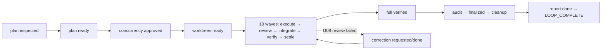

# builtin:parallel-forge Loop `2026-08-26-1104-feat-ralph-causal-diagnosis-evidence-loop-plan` 运行链路诊断报告

> 生成时间：2026-08-27。诊断只读本次 run 的 `.ralph/` 产物；`history_search=disabled`。

## 0. 产物盘点（Phase 0）

**execution_capabilities 推断结果：`[supervisor, wave]`。** preset 在 `presets/en/parallel-forge.yml:171-172` 声明 `event_loop.supervisor.enabled: true`；hat instructions 在 `:311`、`:658`、`:709-712` 使用 `ralph wave emit/verify`；主 events 在第 6 行起已有 `wave_id`。`.ralph/supervisor.db` 存在。

| Tier | 路径 | 存在 | 行数/状态 | 备注 |
|---|---|---:|---:|---|
| S | `.ralph/current-events` → `events-20260826-130444.jsonl` | ✅ | 106 | 唯一主事件账本；含 10 个 `exec.wave.complete`、终态 `LOOP_COMPLETE` |
| S | `.ralph/events-history-20260826-130444.jsonl` | ✅ | 2 | 仅旁路历史，不作拓扑 SSOT |
| S | `.ralph/recovery.jsonl` | ✅ | 16 | 全部 `repair_dispatch` / `plan.blocked`，无持久最终 recovery record |
| A | `.ralph/agent/tasks.jsonl` | ✅ | 22 | 22/22 closed，loop_id 一致 |
| A | `summary.md` / `handoff.md` | ✅ | 47 / 71 | 终止后产物；summary 标记 Completed successfully |
| B | `.ralph/diagnostics/2026-08-26T21-04-44/` | ✅ | MINIMAL | bundle finalized；runtime trace 430 行 |
| B | `runtime-trace.jsonl` activation outcomes | ✅ | 82 | 80 merged，2 empty |
| B | `feedback.jsonl` | ✅ | 0 | evidence gap，不判作业务失败 |
| B | `orchestration.jsonl` / `agent-output.jsonl` | ❌ | — | MINIMAL 下预期缺失，OPAC 降级 |
| B | `.ralph/supervisor.db` | ✅ | — | supervisor capability 所需账本存在 |
| C | `.ralph/forge/<plan-key>/` | ✅ | 多 wave/unit 产物 | 11 unit、10 wave、final audit/report/cleanup 均有 |
| C | `orphan-emit-*.md` | ✅ | 73 个 | subtree `.ralph/events.jsonl` 被识别为 orphan |
| C | `channel-routing-fallback-*.md` | ✅ | 2 个 | integrator、forge-dispatcher 各 1 次 merge failure |

Bundle 的 `manifest_status=finalized`、trace `sequence=1..430` 单调且无坏行；但 bundle 自身的 `execution_capabilities=["runner"]` 与上述可观测事实矛盾，记录为 DEV-001。

## 1. 结论摘要

### 1.1 健康度

- **判定：部分偏离，但业务闭环成功。** 主账本按 `forge.start → plan → guardian → worktree → 10 waves → full verified → audit → finalized → cleanup → report → LOOP_COMPLETE` 完整收敛。
- P0：0；P1：2；P2：0；未核实疑点：1。
- 最高主因置信度：DEV-001 / **85/100**（MINIMAL 模式封顶）。
- 历史复发：`N/A (history disabled)`。

### 1.2 强制四问

| # | 问题 | 答案 | 一句证据 | 置信度 |
|---|---|---|---|---:|
| Q1 | 整体执行与 OPAC 是否合规？ | ⚠️ 业务执行合规；OPAC 证据降级 | MINIMAL：82 activation outcome、106 主事件；无 orchestration/agent-output，Precheck 不能逐调用确认 | 75 |
| Q2 | 基座机制是否正常生效？ | ⚠️ 大体生效，channel merge 有两次失败 | fallback 文件 2 个；但主事件仍完成，`activation_outcome` 与 fallback 交叉一致 | 85 |
| Q3 | 编排是否合理、正常运行？ | ✅ | 10 个 wave、11/11 unit done、10/10 wave settled/verified；U08 失败后 correction 再审通过 | 85 |
| Q4 | 问题归因：机制 vs 编排 vs agent？ | 主要是 mechanism（diagnostic capability labeling）+ mechanism（channel routing）；不是 agent/preset 主故障 | `inner.rs:661-668` 只生成 supervisor/isolated/single-chain；`activation_outcome_close.rs:82-103` 明确 fallback | 85 |

### 1.3 根因一句话

业务链路按预期完成；可见缺陷是运行器在最终 manifest 中把 supervisor+wave 运行错误标为 `runner`，并在两次 isolated hat activation 中 merge channel 失败后依赖 fallback 将结果落入主账本。

### 1.4 终态时序一致性

| 项目 | 内容 |
|---|---|
| 首轮终态 | 首轮最终成功：accepted `forge.report.done`（events 第 105 行）后 accepted `LOOP_COMPLETE`（第 106 行） |
| 恢复状态 | 有局部恢复：U08 在第 74 行 `forge.wave.review.failed` 后，第 76 行 correction done、第 77 行重新 accepted；不是失败终态后恢复 |
| 最终代码状态 | finalizer 报告 target commit `d0938a43`；主 run worktree 保留 orchestrator auto-commit `36962f71`，符合 worktree/integration 分离 |
| 一致性告警 | 两次 channel merge failure 未改变主账本终态，但降低 isolated channel 证据完整度 |

## 2. 执行链路对比

| 阶段 | 预期 | 实际 | 结果 |
|---|---|---|---|
| 计划检查/规划 | inspector → planner | `forge.plan.inspected` → `forge.plan.ready` | ✅ |
| 并发审批/工作树 | guardian → worktree | `forge.concurrency.approved` → `forge.worktrees.ready` | ✅ |
| 执行 | 11 units，Wave 1 两槽，其余按 execution plan 串行 wave | 11 `exec.unit.ready`、11 `exec.unit.done`、10 `exec.wave.complete` | ✅ |
| review/integrate/verify/settle | 每 wave 闭合 | 各 10 次；U08 多一次 review failure + correction 后闭合 | ✅，带恢复 |
| 全量门禁 | `forge.full.verified` | accepted，payload `all_required_passed=true` | ✅ |
| 收尾 | audit → finalize → cleanup → report → LOOP_COMPLETE | events 第 101–106 行 | ✅ |

## 3. 历史问题上下文

`N/A (history disabled)`。本次未扫描 `docs/report/`、`docs/solutions/`、`docs/plans/`、`docs/brainstorms/`。

## 4. 证据清单

| ID | 描述 | 证据锚点 | 严重度初判 | 置信度初估 | 已计分证据项 | 证据缺口 |
|---|---|---|---|---:|---|---|
| DEV-001 | finalized bundle capability 错误：实际 supervisor+wave，bundle 写成 runner | `diagnosis-input.json`；`events-...jsonl` 第 6 行起有 wave_id；`presets/en/parallel-forge.yml:171-172`；源码 `inner.rs:661-668`、`inner.rs:388-401` | P1 | 85 | file:line +25；双账本 +20；preset/事件 +15；MINIMAL cap | capability 计算未纳入 wave，finalize 还硬编码 runner |
| DEV-002 | isolated channel merge 失败，fallback 写主账本 | `channel-routing-fallback-2026-08-26T20-22-15.md`、`...20-31-30.md`；trace sequence 366/386 的 empty outcome；主 events 仍有后续 accepted | P1 | 85 | file:line +25；双账本 +20；activation row +10；Tier C +10（封顶） | 无 orchestration/agent-output，无法确认根因是权限、marker 还是并发时序 |
| DEV-003 | 73 个 subtree orphan emit 诊断文件反复出现 | `.ralph/diagnostics/orphan-emit-*.md` 73 个；source `hat_channel.rs` orphan scan | P2 初判 | 50 | Tier C +10；单账本 | 没有第二账本与 agent-output，无法定为真实业务事件丢失 |

### 4.1 OPAC 逐 hat 审计表（MINIMAL）

| Hat | O | P | A | C | 证据 | 置信度 |
|---|---|---|---|---|---|---:|
| inspector / planner / guardian / worktree | ✅ | ⚠️ | ✅ | ✅ | activation merged；主 events accepted；无 agent-output | 70 |
| forge-dispatcher | ✅ | ⚠️ | ⚠️ | ✅ | 多次 candidate→accepted；一次 empty/fallback；无法逐调用确认 policy-check | 65 |
| executor | ✅ | ⚠️ | ✅ | ✅ | 11 unit done、11 task closed；无 tool_call 序列 | 70 |
| reviewer / integrator / verifier | ✅ | ⚠️ | ⚠️ | ✅ | U08 有一次 review failed 后 correction；两次 channel fallback | 65 |
| tester / auditor / finalizer / cleanup / reporter | ✅ | ⚠️ | ✅ | ✅ | final event chain accepted；无 agent-output | 70 |

结论：OPAC 不能在 MINIMAL 模式下宣称逐 tool-call 合规；这不是 P0，且不能仅凭“未见 policy-check”归责 agent。

### 4.2 Activation outcome 对账

共 82 条：80 `merged`，2 条异常如下；其余 merged 行均有非空 channel、backend exit 0、merge succeeded。

| sequence | hat | status | backend | merge | channel bytes | terminal obligation | classification | confidence | evidence |
|---:|---|---|---:|---|---:|---|---|---:|---|
| 366 | integrator | empty | 0 | false | 0 | integrated/settled/integration.failed/work.failed 等 | channel_routing_failure | 85 | runtime-trace；fallback `20-22-15`；主 events 后续 accepted |
| 386 | forge-dispatcher | empty | 0 | false | 0 | unit.ready/wave.prepare/development.done | channel_routing_failure | 85 | runtime-trace；fallback `20-31-30`；主 events 后续 accepted |

两条 `empty` 不归 agent 未 emit：第一条的 `accepted_event_count=1`，第二条是 `candidate_event_count=0` 且有 fallback；已有主账本终态成功，满足“事件仍可由 fallback 保留”的解释，但不足以证明底层失败原因。

## 5. 问题归因表

| 优先级 | 问题 | 根因分类 | 置信度 | 证据 DEV | 已计分证据项 | 历史关联 | 加深轮次 |
|---|---|---|---:|---|---|---|---|
| P1 | bundle capability 与真实运行能力不一致，削弱诊断门控 | mechanism / diagnostic_capture_contract | **85** | DEV-001 | file:line(+25)+双账本(+20)+preset/事件(+15)，MINIMAL 封顶 85 | N/A (history disabled) | 1：源码反查 + bundle/事件对账 |
| P1 | isolated channel merge 两次失败，依赖主账本 fallback | mechanism | **85** | DEV-002 | file:line(+25)+双账本(+20)+activation(+10)+Tier C(+10)，MINIMAL 封顶 85 | N/A (history disabled) | 1：源码反查 + fallback/trace/events 对账 |

## 6. 修复建议（仅人工执行）

### 6.1 短期

- 目标：确认本次两次 fallback 的底层 filesystem/marker 原因。改动：人工检查两个 fallback 时间点对应的 channel path、权限和 `current-hat-events` 生命周期。预期：区分并发时序、marker stale 与文件系统失败。关联置信度：85。
- 目标：消费本次成果。改动：人工以 `forge.report.done` 的 `report_path` 和 target commit `d0938a43` 为交付入口，不以 primary run worktree HEAD 作为 integration 结果。预期：避免误判 worktree 未变化。关联置信度：90。

### 6.2 中期

- 目标：修正 capability manifest。改动：让 capability 推断统一包含 supervisor 与 wave，并让 finalization 传递实际集合，而不是 `inner.rs:401` 的固定 `["runner"]`。预期：`ralph diagnose` 能正确启用 supervisor/wave 对账。关联置信度：85。
- 目标：减少 orphan emit。改动：人工针对 73 个 orphan 的共同路径核查 wave worker 的 workspace/env 注入；不要把 orphan 文件直接当作 accepted 主事件。预期：降低重复恢复与证据噪声。关联置信度：65。

### 6.3 长期

- 目标：提高 OPAC 可审计性。改动：在后续 run 启用并保留 orchestration/agent-output 证据，或提供等价的有界决策收据。预期：能确认每个 hat 的 Observe/Precheck/Apply/Confirm，而不是 MINIMAL 弱推断。关联置信度：70。

## 7. 未核实疑点

| 候选问题 | 当前置信度 | blocked_by | 已做加深 |
|---|---:|---|---|
| 73 个 orphan emit 是否实际造成业务事件丢失，还是仅为重复/已确认事件的 subtree 残留 | 50 | 缺 agent-output、缺对应 accepted/rejected candidate 的完整映射 | 已查 orphan 清单、主 events、activation outcomes；无足够双账本证据，不驱动修复结论 |

## 8. 盲区声明

本报告未扫描历史目录；未读取非 `current-events` 指向的其他 events 文件作为拓扑 SSOT；未把 `.ralph/supervisor.db` 内容当作主事件依据。由于 diagnostics 为 MINIMAL，OPAC 与 agent 归因受证据上限约束；`feedback.jsonl` 为空、`orchestration.jsonl` 与 `agent-output.jsonl` 缺失均记录为 evidence gap。
