# post-merge-converge Loop `primary-20260906-143240` 运行链路诊断报告

> **生成时间**: 2026-09-06；**补记**: 2026-09-07（中间链路末 hat / `report_path` 契约 / OPAC Observe）
> **诊断对象**: `.ralph/`（loop_id=`primary-20260906-143240`，启动 2026-09-06T14:32:40Z → history `loop_completed` 2026-09-06T15:07:01Z）
> **对照 preset**: `presets/en/post-merge-converge.yml` + `presets/schemas/post-merge-converge.yml`
> **配置 overlay**: `ralph.post-merge.yml`（`prompt_file: .ralph/post-merge.prompt.md`）
> **执行方式**: 4 sub-agent（A 流程 / B 历史 full / C 对账 / D 归因）→ 主 Agent 汇总
> **Diagnostics 模式**: MINIMAL（session 存在，无 `orchestration.jsonl`）
> **history_search**: `full`
> **execution_capabilities**: `["single-chain"]`
> **报告仓库**: `ralph-orchestrator` 主仓（run 即主仓工作区，无独立 worktree）
> **Tier C 根**: `.ralph/post-merge/`
> **置信度规则**: §5 仅 `status == complete` 且 DT7 `confidence > 85`；本次 `incomplete` / 74 → 全部进 §7

---

## 0. 产物盘点（Phase 0 必附）

**execution_capabilities 推断结果**: `["single-chain"]`

| 信号 | 结果 |
|------|------|
| YAML `event_loop.supervisor.enabled` | 未声明（默认关）；preset 全文无 `supervisor` 键 |
| hat instructions `ralph wave emit` / `WAVE CONTEXT` | 无 |
| Intent `execution_model` | 无；bundle `execution_capability: single-chain` |
| events `wave_id` | 0 条 → **N/A (capability 不要求)** |
| `.ralph/supervisor.db` | 存在（180224 B）→ **N/A (capability 不要求)**；`ralph inspect loop` JSON **有** `supervisor` 键（盘上可打开账本），不否定 single-chain |
| bundle | `schema_version=run-diagnosis-input/v2`，`manifest_status=finalized` |

**Diagnostics 模式**: MINIMAL（session `2026-09-06T22-32-40` 有 `runtime-trace.jsonl` / `diagnosis-input.json`，**无** `orchestration.jsonl`）。

**环境异常**: 诊断时 `ralph run -c ralph.post-merge.yml -H builtin:post-merge-converge` pid **14977** 仍在；`.ralph/loop.lock` 存在（0 字节）；`loops.json` 为 `{"loops":[]}`。`ralph diagnose --legacy/--causal` 退出码 0。未把 diagnose 退出码当 bundle 状态。

| Tier | 路径 | 存在 | 行数 | 备注 |
|------|------|------|------|------|
| S | `.ralph/current-events` → `.ralph/events-20260906-143240.jsonl` | 是 | 12 | 唯一 events |
| S | `.ralph/events-history-20260906-143240.jsonl` | 是 | 2 | 非编排 SSOT |
| S | `.ralph/ledger.jsonl` | 是 | 24 | 含 LOOP_COMPLETE reject + honor |
| S | `.ralph/recovery.jsonl`（workspace） | 否 | — | 条件未满足 |
| S | `.ralph/history.jsonl` | 是 | 2 | started + completed `completion_promise` |
| S | `.ralph/loops.json` | 是 | — | `loops: []` |
| S | `.ralph/current-loop-id` | 是 | — | `primary-20260906-143240` |
| S | `.ralph/loop.lock` | 是 | 0 B | 进程仍在 |
| S | `.ralph/diagnostics/logs/ralph-*.log` | 是 | 2 文件 | CLI 日志 |
| A | `.ralph/agent/tasks.jsonl` | 否 | — | `tasks.enabled: false` 预期 |
| A | `.ralph/agent/progress.md` | 否 | — | 预期 |
| A | `.ralph/agent/summary.md` | 是 | — | 「Completed successfully」 |
| A | `.ralph/agent/handoff.md` | 是 | — | 终止后 session handoff |
| A | `.ralph/agent/accepted-transitions.jsonl` | 是 | 9 | 全部 `delivered=false` |
| B | diagnostics session | 是 | — | MINIMAL |
| B | `diagnosis-input.json` | 是 | — | finalized / v2 |
| B | `runtime-trace.jsonl` | 是 | 69 记录 | `record_count=69`，`monotonic_sequences=true` |
| B | `feedback.jsonl` | 空文件 | 0 | evidence gap |
| B | session `recovery.jsonl` | 是 | 1 | `agent_doc_sync` only |
| B | `drift.jsonl` | 空 | 0 | |
| B | `evidence-window.jsonl` | 否 | — | freeze_window=0 |
| B | `orchestration.jsonl` | 否 | — | MINIMAL 预期 |
| B | `.ralph/supervisor.db` | 是 | — | N/A (capability) |
| B | channel-routing-fallback `2026-09-06T15-07-01` | 是 | — | `hat=ralph` `merge_hat_channel_failed` |
| C | `.ralph/post-merge/01-baseline.md` … `15-final-review.md` | 是 | — | 03–08 / 09 为短路 stub |
| C | `.ralph/post-merge/REPORT.md` | 是 | — | operator 报告；verdict FAIL |
| C | `.ralph/post-merge/findings/` | 否 | — | 未触发 Finding 落盘 |
| C | `ralph.yml` / `ralph.post-merge.yml` | 是 | — | overlay 使用后者 |

**activation_outcomes**: present — 10 行 `phase=activation`/`kind=hat_activation_outcome`（9× `merged` + 末次 `hat=ralph` `empty`）。

**缺失产物 → 故障判定**: `supervisor.db` / `wave_id` **不记故障**。

**盲区**: MINIMAL → OPAC 置信度硬顶 70；无 agent-output；活进程可能继续写账本。

---

## 1. 结论摘要

### 1.1 健康度

- **判定**: 部分偏离。主链 8 hat 按短路协议跑完，业务终态 **FAIL**。**中间收口路的最后一个激活不是 `reporter`，而是伪 hat `ralph`（empty / `merge_hat_channel_failed`）**。根因是首轮 `postmerge.complete.report_path` 用了 `.ralph/` 相对路径 `post-merge/REPORT.md`，admission 按 workspace-root 拼接后 `completion_artifact_unreadable`，stall-detector 以 `loop_stalled_max_iterations` 注入 `plan.blocked`。ledger 随后因第二条 workspace-relative 路径 honor；DT7 仍 incomplete。
- **P0 / P1 / P2 数量**（均为 status=complete）: **0 / 0 / 0**（DT7 未过门）
- **最高优先级根因置信度**: 无 §5 行；机检 `causal.confidence.total=74`，`status=incomplete`
- **历史复发**: 同 preset 仅 2026-08-17 一份诊断（`proceed=false` 短路 + complete **honored**）。`completion_artifact_unreadable` × duplicate `postmerge.reviewed` × PMI-007 **组合为新问题模式**。跨 preset 家族（empty channel / stall / LOOP_COMPLETE reject）有同构，不可直接套根因。

### 1.2 强制四问（debug.md）

| # | 问题 | 答案 | 一句证据 | 置信度 |
|---|------|------|----------|--------|
| Q1 | 整体执行与 OPAC 是否合规？ | ⚠️ | 拓扑闭环；OPAC **MINIMAL 上限 70**，logs 0 命中 `--policy-check`，不得升 P0 | 编排 80 / OPAC ≤70 |
| Q2 | 基座机制是否正常生效？ | ⚠️ | `verify_completion_artifact_paths` 按 **workspace-root** join；schema `field_docs` 写「相对 `.ralph/`」。LOOP_COMPLETE 拒收后 stall `loop_stalled_max_iterations` | 受 DT7 74 封顶 |
| Q3 | 编排是否合理、正常运行？ | ⚠️ | 主链短路合理；**收口路末节点变成 `ralph` 而不是 `reporter`**（stall 伪 hat） | 70 |
| Q4 | 问题归因：preset / runtime / agent / backend / capture？ | 操作者可见层 = **preset 文档 vs runtime 门** + agent 填错路径；机检仍标 runtime 且 incomplete | schema L379 vs `wave_scope.rs:1375`；events L11；AT L9 stall | 操作者路径 **对账闭合**；DT7 **74 incomplete 不得入 §5** |

### 1.3 根因一句话

**操作者可见（收口失败）**：上一轮 `postmerge.complete` 的 `report_path` 是 `"post-merge/REPORT.md"`（按 schema `field_docs`「相对 `.ralph/`」填写）。`verify_completion_artifact_paths`（`wave_scope.rs:1375`）执行 `workspace_root.join(relative_path)`，期望 **workspace-root 相对路径** `.ralph/post-merge/REPORT.md`。join 结果是仓库根下不存在的 `post-merge/REPORT.md` → `canonicalize` 失败 → `completion_artifact_unreadable`。随后 isolated 无进展 3 轮，stall-detector 发 `plan.blocked{reason=loop_stalled_max_iterations}`，下一激活 hat 变成伪 hat **`ralph`**（不是 `reporter`）。

**DT7 机检（不得入 §5）**：`primary_domain=runtime`，`commit_receipt` 缺口，total **74** / `incomplete`。

**业务 FAIL** 仍来自 baseline PMI-007 短路，与路径门是另一层。

### 1.4 终态时序一致性（event-artifact chronology）

| 项目 | 内容 |
|------|------|
| **首轮终态（initial_terminal_status）** | 首轮 closer `postmerge.reviewed` **FAIL**（events L8）；首轮 `postmerge.complete` `success=false`（L11）被接受为业务事件，但 **LOOP_COMPLETE rejected**（`completion_artifact_unreadable`） |
| **恢复状态（recovery_status）** | 失败终态后恢复：`report_path` 改为 `.ralph/post-merge/REPORT.md` 后第二条 `postmerge.complete` 被 accept，ledger `completion_honored` |
| **最终代码状态（final_code_state）** | HEAD 仍为 `c94083c8607cff1fb03e0b3b41c1e2e79b528717`；无生产代码修改；REPORT.md 结论 FAIL |
| **一致性告警** | ⚠️ 失败终态后恢复：首轮 completion artifact 门失败；中间路被 stall 拉成 hat=`ralph`。**禁止**把 `summary.md`「Completed successfully」读成业务 PASS。业务 verdict 全程 FAIL。 |

### 1.5 中间收口路：最后一个 hat 不是 reporter

拓扑期望：`postmerge.reviewed` → **`reporter`** → `postmerge.complete` → runtime 合成 `loop.complete` 过 admission。

实际中间路（reporter 首轮失败之后）：

| 时刻 (UTC) | 谁 | 账本 | 问题 |
|------------|----|------|------|
| 15:04:22 | **reporter**（唯一一次 `merged` outcome seq 55） | events L11 `report_path=post-merge/REPORT.md` | 业务事件被 accept |
| 15:04:40 | runtime | ledger L20 `loop.complete` **rejected** `completion_artifact_unreadable` | 合成终态没过 admission |
| 15:04:40 | **stall-detector**（非 preset hat） | accepted-transitions L9 `topic=plan.blocked`；logs：`no progress for 3 turns` → `loop_stalled_max_iterations` | **主 events 没有 `plan.blocked`** |
| 15:07:01 | 伪 hat **`ralph`**（outcome seq 68 `empty` / `merge_succeeded=false`） | channel-routing-fallback `merge_hat_channel_failed`；events L12 仍盖 `hat: reporter` | **图上最后一个激活是 `ralph`，不是 `reporter`** |

`ralph` 只允许发 control topic（`completion_and_termination.rs` publish_event 门），不是 preset 的 8 hat 之一。TUI/链路中间那条路停在 `ralph`，就是这条 stall/correction 旁路，不是 reporter 正常收口。

修复语义（操作者陈述，非 DT7 §6）：用 **workspace-root 相对路径** `.ralph/post-merge/REPORT.md` 重发 `postmerge.complete`，让后续自动生成的 `loop.complete` 通过 admission。events L12 已是该格式；ledger L24 `completion_honored`。

### 1.6 OPAC Observe 补证（2026-09-07）

按 Observe → Precheck → Apply → Confirm 的 Observe 步复验文件门（与 `wave_scope.rs:1375` 同一坐标系：workspace-root）：

```text
test -f .ralph/post-merge/REPORT.md && echo "REPORT exists"
```

| 检查 | 结果 |
|------|------|
| `.ralph/post-merge/REPORT.md` | **存在**，**9026** bytes，可读 |
| 仓库根 `post-merge/REPORT.md` | **不存在**（即 L11 路径 join 后的目标） |
| 正确 `report_path` 字面 | `.ralph/post-merge/REPORT.md` |

### Prompt visibility 对账

命令：`ralph -H builtin:post-merge-converge inspect prompt --hat reporter --format json`（单独 `-c ralph.post-merge.yml` 无 hats，hat not found）。

| 字段 | 值 |
|------|-----|
| `auto_inject[].name` | `ralph-tools`、`ralph-tools-memories`、`ralph-tools-opac` |
| `on_demand[].name` | `ralph-tools-cmdref`、`ralph-tools-emit`、`ralph-tools-precheck`、`ralph-tools-recovery-directives`、`ralph-tools-tasks`、`ralph-tools-wave` |

reporter `instructions` 要求先 `ralph tools skill load ralph-tools-emit` 再构造 payload，与 `on_demand` 中的 emit **一致**（非 `inject_claim_false`）。`tasks.enabled: false` 下 tasks skill 在 on_demand 合理。未见把内部模块名写进 auto_inject 清单本身；MINIMAL 无 agent-output，无法证明该轮真的 load 了 emit skill。

---

## 2. 执行链路对比图

### 2.1 拓扑激活表

| hat | 激活次数 | status | 备注 |
|-----|----------|--------|------|
| baseline | 1 | merged | `baseline_valid=false` |
| change-mapper | 1 | merged | `proceed=false` `scope_status=blocked` |
| system-auditor | 1 | merged | stub 六维 |
| test-gap | 1 | merged | `proceed`/`count` 为字符串 |
| reproducer | 1 | merged | 未发 `reproduce.next` |
| fixer | 1 | merged | 未发 `fix.next`；`passed=false` |
| closer | 2 | merged×2 | events 3 条 reviewed |
| reporter | 1 | merged | **仅 seq 55 一次**；events 却有 2 条 complete（L12 落在 iter10 / hat=`ralph` 批次） |
| `ralph`（伪 hat，**不是 reporter**） | 1 | **empty** | 中间收口路**末节点**；`merge_succeeded=false`；`terminal_obligation_topics=[]` |

### 2.2 时间轴对比表

| 步 | 预期 | 实际 | 标记 |
|----|------|------|------|
| 1 | `postmerge.start` | events L1 | ✅ |
| 2 | `baseline.ready` | L2 | ✅ |
| 3 | `changemap.ready` | L3 | ✅ |
| 4 | `audit.ready` | L4 | ✅ |
| 5 | `testplan.ready` | L5 | ✅ |
| 6 | `reproduce.ready`（可选 next） | L6；无 next | ✅ / ⏸️ |
| 7 | `fix.ready`（required_events） | L7；无 next | ✅ / ⏸️ |
| 8 | `reviewed` ×1 | L8–L10 ×3 | ⚠️ |
| 9a | `reporter` 发 `complete` | L11 `report_path=post-merge/REPORT.md`（`.ralph/` 相对） | ❌ admission |
| 9b | `loop.complete` | ledger reject `completion_artifact_unreadable` | ❌ |
| 9c | stall `plan.blocked` | AT L9 `loop_stalled_max_iterations`；主 events 无 | ⚠️ 旁路 |
| 9d | 末激活应为 `reporter` | **实际 hat=`ralph` empty**（seq 68） | ❌ |
| 9e | 纠偏 `complete` | L12 `.ralph/post-merge/REPORT.md` → honor | ⚠️→✅ |

### 2.3 mermaid

```mermaid
flowchart LR
  S["postmerge.start"] --> B["baseline.ready"]
  B --> C["changemap.ready"]
  C --> A["audit.ready"]
  A --> T["testplan.ready"]
  T --> RR["reproduce.ready"]
  RR --> FR["fix.ready"]
  FR --> R1["reviewed L8"]
  R1 --> R2["reviewed L9 extra"]
  R1 --> R3["reviewed L10 closer iter8"]
  R2 --> REP["reporter merged seq55"]
  R3 --> REP
  REP --> P1["complete L11 report_path=post-merge/REPORT.md"]
  P1 --> REJ["loop.complete rejected unreadable"]
  REJ --> STALL["stall-detector plan.blocked loop_stalled_max_iterations"]
  STALL --> X["末 hat=ralph empty 不是 reporter"]
  X --> P2["complete L12 path=.ralph/post-merge/REPORT.md"]
  P2 --> HON["completion_honored"]
```



中间那条路在 `STALL → ralph` 处偏离：最后一个 **activation** 不是 `reporter`。

终止：`history.jsonl` `loop_completed` `reason=completion_promise`。preset 8 hats 均走过；**额外**伪 hat `ralph` 出现在收口旁路。

---

## 3. 历史问题上下文

> **⚠️ 启用条件**：`history_search=full`。

| # | problem_type | 关联 | 闭环 | 摘要 |
|---|--------------|------|------|------|
| B-01 | postmerge `proceed=false` 短路 | **高** | 是 | 2026-08-17 同 preset：无效 scope_base → FAIL complete **honored**（非 unreadable） |
| B-02 | `postmerge.complete` 失败路径契约 | **高** | 是 | 失败走 `success:false`，不是 `plan.blocked` |
| B-03 | 终态产物可读性门禁计划 | **高（同构）** | 计划已合 | `docs/achieved/plan/2026-08-15-2211-fix-terminal-artifact-admission-plan.md` |
| B-05 | LOOP_COMPLETE rejected（缺 required topic） | 中 | 部分 | 历史主因是缺 topic，不是缺可读文件 |
| B-06 | `merge_hat_channel_failed` | 中 | 部分 | 历史多为锚点而非 merge 实现根因 |
| B-07 | stall → `plan.blocked` | 中 | 部分 | 空 channel 抢在 MissingEventGate 前 |
| B-10/11/12 | PMI-007 / duplicate reviewed / `completion_artifact_unreadable` 字面 | **高（缺口）** | n/a | 允许目录 **0 命中** |

**本次为新问题模式**（组合症状无先例）。`hat_handoff` / `loop_state_snapshot.json` / `human.guidance` 标旧机制，不对账。

本次扫描窗口：full (full-history)

---

## 4. 证据清单

| ID | 描述 | 证据锚点 | 严重度 | DT7 分项来源 | 缺口 |
|----|------|----------|--------|--------------|------|
| DEV-001 | 首轮 `report_path=post-merge/REPORT.md`（`.ralph/` 相对）。runtime `workspace_root.join`（`wave_scope.rs:1375`）去打开仓库根 `post-merge/REPORT.md`（不存在）→ `completion_artifact_unreadable`。schema `field_docs` L379 写「path relative to `.ralph/`」，与门禁 **workspace-relative** 矛盾；examples 却是 `.ralph/post-merge/REPORT.md`。 | events L11；ledger L20；logs L53；`wave_scope.rs:1373-1384`；schema L378–382；§1.6 `test -f` 9026 B | 初判 P1 | correlation(+14) | DT7 incomplete 不得升 §5 |
| DEV-002 | closer 路径同样写成 `post-merge/14-…`（schema 同款「相对 `.ralph/`」文案）；**不**走 completion admission，policy 仍 accept | events L8–L10；schema L351–356 | 初判 P1 | correlation(+14) | 无 agent-output |
| DEV-003 | AT 9 行 `delivered=false`；fix_point `07bb057e…` 无 commit_receipt | accepted-transitions L2；causal `fix_point`；trace `commit_receipt`×0 | 初判 P1 | **integrity(+10)** | 无 join 满额 |
| DEV-004 | LOOP_COMPLETE 拒收后 **无进展 3 轮** → `plan.blocked{reason=loop_stalled_max_iterations}`（stall-detector）。主 events **无**该 topic。下一激活 hat=`ralph` 而非 `reporter`。 | AT L9；logs L56；`event_loop/mod.rs:627-648`；runtime-trace seq 68 | 初判 P1 | integrity / correlation | recovery 无 stall 行 |
| DEV-005 | summary「成功」vs 业务 FAIL | summary.md L3；REPORT.md L11；ledger L24 honor | 初判 P1 | correlation / refutation 抄录 | 主 events 无 LOOP_COMPLETE topic |
| DEV-006 | `hat=ralph` empty + `merge_hat_channel_failed`；不得单凭 empty 定未 emit | runtime-trace seq 68；fallback md | 初判 P1 | freeze_window **0** | 无 evidence-window；无 task.resume envelope |
| DEV-007 | closer 双业务事件；logs extra dropped | events L8–L9；logs L41 | 初判 P2 | correlation | channel 已清理 |
| DEV-008 | pid 14977 仍在；无 freeze 窗口 | ps；loop.lock | 初判 P1 | freeze_window(+0) | 账本可能仍变 |
| DEV-009 | feedback 空 | session feedback 0B | evidence gap | capture 落选 | lifecycle 缺 |
| DEV-010 | test-gap 字段字符串类型 | events L5 | 初判 P2 | coverage 不覆盖类型 | 无 payload_contract 行 |
| DEV-011 | baseline complete unknown activation | logs L10 | 初判 P2 | integrity(+10) | — |
| DEV-012 | MINIMAL 未见 policy-check | logs 0 命中 | 不升 P | — | 无 agent-output |

### 4.1 OPAC 逐 hat 审计表

审计模式 **MINIMAL**，置信度硬顶 **70**。Precheck 全程 ⚠️（无 `payload_contract`）。**未**因缺 orchestration 标 P0。

| Hat | O | P | A | C | 证据 | 置信度 |
|-----|---|---|---|---|------|--------|
| baseline | ✅ | ⚠️ | ✅ | ⚠️ | events L2 merged | 55 |
| change-mapper | ✅ | ⚠️ | ✅ | ⚠️ | events L3；AT L2=fix_point | 60 |
| system-auditor | ✅ | ⚠️ | ✅ | ⚠️ | events L4 | 55 |
| test-gap | ✅ | ⚠️ | ✅ | ⚠️ | events L5 类型 ⚠️ | 50 |
| reproducer | ✅ | ⚠️ | ✅ | ⚠️ | events L6 | 55 |
| fixer | ✅ | ⚠️ | ✅ | ⚠️ | events L7 | 55 |
| closer×2 | ✅ | ⚠️ | ❌/✅ | ⚠️ | L8+L9 双 emit；L10 重入 | 50 |
| reporter | ✅ | ⚠️ | ✅ | ❌ | L11 Confirm 拒收 LOOP_COMPLETE | 60 |
| ralph iter10 | ⚠️ | ⚠️ | ⚠️ | ⚠️ | empty + L12 仍落盘 | 45 |

### 4.2 Activation outcome 表

| sequence | hat | status | backend_exit_code | watchdog | merge_succeeded | channel_bytes | terminal_obligation | classification | confidence | evidence_refs | notes |
|----------|-----|--------|-------------------|----------|-----------------|---------------|---------------------|----------------|------------|---------------|-------|
| 7 | baseline | merged | 0 | false | true | 305 | baseline.ready | successful merge | 60 | events L2 | — |
| 13 | change-mapper | merged | 0 | false | true | 874 | changemap.ready | successful merge | 55 | events L3；AT L2 | commit_receipt 缺 |
| 19 | system-auditor | merged | 0 | false | true | 262 | audit.ready | successful merge | 60 | events L4 | — |
| 25 | test-gap | merged | 0 | false | true | 252 | testplan.ready | successful merge | 55 | events L5 | — |
| 31 | reproducer | merged | 0 | false | true | 238 | next\|ready | successful merge | 60 | events L6 | — |
| 37 | fixer | merged | 0 | false | true | 221 | next\|ready | successful merge | 60 | events L7 | — |
| 43 | closer | merged | 0 | false | true | 592 | reviewed | attempted_but extra event | 50 | events L8–L9 | valid_events=2 accepted=1 |
| 49 | closer | merged | 0 | false | true | 296 | reviewed | successful merge | 55 | events L10 | — |
| 55 | reporter | merged | 0 | false | true | 190 | complete | successful merge then LOOP_COMPLETE fail | 60 | events L11；ledger L20 | — |
| 68 | **ralph（不是 reporter）** | empty | 0 | false | false | 0 | [] | stall 旁路 / channel_routing_failure | 45 | fallback md；AT L9；events L12 仍 stamp reporter | 中间路末节点；禁止单凭 empty 写 agent 未 emit |

### 4.3 Causal Attribution

#### 4.3.1 DT7 分项 + 总置信度

| DT7 项 | 分值 | 实测值（来自 `--causal`） | 来源 |
|--------|------|---------------------------|------|
| coverage | +30 | 30（8/8 covered） | `diagnosis-input.json` `boundary_coverage[]` |
| integrity | +25 | 10 | 三类收据 + ledger；`commit_receipt`×0 |
| refutation | +20 | 20（4/4 落选域） | `rejected_hypotheses[]` |
| correlation | +15 | 14 | contract_receipt seq1 + monotonic |
| freeze_window | +10 | 0 | 无 `evidence-window.jsonl` |
| **总置信度** | **max 100** | **74** | `ralph diagnose --causal` |

#### 4.3.2 被否决假设（rejected_hypotheses）

| 落选域 | 反驳证据类型 | 反驳证据引用 |
|--------|----------------|----------------|
| backend | hat_activation_outcome 无 failure 行 | `runtime-trace.jsonl` `kind=hat_activation_outcome` |
| preset | terminal_topics 可见 | `contract_receipt` `fields.terminal_topics` |
| agent | session_summary 规则匹配到后域 | `session_summary` `locator=terminal` |
| diagnostic_capture_contract | 8 边界 covered | `diagnosis-input.json` `boundary_coverage` |

#### 4.3.3 分数变化（causal_score_change）

| 重新打分原因 | 上次 total | 本次 total | Δ | primary_domain 是否变化 | 落选域反驳新增 |
|--------------|------------|------------|---|--------------------------|------------------|
| N/A (initial scoring) | N/A | 74 | — | — | — |

---

## 5. 问题归因表（DT7 机检，confidence > 85）

| 优先级 | 问题 | primary_domain | status | confidence | 证据 DEV | DT7 分项来源 | rejected_hypotheses | 历史关联 | 加深轮次 |
|--------|------|----------------|--------|------------|----------|--------------|---------------------|----------|----------|

（空表。）`causal_status=incomplete` 且 `confidence=74` 未过 `>85`，全部候选在 §7。

---

## 6. 修复建议

因 DT7 `incomplete` **不提供**由本诊断驱动的执行面修复（§6.1–6.3 仍空）。

操作者已陈述、且账本可核验的补救（**不是** DT7 授权项，记在 §1.5 / §1.6）：

- Observe：`test -f .ralph/post-merge/REPORT.md` → 9026 bytes
- Apply 意图：`report_path` 改为 workspace-root 相对路径 `.ralph/post-merge/REPORT.md` 重发 `postmerge.complete`，让自动生成的 `loop.complete` 过 admission
- Confirm：events L12 + ledger `completion_honored`

---

## 7. 未核实疑点

`blocked_by: DT7 incomplete 74；integrity 缺口 commit_receipt；freeze_window 缺`

| 候选问题 | 当前置信度 | blocked_by | 已做加深 |
|----------|------------|------------|----------|
| 机检 runtime：AT 有行、trace 无 `commit_receipt` | 74（机检 total） | DT7 incomplete 74；integrity 缺口 | L6：`diagnostics/mod.rs` emit_commit_receipt；`causal/rules.rs` rule_runtime |
| freeze 窗口未采集（empty outcome + 活进程） | 分项 0 | freeze_window 缺 | 确认无 evidence-window.jsonl |
| schema「相对 `.ralph/`」vs 门禁 workspace-root join；L11 `post-merge/REPORT.md` 不可读 | —（不得另打分） | DT7 incomplete 74 | `wave_scope.rs:1375` + schema L379；§1.6 文件存在性已核 |
| stall `loop_stalled_max_iterations` 后末 hat=`ralph` 而非 reporter | — | DT7 incomplete 74 | `mod.rs:627-648`；trace seq 68；主 events 无 `plan.blocked` |
| 伪 hat `ralph` empty + `merge_hat_channel_failed` | — | DT7 incomplete 74 | `hat_channel.rs` 空通道；`activation_outcome_close.rs` |
| AT 全部 `delivered=false` vs ledger observation | — | integrity 缺口 | `accepted_transition.rs` 初值 false / ack |
| 业务 PMI-007 使 `baseline_valid=false` 短路整链 | — | 不在 causal 主因 | 01-baseline.md；历史 PMI-007 字面 0 |
| summary 成功文案 vs FAIL | — | DT7 incomplete 74 | summary_writer 语义未在本报告升格 |

### L6 锚点（非 §5 定论）

- `crates/ralph-core/src/event_loop/wave_scope.rs:1373-1384`：`workspace_root.join(relative_path)` → `canonicalize` 失败即 `completion_artifact_unreadable`
- `presets/schemas/post-merge-converge.yml:379`：`report_path` meaning 写「relative to `.ralph/`」（与上条门禁坐标系不一致）；`:382` examples 已是 `.ralph/post-merge/REPORT.md`
- `crates/ralph-core/src/event_loop/mod.rs`：stall-detector / `derive_blocked_topic`
- `crates/ralph-cli/src/loop_runner/hat_channel.rs`：空通道 `hat_channel_empty_after_activation`
- `crates/ralph-cli/src/loop_runner/activation_outcome_close.rs`：`merge_hat_channel_failed`
- `crates/ralph-core/src/diagnosis/causal/rules.rs`：缺 `commit_receipt` → runtime
- `presets/schemas/post-merge-converge.yml` L358–382：`report_path` examples `.ralph/post-merge/REPORT.md`

---

## 附录：bundle / causal 摘要

- `ralph diagnose --legacy --session latest`：bundle `status=finalized`；`runtime_trace.status` present；`feedback` 空 → Missing；warnings 缺 orchestration/errors。
- `ralph diagnose --causal`：`causal.status=incomplete`，`confidence.total=74`，`primary_domain=runtime`，`coverage_gaps=[]`。
- `code_baseline.head_sha`: `c94083c8607cff1fb03e0b3b41c1e2e79b528717`
- `structured_result_ref`: inline: summarized in report
