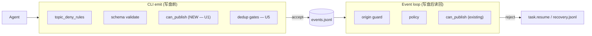

# ce-executor-serial precheck/recovery alignment (merry-lotus follow-up)

## Problem

In the merry-lotus run (`builtin:ce-executor-serial`), the orchestrator's
three independent failure modes compounded into a 41-minute cancelled run:

1. **CLI precheck gap**: agent emits out-of-scope topics (e.g. `executor`
   emitting `debug.step`) — the event lands in `events.jsonl` before the
   loop drops it at runtime, so the agent gets no actionable backpressure
   and the loop runner has to clean up after the fact.
2. **Schema non-compliance in orchestrator payloads**: `build_task_resume_payload`
   produced a JSON object missing the schema-required `reason` and
   `target_hat` fields; drift monitor reported `field_completeness=0%`
   for the recovery channel, blinding the responder to actual recovery
   attempts.
3. **Automated recovery impersonating human guidance**: `missing_event_gate`
   and the "claimed but no event written" hard-gate injected
   `human.guidance` (free-form text) into the events file. `human.guidance`
   is reserved for human/operator input (Telegram RObot or manual emit),
   and the agent cannot act on it as a recovery hint.

A fourth minor mode: `compute_recovery_status` used a substring match on
the task.resume payload to detect a recovery was published for a given
topic — once U2 introduced structured JSON payloads, the substring match
produced false positives (the topic name appears inside the
`allowed_topics` array of any task.resume that mentions it).

## Symptoms

- merry-lotus run terminated at iter 6 with `loop.cancel` x 2 emitted by
  the ralph hat; review chain never closed past the first dimension.
- 8 `debug.step` events from `executor` in `events.jsonl`; all dropped at
  loop runtime by R5 isolated-scope guard; the agent kept emitting them
  because there was no CLI-side rejection.
- `drift.jsonl` showed two `task.resume` findings with
  `field_completeness=0/1=0%` (severity=critical).
- `inject_missing_event_hard_gate_guidance` wrote `human.guidance` to
  `events.jsonl`; the agent received the message but had no schema or
  structural guidance to act on.
- `review-coordinator` emitted `review.dimension.ready(correctness)` at
  07:37:26 and again at 07:37:39; the second was dropped with the message
  "extra business event dropped — only one per turn".

## What Didn't Work

- **Defending on prompt-level discipline only**: prior fixes (e.g.
  `mem-1781582086-e5e6` "stale task.resume + debug.step rejection mode")
  told the agent to verify U commit and emit `work.done` instead of
  `debug.step`. The merry-lotus run shows the prompt-level fix is not
  enough — agents still misbehave, so the mechanism must reject out-of-scope
  emits at the CLI boundary, not after the fact.
- **Putting all recovery semantics on `human.guidance`**: the product
  decision recorded in
  `docs/solutions/developer-experience/agent-execution-contract-gates-2026-06-03.md`
  was that `human.guidance` cannot drive publish-obligation closure
  because the steward does not subscribe to it. merry-lotus confirmed
  this — the `human.guidance` for `dimension-reviewer` had no clear
  recipient, and the agent emitted more `debug.step` instead.
- **Single-turn runtime drop (R5 isolated-mode)**: the runtime
  enforcement was correct (out-of-scope emits should not be on the bus),
  but it surfaced no actionable backpressure to the agent. The
  `extra business event dropped` log was only visible in
  `orchestration.jsonl`, not in `recovery.jsonl` — the agent had no
  signal to read.

## Solution

Five implementation units, each closing one specific gap. The units
land together in a single PR; they are not independent.

### U1 — CLI precheck aligned with `HatRegistry::can_publish`

Add `check_isolated_scope` to `crates/ralph-cli/src/policy_check.rs` and
call it from `commands/emit.rs` after the policy-check block.

```rust
// crates/ralph-cli/src/policy_check.rs
pub fn check_isolated_scope(
    hat: Option<&str>,
    topic: &str,
    config: &RalphConfig,
) -> std::result::Result<(), ValidationError> {
    if config.event_loop.execution_mode != HatExecutionMode::Isolated {
        return Ok(());  // coordinator mode: no-op
    }
    let Some(hat_id) = hat else {
        return Ok(());  // no hat: defer to runtime origin guard
    };
    if hat_id == "ralph"
        && ralph_core::event_origin::RALPH_CONTROL_TOPICS
            .iter()
            .any(|t| *t == topic)
    {
        return Ok(());  // ralph pseudo-hat + control topic: allowed
    }
    let registry = HatRegistry::from_runtime_config(config);
    if registry.can_publish(&HatId::new(hat_id), topic) {
        return Ok(());
    }
    Err(ValidationError {
        payload_index: 0,
        field: "topic".to_string(),
        reason_code: "isolated_scope_violation".to_string(),
        message: format!(
            "isolated scope violation: hat '{hat_id}' is not allowed to \
             publish topic '{topic}'; allowed publishes: {:?}",
            config.hats.get(hat_id).map(|c| c.publishes.clone()).unwrap_or_default(),
        ),
    })
}
```

The gate fires whenever the agent passed `--hat` (or `RALPH_CURRENT_HAT`)
in isolated mode, **independent of `--policy-check`**. Scope is a hard
contract; schema enforcement is a separate opt-in. The `failure.rs` test
`u1_isolated_scope_unknown_hat_rejected` pins the fail-closed branch for
unknown hats (plan §U1 test-scenarios Edge).

### U2 — `task.resume` schema compliance

Update `build_task_resume_payload` in
`crates/ralph-core/src/event_loop/rejection.rs` to always include the
schema-required `reason` (derived from `extract_reason_code(violation)`)
and `target_hat` (resolved from `rejection.target_hat` → `source_hat` →
`business_hat`). Add a fail-closed pre-injection gate
(`task_resume_payload_has_required_fields`) that parses the payload as
JSON and verifies both fields are non-empty strings; if the gate fires,
the bus publish is skipped and `event.isolation.boundary_violation` is
emitted instead.

The `publish_policy_rejection_resume` helper was the worst offender —
its payload was a free-form string. U2 wraps the payload in a JSON
object:

```rust
let reason_code = extract_reason_code(&format!("{}: {}", event.topic, payload));
let target_hat_value = event.hat.clone()
    .filter(|h| !h.is_empty())
    .unwrap_or_else(|| "ralph".to_string());
let structured_payload = serde_json::json!({
    "reason": reason_code,
    "target_hat": target_hat_value,
    "rejected_topic": event.topic.as_str(),
    "source_hat": event.hat.as_deref(),
    "message": payload,
});
```

`enrich_task_resume_payload` is added for the 10 ad-hoc injection sites
in `event_loop/mod.rs` that historically shipped only free-form text;
the helper wraps the free-form message and adds the required
`reason` + `target_hat` (defaulting to `"ralph"` when the caller
passes `None`).

A review pass found **12** `task.resume` injection sites in
`event_loop/mod.rs`; **11** shipped free-form or missing `target_hat`
before U2. All 12 are now schema-compliant.

### U3 — automated recovery uses `task.resume`, not `human.guidance`

Convert `inject_hard_gate_guidance` and
`inject_missing_event_hard_gate_guidance` in
`crates/ralph-cli/src/loop_runner/hard_gate.rs` from `human.guidance`
to `task.resume`. The `pending_recovery_hat` pin and the
`RecoveryDiagnosisEnvelope` write to `recovery.jsonl` are preserved.

`inject_hard_gate_guidance` signature was widened to
`(ctx, event_loop: Option<&mut EventLoop>, hat_id, expected_topics)`
during code review (P1 finding) so the helper can also pin
`pending_recovery_hat` to the offending hat — previously the
"claimed but no event written" path left the pin unset, so the next
iteration could round-robin to an unrelated hat and the `task.resume`
hint would land on a hat that does not own the expected topics.

`inject_wave_policy_rejection_guidance` is **explicitly deferred** (wave
path only, `ce-executor-serial` does not use waves) — comment block
added in-place documenting the follow-up.

### U4 — `ce-executor-serial` preset narrows progress-steward triggers

`presets/en/ce-executor-serial.yml`:

```yaml
progress-steward:
  name: "🛟 Progress Steward"
  description: "Loop-level fallback hat — wakes on stall to read state and emit a single recovery event."
  triggers: ["loop.stalled"]  # was ["loop.stalled", "human.guidance"]
```

The `human.guidance` schema is **retained** for operator/manual emit
(updated comment in `presets/schemas/ce-executor-serial.yml` makes this
explicit); the steward simply does not subscribe. New regression test
`test_ce_executor_serial_progress_steward_only_loop_stalled` in
`crates/ralph-cli/src/presets.rs` pins the trigger list.

### U5 — `review.dimension.ready` policy-layer dedup

Add `review_dimension_ready_seen_keys: HashSet<String>` to
`PolicyRuntimeState` in `crates/ralph-core/src/event_policy.rs`.
`from_events` populates the set from prior `review.dimension.ready`
events (extracts `plan_name` / `step` / `task_id` / `dimension` from
payload); `validate_event_with_hat` rejects a second emit with the same
key using the existing `DuplicateWorkDone` variant (no new
`ViolationType` needed — the recovery flow is identical).

Key: `(plan_name, step, task_id, dimension)`. Different dimensions on
the same step are all accepted (the serial review chain walks four
dimensions per step).

### Code-review-driven P1 fixes (not in the original plan)

- **`compute_recovery_status` now parses the payload as JSON** and
  matches the `rejected_topic` field directly. The old
  `event.payload.contains(topic)` heuristic was fragile — once U2
  introduced structured payloads, a topic like `work.done` could
  substring-match the `target_hat`'s `allowed_topics` array and
  produce a false positive. Extracted helper
  `task_resume_payload_matches_topic` returns `false` on invalid JSON
  (no false-positive match).

- **`test_emit_ce_executor_serial_executor_*` integration tests** in
  `crates/ralph-cli/tests/integration_emit_policy.rs` directly cover
  the merry-lotus root cause path (executor + out-of-scope topic in
  `ce-executor-serial`). The existing
  `test_emit_isolated_mode_allows_matching_hat` only covered
  `ce-executor-isolated`, leaving the very preset that triggered
  merry-lotus without a regression guard.

## Why This Works

The fixes compose along the "**Single Write Gate**" principle (see plan
§High-Level Technical Design):



- **U1** adds a `can_publish` check at the CLI boundary so out-of-scope
  business events are rejected **before** the JSONL write, matching the
  runtime guard. Drift between the two paths is now impossible because
  both call `HatRegistry::from_runtime_config(config).can_publish(...)`.
- **U2** ensures every orchestrator-injected `task.resume` is
  schema-compliant (`reason` + `target_hat` non-empty strings). The
  fail-closed gate catches future regressions where a new injection
  site forgets the wrap.
- **U3** puts the product decision
  (`human.guidance` = human, `task.resume` = automated) into the
  mechanism. The `pending_recovery_hat` pin keeps the next iteration
  focused on the gated hat.
- **U4** removes a `human.guidance` subscription that the serial
  preset does not consume (no RObot/Telegram). The schema is retained
  for operator use, just not subscribed by the steward.
- **U5** dedups the `review-coordinator` repeat-ready bug at the
  policy layer. Reuses `DuplicateWorkDone` variant so the recovery
  path is identical to `work.done` dedup.

The composition matters: a single missing precheck or single malformed
orchestrator payload is enough to re-create the merry-lotus failure
mode, so the units ship together.

## Prevention

- **Add a CLI precheck for any new `hat.publishes` rule**. The pattern:
  a function in `policy_check.rs` that takes `(hat, topic, config)` and
  returns `Result<(), ValidationError>`, called unconditionally from
  `emit_command_with_root_and_hats` after the policy-check block.
  Failure paths must be reachable from a single integration test
  against the *actual* preset (not a synthetic isolated-mode config),
  so future preset changes do not silently re-introduce the precheck
  gap.

- **Verify every orchestrator-injected `task.resume` against
  `task_resume_payload_has_required_fields` before bus publish**. The
  helper returns `false` when the payload lacks `reason` or
  `target_hat` (or both are empty strings, or the payload is not
  valid JSON). Without the gate, a typo in a new injection site
  silently degrades the recovery channel and the drift monitor
  reports it as `field_completeness=0%` days later.

- **Do not let automated recovery impersonate humans**. The
  `inject_hard_gate_guidance` / `inject_missing_event_hard_gate_guidance`
  family must write `task.resume` (structured), not `human.guidance`
  (free-form). A test that asserts `topic=task.resume` after a
  hard-gate event is a low-cost guardrail. The wave variant
  (`inject_wave_policy_rejection_guidance`) is the next to convert;
  the deferred comment in `hard_gate.rs:594` is the marker.

- **Pin `pending_recovery_hat` from every hard-gate path**. The
  `pending_recovery_hat` pin keeps the next iteration on the gated
  hat. Inconsistent pin behaviour (e.g. one helper sets it, the
  sibling does not) lets round-robin drift to an unrelated hat. The
  `u3_pending_recovery_hat_pin_after_task_resume_inject` test in
  `loop_runner/tests.rs` is the regression guard for the U3
  `inject_hard_gate_guidance` path.

- **Match on structured fields, not substring, in recovery status**.
  `compute_recovery_status` previously used
  `event.payload.contains(topic)`, which can match the wrong recovery
  once payloads are structured JSON. Use `serde_json::from_str` and
  match on the relevant field (`rejected_topic` for task.resume).

## Related Issues

- `docs/report/2026-06-17-ce-executor-serial-merry-lotus-review-chain-stalled-diagnosis.md` —
  the merry-lotus diagnosis report; this solution is the U1–U5 portion
  of the 2026-06-17-003 plan.
- `docs/solutions/integration-issues/ce-executor-isolated-preset-dispatch-gap-plan-gate-executor-2026-06-12.md` —
  prior plan-gate→executor dispatch gap. Same root-cause class
  (orchestrator-injected recovery not reaching the right hat) but a
  different mechanism.
- `docs/solutions/developer-experience/agent-execution-contract-gates-2026-06-03.md` —
  records the product decision that `human.guidance` cannot drive
  publish-obligation closure. U3 is the mechanism-level enforcement
  of that decision.
- `docs/plans/2026-06-17-002-feat-ce-executor-serial-review-plan.md` —
  the plan that introduced the `ce-executor-serial` preset. U1–U4
  are the merry-lotus follow-ups from plan 003.
- Memory: `ce-executor stale activation work.done closure` —
  another class of orchestrator-injection problem (HARD GATE silent
  activation); pre-existing but the `task.resume` schema-compliance
  fix in U2 makes the diagnostic path more uniform.
